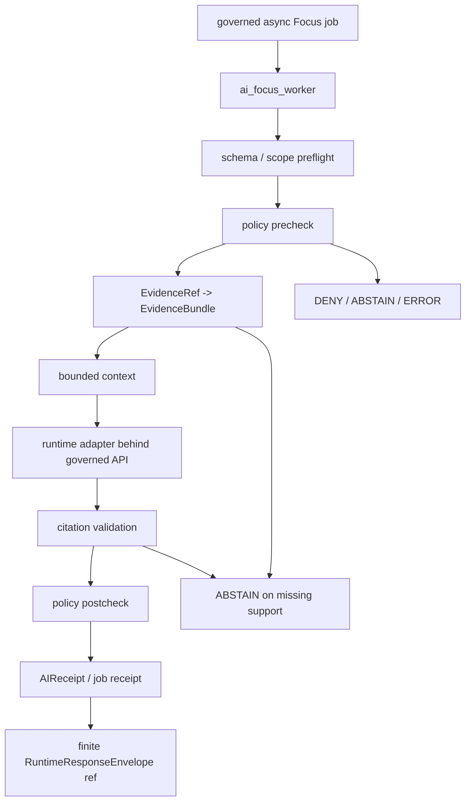

<!-- [KFM_META_BLOCK_V2]
doc_id: kfm://app/workers/src/ai-focus-worker/readme
title: AI Focus Worker README
type: app-readme
version: v0.1
status: draft
owners: OWNER_TBD — Worker steward · Governed AI steward · Evidence steward · Policy steward · Runtime steward · Audit steward · Docs steward
created: 2026-06-16
updated: 2026-06-16
policy_label: public
related:
  - ../README.md
  - ../../README.md
  - ../../../governed-api/README.md
  - ../../../../docs/architecture/governed-ai/FOCUS_FLOW.md
  - ../../../../docs/architecture/governed-ai/BOUNDARIES.md
  - ../../../../docs/architecture/governed-ai/STATE_OWNERSHIP.md
  - ../../../../docs/runbooks/governed_ai_VALIDATION.md
  - ../../../../docs/runbooks/governed_ai_ROLLBACK.md
  - ../../../../policy/focus/
  - ../../../../schemas/contracts/v1/focus/
  - ../../../../schemas/contracts/v1/runtime/
  - ../../../../schemas/contracts/v1/evidence/
  - ../../../../contracts/
  - ../../../../data/README.md
  - ../../../../data/receipts/
  - ../../../../packages/evidence-resolver/README.md
  - ../../../../packages/policy-runtime/README.md
  - ../../../../runtime/README.md
tags: [kfm, apps, workers, ai-focus-worker, focus-mode, governed-ai, evidencebundle, policydecision, citation-validation, aireceipt, runtime-envelope]
notes:
  - "Replaces the greenfield ai_focus_worker stub with a bounded worker-source contract."
  - "This worker may support asynchronous Focus Mode processing only behind governed API and policy/evidence gates; it must not become a browser-to-model shortcut, public trust path, evidence authority, release authority, or model-output truth source."
  - "Worker source files, queue contracts, schemas, fixtures, tests, runtime adapter integration, receipt outputs, deployment state, logs, dashboards, and CI pass state remain NEEDS VERIFICATION."
[/KFM_META_BLOCK_V2] -->

<a id="top"></a>

<div align="center">

# AI Focus Worker

`apps/workers/src/ai_focus_worker/`

**App-local worker-source boundary for asynchronous Focus Mode support: queued Focus jobs, policy/evidence preconditions, EvidenceRef-to-EvidenceBundle resolution support, bounded context assembly, citation validation support, AIReceipt/job receipt emission, finite outcome handling, and safe failure behavior.**


[Purpose](#1-purpose) · [Repo fit](#2-repo-fit) · [Boundary](#3-authority-boundary) · [Inputs](#5-inputs) · [Exclusions](#6-exclusions) · [Worker map](#7-ai-focus-worker-map) · [Definition of done](#14-definition-of-done)

</div>

---

> [!IMPORTANT]
> **Status:** draft / `NEEDS VERIFICATION`  
> **Owners:** `OWNER_TBD` — Worker steward · Governed AI steward · Evidence steward · Policy steward · Runtime steward · Audit steward · Docs steward  
> **Path:** `apps/workers/src/ai_focus_worker/README.md`  
> **Responsibility root:** `apps/` — deployable application surfaces  
> **Truth posture:** CONFIRMED README path / CONFIRMED Workers source boundary / CONFIRMED Focus Flow doctrine / PROPOSED AI Focus worker contract / UNKNOWN source files, queue contracts, schemas, tests, fixtures, runtime behavior, deployment state, and CI pass state

> [!CAUTION]
> The AI Focus Worker must remain downstream of governed API, policy, evidence, and citation gates. It must not receive browser traffic, read raw/canonical lifecycle stores directly, use model output as truth, publish answers, bypass citation validation, bypass policy postcheck, or replace `EvidenceBundle` support with generated language.

---

## 1. Purpose

`apps/workers/src/ai_focus_worker/` is the proposed app-local worker-source home for asynchronous or queued Focus Mode support.

It may eventually contain modules for:

- queued Focus job intake from governed API or an authorized worker queue;
- idempotency and retry handling for Focus jobs;
- request envelope and schema preflight;
- policy precheck and postcheck coordination;
- EvidenceRef-to-EvidenceBundle resolution support;
- bounded context assembly from admissible evidence only;
- server-side model-adapter invocation support where the architecture explicitly permits async processing;
- citation validation support;
- AIReceipt, job receipt, and audit/provenance reference emission;
- finite `ANSWER`, `ABSTAIN`, `DENY`, and `ERROR` outcome handling;
- safe failure states with no claim or protected detail leakage.

This README does not prove that any AI Focus worker source file, queue contract, schema, fixture, test, runtime adapter integration, citation validator, receipt writer, deployment, log, dashboard, or CI pass state exists.

[Back to top](#top)

---

## 2. Repo fit

| Concern | Owning root | Expected relationship |
|---|---|---|
| AI Focus worker source | `apps/workers/src/ai_focus_worker/` | App-local async Focus worker source, if implemented |
| Workers source | `apps/workers/src/` | Worker source boundary and non-publisher enforcement |
| Workers app | `apps/workers/` | Background deployable boundary |
| Governed API | `apps/governed-api/` | Trust membrane, public entry, envelope authority, and audited role boundary |
| Governed AI doctrine | `docs/architecture/governed-ai/` | Focus flow, boundaries, state ownership, validation, rollback doctrine |
| Focus policy | `policy/focus/`, `policy/` | Focus policy gates and decision rules |
| Focus schemas | `schemas/contracts/v1/focus/`, `schemas/contracts/v1/runtime/` | Request, response, finite outcome, and envelope shapes |
| Evidence support | `packages/evidence-resolver/`, `data/proofs/` | EvidenceBundle support and proof context |
| Runtime adapters | `runtime/` | Model/runtime adapters behind governed API only |
| Receipts | `data/receipts/` | AIReceipt, worker receipt, run receipt, citation validation support refs |
| Release authority | `release/` | Publication, correction, rollback authority; not worker-owned |
| Shared packages | `packages/` | Reusable libraries after extraction and review |

## 3. Authority boundary

This worker may support asynchronous Focus processing, but only as a governed worker behind API, policy, evidence, citation, runtime, and receipt controls. It does not own Focus doctrine, public API entry, browser routing, model adapter authority, EvidenceBundle truth, policy decisions, citation truth, schemas, contracts, lifecycle storage, release decisions, publication, review decisions, canonical stores, or UI behavior.

```text
apps/workers/src/ai_focus_worker/ = app-local async Focus worker source
apps/workers/src/                 = worker source boundary
apps/workers/                     = background worker deployable
apps/governed-api/                = trust membrane and Focus entry/envelope authority
docs/architecture/governed-ai/    = governed AI doctrine
policy/focus/ and policy/         = Focus policy and access decisions
schemas/contracts/v1/focus/       = Focus request/response machine shape
schemas/contracts/v1/runtime/     = RuntimeResponseEnvelope shape
packages/evidence-resolver/       = EvidenceRef → EvidenceBundle resolution support
runtime/                          = model/runtime adapters behind governed API
data/receipts/                    = AI/job/citation receipts
release/                          = release, correction, rollback authority
```

## 4. Default posture

The AI Focus Worker should fail closed. A job should not call an adapter, assemble an answer candidate, emit an AIReceipt, or return a terminal envelope reference when any of these are unresolved:

- job source, queue ownership, idempotency key, and authenticated producer;
- governed API request envelope and schema validation;
- FocusModeRequest scope, role, map/context bounds, time/version lock, and allowed transform;
- policy precheck outcome and deny/abstain/error reason codes;
- EvidenceRef-to-EvidenceBundle resolution;
- evidence freshness, release/review authorization, and source-role support;
- sensitivity, rights, consent, redaction/generalization, and release-state posture;
- bounded context construction from admissible evidence only;
- model adapter contract and structured-output requirement;
- citation validation report;
- policy postcheck;
- AIReceipt/job receipt/audit provenance target;
- finite `ANSWER`, `ABSTAIN`, `DENY`, or `ERROR` envelope handling;
- safe error behavior and no raw/internal detail leakage.

## 5. Inputs

| Input family | Examples | Required posture |
|---|---|---|
| Focus job trigger | queue message, governed API async request, retry request | Authenticated, auditable, idempotent |
| Focus request | question, MapContextEnvelope, EvidenceRef list, user role, requested transform | Schema-validated and bounded |
| Policy state | PolicyDecision precheck/postcheck, sensitivity, rights, release state | Policy-runtime derived |
| Evidence state | EvidenceRef list, EvidenceBundle refs, support spans, limitations | Resolver-backed and citation-aware |
| Runtime context | adapter id, model profile, timeout, structured-output contract | Server-side only, behind governed API |
| Citation state | CitationValidationReport, cited spans, failure reasons | Required before `ANSWER` |
| Receipt state | AIReceipt, job receipt, run id, decision refs, timestamp | Durable and auditable |
| Output state | ANSWER, ABSTAIN, DENY, ERROR envelope refs | Finite and validated |

## 6. Exclusions

| Does not belong here | Correct home |
|---|---|
| Browser-to-model or public Focus route | `apps/governed-api/` only |
| Focus doctrine and route maps | `docs/architecture/governed-ai/` |
| Focus schemas and runtime envelope schemas | `schemas/contracts/v1/focus/`, `schemas/contracts/v1/runtime/` |
| Focus policy bundles and access decisions | `policy/focus/`, `policy/` |
| EvidenceBundle truth or proof storage | `data/proofs/`, evidence resolver packages |
| AIReceipt and worker receipt storage | `data/receipts/` |
| Runtime/model adapter implementation | `runtime/` unless explicitly extracted through governance |
| Release decisions, correction notices, rollback cards | `release/` |
| Lifecycle data and canonical stores | `data/` |
| Public UI rendering | `apps/explorer-web/` |
| Review decisions and manual adjudication | `apps/review-console/` |
| Source ingestion and transformations | `connectors/`, `pipelines/`, `pipeline_specs/` |
| Generated answer as authoritative record | Out of scope; generated text is downstream carrier only |
| Deployment-only values | Deployment environment/config channels |

## 7. AI Focus worker map

Exact implementation files remain `NEEDS VERIFICATION`.

| Candidate module | Purpose | Required safeguard | Status |
|---|---|---|---|
| `job_contract` | Queue message and job envelope handling | Closed schema and idempotency | PROPOSED |
| `request_preflight` | Focus request scope and schema validation | Fail closed on invalid input | PROPOSED |
| `policy_precheck` | Policy gate before evidence or adapter work | DENY/ABSTAIN/ERROR terminal handling | PROPOSED |
| `evidence_resolution` | EvidenceRef-to-EvidenceBundle support | No raw-store direct reads | PROPOSED |
| `context_builder` | Bounded admissible evidence context | No RAW/WORK/QUARANTINE bytes | PROPOSED |
| `adapter_runner` | Server-side model adapter call support | Behind governed API, contract-validated | PROPOSED |
| `citation_validator` | CitationValidationReport support | Required before ANSWER | PROPOSED |
| `policy_postcheck` | Answer/citation/sensitivity postcheck | Deny on leakage or policy failure | PROPOSED |
| `receipt_writer` | AIReceipt/job receipt emission | Durable and auditable | PROPOSED |
| `safe_outcomes` | ANSWER/ABSTAIN/DENY/ERROR handling | Closed finite outcomes | PROPOSED |

> [!WARNING]
> Candidate module names are not implementation proof. Do not claim an AI Focus worker module is live until files, queues, schemas, fixtures, tests, policy gates, evidence resolution, citation validation, receipts, and deployment evidence confirm it.

## 8. Diagram



## 9. Worker obligations

| Obligation | Example effect |
|---|---|
| `no_browser_to_model` | Only governed API or authorized worker queue can create Focus jobs |
| `governed_api_aligned` | Worker returns/supports governed envelope refs, not public direct answers |
| `closed_outcomes` | Job ends in ANSWER, ABSTAIN, DENY, or ERROR only |
| `policy_first` | Policy precheck can terminate before evidence or adapter work |
| `evidence_required` | No answer candidate without resolved EvidenceBundle support |
| `bounded_context_only` | Adapter receives admissible, scoped evidence only |
| `citation_required` | Citation validation must pass before ANSWER |
| `policy_postcheck_required` | Generated candidate is checked before release to user-facing envelope |
| `receipt_required` | AIReceipt/job receipt captures process memory and outcome refs |
| `generated_text_not_truth` | Generated language never outranks EvidenceBundle, policy, review, or release state |

## 10. Job contract

Each durable AI Focus worker module or child README should state:

- job purpose and owner;
- authorized producer and trigger type;
- queue message shape and idempotency key;
- accepted request refs and denied inputs;
- policy precheck/postcheck dependencies;
- EvidenceBundle dependency and citation validation dependency;
- runtime adapter contract and timeout posture;
- finite outcome handling;
- AIReceipt/job receipt outputs;
- safe-disable, retry, and rollback path;
- tests and fixtures required;
- open verification items.

## 11. Inspection path

AI Focus worker source files, queue contracts, schemas, tests, fixtures, policy integration, evidence resolver integration, citation validation, runtime adapter integration, receipt outputs, deployment state, logs, dashboards, and emitted artifacts remain `NEEDS VERIFICATION`.

```bash
find apps/workers/src/ai_focus_worker -maxdepth 7 -type f | sort
find apps/workers apps/governed-api docs/architecture/governed-ai policy schemas contracts data runtime packages tests fixtures -maxdepth 7 -type f 2>/dev/null | grep -Ei 'focus|FocusMode|RuntimeResponseEnvelope|AIReceipt|CitationValidationReport|EvidenceRef|EvidenceBundle|PolicyDecision|adapter|model|queue|worker|receipt|ANSWER|ABSTAIN|DENY|ERROR|test|fixture' | sort
```

## 12. Validation expectations

Useful validation for this worker should cover:

- unauthorized producers cannot enqueue Focus jobs;
- malformed job/request envelopes return `ERROR` with no claim leakage;
- policy denial terminates as `DENY` before evidence resolution or adapter work;
- missing, stale, insufficient, or conflicted evidence terminates as `ABSTAIN`;
- adapter output cannot become `ANSWER` without passing citation validation;
- policy postcheck can convert an answer candidate to `DENY` when generated text violates policy;
- every material job emits AIReceipt/job receipt refs;
- worker cannot read RAW/WORK/QUARANTINE/canonical stores directly;
- worker cannot publish, mutate release records, or write final public truth;
- retry/idempotency prevents duplicate authoritative receipts or envelope refs;
- safe errors reveal no protected data, internal paths, raw payloads, prompts, or adapter internals.

## 13. Safe change pattern

For AI Focus Worker changes:

1. Add or update AI Focus worker inventory and job contract.
2. Link job, Focus request, Focus response, runtime envelope, AIReceipt, citation report, and policy DTOs to schemas/contracts before changing shapes.
3. Add fixtures for valid answer, policy deny, policy abstain, missing evidence, stale evidence, citation failure, adapter contract failure, policy postcheck deny, malformed request, duplicate idempotency key, retry, timeout, and safe error cases.
4. Add no-browser-to-model, no-raw-store-read, no-uncited-answer, policy-first, citation-required, finite-outcome, receipt-required, idempotency, and safe-error tests before enabling jobs.
5. Preserve EvidenceRef/EvidenceBundle refs, PolicyDecision refs, CitationValidationReport refs, AIReceipt refs, runtime envelope refs, reason codes, timestamps, and limitations through every material output.
6. Update this README, parent Workers README, Workers source README, governed API docs, Focus Flow docs, policy docs, schemas/contracts, runtime docs, and tests when behavior materially changes.

## 14. Definition of done

- [ ] Owners are confirmed and `OWNER_TBD` is replaced.
- [ ] AI Focus worker module inventory and ownership are documented.
- [ ] Job/request/response/envelope/receipt/citation DTOs and schemas are verified.
- [ ] Authorized producer, queue, idempotency key, retry, timeout, and safe-disable behavior are documented and tested.
- [ ] Policy precheck/postcheck, evidence resolver, citation validator, runtime adapter contract, and receipt writer are documented and tested.
- [ ] The worker cannot receive browser traffic or bypass governed API authority.
- [ ] The worker cannot emit an `ANSWER` without resolved EvidenceBundle support and passing citation validation.
- [ ] The worker cannot read raw/canonical lifecycle stores directly.
- [ ] Sensitive-domain and rights-denial tests are present and passing.
- [ ] Deployment, logs, dashboards, and runbooks are documented with current evidence.

## 15. Open verification items

| Item | Why it matters |
|---|---|
| Confirm source files beyond README | Prevents overclaiming implementation maturity |
| Confirm async Focus queue/job contract | Required before worker behavior claims |
| Confirm Focus schemas and runtime envelopes | Required before shape claims |
| Confirm policy precheck/postcheck integration | Required before finite-outcome claims |
| Confirm EvidenceBundle resolution integration | Required before answer-support claims |
| Confirm citation validation implementation | Required before ANSWER claims |
| Confirm runtime adapter integration and boundary | Required before no-browser-to-model claims |
| Confirm AIReceipt/job receipt outputs | Required before auditability claims |
| Confirm no raw/canonical store reads | Required before trust-membrane claims |
| Confirm tests, fixtures, deployment, logs, and dashboards | Required before operational maturity claims |

<details>
<summary>Appendix A — no-loss preservation note</summary>

The previous README was a greenfield stub. This replacement adds a bounded AI Focus Worker contract without claiming source files, queues, schemas, tests, fixtures, policy enforcement, EvidenceBundle resolution, citation validation, runtime adapter integration, receipt emission, deployment, logs, dashboards, or CI pass state are implemented.

</details>

## Status summary

`apps/workers/src/ai_focus_worker/` should contain asynchronous Focus Mode worker source only after job inventory, queue contract, schema validation, authorized producer controls, policy runtime integration, evidence resolver integration, citation validation, runtime adapter contract, receipt emission, tests, and operational evidence are verified.

It must preserve the Focus boundary: this worker may support governed Focus processing, but it must not become a browser-to-model shortcut, public trust path, evidence authority, release authority, raw-store reader, uncited-answer generator, or replacement for governed API envelopes and current passing evidence.

<p align="right"><a href="#top">Back to top</a></p>
