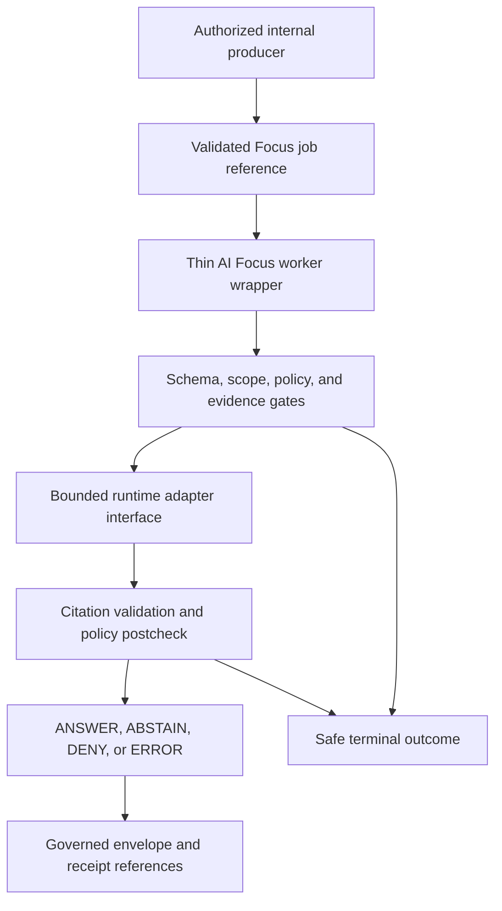

<!-- [KFM_META_BLOCK_V2]
doc_id: kfm://app/workers/src/ai-focus-worker/readme
title: AI Focus Worker README
type: app-readme
subtype: worker-lane-readme
version: v0.2
prior_version: v0.1
status: draft; repository-grounded; placeholder-only
owner: "NEEDS VERIFICATION — CODEOWNERS routes default repository review to @bartytime4life; no accepted AI Focus worker steward, independent reviewer, runtime operator, or release authority was verified"
created: 2026-06-16
updated: 2026-08-12
policy_label: public
current_path: apps/workers/src/ai_focus_worker/README.md
scope_id: apps/workers/src/ai_focus_worker/
owning_root: apps/
inherited_parent: apps/workers/src/README.md
responsibility: orient contributors to the inert AI Focus worker lane, its governed-AI boundaries, implementation admission requirements, validation, correction, and rollback
truth_posture: cite-or-abstain
truth_labels: [CONFIRMED, PROPOSED, UNKNOWN, NEEDS VERIFICATION]
authority_class: inherited app-local worker lane
authority_rank: implementation orientation subordinate to adopted doctrine, accepted ADRs, contracts, schemas, policy, evidence, lifecycle records, runtime boundaries, and release records
canonical_relationship: same-path update; no new authority, generated projection, compatibility path, or runtime capability created
evidence_repository: bartytime4life/Kansas-Frontier-Matrix
evidence_base_ref: main
evidence_base_commit: e1d43539b6f6a237649334b7e6a91957034a38fb
evidence_repository_tree: 3cd50e2b4863ea5bdbbec9f963162c2b2ac65222
evidence_lane_tree: c2102ccdf7fc622aa8a59c1e74d42052e6b6b597
evidence_target_prior_blob: 5bb3b812574a67c35321db9ae435cd89af293995
evidence_entrypoint_blob: 7715d01fc585b03dedae7bb535591064bd6d055c
evidence_parent_source_blob: 08ad9f8116f64817ffa4f8b2058613749360c102
evidence_workers_readme_blob: 5b5c1e6b067e652a380bf445488a6227028dfc0e
evidence_directory_rules_blob: fd49a0b83e55cef52c1124281f093e263526898d
evidence_directory_rules_adoption: ADR-0029; accepted
evidence_codeowners_blob: dd2a84aa514d8ecd9208bc347f90f9a2ed37dd61
evidence_direct_files: 2
evidence_executable_python_lines: 0
evidence_repository_runtime_bindings: 0
related:
  - ../README.md
  - ../../README.md
  - ../../../governed-api/README.md
  - ../../../governed-api/src/ai/README.md
  - ../../../../docs/doctrine/directory-rules.md
  - ../../../../docs/adr/ADR-0029-adopt-directory-governance-standard-v2.md
  - ../../../../docs/architecture/governed-ai/README.md
  - ../../../../docs/architecture/governed-ai/FOCUS_FLOW.md
  - ../../../../docs/architecture/governed-ai/BOUNDARIES.md
  - ../../../../contracts/ai/focus_mode_request/README.md
  - ../../../../contracts/ai/focus_mode_response/README.md
  - ../../../../contracts/runtime/ai_receipt.md
  - ../../../../contracts/runtime/runtime_response_envelope.md
  - ../../../../contracts/evidence/citation_validation_report.md
  - ../../../../schemas/contracts/v1/ai/
  - ../../../../schemas/contracts/v1/focus/
  - ../../../../schemas/contracts/v1/evidence/
  - ../../../../schemas/contracts/v1/runtime/
  - ../../../../policy/focus/
  - ../../../../packages/evidence-resolver/README.md
  - ../../../../packages/policy-runtime/README.md
  - ../../../../runtime/model_adapters/README.md
  - ../../../../data/receipts/ai/README.md
  - ../../../../fixtures/contracts/v1/runtime/ai_receipt/README.md
  - ../../../../fixtures/contracts/v1/runtime/runtime_response_envelope/README.md
  - ../../../../tests/validators/test_validate_ai_receipt.py
  - ../../../../tests/validators/test_validate_citation_validation_report.py
  - ../../../../tests/validators/test_validate_runtime_response_envelope.py
tags: [kfm, apps, workers, ai-focus-worker, placeholder, governed-ai, focus-mode, cite-or-abstain, finite-outcomes, non-publisher]
notes:
  - "v0.2 replaces the broad unknown-source posture with exact repository evidence: this lane contains one README and one 56-byte, comment-only Python placeholder with zero executable lines."
  - "Focus contracts, schemas, policy rules, evidence and policy packages, receipt families, fixtures, validators, and runtime adapters exist elsewhere in the repository; no import, trigger, queue, schedule, package, deployment, or runtime binding connects them to this lane."
  - "Parallel Focus and AI schema families exist for several object families. Their exact binding and consolidation posture remains NEEDS VERIFICATION and must not be guessed by a future worker implementation."
  - "This documentation-only update does not implement, activate, deploy, authorize, or execute a Focus job and does not emit an answer, receipt, policy decision, evidence object, release record, or public carrier."
[/KFM_META_BLOCK_V2] -->

<a id="top"></a>

<div align="center">

# AI Focus Worker

`apps/workers/src/ai_focus_worker/`

**Repository-grounded boundary for a possible asynchronous Governed AI Focus wrapper. The current lane is inert: its only Python file is a one-line greenfield-placeholder comment, and no repository binding makes it a job, queue consumer, model caller, receipt writer, or deployable process.**

[](#2-repo-fit)
[](#3-authority-boundary)
[](#4-default-posture)
[](#9-worker-obligations)
[](../../../../docs/adr/ADR-0029-adopt-directory-governance-standard-v2.md)
[](#11-inspection-path)

**Quick navigation:** [Purpose](#1-purpose) · [Repo fit](#2-repo-fit) · [Authority](#3-authority-boundary) · [Posture](#4-default-posture) · [Inputs and outputs](#5-inputs-and-outputs) · [Exclusions](#6-exclusions) · [Lane map](#7-current-lane-map) · [Required flow](#8-required-focus-job-flow) · [Obligations](#9-worker-obligations) · [Admission contract](#10-job-admission-contract) · [Evidence](#11-inspection-path) · [Validation](#12-validation-expectations) · [Change pattern](#13-safe-change-pattern) · [Done](#14-definition-of-done) · [Gaps](#15-open-verification-items) · [Rollback](#17-correction-and-rollback)

</div>

> [!IMPORTANT]
> **Current state:** `CONFIRMED / PLACEHOLDER-ONLY`. At `main@e1d43539b6f6a237649334b7e6a91957034a38fb`, this lane contains exactly two tracked files: this README and a 56-byte [`main.py`](./main.py). The Python file contains only `# ai_focus_worker entrypoint — greenfield placeholder`, for zero imports, definitions, executable statements, or side effects.

> [!CAUTION]
> An AI Focus worker must never become a browser-to-model shortcut, a second public trust membrane, an evidence or policy authority, a raw-store reader, an uncited-answer path, or a publisher. Generated language remains subordinate to admissible `EvidenceBundle` support, policy, citation validation, review state, release state, correction lineage, and finite governed outcomes.

> [!NOTE]
> The repository already contains Focus architecture, semantic contracts, parallel schema families, policy rules, evidence and policy packages, model adapters, receipt contracts, fixtures, and validators. Their existence is `CONFIRMED`; their composition into this worker is `CONFIRMED ABSENT` at the pinned base. Documentation proximity must not be mistaken for wiring or runtime evidence.

---

## 1. Purpose

`apps/workers/src/ai_focus_worker/` inherits the app-local source boundary from [`apps/workers/src/`](../README.md) and the background deployable boundary from [`apps/workers/`](../../README.md).

If an asynchronous Focus execution model is later accepted, this directory may own only a thin worker wrapper: authenticated job intake, app-local dependency composition, process lifecycle, bounded error translation, and delegation to governed contracts, schemas, policy clients, evidence resolution, runtime adapters, and receipt interfaces owned elsewhere.

The current lane implements none of those responsibilities. It has no package manifest, import graph, queue consumer, schedule, command-line entry point, request parser, policy client, evidence client, adapter call, citation check, receipt writer, worker-local test, configuration reader, network access, deployment binding, health check, or emitted artifact.

This README therefore exists to:

1. record the exact placeholder state without upgrading intent into implementation;
2. preserve the Governed AI, trust-membrane, cite-or-abstain, finite-outcome, and non-publisher boundaries for future work;
3. distinguish surrounding repository capability from actual worker composition; and
4. define the evidence, review, validation, correction, and rollback needed before this lane can claim executable maturity.

[Back to top](#top)

---

## 2. Repo fit

Accepted Directory Rules places independently deployable processes under `apps/` while requiring wrappers to delegate reusable logic to `packages/`, process-local adapters to `runtime/`, source acquisition to `connectors/`, transformations to `pipelines/`, run declarations to `pipeline_specs/`, policy meaning to `policy/`, and machine shape to `schemas/`.

### Current lane evidence

| Claim | Truth | Repository evidence | Limitation |
|---|---|---|---|
| The lane has exactly two direct files and no child directory. | CONFIRMED | Lane tree `c2102ccdf7fc622aa8a59c1e74d42052e6b6b597` | Directory shape does not prove runtime behavior. |
| `main.py` is a 56-byte, one-line placeholder comment. | CONFIRMED | Blob `7715d01fc585b03dedae7bb535591064bd6d055c` | A filename and intent comment are not an entry point. |
| The lane contains zero non-comment executable Python lines. | CONFIRMED | Reproducible `awk` inspection | Future branches and external deployments are outside this snapshot. |
| No repository code imports or invokes `ai_focus_worker`. | CONFIRMED at pinned base | Repository search outside this lane and its parent inventory returns no binding | External systems not represented in Git remain `UNKNOWN`. |
| No queue, schedule, package, worker-local test, configuration, or deployment binding is present for this lane. | CONFIRMED at pinned base | Complete lane inventory plus repository path/name search | This does not prove that no untracked or external experiment exists. |
| The lane is deployed, active, healthy, or processing jobs. | UNKNOWN | No deployment or operational evidence is bound to this revision | Never infer operations from a README, branch, commit, PR, or green CI. |

### Confirmed surrounding surfaces

| Surface | Current repository evidence | Relationship to this lane |
|---|---|---|
| Governed AI architecture | [`README.md`](../../../../docs/architecture/governed-ai/README.md), [`FOCUS_FLOW.md`](../../../../docs/architecture/governed-ai/FOCUS_FLOW.md), and [`BOUNDARIES.md`](../../../../docs/architecture/governed-ai/BOUNDARIES.md) exist | Doctrine and proposed flow context; not worker wiring |
| Request and response semantics | [`contracts/ai/focus_mode_request/`](../../../../contracts/ai/focus_mode_request/README.md) and [`contracts/ai/focus_mode_response/`](../../../../contracts/ai/focus_mode_response/README.md) exist | Semantic inputs and outputs; no consumer binding here |
| Focus policy | Four Rego rules plus [`policy/focus/README.md`](../../../../policy/focus/README.md) exist | Normative decision source; worker may apply but never redefine it |
| Evidence and policy packages | [`packages/evidence-resolver/`](../../../../packages/evidence-resolver/README.md) and [`packages/policy-runtime/`](../../../../packages/policy-runtime/README.md) contain packaged Python code | Candidate governed dependencies; not imported by this placeholder |
| Runtime adapters | [`runtime/model_adapters/`](../../../../runtime/model_adapters/README.md) contains adapter documentation and implementations | Provider detail remains behind bounded runtime interfaces; ownership of async invocation is unresolved |
| Receipt and envelope families | Contracts, schemas, fixtures, and validators exist for AIReceipt, citation reports, and runtime envelopes | Object-family existence does not prove emission by this lane |
| Governed API AI source lane | [`apps/governed-api/src/ai/README.md`](../../../governed-api/src/ai/README.md) exists with a placeholder marker | The Governed API remains the public trust membrane; no cross-app internal import is authorized |

### Binding ambiguity that must remain explicit

Several object families have parallel schema paths. This README does not choose between them:

| Object family | Confirmed schema paths | Current worker binding |
|---|---|---|
| Focus request | `schemas/contracts/v1/ai/focus_mode_request.schema.json`; `schemas/contracts/v1/focus/focus_request.schema.json` | None |
| Focus response | `schemas/contracts/v1/ai/focus_mode_response.schema.json`; `schemas/contracts/v1/focus/focus_response.schema.json` | None |
| AIReceipt | `schemas/contracts/v1/ai/ai_receipt.schema.json`; `schemas/contracts/v1/runtime/ai_receipt.schema.json` | None |
| Citation validation report | `schemas/contracts/v1/focus/citation_validation_report.schema.json`; `schemas/contracts/v1/evidence/citation_validation_report.schema.json` | None |
| Runtime response envelope | `schemas/contracts/v1/focus/runtime_response_envelope.schema.json`; `schemas/contracts/v1/runtime/runtime_response_envelope.schema.json` | None |

A future implementation must bind exact accepted contract and schema identifiers and versions, validate compatibility deliberately, and resolve or document parallel-family semantics. It must not select a path by filename similarity or silently merge shapes.

[Back to top](#top)

---

## 3. Authority boundary

This lane may become an app-local asynchronous wrapper only after the execution model is accepted. It does not inherit authority from the word `worker`, from adjacent schemas or packages, or from its placement under `apps/`.

### May belong here after admission

- one explicit worker entry point and process lifecycle;
- authenticated consumption of an accepted internal Focus job contract;
- app-local composition of governed dependencies through public interfaces;
- correlation, job, run, attempt, idempotency, timeout, retry, and safe-disable wiring;
- bounded translation from dependency outcomes to declared terminal job states;
- health and public-safe observability hooks that reveal no payload, prompt, protected detail, or private endpoint;
- app-local tests proving delegation, finite outcomes, no-publish behavior, and fail-closed startup.

### Must not become local authority

- public ingress, browser routing, or direct browser-to-model access;
- Focus doctrine, semantic contract meaning, JSON Schema authority, or policy rules;
- evidence truth, citation truth, source-role elevation, or review/release decisions;
- raw, work, quarantine, canonical, or published-store ownership;
- reusable evidence, policy, adapter, or domain logic copied into the app wrapper;
- provider credentials, actual secrets, model weights, private endpoints, or deployment topology;
- publication, correction, withdrawal, rollback approval, or release-signing authority;
- proof that a job ran merely because source, tests, workflows, logs, commits, or pull requests exist.

### Exposure, mutation, and retention

| Concern | Current state | Required future posture |
|---|---|---|
| Public exposure | None implemented | No public route; authorized internal producer only, with Governed API remaining the normal public trust membrane |
| Model access | None implemented | Only through an accepted bounded runtime interface; never a public/provider shortcut |
| Read capability | None implemented | Typed, policy-admissible references or bounded projections only; no direct lifecycle-store or live-source access |
| Write capability | None implemented | Exact output interfaces and capabilities declared in advance; never direct publication or authority mutation |
| Mutation | None implemented | Idempotent, receipted, least-privileged side effects only where an accepted contract permits them |
| Retention | No worker output exists | Governed by the owning output family; this wrapper may not invent a retention rule |
| Logs and metrics | None implemented | Public-safe operational fields only; no prompts, evidence bodies, raw payloads, secrets, protected geometry, or internal locators |

[Back to top](#top)

---

## 4. Default posture

The current placeholder is inert. Any future implementation must fail closed before model-related or claim-bearing work when a prerequisite is absent, stale, contradictory, unauthorized, or unvalidated.

| Required gate | Minimum closed behavior |
|---|---|
| Producer and transport | Reject unknown producers, inactive transports, malformed messages, and replay outside the declared contract |
| Identity | Require stable request, job, run, attempt, correlation, and idempotency identities |
| Request shape | Validate the exact accepted Focus request schema and bounded scope |
| Policy precheck | Terminate on deny, abstain, error, unavailable policy, or undecidable obligations |
| Evidence resolution | Require every consequential support reference to resolve to admissible, current EvidenceBundle context |
| Context assembly | Include only bounded, policy-allowed projections; exclude raw/internal/source payloads and protected detail |
| Adapter contract | Use an accepted structured-output interface, bounded timeout, provider-neutral error handling, and no secret-bearing prompt material |
| Citation validation | Prevent `ANSWER` when any consequential claim lacks validated support |
| Policy postcheck | Re-evaluate generated candidate content, citations, sensitivity, rights, precision, and release posture |
| Receipt and envelope | Emit only schema-valid process-memory and finite outcome references through declared writers |
| Failure handling | Produce bounded `ABSTAIN`, `DENY`, `ERROR`, hold, or no-op behavior without claim or internal-detail leakage |

### Finite outcome posture

| Outcome | Permitted meaning | Forbidden collapse |
|---|---|---|
| `ANSWER` | Scope valid; policy allows; evidence resolves; citations pass; postcheck allows; required receipt/envelope linkage succeeds | Fluent text, model confidence, or partial citations treated as sufficient |
| `ABSTAIN` | Evidence is missing, stale, conflicted, unsupported, or citations cannot close | Best-effort substitute claim |
| `DENY` | Rights, sensitivity, role, precision, release, or other policy forbids the request or candidate | Revealing the protected reason or hidden detail |
| `ERROR` | Contract, schema, dependency, adapter, receipt, or infrastructure failure prevents a governed result | Silent downgrade to `ANSWER` or unreceipted success |

No outcome handler exists in this lane today.

[Back to top](#top)

---

<a id="5-inputs"></a>

## 5. Inputs and outputs

### Current inputs and outputs

| Surface | Current state | Truth |
|---|---|---|
| CLI arguments or process entry point | None implemented | CONFIRMED |
| Python imports or callable APIs | None implemented | CONFIRMED |
| Queue messages, schedules, events, or web requests | No consumer or binding | CONFIRMED |
| Environment variables, configs, or secret references | None read | CONFIRMED |
| Evidence, policy, schema, API, filesystem, database, object-store, or model inputs | No code path exists | CONFIRMED |
| Focus answers or finite response envelopes | None emitted | CONFIRMED |
| AIReceipt, job receipt, citation report, logs, metrics, proofs, or release records | None emitted by this lane | CONFIRMED |

### Required future input declaration

| Input family | Required declaration |
|---|---|
| Trigger | Authorized producer, transport owner, contract version, activation state, delivery and replay semantics |
| Job identity | Request, job, run, attempt, correlation, idempotency, deadline, and retry identities |
| Focus request | Exact semantic contract and machine schema; bounded question, audience, context, transform, and version/time lock |
| Policy | Exact precheck and postcheck interface, decision version, obligations, reason codes, and unavailable-policy behavior |
| Evidence | Typed refs, admissibility, source role, rights, sensitivity, freshness, release/review posture, and resolution interface |
| Runtime | Accepted adapter port, model profile reference, structured output contract, timeout, cancellation, and safe error mapping |
| Configuration | Non-secret profile plus external secret references; no committed credentials or private endpoints |
| Output capability | Exact object family, schema, writer interface, target owner, retention, receipt, correction, and rollback behavior |

### Required future output constraints

- A model candidate is not a public response, EvidenceBundle, review decision, release record, or truth object.
- `ANSWER` requires resolved evidence, passing citation validation, passing postcheck, and successful governed envelope/receipt handling.
- `ABSTAIN`, `DENY`, and `ERROR` must carry bounded, safe reason codes without substitute claims or protected detail.
- AIReceipt records process memory; it does not independently prove evidence truth, review, release, publication, or operational success.
- Any durable write must use the owning root's accepted contract, schema, writer, identity, retention, correction, and rollback semantics.

[Back to top](#top)

---

## 6. Exclusions

| Does not belong here | Canonical or governed home | Boundary reason |
|---|---|---|
| Public Focus route or browser ingress | `apps/governed-api/` | The Governed API remains the public trust membrane. |
| Governed AI and Focus doctrine | `docs/architecture/governed-ai/` | App code cannot redefine architectural authority. |
| Semantic request, response, receipt, evidence, or envelope meaning | `contracts/` | Interface meaning is not app-local. |
| JSON Schemas and generated shape authority | `schemas/` | Machine shape is independently governed. |
| Focus policy rules | `policy/focus/` and other accepted policy lanes | Workers apply policy decisions; they do not author them. |
| Evidence resolution or policy evaluation reusable logic | `packages/evidence-resolver/`, `packages/policy-runtime/` | Shared implementation remains package-owned. |
| Provider adapters and local runtime composition | `runtime/` | Provider choice and adapter detail stay behind bounded runtime interfaces. |
| Source acquisition or live-source calls | `connectors/` | A Focus worker is not a connector. |
| Lifecycle transformations or declarative run graphs | `pipelines/`, `pipeline_specs/` | Orchestration and run specification have separate homes. |
| RAW, WORK, QUARANTINE, canonical, receipt, proof, or published instances | `data/` | Data and accountability instances never live in app source. |
| Release, correction, withdrawal, or rollback decisions | `release/` | Execution does not grant decision authority. |
| Public UI rendering or evidence-drawer behavior | `apps/explorer-web/` | The worker is not a browser surface. |
| Human review or adjudication | `apps/review-console/` | Automation cannot impersonate review. |
| Shared fixtures and repository-wide validators | `fixtures/`, `tests/`, `tools/` | Production app code must not depend on test or repo-operator internals. |
| Deployment, network, identity, or actual secrets | `infra/` and external secret stores | Source code is not deployment or secret authority. |

[Back to top](#top)

---

<a id="7-ai-focus-worker-map"></a>

## 7. Current lane map

The following is the **CONFIRMED current direct-child map** required by Directory Rules. It is not a proposed implementation tree.

```text
apps/workers/src/ai_focus_worker/
├── README.md    # lane boundary, current evidence, and admission contract
└── main.py      # 56-byte, one-line greenfield-placeholder comment
```

| Direct file | Blob | Current role | Executable state |
|---|---|---|---|
| [`README.md`](./README.md) | prior edition `5bb3b812574a67c35321db9ae435cd89af293995` | Human orientation and proposed boundary | Documentation only |
| [`main.py`](./main.py) | `7715d01fc585b03dedae7bb535591064bd6d055c` | Intent-named placeholder | Zero executable lines |

No `__init__.py`, package manifest, lock file, configuration file, module family, test directory, fixture, queue adapter, schedule, Dockerfile, deployment manifest, or generated artifact exists beneath this lane at the pinned base.

[Back to top](#top)

---

<a id="8-diagram"></a>

## 8. Required Focus job flow

The following is a **REQUIRED FUTURE CONTROL FLOW**, not current execution evidence. The selected internal orchestration owner—Governed API, an accepted internal service, or a worker composition seam—remains `NEEDS VERIFICATION`; the worker may not decide that placement unilaterally.


```mermaid
flowchart TD
    producer["Authorized internal producer"] --> job["Validated Focus job reference"]
    job --> wrapper["Thin AI Focus worker wrapper"]
    wrapper --> gates["Schema, scope, policy, and evidence gates"]
    gates --> runtime["Bounded runtime adapter interface"]
    runtime --> checks["Citation validation and policy postcheck"]
    checks --> outcome["ANSWER, ABSTAIN, DENY, or ERROR"]
    outcome --> records["Governed envelope and receipt references"]
    gates --> terminal["Safe terminal outcome"]
    checks --> terminal
```

Every edge requires an accepted interface and explicit owner. A future wrapper may coordinate the flow but must not absorb contract, schema, policy, evidence, adapter, receipt, release, or public API authority into this directory.

[Back to top](#top)

---

## 9. Worker obligations

| Obligation | Required effect |
|---|---|
| `placeholder_honesty` | The current comment, README, adjacent capabilities, and CI are never described as a running worker. |
| `governed_producer_only` | Only an authenticated, explicitly authorized internal producer may create a Focus job. |
| `no_browser_to_model` | No browser or public client can address this worker or a model provider directly. |
| `thin_wrapper` | Reusable policy, evidence, adapter, and domain behavior remains in owning roots. |
| `policy_before_model` | A missing, denying, abstaining, or failing precheck prevents adapter work. |
| `evidence_before_claim` | No consequential candidate is produced without admissible resolved support. |
| `bounded_context_only` | The adapter receives only scoped, allowed projections—not raw/internal/source bytes. |
| `citation_before_answer` | A failed or incomplete citation report prevents `ANSWER`. |
| `postcheck_before_exposure` | Candidate content is rechecked for policy, rights, sensitivity, precision, and release constraints. |
| `finite_outcomes` | Every material path ends in the accepted closed outcome grammar or an explicitly governed job hold/no-op. |
| `receipt_required` | Required process-memory and job records are written through declared, schema-valid interfaces. |
| `generated_text_not_truth` | Model output never outranks evidence, policy, review, source authority, or release state. |
| `idempotent_and_replay_aware` | Duplicate delivery and retry cannot duplicate or silently overwrite authoritative records. |
| `least_privilege` | Runtime identity has only the declared inputs, dependencies, and output capabilities. |
| `non_publisher` | The worker cannot approve, release, correct, withdraw, roll back, sign, or publish. |
| `safe_failure` | Errors reveal no secret, prompt, evidence body, raw payload, protected location, internal path, or provider detail. |

[Back to top](#top)

---

<a id="10-job-contract"></a>

## 10. Job admission contract

Before replacing the placeholder, the implementation slice must document and test:

- the accepted execution owner and why asynchronous work belongs in this app lane;
- accountable steward, GitHub review route, independent reviewer, runtime operator, and escalation path;
- exact producer identity, transport, queue or event owner, message contract, authentication, and activation posture;
- request, job, run, attempt, correlation, idempotency, deadline, retry, cancellation, and dead-letter/hold identities;
- accepted Focus request/response semantic contracts and exact schema IDs, versions, and compatibility rule;
- policy precheck/postcheck interfaces, obligation handling, deny/abstain/error mappings, and unavailable-policy behavior;
- EvidenceRef resolution, admissibility, freshness, source-role, rights, sensitivity, review/release, and citation closure;
- adapter interface, structured-output contract, model profile reference, timeout, provider failure, and safe-disable behavior;
- finite terminal outcomes and exact allowed fields for each outcome;
- AIReceipt, job receipt, citation report, runtime envelope, log, metric, and trace interfaces;
- permitted read and write capabilities, retention owner, least privilege, correction, supersession, and rollback;
- positive, malformed, unauthorized, missing-evidence, stale, conflicting, sensitive, citation-failure, policy-deny, adapter-failure, duplicate, retry, timeout, cancellation, no-leak, and no-publish fixtures;
- local, CI, deployment, activation, observability, incident, disable, and recovery evidence—kept distinct from one another.

### Schema-binding decision gate

Because parallel schema families are present, admission requires one reviewed binding matrix with:

1. semantic contract ID and version;
2. canonical schema `$id`, path, and version;
3. compatibility or migration relationship to every parallel shape;
4. validator and fixture set;
5. generated binding or parser source, if any;
6. producer and consumer versions;
7. failure behavior for unknown or mixed versions; and
8. rollback and replay effects.

Filename similarity is not compatibility evidence.

[Back to top](#top)

---

<a id="evidence-ledger"></a>

## 11. Inspection path

### Reproduce the current lane state

```bash
git ls-tree -r --name-only HEAD apps/workers/src/ai_focus_worker
find apps/workers/src/ai_focus_worker -mindepth 1 -maxdepth 1 -type f -print | sort
wc -c apps/workers/src/ai_focus_worker/main.py
awk 'NF && $1 !~ /^#/ { count++ } END { print count + 0 }' \
  apps/workers/src/ai_focus_worker/main.py
rg -n 'ai_focus_worker' \
  --glob '!apps/workers/src/ai_focus_worker/**' \
  --glob '!apps/workers/src/README.md' .
find schemas/contracts/v1/ai schemas/contracts/v1/focus \
  schemas/contracts/v1/evidence schemas/contracts/v1/runtime \
  policy/focus packages/evidence-resolver packages/policy-runtime \
  runtime/model_adapters -maxdepth 2 -type f -print | sort
```

At the pinned base, the first two commands show only `README.md` and `main.py`; `wc` reports `56`; `awk` reports `0`; and the bounded repository search finds no external runtime binding to this lane.

### Evidence ledger

| Evidence | Identifier | Supports | Does not support |
|---|---|---|---|
| Current base | `main@e1d43539b6f6a237649334b7e6a91957034a38fb` | Snapshot used for this edition | Future main, deployments, or external systems |
| Repository tree | `3cd50e2b4863ea5bdbbec9f963162c2b2ac65222` | Exact complete tree at the base | Operational state |
| AI Focus lane tree | `c2102ccdf7fc622aa8a59c1e74d42052e6b6b597` | Complete two-file lane inventory | Queue, process, or deployment existence |
| Prior README | blob `5bb3b812574a67c35321db9ae435cd89af293995` | Same-path baseline and no-loss review | Current worker behavior |
| Placeholder entrypoint | blob `7715d01fc585b03dedae7bb535591064bd6d055c` | Exact comment-only source bytes | Importability, execution, or model access |
| Parent source README | blob `08ad9f8116f64817ffa4f8b2058613749360c102` | Inherited placeholder, thin-wrapper, and non-publisher contract | Child implementation maturity |
| Parent Workers README | blob `5b5c1e6b067e652a380bf445488a6227028dfc0e` | Current scaffold-only background app boundary | Active worker deployment |
| Accepted Directory Rules | blob `fd49a0b83e55cef52c1124281f093e263526898d`; accepted ADR-0029 | Placement, dependency direction, Boundary Compact profile, direct-child map law | Runtime correctness or activation |
| CODEOWNERS | blob `dd2a84aa514d8ecd9208bc347f90f9a2ed37dd61` | Default review route to `@bartytime4life` | Stewardship, independent approval, or release authority |
| Governed AI overview | blob `718282655d5752351d46122af1620e37c2bf05c6` | Repository architecture context and evidence-subordinate AI posture | Worker wiring |
| Focus Flow | blob `2dc6213d667e7d2f130427355c5af6b7d59813e2` | Proposed request-to-envelope gate sequence | Accepted async execution owner or deployed flow |
| Governed AI boundaries | blob `5364452ed999cd79154afcfa7bf8bd50379a944b` | No-direct-public-model and trust-boundary constraints | Worker implementation |
| Focus request/response contracts | blobs `c22fb8778d0f4bca4a0214c36ca6ce7ca06460ae` and `580116adffcffd1a264e10f27120a34bb03ab676` | Existing semantic-contract documents | Canonical schema binding |
| Focus policy README | blob `29c507e76a9c15c44f2c195b7342e93630cdc701` plus four Rego files | Existing policy lane | Policy invocation by this worker |
| Evidence and policy package READMEs | blobs `b67abf1b788790eedf77724b46e3022ea732c5f6` and `d64f112e9fe6538178c74dd31cc751235781c7f3` | Existing reusable dependency lanes | Import or configuration here |
| Runtime adapter README | blob `5a20cfac50a93f497765421b7566559ae49a39b8` | Existing provider-neutral adapter lane | Authorization for this worker to call a model |

[Back to top](#top)

---

## 12. Validation expectations

### Documentation-only changes

Run repository-owned, no-network checks against the changed file and exact feature head:

```bash
git diff --check
python tools/validators/docs/meta-block/check_meta_blocks.py \
  --repo-root . --profile present \
  --registry control_plane/document_registry.yaml \
  --format text apps/workers/src/ai_focus_worker/README.md
python tools/validators/docs/link-check/check_links.py \
  --repo-root . --format text \
  apps/workers/src/ai_focus_worker/README.md
python tools/validators/docs/document-graph/check_document_graph.py \
  --repo-root . \
  --entrypoint apps/workers/src/ai_focus_worker/README.md \
  --registry control_plane/document_registry.yaml \
  --format text apps/workers/src/ai_focus_worker/README.md
python tools/validators/docs/stale-scan/check_stale_docs.py \
  --repo-root . --as-of 2026-08-12 --profile advisory \
  --review-window-days 365 --placeholder-grace-days 90 \
  --format text apps/workers/src/ai_focus_worker/README.md
python -m unittest discover \
  --start-directory tests/validators/docs/meta-block \
  --pattern 'test_*.py' --verbose
python -m unittest discover \
  --start-directory tests/validators/docs/link-check \
  --pattern 'test_*.py' --verbose
python -m unittest discover \
  --start-directory tests/validators/docs/document-graph \
  --pattern 'test_*.py' --verbose
python -m unittest discover \
  --start-directory tests/validators/docs/stale-scan \
  --pattern 'test_*.py' --verbose
```

A green documentation result proves only bounded metadata, link, graph, freshness, syntax, and diff hygiene. It does not prove a worker is implemented, safe, deployed, activated, healthy, policy-complete, evidence-complete, receipt-complete, release-approved, or public.

### First executable AI Focus slice

A placeholder replacement requires, at minimum:

- deterministic, no-network unit tests with synthetic public-safe fixtures;
- exact request, response, policy, evidence, citation, receipt, and envelope schema/contract agreement;
- unauthorized-producer, malformed-message, mixed-version, duplicate, replay, retry, timeout, cancellation, and dependency-unavailable cases;
- policy precheck/postcheck allow, abstain, deny, error, obligation, and sensitive-precision cases;
- missing, stale, conflicted, insufficient, unauthorized, corrected, superseded, and revoked evidence cases;
- adapter structured-output, contract violation, provider error, prompt-injection, and safe-disable cases;
- citation-complete `ANSWER` plus uncited, partially cited, unsupported, and citation-resolution failure cases;
- static and runtime proof of no browser route, no raw/canonical/live-source read, no direct publication, no secret leakage, and no hidden fallback provider;
- idempotent receipt/envelope writes, integrity checks, correction linkage, replay behavior, and rollback tests;
- bounded integration tests across public package/runtime interfaces without importing another app's internals;
- workflow preflight proving the feature branch cannot deploy, activate, release, promote, publish, mutate settings, or expose secrets.

No worker-specific executable test target is currently bound to `apps/workers/src/ai_focus_worker/`.

[Back to top](#top)

---

## 13. Safe change pattern

1. Pin current `main`, the lane tree, README blob, placeholder blob, parent contracts, relevant schemas, policy, packages, runtime interfaces, tests, workflows, open PRs, and deployment evidence.
2. Decide and record whether asynchronous Focus execution belongs here, who owns orchestration, and how the Governed API trust membrane remains intact.
3. Resolve exact contract/schema bindings and parallel-family compatibility before code consumes a payload.
4. Define producer, transport, identities, finite outcomes, allowed reads/writes, receipts, correction, and rollback before replacing the placeholder.
5. Keep the app wrapper thin; add reusable behavior to the correct package/runtime/policy/evidence root with its own tests.
6. Add synthetic positive and negative fixtures before claiming executable maturity.
7. Prove no browser-to-model, raw-store, source, policy-bypass, uncited-answer, self-review, self-release, or publication path exists.
8. Reconcile this README, its parent source README, Workers app README, Governed API/AI documentation, and directly affected contracts, schemas, policy, packages, runtime, fixtures, tests, and runbooks in one dependency-closed slice.
9. Run changed-area and safety validation, inspect the complete diff, and deliver through a feature branch and draft pull request.
10. Keep deployment, activation, provider credentials, source access, release, promotion, publication, and repository settings as separate authorized transitions.

[Back to top](#top)

---

## 14. Definition of done

This lane is not implementation-complete merely because its placeholder and surrounding capabilities are documented. Executable maturity requires evidence for every applicable item:

- [ ] accepted owner, independent review route, runtime operator, escalation path, and non-publisher scope;
- [ ] accepted asynchronous execution owner and Governed API boundary relationship;
- [ ] executable entry point plus reproducible package, dependency, and build identity;
- [ ] authorized producer, inactive-by-default transport, authentication, delivery, replay, and deactivation behavior;
- [ ] reviewed semantic contract and schema binding matrix with parallel-family compatibility resolved;
- [ ] bounded request scope and exact finite response semantics;
- [ ] policy precheck/postcheck, evidence resolution, citation validation, and adapter interfaces integrated through owned APIs;
- [ ] stable request/job/run/attempt/correlation/idempotency identities and bounded retry/cancellation behavior;
- [ ] exact permitted reads/writes, least privilege, retention owner, receipt behavior, correction, and rollback;
- [ ] `ANSWER` impossible without admissible EvidenceBundle support and passing citation/policy gates;
- [ ] positive, negative, mixed-version, replay, no-public-route, no-raw-read, no-publish, no-leak, correction, and rollback tests passing;
- [ ] safe logs, metrics, health, alerts, incident, disable, and recovery paths;
- [ ] deployment and activation evidence explicitly tied to an exact revision, if separately authorized;
- [ ] documentation reconciled with exact code, tests, workflows, and operational evidence;
- [ ] no release, promotion, publication, or settings authority inferred from code, CI, deployment, or merge.

[Back to top](#top)

---

## 15. Open verification items

| Item | Current truth | Required evidence or decision |
|---|---|---|
| AI Focus worker stewardship and independent review | NEEDS VERIFICATION | Accepted responsibility assignment and verified reviewer identities |
| Asynchronous Focus execution owner | NEEDS VERIFICATION | Architecture decision distinguishing Governed API orchestration, internal service, and worker wrapper responsibilities |
| Worker implementation | CONFIRMED absent | Dependency-closed code, package identity, tests, and review evidence |
| Producer, transport, queue, or event | CONFIRMED absent | Accepted contract, authenticated producer, delivery/replay semantics, activation and dead-letter/hold posture |
| Parallel request/response schema families | NEEDS VERIFICATION | Canonical binding, compatibility matrix, migration posture, validators, and fixtures |
| Parallel receipt/citation/envelope schema families | NEEDS VERIFICATION | Canonical binding and explicit consumer/producer versions |
| Policy and evidence package composition | CONFIRMED unwired | Public API bindings, exact versions, bounded integration tests, and failure semantics |
| Runtime adapter invocation authority | NEEDS VERIFICATION | Accepted adapter owner, provider-neutral interface, credential boundary, and no-public-path proof |
| AIReceipt and job receipt outputs | CONFIRMED unimplemented here | Exact object family, schema, writer, target, integrity, retention, and replay tests |
| Worker-local fixtures and tests | CONFIRMED absent | Synthetic positive/negative suite and cross-root boundary coverage |
| Architecture cross-link drift | CONFIRMED | `STATE_OWNERSHIP.md` and governed-AI validation/rollback runbooks referenced by architecture documents are absent; reconcile in a separate owned documentation slice |
| Deployment, activation, health, logs, metrics, and alerts | UNKNOWN | Exact deployed revision, observed public-safe telemetry, operator evidence, and separate activation authority |
| Release and publication state | CONFIRMED not established by this lane | Independent review/release records; never inferred from worker execution or receipts |

Re-review this README when the placeholder changes, an internal producer or transport is proposed, contract/schema bindings change, policy/evidence/runtime interfaces change, the parent worker boundary changes, ADR-0029 is superseded, CODEOWNERS routing changes, or deployment/operational evidence becomes available.

[Back to top](#top)

---

## 16. Documentation change history

| Version | Date | Change | Runtime effect |
|---|---|---|---|
| `v0.1` | 2026-06-16 | Replaced a greenfield stub with a broad proposed asynchronous Focus worker contract. | None; documentation only. |
| `v0.2` | 2026-08-12 | Pinned current repository evidence, recorded the two-file comment-only lane, reconciled with the merged parent Workers app and source contracts, applied accepted Directory Rules and the Boundary Compact profile, distinguished adjacent capabilities from worker wiring, exposed parallel schema-family ambiguity, and strengthened admission, validation, correction, and rollback. | None; documentation only. |

<details>
<summary>Appendix A — no-loss and correction note</summary>

The v0.1 edition correctly preserved the intended Governed AI constraints: evidence-subordinate language, cite-or-abstain, policy precheck/postcheck, citation validation before `ANSWER`, finite outcomes, receipts, no browser-to-model shortcut, no raw-store access, and no publication authority.

This edition retains those constraints while correcting its evidence posture. Source-file presence is no longer unknown: `main.py` exists as a comment-only placeholder. Several adjacent contracts, schemas, policy rules, packages, fixtures, validators, receipt lanes, and runtime adapters also exist. None is wired to this lane, and parallel schema-family bindings remain unresolved.

</details>

## 17. Correction and rollback

Before merge, abandon or close the feature branch and draft pull request. After an independently authorized merge, use a transparent revert or forward-fix pull request restoring prior blob `5bb3b812574a67c35321db9ae435cd89af293995`, then rerun the same documentation checks.

A README rollback changes no Python source, contract, schema, policy, package, adapter, fixture, test, queue, schedule, configuration, receipt, data, deployment, activation, release, promotion, publication, or repository setting. If a later implementation affects those surfaces, its own migration, correction, cache/data disposition, credential, deployment, and rollback obligations control; restoring prose alone is not an operational rollback.

---

## Status summary

`apps/workers/src/ai_focus_worker/` is correctly located as an inherited app-local lane but is not an implemented or active worker. Its repository state is exactly one boundary README and one 56-byte comment-only placeholder, with zero executable lines and no import, trigger, queue, schedule, package, test, configuration, deployment, or output binding.

Future work must first resolve asynchronous orchestration ownership and exact contract/schema bindings. Any admitted implementation must remain thin, authenticated, evidence- and policy-bounded, citation-gated, finite-outcome, receipt-aware, least-privileged, replay-safe, correction-capable, non-publishing, and subordinate to the Governed API trust membrane and independent release authority.

<p align="right"><a href="#top">Back to top</a></p>
