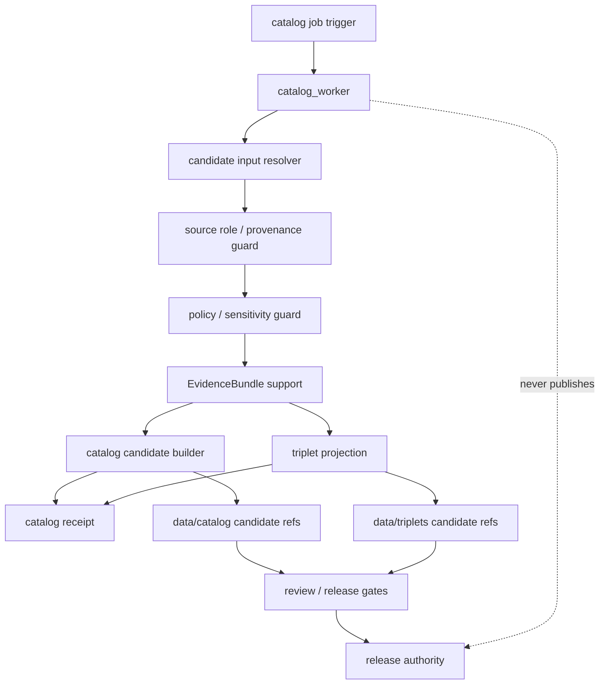

<!-- [KFM_META_BLOCK_V2]
doc_id: kfm://app/workers/src/catalog-worker/readme
title: Catalog Worker README
type: app-readme
version: v0.1
status: draft
owners: OWNER_TBD — Worker steward · Catalog steward · Pipeline steward · Evidence steward · Policy steward · Release steward · Docs steward
created: 2026-06-16
updated: 2026-06-16
policy_label: public
related:
  - ../README.md
  - ../../README.md
  - ../../../governed-api/README.md
  - ../../../review-console/README.md
  - ../../../../pipelines/README.md
  - ../../../../pipeline_specs/README.md
  - ../../../../packages/README.md
  - ../../../../policy/README.md
  - ../../../../schemas/contracts/v1/
  - ../../../../contracts/
  - ../../../../data/README.md
  - ../../../../data/catalog/
  - ../../../../data/triplets/
  - ../../../../data/receipts/
  - ../../../../data/proofs/
  - ../../../../release/README.md
tags: [kfm, apps, workers, catalog-worker, catalog, triplets, receipts, evidencebundle, policydecision, lifecycle, watcher-non-publisher]
notes:
  - "Replaces the greenfield catalog_worker stub with a bounded worker-source contract."
  - "This worker may support catalog/triplet candidate build work only after upstream gates and receipts are satisfied; it must not publish, rewrite canonical records, upcast source authority, or treat derived catalog outputs as sovereign truth."
  - "Worker source files, job definitions, queue contracts, schemas, fixtures, tests, catalog/triplet outputs, receipt outputs, deployment state, logs, dashboards, and CI pass state remain NEEDS VERIFICATION."
[/KFM_META_BLOCK_V2] -->

<a id="top"></a>

<div align="center">

# Catalog Worker

`apps/workers/src/catalog_worker/`

**App-local worker-source boundary for catalog and triplet candidate support: validated input refs, source-role preservation, EvidenceBundle linkage, policy prechecks, deterministic identity, catalog/triplet candidate emission, receipt capture, stale-state signaling, and non-publishing worker enforcement.**


[Purpose](#1-purpose) · [Repo fit](#2-repo-fit) · [Boundary](#3-authority-boundary) · [Inputs](#5-inputs) · [Exclusions](#6-exclusions) · [Worker map](#7-catalog-worker-map) · [Definition of done](#14-definition-of-done)

</div>

---

> [!IMPORTANT]
> **Status:** draft / `NEEDS VERIFICATION`  
> **Owners:** `OWNER_TBD` — Worker steward · Catalog steward · Pipeline steward · Evidence steward · Policy steward · Release steward · Docs steward  
> **Path:** `apps/workers/src/catalog_worker/README.md`  
> **Responsibility root:** `apps/` — deployable application surfaces  
> **Truth posture:** CONFIRMED README path / CONFIRMED Workers source boundary / CONFIRMED data root contains catalog, triplets, receipts, proofs, registry, and published lifecycle areas / PROPOSED catalog-worker contract / UNKNOWN source files, queue contracts, schemas, tests, fixtures, runtime behavior, deployment state, and CI pass state

> [!CAUTION]
> The Catalog Worker is not publication authority. It may build catalog/triplet candidates or support artifacts, but it must not write final published truth, rewrite canonical records, bypass review/release gates, or turn derived indexes into sovereign evidence.

---

## 1. Purpose

`apps/workers/src/catalog_worker/` is the proposed app-local worker-source home for catalog and triplet candidate build support.

It may eventually contain modules for:

- catalog job intake from approved schedules, queues, or operator-triggered dry runs;
- idempotency and retry handling for catalog jobs;
- validated PROCESSED/CATALOG candidate input checks;
- SourceDescriptor, TransformReceipt, ValidationReport, PolicyDecision, and EvidenceBundle support checks;
- deterministic catalog identity and versioning support;
- catalog record candidate generation;
- triplet candidate generation or projection support;
- stale-source, supersession, and invalidation signaling;
- catalog/triplet receipt emission;
- safe failure states with no claim or protected detail leakage.

This README does not prove that any catalog worker source file, queue contract, schema, fixture, test, receipt writer, catalog builder, triplet builder, deployment, log, dashboard, or CI pass state exists.

[Back to top](#top)

---

## 2. Repo fit

| Concern | Owning root | Expected relationship |
|---|---|---|
| Catalog worker source | `apps/workers/src/catalog_worker/` | App-local worker source, if implemented |
| Workers source | `apps/workers/src/` | Worker source boundary and non-publisher enforcement |
| Workers app | `apps/workers/` | Background deployable boundary |
| Governed API | `apps/governed-api/` | Trust membrane and governed public API path |
| Review Console | `apps/review-console/` | Human review and decision surface |
| Pipelines | `pipelines/`, `pipeline_specs/` | Pipeline logic and declarative pipeline definitions |
| Shared packages | `packages/` | Reusable implementation libraries after extraction/review |
| Policy | `policy/` | Admissibility, sensitivity, rights, review, and release policy |
| Catalog/triplet data | `data/catalog/`, `data/triplets/` | Lifecycle outputs, not worker authority roots |
| Receipts and proofs | `data/receipts/`, `data/proofs/` | Receipt/proof support for material outputs |
| Release authority | `release/` | Publication, correction, rollback authority |
| Schemas/contracts | `schemas/contracts/v1/`, `contracts/` | Machine shape and object meaning |

## 3. Authority boundary

This worker may support catalog and triplet candidate generation. It does not own catalog truth, published truth, source authority, EvidenceBundle truth, policy decisions, schemas, contracts, lifecycle storage, release decisions, publication, correction approval, rollback approval, review decisions, source ingestion, pipeline authority, public API behavior, public UI behavior, canonical store mutation outside approved flows, or runtime/model authority.

```text
apps/workers/src/catalog_worker/ = app-local catalog worker source
apps/workers/src/                = worker source boundary
apps/workers/                    = background worker deployable
pipelines/                       = executable pipeline logic
pipeline_specs/                  = declarative pipeline definitions
packages/                        = reusable libraries
policy/                          = admissibility and decision policy
data/catalog/                    = catalog lifecycle outputs
data/triplets/                   = triplet lifecycle outputs
data/receipts/                   = material run/validation/transform/catalog receipts
data/proofs/                     = EvidenceBundle and proof support
release/                         = publication, correction, rollback authority
apps/governed-api/               = governed public trust membrane
```

## 4. Default posture

The Catalog Worker should fail closed. A job should not emit catalog/triplet candidates, derived index artifacts, receipts, routing signals, or stale-state outputs when any of these are unresolved:

- job trigger authenticity, queue ownership, idempotency key, and worker identity;
- input lifecycle phase and catalog eligibility;
- source identity, source role, provenance, rights, cadence, and integrity hash;
- schema, contract, validator, and fixture availability;
- TransformReceipt and ValidationReport support where material;
- PolicyDecision, sensitivity, redaction/generalization, rights, and release-state posture;
- EvidenceRef and EvidenceBundle support where catalog/triplet claims depend on evidence;
- deterministic identity, stable key, version, and supersession strategy;
- output lifecycle home, receipt home, and owning steward;
- review state, release state, correction state, rollback state, and stale-state impacts;
- retry, resume, safe-disable, and rollback behavior;
- safe error behavior and no raw/internal detail leakage.

## 5. Inputs

| Input family | Examples | Required posture |
|---|---|---|
| Job trigger | schedule, queue message, operator dry run, source-change signal | Audited and idempotent |
| Job context | job id, run id, idempotency key, retry count, worker identity | Durable and traceable |
| Candidate input | processed ref, catalog candidate ref, transform refs, validation refs | Correct lifecycle phase required |
| Source context | SourceDescriptor, source role, rights, cadence, provenance, integrity hash | Preserved and validated |
| Policy context | PolicyDecision, sensitivity label, redaction profile, release constraints | Policy-runtime derived |
| Evidence context | EvidenceRef, EvidenceBundle refs, proof context, limitations | Resolver-backed where material |
| Output refs | catalog candidate ref, triplet candidate ref, receipt ref, stale signal | Correct lifecycle root required |
| Release context | release state, correction state, rollback state, supersession refs | Required when material |

## 6. Exclusions

| Does not belong here | Correct home |
|---|---|
| Source-specific connector implementation | `connectors/` |
| Reusable catalog/pipeline logic | `pipelines/` or `packages/` |
| Declarative pipeline definitions | `pipeline_specs/` |
| Schemas and contracts | `schemas/contracts/v1/`, `contracts/` |
| Policy rules and release decisions | `policy/`, `release/` |
| Lifecycle data and canonical stores | `data/` |
| Final catalog/triplet authority records | `data/catalog/`, `data/triplets/` through governed lifecycle/release flows |
| Receipts and proofs | `data/receipts/`, `data/proofs/` |
| Published artifacts | `data/published/` through release authority |
| Release manifests, correction notices, rollback cards | `release/` |
| Public or semi-public API surface | `apps/governed-api/` |
| Public UI or map rendering | `apps/explorer-web/` |
| Review decisions and manual adjudication | `apps/review-console/` |
| Direct model/runtime public access | `runtime/` behind governed API only |
| Deployment-only values | Deployment environment/config channels |

## 7. Catalog worker map

Exact implementation files remain `NEEDS VERIFICATION`.

| Candidate module | Purpose | Required safeguard | Status |
|---|---|---|---|
| `job_contract` | Queue message and job envelope handling | Closed schema and idempotency | PROPOSED |
| `input_resolver` | Resolve candidate refs and lifecycle phase | No raw-store shortcut | PROPOSED |
| `source_role_guard` | Preserve source role and authority limits | No authority upcast | PROPOSED |
| `policy_guard` | Policy/sensitivity/release precheck | Fail closed on unresolved state | PROPOSED |
| `evidence_guard` | EvidenceBundle support check | No unsupported claim output | PROPOSED |
| `catalog_builder` | Catalog candidate assembly | Candidate only, no publish | PROPOSED |
| `triplet_projector` | Triplet candidate projection | Derived and receipt-backed | PROPOSED |
| `identity` | Stable IDs, versioning, supersession refs | Deterministic and auditable | PROPOSED |
| `receipt_writer` | Catalog/triplet/job receipt emission | Durable data-root output | PROPOSED |
| `safe_errors` | Failure, retry, and safe log shaping | No internal detail leakage | PROPOSED |

> [!WARNING]
> Candidate module names are not implementation proof. Do not claim a catalog worker module is live until files, queues, schemas, fixtures, tests, policy gates, evidence checks, catalog/triplet outputs, receipts, and deployment evidence confirm it.

## 8. Diagram



## 9. Worker obligations

| Obligation | Example effect |
|---|---|
| `watcher_non_publisher` | Worker emits candidates and receipts, not final published releases |
| `candidate_only` | Catalog/triplet outputs remain candidates until governed promotion/release |
| `source_role_preserved` | Source role is carried forward and not upcast by worker convenience |
| `policy_required` | Policy and sensitivity gates run before material output |
| `evidence_required` | Claim-bearing catalog outputs carry EvidenceRef/EvidenceBundle support |
| `receipt_required` | Material catalog/triplet build emits durable receipts |
| `deterministic_identity` | Stable keys and version refs are deterministic and auditable |
| `derived_stays_derived` | Catalog projections, triplets, tiles, and indexes do not replace source evidence |
| `idempotent_jobs` | Re-running a job should not duplicate authoritative records |
| `safe_error_only` | Failures reveal no protected data, raw payloads, internal paths, or validator internals |

## 10. Job contract

Each durable catalog worker module or child README should state:

- job purpose and owner;
- authorized producer and trigger type;
- queue message shape and idempotency key;
- accepted input refs and lifecycle phase;
- denied inputs and correct homes;
- schema, contract, validator, and receipt dependencies;
- policy and sensitivity dependencies;
- EvidenceBundle dependency where material;
- catalog/triplet output refs and receipt types emitted;
- deterministic identity and supersession posture;
- safe-disable, retry, and rollback path;
- tests and fixtures required;
- open verification items.

## 11. Inspection path

Catalog worker source files, queue contracts, schemas, tests, fixtures, policy integration, evidence resolver integration, catalog/triplet output generation, receipt outputs, deployment state, logs, dashboards, and emitted artifacts remain `NEEDS VERIFICATION`.

```bash
find apps/workers/src/catalog_worker -maxdepth 7 -type f | sort
find apps/workers pipelines pipeline_specs packages policy schemas contracts data release tests fixtures -maxdepth 7 -type f 2>/dev/null | grep -Ei 'catalog|triplet|Catalog|Triplet|SourceDescriptor|TransformReceipt|ValidationReport|PolicyDecision|EvidenceRef|EvidenceBundle|ReleaseManifest|CorrectionNotice|RollbackCard|receipt|candidate|identity|supersession|stale|worker|job|queue|test|fixture' | sort
```

## 12. Validation expectations

Useful validation for this worker should cover:

- unauthorized producers cannot enqueue catalog jobs;
- malformed job/input envelopes fail closed;
- missing source role, schema, contract, validator, policy, evidence, transform receipt, validation report, or output target blocks material output;
- catalog and triplet outputs are candidates until governed promotion/release;
- worker does not write directly to final `data/published/` or mutate release records;
- worker does not rewrite canonical/source records or upcast weak source roles;
- material build outputs emit receipts with job id, input refs, output refs, hashes, and limitations;
- retry/idempotency prevents duplicate authoritative outputs;
- stale-state, supersession, correction, and rollback context are preserved where material;
- safe errors reveal no raw payloads, protected detail, internal paths, or deployment-only values.

## 13. Safe change pattern

For Catalog Worker changes:

1. Add or update catalog worker inventory and job contract.
2. Link job, input, catalog output, triplet output, receipt, and policy DTOs to schemas/contracts before changing shapes.
3. Add fixtures for valid candidate build, missing source role, missing evidence, missing policy, missing transform receipt, missing validation report, weak source role, sensitivity hold, stale source, duplicate idempotency key, retry, and safe error cases.
4. Add no-publish, no-canonical-rewrite, source-role-preservation, candidate-only, evidence-support, policy-support, receipt-required, deterministic-identity, idempotency, and safe-error tests before enabling jobs.
5. Preserve EvidenceRef/EvidenceBundle refs, PolicyDecision refs, source role, lifecycle state, receipt refs, release/correction/rollback refs, supersession refs, job ids, reason codes, timestamps, hashes, and limitations through every material output.
6. Update this README, parent Workers README, Workers source README, pipeline docs, governed API/review-console docs, policy docs, schemas/contracts, and tests when behavior materially changes.

## 14. Definition of done

- [ ] Owners are confirmed and `OWNER_TBD` is replaced.
- [ ] Catalog worker module inventory and ownership are documented.
- [ ] Job/input/output/receipt DTOs and schemas are verified.
- [ ] Authorized producer, queue, idempotency key, retry, and safe-disable behavior are documented and tested.
- [ ] Source-role preservation, policy runtime, evidence resolver, validation/transform receipt checks, and receipt writer are documented and tested.
- [ ] Worker cannot publish, issue release decisions, rewrite canonical records, or upcast source authority.
- [ ] Catalog/triplet outputs are candidate-only until governed release.
- [ ] Sensitive-domain, weak-source, missing-evidence, and rights-denial tests are present and passing.
- [ ] Deployment, logs, dashboards, and runbooks are documented with current evidence.

## 15. Open verification items

| Item | Why it matters |
|---|---|
| Confirm source files beyond README | Prevents overclaiming implementation maturity |
| Confirm catalog job/queue contract | Required before worker behavior claims |
| Confirm catalog/triplet schemas and contracts | Required before shape claims |
| Confirm policy and evidence integration | Required before governed-output claims |
| Confirm source-role preservation | Required before source-authority claims |
| Confirm validation and transform receipt checks | Required before catalog readiness claims |
| Confirm receipt outputs and target paths | Required before auditability claims |
| Confirm no-publish and no-canonical-rewrite behavior | Required before trust claims |
| Confirm tests, fixtures, deployment, logs, and dashboards | Required before operational maturity claims |
| Confirm review/release handoff | Required before candidate-to-release claims |

<details>
<summary>Appendix A — no-loss preservation note</summary>

The previous README was a greenfield stub. This replacement adds a bounded Catalog Worker contract without claiming source files, queues, schemas, tests, fixtures, policy enforcement, EvidenceBundle checks, catalog/triplet generation, receipt emission, deployment, logs, dashboards, or CI pass state are implemented.

</details>

## Status summary

`apps/workers/src/catalog_worker/` should contain catalog/triplet worker source only after job inventory, queue contract, schema validation, source-role preservation, policy runtime integration, evidence resolver integration, validation/transform receipt checks, deterministic identity, receipt emission, tests, and operational evidence are verified.

It must preserve the catalog boundary: this worker may support catalog and triplet candidate generation, but it must not publish artifacts, rewrite canonical records, upcast source authority, replace EvidenceBundle support, bypass review/release gates, or treat derived catalog outputs as sovereign truth.

<p align="right"><a href="#top">Back to top</a></p>
