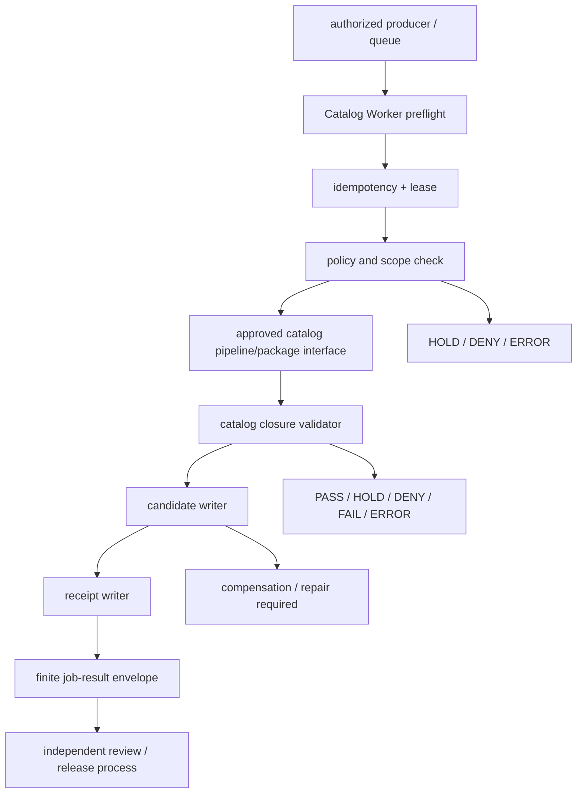

<!-- [KFM_META_BLOCK_V2]
doc_id: kfm://app/workers/src/catalog-worker/readme
title: Catalog Worker README
type: app-readme
subtype: worker-lane-boundary-readme
version: v0.2
prior_version: v0.1
status: draft; repository-grounded; placeholder-only
owner: "NEEDS VERIFICATION — CODEOWNERS routes default repository review to @bartytime4life; no accepted Catalog Worker steward, operations owner, independent reviewer, or release authority was verified"
created: 2026-06-16
updated: 2026-08-12
policy_label: public
current_path: apps/workers/src/catalog_worker/README.md
owning_root: apps/
responsibility: Define the repository-grounded boundary, current scaffold maturity, catalog-closure relationships, non-publisher controls, implementation admission gates, validation burden, correction path, and rollback posture for the app-local Catalog Worker lane
truth_posture: "CONFIRMED pinned repository bytes and adopted placement authority / PROPOSED future worker contract / UNKNOWN queue, runtime, deployment, and operational behavior / NEEDS VERIFICATION ownership, consumers, permissions, CI coupling, and release integration"
evidence_snapshot:
  repository: bartytime4life/Kansas-Frontier-Matrix
  base_ref: main
  base_commit: e1d43539b6f6a237649334b7e6a91957034a38fb
  target_prior_blob: d70d552353aef5558e4ede896264d92c00df2a6b
  entrypoint_blob: be727f309790b3510560fa09ebf7c661141f0189
  workers_readme_blob: 5b5c1e6b067e652a380bf445488a6227028dfc0e
  workers_src_readme_blob: 08ad9f8116f64817ffa4f8b2058613749360c102
  directory_rules_blob: fd49a0b83e55cef52c1124281f093e263526898d
  codeowners_blob: dd2a84aa514d8ecd9208bc347f90f9a2ed37dd61
  inspection_mode: GitHub connector reads, exact-path probes, bounded code search, current open-PR reconciliation, and deterministic Markdown checks
related:
  - ../README.md
  - ../../README.md
  - ../../../README.md
  - ../../../governed-api/README.md
  - ../../../review-console/README.md
  - ../../../../docs/doctrine/directory-rules.md
  - ../../../../docs/adr/ADR-0029-adopt-directory-governance-standard-v2.md
  - ../../../../pipelines/catalog/README.md
  - ../../../../packages/catalog/README.md
  - ../../../../contracts/data/catalog_matrix.md
  - ../../../../contracts/data/catalog_closure_packet.md
  - ../../../../schemas/contracts/v1/data/catalog_matrix.schema.json
  - ../../../../schemas/contracts/v1/data/catalog_closure_packet.schema.json
  - ../../../../fixtures/data/catalog_closure_packet/README.md
  - ../../../../tools/validators/catalog_closure/README.md
  - ../../../../tools/validators/catalog_closure/validate_catalog_closure.py
  - ../../../../tests/validators/test_validate_catalog_closure.py
  - ../../../../data/catalog/README.md
  - ../../../../data/triplets/README.md
  - ../../../../release/README.md
  - ../../../../.github/workflows/catalog-closure-packet.yml
  - ../../../../.github/CODEOWNERS
tags:
  - kfm
  - apps
  - workers
  - catalog-worker
  - catalog-closure
  - catalog-matrix
  - stac
  - dcat
  - prov
  - evidence
  - policy
  - receipts
  - non-publisher
  - fail-closed
  - rollback
notes:
  - "v0.2 replaces proposal-heavy worker claims with a current repository-grounded maturity contract."
  - "The lane contains only this README and one comment-only main.py placeholder at the pinned base."
  - "CatalogClosurePacket contract, schema, fixtures, validator, tests, and read-only workflow exist elsewhere; no Catalog Worker consumer or execution wiring was verified."
  - "CatalogMatrix meaning exists, but its paired schema remains permissive and the schema-declared validate_catalog_matrix.py path is absent."
  - "This documentation change does not add worker code, queue wiring, catalog data, policy, release state, deployment, or publication."
[/KFM_META_BLOCK_V2] -->

<a id="top"></a>

<div align="center">

# Catalog Worker

`apps/workers/src/catalog_worker/`

**App-local deployment wrapper boundary for future, asynchronous catalog-candidate coordination—without owning catalog truth, reusable catalog logic, pipeline transforms, policy, evidence, release decisions, or publication.**

[](#2-repository-grounded-status)
[](#3-authority-and-placement)
[](#4-operating-boundary)
[](#7-catalog-closure-and-finite-outcomes)
[](#13-validation-and-test-strategy)
[](#3-authority-and-placement)

[Purpose](#1-purpose) · [Current state](#2-repository-grounded-status) · [Boundary](#4-operating-boundary) · [Inputs](#5-inputs) · [Outputs](#6-outputs) · [Execution](#8-execution-model) · [Validation](#13-validation-and-test-strategy) · [Done](#18-definition-of-done) · [Rollback](#20-maintenance-correction-and-rollback)

</div>

---

> [!IMPORTANT]
> **Current state:** repository-grounded draft / placeholder-only. The directory contains this README and [`main.py`](./main.py); `main.py` is a single comment and establishes no executable worker behavior. No queue consumer, scheduler, catalog builder, service loop, runtime dependency, deployment manifest, worker-specific test, or release integration was verified at `main@e1d43539b6f6a237649334b7e6a91957034a38fb`.

> [!CAUTION]
> A Catalog Worker may eventually coordinate bounded catalog-candidate jobs. It must never treat a successful job, schema pass, catalog record, STAC item, DCAT distribution, PROV activity, `CatalogMatrix`, receipt, pull request, merge, or generated summary as evidence truth, policy approval, release authority, lifecycle promotion, or KFM publication.

> [!NOTE]
> Badge color is presentation only. The plain-text status, evidence snapshot, validation record, and repository bytes control every claim in this README.

---

## 1. Purpose

`apps/workers/src/catalog_worker/` is the app-local source lane reserved for a future deployable Catalog Worker wrapper.

Its primary responsibility, if implemented, is narrow:

1. receive an authenticated, schema-valid, idempotent catalog job from an authorized producer;
2. verify that the job references governed inputs and an admitted operation;
3. delegate reusable catalog logic to [`packages/catalog/`](../../../../packages/catalog/README.md), lifecycle transformation to [`pipelines/catalog/`](../../../../pipelines/catalog/README.md), and catalog-readiness checks to the approved validator surface;
4. coordinate finite outcomes without silently upgrading authority;
5. emit durable process receipts and reviewable output references;
6. stop before policy approval, release, publication, or public serving.

The worker is a **deployment wrapper**, not the catalog system itself. Directory Rules place independently deployable processes in `apps/`, reusable code in `packages/`, executable lifecycle transformations in `pipelines/`, repository-wide validation in `tools/`, machine shape in `schemas/`, semantic meaning in `contracts/`, governed data instances in `data/`, and release decisions in `release/`.

### 1.1 One-line operating law

> The Catalog Worker may coordinate catalog-candidate work only from declared, governed inputs to finite, receipted outcomes; it cannot create truth, approve policy, promote lifecycle state, release artifacts, or publish.

### 1.2 Goals

A future implementation should make catalog work:

- deterministic where practical;
- idempotent under retry and replay;
- bounded by explicit job scope;
- downstream of source, evidence, rights, sensitivity, validation, policy, and review state;
- transparent about `PASS`, `HOLD`, `DENY`, `FAIL`, and `ERROR`;
- auditable through receipts without treating receipts as proof;
- reversible without deleting source or evidence lineage;
- safe for multi-domain use without collapsing source roles or knowledge types.

### 1.3 Non-goals

This lane does not exist to:

- ingest external sources;
- normalize domain records;
- define STAC, DCAT, PROV, `CatalogMatrix`, or other object semantics;
- become a second schema or policy home;
- store catalog, graph, receipt, proof, release, or published instances;
- resolve `EvidenceRef` into `EvidenceBundle` by bypassing the evidence owner;
- decide rights, sensitivity, access, review, or release;
- serve a public API, map, search index, graph endpoint, export, or AI context;
- make a watcher or job completion equivalent to publication;
- host unique reusable catalog logic that belongs in `packages/`, `pipelines/`, or `tools/`.

[Back to top](#top)

---

<a id="2-repo-fit"></a>
<a id="11-inspection-path"></a>

## 2. Repository-grounded status

### 2.1 Current profile

| Field | Bounded result |
|---|---|
| Repository snapshot | `main@e1d43539b6f6a237649334b7e6a91957034a38fb` |
| Directory contents | Exactly `README.md` and `main.py` |
| Prior README blob | `d70d552353aef5558e4ede896264d92c00df2a6b` |
| Entrypoint blob | `be727f309790b3510560fa09ebf7c661141f0189` |
| Entrypoint bytes | `# catalog_worker entrypoint — greenfield placeholder` plus final newline |
| Executable Python in this lane | None verified |
| Queue or scheduler contract | Not found / `UNKNOWN` |
| Producer or consumer wiring | Not found by bounded `catalog_worker` search |
| Worker-specific tests | Not found by bounded search |
| Worker-specific workflow | Not found by bounded search |
| Deployment/runtime evidence | `UNKNOWN` |
| Public/release authority | Denied by boundary; no authority verified |
| Review route | Default CODEOWNERS route is `@bartytime4life`; approval and stewardship remain separate |

### 2.2 What is confirmed now

**CONFIRMED from pinned repository bytes:**

- the lane exists at the requested path;
- the target README existed and is being revised in place;
- [`main.py`](./main.py) is comment-only;
- the parent [Workers app](../../README.md) and [Workers source](../README.md) contracts classify all eight worker lanes as placeholders;
- accepted [ADR-0029](../../../../docs/adr/ADR-0029-adopt-directory-governance-standard-v2.md) makes [`docs/doctrine/directory-rules.md`](../../../../docs/doctrine/directory-rules.md) the writable Directory Rules authority;
- CODEOWNERS routes default review to `@bartytime4life` but explicitly does not prove stewardship, review completion, policy approval, release approval, or separation of duties;
- bounded repository search surfaced the target README, its placeholder entrypoint, and the parent Workers source README, but no executable Catalog Worker consumer;
- catalog contracts, schemas, fixtures, validators, tests, and workflows exist elsewhere in the repository, with mixed maturity described below.

### 2.3 Adjacent catalog maturity

| Surface | Pinned evidence | Current bounded interpretation |
|---|---|---|
| [`pipelines/catalog/main.py`](../../../../pipelines/catalog/main.py) | Single comment: `catalog stage — greenfield placeholder` | Shared catalog execution entrypoint remains placeholder-only |
| [`packages/catalog/src/catalog/core.py`](../../../../packages/catalog/src/catalog/core.py) | Single comment: `catalog core — greenfield placeholder` | Reusable catalog core remains placeholder-only |
| [`packages/catalog/pyproject.toml`](../../../../packages/catalog/pyproject.toml) | Project `kfm-catalog`, version `0.0.0`, no verified implementation dependency surface | Package identity exists; production capability is not established |
| [`CatalogMatrix` contract](../../../../contracts/data/catalog_matrix.md) | Draft semantic contract | Meaning is documented; not evidence or release authority |
| [`CatalogMatrix` schema](../../../../schemas/contracts/v1/data/catalog_matrix.schema.json) | Greenfield placeholder; only `id` required; additional properties allowed | Shape is too permissive to prove full CatalogMatrix semantics |
| `tools/validators/data/validate_catalog_matrix.py` | Exact path not found at the pinned base | Schema-declared dedicated validator remains absent |
| [`CatalogClosurePacket` contract](../../../../contracts/data/catalog_closure_packet.md) | Fixture-first readiness contract | Bounded readiness object exists; does not create catalog/release authority |
| [`CatalogClosurePacket` schema](../../../../schemas/contracts/v1/data/catalog_closure_packet.schema.json) | Closed Draft 2020-12 shape | Machine shape exists for the fixture-first packet |
| [`catalog_closure` validator](../../../../tools/validators/catalog_closure/validate_catalog_closure.py) | Executable validator present | Can evaluate declared packet invariants; no worker wiring inferred |
| [`catalog closure` tests](../../../../tests/validators/test_validate_catalog_closure.py) | Test source expects four valid and eleven invalid fixtures plus fail-closed parser cases | Executable test surface exists; this README does not claim a current run result |
| [`catalog-closure-packet` workflow](../../../../.github/workflows/catalog-closure-packet.yml) | Read-only, path-scoped, fixture/test workflow | Workflow bytes exist; passing status is not worker or release proof |
| [`data/catalog/`](../../../../data/catalog/README.md) | Canonical catalog projection lane | Owns governed catalog instances, not worker code |
| [`data/triplets/`](../../../../data/triplets/README.md) | Canonical relationship projection lane | Owns derived graph/triplet instances, not canonical truth |
| [`release/`](../../../../release/README.md) | Separate release decision plane | Worker cannot write release approval by implication |

### 2.4 Maturity conclusion

> **Current lane maturity: `PLACEHOLDER_ONLY`.** The repository has meaningful fixture-first catalog-closure validation elsewhere, but no evidence shows that `catalog_worker` imports, executes, schedules, consumes, emits, deploys, or owns any of it.

The correct documentation posture is therefore neither “not started” nor “implemented.” The lane has a governed placement and a detailed admission contract, while runtime behavior remains unimplemented or unverified.

### 2.5 README impact

| Dimension | Result |
|---|---|
| Artifact operation | Same-path complete replacement of the existing README |
| Change class | Editorial and additive documentation; no behavioral implementation |
| Modernization intent | Combined semantic correction and evidence-backed presentation |
| Intensity | Showcase, bounded by current repository evidence |
| Direct dependencies changed | None |
| Runtime effect | None |
| Data/evidence/policy/release effect | None |
| Compatibility | Path, document ID, created date, and prior lineage preserved |
| Review state | Human review required; draft delivery only |
| Rollback | Restore prior blob or revert the documentation commit |

### 2.6 Last reviewed

- **Date:** 2026-08-12
- **Repository:** `bartytime4life/Kansas-Frontier-Matrix`
- **Base:** `main@e1d43539b6f6a237649334b7e6a91957034a38fb`
- **Target prior blob:** `d70d552353aef5558e4ede896264d92c00df2a6b`
- **Inspection:** exact target and entrypoint bytes; parent worker contracts; adopted Directory Rules and ADR; CODEOWNERS; bounded worker reference search; catalog package/pipeline placeholders; catalog data/triplet boundaries; CatalogMatrix and CatalogClosurePacket surfaces; closure validator, fixtures, tests, and workflow
- **Not inspected as operational proof:** deployed worker, queue, runtime logs, dashboard, secrets, storage transactions, required-check settings for this lane, or release/publication activity

[Back to top](#top)

---

<a id="3-authority-boundary"></a>

## 3. Authority and placement

### 3.1 Directory Rules basis

Accepted ADR-0029 adopts Directory Rules v2. The relevant responsibility split is:

| Responsibility | Owning root | Catalog Worker relationship |
|---|---|---|
| Independently deployable process | `apps/` | This lane may become an app-local worker wrapper |
| Reusable non-deployable catalog code | `packages/` | Worker delegates; must not duplicate |
| Executable lifecycle transformation | `pipelines/` | Worker invokes an approved catalog-stage interface |
| Declarative run graph, schedule, scope, resources | `pipeline_specs/` | Worker consumes approved specs; does not self-author schedules |
| Repository-wide validators/operators | `tools/` | Worker may call versioned validators; does not fork their rules |
| Semantic object meaning | `contracts/` | Worker consumes contracts |
| Machine-checkable shape | `schemas/` | Worker validates against canonical schemas |
| Normative allow/deny/hold/restrict/abstain rules | `policy/` | Worker evaluates through the policy owner/runtime |
| Catalog and triplet instances | `data/catalog/`, `data/triplets/` | Worker may emit candidate references through governed writers |
| Process memory and evidence support | `data/receipts/`, `data/proofs/` | Worker emits receipts; does not confuse them with approval |
| Promotion, release, correction, withdrawal, rollback | `release/` | Separate authority; worker cannot approve |
| Public service boundary | `apps/governed-api/` | Public clients never call this worker directly |

### 3.2 Placement outcome

**`PLACE` — same-path documentation modernization.**

This README remains under `apps/workers/src/catalog_worker/` because it explains an existing app-local worker lane. The update:

- creates no new root or child directory;
- moves no file;
- changes no executable source;
- creates no schema, contract, policy, registry, receipt, proof, catalog, release, or publication authority;
- preserves the existing path and document identity;
- does not accept a new ADR or amend Directory Rules.

### 3.3 Dependency direction

A future worker dependency graph should be one-way:

```text
authorized producer / queue
        |
        v
apps/workers/src/catalog_worker/
        |
        +--> packages/catalog/          reusable logic
        +--> pipelines/catalog/         lifecycle catalog transformation
        +--> tools/validators/          validation
        +--> policy runtime             admissibility decisions
        +--> governed writers           candidate records / receipts
        |
        v
review and release surfaces             separate authority
```

The worker must not be imported by `packages/`, `pipelines/`, `tools/`, `contracts/`, `schemas/`, `policy/`, or canonical data stores. Reusable or trust-bearing logic must flow out of the app wrapper into its owning responsibility root.

### 3.4 Bounded context

In domain-driven terms, this lane is a deployment boundary around catalog-job coordination. It is not the catalog domain model, the catalog repository, or the published language for catalog objects. Its ubiquitous language should reuse accepted KFM terms rather than invent app-local synonyms.

[Back to top](#top)

---

<a id="4-default-posture"></a>
<a id="9-worker-obligations"></a>

## 4. Operating boundary

### 4.1 What belongs here

Only app-local worker concerns should eventually live beside this README:

- process startup and shutdown;
- dependency composition;
- queue or job-consumer adapter;
- authenticated producer validation;
- worker-local configuration binding;
- idempotency, lease, retry, and cancellation coordination;
- invocation of approved package, pipeline, policy, and validator interfaces;
- translation from internal results into a closed job-result envelope;
- safe operational telemetry and receipt handoff;
- health/readiness behavior that does not reveal sensitive payloads;
- thin operator-facing entrypoint wiring.

<a id="6-exclusions"></a>

### 4.2 What does not belong here

| Do not place here | Correct owner |
|---|---|
| Reusable catalog construction or crosswalk logic | `packages/catalog/` or another reviewed package |
| Catalog lifecycle transformation | `pipelines/catalog/` |
| Declarative schedules and resource envelopes | `pipeline_specs/` |
| Catalog semantic contracts | `contracts/data/` or approved family |
| Catalog schemas | `schemas/contracts/v1/data/` |
| Policy bundles or policy decisions as rule source | `policy/` and the owning decision-instance lane |
| Catalog, STAC, DCAT, PROV, or graph instances | `data/catalog/`, `data/triplets/` |
| EvidenceBundles or proof packs | `data/proofs/` |
| Run or worker receipts as stored instances | `data/receipts/` |
| Release manifests, promotion decisions, correction notices, rollback cards | `release/` |
| Source acquisition | `connectors/` |
| Domain normalization | stage-first `pipelines/` or domain packages |
| Public API, map, UI, search, graph, export, or AI route | governed app and released artifact surfaces |
| Secrets or credentials | approved external secret store |
| Restricted payload dumps or raw exception traces | denied; use safe structured diagnostics |

### 4.3 Non-publisher invariant

The following transitions are forbidden:

```text
worker success -> PUBLISHED
schema valid -> policy allowed
catalog record exists -> evidence resolved
CatalogMatrix present -> release approved
STAC/DCAT/PROV agree -> claim true
receipt exists -> proof complete
queue acknowledgement -> lifecycle promotion
pull request merged -> KFM publication
```

A worker may prepare and report a candidate. It may not upgrade a candidate’s authority.

### 4.4 Trust membrane

Public clients and ordinary UI surfaces must remain downstream of governed APIs and released public-safe carriers. No browser, map, AI adapter, search client, or export process should call the Catalog Worker directly or read its internal queue, candidate, retry, lease, or diagnostic state.

[Back to top](#top)

---

## 5. Inputs

A future worker must reject undeclared or unresolved inputs. The minimum categories are below; exact contracts remain `PROPOSED` until implemented and accepted.

| Input family | Required properties | Fail-closed condition |
|---|---|---|
| Job envelope | Stable job ID, operation, producer, issued time, attempt, idempotency key, trace/correlation ID | Missing or unauthenticated producer |
| Spec reference | Immutable or versioned pipeline/job specification and `spec_hash` | Mutable, missing, or mismatched spec |
| Target scope | Artifact IDs, domain/scope, lifecycle transition requested, audience | Unbounded wildcard or unauthorized scope |
| Processed input refs | Stable IDs, digests, schema versions, producer receipts | RAW/WORK/QUARANTINE direct bytes or unresolved identity |
| Source refs | Canonical `source_id`, source role, rights/sensitivity posture | Unknown source role or unresolved rights |
| Evidence refs | Resolvable references and stated support scope | Consequential claim without evidence support |
| Catalog carrier refs | STAC/DCAT/PROV or approved profile references | Mixed artifact identity or digest |
| Policy/review refs | Current decision references and obligations | Missing, stale, denied, or incompatible decision |
| Correction/rollback refs | Prior version, correction lineage, rollback target where relevant | Candidate would orphan public lineage |
| Runtime limits | Timeout, memory/concurrency class, retry budget, cancellation token | Missing safety envelope |
| Output destination | Approved logical writer or handoff target | Direct public or release-authority path |

### 5.1 Input prohibitions

The worker must not accept:

- arbitrary filesystem paths as authority;
- unsigned or unversioned job definitions when integrity is required;
- source URLs as a substitute for registered source identity;
- raw payload text embedded in queue messages;
- model-generated evidence or policy decisions;
- unrestricted callback URLs;
- credentials in job bodies;
- user-controlled output paths;
- a prior `PASS` without the exact validator, schema, input digest, and scope that produced it;
- stale release or correction references presented as current.

### 5.2 Time and version locking

Catalog work is time-aware. Jobs should distinguish, where applicable:

- source observation or valid time;
- retrieval time;
- processing time;
- catalog candidate time;
- review time;
- release time;
- correction or withdrawal time.

A retry must not silently substitute newer source, schema, policy, code, or release state. If effective dependencies change, the worker should create a new attempt or job version with a new receipt rather than pretending the replay is identical.

[Back to top](#top)

---

## 6. Outputs

### 6.1 Permitted output classes

A future worker may emit references to:

- catalog-candidate records written through an approved catalog writer;
- triplet or graph-delta candidates written through an approved projection writer;
- validation reports;
- finite job-result envelopes;
- process and worker receipts;
- review handoff packets;
- quarantine/hold obligations;
- correction or supersession candidates;
- safe telemetry events.

### 6.2 Output authority limits

| Output | What it can establish | What it cannot establish |
|---|---|---|
| Catalog candidate | Proposed discovery/interoperability projection | Truth, public readiness, release |
| Triplet candidate | Proposed relationship projection | Canonical domain fact |
| Validation report | Declared check result for exact inputs | Evidence truth, policy approval |
| Worker receipt | What ran, with what declared inputs/outputs | Proof, approval, release |
| `PASS` result | Packet is internally ready for a named next gate | Promotion, publication |
| `HOLD` result | Review or obligation remains unresolved | Automatic retry success |
| `DENY` result | Requested operation is not permitted under a recorded decision | Erasure of source/evidence lineage |
| `FAIL` result | Shape or semantic closure invariant failed | Operator blame or public error detail |
| `ERROR` result | Worker could not safely evaluate or complete | Permission to guess or allow |
| Review handoff | Candidate for independent review | Review completion |
| Correction candidate | Proposed lineage repair | Executed correction or cache invalidation |

### 6.3 Storage rule

The worker should return identifiers and references, not use its source directory as storage. Logical instance homes remain:

```text
data/catalog/       catalog projections
data/triplets/      relationship projections
data/receipts/      process memory
data/proofs/        evidence and proof support
release/            release and correction decisions
data/published/     release-approved public-safe carriers
```

### 6.4 No partial-authority output

If the worker writes several coordinated records, a partial write must not appear complete. Use transactional or compensating behavior appropriate to the actual storage system, and record the final disposition. A failed catalog write must not leave a success receipt, release-ready alias, or public index entry.

[Back to top](#top)

---

## 7. Catalog closure and finite outcomes

### 7.1 Existing fixture-first profile

The current repository includes a bounded [`CatalogClosurePacket`](../../../../contracts/data/catalog_closure_packet.md) profile with:

- a closed Draft 2020-12 schema;
- synthetic valid and invalid fixtures;
- an executable validator;
- focused tests;
- a read-only workflow;
- finite outcomes.

This is meaningful repository implementation evidence for a **validator profile**, not for this worker.

### 7.2 Outcome vocabulary

The existing closure profile uses:

| Outcome | Existing profile meaning | Worker handling rule |
|---|---|---|
| `PASS` | Packet is internally consistent and ready for the named next gate | Acknowledge bounded completion; never promote or release |
| `HOLD` | Packet is valid but rights, sensitivity, or human review remains unresolved | Stop and preserve obligations |
| `DENY` | Recorded policy or review state forbids handoff | Stop without unsafe retry or detail leakage |
| `FAIL` | Schema or semantic closure invariant failed | Record reviewed reason codes and reject candidate |
| `ERROR` | Input could not be safely read or evaluated | Fail closed; operator remediation required |

A future worker should preserve this vocabulary when invoking that profile. It must not rename `FAIL` to `DENY`, coerce `HOLD` to success, or flatten all negative outcomes into one generic exception.

### 7.3 Catalog-carrier agreement

For the existing packet profile, STAC, DCAT, and PROV carriers must agree on the exact artifact identity, digest, and release-candidate reference when relevant. Agreement is a consistency claim only.

```text
STAC identity ─┐
DCAT identity ─┼─> bounded agreement check ─> PASS / HOLD / DENY / FAIL / ERROR
PROV identity ─┘
```

The check does not establish that:

- the underlying claim is true;
- the source is authoritative for every use;
- rights or sensitivity are universally resolved;
- a reviewer approved release;
- a release manifest exists;
- the artifact is public.

### 7.4 CatalogMatrix distinction

`CatalogMatrix` and `CatalogClosurePacket` are not synonyms.

| Object | Current role | Maturity |
|---|---|---|
| `CatalogMatrix` | Semantic descriptor for catalog/evidence/source/lifecycle relationships | Draft meaning; permissive placeholder schema; dedicated declared validator absent |
| `CatalogClosurePacket` | Immutable, bounded readiness packet for carrier and dependency agreement | Contract, closed schema, fixtures, validator, tests, workflow present |

The worker must not synthesize a persisted `CatalogMatrix` merely because closure validation exists, and it must not use a `CatalogClosurePacket` as a public catalog record.

### 7.5 Source-role anti-collapse

Catalog work must preserve distinctions such as:

- observation vs. model;
- forecast vs. historical observation;
- regulatory context vs. observed event;
- aggregate vs. exact-place fact;
- public-safe generalized geometry vs. canonical exact geometry;
- generated explanation vs. evidence;
- candidate vs. reviewed release;
- catalog discoverability vs. factual authority.

When a mapping cannot preserve the distinction, the worker should `HOLD`, `DENY`, `FAIL`, or `ERROR` according to the governing contract rather than invent a plausible mapping.

[Back to top](#top)

---

<a id="7-catalog-worker-map"></a>
<a id="8-diagram"></a>

## 8. Execution model

Everything in this section is `PROPOSED` until code, contracts, tests, and runtime evidence establish it.

### 8.1 Thin-wrapper architecture


```mermaid
flowchart TD
    A["authorized producer / queue"] --> B["Catalog Worker preflight"]
    B --> C["idempotency + lease"]
    C --> D["policy and scope check"]
    D --> E["approved catalog pipeline/package interface"]
    E --> F["catalog closure validator"]
    F --> G["candidate writer"]
    G --> H["receipt writer"]
    H --> I["finite job-result envelope"]
    I --> J["independent review / release process"]

    D --> K["HOLD / DENY / ERROR"]
    F --> L["PASS / HOLD / DENY / FAIL / ERROR"]
    G --> M["compensation / repair required"]
```

**Text equivalent:** an authorized job enters preflight, acquires an idempotent lease, passes policy/scope checks, delegates catalog work and validation, writes only through governed interfaces, emits a receipt, and returns a finite result. Review and release remain separate. Any negative or partial-write path stops safely.

### 8.2 Candidate components

Component names are illustrative, not committed module paths.

| App-local responsibility | Purpose | Must delegate |
|---|---|---|
| Process entrypoint | Start, stop, signal handling, readiness | Reusable logic |
| Job adapter | Decode authenticated queue/job envelope | Canonical job schema |
| Preflight | Scope, schema, producer, version, limits | Schema/policy evaluation |
| Idempotency coordinator | Replay-safe lease and attempt state | Durable store semantics |
| Catalog coordinator | Call approved transformation/build interface | Pipeline/package implementation |
| Closure coordinator | Call approved validator profile | Validator rules |
| Output coordinator | Write candidates through governed writer | Data authority |
| Receipt coordinator | Emit process memory | Receipt schema/storage |
| Result encoder | Closed outcome envelope | Runtime contract |
| Telemetry adapter | Safe metrics/logs/traces | Secret and sensitivity policy |

### 8.3 Direct file access

A worker implementation should not traverse lifecycle directories directly as its normal interface. Prefer typed, governed repositories or service interfaces that enforce identity, policy, versioning, and writer boundaries. Path literals are not access authority.

### 8.4 Network posture

The current fixture profile is no-network. A future worker network call requires an explicit, reviewed interface and least-privilege policy. The worker must not:

- fetch arbitrary remote catalog records from job-provided URLs;
- follow redirects to unapproved hosts;
- send evidence or restricted metadata to external services;
- rely on network access during unit tests;
- treat network success as source authority.

### 8.5 Shutdown and cancellation

A graceful shutdown should:

1. stop accepting new jobs;
2. preserve or release leases according to the job contract;
3. mark interrupted attempts without reporting success;
4. flush safe receipts/telemetry;
5. avoid partial public or release effects;
6. support deterministic replay or explicit remediation.

[Back to top](#top)

---

<a id="10-job-contract"></a>

## 9. Job contract and deterministic identity

### 9.1 Proposed envelope

A future semantic and machine contract should define at least:

```yaml
catalog_job:
  job_id: "stable identifier"
  job_version: "contract version"
  operation: "declared finite operation"
  producer_ref: "authenticated producer identity"
  idempotency_key: "stable replay key"
  attempt: 1
  issued_at: "RFC 3339 timestamp"
  deadline_at: "RFC 3339 timestamp or null"
  spec_ref: "immutable or versioned job specification"
  spec_hash: "sha256:..."
  target:
    artifact_id: "stable artifact identity"
    requested_transition: "CATALOG_REVIEW or other admitted operation"
    audience: "INTERNAL, STEWARD, or approved candidate class"
  input_refs: []
  evidence_refs: []
  policy_decision_refs: []
  review_refs: []
  correction_refs: []
  rollback_ref: null
  limits:
    timeout_seconds: 0
    retry_budget: 0
  authority:
    may_publish: false
    may_release: false
    may_promote: false
```

This example is explanatory. It is not a canonical schema and must not be copied into production without the contract/schema/policy/test slice required by Directory Rules.

### 9.2 Identity rules

A job identity should bind, at minimum:

- operation;
- target artifact or bounded batch;
- spec version and digest;
- effective input references and digests;
- relevant schema/policy versions;
- requested transition;
- producer identity;
- correction/supersession relation when applicable.

Do not derive identity from mutable file paths, display names, queue offsets, wall-clock time alone, or generated summaries.

### 9.3 Idempotency

For the same admitted identity:

- duplicate delivery should return the existing safe result or resume under the contract;
- a retry must not create duplicate catalog or triplet records;
- a changed input, spec, policy, or correction state must not reuse the old successful identity;
- concurrent attempts require a defined lease/conflict outcome;
- idempotency records must not expose protected payload content.

### 9.4 Replay and drift

Before replay, compare the effective:

- input digests;
- contract/schema versions;
- policy bundle and decision references;
- code or package version;
- catalog profile;
- release/correction state;
- requested output scope.

If any material dependency changed, classify the run as a new version or return `HOLD`/`ERROR`; do not silently call it an identical replay.

[Back to top](#top)

---

## 10. Security, rights, and sensitivity

### 10.1 Fail-closed rule

Unknown or conflicting rights, sovereignty, cultural sensitivity, living-person data, DNA/genomics, rare-species locations, archaeology, infrastructure, private property/land-title context, or harmful precision blocks higher-risk catalog projection and public handoff.

### 10.2 Required safeguards

A future worker should enforce or delegate:

- authenticated and authorized producers;
- least-privilege queue and storage access;
- fixed operation allowlists;
- bounded input and output sizes;
- parser limits and duplicate-key rejection;
- URI/locator validation;
- no secret material in job envelopes;
- no raw payload echo in diagnostics;
- no exact restricted geometry in logs, receipts, or public candidates;
- sensitivity-aware redaction/generalization before downstream rendering;
- rights and source-term obligations;
- isolation of untrusted catalog metadata;
- timeout, cancellation, and resource budgets;
- safe serialization and content-type handling;
- dependency and image provenance appropriate to deployment;
- auditability without protected-content leakage.

### 10.3 Prompt and generated-content boundary

Catalog metadata, source text, issue bodies, pull-request text, logs, and generated summaries are untrusted input. Embedded instructions cannot expand worker authority, request secrets, change output paths, weaken validation, or authorize release.

Generated language may help draft a candidate description only when:

- the operation explicitly allows it;
- evidence support is resolvable;
- policy permits it;
- generated text is labeled;
- citations are validated where claims depend on evidence;
- the output remains a candidate, not truth or release authority;
- an appropriate receipt records generation.

### 10.4 Public-safe errors

External or public consumers should never receive:

- stack traces;
- filesystem paths;
- queue names or broker details;
- secret names/values;
- raw source payloads;
- exact restricted locations;
- internal policy reasons whose disclosure increases risk;
- full evidence excerpts not approved for exposure.

Use stable reason codes and bounded human messages.

[Back to top](#top)

---

## 11. Observability and receipts

### 11.1 Observability is not authority

Logs, metrics, traces, dashboards, and receipts support operations and audit. They do not prove truth, policy approval, review completion, release, or publication.

### 11.2 Minimum safe signals

A mature worker should make these observable without leaking protected content:

| Signal | Example dimension | Safety note |
|---|---|---|
| Jobs received | operation, producer class | No raw payload labels |
| Finite outcomes | `PASS/HOLD/DENY/FAIL/ERROR` | Stable reason-code family |
| Duration | queue wait, execution, validation | Avoid IDs with sensitive meaning |
| Retry/lease behavior | attempt count, conflict count | No secret broker topology |
| Candidate writes | object family, logical destination | No private locator |
| Receipt writes | receipt type, success/failure | Receipt presence is not approval |
| Validation profile | validator ID/version | Bind exact input digest elsewhere |
| Policy gate | bounded outcome class | Avoid exposing protected rule details |
| Correction/replay | new vs. replay vs. supersession | Preserve lineage |
| Resource limits | timeouts, memory/concurrency saturation | Operational only |

### 11.3 Receipt content

A worker receipt should identify:

- worker and version;
- job and attempt;
- exact spec/schema/policy/validator versions;
- input and output references/digests;
- finite result;
- reason codes;
- timing;
- producer and execution environment identity appropriate to policy;
- correction/supersession linkage;
- no-authority statement where required.

It must not include credentials, private keys, protected source bytes, private prompts, hidden reasoning, or unsafe exact coordinates.

### 11.4 Health endpoints

A health check may prove that the process loop responds. Readiness should additionally verify only the dependencies required to accept work safely. Neither endpoint proves catalog correctness, release readiness, or publication.

[Back to top](#top)

---

## 12. Failure, retry, and recovery

### 12.1 Failure classes

| Class | Example | Required posture |
|---|---|---|
| Input rejection | Invalid schema, duplicate JSON key, unsupported operation | `FAIL` or `ERROR` per contract; no retry loop |
| Policy stop | Rights/sensitivity unresolved or denied | `HOLD` or `DENY`; human/policy remediation |
| Evidence stop | Evidence reference missing or unsupported | `HOLD`/`FAIL`/abstention-equivalent; no invented support |
| Dependency failure | Validator/storage unavailable | `ERROR`; retry only if classified transient |
| Conflict | Existing different result for same identity | `HOLD` or conflict outcome; no overwrite |
| Partial write | Candidate written, receipt failed, or vice versa | Compensation/repair required; no success |
| Timeout/cancellation | Lease lost, deadline exceeded, shutdown | Safe interrupted state; deterministic replay path |
| Stale state | Release/correction/policy changed during run | Abort or restart against new version |
| Integrity failure | Digest/spec mismatch | `DENY`/`FAIL` according to governing contract; quarantine evidence |
| Unknown failure | Unclassified exception | `ERROR`; fail closed |

### 12.2 Retry policy

Retry only when all are true:

- the failure is explicitly transient;
- retry cannot duplicate or upgrade authority;
- idempotency and lease behavior are defined;
- the effective inputs and policy state remain valid;
- the retry budget is bounded;
- operator visibility exists for exhausted retries.

Do not retry `DENY`, semantic `FAIL`, unknown rights, or review-required `HOLD` as though time alone will make them succeed.

### 12.3 Dead-letter or held work

Held jobs require:

- stable identity;
- finite reason codes;
- original input references, not copied restricted payload;
- remediation obligation;
- review owner or queue class where authorized;
- retention and deletion policy;
- safe replay trigger;
- no direct public access.

### 12.4 Recovery and correction

Recovery must preserve history. Never “fix” a failed or released catalog record by overwriting lineage without a correction or supersession relation. When public artifacts are affected, correction, withdrawal, cache invalidation, and rollback belong to the release/correction process, not an implicit worker retry.

[Back to top](#top)

---

<a id="12-validation-expectations"></a>

## 13. Validation and test strategy

### 13.1 Documentation validation for this README

A README-only change should verify:

- UTF-8 and LF line endings;
- exactly one final newline;
- no trailing whitespace or tabs;
- one KFM meta block;
- exactly one H1;
- logical heading order with no skipped levels;
- balanced and language-tagged code fences;
- unique explicit anchors;
- internal navigation resolution;
- relative repository links;
- table column consistency;
- no unsupported implementation, test, runtime, owner, or release claims;
- no secret-like values or sensitive payloads;
- exact one-file repository diff;
- remote blob parity after write.

### 13.2 Future worker test layers

| Layer | Purpose | Required negative examples |
|---|---|---|
| Contract/schema | Job and result shape | Unknown fields, duplicate keys, invalid enums, unsafe locators |
| Unit | App-local coordination | Wrong delegation, unsafe defaults, result coercion |
| Idempotency | Retry/replay safety | Duplicate delivery, concurrent lease, changed input under same key |
| Policy | Fail-closed admissibility | Missing decision, stale decision, denied rights/sensitivity |
| Evidence | Support closure | Missing refs, unsupported claim, stale evidence |
| Catalog closure | Carrier/reference agreement | Identity/digest/release-ref mismatch |
| Writer integration | Atomicity/compensation | Partial catalog/receipt write |
| Security | Input and diagnostics | Oversize payload, injection text, path traversal, secret echo |
| Observability | Safe telemetry | Restricted content in labels/logs |
| Shutdown | Cancellation/recovery | Lost lease, interrupted write, duplicate resume |
| End-to-end | Authorized candidate handoff | Attempted direct release/publication |
| Rollback/correction | Reversibility | Stale alias, orphan correction, failed cache invalidation handoff |

### 13.3 Fixture posture

Use synthetic, public-safe, non-joinable fixtures by default. A fixture must not become a disguised source payload. Include:

- valid catalog-review candidate;
- valid release-review readiness packet with authority flags false;
- policy `HOLD`;
- policy `DENY`;
- carrier identity mismatch;
- digest mismatch;
- release-reference mismatch;
- unresolved evidence;
- stale review;
- missing rollback reference;
- duplicate key and non-finite number;
- oversize or malformed input;
- sensitive-geometry canary;
- diagnostics no-echo canary;
- deterministic replay case;
- partial-write compensation case.

### 13.4 Existing commands for adjacent closure profile

These commands are current repository interfaces for the adjacent fixture-first profile, not proof of Catalog Worker behavior:

```bash
python -m unittest discover \
  --start-directory tests/validators \
  --pattern 'test_validate_catalog_closure.py' \
  --verbose

python tools/validators/catalog_closure/validate_catalog_closure.py --fixtures
```

A worker implementation should add its own tests and must not claim coverage merely because the adjacent validator suite exists.

### 13.5 Validation interpretation

- A parser pass proves parseability.
- A schema pass proves declared shape.
- A semantic validator pass proves only named invariants for exact inputs.
- A unit test proves the tested branch.
- A workflow success proves the checked revision and workflow scope.
- A receipt proves process memory.
- None alone proves truth, policy approval, review, release, publication, or safe production operation.

[Back to top](#top)

---

<a id="13-safe-change-pattern"></a>

## 14. Safe implementation sequence

Do not jump from the comment-only entrypoint to a live queue consumer. Graduate through reviewable gates.

### Gate 0 — Current placeholder

**CONFIRMED now:**

- lane and README exist;
- `main.py` is comment-only;
- no worker behavior established.

Exit criterion: accepted scope and direct dependency map for the first implementation slice.

### Gate 1 — Contract-first worker envelope

Add, in their correct roots:

- semantic job and result contract;
- machine schema;
- valid/invalid fixtures;
- deterministic validator;
- focused tests;
- source/authority map;
- no-network workflow if needed.

Non-effects: no queue, storage write, release, or publication.

### Gate 2 — In-process dry-run wrapper

Implement a thin app-local wrapper that:

- reads one synthetic job;
- validates preconditions;
- invokes the existing catalog-closure validator or an approved package interface;
- emits a finite result and synthetic receipt;
- performs no live storage or network write.

### Gate 3 — Governed writer and idempotency

Add:

- versioned idempotency/lease interface;
- approved candidate writer;
- receipt writer;
- compensation behavior;
- negative integration tests;
- no public or release-authority path.

### Gate 4 — Authorized queue/runtime integration

Only after:

- producer identity and queue contract are accepted;
- least-privilege permissions are verified;
- deployment configuration, secret references, limits, health, shutdown, and observability are reviewed;
- replay and dead-letter behavior are tested;
- rollback/runbooks exist.

### Gate 5 — Operational evidence

Require:

- exact deployment version;
- current configuration and policy bundle;
- successful synthetic and negative smoke tests;
- emitted receipts;
- dashboards/alerts tied to safe metrics;
- failure and rollback drill;
- independent review.

Even at Gate 5, the worker remains a non-publisher. Release and publication require their own governed transitions.

### First recommended implementation slice

The smallest coherent future slice is **not** a live queue. It is a fixture-first Catalog Worker job envelope and dry-run coordinator that delegates to the existing `CatalogClosurePacket` validator and proves:

- closed input/output shape;
- idempotent replay;
- exact finite-outcome preservation;
- no raw/internal/public path;
- no policy/release/publication authority;
- safe diagnostics;
- receipt integrity;
- ordinary revert rollback.

This is `PROPOSED`; it is not part of this README-only change.

[Back to top](#top)

---

## 15. Review burden and separation of duties

### 15.1 Current executable review route

The repository-wide CODEOWNERS default routes this path to `@bartytime4life`.

That route is:

- a GitHub review-routing mechanism;
- not proof that review occurred;
- not an accepted Catalog Worker stewardship assignment;
- not independent author/approver separation;
- not policy, evidence, release, or publication authority.

### 15.2 Review roles by change

| Change | Minimum role perspectives to establish |
|---|---|
| README wording only | Worker/source-boundary and docs review |
| Job contract/schema | Worker, contract, schema, validation |
| Catalog semantics or mapping | Catalog, domain/source-role, evidence |
| Policy or sensitivity behavior | Policy, rights/sensitivity, affected domain |
| Queue/runtime integration | Worker operations, security, infrastructure |
| Candidate writer | Data/catalog, database/storage, validation |
| Receipt changes | Audit/provenance and receipt owner |
| Correction/rollback behavior | Release/correction and operations |
| Public consumer impact | Governed API/UI plus release authority |
| High-risk sensitive domain | Qualified steward and independent review appropriate to domain |

Role names are responsibilities, not verified GitHub identities. Do not add placeholder teams to CODEOWNERS.

### 15.3 Separation rules

Where consequence warrants:

- generator/worker author is not final approver;
- policy rule author is not sole policy-decision reviewer;
- release requester is not sole release approver;
- worker success cannot self-authorize the next gate;
- incident remediation preserves independent correction/release review;
- emergency administration stays outside the normal public path and is fully auditable.

[Back to top](#top)

---

## 16. Related folders and interfaces

### 16.1 Worker neighborhood

- Parent source boundary: [`apps/workers/src/`](../README.md)
- Workers app boundary: [`apps/workers/`](../../README.md)
- Apps responsibility root: [`apps/`](../../../README.md)
- Local placeholder: [`main.py`](./main.py)
- Governed public ingress: [`apps/governed-api/`](../../../governed-api/README.md)
- Human review surface: [`apps/review-console/`](../../../review-console/README.md)

### 16.2 Catalog and validation surfaces

- Shared catalog pipeline: [`pipelines/catalog/`](../../../../pipelines/catalog/README.md)
- Reusable catalog package: [`packages/catalog/`](../../../../packages/catalog/README.md)
- `CatalogMatrix` meaning: [`contracts/data/catalog_matrix.md`](../../../../contracts/data/catalog_matrix.md)
- `CatalogClosurePacket` meaning: [`contracts/data/catalog_closure_packet.md`](../../../../contracts/data/catalog_closure_packet.md)
- `CatalogMatrix` placeholder schema: [`schemas/contracts/v1/data/catalog_matrix.schema.json`](../../../../schemas/contracts/v1/data/catalog_matrix.schema.json)
- Closure packet schema: [`schemas/contracts/v1/data/catalog_closure_packet.schema.json`](../../../../schemas/contracts/v1/data/catalog_closure_packet.schema.json)
- Closure fixtures: [`fixtures/data/catalog_closure_packet/`](../../../../fixtures/data/catalog_closure_packet/README.md)
- Closure validator docs: [`tools/validators/catalog_closure/`](../../../../tools/validators/catalog_closure/README.md)
- Closure validator: [`validate_catalog_closure.py`](../../../../tools/validators/catalog_closure/validate_catalog_closure.py)
- Closure tests: [`test_validate_catalog_closure.py`](../../../../tests/validators/test_validate_catalog_closure.py)
- Closure workflow: [`catalog-closure-packet.yml`](../../../../.github/workflows/catalog-closure-packet.yml)

### 16.3 Data, policy, and release surfaces

- Catalog projections: [`data/catalog/`](../../../../data/catalog/README.md)
- Triplet/graph projections: [`data/triplets/`](../../../../data/triplets/README.md)
- Receipts: [`data/receipts/`](../../../../data/receipts/README.md)
- Proofs/evidence support: [`data/proofs/`](../../../../data/proofs/README.md)
- Policy: [`policy/`](../../../../policy/README.md)
- Release decisions and correction/rollback: [`release/`](../../../../release/README.md)

### 16.4 Governance

- Adopted Directory Rules: [`docs/doctrine/directory-rules.md`](../../../../docs/doctrine/directory-rules.md)
- Adoption decision: [`ADR-0029`](../../../../docs/adr/ADR-0029-adopt-directory-governance-standard-v2.md)
- Review routing: [`.github/CODEOWNERS`](../../../../.github/CODEOWNERS)

[Back to top](#top)

---

## 17. ADRs and unresolved decisions

### 17.1 Accepted placement authority

`ADR-0029` is accepted and controls this README’s placement posture. This update does not change it.

### 17.2 Decisions not made here

This README does not decide:

- canonical Catalog Worker job/result object names;
- queue or broker technology;
- producer identity and authorization model;
- scheduler ownership;
- whether `CatalogMatrix` persistence is required;
- how CatalogMatrix’s permissive schema should be closed;
- whether catalog construction lives entirely in `pipelines/catalog/`, partly in `packages/catalog/`, or behind another accepted interface;
- storage transaction/compensation technology;
- worker receipt subtype and canonical schema;
- policy bundle names;
- deployment environment;
- retention and dead-letter policy;
- operational service-level objectives;
- whether a dedicated worker workflow/check should become required;
- release or publication integration.

### 17.3 ADR triggers for future work

Open or amend an ADR when a change would:

- create or repurpose an authority root or lifecycle lane;
- establish a new canonical shared object family;
- settle a disputed schema/contract/policy home;
- create a public or privileged access path;
- change promotion, release, correction, withdrawal, or rollback semantics;
- introduce a durable queue/runtime architecture with cross-system consequences;
- create a parallel catalog, proof, receipt, or release authority;
- require a breaking migration across producers/consumers.

A normal implementation PR may add bounded app wiring when existing authority, contracts, schemas, and interfaces are already accepted and the change does not trigger those conditions.

[Back to top](#top)

---

<a id="14-definition-of-done"></a>

## 18. Definition of done

### 18.1 README modernization done

This documentation update is complete when:

- [ ] only `apps/workers/src/catalog_worker/README.md` changes;
- [ ] the prior path and document ID remain stable;
- [ ] current placeholder-only maturity is explicit;
- [ ] every implementation claim is backed by pinned repository evidence;
- [ ] adjacent catalog machinery is distinguished from worker runtime;
- [ ] `CatalogMatrix` and `CatalogClosurePacket` are not collapsed;
- [ ] authority, inputs, outputs, security, finite outcomes, retries, receipts, validation, review, correction, and rollback are documented;
- [ ] all relative links and anchors resolve;
- [ ] structural Markdown checks pass;
- [ ] remote bytes match validated authored bytes;
- [ ] hosted documentation checks are reported without overclaiming;
- [ ] human review remains pending in a draft pull request.

### 18.2 Future implementation done

The Catalog Worker is not “implemented” until current-session evidence establishes:

- [ ] accepted semantic job/result contracts;
- [ ] closed schemas and reviewed fixtures;
- [ ] app-local executable source beyond a placeholder;
- [ ] approved package/pipeline/validator interfaces;
- [ ] authenticated producer and queue/runtime wiring;
- [ ] idempotency, lease, retry, cancellation, dead-letter, and replay behavior;
- [ ] governed candidate and receipt writers;
- [ ] finite-outcome preservation;
- [ ] policy/evidence/review preconditions;
- [ ] safe telemetry and diagnostics;
- [ ] negative, integration, security, and recovery tests;
- [ ] deployment and least-privilege evidence;
- [ ] runbooks and rollback drill;
- [ ] no direct public/internal-store bypass;
- [ ] explicit non-publisher behavior;
- [ ] independent review appropriate to risk.

### 18.3 Release/publication done

Worker completion is never release completion. Public release still requires identity, rights, sensitivity, validation, provenance, evidence, policy, review, release decision, correction, withdrawal, cache invalidation, and rollback support appropriate to consequence.

[Back to top](#top)

---

<a id="15-open-verification-items"></a>

## 19. Open verification register

| ID | Question | Status | Evidence needed |
|---|---|---:|---|
| `CATW-001` | Who owns Catalog Worker implementation and operations? | `NEEDS VERIFICATION` | Accepted assignment and review route |
| `CATW-002` | Which producer may enqueue jobs? | `UNKNOWN` | Contract, auth policy, runtime wiring |
| `CATW-003` | Which queue, scheduler, or trigger is canonical? | `UNKNOWN` | Accepted architecture and deployment config |
| `CATW-004` | What is the canonical job/result schema? | `UNKNOWN` | Contract/schema/fixtures/validator |
| `CATW-005` | What exact first operation is admitted? | `NEEDS VERIFICATION` | Bounded use case and acceptance criteria |
| `CATW-006` | Does the worker call `pipelines/catalog/`, `packages/catalog/`, validator tooling, or a service interface? | `UNKNOWN` | Dependency decision and executable code |
| `CATW-007` | How are CatalogMatrix and closure-packet responsibilities divided? | `NEEDS VERIFICATION` | Accepted semantics and consumer map |
| `CATW-008` | Will CatalogMatrix’s schema be closed and its declared validator implemented? | `UNKNOWN` | Schema/validator PR and tests |
| `CATW-009` | What storage transaction and compensation model applies? | `UNKNOWN` | Writer interface, integration tests |
| `CATW-010` | What receipt family and schema record worker runs? | `UNKNOWN` | Receipt contract/schema/registry |
| `CATW-011` | What idempotency and lease store is approved? | `UNKNOWN` | Runtime architecture and replay tests |
| `CATW-012` | Which finite reason codes are stable across worker and closure validator? | `NEEDS VERIFICATION` | Published language/contract |
| `CATW-013` | What rights/sensitivity obligations can stop a job? | `NEEDS VERIFICATION` | Policy and affected-domain review |
| `CATW-014` | What are log, metric, trace, and retention rules? | `UNKNOWN` | Operations/security policy |
| `CATW-015` | What resource and concurrency limits apply? | `UNKNOWN` | Deployment profile and load tests |
| `CATW-016` | What health/readiness contract is safe? | `UNKNOWN` | Runtime interface and tests |
| `CATW-017` | What rollback and correction drill proves reversibility? | `NEEDS VERIFICATION` | Runbook, test environment, receipt |
| `CATW-018` | Which workflows/checks cover worker code and are required? | `UNKNOWN` | Workflow/ruleset evidence |
| `CATW-019` | Are public or internal consumers already expecting this worker? | `UNKNOWN` | Import, queue, deployment, and runtime inventory |
| `CATW-020` | What independent review is required before operational use? | `NEEDS VERIFICATION` | Governance decision tied to risk |

Unknowns narrow scope and block unsafe transitions; they do not authorize plausible defaults.

[Back to top](#top)

---

## 20. Maintenance, correction, and rollback

### 20.1 Re-review triggers

Re-review this README when any of these change:

- `main.py` gains executable code;
- a worker job contract, schema, or fixture family is added;
- a queue, scheduler, producer, or deployment is introduced;
- the worker imports a package, pipeline, policy, validator, or writer;
- CatalogMatrix or catalog-closure semantics change;
- a new data, receipt, proof, release, or public consumer is wired;
- security, rights, sensitivity, logging, retention, or correction behavior changes;
- Directory Rules or an applicable ADR changes;
- the default review route or stewardship assignment changes;
- six months pass without evidence refresh.

### 20.2 Documentation correction

When a claim becomes stale:

1. pin the newly inspected repository state;
2. identify the exact stale statement;
3. classify the difference as implementation change, documentation drift, or authority conflict;
4. update the smallest dependency-closed documentation set;
5. preserve prior blob/commit lineage;
6. validate links, anchors, metadata, and affected claims;
7. use a reviewed pull request—never rewrite shared history.

### 20.3 Rollback for this README-only change

**Before merge:** close the draft pull request and abandon the scoped branch through normal repository controls.

**After an authorized merge:** revert the documentation commit or restore prior blob `d70d552353aef5558e4ede896264d92c00df2a6b` through a reviewed commit. Re-run the same Markdown, link, metadata, exact-diff, and hosted documentation checks.

No worker process, queue, catalog instance, receipt, proof, policy decision, release record, deployment, cache, or public artifact requires rollback because this change modifies documentation only.

### 20.4 Rollback for future worker behavior

A future implementation must define:

- code/config rollback target;
- queue pause and drain behavior;
- lease and retry disposition;
- partial-write repair;
- candidate and receipt correction;
- downstream index/cache invalidation handoff;
- release/correction escalation when public artifacts were affected;
- proof that rollback does not re-expose withdrawn or restricted data.

[Back to top](#top)

---

<a id="appendix-a-preservation-note"></a>

## Appendix A. No-loss preservation ledger

| v0.1 element | v0.2 disposition |
|---|---|
| Stable document ID and path | Preserved |
| Catalog Worker purpose | Preserved, narrowed to app-local coordination |
| Repo-fit responsibility map | Preserved and grounded in current Directory Rules |
| Non-publisher boundary | Preserved and strengthened |
| Input/output posture | Preserved and expanded |
| Candidate module map | Reframed as illustrative responsibilities, not file claims |
| Mermaid flow | Replaced with a repository-grounded thin-wrapper flow and text equivalent |
| Worker obligations | Preserved across boundary, security, execution, and review sections |
| Job contract concept | Preserved as explicitly proposed example |
| Inspection path | Preserved through pinned status, evidence, and verification register |
| Validation expectations | Preserved and expanded into documentation and future-worker layers |
| Safe change pattern | Preserved as staged graduation gates |
| Definition of done | Preserved and split into docs, worker, and release thresholds |
| Open verification list | Preserved and expanded to 20 traceable items |
| Rollback posture | Preserved and made exact with prior blob |
| Unsupported owner/runtime claims | Corrected to `NEEDS VERIFICATION` / `UNKNOWN` |
| Existing implementation | Not changed |
| Source activation, release, deployment, publication | None |

---

## Appendix B. Maintainer inspection checklist

Before editing worker behavior:

### Repository and authority

- [ ] Pin current base commit and target blobs.
- [ ] Read parent Workers app and source READMEs.
- [ ] Read accepted Directory Rules and applicable ADRs.
- [ ] Check path-scoped instruction files.
- [ ] Search open PRs, branches, issues, and recent merges for overlap.
- [ ] Confirm CODEOWNERS route without treating it as approval.

### Implementation and dependencies

- [ ] Inventory every file in the Catalog Worker lane.
- [ ] Search imports, queue names, schedules, deployments, consumers, and tests.
- [ ] Inspect package and pipeline maturity.
- [ ] Inspect exact contract/schema/policy/validator versions.
- [ ] Inspect candidate writers and storage transactions.
- [ ] Inspect receipts, corrections, releases, and public consumers.

### Safety and validation

- [ ] Identify rights/sensitivity and source-role risks.
- [ ] Define finite outcomes and stable reason codes.
- [ ] Add valid and invalid synthetic fixtures.
- [ ] Test idempotency, replay, conflict, cancellation, partial writes, and rollback.
- [ ] Verify logs/metrics cannot expose protected content.
- [ ] Verify direct public/internal-store paths remain denied.
- [ ] Record exact commands, results, limitations, and rollback.

---

## Change history

### v0.2 — 2026-08-12

- repinned the document to current repository evidence;
- replaced proposal-heavy maturity claims with the confirmed two-file, comment-only scaffold state;
- reconciled accepted ADR-0029 and Directory Rules v2;
- separated app wrapper, package, pipeline, validator, data, evidence, policy, release, and public responsibilities;
- recorded the real adjacent `CatalogClosurePacket` fixture-first implementation;
- kept `CatalogMatrix` maturity bounded to its draft contract, permissive schema, and missing declared validator;
- added execution, identity, retry, security, observability, review, staged graduation, verification, maintenance, correction, and rollback guidance;
- changed documentation only.

### v0.1 — 2026-06-16

- established the initial proposed Catalog Worker boundary and future module map.

---

## Status summary

> **CONFIRMED:** `apps/workers/src/catalog_worker/` contains this README and a comment-only `main.py`; parent worker surfaces classify the lane as a placeholder; adjacent fixture-first catalog-closure contracts, schema, fixtures, validator, tests, and workflow exist elsewhere.
>
> **PROPOSED:** a future Catalog Worker should be a thin, idempotent, fail-closed deployment wrapper that delegates catalog logic and preserves finite outcomes.
>
> **UNKNOWN:** queue, scheduler, producer, runtime, storage writer, deployment, operations, worker-specific tests, and consumers.
>
> **NEEDS VERIFICATION:** ownership, contract/schema decisions, permissions, policy/evidence/review integration, receipt family, ruleset/check coupling, correction drill, and operational readiness.
>
> **DENIED BY BOUNDARY:** direct public access, raw/internal-store access, policy self-approval, lifecycle promotion by job success, release approval, deployment by documentation, and publication.

[Back to top](#top)
