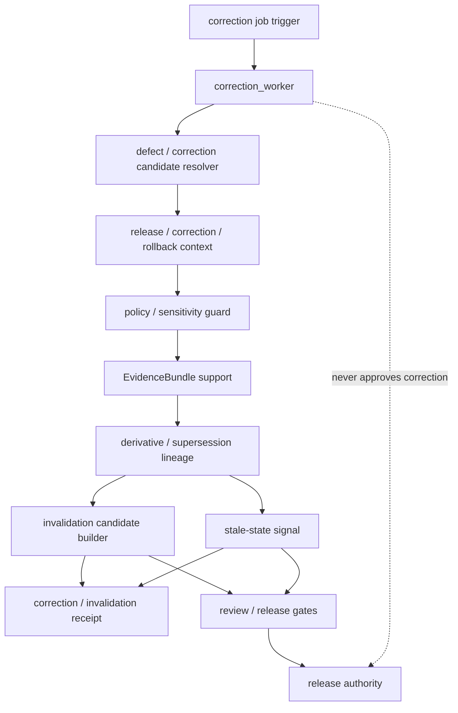

<!-- [KFM_META_BLOCK_V2]
doc_id: kfm://app/workers/src/correction-worker/readme
title: Correction Worker README
type: app-readme
version: v0.1
status: draft
owners: OWNER_TBD — Worker steward · Correction steward · Release steward · Evidence steward · Policy steward · Audit steward · Docs steward
created: 2026-06-16
updated: 2026-06-16
policy_label: public
related:
  - ../README.md
  - ../../README.md
  - ../../../governed-api/README.md
  - ../../../review-console/README.md
  - ../../../../docs/dashboards/governance/RELEASE_CORRECTION_ROLLBACK.md
  - ../../../../pipelines/README.md
  - ../../../../pipeline_specs/README.md
  - ../../../../packages/README.md
  - ../../../../policy/README.md
  - ../../../../schemas/contracts/v1/
  - ../../../../contracts/
  - ../../../../data/README.md
  - ../../../../data/receipts/
  - ../../../../data/proofs/
  - ../../../../release/README.md
tags: [kfm, apps, workers, correction-worker, correctionnotice, derivative-invalidation, stale-state, receipts, evidencebundle, policydecision, lifecycle, watcher-non-publisher]
notes:
  - "Replaces the greenfield correction_worker stub with a bounded worker-source contract."
  - "This worker may support correction propagation candidates, derivative invalidation signals, stale-state updates, and receipt emission, but it must not approve corrections, mutate ReleaseManifest/CorrectionNotice records locally, rewrite published artifacts, or bypass release/correction governance."
  - "Worker source files, job definitions, queue contracts, schemas, fixtures, tests, correction outputs, receipt outputs, deployment state, logs, dashboards, and CI pass state remain NEEDS VERIFICATION."
[/KFM_META_BLOCK_V2] -->

<a id="top"></a>

<div align="center">

# Correction Worker

`apps/workers/src/correction_worker/`

**App-local worker-source boundary for correction support jobs: defect/correction candidate intake, CorrectionNotice context lookup, derivative invalidation candidates, stale-state signaling, supersession propagation hints, receipt capture, evidence/policy checks, and non-publishing worker enforcement.**


[Purpose](#1-purpose) · [Repo fit](#2-repo-fit) · [Boundary](#3-authority-boundary) · [Inputs](#5-inputs) · [Exclusions](#6-exclusions) · [Worker map](#7-correction-worker-map) · [Definition of done](#14-definition-of-done)

</div>

---

> [!IMPORTANT]
> **Status:** draft / `NEEDS VERIFICATION`  
> **Owners:** `OWNER_TBD` — Worker steward · Correction steward · Release steward · Evidence steward · Policy steward · Audit steward · Docs steward  
> **Path:** `apps/workers/src/correction_worker/README.md`  
> **Responsibility root:** `apps/` — deployable application surfaces  
> **Truth posture:** CONFIRMED README path / CONFIRMED Workers source boundary / CONFIRMED release-correction-rollback dashboard indicators / PROPOSED correction-worker contract / UNKNOWN source files, queue contracts, schemas, tests, fixtures, runtime behavior, deployment state, and CI pass state

> [!CAUTION]
> The Correction Worker is not correction approval or release authority. It may emit correction candidates, derivative-invalidation candidates, stale-state signals, and receipts, but it must not rewrite published artifacts, mutate release records locally, create final CorrectionNotice records, or treat dashboard indicators as release/correction decisions.

---

## 1. Purpose

`apps/workers/src/correction_worker/` is the proposed app-local worker-source home for correction-support jobs.

It may eventually contain modules for:

- correction job intake from approved schedules, queues, or operator-triggered dry runs;
- idempotency and retry handling for correction jobs;
- defect/correction candidate reference validation;
- CorrectionNotice, ReleaseManifest, RollbackCard, and lineage context lookup;
- EvidenceRef/EvidenceBundle and PolicyDecision support checks;
- derivative invalidation candidate generation;
- supersession and forward-link gap signaling;
- stale-state and downstream impact signaling;
- correction/derivative/job receipt emission;
- safe failure states with no claim or protected detail leakage.

This README does not prove that any correction worker source file, queue contract, schema, fixture, test, receipt writer, derivative invalidation builder, stale-state signaler, deployment, log, dashboard, or CI pass state exists.

[Back to top](#top)

---

## 2. Repo fit

| Concern | Owning root | Expected relationship |
|---|---|---|
| Correction worker source | `apps/workers/src/correction_worker/` | App-local worker source, if implemented |
| Workers source | `apps/workers/src/` | Worker source boundary and non-publisher enforcement |
| Workers app | `apps/workers/` | Background deployable boundary |
| Governed API | `apps/governed-api/` | Trust membrane and governed public API path |
| Review Console | `apps/review-console/` | Human correction/release review and decision surface |
| Release/correction dashboard | `docs/dashboards/governance/RELEASE_CORRECTION_ROLLBACK.md` | Governance indicators and dashboard posture, not enforcement |
| Pipelines | `pipelines/`, `pipeline_specs/` | Pipeline logic and declarative pipeline definitions |
| Shared packages | `packages/` | Reusable implementation libraries after extraction/review |
| Policy | `policy/` | Admissibility, sensitivity, rights, review, and release policy |
| Receipts and proofs | `data/receipts/`, `data/proofs/` | Receipt/proof support for material outputs |
| Lifecycle artifacts | `data/` | Lifecycle states, registry, catalog, triplets, published outputs |
| Release authority | `release/` | ReleaseManifest, CorrectionNotice, RollbackCard, supersession, correction, rollback authority |
| Schemas/contracts | `schemas/contracts/v1/`, `contracts/` | Machine shape and object meaning |

## 3. Authority boundary

This worker may support correction propagation and derivative-invalidation candidate generation. It does not own CorrectionNotice approval, ReleaseManifest mutation, RollbackCard mutation, release decisions, publication, rollback approval, correction approval, published artifact edits, EvidenceBundle truth, policy decisions, schemas, contracts, lifecycle storage, review decisions, source ingestion, pipeline authority, public API behavior, public UI behavior, canonical store mutation outside approved flows, or runtime/model authority.

```text
apps/workers/src/correction_worker/ = app-local correction worker source
apps/workers/src/                   = worker source boundary
apps/workers/                       = background worker deployable
apps/review-console/                = human review and decision surface
docs/dashboards/governance/         = correction/rollback dashboard specs
pipelines/                          = executable pipeline logic
pipeline_specs/                     = declarative pipeline definitions
packages/                           = reusable libraries
policy/                             = admissibility and decision policy
data/receipts/                      = material run/correction/invalidation receipts
data/proofs/                        = EvidenceBundle and proof support
data/                               = lifecycle artifacts and derived outputs
release/                            = release, correction, rollback authority
apps/governed-api/                  = governed public trust membrane
```

## 4. Default posture

The Correction Worker should fail closed. A job should not emit correction candidates, derivative invalidation candidates, stale-state signals, receipts, routing signals, or downstream impact outputs when any of these are unresolved:

- job trigger authenticity, queue ownership, idempotency key, and worker identity;
- defect/correction candidate schema and eligibility;
- affected release, published artifact, catalog/triplet, or derivative refs;
- CorrectionNotice, ReleaseManifest, RollbackCard, supersession, and prior-release context where material;
- source identity, source role, provenance, rights, cadence, and integrity hash;
- PolicyDecision, sensitivity, redaction/generalization, rights, and release-state posture;
- EvidenceRef and EvidenceBundle support for the defect or correction claim;
- derivative lineage graph and invalidation scope;
- deterministic identity, stable key, version, and supersession strategy;
- output lifecycle home, receipt home, and owning steward;
- review state, release state, correction state, rollback state, and stale-state impacts;
- retry, resume, safe-disable, and rollback behavior;
- safe error behavior and no raw/internal detail leakage.

## 5. Inputs

| Input family | Examples | Required posture |
|---|---|---|
| Job trigger | schedule, queue message, operator dry run, defect signal | Audited and idempotent |
| Job context | job id, run id, idempotency key, retry count, worker identity | Durable and traceable |
| Correction candidate | defect ref, affected artifact ref, proposed correction ref, severity | Governed projection only |
| Release context | ReleaseManifest ref, CorrectionNotice ref, RollbackCard ref, supersession refs | Required when material |
| Lineage context | derivative refs, downstream outputs, invalidation list, stale-state refs | Bounded and release-aware |
| Source context | SourceDescriptor, source role, rights, provenance, integrity hash | Preserved and validated |
| Policy context | PolicyDecision, sensitivity label, rights posture, release constraints | Policy-runtime derived |
| Evidence context | EvidenceRef, EvidenceBundle refs, proof context, limitations | Resolver-backed where material |
| Output refs | invalidation candidate, stale-state signal, receipt ref, review queue signal | Correct lifecycle/root target required |

## 6. Exclusions

| Does not belong here | Correct home |
|---|---|
| CorrectionNotice approval or final mutation | `release/` and governed release/correction authority |
| ReleaseManifest or RollbackCard mutation | `release/` |
| Published artifact edits | Release/correction workflows, not worker-local edits |
| Source-specific connector implementation | `connectors/` |
| Reusable correction/pipeline logic | `pipelines/` or `packages/` |
| Declarative pipeline definitions | `pipeline_specs/` |
| Schemas and contracts | `schemas/contracts/v1/`, `contracts/` |
| Policy rules and release decisions | `policy/`, `release/` |
| Lifecycle data and canonical stores | `data/` |
| Receipts and proofs | `data/receipts/`, `data/proofs/` |
| Public or semi-public API surface | `apps/governed-api/` |
| Public UI or map rendering | `apps/explorer-web/` |
| Review decisions and manual adjudication | `apps/review-console/` |
| Direct model/runtime public access | `runtime/` behind governed API only |
| Deployment-only values | Deployment environment/config channels |

## 7. Correction worker map

Exact implementation files remain `NEEDS VERIFICATION`.

| Candidate module | Purpose | Required safeguard | Status |
|---|---|---|---|
| `job_contract` | Queue message and job envelope handling | Closed schema and idempotency | PROPOSED |
| `candidate_resolver` | Resolve defect/correction candidate refs | No raw-store shortcut | PROPOSED |
| `release_context` | ReleaseManifest/CorrectionNotice/RollbackCard lookup support | Read-only governed refs | PROPOSED |
| `lineage_resolver` | Derivative and supersession lineage support | No unsupported impact claim | PROPOSED |
| `policy_guard` | Policy/sensitivity/release precheck | Fail closed on unresolved state | PROPOSED |
| `evidence_guard` | EvidenceBundle support check | No unsupported correction claim | PROPOSED |
| `invalidation_builder` | Derivative invalidation candidate assembly | Candidate only, no final mutation | PROPOSED |
| `stale_signal` | Stale-state and downstream impact signal emission | Receipt-backed and bounded | PROPOSED |
| `receipt_writer` | Correction/invalidation/job receipt emission | Durable data-root output | PROPOSED |
| `safe_errors` | Failure, retry, and safe log shaping | No internal detail leakage | PROPOSED |

> [!WARNING]
> Candidate module names are not implementation proof. Do not claim a correction worker module is live until files, queues, schemas, fixtures, tests, policy gates, evidence checks, release/correction refs, lineage outputs, receipts, and deployment evidence confirm it.

## 8. Diagram



## 9. Worker obligations

| Obligation | Example effect |
|---|---|
| `watcher_non_publisher` | Worker emits candidates and receipts, not final correction decisions |
| `candidate_only` | Invalidation/stale outputs remain candidates until governed review/release |
| `no_local_release_writes` | CorrectionNotice/ReleaseManifest/RollbackCard writes happen outside this worker |
| `source_role_preserved` | Source role is carried forward and not upcast by worker convenience |
| `policy_required` | Policy and sensitivity gates run before material output |
| `evidence_required` | Correction claims carry EvidenceRef/EvidenceBundle support |
| `lineage_required` | Derivative invalidation claims require lineage support |
| `receipt_required` | Material correction/invalidation outputs emit durable receipts |
| `idempotent_jobs` | Re-running a job should not duplicate authoritative outputs |
| `safe_error_only` | Failures reveal no protected data, raw payloads, internal paths, or validator internals |

## 10. Job contract

Each durable correction worker module or child README should state:

- job purpose and owner;
- authorized producer and trigger type;
- queue message shape and idempotency key;
- accepted correction/defect refs and denied inputs;
- schema, contract, release, and receipt dependencies;
- policy and sensitivity dependencies;
- EvidenceBundle dependency where material;
- lineage and derivative invalidation dependency;
- output refs and receipt types emitted;
- deterministic identity and supersession posture;
- safe-disable, retry, and rollback path;
- tests and fixtures required;
- open verification items.

## 11. Inspection path

Correction worker source files, queue contracts, schemas, tests, fixtures, policy integration, evidence resolver integration, release/correction/rollback lookup, lineage/invalidation generation, receipt outputs, deployment state, logs, dashboards, and emitted artifacts remain `NEEDS VERIFICATION`.

```bash
find apps/workers/src/correction_worker -maxdepth 7 -type f | sort
find apps/workers pipelines pipeline_specs packages policy schemas contracts data release docs/dashboards/governance tests fixtures -maxdepth 7 -type f 2>/dev/null | grep -Ei 'correction|CorrectionNotice|ReleaseManifest|RollbackCard|derivative|invalidation|supersession|stale|PolicyDecision|EvidenceRef|EvidenceBundle|receipt|candidate|identity|worker|job|queue|test|fixture' | sort
```

## 12. Validation expectations

Useful validation for this worker should cover:

- unauthorized producers cannot enqueue correction jobs;
- malformed job/input envelopes fail closed;
- missing release refs, CorrectionNotice context, lineage, source role, policy, evidence, or output target blocks material output;
- derivative invalidation and stale-state outputs are candidates until governed review/release;
- worker does not write final CorrectionNotice, ReleaseManifest, RollbackCard, or published artifacts locally;
- worker does not rewrite canonical/source records or upcast weak source roles;
- material outputs emit receipts with job id, input refs, output refs, hashes, lineage refs, and limitations;
- retry/idempotency prevents duplicate authoritative outputs;
- stale-state, supersession, correction, and rollback context are preserved where material;
- safe errors reveal no raw payloads, protected detail, internal paths, or deployment-only values.

## 13. Safe change pattern

For Correction Worker changes:

1. Add or update correction worker inventory and job contract.
2. Link job, input, correction candidate, invalidation candidate, stale-state, receipt, and policy DTOs to schemas/contracts before changing shapes.
3. Add fixtures for valid correction candidate, missing release ref, missing CorrectionNotice context, missing lineage, missing evidence, missing policy, weak source role, sensitivity hold, stale source, duplicate idempotency key, retry, and safe error cases.
4. Add no-final-correction-write, no-publish, no-canonical-rewrite, source-role-preservation, candidate-only, evidence-support, policy-support, lineage-support, receipt-required, idempotency, and safe-error tests before enabling jobs.
5. Preserve EvidenceRef/EvidenceBundle refs, PolicyDecision refs, source role, lifecycle state, release/correction/rollback refs, lineage refs, receipt refs, job ids, reason codes, timestamps, hashes, and limitations through every material output.
6. Update this README, parent Workers README, Workers source README, release/correction docs, pipeline docs, governed API/review-console docs, policy docs, schemas/contracts, and tests when behavior materially changes.

## 14. Definition of done

- [ ] Owners are confirmed and `OWNER_TBD` is replaced.
- [ ] Correction worker module inventory and ownership are documented.
- [ ] Job/input/output/receipt DTOs and schemas are verified.
- [ ] Authorized producer, queue, idempotency key, retry, and safe-disable behavior are documented and tested.
- [ ] Release/correction/rollback refs, source-role preservation, policy runtime, evidence resolver, lineage checks, and receipt writer are documented and tested.
- [ ] Worker cannot approve corrections, publish, mutate release records, rewrite canonical records, or upcast source authority.
- [ ] Derivative invalidation/stale-state outputs are candidate-only until governed release/correction review.
- [ ] Sensitive-domain, weak-source, missing-evidence, missing-lineage, and rights-denial tests are present and passing.
- [ ] Deployment, logs, dashboards, and runbooks are documented with current evidence.

## 15. Open verification items

| Item | Why it matters |
|---|---|
| Confirm source files beyond README | Prevents overclaiming implementation maturity |
| Confirm correction job/queue contract | Required before worker behavior claims |
| Confirm correction/invalidation schemas and contracts | Required before shape claims |
| Confirm policy and evidence integration | Required before governed-output claims |
| Confirm release/correction/rollback reference handling | Required before correction-context claims |
| Confirm lineage and derivative invalidation support | Required before downstream impact claims |
| Confirm receipt outputs and target paths | Required before auditability claims |
| Confirm no-final-correction-write and no-publish behavior | Required before trust claims |
| Confirm tests, fixtures, deployment, logs, and dashboards | Required before operational maturity claims |
| Confirm review/release handoff | Required before candidate-to-release claims |

<details>
<summary>Appendix A — no-loss preservation note</summary>

The previous README was a greenfield stub. This replacement adds a bounded Correction Worker contract without claiming source files, queues, schemas, tests, fixtures, policy enforcement, EvidenceBundle checks, correction/invalidation generation, release/correction integration, receipt emission, deployment, logs, dashboards, or CI pass state are implemented.

</details>

## Status summary

`apps/workers/src/correction_worker/` should contain correction-support worker source only after job inventory, queue contract, schema validation, source-role preservation, policy runtime integration, evidence resolver integration, release/correction/rollback reference handling, lineage support, receipt emission, tests, and operational evidence are verified.

It must preserve the correction boundary: this worker may emit correction candidates, derivative invalidation candidates, stale-state signals, and receipts, but it must not approve corrections, create final CorrectionNotice records, mutate release records, publish artifacts, rewrite canonical records, bypass review/release gates, or treat dashboard indicators as authority.

<p align="right"><a href="#top">Back to top</a></p>
