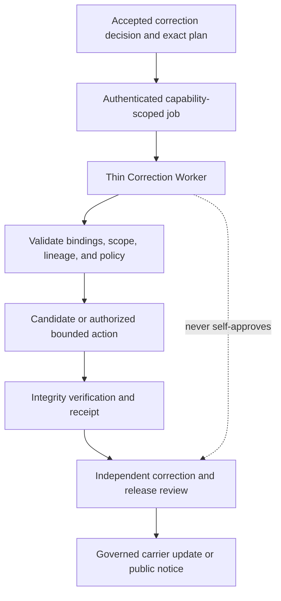

<!-- [KFM_META_BLOCK_V2]
doc_id: kfm://app/workers/src/correction-worker/readme
title: Correction Worker README
type: app-readme
subtype: worker-lane-readme
version: v0.2
prior_version: v0.1
status: draft; repository-grounded; placeholder-only
owner: "NEEDS VERIFICATION — CODEOWNERS routes default repository review to @bartytime4life; no accepted Correction Worker steward, independent correction reviewer, runtime operator, or release authority was verified"
created: 2026-06-16
updated: 2026-08-12
policy_label: public
current_path: apps/workers/src/correction_worker/README.md
scope_id: apps/workers/src/correction_worker/
owning_root: apps/
inherited_parent: apps/workers/src/README.md
responsibility: orient contributors to the inert Correction Worker lane, its correction and release boundaries, implementation admission requirements, validation, maintenance, and rollback
truth_posture: cite-or-abstain
truth_labels: [CONFIRMED, PROPOSED, UNKNOWN, NEEDS VERIFICATION, CONFLICTED]
authority_class: inherited app-local worker lane
authority_rank: implementation orientation subordinate to adopted doctrine, accepted ADRs, semantic contracts, schemas, policy, evidence, review, release decisions, correction lineage, receipts, and operational authorization
canonical_relationship: same-path update; no new authority, generated projection, compatibility path, correction object, or runtime capability created
evidence_repository: bartytime4life/Kansas-Frontier-Matrix
evidence_base_ref: main
evidence_base_commit: d00422105d38fbd3babafb940f78bcfe4dc1d114
evidence_repository_tree: eb5212dcd9029beb641c84d72b886e20e8fc6391
evidence_lane_tree: 0f748d8c71590912ab8f95c929e0d68e43127c23
evidence_target_prior_blob: 331bc76b14a0a5c61b0fd93211f9624bae3860a1
evidence_entrypoint_blob: 229bf39b7adc0b6be18e24273c84057b1c601b29
evidence_parent_source_blob: 08ad9f8116f64817ffa4f8b2058613749360c102
evidence_workers_readme_blob: 5b5c1e6b067e652a380bf445488a6227028dfc0e
evidence_directory_rules_blob: fd49a0b83e55cef52c1124281f093e263526898d
evidence_directory_rules_adoption: ADR-0029; accepted
evidence_codeowners_blob: dd2a84aa514d8ecd9208bc347f90f9a2ed37dd61
evidence_correction_doctrine_blob: f396cd18bc55dd7a6e9699e4216159b30c8c351c
evidence_release_root_blob: 60b6a656f8f2b765616bba7223f51c25863c7172
evidence_direct_files: 2
evidence_executable_python_lines: 0
evidence_repository_runtime_bindings: 0
related:
  - ../README.md
  - ../../README.md
  - ../../../governed-api/README.md
  - ../../../review-console/README.md
  - ../../../../docs/doctrine/directory-rules.md
  - ../../../../docs/adr/ADR-0029-adopt-directory-governance-standard-v2.md
  - ../../../../docs/doctrine/corrections-first-class.md
  - ../../../../docs/architecture/publication/CORRECTION.md
  - ../../../../docs/atlases/stale-state-reference.md
  - ../../../../docs/dashboards/governance/RELEASE_CORRECTION_ROLLBACK.md
  - ../../../../contracts/correction/README.md
  - ../../../../contracts/correction/correction_impact_assessment.md
  - ../../../../contracts/correction/correction_propagation_plan.md
  - ../../../../contracts/common/stale_state_supersession_assessment.md
  - ../../../../schemas/contracts/v1/correction/
  - ../../../../fixtures/contracts/v1/correction/
  - ../../../../tools/validators/correction/
  - ../../../../release/README.md
  - ../../../../release/correction_notices/README.md
  - ../../../../release/withdrawal_notices/README.md
  - ../../../../release/rollback_cards/README.md
tags: [kfm, apps, workers, correction-worker, placeholder, corrections-first-class, append-only, supersession, withdrawal, rollback, stale-state, derivative-invalidation, non-publisher]
notes:
  - "v0.2 replaces generalized source uncertainty with exact repository evidence: this lane contains one README and one 58-byte, comment-only Python placeholder with zero executable lines."
  - "Correction doctrine, release-decision lanes, semantic contracts, schemas, fixture-only assessment and propagation validators, fixtures, and tests exist elsewhere; no import, trigger, queue, schedule, package, policy binding, write capability, deployment, or runtime edge connects them to this lane."
  - "CorrectionNotice and SupersessionNotice shapes remain permissive stubs, correction object families occur across several schema and release paths, and the accepted worker job/envelope, receipt, and execution profiles remain unresolved."
  - "This documentation-only update does not detect, approve, apply, propagate, publish, withdraw, supersede, invalidate, roll back, or otherwise execute a correction."
[/KFM_META_BLOCK_V2] -->

<a id="top"></a>

<div align="center">

# Correction Worker

`apps/workers/src/correction_worker/`

**Repository-grounded boundary for a possible correction-execution wrapper. The current lane is inert: its only Python file is a one-line greenfield-placeholder comment, and no repository binding makes it a job, queue consumer, correction processor, receipt writer, cache invalidator, or deployable process.**

[](#2-repo-fit)
[](#3-authority-boundary)
[](#9-worker-obligations)
[](#6-exclusions)
[](../../../../docs/adr/ADR-0029-adopt-directory-governance-standard-v2.md)
[](#11-inspection-path)

**Quick navigation:** [Purpose](#1-purpose) · [Repo fit](#2-repo-fit) · [Authority](#3-authority-boundary) · [Posture](#4-default-posture) · [Inputs and outputs](#5-inputs-and-outputs) · [Exclusions](#6-exclusions) · [Lane map](#7-current-lane-map) · [Required flow](#8-required-correction-flow) · [Obligations](#9-worker-obligations) · [Admission contract](#10-job-admission-contract) · [Evidence](#11-inspection-path) · [Validation](#12-validation-expectations) · [Change pattern](#13-safe-change-pattern) · [Done](#14-definition-of-done) · [Gaps](#15-open-verification-items) · [Rollback](#17-correction-and-rollback)

</div>

> [!IMPORTANT]
> **Current state:** `CONFIRMED / PLACEHOLDER-ONLY`. At `main@d00422105d38fbd3babafb940f78bcfe4dc1d114`, this lane contains exactly two tracked files: this README and a 58-byte [`main.py`](./main.py). The Python file contains only `# correction_worker entrypoint — greenfield placeholder`, for zero imports, definitions, executable statements, or side effects.

Repository-wide name and path inspection found no import, trigger, queue, schedule, package, configuration, test, deployment, or output binding for `correction_worker`. This is bounded repository evidence, not proof about untracked experiments or external systems.

> [!CAUTION]
> A Correction Worker must never become correction, withdrawal, rollback, review, policy, evidence, or release authority. It must not silently rewrite prior artifacts, erase history, broaden an accepted plan, approve its own output, infer authority from a notice, mutate a public alias without an accepted operator contract, or treat a successful job or receipt as publication.

---

## 1. Purpose

`apps/workers/src/correction_worker/` inherits the app-local source boundary from [`apps/workers/src/`](../README.md) and the background deployable boundary from [`apps/workers/`](../../README.md).

If a correction execution model is later accepted, this directory may own only a thin worker wrapper: authenticated job intake, app-local dependency composition, process lifecycle, bounded error translation, capability-scoped dispatch, and delegation to correction, lineage, policy, evidence, release, receipt, cache, and carrier interfaces owned elsewhere.

The current lane implements none of those responsibilities. It has no package manifest, import graph, queue consumer, schedule, command-line entry point, message parser, policy client, evidence client, release client, impact assessor, propagation executor, receipt writer, configuration reader, network access, deployment binding, health check, or emitted artifact.

This README therefore exists to:

1. record the exact placeholder state without upgrading intent into implementation;
2. preserve first-class correction, append-only history, supersession, withdrawal, rollback, stale-state, and non-publisher boundaries for future work;
3. distinguish surrounding repository capability from actual worker composition;
4. prevent fixture-only correction objects from being mistaken for executable authority; and
5. define the evidence, decisions, validation, separation of duties, and rollback needed before this lane can claim executable maturity.

### Audience

This document is for worker implementers, correction and release stewards, contract and schema maintainers, policy and evidence reviewers, security reviewers, operators, and pull-request reviewers deciding whether a proposed change belongs in this lane and whether it remains a scaffold.

### Non-goals

This document does not:

- define or select a canonical correction job envelope;
- activate a queue, schedule, event, worker, source, policy bundle, cache operator, or public route;
- decide whether a correction, supersession, withdrawal, invalidation, or rollback is warranted;
- create a `CorrectionNotice`, `CorrectionImpactAssessment`, `CorrectionPropagationPlan`, `WithdrawalNotice`, `RollbackCard`, release decision, receipt, or public carrier;
- resolve existing singular/plural correction-path and schema-family drift;
- grant read or write access to any repository or runtime resource;
- claim that fixture validation proves operational correction; or
- release, deploy, promote, publish, or change repository settings.

[Back to top](#top)

---

## 2. Repo fit

### Current evidence

| Claim | Truth | Repository evidence | Limit |
|---|---|---|---|
| The lane exists under the deployable `apps/` responsibility root. | CONFIRMED | Accepted Directory Rules, root registry projection, parent Workers READMEs, and current tree | Placement does not grant runtime capability. |
| The lane contains exactly a README and `main.py`. | CONFIRMED at pinned base | Lane tree `0f748d8c71590912ab8f95c929e0d68e43127c23` | Does not describe untracked or external files. |
| `main.py` is one 58-byte comment and has zero executable Python lines. | CONFIRMED | Blob `229bf39b7adc0b6be18e24273c84057b1c601b29` | A filename and comment do not form an entry point. |
| A correction worker is importable, registered, queued, scheduled, configured, tested, packaged, deployed, or active. | CONFIRMED absent from bounded repository inspection | Complete lane inventory plus repository name/path search | External deployment state remains UNKNOWN. |
| First-class correction doctrine and an append-only release decision plane exist as documentation and governance surfaces. | CONFIRMED | Correction doctrine and `release/` root README | Documentation does not prove an authenticated operational authority. |
| Closed fixture-only impact-assessment and propagation-plan validation slices exist elsewhere. | CONFIRMED | Contracts, schemas, validators, fixtures, and tests under their owning roots | They are explicitly non-authoritative and unwired here. |
| `CorrectionNotice` and `SupersessionNotice` are worker-ready payloads. | NOT ESTABLISHED | Their singular-family schemas are permissive greenfield stubs; declared validator paths are absent or placeholder-only | Exact binding, compatibility, policy, review, and execution remain unresolved. |
| This README implements correction behavior. | CONFIRMED false | Markdown-only same-path update | No runtime behavior changes. |

### Responsibility split

| Concern | Canonical owner | This lane's allowed relationship |
|---|---|---|
| Deployable process composition | `apps/workers/` | Thin wrapper only after admission |
| Reusable correction or lineage behavior | `packages/` or `pipelines/` | Call reviewed public interfaces; do not duplicate logic |
| Declarative run graph, schedule, and resources | `pipeline_specs/` | Consume an accepted specification; do not define authority locally |
| Semantic meaning | `contracts/` | Bind exact accepted contract IDs and versions |
| Machine shape | `schemas/` | Validate exact schema IDs and versions before work |
| Policy decisions and obligations | `policy/` | Apply returned decisions; never author or silently weaken policy |
| Evidence and proof support | Governed evidence/proof lanes | Resolve references through owned interfaces; never upcast unsupported claims |
| Human adjudication | `apps/review-console/` and accepted review records | Route or display candidates; never decide review locally |
| Release, correction, withdrawal, and rollback decisions | `release/` | Consume accepted decisions and emit bounded execution evidence; never self-authorize |
| Lifecycle and accountability instances | `data/` | Use capability-scoped interfaces; never infer access from paths |
| Public trust membrane | `apps/governed-api/` | No direct public route from this worker |
| Public rendering and notices | Governed API/UI and released carriers | No worker-local publication |
| Deployment, network, identity, and secrets | `infra/` plus external secret stores | Receive least privilege only after separate operational authorization |
| Repository-wide validators and operators | `tools/` | Reuse as tooling where appropriate; do not embed a second authority |
| Synthetic conformance evidence | `fixtures/`, `tests/` | Prove bounded behavior; never use fixtures as live data |

### Directory Rules profile

This is a same-path `PLACE` modernization under the canonical `apps/` root. It does not create, move, rename, split, delete, generate, mirror, localize, or deprecate a path and does not change an authority, lifecycle, or public boundary.

The lane follows the Directory Rules **Boundary Compact** profile:

| Compact element | Where it is covered |
|---|---|
| Purpose and inherited parent | Sections 1–2 |
| Belongs and prohibited | Sections 3 and 6 |
| Inputs and outputs | Section 5 |
| Exposure, mutation, retention | Section 3 |
| Validation | Section 12 |
| Governing surfaces | Sections 2, 10, and 11 |
| Current status and direct-child map | Sections 2 and 7 |
| Open verification and review triggers | Sections 14–15 |

[Back to top](#top)

---

## 3. Authority boundary

### A future lane may own

- process startup, shutdown, graceful drain, health, and app-local dependency composition;
- authenticated and schema-closed job intake from an accepted producer;
- stable job, run, attempt, correlation, and idempotency identity plumbing;
- read-only resolution of accepted decision, evidence, policy, release, and lineage references through governed interfaces;
- dispatch of only the actions and resources enumerated by an accepted, immutable plan;
- bounded retry, cancellation, timeout, hold, dead-letter, and safe-disable behavior;
- safe logs and metrics for the worker process;
- candidate assessments, plan status, and execution receipts through declared writer interfaces; and
- denied-write and non-publisher tests for its own process boundary.

### This lane must not own

- defect truth, correction eligibility, severity, or public urgency decisions;
- `CorrectionNotice`, `SupersessionNotice`, `WithdrawalNotice`, `ReleaseManifest`, `RollbackCard`, review, policy, or release approval;
- correction contract meaning, schema shape, policy rules, evidence authority, or source authority;
- silent mutation, history deletion, canonical-record rewriting, or retroactive receipt editing;
- selection of a broader impact set than an accepted plan permits;
- alias movement, cache invalidation, withdrawal, rollback, or republishing without an explicit capability-scoped execution contract;
- public notice wording as sovereign truth or a direct public route;
- another application's internals, reusable correction logic, pipeline semantics, or infrastructure definitions; or
- release, deployment, promotion, publication, repository administration, or secret management.

### Exposure, mutation, and retention

| Dimension | Current state | Required future posture |
|---|---|---|
| Exposure | No executable or network surface | Internal-only worker ingress; no browser or ordinary public client path |
| Source mutation | README is versioned; placeholder source is unchanged | App source remains versioned through review |
| Runtime reads | None | Reference-based, least-privilege, authenticated, policy-checked interfaces only |
| Runtime writes | None | Capability-scoped candidate or execution interfaces; deny by default |
| Release mutation | None | Never local; accepted release/correction authority remains separate |
| Public-state mutation | None | Only a separately authorized operator may perform an accepted action; worker success is not publication |
| Retention | No worker data | Job metadata, receipts, logs, and outputs live in their owning lanes under declared retention; never accumulate trust objects in app source |
| Sensitive content | None | Logs and errors exclude raw payloads, secrets, private endpoints, harmful precision, restricted evidence, reviewer deliberation, and redacted content |

### Authority must not collapse

| Object or event | What it proves | What it never proves by itself |
|---|---|---|
| Correction report or defect signal | A concern was submitted | The concern is correct or approved |
| `CorrectionNotice` draft | A named correction is represented | Approval, execution, release, or publication |
| Impact assessment | Declared downstream scope passed its bounded checks | Every live carrier was discovered or changed |
| Propagation plan | A dependency/action inventory is coherent | Actions ran, caches were invalidated, or aliases moved |
| Worker receipt | A declared process attempt or action was recorded | Policy approval, review approval, release, or public correction completion |
| Green test or workflow | The tested profile passed | Production identity, current data, operational authority, or publication |
| Dashboard indicator | A status projection is visible | A correction or rollback decision |

[Back to top](#top)

---

## 4. Default posture

This lane is inactive and must fail closed. Until an execution profile, producer, transport, exact object bindings, reviewer separation, capabilities, receipts, and deactivation path are accepted, the only safe behavior is no execution and no side effect.

A future job must stop before material work when any applicable prerequisite is missing, stale, conflicted, unresolvable, unauthorized, or broader than the accepted scope:

- authenticated producer, worker identity, transport ownership, and activation state;
- exact job-envelope contract and schema version;
- stable job/run/attempt/correlation/idempotency identities;
- accepted correction, supersession, withdrawal, or rollback decision reference;
- affected object, prior release, replacement release, and immutable digest bindings;
- review state, separation of duties, and release-authority identity;
- evidence, source role, provenance, rights, sensitivity, and freshness posture;
- policy decision, obligations, generalization/redaction requirements, and reason codes;
- complete impact inventory and lineage closure for declared carriers;
- bounded action, target, deadline, retry budget, and capability grant;
- receipt family, writer, retention owner, integrity rule, and replay semantics;
- safe logs, metrics, operator escalation, cancellation, and disable behavior; or
- correction, forward-fix, and rollback consequences for partial execution.

Adjacent candidate profiles use different finite vocabularies:

| Profile | Current finite outcomes | Current authority |
|---|---|---|
| `CorrectionImpactAssessment` | `COMPLETE`, `HOLD`, with validator errors represented separately | Fixture-only; none |
| `CorrectionPropagationPlan` | `PASS`, `ABSTAIN`, `DENY`, `ERROR` | Fixture-only; none |
| `StaleStateSupersessionAssessmentCandidate` | `REVIEW_REQUIRED`, `ABSTAIN`, `DENY`, `ERROR` | Fixture-only; none |

A future job contract must select and document its own exact terminal vocabulary. It must not silently merge these enums, map `PASS` or `COMPLETE` to authorization, or turn an unresolved condition into success.

[Back to top](#top)

---

<a id="5-inputs"></a>

## 5. Inputs and outputs

### Current inputs and outputs

| Surface | Current state | Truth |
|---|---|---|
| CLI arguments | None implemented | CONFIRMED |
| Imported Python APIs | None implemented | CONFIRMED |
| Queue messages, schedules, events, or web requests | No consumer or binding | CONFIRMED |
| Environment variables or secret references | None read | CONFIRMED |
| Filesystem, database, object-store, cache, API, or model inputs | No code path present | CONFIRMED |
| Correction, impact, propagation, stale-state, invalidation, or review outputs | None emitted | CONFIRMED |
| Receipts, logs, metrics, release records, notices, or public carriers | None emitted by this lane | CONFIRMED |

### Required input declaration for a future worker

| Input family | Minimum declaration |
|---|---|
| Trigger | Authorized producer, transport, authentication, activation, delivery, ordering, replay, and dead-letter/hold posture |
| Job context | Stable job/run/attempt/correlation IDs, idempotency key, deadline, retry count, cancellation state |
| Governing decision | Exact accepted correction, withdrawal, supersession, rollback, or no-action reference and immutable digest |
| Subject and lineage | Affected object family, stable refs, old/new versions, prior and replacement release refs, lineage digest |
| Impact or plan | Exact profile, schema, declared surfaces, action scope, targets, review state, and integrity digest |
| Evidence and source | Evidence refs/bundles, source role, provenance, rights, sensitivity, freshness, limitations |
| Policy and review | Policy decision ref/version, obligations, reason codes, review records, separation-of-duties evidence |
| Capability | Allowed resource, operation, target, scope, expiry, identity, and denial behavior |
| Configuration | Non-secret profile and external secret references; no committed secret values |
| Output contract | Exact candidate/receipt family, writer interface, target, retention, integrity, replay, correction, and rollback behavior |

An implementation must consume accepted references or bounded payloads through declared interfaces. A repository path, filename, fixture, dashboard status, merge, test result, or request prose is not an authorization token.

### Permitted and prohibited output classes

| Output class | Posture | Boundary |
|---|---|---|
| Impact-assessment candidate | Possible after exact profile admission | Inventory only; no carrier mutation or authority |
| Propagation-plan candidate or status | Possible after exact profile admission | Plan/status only until independently approved and capability-bound |
| Stale-state or lineage review candidate | Possible after exact profile admission | Must distinguish stale from incorrect and preserve prior versions |
| Job, attempt, completion, or denied-action receipt | Required for material execution if a canonical family is accepted | Records bounded process evidence; never approval or release |
| Correction, supersession, or withdrawal notice draft | Route only if explicitly contracted | Must remain draft/review-bound; worker cannot approve or publish it |
| Final `CorrectionNotice`, `WithdrawalNotice`, `ReleaseManifest`, or `RollbackCard` | Prohibited | Release/correction authority only |
| Direct canonical or published-record rewrite | Prohibited | Silent mutation and history erasure are defects |
| Cache/alias/index/tile/search/graph/API/AI mutation | Prohibited by default | Requires an accepted action plan, exact capability, operator boundary, receipt, and independent release posture |
| Public notice or released carrier | Prohibited | Governed release and publication paths only |

[Back to top](#top)

---

## 6. Exclusions

| Does not belong here | Canonical home or owner | Reason |
|---|---|---|
| Correction, withdrawal, rollback, promotion, or release decisions | `release/` | Worker execution cannot self-authorize |
| Canonical correction notices, withdrawal notices, and rollback cards | `release/correction_notices/`, `release/withdrawal_notices/`, `release/rollback_cards/` | Append-only decision and notice families stay separate |
| Correction semantic contracts | `contracts/correction/` and accepted contract families | Meaning is not app-local |
| JSON Schemas and compatibility migrations | `schemas/`, `migrations/` | Machine shape and migration authority remain separate |
| Normative allow, deny, hold, restrict, or abstain rules | `policy/` | Worker applies decisions; it does not define them |
| Evidence bundles, source truth, proof closure, or review decisions | Their governed roots | The worker is not a truth or adjudication authority |
| Reusable lineage, impact, propagation, or invalidation logic | `packages/` or `pipelines/` | App wrapper must stay thin and independently testable |
| Declarative schedules and run graphs | `pipeline_specs/` | Specification remains distinct from execution |
| Raw, work, quarantine, processed, catalog, triplet, published, receipt, or proof instances | `data/` | App source is not a lifecycle or accountability store |
| Source-specific acquisition | `connectors/` | Correction execution does not absorb source authority |
| Public or semi-public API routes | `apps/governed-api/` | Governed API remains the normal trust membrane |
| Public UI, map rendering, or notice presentation | Governed UI/application surfaces | Renderer and prose are not authority |
| Manual adjudication | `apps/review-console/` plus accepted review records | Routing is not deciding |
| Cache/CDN/alias/network/deployment definitions and actual secrets | `infra/` and external secret stores | Operational capability requires separate least-privilege control |
| Repository-wide validators, generators, and release operators | `tools/` | Repository tooling is not a deployable worker |
| Synthetic fixtures | `fixtures/` | Fixtures are public-safe conformance inputs, never production data |

[Back to top](#top)

---

<a id="7-correction-worker-map"></a>

## 7. Current lane map

The direct-child tree is complete for the pinned lane and contains no proposed modules:

```text
apps/workers/src/correction_worker/
├── README.md    # this boundary document
└── main.py      # one 58-byte comment; no executable statement
```

| File | Blob | Current behavior |
|---|---|---|
| [`README.md`](./README.md) | Prior blob `331bc76b14a0a5c61b0fd93211f9624bae3860a1` | Documentation only |
| [`main.py`](./main.py) | `229bf39b7adc0b6be18e24273c84057b1c601b29` | Comment only; zero imports, definitions, statements, side effects, or output |

No `__init__.py`, package manifest, lock file, configuration, module family, queue adapter, schedule, test directory, fixture, Dockerfile, deployment manifest, receipt, or generated artifact exists beneath this lane at the pinned base.

The former v0.1 candidate-module table was intentionally removed. Names such as `candidate_resolver`, `lineage_resolver`, `policy_guard`, `invalidation_builder`, or `receipt_writer` described possibilities, not repository files. A future direct-child map must list only tracked current children and link every entry.

[Back to top](#top)

---

<a id="8-diagram"></a>

## 8. Required correction flow

The following is a **required future authority relationship**, not current execution evidence:


```mermaid
flowchart TD
    A["Accepted correction decision and exact plan"] --> B["Authenticated capability-scoped job"]
    B --> C["Thin Correction Worker"]
    C --> D["Validate bindings, scope, lineage, and policy"]
    D --> E["Candidate or authorized bounded action"]
    E --> F["Integrity verification and receipt"]
    F --> G["Independent correction and release review"]
    G --> H["Governed carrier update or public notice"]
    C -. "never self-approves" .-> G
```

### Phase contract

| Phase | Minimum behavior | Forbidden shortcut |
|---|---|---|
| Decision intake | Authenticate producer and bind an accepted decision, exact profile, immutable digest, and scope | Treating a report, fixture, notice draft, dashboard, or CI result as authority |
| Preflight | Close schema, identity, lineage, evidence, policy, review, capability, receipt, and rollback prerequisites | Guessing missing fields or widening scope |
| Assessment/planning | Produce or consume a deterministic candidate under a declared no-mutation profile | Mapping `COMPLETE` or `PASS` to release authorization |
| Execution | Perform only an explicitly authorized operation on enumerated targets | Silent writes, broad cache flushes, alias changes, public mutation, or history deletion |
| Verification | Re-read affected state, verify expected digests/outcomes, and emit a durable receipt | Calling queue acknowledgement completion evidence |
| Review/release | Route evidence to independent correction/release authority | Worker approving its own job or output |
| Public propagation | Governed operators and public surfaces expose approved state and notice | Worker publishing directly or suppressing prior history |

Until all execution-phase controls are accepted, this lane must remain non-executing. Fixture-only impact and propagation profiles may inform a future design, but they cannot be silently promoted into live mutation APIs.

[Back to top](#top)

---

## 9. Worker obligations

| Obligation | Required effect |
|---|---|
| `thin_wrapper` | Keep reusable correction, lineage, validation, and mutation behavior outside the app lane. |
| `authenticated_producer` | Reject untrusted or ambiguous job producers and embedded imperative content. |
| `exact_binding` | Pin contract, schema, policy, decision, and capability identities and versions; fail on drift. |
| `append_only_history` | Preserve prior releases, artifacts, notices, receipts, and lineage; never overwrite or delete history. |
| `decision_read_only` | Consume accepted correction/release decisions without editing or manufacturing them. |
| `scope_non_expansion` | Operate only on enumerated targets and actions; newly discovered impact returns to review. |
| `stale_is_not_incorrect` | Do not infer substantive error from age alone; preserve distinct stale, disputed, corrected, superseded, and withdrawn states. |
| `lineage_required` | Bind predecessor, successor, affected carrier, and release references before claiming propagation closure. |
| `evidence_and_policy_required` | Preserve evidence, source role, rights, sensitivity, freshness, policy obligations, reason codes, and limitations. |
| `idempotent_and_replay_safe` | Stable identities and expected-state checks prevent duplicate or contradictory authoritative effects. |
| `capability_scoped_mutation` | Deny all writes except accepted operations on exact resources with expiry and identity. |
| `candidate_before_execution` | Assessment and planning remain non-mutating until an independent authority accepts an execution profile. |
| `receipt_required` | Every material attempt records input refs/digests, actor/process identity, action, target, outcome, time, and integrity evidence in an accepted family. |
| `partial_failure_visible` | Stop safely, preserve completed-step evidence, hold unresolved targets, and never report aggregate success falsely. |
| `sensitive_fail_closed` | Do not log or expose secrets, raw/restricted evidence, harmful precision, redacted content, reviewer deliberation, or private endpoints. |
| `no_self_review_or_release` | Worker, AI, validator, receipt, and workflow outputs cannot approve correction, rollback, release, or publication. |
| `no_public_path` | Emit no ordinary browser/API response, public notice, released carrier, or direct model output. |

### Keep correction object families distinct

| Family | Meaning | Worker boundary |
|---|---|---|
| Correction | Named repair of a trust-significant defect with preserved history | May execute only an accepted bounded plan; never decides the correction |
| Supersession | Successor relationship with an inspectable predecessor and forward pointer | May propagate an accepted link; never silently rebind or delete the old object |
| Withdrawal | Governed removal or restriction of ordinary public availability | May execute an accepted operation; never authors the withdrawal decision |
| Rollback | Authorized restoration toward a prior accepted state with verification | May run an exact accepted step; never selects or approves the target |
| Stale state | Support/freshness condition that may require caveat, review, refresh, or abstention | May signal declared state; never equates age with incorrectness |
| Invalidation | Operational action against a derivative, cache, index, alias, or carrier | May execute only capability-scoped targets; invalidation is not a correction decision |
| Receipt | Process memory for an attempt or effect | Records evidence; never substitutes for proof, decision, notice, or release |

[Back to top](#top)

---

<a id="10-job-contract"></a>

## 10. Job admission contract

Replacing the placeholder requires a dependency-closed implementation slice. Before any executable statement is accepted, the change must record and test:

- worker purpose, owner, independent reviewer, operator, escalation path, and non-publisher scope;
- exact producer identity, transport, message contract, authentication, ordering, delivery, replay, and activation posture;
- stable job/run/attempt/correlation/idempotency identities and deterministic derivation rules;
- exact correction/release decision family, schema, version, digest, review state, and separation-of-duties evidence;
- accepted subject, lineage, impact, and propagation object bindings;
- source/evidence/policy inputs and their unresolved, stale, conflicted, revoked, and sensitive behavior;
- exact read resources and write capabilities, including target allowlists and expiry;
- finite terminal outcomes and stable reason codes;
- retry, timeout, cancellation, duplicate, partial-failure, dead-letter/hold, and safe-disable behavior;
- accepted output and receipt families, writers, integrity checks, retention, and replay behavior;
- operational logs, metrics, health, alerting, on-call, incident, deactivation, and recovery paths;
- correction and rollback of the worker's own partial effects; and
- deterministic no-network tests plus bounded integration and denied-write evidence.

### Surrounding object-family readiness

| Family | Repository support | Current status | Worker admission consequence |
|---|---|---|---|
| `CorrectionNotice` | Semantic contract plus singular correction schema | Contract is draft; schema is permissive greenfield stub; root validator is a `NotImplementedError` stub; declared nested validator path is absent | Not a worker-ready binding |
| `SupersessionNotice` | Semantic contract plus singular correction schema | Contract is draft; schema is permissive greenfield stub; declared validator is absent | Not a worker-ready binding |
| `CorrectionImpactAssessment` | Semantic contract, closed schema, validator, valid/invalid fixtures, and tests | `proposed-inactive`; fixture-only; no network; no authority or mutation | May be evaluated only as an explicitly adopted candidate profile; `COMPLETE` is not execution authority |
| `CorrectionPropagationPlan` | Semantic contract, closed schema, validator, case fixture, and tests | Proposed fixture-only, non-executing, and mutation flags fixed false | May inform planning only until a separate execution contract is accepted |
| `StaleStateSupersessionAssessmentCandidate` | Semantic contract, schema, fixture, validator, and tests | Proposed-inactive, fixture-only, review-required, non-authoritative | May surface review evidence; cannot mark or mutate live objects |
| `WithdrawalNotice` | Release-family semantic contract/schema and release notice lane | Release decision and operational writer binding unresolved here | Worker cannot infer withdrawal authority from notice presence |
| `RollbackCard` | Release contract/schema plus bounded validator/fixtures/tests | Candidate/readiness evidence exists; release root reports no operational rollback executor | Worker cannot select or execute a target without separate accepted authority |
| Runtime correction receipt | Generated authoring receipts and other receipt lanes exist | No canonical correction-worker job/execution receipt binding was verified | Must be decided before material execution |

### Binding conflicts that must be resolved, not guessed

1. Accepted Directory Rules name `release/correction_notices/` as the canonical public correction-object family, while `release/correction/` and `release/corrections/` remain classification or migration surfaces.
2. Correction-related schema shapes occur under singular `schemas/contracts/v1/correction/`, plural `schemas/contracts/v1/corrections/`, `schemas/contracts/v1/release/`, `schemas/contracts/v1/review/`, and domain-specific lanes.
3. The singular correction schema index calls the singular family canonical, but its `CorrectionNotice` and `SupersessionNotice` schemas remain permissive stubs.
4. `CorrectionImpactAssessment`, `CorrectionPropagationPlan`, and stale-state assessment are substantive but explicitly fixture-only and non-authoritative.
5. A substantive `policy/correction/` bundle was not found in the bounded inspection; `policy/rights/correction/` contains only a placeholder, while release and domain policy surfaces exist elsewhere.
6. A generated documentation receipt is not a runtime correction, invalidation, cache, alias, withdrawal, or rollback execution receipt.

An implementation PR must provide an accepted binding matrix or an applicable ADR/migration decision. It must not select a payload merely because its filename is closest to the worker name.

[Back to top](#top)

---

## 11. Inspection path

The repository state in this README can be reproduced without network access:

```bash
git rev-parse d00422105d38fbd3babafb940f78bcfe4dc1d114^{tree}
git rev-parse d00422105d38fbd3babafb940f78bcfe4dc1d114:apps/workers/src/correction_worker
git ls-tree -rl d00422105d38fbd3babafb940f78bcfe4dc1d114 \
  apps/workers/src/correction_worker
git show d00422105d38fbd3babafb940f78bcfe4dc1d114:apps/workers/src/correction_worker/main.py
git grep -n -i -E 'correction_worker|correction worker' \
  d00422105d38fbd3babafb940f78bcfe4dc1d114 -- \
  ':!apps/workers/src/correction_worker/README.md'
rg --files contracts schemas fixtures tests tools policy release data docs \
  | rg -i 'correction|supersession|withdrawal|rollback|stale|invalidation'
```

### Evidence ledger

| Evidence | Pinned object | Supports | Does not prove |
|---|---|---|---|
| Repository base | commit `d00422105d38fbd3babafb940f78bcfe4dc1d114`; tree `eb5212dcd9029beb641c84d72b886e20e8fc6391` | Exact review baseline | Runtime, security, release, or deployment state |
| Correction Worker lane | tree `0f748d8c71590912ab8f95c929e0d68e43127c23` | Complete two-file lane inventory | Off-repository state |
| Prior README | blob `331bc76b14a0a5c61b0fd93211f9624bae3860a1` | Same-path baseline and no-loss review | Worker behavior |
| Placeholder entrypoint | blob `229bf39b7adc0b6be18e24273c84057b1c601b29` | Exact comment-only source bytes | Importability or execution |
| Parent source README | blob `08ad9f8116f64817ffa4f8b2058613749360c102` | Inherited placeholder, thin-wrapper, and non-publisher contract | Child maturity |
| Parent Workers README | blob `5b5c1e6b067e652a380bf445488a6227028dfc0e` | Scaffold-only background app boundary | Active deployment |
| Accepted Directory Rules | blob `fd49a0b83e55cef52c1124281f093e263526898d`; accepted ADR-0029 | Placement, dependencies, Boundary Compact, release-family naming, and direct-child-map law | Runtime authorization |
| CODEOWNERS | blob `dd2a84aa514d8ecd9208bc347f90f9a2ed37dd61` | Default review route to `@bartytime4life` | Stewardship, authentication, separation of duties, or release approval |
| First-class correction doctrine | blob `f396cd18bc55dd7a6e9699e4216159b30c8c351c` | Named operations, append-only history, visible lineage, review, and rollback expectations | Current worker wiring or all proposed paths |
| Release root README | blob `60b6a656f8f2b765616bba7223f51c25863c7172` | Canonical append-only decision plane and current fixture-first operational limits | Authenticated production authority or live rollback |
| Impact-assessment contract/schema | blobs `c397c83f558299388f9d5ca0a9c58deffb3f8c86` / `f721aa7cd9c1b30cf63ab108f12c9b08927fd0bf` | Existing closed fixture-only assessment profile | Live carrier discovery or mutation |
| Propagation-plan contract/schema | blobs `b61e7fb0ecd0e68588a29642f3c47e0cb810eff9` / `3b178bd83c5753a90b30a1549ef5ed587986bd70` | Existing fixture-only dependency-plan profile | Cache invalidation, alias movement, release, or publication |
| CorrectionNotice contract/schema | blobs `4716f2bc6e714ad2ab873d95144417d7855f5beb` / `8f260eb5a5adba0b4966adfeffebfbcf6960277d` | Draft meaning plus proposed stub shape | Closed machine contract or executable correction |

Evidence pins make repository claims reviewable. They do not turn supporting documents, schemas, fixtures, validators, workflows, or receipts into implementation or authority.

[Back to top](#top)

---

## 12. Validation expectations

### Documentation-only changes

Run repository-owned, no-network checks against the changed file and exact feature head:

```bash
git diff --check
python tools/validators/docs/meta-block/check_meta_blocks.py \
  --repo-root . --profile present \
  --registry control_plane/document_registry.yaml \
  --format text apps/workers/src/correction_worker/README.md
python tools/validators/docs/link-check/check_links.py \
  --repo-root . --format text \
  apps/workers/src/correction_worker/README.md
python tools/validators/docs/document-graph/check_document_graph.py \
  --repo-root . \
  --entrypoint apps/workers/src/correction_worker/README.md \
  --registry control_plane/document_registry.yaml \
  --format text apps/workers/src/correction_worker/README.md
python tools/validators/docs/stale-scan/check_stale_docs.py \
  --repo-root . --as-of 2026-08-12 --profile advisory \
  --review-window-days 365 --placeholder-grace-days 90 \
  --format text apps/workers/src/correction_worker/README.md
python -m unittest discover \
  --start-directory tests/validators/docs/meta-block \
  --pattern 'test_*.py' --verbose
python -m unittest discover \
  --start-directory tests/validators/docs/link-check \
  --pattern 'test_*.py' --verbose
python -m unittest discover \
  --start-directory tests/validators/docs/document-graph \
  --pattern 'test_*.py' --verbose
python -m unittest discover \
  --start-directory tests/validators/docs/stale-scan \
  --pattern 'test_*.py' --verbose
```

A green documentation result proves only bounded metadata, link, graph, freshness, syntax, and diff hygiene. It does not prove a worker is implemented, safe, deployed, active, complete, policy-bound, evidence-bound, receipt-complete, release-approved, or public.

### First executable correction slice

A placeholder replacement requires, at minimum:

- deterministic, no-network unit tests with synthetic public-safe fixtures;
- exact job, decision, correction, lineage, impact, plan, policy, evidence, capability, and receipt contract/schema agreement;
- unauthorized producer, malformed input, unknown version, digest drift, mixed version, duplicate, replay, retry, timeout, cancellation, and dependency-unavailable cases;
- missing, stale, conflicted, revoked, weak-source, rights-denied, sensitivity-held, or unsupported evidence cases;
- unapproved decision, self-review, missing separation of duties, missing rollback target, and stale plan cases;
- incomplete carrier inventory, newly discovered carrier, cyclic lineage, missing successor, self-supersession, and silent-history-rewrite cases;
- scope-expansion, path traversal, broad wildcard, alias mismatch, cache-key mismatch, partial failure, and expected-state race cases;
- idempotent candidate/receipt writes and proof that retries cannot duplicate or contradict effects;
- static and runtime proof of no public route, no direct canonical-store access, no local release writes, no silent mutation, no history deletion, and no unreceipted side effect;
- bounded integration tests across public package, pipeline, policy, evidence, release, and operator interfaces without importing another app's internals; and
- workflow preflight proving the branch cannot deploy, activate, release, promote, publish, mutate settings, or expose secrets.

No worker-specific executable test target is currently bound to `apps/workers/src/correction_worker/`.

[Back to top](#top)

---

## 13. Safe change pattern

1. Pin current `main`, the lane tree, README and placeholder blobs, parent contracts, correction/release authorities, exact schemas, policy surfaces, fixtures, validators, tests, workflows, open PRs, and deployment evidence.
2. Decide and record whether correction execution belongs here, who owns orchestration, and which decisions remain outside the worker.
3. Resolve exact job, correction, supersession, withdrawal, rollback, impact, propagation, stale-state, capability, and receipt bindings before code consumes a payload.
4. Define producer, transport, identities, finite outcomes, permitted reads/writes, retry, partial-failure, retention, observability, disable, correction, and rollback behavior.
5. Keep the app wrapper thin; add reusable behavior to the correct package, pipeline, policy, evidence, release-operator, or tooling root with its own tests.
6. Add synthetic positive and negative fixtures before claiming executable maturity.
7. Prove no silent rewrite, history erasure, source-role upcast, policy bypass, self-review, self-release, broad invalidation, direct public path, or unreceipted side effect exists.
8. Reconcile this README, its parent source README, Workers app README, and directly affected contracts, schemas, policy, packages, pipelines, release lanes, fixtures, tests, runbooks, and operators in one dependency-closed slice.
9. Run changed-area and safety validation, inspect the complete diff, and deliver through a feature branch and draft pull request.
10. Keep deployment, activation, live capabilities, cache/alias mutation, correction execution, release, promotion, publication, and repository settings as separate authorized transitions.

[Back to top](#top)

---

## 14. Definition of done

This lane is not implementation-complete merely because its placeholder and surrounding correction capabilities are documented. Executable maturity requires evidence for every applicable item:

- [ ] accepted owner, independent correction/release reviewer, runtime operator, escalation path, and non-publisher scope;
- [ ] accepted orchestration owner and boundary between assessment, decision, execution, verification, and public propagation;
- [ ] executable entry point plus reproducible package, dependency, and build identity;
- [ ] authorized producer, inactive-by-default transport, authentication, delivery, replay, and deactivation behavior;
- [ ] reviewed job and object-family binding matrix with singular/plural and domain compatibility resolved;
- [ ] accepted capability model with exact resources, actions, scopes, expiry, identity, and denial behavior;
- [ ] evidence, source-role, rights, sensitivity, policy, review, release, and rollback prerequisites integrated through owned interfaces;
- [ ] stable job/run/attempt/correlation/idempotency identities and bounded retry/cancellation behavior;
- [ ] exact permitted reads/writes, least privilege, expected-state checks, retention, receipts, and partial-failure recovery;
- [ ] append-only history, supersession links, stale-state distinction, no silent rewrite, no history deletion, and no self-release enforced;
- [ ] positive, negative, mixed-version, replay, race, partial-failure, denied-write, no-public-route, correction, and rollback tests passing;
- [ ] safe logs, metrics, health, alerts, incident, disable, and recovery paths;
- [ ] deployment and activation evidence tied to an exact revision, if separately authorized;
- [ ] documentation reconciled with exact code, contracts, schemas, policy, tests, workflows, and operational evidence; and
- [ ] no release, promotion, publication, or settings authority inferred from code, CI, deployment, receipts, or merge.

[Back to top](#top)

---

## 15. Open verification items

| Item | Current truth | Required evidence or decision |
|---|---|---|
| Correction Worker stewardship and independent review | NEEDS VERIFICATION | Accepted responsibility assignment, authenticated reviewer roles, and escalation route |
| Worker implementation | CONFIRMED absent | Dependency-closed code, package identity, tests, and review evidence |
| Producer, transport, queue, event, or schedule | CONFIRMED absent in repository bindings | Accepted contract, producer identity, delivery/replay semantics, activation, and dead-letter/hold posture |
| Canonical correction/release child paths | CONFLICTED / migration-bound | Object-family classification and accepted migration/compatibility decision for singular/plural lanes |
| `CorrectionNotice` and `SupersessionNotice` schemas | CONFIRMED permissive stubs | Closed accepted schemas, validators, fixtures, tests, registry bindings, and migration posture |
| Correction-specific policy | NOT ESTABLISHED | Accepted bundle, policy decision contract, representative allow/hold/deny/abstain tests, and worker client binding |
| Impact and propagation profiles | CONFIRMED fixture-only and unwired | Explicit adoption decision or successor execution contracts; never infer live authority from fixture success |
| Stale-state and supersession handling | CONFIRMED candidate assessment exists; worker binding absent | Accepted cross-lane propagation policy, exact refs, and review/execution boundaries |
| Runtime write capabilities | CONFIRMED absent | Least-privilege operator APIs, target allowlists, expected-state checks, credentials, expiry, and denied-write tests |
| Correction-worker receipt family | NEEDS VERIFICATION | Exact semantic contract/schema, writer, target, integrity, retention, replay, and correction behavior |
| Release/correction/rollback handoff | NEEDS VERIFICATION | Authenticated decision intake, separation of duties, completion evidence, public propagation, and failure recovery |
| Deployment, activation, health, logs, metrics, and alerts | UNKNOWN | Exact deployed revision, public-safe observed telemetry, operator evidence, and separate activation authority |
| Public correction completion | NOT ESTABLISHED by this lane | Independent release decision plus carrier verification and governed notice/public-state evidence |

Re-review this README when the placeholder changes, a producer or transport is proposed, an object-family or schema-path decision is accepted, correction policy becomes substantive, a runtime operator/capability is introduced, a receipt family is selected, parent worker boundaries change, ADR-0029 is superseded, CODEOWNERS routing changes, or deployment/operational evidence becomes available.

[Back to top](#top)

---

## 16. Documentation change history

| Version | Date | Change | Runtime effect |
|---|---|---|---|
| `v0.1` | 2026-06-16 | Replaced a greenfield stub with a broad proposed correction-support worker contract. | None; documentation only. |
| `v0.2` | 2026-08-12 | Pinned current repository evidence; recorded the two-file comment-only lane; reconciled with the merged Workers parent boundaries, accepted Directory Rules, first-class correction doctrine, release-decision plane, and current fixture-only correction capabilities; replaced speculative modules with the verified direct-child tree; surfaced binding and authority conflicts; and strengthened admission, validation, maintenance, correction, and rollback. | None; documentation only. |

<details>
<summary>Appendix A — no-loss and correction note</summary>

The v0.1 edition correctly preserved core constraints: correction candidates are not decisions; prior records must not be silently rewritten; evidence, policy, lineage, receipts, review, release, and rollback remain distinct; and a worker must not publish.

This edition retains those constraints while correcting its evidence posture. Source-file presence is no longer unknown: `main.py` exists as a comment-only placeholder. Correction doctrine, release lanes, contracts, schemas, fixture-only assessment/propagation profiles, validators, fixtures, and tests also exist. None is wired to this lane, several payload families remain stubs or occur at multiple paths, and no accepted correction-worker job, policy, capability, receipt, deployment, or runtime binding was verified.

</details>

## 17. Correction and rollback

Before merge, abandon or close the feature branch and draft pull request. After an independently authorized merge, use a transparent revert or forward-fix pull request restoring prior blob `331bc76b14a0a5c61b0fd93211f9624bae3860a1`, then rerun the same documentation checks.

A README rollback changes no Python source, contract, schema, policy, package, pipeline, fixture, test, queue, schedule, configuration, capability, receipt, correction, release, cache, alias, data, deployment, activation, promotion, publication, or repository setting. If a later implementation affects those surfaces, its accepted execution record, partial-effect handling, correction lineage, carrier invalidation, deployment, and rollback obligations control; restoring prose alone is not an operational rollback.

---

## Status summary

`apps/workers/src/correction_worker/` is correctly located as an inherited app-local lane but is not an implemented or active worker. Its repository state is exactly one boundary README and one 58-byte comment-only placeholder, with zero executable lines and no import, trigger, queue, schedule, package, policy binding, test, configuration, write capability, deployment, or output binding.

Future work must first resolve orchestration ownership, exact object/schema/policy/receipt bindings, and capability-scoped execution. Any admitted implementation must remain thin, authenticated, append-only, evidence- and policy-bounded, lineage-preserving, idempotent, replay-safe, least-privileged, independently reviewed, receipt-complete, non-publishing, and subordinate to correction and release authority.

<p align="right"><a href="#top">Back to top</a></p>
