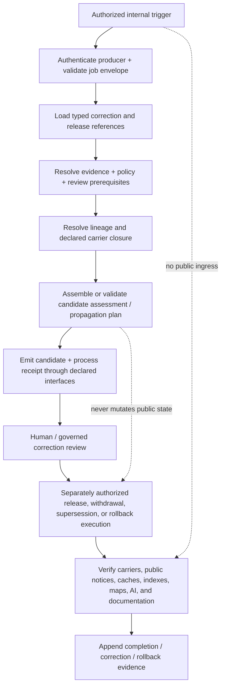

<!-- [KFM_META_BLOCK_V2]
doc_id: kfm://app/workers/src/correction-worker/readme
title: Correction Worker README
type: app-readme
subtype: worker-lane-readme
version: v0.2
prior_version: v0.1
status: draft; repository-grounded; placeholder-only
owner: "NEEDS VERIFICATION — CODEOWNERS routes default repository review to @bartytime4life; no accepted Correction worker steward, independent correction reviewer, runtime operator, or release authority was verified"
created: 2026-06-16
updated: 2026-08-12
policy_label: public
current_path: apps/workers/src/correction_worker/README.md
scope_id: apps/workers/src/correction_worker/
owning_root: apps/
inherited_parent: apps/workers/src/README.md
responsibility: orient contributors to the inert Correction worker lane, its candidate-only trust boundary, surrounding correction capabilities, implementation admission requirements, validation, correction, and rollback
truth_posture: cite-or-abstain
truth_labels: [CONFIRMED, PROPOSED, UNKNOWN, NEEDS VERIFICATION]
authority_class: inherited app-local worker lane
authority_rank: implementation orientation subordinate to adopted doctrine, accepted ADRs, contracts, schemas, policy, evidence, review records, lifecycle records, release records, correction records, and rollback authority
canonical_relationship: same-path update; no new authority, generated projection, compatibility path, queue, runtime binding, release decision, or publication capability created
evidence_repository: bartytime4life/Kansas-Frontier-Matrix
evidence_base_ref: main
evidence_base_commit: 605c5cd0450b0cf7ec9db3bceecff67c0d3655bb
evidence_repository_tree: 0154645b07c8bc4b1454aaef4e497c1d65940ab6
evidence_lane_tree: 0f748d8c71590912ab8f95c929e0d68e43127c23
evidence_target_prior_blob: 331bc76b14a0a5c61b0fd93211f9624bae3860a1
evidence_entrypoint_blob: 229bf39b7adc0b6be18e24273c84057b1c601b29
evidence_parent_source_blob: 08ad9f8116f64817ffa4f8b2058613749360c102
evidence_workers_readme_blob: 5b5c1e6b067e652a380bf445488a6227028dfc0e
evidence_directory_rules_blob: fd49a0b83e55cef52c1124281f093e263526898d
evidence_directory_rules_adoption: ADR-0029; accepted
evidence_codeowners_blob: dd2a84aa514d8ecd9208bc347f90f9a2ed37dd61
evidence_direct_files: 2
evidence_executable_python_lines: 0
evidence_repository_runtime_bindings: 0
related:
  - ../README.md
  - ../../README.md
  - ../../../governed-api/README.md
  - ../../../review-console/README.md
  - ../../../../docs/doctrine/directory-rules.md
  - ../../../../docs/adr/ADR-0029-adopt-directory-governance-standard-v2.md
  - ../../../../docs/doctrine/corrections-first-class.md
  - ../../../../docs/architecture/publication/CORRECTION.md
  - ../../../../docs/dashboards/governance/RELEASE_CORRECTION_ROLLBACK.md
  - ../../../../docs/runbooks/EVIDENCE_CORRECTION.md
  - ../../../../contracts/correction/README.md
  - ../../../../contracts/correction/correction_notice.md
  - ../../../../contracts/correction/correction_impact_assessment.md
  - ../../../../contracts/correction/correction_propagation_plan.md
  - ../../../../contracts/correction/supersession_notice.md
  - ../../../../schemas/contracts/v1/correction/README.md
  - ../../../../schemas/contracts/v1/correction/correction_notice.schema.json
  - ../../../../schemas/contracts/v1/correction/correction_impact_assessment.schema.json
  - ../../../../schemas/contracts/v1/correction/correction_propagation_plan.schema.json
  - ../../../../tools/validators/correction/validate_correction_impact_assessment.py
  - ../../../../tools/validators/correction/validate_correction_propagation_plan.py
  - ../../../../fixtures/contracts/v1/correction/correction_impact_assessment/
  - ../../../../fixtures/contracts/v1/correction/correction_propagation_plan/
  - ../../../../tests/validators/correction/test_correction_impact_assessment.py
  - ../../../../release/correction/README.md
  - ../../../../release/corrections/README.md
  - ../../../../release/correction_notices/README.md
tags: [kfm, apps, workers, correction-worker, placeholder, correction, supersession, propagation, derivative-invalidation, stale-state, candidate-only, non-publisher]
notes:
  - "v0.2 replaces generalized implementation uncertainty with exact repository evidence: this lane contains one README and one 58-byte, comment-only Python placeholder with zero executable lines."
  - "Correction semantic contracts, strict fixture-only impact and propagation schemas, validators, fixtures, release review lanes, and one dedicated impact-assessment test exist elsewhere in the repository; no import, trigger, queue, schedule, package, deployment, or runtime binding connects them to this lane."
  - "CorrectionNotice remains backed by an explicitly permissive greenfield-placeholder schema, and its schema-declared validator and policy/correction path are absent at the pinned base."
  - "This documentation-only update does not execute a correction, assess an actual release, invalidate a derivative, mark a carrier stale, mutate an alias, emit a receipt, approve review, authorize release, or publish anything."
[/KFM_META_BLOCK_V2] -->

<a id="top"></a>

<div align="center">

# Correction Worker

`apps/workers/src/correction_worker/`

**Repository-grounded boundary for a possible asynchronous correction-support wrapper. The current lane is inert: its only Python file is a one-line greenfield-placeholder comment, and no repository binding makes it a job, queue consumer, correction assessor, propagation planner, receipt writer, or deployable process.**

[](#2-repo-fit)
[](#3-authority-boundary)
[](#9-worker-obligations)
[](#9-worker-obligations)
[](../../../../docs/adr/ADR-0029-adopt-directory-governance-standard-v2.md)
[](#11-inspection-path)

**Quick navigation:** [Purpose](#1-purpose) · [Repo fit](#2-repo-fit) · [Authority](#3-authority-boundary) · [Posture](#4-default-posture) · [Inputs and outputs](#5-inputs-and-outputs) · [Exclusions](#6-exclusions) · [Lane map](#7-current-lane-map) · [Required flow](#8-required-correction-job-flow) · [Obligations](#9-worker-obligations) · [Admission contract](#10-job-admission-contract) · [Evidence](#11-inspection-path) · [Validation](#12-validation-expectations) · [Change pattern](#13-safe-change-pattern) · [Done](#14-definition-of-done) · [Gaps](#15-open-verification-items) · [Rollback](#17-correction-and-rollback)

</div>

> [!IMPORTANT]
> **Current state:** `CONFIRMED / PLACEHOLDER-ONLY`. At `main@605c5cd0450b0cf7ec9db3bceecff67c0d3655bb`, this lane contains exactly two tracked files: this README and a 58-byte [`main.py`](./main.py). The Python file contains only `# correction_worker entrypoint — greenfield placeholder`, for zero imports, definitions, executable statements, or side effects.

> [!CAUTION]
> A Correction worker must never become correction approval, release authority, a repository mutation shortcut, a public-state executor, or a publisher. It may eventually assemble or validate bounded candidates through accepted interfaces, but it must not silently mutate prior releases, issue an authoritative `CorrectionNotice`, invalidate a cache, repoint an alias, alter a public carrier, approve review, or represent a receipt or validator pass as completion.

> [!NOTE]
> The repository already contains correction contracts, schemas, validators, fixtures, release review lanes, runbooks, and a dashboard specification. Their existence is `CONFIRMED`; their composition into this worker is `CONFIRMED ABSENT` at the pinned base. Nearby capability is not worker wiring, and documentation is not runtime evidence.

---

## 1. Purpose

`apps/workers/src/correction_worker/` inherits the app-local source boundary from [`apps/workers/src/`](../README.md) and the background deployable boundary from [`apps/workers/`](../../README.md).

If an asynchronous correction-support model is later accepted, this directory may own only a thin worker wrapper: authenticated job intake, app-local dependency composition, process lifecycle, bounded error translation, candidate submission, and delegation to correction contracts, schemas, policy, evidence, release-context readers, lineage services, receipt interfaces, and review surfaces owned elsewhere.

The current lane implements none of those responsibilities. It has no package manifest, import graph, queue consumer, schedule, command-line entry point, request parser, policy client, evidence client, release reader, lineage resolver, impact-assessment builder, propagation planner, receipt writer, worker-local test, configuration reader, network access, deployment binding, health check, or emitted artifact.

This README therefore exists to:

1. record the exact placeholder state without upgrading intent into implementation;
2. preserve the candidate-only, non-publisher, append-only-history, evidence, policy, review, release, correction, and rollback boundaries for future work;
3. distinguish surrounding repository capability from actual worker composition;
4. expose current contract, schema, validator, policy, and release-lane gaps rather than silently routing around them; and
5. define the evidence, validation, correction, recovery, and rollback needed before this lane can claim executable maturity.

[Back to top](#top)

---

## 2. Repo fit

Accepted Directory Rules places independently deployable processes under `apps/` while requiring wrappers to delegate semantic meaning to `contracts/`, machine shape to `schemas/`, reusable behavior to `packages/` or `pipelines/`, declarative runs to `pipeline_specs/`, admissibility to `policy/`, accountability instances to `data/`, and public-state decisions to `release/`.

### Current lane evidence

| Claim | Truth | Repository evidence | Limitation |
|---|---|---|---|
| The lane has exactly two direct files and no child directory. | CONFIRMED | Lane tree `0f748d8c71590912ab8f95c929e0d68e43127c23` | Directory shape does not prove runtime behavior. |
| `main.py` is a 58-byte, one-line placeholder comment. | CONFIRMED | Blob `229bf39b7adc0b6be18e24273c84057b1c601b29` | A filename and intent comment are not an entry point. |
| The lane contains zero non-comment executable Python lines. | CONFIRMED | Reproducible content inspection | Future branches and external deployments are outside this snapshot. |
| No repository code imports or invokes `correction_worker`. | CONFIRMED at pinned base | Repository search outside this lane and its parent inventory returns no binding | External systems not represented in Git remain `UNKNOWN`. |
| No queue, schedule, package, worker-local test, configuration, workflow, or deployment binding is present for this lane. | CONFIRMED at pinned base | Complete lane inventory plus repository path/name search | This does not prove that no untracked or external experiment exists. |
| The lane is deployed, active, healthy, or processing correction jobs. | UNKNOWN | No deployment or operational evidence is bound to this revision | Never infer operations from documentation, a branch, a commit, a pull request, or green CI. |

### Confirmed surrounding correction surfaces

| Surface | Current repository evidence | Relationship to this lane |
|---|---|---|
| Correction semantics | [`contracts/correction/`](../../../../contracts/correction/README.md) contains `CorrectionNotice`, `CorrectionImpactAssessment`, `CorrectionPropagationPlan`, and `SupersessionNotice` contract documents | Meaning and trust boundaries; no worker binding |
| Correction machine shapes | [`schemas/contracts/v1/correction/`](../../../../schemas/contracts/v1/correction/README.md) contains four correction schemas | Shape authority; schemas do not authorize execution |
| Impact assessment | Strict [`CorrectionImpactAssessment`](../../../../schemas/contracts/v1/correction/correction_impact_assessment.schema.json), validator, valid/invalid fixtures, and a dedicated test exist | Fixture-only, non-authorizing assessment capability; not invoked by this lane |
| Propagation planning | Strict [`CorrectionPropagationPlan`](../../../../schemas/contracts/v1/correction/correction_propagation_plan.schema.json), validator, and fixture matrix exist | Fixture-only plan validation; no cache invalidation, alias mutation, release, or publication |
| Correction notice | [`CorrectionNotice`](../../../../contracts/correction/correction_notice.md) has a paired schema | The schema is an explicitly permissive greenfield placeholder and does not establish a runnable notice path |
| Release review lanes | [`release/correction/`](../../../../release/correction/README.md), [`release/corrections/`](../../../../release/corrections/README.md), and [`release/correction_notices/`](../../../../release/correction_notices/README.md) exist | Review/index surfaces; canonical distinction remains unresolved and none is worker-owned |
| Governance dashboard specification | [`RELEASE_CORRECTION_ROLLBACK.md`](../../../../docs/dashboards/governance/RELEASE_CORRECTION_ROLLBACK.md) defines five proposed indicators | Reporting specification only; a green panel is not a decision |
| Correction runbook and doctrine | [`EVIDENCE_CORRECTION.md`](../../../../docs/runbooks/EVIDENCE_CORRECTION.md), correction doctrine, and publication architecture exist | Human and architectural guidance; not executable wiring |

### Binding and authority gaps

A future worker must not infer a complete correction platform from the surrounding files:

| Gap | Current evidence | Required posture |
|---|---|---|
| Worker job contract | No queue/event/job schema or producer binding is present for this lane | `NEEDS VERIFICATION`; define and review before code |
| CorrectionNotice shape | Paired schema requires only `id` and allows additional properties | Treat as `STUB`; do not use it as a closed job or release contract |
| CorrectionNotice validator | Schema metadata names `tools/validators/correction/validate_correction_notice.py`, but the correction validator directory contains only impact and propagation validators | `CONFIRMED ABSENT` at pinned base |
| Correction policy lane | Schema metadata names `policy/correction/`, but that path is absent at the pinned base | `CONFIRMED ABSENT`; no local fallback or invented policy |
| Release correction home | Singular, plural, and notice lanes coexist with draft guidance | `CONFLICTED / NEEDS VERIFICATION`; worker consumes accepted interfaces only |
| Worker receipt family | No correction-worker job, assessment, propagation, or completion receipt interface is bound here | `NEEDS VERIFICATION`; do not write ad hoc files |
| Runtime authorization | No service identity, capability matrix, queue ACL, or deployment binding exists | Deny material execution until admitted |
| Public-state mutation | Existing fixture-only schemas and validators explicitly deny authority creation, repository mutation, release authorization, and publication authorization | Preserve those non-effects; never reinterpret validation success as permission |

[Back to top](#top)

---

## 3. Authority boundary

This lane may become an app-local asynchronous wrapper only after a correction job model is accepted. It does not inherit authority from the word `correction`, from adjacent contracts and schemas, or from placement under `apps/`.

### May belong here after admission

- one explicit process entry point and process lifecycle;
- authenticated consumption of an accepted internal correction-support job contract;
- app-local composition of governed dependencies through public interfaces;
- correlation, job, run, attempt, idempotency, deadline, timeout, retry, and safe-disable wiring;
- read-only lookup of typed release, correction, evidence, policy, and lineage references through accepted services;
- bounded assembly of impact-assessment or propagation-plan candidates where the accepted contract permits it;
- bounded translation from dependency outcomes to declared terminal job states;
- candidate and receipt submission through explicitly granted interfaces;
- health and public-safe observability hooks that reveal no raw payload, protected geometry, private locator, secret, internal path, or restricted reason detail;
- app-local tests proving delegation, candidate-only behavior, no-publish behavior, and fail-closed startup.

### Must not become local authority

- correction approval, reviewer impersonation, or release-significant human decision;
- creation of an authoritative `CorrectionNotice` merely because a job or validator passed;
- direct mutation of a `ReleaseManifest`, `RollbackCard`, public alias, published carrier, catalog record, source record, or canonical history;
- cache invalidation, alias repointing, withdrawal, supersession, republication, or rollback without separately authorized execution;
- correction contract meaning, JSON Schema authority, policy rules, evidence truth, source-role elevation, or review state;
- public ingress, browser routing, public API response ownership, or ordinary client access;
- reusable correction, hashing, evidence, policy, lineage, or release logic copied into the app wrapper;
- credentials, actual secrets, private endpoints, deployment topology, or restricted evidence bodies;
- proof that a correction occurred merely because source, a fixture, a test, a workflow, a receipt, a commit, or a pull request exists.

### Exposure, mutation, and retention

| Concern | Current state | Required future posture |
|---|---|---|
| Public exposure | None implemented | No public route; authorized internal producer only, with Governed API and released carriers remaining the normal public path |
| Read capability | None implemented | Typed, least-privilege references or bounded projections only; no direct RAW/WORK/QUARANTINE/canonical-store traversal |
| Write capability | None implemented | Exact candidate/receipt interface and object family declared in advance; never direct release or publication writes |
| Repository mutation | None implemented | Forbidden at runtime unless a separately governed repository-operation contract explicitly admits it |
| Release mutation | None implemented | Forbidden; release authority owns correction, supersession, withdrawal, alias, and rollback transitions |
| Cache/derivative mutation | None implemented | Candidate or plan only until an authorized executor applies approved actions |
| Retention | None implemented | Accepted records follow owning-root retention and append-only correction lineage; worker scratch state is bounded and disposable |
| Secrets | None read | External secret references only through deployment controls; never committed values or diagnostic reflection |
| Network | No code path | Deny by default; admit only named destinations and authenticated interfaces required by an accepted job profile |

[Back to top](#top)

---

## 4. Default posture

The current placeholder is inert by construction. A future implementation must fail closed and must not begin material work until every applicable prerequisite is resolved:

- authenticated producer, trigger type, queue or schedule owner, and activation state;
- stable job, run, attempt, idempotency, correction, source-release, and replacement-release identities;
- accepted job, impact-assessment, propagation-plan, completion-receipt, and error-envelope contracts;
- exact schema IDs and versions, bounded payload size, duplicate-key denial, canonicalization rules, and digest behavior;
- affected claim, release, carrier, artifact, derivative, cache, alias, citation, graph, map, tile, search, export, AI, and documentation scope;
- EvidenceRef resolution to admissible EvidenceBundle support for the correction claim;
- PolicyDecision, rights, sensitivity, public-summary, access, and harmful-precision posture;
- human review state and separation between candidate generation, approval, release execution, and verification;
- rollback target, prior-release inspectability, supersession lineage, withdrawal posture, and correction propagation consequences;
- declared output interface, permitted writer, retention, completion receipt, and failure receipt;
- retry budget, replay semantics, dead-letter or hold behavior, safe-disable path, and operator escalation;
- logs and metrics that exclude secrets, raw payloads, protected locations, evidence bodies, private endpoints, internal paths, and restricted policy details.

Missing or contradictory prerequisites must produce a finite hold, abstention, denial, no-op, or safe error defined by the accepted job contract. They must not become guessed scope, silent success, a partial correction, an unreceipted side effect, or public-state mutation.

### Existing finite outcomes are not one worker contract

The surrounding validators intentionally expose different bounded vocabularies:

| Surface | Current finite outcomes | Non-effects |
|---|---|---|
| Correction impact assessment | `COMPLETE`, `HOLD`, `ERROR` plus validator pass/fail reporting | `authority_created=false`, `repository_mutation_allowed=false`, `release_authorized=false`, `publication_authorized=false`, `public_use_allowed=false` |
| Correction propagation plan | `PASS`, `ABSTAIN`, `DENY`, `ERROR`; plan summary uses `READY`, `HOLD`, `COMPLETE`, `ERROR` | Fixture-only; no cache invalidation, alias repoint, release, publication, or history deletion |
| Release correction review lanes | Draft review outcomes such as repair, supersede, withdraw, rollback review, defer, and no action | Prose alone cannot change release state |

A future worker must bind one accepted job-outcome envelope and map dependency outcomes explicitly. It must not collapse `HOLD`, `ABSTAIN`, `DENY`, `ERROR`, review status, or release status into a generic success flag.

[Back to top](#top)

---

## 5. Inputs and outputs

### Current inputs, outputs, and effects

| Surface | Current state | Truth |
|---|---|---|
| CLI arguments | None implemented | CONFIRMED |
| Imported Python APIs | None implemented | CONFIRMED |
| Queue messages | No consumer or message binding present | CONFIRMED |
| Schedules or event triggers | No registration present for this lane | CONFIRMED |
| Environment variables or secret references | None read by the placeholder | CONFIRMED |
| Filesystem, database, object-store, API, evidence, policy, or release inputs | No code path present | CONFIRMED |
| Impact assessments or propagation plans | None generated by this lane | CONFIRMED |
| Correction candidates, stale signals, invalidation candidates, notices, or release records | None generated by this lane | CONFIRMED |
| Receipts, logs, metrics, aliases, cache changes, or published artifacts | None emitted or mutated by this lane | CONFIRMED |

### Required input declaration for a future worker

| Input family | Required declaration |
|---|---|
| Trigger | Authorized producer, event/job contract, activation state, replay posture, trust boundary |
| Job context | Stable job/run/attempt IDs, idempotency key, retry count, deadline, cancellation token |
| Correction context | Defect or dispute ref, correction-notice candidate ref, affected release/claim/carrier refs, severity/materiality |
| Release context | Source release, optional replacement release, rollback target, supersession/withdrawal state, review state |
| Evidence context | EvidenceRef/EvidenceBundle refs, source role, temporal scope, limitations, citation implications |
| Policy context | Exact PolicyDecision ref, obligations, sensitivity, rights, public-summary restrictions, reason codes |
| Lineage context | Declared surface kinds, derivative refs, cache/index/graph/map/tile/export/AI relationships, closure boundary |
| Contract and schema | Exact accepted IDs and versions for every input and candidate output |
| Configuration | Non-secret profile plus external secret references; no committed credentials or private locator values |
| Output capability | Exact candidate and receipt interfaces, permitted writer, retention, completion, correction, and rollback behavior |

### Candidate outputs after admission

Any future output remains non-authoritative until its owning governance path acts:

| Candidate output | Allowed worker role | Explicit non-effect |
|---|---|---|
| Impact-assessment candidate | Assemble or validate a bounded candidate through accepted interfaces | Does not approve review, release, public use, or repository mutation |
| Propagation-plan candidate | Enumerate affected surfaces and proposed actions | Does not invalidate cache, repoint alias, rebuild, withdraw, supersede, or republish |
| Stale-state candidate | Signal that a governed carrier may require stale treatment | Does not alter public state |
| Derivative-invalidation candidate | Identify supported downstream effects | Does not execute invalidation |
| Review-queue signal | Route a bounded candidate to human/governed review | Is not review approval |
| Job/validation receipt candidate | Record process facts through an accepted receipt interface | Is not proof of truth or release authority |
| Safe error or hold record | Preserve finite failure state and correlation IDs | Must not leak protected details or be treated as correction completion |

[Back to top](#top)

---

## 6. Exclusions

| Does not belong here | Canonical responsibility | Why |
|---|---|---|
| Correction semantic meaning | [`contracts/correction/`](../../../../contracts/correction/README.md) | A deployable wrapper consumes contracts; it does not define them. |
| JSON Schema shape | [`schemas/contracts/v1/correction/`](../../../../schemas/contracts/v1/correction/README.md) | Machine shape remains schema authority. |
| Correction admissibility or rights/sensitivity rules | `policy/` after an accepted correction policy lane exists | Policy cannot be invented locally. |
| Reusable assessment, propagation, lineage, hashing, or receipt logic | `packages/`, `pipelines/`, or accepted reusable root | App wrappers stay thin and independently replaceable. |
| Declarative run graph or schedule | `pipeline_specs/` | Execution declaration remains separate from process code. |
| Repository-wide validators | [`tools/validators/correction/`](../../../../tools/validators/correction/validate_correction_impact_assessment.py) | Validation tooling is not app-local runtime authority. |
| Contract fixtures | [`fixtures/contracts/v1/correction/`](../../../../fixtures/contracts/v1/correction/correction_impact_assessment/) | Reusable fixtures do not live in deployable source. |
| Correction or release approval | `apps/review-console/`, governed review records, and `release/` | Human/governed decision plane remains separate. |
| Release manifests, notices, rollback cards, alias changes, withdrawal, supersession, republication | `release/` | These are public-state decision and execution objects. |
| Evidence truth or full proof bodies | Evidence resolver and `data/proofs/` | EvidenceBundle outranks worker-generated language or inference. |
| Lifecycle records and canonical stores | `data/` through declared interfaces | Placement under `apps/` grants no direct-store authority. |
| Public or semi-public API surface | `apps/governed-api/` | Normal clients use the governed trust membrane. |
| Public UI, map, dashboard, or notice rendering | `apps/explorer-web/`, review console, released documentation | A worker never becomes a public carrier. |
| Deployment topology, credentials, queue secrets, private endpoints | `infra/`, `configs/`, and external secret channels | Runtime-sensitive values stay outside source and docs. |
| One-off repository mutation scripts | `scripts/` or `tools/` after governance | Runtime correction support is not a repository-maintenance shortcut. |

[Back to top](#top)

---

## 7. Current lane map

### Direct tree

```text
apps/workers/src/correction_worker/
├── README.md
└── main.py    # one comment; zero executable Python lines
```

No package marker, manifest, source module, configuration file, test, fixture, queue declaration, service definition, workflow, or deployment file exists inside the lane.

### Surrounding correction capability map

| Object or surface | Meaning/shape | Enforceability evidence | Worker binding |
|---|---|---|---|
| `CorrectionNotice` | Semantic contract plus permissive stub schema | Declared notice validator is absent | None |
| `SupersessionNotice` | Semantic contract plus schema stub | Dedicated validator/test not verified | None |
| `CorrectionImpactAssessment` | Semantic contract plus closed schema | Validator, valid/invalid fixtures, dedicated test | None |
| `CorrectionPropagationPlan` | Semantic contract plus closed fixture-only schema | Validator with embedded fixture-suite mode | None |
| PolicyDecision | Policy contract family exists elsewhere | No `policy/correction/` lane at pinned base | None |
| EvidenceBundle | Evidence contract/resolver surfaces exist elsewhere | No correction-worker resolver binding | None |
| Release correction records | Three draft release review/index lanes coexist | Canonical lane distinction unresolved | None |
| Dashboard indicators | Five correction/rollback indicators are specified | Specification says indicators report rather than enforce | None |

### Responsibility relationship

```text
apps/workers/src/correction_worker/  = possible thin process wrapper
contracts/correction/                = correction object meaning
schemas/contracts/v1/correction/     = correction object shape
tools/validators/correction/         = deterministic fixture validation
fixtures/contracts/v1/correction/    = reusable positive/negative cases
tests/validators/correction/         = validator regression evidence
policy/                              = admissibility; correction-specific lane currently absent
data/                                = lifecycle and accountability instances
release/                             = correction/release/rollback decisions and records
apps/review-console/                 = human review surface
apps/governed-api/                   = normal public trust membrane
docs/                                = doctrine, architecture, runbooks, and dashboard specifications
```

[Back to top](#top)

---

## 8. Required correction job flow

The following is a **PROPOSED admission flow**, not current implementation and not a schema. Exact contracts, services, reason codes, and outcomes require review.


```mermaid
flowchart TD
    A["Authorized internal trigger"] --> B["Authenticate producer + validate job envelope"]
    B --> C["Load typed correction and release references"]
    C --> D["Resolve evidence + policy + review prerequisites"]
    D --> E["Resolve lineage and declared carrier closure"]
    E --> F["Assemble or validate candidate assessment / propagation plan"]
    F --> G["Emit candidate + process receipt through declared interfaces"]
    G --> H["Human / governed correction review"]
    H --> I["Separately authorized release, withdrawal, supersession, or rollback execution"]
    I --> J["Verify carriers, public notices, caches, indexes, maps, AI, and documentation"]
    J --> K["Append completion / correction / rollback evidence"]

    F -. "never mutates public state" .-> I
    A -. "no public ingress" .-> J
```

Plain-text equivalent:

```text
authorized internal trigger
  -> authenticate producer and validate the accepted job envelope
  -> load typed correction, release, evidence, policy, review, and lineage references
  -> assemble or validate a candidate impact assessment or propagation plan
  -> emit candidate and process receipt through declared interfaces
  -> route to independent human/governed correction review
  -> separately authorized release/correction executor changes public state
  -> verify every affected carrier and append completion/correction evidence
```

Required gates:

1. **Admission gate:** producer, activation state, contract, schema, payload bounds, and identity pass.
2. **Evidence gate:** consequential correction claims resolve to admissible support or hold/abstain.
3. **Policy gate:** rights, sensitivity, access, public-summary, and harmful-precision obligations are explicit.
4. **Review gate:** candidate generation is separate from correction approval and release execution.
5. **Lineage gate:** affected carrier and derivative closure is supported rather than guessed.
6. **Capability gate:** worker has only the exact read/write interfaces needed for candidate and receipt submission.
7. **Mutation gate:** no cache, alias, release, publication, or repository mutation occurs in the candidate worker.
8. **Completion gate:** authorized execution emits completion evidence and downstream verification; a candidate receipt is not completion.
9. **Recovery gate:** retry, duplicate delivery, partial downstream failure, cancellation, and safe disable preserve append-only history.
10. **Public-path gate:** normal clients see only governed release/correction state and public-safe notices.

[Back to top](#top)

---

## 9. Worker obligations

| Obligation | Required effect |
|---|---|
| `placeholder_honesty` | Documentation must not call the current comment a runnable entry point. |
| `non_publisher` | Worker never creates release/publication authority or writes PUBLISHED state. |
| `candidate_only` | Assessments, propagation plans, stale signals, and invalidation outputs remain candidates. |
| `no_local_release_writes` | ReleaseManifest, CorrectionNotice, RollbackCard, alias, withdrawal, and supersession mutations remain outside this worker. |
| `append_only_history` | Prior releases and correction lineage are not silently deleted or overwritten. |
| `source_role_preserved` | Source authority and limitations are carried forward without upcasting. |
| `evidence_required` | Consequential correction claims resolve to EvidenceBundle support or produce a bounded negative outcome. |
| `policy_required` | Rights, sensitivity, access, public-summary, and release constraints are evaluated through accepted policy. |
| `review_separation` | Candidate author/generator is not represented as independent approval. |
| `lineage_required` | Downstream impact claims require declared, supported carrier and artifact closure. |
| `least_privilege` | Read and write capabilities are explicit, narrow, authenticated, and revocable. |
| `deterministic_identity` | Stable identity and canonical digest rules are applied where accepted contracts require them. |
| `idempotent_jobs` | Duplicate delivery or retry does not duplicate authoritative records or side effects. |
| `receipt_required` | Material execution facts use accepted receipt interfaces; no ad hoc audit file. |
| `safe_error_only` | Failures reveal no secret, payload, evidence body, protected detail, private locator, internal path, or restricted reason. |
| `correction_aware` | Worker implementation and its own docs can be corrected, disabled, superseded, and rolled back without hiding history. |

[Back to top](#top)

---

## 10. Job admission contract

No job contract is implemented. Before one is admitted, its contract and paired validation evidence must answer every item below.

### Identity and producer

- job profile and version;
- authorized producer identity and authentication mechanism;
- trigger type, queue/topic or schedule owner, activation state, and replay rules;
- stable job, run, attempt, idempotency, correction, source-release, and replacement-release identifiers;
- canonicalization and digest rules;
- duplicate and out-of-order delivery behavior.

### Input and authority

- exact accepted correction, release, evidence, policy, review, lineage, and rollback references;
- required lifecycle/release state for each reference;
- source role, rights, sensitivity, temporal scope, geography, and limitations;
- denied inputs, payload-size limits, duplicate-key handling, and path/locator restrictions;
- EvidenceRef-to-EvidenceBundle resolution requirement;
- accepted outcome mapping for dependency holds, denials, abstentions, and errors.

### Output and non-effects

- exact candidate object family and schema version;
- exact receipt or completion-reference family;
- permitted writer interface and target authority;
- explicit statement that candidate creation does not create review, policy, release, mutation, or publication authority;
- handling of partial carrier closure, missing replacement release, missing rollback target, and stale evidence;
- public-safe error and operator-summary profile.

### Operations

- startup validation and fail-closed behavior;
- retry budget, backoff, deadline, cancellation, dead-letter/hold, and replay semantics;
- graceful shutdown and in-flight job disposition;
- health/readiness/liveness definitions that do not imply correction success;
- metrics and audit fields with privacy and cardinality limits;
- safe-disable and rollback procedure;
- incident and correction path for the worker itself.

### Validation evidence

- positive fixture;
- malformed and duplicate-key fixture;
- unauthorized-producer fixture;
- missing evidence, policy, review, release, lineage, and rollback fixtures;
- weak-source, rights-denial, sensitivity-hold, stale-evidence, and harmful-precision fixtures;
- duplicate delivery, retry, out-of-order, cancellation, and partial-failure fixtures;
- no-cache-invalidation, no-alias-repoint, no-release-write, no-publication, no-history-deletion, and no-secret-log tests;
- exact-head workflow evidence tied to the reviewed implementation revision.

[Back to top](#top)

---

## 11. Inspection path

The commands below are read-only. They show repository state; they do not prove deployment, runtime health, or external infrastructure.

```bash
find apps/workers/src/correction_worker -maxdepth 4 -type f -print | sort

sed -n '1,160p' apps/workers/src/correction_worker/main.py

find apps/workers/src/correction_worker -name '*.py' -type f -print0 \
  | xargs -0 awk 'BEGIN { count=0 } /^[[:space:]]*(#.*)?$/ { next } { count++ } END { print count }'

git grep -n -E 'correction_worker|correction-worker' -- \
  ':!apps/workers/src/correction_worker/README.md' \
  ':!apps/workers/src/README.md' \
  ':!apps/workers/README.md' || true

find contracts/correction schemas/contracts/v1/correction \
  tools/validators/correction fixtures/contracts/v1/correction \
  tests/validators/correction release docs -maxdepth 6 -type f 2>/dev/null \
  | sort
```

Current evidence ledger:

| Evidence | Value |
|---|---|
| Base commit | `605c5cd0450b0cf7ec9db3bceecff67c0d3655bb` |
| Repository tree | `0154645b07c8bc4b1454aaef4e497c1d65940ab6` |
| Lane tree | `0f748d8c71590912ab8f95c929e0d68e43127c23` |
| Prior README blob | `331bc76b14a0a5c61b0fd93211f9624bae3860a1` |
| Placeholder blob | `229bf39b7adc0b6be18e24273c84057b1c601b29` |
| Parent source README | `08ad9f8116f64817ffa4f8b2058613749360c102` |
| Workers app README | `5b5c1e6b067e652a380bf445488a6227028dfc0e` |
| Directory Rules | `fd49a0b83e55cef52c1124281f093e263526898d` |
| Accepted adoption ADR | `b01322ef64f8c2b1ecb41de7ef4685b97cfa2a62` |
| CODEOWNERS | `dd2a84aa514d8ecd9208bc347f90f9a2ed37dd61` |

[Back to top](#top)

---

## 12. Validation expectations

### Documentation-only change

For a README-only edit, validation should establish:

- exactly one H1 and a non-skipping heading hierarchy;
- one structurally valid `KFM_META_BLOCK_V2`;
- valid relative links and local anchors;
- balanced fenced code blocks and `<details>` elements;
- language tags on fenced examples;
- valid Markdown tables;
- UTF-8, final newline, no tabs, and no trailing whitespace;
- no secret, private-key, credential, token, or private locator material;
- no claim that the placeholder is executable, deployed, healthy, secure, approved, released, or published;
- no invented queue, schedule, service identity, command, schema, policy, receipt, route, or operational outcome;
- preservation of the existing H1, lane purpose, candidate-only boundary, and non-publisher semantics.

### Existing surrounding validator commands

These commands exercise current fixture-only correction surfaces. They do **not** run this worker and must not be cited as worker runtime proof:

```bash
KFM_NO_NETWORK=1 PYTHONHASHSEED=0 PYTHONDONTWRITEBYTECODE=1 \
PYTHONUNBUFFERED=1 TZ=UTC \
python tools/validators/correction/validate_correction_propagation_plan.py \
  --fixtures

KFM_NO_NETWORK=1 PYTHONHASHSEED=0 PYTHONDONTWRITEBYTECODE=1 \
PYTHONUNBUFFERED=1 TZ=UTC \
python -m pytest -q \
  tests/validators/correction/test_correction_impact_assessment.py
```

### Future executable lane

A runnable correction worker additionally requires:

- import and startup tests;
- accepted job-contract schema and semantic tests;
- authenticated-producer and least-privilege capability tests;
- dependency binding tests for exact schema/contract versions;
- candidate-only and no-authority assertions;
- evidence, policy, review, release, lineage, and rollback negative tests;
- deterministic identity, digest, idempotency, replay, retry, timeout, cancellation, and safe-disable tests;
- denied direct writes to release, published, catalog, alias, cache, source, and canonical stores;
- safe-log and bounded-metric tests;
- no-network unit profile unless a separately reviewed integration profile explicitly permits named destinations;
- integration tests using synthetic or approved public-safe fixtures;
- exact-head CI tied to the reviewed commit;
- operator runbook, recovery drill, and rollback proof.

A test pass shows only that the tested behavior passed at the tested revision. It does not create correction, review, policy, release, rollback, or publication authority.

[Back to top](#top)

---

## 13. Safe change pattern

For a future Correction worker implementation:

1. Reinspect current `main`, accepted ADRs, Directory Rules, parent worker contracts, and open correction-related pull requests.
2. Resolve or explicitly bind around the correction contract, schema, policy, and release-lane authority gaps; do not repair them silently inside the worker.
3. Define the smallest fixture-only job contract and exact candidate/receipt interfaces.
4. Add semantic contract, strict schema, valid/invalid fixtures, validator, and tests in their owning roots before adding a consumer.
5. Keep reusable assessment, propagation, evidence, policy, lineage, hashing, and receipt logic outside the app wrapper.
6. Implement one thin entry point with authenticated producer checks, least privilege, deterministic identity, finite outcomes, retry/cancellation, and safe logging.
7. Prove no direct release, published, alias, cache, repository, source, or canonical mutation.
8. Prove candidate-only output and independent human/governed review.
9. Add deployment/service identity, queue/schedule, configuration, secret references, observability, safe-disable, and recovery only in a separately reviewable dependency-closed slice when needed.
10. Update this README, parent worker docs, correction contracts/schemas, policy docs, release docs, tests, and runbooks when behavior materially changes.
11. Deliver through a feature branch and review; do not merge, deploy, activate, release, or publish merely because the implementation exists.
12. Preserve a mechanical rollback path and correction record for material post-merge defects.

[Back to top](#top)

---

## 14. Definition of done

### Documentation maturity

- [x] Existing path and H1 are preserved.
- [x] Current direct-file inventory and placeholder content are recorded.
- [x] Surrounding correction capabilities are distinguished from worker wiring.
- [x] Candidate-only, non-publisher, no-local-release-write, append-only, and fail-closed boundaries are explicit.
- [x] Current CorrectionNotice schema, validator, policy, and release-lane gaps are visible.
- [x] Directory Rules basis and same-path placement are documented.
- [x] Read-only inspection, validation expectations, maintenance triggers, and rollback are documented.
- [ ] Accepted owner and independent reviewer assignments are verified.

### Executable maturity

- [ ] Execution model and authorized producer are accepted.
- [ ] Closed job/input/output/receipt contracts and schemas are accepted.
- [ ] Correction policy lane and policy-runtime binding are verified.
- [ ] Evidence resolver, release-reference reader, review-state reader, and lineage dependencies are bound through accepted interfaces.
- [ ] Queue/schedule, service identity, least privilege, idempotency, retry, timeout, cancellation, and safe-disable behavior are implemented.
- [ ] Candidate-only assessment/propagation output and accepted receipt emission are implemented.
- [ ] No direct release, published, alias, cache, repository, source, or canonical mutation is proven.
- [ ] Fixtures and tests cover positive, negative, sensitive, retry, replay, partial-failure, safe-error, and no-side-effect cases.
- [ ] Deployment, observability, runbook, recovery, and rollback evidence are tied to an exact reviewed revision.
- [ ] Human/governed review and release execution remain independently authorized.

[Back to top](#top)

---

## 15. Open verification items

| Priority | Item | Why it matters | Closure evidence |
|---:|---|---|---|
| P0 | Confirm accepted Correction worker owner, runtime operator, correction reviewer, and release authority | CODEOWNERS routing is not stewardship or approval | Approved responsibility assignment and review rule |
| P0 | Resolve or bind the CorrectionNotice and release correction authority paths | Prevents competing semantic/release homes | Accepted ADR, migration note, or explicit compatibility contract |
| P0 | Define correction-specific policy authority | `policy/correction/` is absent; no worker may invent admissibility | Accepted policy lane, tests, and PolicyDecision interface |
| P0 | Define authenticated producer and least-privilege capability matrix | Prevents arbitrary correction jobs and mutation | Job contract, service identity, ACL/capability tests |
| P0 | Define no-public-state-mutation guarantees | Preserves non-publisher and separation of duties | Denied-write tests and runtime capability evidence |
| P1 | Replace or intentionally retain the CorrectionNotice placeholder schema | Current permissive shape is insufficient for a durable job/release boundary | Reviewed strict schema, fixtures, validator, compatibility decision |
| P1 | Define worker job and receipt object families | Prevents ad hoc envelopes and audit files | Contracts, schemas, fixtures, validators, registry entries |
| P1 | Bind evidence, policy, review, release, lineage, and rollback readers | Required before supported impact claims | Interface contracts plus integration tests |
| P1 | Define impact-to-propagation mapping and finite terminal outcomes | Prevents generic success from hiding hold/deny/error states | Accepted outcome mapping and polarity tests |
| P1 | Define duplicate, retry, replay, partial failure, cancellation, and completion semantics | Required for safe automation | Deterministic fixtures and recovery tests |
| P2 | Define deployment, queue/schedule, secret references, network profile, and safe disable | Required before operational claims | Infra/config evidence and runbook |
| P2 | Define observability and correction-health metrics without sensitive leakage | Required for operations without becoming authority | Metric/log contract and privacy tests |
| P2 | Prove downstream carrier closure and completion verification | Prevents partial or false correction propagation | Synthetic end-to-end exercise and completion receipts |
| P2 | Confirm dashboard implementation, not only specification | Prevents reporting specs from being represented as running enforcement | Exact deployed revision and observed dashboard evidence |
| P3 | Decide whether asynchronous correction work is needed at all | A synchronous governed flow may be simpler and safer | Architecture decision based on measured workload and failure modes |

[Back to top](#top)

---

## 16. Evidence basis and limitations

### Evidence basis

| Evidence | Supports | Does not support |
|---|---|---|
| Exact lane tree and blobs | Current two-file placeholder state | Deployment, invocation, health, or external experiments |
| Parent Workers READMEs | Inherited app/source and non-publisher boundaries | Child runtime behavior |
| Accepted ADR-0029 and Directory Rules | Same-path placement under the `apps/` responsibility root | Runtime permission or correction authority |
| CODEOWNERS | Default GitHub review routing to `@bartytime4life` | Stewardship, independent approval, release authority, or review completion |
| Correction contracts and schemas | Existing semantic and machine-shape surfaces | Worker composition or correction execution |
| Correction validators, fixtures, and test | Deterministic fixture-only enforceability for named surfaces | Live release assessment, public-state mutation, or worker behavior |
| Release correction lane READMEs | Existing draft review/index surfaces and path ambiguity | An approved correction or canonical lane decision |
| Dashboard specification | Five proposed governance indicators and reporting boundaries | Running dashboard, policy enforcement, or release decision |

### Current limitations

- No mounted repository checkout was available to run repository-native commands in this authoring environment.
- GitHub file/tree/search evidence was inspected at the pinned commit.
- External queue, deployment, secrets, logs, dashboards, databases, object stores, and runtime systems were not inspected.
- Current branch-protection, ruleset, independent-review, and deployment-environment settings were not treated as worker evidence.
- No live source, private evidence, sensitive payload, correction candidate, release record, or published carrier was accessed.
- Hosted pull-request checks are separate evidence and may still be pending after delivery.
- This README records boundaries and admission criteria; it does not adopt missing contracts, schemas, policy, owners, or runtime behavior.

[Back to top](#top)

---

## 17. Correction and rollback

### Documentation correction

Open a focused follow-up when repository evidence shows that any inventory, path, blob, schema status, validator status, release-lane relationship, command, link, or boundary in this README is stale or wrong. Preserve the prior wording in Git history and state the evidence for the correction.

### Before merge

Close the draft pull request and abandon its feature branch. No runtime, queue, data, schema, policy, release, cache, alias, or public artifact requires cleanup.

### After an authorized merge

Revert the documentation commit or restore prior blob `331bc76b14a0a5c61b0fd93211f9624bae3860a1` through a reviewed forward fix. Re-run changed-area documentation checks. No worker process, correction record, release state, deployment, cache, or published artifact is created by this README.

### Future executable rollback

A runnable worker must have a separate rollback plan covering:

- queue/schedule disablement and producer revocation;
- in-flight and dead-letter job disposition;
- dependency/configuration revision rollback;
- candidate and receipt reconciliation;
- duplicate and partial execution analysis;
- verification that no unauthorized public-state mutation occurred;
- correction or withdrawal of any operator-facing claims about the worker;
- preservation of append-only correction and audit history.

[Back to top](#top)

---

<details>
<summary><strong>Appendix A — direct-file evidence</strong></summary>

| File | Blob | Bytes | Current content/effect |
|---|---|---:|---|
| `README.md` | `331bc76b14a0a5c61b0fd93211f9624bae3860a1` before this update | 21,239 | Prior boundary README; documentation only |
| `main.py` | `229bf39b7adc0b6be18e24273c84057b1c601b29` | 58 | One comment; zero executable Python lines |

No third direct file or child directory exists in lane tree `0f748d8c71590912ab8f95c929e0d68e43127c23`.

</details>

<details>
<summary><strong>Appendix B — current correction-surface inventory</strong></summary>

| Family | Current files verified | Maturity note |
|---|---|---|
| Contracts | `README.md`, `correction_notice.md`, `correction_impact_assessment.md`, `correction_propagation_plan.md`, `supersession_notice.md` | Semantic surfaces exist; release/correction placement remains partly unresolved |
| Schemas | `README.md`, `correction_notice`, `correction_impact_assessment`, `correction_propagation_plan`, `supersession_notice` | Impact and propagation are closed profiles; notice and supersession are stubs |
| Validators | Impact assessment and propagation plan | Fixture-only; no notice validator |
| Fixtures | Impact assessment valid/invalid sets; propagation plan case matrix | Reusable test evidence; no worker fixtures |
| Tests | Dedicated impact-assessment validator test | Propagation validator carries fixture-suite mode; worker test absent |
| Release lanes | Singular correction, plural corrections, correction notices | Draft review/index guidance; no worker authority |
| Policy | General policy surfaces elsewhere | Correction-specific policy path named by schema is absent |
| Worker | README plus comment-only `main.py` | Placeholder only |

</details>

<details>
<summary><strong>Appendix C — semantic no-loss ledger</strong></summary>

| Prior v0.1 concern | v0.2 disposition |
|---|---|
| Correction candidate intake | Retained as future authenticated job input, explicitly unimplemented |
| CorrectionNotice, ReleaseManifest, RollbackCard context | Retained and grounded in current contract/release evidence |
| Derivative invalidation | Retained as candidate/plan only; execution prohibition strengthened |
| Stale-state signaling | Retained as candidate-only output |
| Supersession propagation | Retained and bound to supported lineage rather than guessed relationships |
| Evidence and policy checks | Retained; absent correction policy lane is surfaced |
| Receipt emission | Retained as future accepted interface, not a current effect |
| Idempotency and retry | Retained and expanded with replay, cancellation, and partial-failure requirements |
| Safe errors | Retained and expanded with protected-detail, private-locator, and internal-path constraints |
| No correction approval or publication | Retained and strengthened across release, alias, cache, repository, and canonical mutation |
| Open verification | Retained, reprioritized, and grounded in current repo evidence |

</details>

<details>
<summary><strong>Appendix D — explicit non-effects of this README update</strong></summary>

This documentation change:

- does not modify `main.py`;
- does not create a package, import, job, queue, schedule, service identity, configuration, test, fixture, workflow, deployment, or network path;
- does not adopt a CorrectionNotice schema, notice validator, correction policy, receipt family, or release-lane convention;
- does not execute an impact assessment or propagation plan;
- does not inspect or mutate a real release, correction record, evidence bundle, alias, cache, derivative, catalog, map, tile, search index, graph, export, AI answer, or documentation carrier;
- does not create review, policy, correction, release, rollback, or publication authority;
- does not activate a source, deploy a service, publish an artifact, or change repository settings.

</details>

---

## Status summary

`apps/workers/src/correction_worker/` is a repository-confirmed placeholder lane, not a working correction service.

The repository has meaningful correction contract, schema, fixture, validator, test, release-review, runbook, and dashboard-specification surfaces outside this lane. Those surfaces are not composed here. A future implementation must remain a thin, authenticated, least-privilege, candidate-only wrapper; bind exact accepted object families; preserve evidence, policy, human review, append-only history, correction, release, and rollback boundaries; and prove that it cannot mutate public state or represent itself as authority.

Until that evidence exists, the correct status is:

```text
PLACEHOLDER-ONLY
NOT RUNNABLE
NOT DEPLOYED
NOT A CORRECTION AUTHORITY
NOT A RELEASE AUTHORITY
NOT A PUBLISHER
```

<p align="right"><a href="#top">Back to top</a></p>
