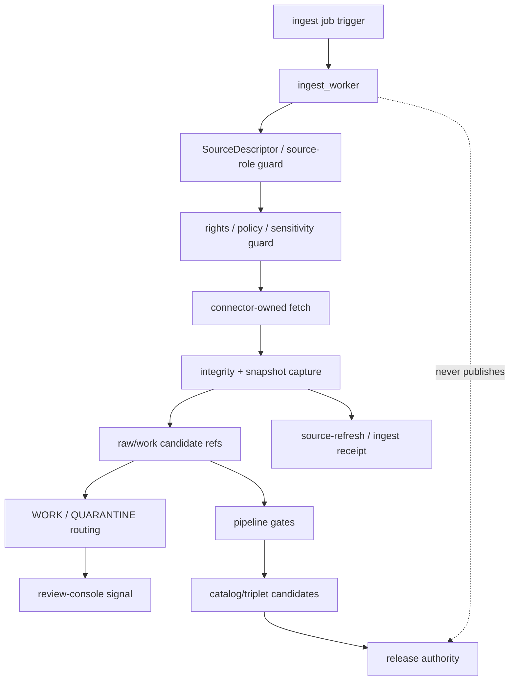

<!-- [KFM_META_BLOCK_V2]
doc_id: kfm://app/workers/src/ingest-worker/readme
title: Ingest Worker README
type: app-readme
version: v0.1
status: draft
owners: OWNER_TBD — Worker steward · Source steward · Ingest steward · Pipeline steward · Evidence steward · Policy steward · Docs steward
created: 2026-06-16
updated: 2026-06-16
policy_label: public
related:
  - ../README.md
  - ../../README.md
  - ../../../governed-api/README.md
  - ../../../review-console/README.md
  - ../../../../connectors/README.md
  - ../../../../pipelines/README.md
  - ../../../../pipeline_specs/README.md
  - ../../../../packages/README.md
  - ../../../../policy/README.md
  - ../../../../schemas/contracts/v1/
  - ../../../../contracts/
  - ../../../../data/README.md
  - ../../../../data/receipts/
  - ../../../../data/proofs/
  - ../../../../release/README.md
tags: [kfm, apps, workers, ingest-worker, ingestion, source-refresh, source-descriptor, raw-candidate, receipts, evidencebundle, policydecision, lifecycle]
notes:
  - "Replaces the greenfield ingest_worker stub with a bounded worker-source contract."
  - "This worker may orchestrate source-refresh and ingest-adjacent jobs through connector/pipeline boundaries, but it must not become connector authority, silently admit sources, publish, rewrite canonical records, or bypass policy/evidence gates."
  - "Worker source files, job definitions, queue contracts, source descriptors, schemas, fixtures, tests, ingest outputs, receipt outputs, deployment state, logs, dashboards, and CI pass state remain NEEDS VERIFICATION."
[/KFM_META_BLOCK_V2] -->

<a id="top"></a>

<div align="center">

# Ingest Worker

`apps/workers/src/ingest_worker/`

**App-local worker-source boundary for ingest-adjacent background jobs: source refresh orchestration, connector invocation, raw/work candidate staging, SourceDescriptor and rights prechecks, integrity/hash capture, receipt emission, review routing signals, stale-source detection, idempotency, and non-publishing worker enforcement.**


[Purpose](#1-purpose) · [Repo fit](#2-repo-fit) · [Boundary](#3-authority-boundary) · [Inputs](#5-inputs) · [Exclusions](#6-exclusions) · [Worker map](#7-ingest-worker-map) · [Definition of done](#14-definition-of-done)

</div>

---

> [!IMPORTANT]
> **Status:** draft / `NEEDS VERIFICATION`  
> **Owners:** `OWNER_TBD` — Worker steward · Source steward · Ingest steward · Pipeline steward · Evidence steward · Policy steward · Docs steward  
> **Path:** `apps/workers/src/ingest_worker/README.md`  
> **Responsibility root:** `apps/` — deployable application surfaces  
> **Truth posture:** CONFIRMED README path / CONFIRMED Workers source boundary / CONFIRMED apps-root worker non-publisher role / PROPOSED ingest-worker contract / UNKNOWN source files, queue contracts, source descriptors, schemas, tests, fixtures, runtime behavior, deployment state, and CI pass state

> [!CAUTION]
> The Ingest Worker is not source authority, connector authority, admission authority, publication authority, or policy authority. It may orchestrate governed ingest-adjacent jobs and emit receipts/candidates, but it must not silently admit sources, upcast source roles, rewrite canonical records, bypass rights/sensitivity checks, or publish.

---

## 1. Purpose

`apps/workers/src/ingest_worker/` is the proposed app-local worker-source home for ingest-adjacent background jobs.

It may eventually contain modules for:

- source-refresh job intake from approved schedules, queues, or operator-triggered dry runs;
- idempotency and retry handling for ingest jobs;
- connector invocation through connector-owned boundaries;
- SourceDescriptor, source role, rights, cadence, and integrity prechecks;
- raw capture or candidate-staging reference generation where authorized;
- hash, checksum, ETag, timestamp, and source snapshot metadata capture;
- ingest, validation-preflight, and source-refresh receipt emission;
- stale-source and changed-source detection;
- review-console queue routing signals for ambiguous, restricted, or failed intake;
- safe failure states with no claim or protected detail leakage.

This README does not prove that any ingest worker source file, queue contract, schema, fixture, test, connector integration, receipt writer, raw/work candidate writer, deployment, log, dashboard, or CI pass state exists.

[Back to top](#top)

---

## 2. Repo fit

| Concern | Owning root | Expected relationship |
|---|---|---|
| Ingest worker source | `apps/workers/src/ingest_worker/` | App-local worker source, if implemented |
| Workers source | `apps/workers/src/` | Worker source boundary and non-publisher enforcement |
| Workers app | `apps/workers/` | Background deployable boundary |
| Governed API | `apps/governed-api/` | Trust membrane and governed public API path |
| Review Console | `apps/review-console/` | Human review and decision surface |
| Connectors | `connectors/` | Source-specific fetching/admission connectors |
| Pipelines | `pipelines/`, `pipeline_specs/` | Pipeline logic and declarative pipeline definitions |
| Shared packages | `packages/` | Reusable implementation libraries after extraction/review |
| Policy | `policy/` | Admissibility, sensitivity, rights, review, and release policy |
| Lifecycle artifacts | `data/` | Lifecycle states, receipts, proofs, registries, catalog, triplets, published outputs |
| Receipts and proofs | `data/receipts/`, `data/proofs/` | Receipt/proof support for material outputs |
| Release authority | `release/` | Publication, correction, rollback authority |
| Schemas/contracts | `schemas/contracts/v1/`, `contracts/` | Machine shape and object meaning |

## 3. Authority boundary

This worker may orchestrate source-refresh and ingest-adjacent jobs. It does not own source authority, connector authority, SourceDescriptor schema/contract authority, policy decisions, rights decisions, lifecycle storage, canonical records, EvidenceBundle truth, release decisions, publication, correction approval, rollback approval, review decisions, pipeline authority, public API behavior, public UI behavior, or runtime/model authority.

```text
apps/workers/src/ingest_worker/ = app-local ingest worker source
apps/workers/src/               = worker source boundary
apps/workers/                   = background worker deployable
connectors/                     = source-specific fetch/admit code
pipelines/                      = executable pipeline logic
pipeline_specs/                 = declarative pipeline definitions
packages/                       = reusable libraries
policy/                         = admissibility and decision policy
data/                           = lifecycle artifacts, receipts, proofs, registries
release/                        = publication, correction, rollback authority
apps/governed-api/              = governed public trust membrane
apps/review-console/            = human review and decision surface
```

## 4. Default posture

The Ingest Worker should fail closed. A job should not emit raw/work candidates, source-refresh receipts, changed-source signals, routing signals, or downstream ingest outputs when any of these are unresolved:

- job trigger authenticity, queue ownership, idempotency key, and worker identity;
- SourceDescriptor identity, source role, source authority, cadence, and status;
- source rights, license, use terms, consent, embargo, and revocation state where material;
- source URL/endpoint/attachment identity and integrity hash;
- connector availability, connector contract, and connector-owned output shape;
- schema, contract, validator, and fixture availability;
- policy decision, sensitivity, redaction/generalization, and access posture;
- deterministic source snapshot identity and receipt requirements;
- output lifecycle home, receipt home, and owning steward;
- review state, quarantine rules, correction state, rollback state, and stale-source impacts;
- retry, resume, safe-disable, and rollback behavior;
- safe error behavior and no raw/internal detail leakage.

## 5. Inputs

| Input family | Examples | Required posture |
|---|---|---|
| Job trigger | schedule, queue message, operator dry run, source-change signal | Audited and idempotent |
| Job context | job id, run id, idempotency key, retry count, worker identity | Durable and traceable |
| Source descriptor | source id, source role, cadence, owner, status, policy label | Cataloged and validated before material use |
| Source endpoint | URL, API endpoint, file ref, attachment ref, ETag, Last-Modified | Connector-owned and integrity-checked |
| Rights/policy context | rights, license, use terms, sensitivity, embargo, revocation state | Policy-runtime derived |
| Connector output | raw capture ref, fetch metadata, checksum, source snapshot metadata | Bounded and receipt-backed |
| Output refs | raw/work candidate ref, source-refresh receipt, ingest receipt, review queue signal | Correct lifecycle/root target required |
| Review context | quarantine reason, restriction reason, stale-source signal, next steward | Finite and auditable |

## 6. Exclusions

| Does not belong here | Correct home |
|---|---|
| Source-specific connector implementation | `connectors/` |
| Source descriptor schema or contract authorship | `schemas/contracts/v1/`, `contracts/` |
| Reusable ingest/pipeline logic | `pipelines/` or `packages/` |
| Declarative pipeline definitions | `pipeline_specs/` |
| Policy rules, sensitivity rules, and rights decisions | `policy/` |
| Lifecycle data and canonical stores | `data/` |
| Receipts and proofs | `data/receipts/`, `data/proofs/` |
| Final catalog/triplet or published records | `data/catalog/`, `data/triplets/`, `data/published/` through governed flows |
| Release manifests, correction notices, rollback cards | `release/` |
| Public or semi-public API surface | `apps/governed-api/` |
| Public UI or map rendering | `apps/explorer-web/` |
| Review decisions and manual adjudication | `apps/review-console/` |
| Direct model/runtime public access | `runtime/` behind governed API only |
| Deployment-only values | Deployment environment/config channels |

## 7. Ingest worker map

Exact implementation files remain `NEEDS VERIFICATION`.

| Candidate module | Purpose | Required safeguard | Status |
|---|---|---|---|
| `job_contract` | Queue message and job envelope handling | Closed schema and idempotency | PROPOSED |
| `source_descriptor_guard` | SourceDescriptor/source-role precheck | No silent source admission | PROPOSED |
| `rights_guard` | Rights, license, consent, embargo, revocation checks | Fail closed on unresolved state | PROPOSED |
| `connector_runner` | Connector-owned fetch invocation | Does not own connector logic | PROPOSED |
| `integrity_capture` | Hash, ETag, timestamp, snapshot metadata | Deterministic and auditable | PROPOSED |
| `candidate_writer` | Raw/work candidate ref emission | Correct lifecycle root only | PROPOSED |
| `receipt_writer` | Source-refresh/ingest/job receipt emission | Durable data-root output | PROPOSED |
| `stale_signal` | Changed-source and stale-source detection | Receipt-backed and bounded | PROPOSED |
| `review_signal` | Quarantine/review routing signal | Candidate only, no decision | PROPOSED |
| `safe_errors` | Failure, retry, and safe log shaping | No internal detail leakage | PROPOSED |

> [!WARNING]
> Candidate module names are not implementation proof. Do not claim an ingest worker module is live until files, queues, schemas, fixtures, tests, connector integration, policy gates, receipt outputs, and deployment evidence confirm it.

## 8. Diagram



## 9. Worker obligations

| Obligation | Example effect |
|---|---|
| `watcher_non_publisher` | Worker emits receipts and candidates, not final published releases |
| `no_silent_admission` | SourceDescriptor and source role must be valid before material use |
| `connector_boundary_preserved` | Worker invokes connector-owned code but does not become connector authority |
| `source_role_preserved` | Source role is carried forward and not upcast by worker convenience |
| `policy_required` | Rights, sensitivity, access, and use-term gates run before material output |
| `receipt_required` | Material source refresh, fetch, and candidate emissions produce receipts |
| `integrity_required` | Hash/checksum/source timestamp metadata are captured where material |
| `candidate_only` | Raw/work outputs remain lifecycle candidates until governed downstream gates |
| `idempotent_jobs` | Re-running a job should not duplicate authoritative records |
| `safe_error_only` | Failures reveal no protected data, raw payloads, internal paths, or connector internals |

## 10. Job contract

Each durable ingest worker module or child README should state:

- job purpose and owner;
- authorized producer and trigger type;
- queue message shape and idempotency key;
- SourceDescriptor/source-role dependency;
- accepted source endpoint refs and denied inputs;
- connector contract and output shape;
- policy, sensitivity, rights, consent, embargo, and revocation dependency;
- integrity, hash, timestamp, and receipt requirements;
- output refs and receipt types emitted;
- safe-disable, retry, and rollback path;
- tests and fixtures required;
- open verification items.

## 11. Inspection path

Ingest worker source files, queue contracts, schemas, tests, fixtures, connector integration, policy integration, source descriptor handling, receipt outputs, candidate outputs, deployment state, logs, dashboards, and emitted artifacts remain `NEEDS VERIFICATION`.

```bash
find apps/workers/src/ingest_worker -maxdepth 7 -type f | sort
find apps/workers connectors pipelines pipeline_specs packages policy schemas contracts data release tests fixtures -maxdepth 7 -type f 2>/dev/null | grep -Ei 'ingest|source|SourceDescriptor|connector|fetch|admit|raw|work|quarantine|receipt|PolicyDecision|EvidenceRef|EvidenceBundle|rights|license|consent|embargo|revocation|hash|etag|checksum|candidate|worker|job|queue|test|fixture' | sort
```

## 12. Validation expectations

Useful validation for this worker should cover:

- unauthorized producers cannot enqueue ingest jobs;
- malformed job/input envelopes fail closed;
- missing SourceDescriptor, source role, rights, policy, connector contract, schema, validator, or output target blocks material output;
- connector invocation preserves connector boundary and does not embed source-specific logic in worker source;
- source role, rights, cadence, hash, ETag/timestamp, and provenance metadata are preserved where material;
- raw/work outputs are candidate or lifecycle-stage outputs only and do not become catalog/triplet/published authority;
- material source refresh/fetch/candidate outputs emit receipts with job id, source refs, output refs, hashes, and limitations;
- retry/idempotency prevents duplicate authoritative outputs;
- review/quarantine routing signals remain candidates and require governed review paths;
- safe errors reveal no raw payloads, protected detail, internal paths, connector secrets, or deployment-only values.

## 13. Safe change pattern

For Ingest Worker changes:

1. Add or update ingest worker inventory and job contract.
2. Link job, source descriptor, source endpoint, connector output, candidate, receipt, and policy DTOs to schemas/contracts before changing shapes.
3. Add fixtures for valid source refresh, missing SourceDescriptor, weak source role, rights denial, active embargo, revoked consent, missing connector, malformed connector output, stale source, duplicate idempotency key, retry, and safe error cases.
4. Add no-silent-admission, connector-boundary, no-publish, no-canonical-rewrite, source-role-preservation, rights-policy, receipt-required, idempotency, and safe-error tests before enabling jobs.
5. Preserve SourceDescriptor refs, source role, rights refs, PolicyDecision refs, EvidenceRef/EvidenceBundle refs where material, lifecycle state, receipt refs, job ids, reason codes, timestamps, hashes, and limitations through every material output.
6. Update this README, parent Workers README, Workers source README, connector docs, pipeline docs, governed API/review-console docs, policy docs, schemas/contracts, and tests when behavior materially changes.

## 14. Definition of done

- [ ] Owners are confirmed and `OWNER_TBD` is replaced.
- [ ] Ingest worker module inventory and ownership are documented.
- [ ] Job/source/connector-output/candidate/receipt DTOs and schemas are verified.
- [ ] Authorized producer, queue, idempotency key, retry, and safe-disable behavior are documented and tested.
- [ ] SourceDescriptor handling, source-role preservation, connector boundary, rights/policy checks, integrity capture, and receipt writer are documented and tested.
- [ ] Worker cannot silently admit sources, publish, rewrite canonical records, or upcast source authority.
- [ ] Raw/work outputs and review signals are candidate/lifecycle-stage outputs only until governed downstream gates.
- [ ] Sensitive-domain, weak-source, missing-rights, missing-connector, and safe-error tests are present and passing.
- [ ] Deployment, logs, dashboards, and runbooks are documented with current evidence.

## 15. Open verification items

| Item | Why it matters |
|---|---|
| Confirm source files beyond README | Prevents overclaiming implementation maturity |
| Confirm ingest job/queue contract | Required before worker behavior claims |
| Confirm SourceDescriptor/source-role handling | Required before source authority claims |
| Confirm connector integration and boundary | Required before fetch/admit claims |
| Confirm source endpoint and output schemas | Required before shape claims |
| Confirm policy/rights/sensitivity integration | Required before governed intake claims |
| Confirm receipt outputs and target paths | Required before auditability claims |
| Confirm candidate lifecycle output targets | Required before lifecycle claims |
| Confirm no-publish and no-canonical-rewrite behavior | Required before trust claims |
| Confirm tests, fixtures, deployment, logs, and dashboards | Required before operational maturity claims |

<details>
<summary>Appendix A — no-loss preservation note</summary>

The previous README was a greenfield stub. This replacement adds a bounded Ingest Worker contract without claiming source files, queues, schemas, tests, fixtures, connector integration, policy enforcement, source descriptor handling, raw/work output handling, receipt emission, deployment, logs, dashboards, or CI pass state are implemented.

</details>

## Status summary

`apps/workers/src/ingest_worker/` should contain ingest-adjacent worker source only after job inventory, queue contract, schema validation, SourceDescriptor/source-role handling, connector boundary verification, policy/rights integration, integrity capture, receipt emission, tests, and operational evidence are verified.

It must preserve the ingest boundary: this worker may orchestrate source-refresh and candidate intake work, but it must not become connector authority, silently admit sources, publish artifacts, rewrite canonical records, upcast source authority, expose protected material, or bypass downstream lifecycle, review, and release gates.

<p align="right"><a href="#top">Back to top</a></p>
