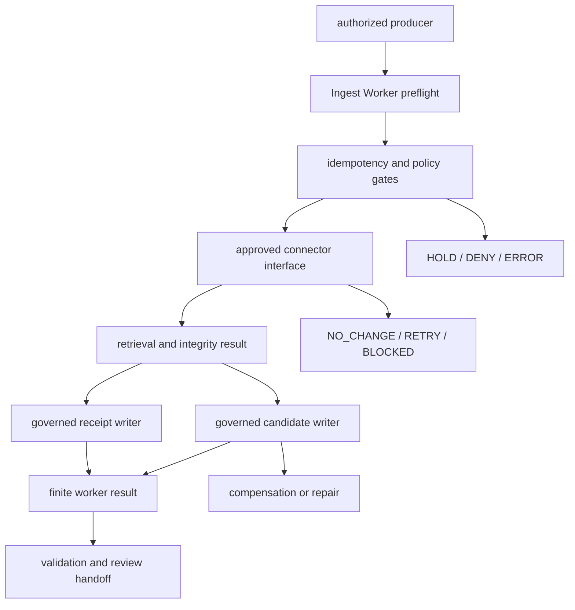

<!-- [KFM_META_BLOCK_V2]
doc_id: kfm://app/workers/src/ingest-worker/readme
title: Ingest Worker README
type: app-readme
subtype: worker-lane-boundary-readme
version: v0.2
prior_version: v0.1
status: draft; repository-grounded; placeholder-only
owner: "NEEDS VERIFICATION — CODEOWNERS routes default repository review to @bartytime4life; no accepted Ingest Worker steward, source-admission owner, operations owner, independent reviewer, or release authority was verified"
created: 2026-06-16
updated: 2026-08-12
policy_label: public
current_path: apps/workers/src/ingest_worker/README.md
owning_root: apps/
responsibility: Define the repository-grounded boundary, current scaffold maturity, source-admission relationships, non-publisher controls, implementation admission gates, validation burden, correction path, and rollback posture for the app-local Ingest Worker lane
truth_posture: "CONFIRMED pinned repository bytes and adopted placement authority / PROPOSED future worker contract / UNKNOWN queue, runtime, deployment, and operational behavior / NEEDS VERIFICATION ownership, consumers, permissions, policy binding, CI coupling, and release integration"
evidence_snapshot:
  repository: bartytime4life/Kansas-Frontier-Matrix
  base_ref: main
  base_commit: 40995f1585466972e8f7602613633a64129af60d
  target_prior_blob: a0469d836745cca8bb88a970ca7e274e4f8fdb31
  entrypoint_blob: c13ad0e8911241da3ea18f8da0f869eea27db58b
  workers_readme_blob: 5b5c1e6b067e652a380bf445488a6227028dfc0e
  workers_src_readme_blob: 08ad9f8116f64817ffa4f8b2058613749360c102
  directory_rules_blob: fd49a0b83e55cef52c1124281f093e263526898d
  codeowners_blob: dd2a84aa514d8ecd9208bc347f90f9a2ed37dd61
  inspection_mode: GitHub connector reads, exact-path probes, recursive tree inventory, bounded code and pull-request search, current branch reconciliation, and deterministic Markdown checks
related:
  - ../README.md
  - ../../README.md
  - ../../../README.md
  - ../../../governed-api/README.md
  - ../../../review-console/README.md
  - ../../../../docs/doctrine/directory-rules.md
  - ../../../../docs/adr/ADR-0029-adopt-directory-governance-standard-v2.md
  - ../../../../connectors/README.md
  - ../../../../packages/connectors-core/README.md
  - ../../../../pipelines/ingest/README.md
  - ../../../../pipeline_specs/README.md
  - ../../../../contracts/source/source_descriptor.md
  - ../../../../contracts/source/source_adapter.md
  - ../../../../contracts/source/source_ingestion_plan.md
  - ../../../../contracts/source/source_retrieval_episode.md
  - ../../../../contracts/source/ingest_receipt.md
  - ../../../../schemas/contracts/v1/source/source_descriptor.schema.json
  - ../../../../schemas/contracts/v1/source/source_ingestion_plan.schema.json
  - ../../../../schemas/contracts/v1/source/source_retrieval_episode.schema.json
  - ../../../../schemas/contracts/v1/source/ingest_receipt.schema.json
  - ../../../../fixtures/contracts/v1/source/source_descriptor/README.md
  - ../../../../fixtures/contracts/v1/source/source_ingestion_plan/README.md
  - ../../../../fixtures/contracts/v1/source/ingest_receipt/README.md
  - ../../../../tools/validators/validate_source_ingestion_plan.py
  - ../../../../tools/validators/source/validate_source_retrieval_episode.py
  - ../../../../tools/validators/validate_ingest_receipt.py
  - ../../../../tests/validators/test_validate_source_ingestion_plan.py
  - ../../../../tests/validators/test_validate_source_retrieval_episode.py
  - ../../../../tests/validators/test_validate_ingest_receipt.py
  - ../../../../data/registry/source_descriptors/README.md
  - ../../../../data/receipts/ingest/README.md
  - ../../../../policy/README.md
  - ../../../../release/README.md
  - ../../../../.github/workflows/connector-gate.yml
  - ../../../../.github/workflows/source-ingestion-plan.yml
  - ../../../../.github/workflows/source-retrieval-episode.yml
  - ../../../../.github/CODEOWNERS
tags:
  - kfm
  - apps
  - workers
  - ingest-worker
  - source-admission
  - source-descriptor
  - source-adapter
  - retrieval
  - raw-candidate
  - ingest-receipt
  - rights
  - sensitivity
  - evidence
  - policy
  - non-publisher
  - fail-closed
  - rollback
notes:
  - "v0.2 replaces proposal-heavy worker claims with a current repository-grounded maturity contract."
  - "The lane contains only this README and one comment-only main.py placeholder at the pinned base."
  - "SourceDescriptor, SourceAdapter, SourceIngestionPlanCandidate, SourceRetrievalEpisode, and IngestReceipt surfaces exist elsewhere with mixed proposed, fixture-first, and executable-validator maturity; no Ingest Worker consumer or execution wiring was verified."
  - "The shared pipelines/ingest and CLI ingest entrypoints are also comment-only placeholders; tools/ingest contains repository tools and must not become a production app dependency."
  - "This documentation change does not activate a source, add worker code, fetch data, write RAW or QUARANTINE material, create a receipt, deploy a process, promote lifecycle state, release, or publish."
[/KFM_META_BLOCK_V2] -->

<a id="top"></a>

<div align="center">

# Ingest Worker

`apps/workers/src/ingest_worker/`

**App-local deployment-wrapper boundary for future asynchronous source-intake coordination—from an authorized job and admitted source reference to bounded candidate and receipt handoffs, without owning source truth, connector logic, lifecycle storage, policy, release decisions, or publication.**

[](#2-repository-grounded-status)
[](#3-authority-and-placement)
[](#4-operating-boundary)
[](#7-adjacent-ingest-contracts-and-finite-outcomes)
[](#13-validation-and-test-strategy)
[](#3-authority-and-placement)

[Purpose](#1-purpose) · [Current state](#2-repository-grounded-status) · [Boundary](#4-operating-boundary) · [Inputs](#5-inputs) · [Outputs](#6-outputs) · [Flow](#8-execution-model) · [Validation](#13-validation-and-test-strategy) · [Done](#18-definition-of-done) · [Rollback](#20-maintenance-correction-and-rollback)

</div>

---

> [!IMPORTANT]
> **Current state:** repository-grounded draft / placeholder-only. The directory contains this README and [`main.py`](./main.py); `main.py` is a single comment and establishes no executable worker behavior. No queue consumer, scheduler, connector invocation, source fetch, RAW writer, receipt writer, service loop, worker package, worker-specific test, deployment manifest, or runtime integration was verified at `main@40995f1585466972e8f7602613633a64129af60d`.

> [!CAUTION]
> An Ingest Worker may eventually coordinate bounded source-intake jobs. It must never treat a reachable endpoint, successful fetch, valid `SourceDescriptor`, `SourceRetrievalEpisode`, `IngestReceipt`, checksum, schema pass, queue acknowledgement, pull request, merge, or generated summary as evidence truth, policy approval, lifecycle promotion, release authority, or KFM publication.

> [!NOTE]
> Badge color is presentation only. The plain-text status, pinned evidence snapshot, validation record, and repository bytes control every claim in this README.

---

## 1. Purpose

`apps/workers/src/ingest_worker/` is the app-local source lane reserved for a future deployable Ingest Worker wrapper.

Its responsibility, if implemented, is deliberately narrow:

1. receive an authenticated, schema-valid, idempotent ingest job from an authorized producer;
2. verify that the job references an admitted source, immutable or versioned plan, bounded scope, and permitted operation;
3. delegate source-specific acquisition to [`connectors/`](../../../../connectors/README.md) through an accepted connector or package interface;
4. preserve source identity, source role, rights, sensitivity, time, integrity, and retrieval outcomes without upcasting authority;
5. coordinate a finite candidate or no-change handoff and emit process memory through governed writers;
6. route unresolved work to `HOLD`, `DENY`, `FAIL`, `ERROR`, retry, or quarantine behavior defined by the owning contracts and policy;
7. stop before validation approval, cataloging, promotion, release, public serving, or publication.

The worker is a **deployment wrapper**, not the ingest system itself. Directory Rules place independently deployable processes in `apps/`, source-specific acquisition in `connectors/`, reusable code in `packages/`, executable lifecycle transformation in `pipelines/`, declarative runs in `pipeline_specs/`, repository tooling in `tools/`, semantic meaning in `contracts/`, machine shape in `schemas/`, policy in `policy/`, governed instances in `data/`, and release decisions in `release/`.

### 1.1 One-line operating law

> The Ingest Worker may coordinate an authorized source-intake attempt only through declared interfaces to finite, integrity-bound, receipted outcomes; it cannot admit a source by itself, create truth, bypass policy, promote lifecycle state, release artifacts, or publish.

### 1.2 Goals

A future implementation should make ingest coordination:

- deterministic where practical and explicit where external state prevents full determinism;
- idempotent under duplicate delivery, retry, resume, and replay;
- bounded by an immutable or versioned job and source scope;
- connector-driven rather than source logic embedded in the app wrapper;
- aware of observation time, retrieval time, source-head time, and processing time;
- fail-closed for unknown rights, sensitivity, access, integrity, or output authority;
- transparent about finite transport, retrieval, receipt, and worker outcomes;
- auditable through receipts without treating receipts as proof;
- reversible without deleting source, evidence, review, correction, or release lineage;
- safe for multiple domains without collapsing source roles or exposing harmful precision.

### 1.3 Non-goals

This lane does not exist to:

- define or self-admit external sources;
- contain source-specific HTTP, API, database, file, scraper, or adapter implementations;
- normalize, validate, catalog, or publish domain records;
- become a second contract, schema, policy, source registry, receipt, proof, or release home;
- store RAW, WORK, QUARANTINE, PROCESSED, CATALOG, TRIPLET, PUBLISHED, receipt, or proof instances;
- infer truth from source reputation, retrieval success, metadata, checksum, or freshness;
- resolve rights, sovereignty, consent, sensitivity, access, review, or release questions by convenience;
- expose a browser, public API, callback, webhook, map, AI, or direct-model route;
- import repository tools as production application logic;
- make a watcher, schedule, queue acknowledgement, receipt, or job completion equivalent to promotion or publication.

[Back to top](#top)

---

<a id="2-repo-fit"></a>
<a id="11-inspection-path"></a>

## 2. Repository-grounded status

### 2.1 Current profile

| Field | Bounded result |
|---|---|
| Repository snapshot | `main@40995f1585466972e8f7602613633a64129af60d` |
| Directory contents | Exactly `README.md` and `main.py` |
| Prior README blob | `a0469d836745cca8bb88a970ca7e274e4f8fdb31` |
| Entrypoint blob | `c13ad0e8911241da3ea18f8da0f869eea27db58b` |
| Entrypoint bytes | `# ingest_worker entrypoint — greenfield placeholder` plus final newline |
| Executable Python in this lane | None verified |
| Queue, scheduler, or producer contract | Not found / `UNKNOWN` |
| Connector or pipeline binding | Not found by bounded exact-name and tree inspection |
| Worker-specific tests or workflow | Not found by bounded inspection |
| Package or deployment manifest in this lane | None present |
| Runtime, logs, metrics, dashboard, or health evidence | `UNKNOWN` |
| Source activation or public/release authority | Denied by boundary; no authority verified |
| Review route | Default CODEOWNERS route is `@bartytime4life`; approval and stewardship remain separate |

### 2.2 What is confirmed now

**CONFIRMED from pinned repository bytes:**

- the lane exists at the requested path;
- the target README existed and is being revised in place;
- [`main.py`](./main.py) is comment-only;
- the parent [Workers app](../../README.md) and [Workers source](../README.md) contracts classify all eight worker lanes as placeholders;
- accepted [ADR-0029](../../../../docs/adr/ADR-0029-adopt-directory-governance-standard-v2.md) makes [`docs/doctrine/directory-rules.md`](../../../../docs/doctrine/directory-rules.md) the single writable human Directory Rules authority;
- CODEOWNERS routes default review to `@bartytime4life` but explicitly does not prove stewardship, review completion, policy approval, release approval, or separation of duties;
- bounded exact-name search surfaced this lane and parent documentation, but no executable Ingest Worker import, queue, schedule, deployment, or consumer;
- the CLI ingest entrypoint and shared pipeline ingest entrypoint are also comment-only placeholders;
- source-admission contracts, schemas, fixtures, validators, tests, connector primitives, repository tools, and workflows exist elsewhere with mixed maturity described below;
- no open pull request found by exact target-path search claimed this README at the inspection point.

### 2.3 Current direct-child map

```text
apps/workers/src/ingest_worker/
├── README.md  # boundary contract; documentation only
└── main.py    # one-comment greenfield placeholder
```

This is the complete current directory map at the pinned base. It is not a proposed module tree.

### 2.4 Adjacent ingest maturity

| Surface | Pinned evidence | Current bounded interpretation |
|---|---|---|
| [`apps/cli/.../ingest.py`](../../../cli/src/kfm_cli/commands/ingest.py) | Single greenfield-placeholder comment | No operator CLI behavior is established |
| [`pipelines/ingest/main.py`](../../../../pipelines/ingest/main.py) | Single greenfield-placeholder comment | Shared ingest-stage execution entrypoint remains placeholder-only |
| [`pipelines/ingest/README.md`](../../../../pipelines/ingest/README.md) | Repository-grounded shared ingest boundary | Defines placement and future obligations; does not establish a shared executable system |
| [`SourceDescriptor` contract](../../../../contracts/source/source_descriptor.md) | Draft, schema-paired, source-role anti-collapse contract | Semantic and governance surface exists; source truth or admission is not implied |
| [`SourceDescriptor` schema](../../../../schemas/contracts/v1/source/source_descriptor.schema.json) | Rich Draft 2020-12 implementation schema | Machine shape exists; source use still requires contract, policy, review, and runtime authorization |
| [`SourceAdapter` contract](../../../../contracts/source/source_adapter.md) | Proposed source-agnostic protocol; no live adapter or source activation | Reusable protocol and connector primitives exist; worker binding is absent |
| [`connectors-core`](../../../../packages/connectors-core/README.md) | Executable source-agnostic transport, retry, integrity, redaction, and adapter primitives | Package capability exists; no source-specific activation or worker composition is inferred |
| [`SourceIngestionPlanCandidate`](../../../../contracts/source/source_ingestion_plan.md) | Proposed, fixture-first, no-network, no-source-activation profile | Contract, closed schema, fixtures, validator, tests, and workflow exist; it is not a live schedule |
| [`SourceRetrievalEpisode`](../../../../contracts/source/source_retrieval_episode.md) | Proposed, inactive, fixture-only, no-network observation profile | Schema, cases, validator, tests, and workflow exist; it grants no RAW write or source activation |
| [`IngestReceipt`](../../../../contracts/source/ingest_receipt.md) | Draft, schema-paired, validator-implemented profile | Schema, fixtures, validator, tests, and connector-gate prerequisite exist; connector-run receipt presence remains held |
| [`data/receipts/ingest/`](../../../../data/receipts/ingest/README.md) | Draft parent receipt lane with atmosphere and flora child lanes | Logical receipt family exists; receipt presence is process memory, not worker wiring or proof |
| [`tools/ingest/`](../../../../tools/ingest/README.md) | Repository watcher, preflight, and review-signal tool boundary | Useful implementation exists under `tools/`; production apps must not depend on it as hidden runtime logic |
| Source-oriented workflows | Read-only or bounded validation workflows are present | Workflow bytes exist; no current-run result or worker execution is claimed |
| [`release/`](../../../../release/README.md) | Separate release/correction/rollback plane | Worker cannot approve, promote, release, or publish |

### 2.5 Important maturity distinctions

The repository contains real ingest-adjacent implementation, but the following statements are not interchangeable:

| Statement | Current status |
|---|---|
| A schema and validator can evaluate a synthetic `SourceIngestionPlanCandidate` | `CONFIRMED PRESENT` |
| A schema and validator can evaluate fixture-only retrieval episodes | `CONFIRMED PRESENT` |
| An IngestReceipt validator and focused tests exist | `CONFIRMED PRESENT` |
| Source-agnostic connector primitives exist in a reusable package | `CONFIRMED PRESENT` |
| Source-specific watchers and preflight tools exist | `CONFIRMED PRESENT` |
| `apps/workers/src/ingest_worker/main.py` composes those capabilities | `NOT FOUND / UNKNOWN` |
| An authorized producer can enqueue a durable Ingest Worker job | `UNKNOWN` |
| A live source is activated or fetched by this lane | `DENIED AS AN INFERENCE` |
| A receipt proves evidence, policy, release, or publication | `DENIED BY BOUNDARY` |

### 2.6 Maturity conclusion

> **Current lane maturity: `PLACEHOLDER_ONLY`.** The repository has meaningful source-admission and ingest-adjacent contracts, validators, tests, connector primitives, tools, and workflows elsewhere, but no evidence shows that `ingest_worker` imports, executes, schedules, consumes, fetches, emits, deploys, or owns any of them.

The correct posture is neither “empty project” nor “working ingest service.” The lane has a governed placement and a detailed admission contract; runtime behavior remains unimplemented or unverified.

### 2.7 README impact

| Dimension | Result |
|---|---|
| Artifact operation | Same-path complete replacement of the existing README |
| Change class | Editorial and additive documentation; no behavioral implementation |
| Modernization intent | Combined semantic correction and evidence-backed presentation |
| Intensity | Showcase, bounded by current repository evidence |
| Direct dependencies changed | None |
| Runtime or network effect | None |
| Data, source, evidence, policy, or release effect | None |
| Compatibility | Path, document ID, created date, useful anchors, and prior lineage preserved |
| Review state | Human review required; draft delivery only |
| Rollback | Restore prior blob or revert the documentation commit |

### 2.8 Last reviewed

- **Date:** 2026-08-12
- **Repository:** `bartytime4life/Kansas-Frontier-Matrix`
- **Base:** `main@40995f1585466972e8f7602613633a64129af60d`
- **Target prior blob:** `a0469d836745cca8bb88a970ca7e274e4f8fdb31`
- **Inspection:** complete target and entrypoint bytes; parent worker contracts; adopted Directory Rules and ADR; CODEOWNERS; recursive tree inventory; bounded worker and open-PR search; CLI and pipeline placeholders; source descriptor, adapter, ingestion-plan, retrieval-episode, receipt, connector-core, receipt-lane, tool, validator, test, and workflow surfaces
- **Not inspected as operational proof:** deployed worker, broker, scheduler, live connector, source credentials, runtime logs, dashboard, storage transaction, required-check settings for this lane, or release/publication activity

[Back to top](#top)

---

<a id="3-authority-boundary"></a>

## 3. Authority and placement

### 3.1 Directory Rules basis

Accepted ADR-0029 adopts Directory Rules v2. The relevant responsibility split is:

| Responsibility | Owning root | Ingest Worker relationship |
|---|---|---|
| Independently deployable process | `apps/` | This lane may become a thin app-local worker wrapper |
| Source-specific fetch, capture, admission implementation | `connectors/` | Worker invokes an admitted connector interface; it must not copy connector logic |
| Reusable non-deployable code | `packages/` | Worker may depend on accepted package interfaces |
| Executable lifecycle transformation | `pipelines/` | Worker hands off to an approved ingest-stage interface; it does not own transformation logic |
| Declarative run graph, schedule, inputs, outputs, resources | `pipeline_specs/` | Worker consumes approved specs; it does not self-author cadence or authority |
| Repository validators, generators, inspectors, operators | `tools/` | Validation and operator evidence only; not a production app dependency |
| Semantic object meaning | `contracts/` | Worker consumes accepted contracts |
| Machine-checkable shape | `schemas/` | Worker validates against canonical schemas |
| Normative admissibility and rights/sensitivity rules | `policy/` | Worker delegates to the policy owner/runtime |
| Source registry and lifecycle/accountability instances | `data/` | Worker uses governed interfaces and emits bounded refs; it does not treat paths as capabilities |
| Ingest receipts | `data/receipts/ingest/` | Worker may emit a conforming receipt through an approved writer |
| Promotion, release, correction, withdrawal, rollback | `release/` | Separate authority; worker cannot approve |
| Public service boundary | `apps/governed-api/` | Public clients never call this worker directly |
| Human review and adjudication | `apps/review-console/` | Worker may route a candidate; it cannot decide review |

### 3.2 Placement outcome

**`PLACE` — same-path documentation modernization.**

This README remains under `apps/workers/src/ingest_worker/` because it explains an existing app-local worker lane. The update:

- creates no new root or child directory;
- moves or renames no file;
- changes no executable source;
- creates no schema, contract, policy, source, registry, queue, receipt, proof, data, release, or publication authority;
- preserves the existing path and document identity;
- does not accept a new ADR or amend Directory Rules.

### 3.3 Dependency direction

A future worker dependency graph should be one-way:

```text
authorized producer / approved job specification
        |
        v
apps/workers/src/ingest_worker/
        |
        +--> packages/ and bounded runtime adapters
        +--> connectors/ source-adapter interface
        +--> pipelines/ ingest handoff interface
        +--> contracts / schemas / policy clients
        +--> governed candidate and receipt writers
        |
        v
validation / review / release processes          separate authority
```

The worker must not be imported by `packages/`, `connectors/`, `pipelines/`, `tools/`, `contracts/`, `schemas/`, `policy/`, or canonical data stores. Production code must not import repository tooling or use raw paths as a substitute for governed interfaces. Reusable or trust-bearing logic must flow out of the app wrapper into its owning responsibility root.

### 3.4 Bounded context

In domain-driven terms, this lane is a deployment boundary around source-intake job coordination. It is not the source model, connector domain, ingest pipeline, source registry, receipt store, policy engine, or published language for source artifacts. Its vocabulary should reuse accepted KFM terms rather than invent app-local synonyms.

[Back to top](#top)

---

<a id="4-default-posture"></a>
<a id="6-exclusions"></a>
<a id="9-worker-obligations"></a>

## 4. Operating boundary

### 4.1 What belongs here

Only app-local worker concerns should eventually live beside this README:

- process startup, shutdown, readiness, and signal handling;
- dependency composition through approved interfaces;
- queue or job-consumer adapter;
- authenticated producer and operation validation;
- worker-local non-secret configuration binding;
- idempotency, lease, retry, cancellation, and deadline coordination;
- invocation of accepted connector, package, pipeline, schema, and policy interfaces;
- translation into a closed worker-result envelope;
- governed candidate and receipt-writer coordination;
- safe operational telemetry and health behavior;
- thin operator-facing entrypoint wiring.

### 4.2 What does not belong here

| Do not place here | Correct owner |
|---|---|
| Source-specific HTTP/API/database/file acquisition | `connectors/` |
| Reusable transport, retry, integrity, or adapter primitives | `packages/connectors-core/` or another reviewed package |
| Ingest lifecycle transformation | `pipelines/ingest/` or another stage-first pipeline lane |
| Declarative schedule, run graph, and resource envelope | `pipeline_specs/` |
| Source, adapter, retrieval, artifact, or receipt semantics | `contracts/source/` |
| Machine schemas | `schemas/contracts/v1/source/` or accepted canonical family |
| Policy bundles and policy rule source | `policy/` |
| Source registry entries | `data/registry/` |
| RAW, WORK, QUARANTINE, or PROCESSED instances | governed `data/` lifecycle lanes |
| Receipts and proofs as stored instances | `data/receipts/`, `data/proofs/` |
| Catalog, triplet, or published carriers | `data/catalog/`, `data/triplets/`, `data/published/` |
| Release manifests, decisions, corrections, withdrawals, rollback cards | `release/` |
| Repository-wide watchers, preflights, validators, generators, operators | `tools/` |
| Public API, UI, map, search, export, or AI route | governed app and released public-safe surfaces |
| Review decisions or quarantine-exit approval | `apps/review-console/` and owning governance surfaces |
| Secrets or credentials | approved external secret store and secret-reference configuration |
| Restricted payload dumps or raw exception traces | Denied; use safe structured diagnostics |

### 4.3 Non-publisher and no-silent-admission invariants

The following transitions are forbidden:

```text
endpoint reachable -> source admitted
SourceDescriptor valid -> source claims true
fetch successful -> RAW accepted
checksum matches -> evidence sufficient
NOT_MODIFIED -> real-world condition unchanged
IngestReceipt SUCCESS -> validation or policy approved
queue acknowledgement -> lifecycle promotion
worker success -> PUBLISHED
pull request merged -> KFM publication
```

A worker may coordinate and record a bounded attempt. It may not upgrade the authority of a source, artifact, candidate, receipt, or result.

### 4.4 Trust membrane

Public clients and ordinary UI surfaces must remain downstream of governed APIs and release-approved public-safe carriers. No browser, map, AI adapter, search client, export process, or public webhook should call the Ingest Worker directly or read its queue, lease, retry, candidate, raw, quarantine, receipt, or diagnostic state.

### 4.5 Exposure, mutation, and retention

| Concern | Required posture |
|---|---|
| Exposure | Internal worker surface only unless a separate accepted interface says otherwise |
| Network | Deny arbitrary destinations; source access belongs to admitted connector interfaces |
| Mutation | Least-privilege capability to exact governed candidate/receipt interfaces only |
| Retention | Defined by job, receipt, queue, and data owners; app source is not storage |
| Secrets | References only; never committed, logged, echoed, or placed in job bodies |
| Raw payloads | Never logged or embedded in receipts; durable placement requires lifecycle authority |
| Sensitive geometry | Redacted/generalized or held according to policy before broader handoff |
| Diagnostics | Stable reason codes and bounded messages; no source values or private locators |

[Back to top](#top)

---

## 5. Inputs

A future worker must reject undeclared or unresolved inputs. The minimum categories are below; exact worker contracts remain `PROPOSED` until implemented and accepted.

| Input family | Required properties | Fail-closed condition |
|---|---|---|
| Job envelope | Stable job ID/version, operation, producer, issued time, attempt, idempotency key, trace ID | Missing, unauthenticated, expired, or unauthorized producer |
| Plan/spec reference | Immutable or versioned plan, `spec_hash`, mode, resource envelope | Mutable, missing, mismatched, or unapproved plan |
| Target scope | `source_id`, approved locator ref, partition/batch scope, requested output class | Wildcard, private locator in body, or unauthorized scope |
| Source descriptor | Stable ref/version, source role/type, status, rights, sensitivity, cadence, access | Missing, inactive, stale, conflicted, or inadmissible descriptor |
| Connector/interface ref | Registered adapter/connector ID and version, supported operation | Job-provided code, arbitrary URL, or unresolved connector |
| Retrieval state | Safe source-head ref, prior validators, checkpoint/resume state | Unbound ETag/time/checkpoint or unsafe metadata |
| Policy/review refs | Current rights, sensitivity, access, consent, embargo, revocation, review obligations | Missing, stale, denied, or incompatible decision |
| Integrity expectations | Digest algorithm, expected digest where known, byte/media limits | Unsupported algorithm, mismatch, or unbounded response |
| Runtime limits | Timeout, retry budget, byte budget, concurrency class, cancellation token | Missing or unsafe resource envelope |
| Output destination | Approved candidate/receipt writer and logical object family | Direct path, public path, release path, or user-controlled destination |
| Correction/rollback refs | Prior attempt/artifact, supersession, withdrawal, rollback target where applicable | New output would orphan or overwrite lineage |

### 5.1 Input prohibitions

The worker must not accept:

- arbitrary filesystem, database, bucket, table, queue, or object-store paths as authority;
- arbitrary URLs or callback destinations supplied by an untrusted job;
- credentials, tokens, signed URLs, cookies, or authorization headers in job bodies;
- raw source bodies embedded in queue messages;
- mutable branch names or display names as the only specification identity;
- model-generated source admission, evidence, policy, or release decisions;
- a previous `PASS` without the exact validator, schema, input digest, and scope that produced it;
- a source role inferred from filename, provider reputation, or domain convenience;
- stale policy, review, embargo, consent, correction, or release references presented as current;
- user-controlled output paths or unbounded batches.

### 5.2 Time and version locking

Ingest is time-aware. A job should distinguish, where applicable:

- source observation or valid time;
- source-head `Last-Modified` or revision time;
- retrieval attempt and completion time;
- receipt start and finish time;
- processing and validation time;
- policy/review decision time;
- correction, revocation, withdrawal, or release time.

A retry must not silently substitute a newer source head, descriptor, plan, schema, policy bundle, connector version, code version, or review state. If a material dependency changes, create a new attempt or job version and preserve the relationship to the prior attempt.

### 5.3 Source-role preservation

The worker carries source role forward; it does not promote it. Examples:

- an index or directory remains a discovery source, not proof of its linked claims;
- a news release remains an announcement or context source, not an observation by default;
- a model output remains modeled evidence, not direct observation;
- a regulatory record remains authoritative only within its legal/administrative scope;
- a synthetic fixture remains test data, never source truth;
- a `NOT_MODIFIED` transport result remains a retrieval observation, not a claim that the world did not change.

[Back to top](#top)

---

## 6. Outputs

### 6.1 Permitted output classes

A future worker may emit references to:

- a bounded source-retrieval episode or transport result;
- a RAW or QUARANTINE candidate written through an approved connector/lifecycle writer;
- an ingest receipt written through an approved receipt writer;
- a finite worker-result envelope;
- a validation or policy handoff reference;
- a review/quarantine routing candidate;
- a retry, dead-letter, cancellation, or remediation obligation;
- a correction or supersession candidate;
- safe operational telemetry.

### 6.2 Output authority limits

| Output | What it can establish | What it cannot establish |
|---|---|---|
| Retrieval episode | Declared transport observation for exact inputs | Source truth, semantic currentness, RAW admission |
| RAW candidate | Captured bytes/ref awaiting governed checks | Validation, evidence sufficiency, publication |
| QUARANTINE candidate | Material held for a stated reason | Review completion or safe release |
| Ingest receipt | Process memory for a bounded ingest attempt | Proof, policy approval, source authority, release |
| Worker `SUCCESS` | Worker completed its admitted coordination contract | Lifecycle promotion or publication |
| `NO_CHANGE` | Conditional retrieval found no new body under exact validators | Real-world no-change or source completeness |
| `RETRY_REQUIRED` | A bounded later attempt may be needed | Permission for infinite retry or source activation |
| `HOLD` | Obligation or independent review remains unresolved | Eventual approval |
| `DENY` | Requested operation is not permitted under a recorded decision | Erasure of source/evidence lineage |
| `FAIL` | Declared shape or semantic invariant failed | Permission to guess, coerce, or publish |
| `ERROR` | Safe evaluation or execution could not complete | Permission to default-allow |
| Review handoff | Candidate for independent review | Review decision |
| Correction candidate | Proposed lineage repair | Executed correction, withdrawal, or cache invalidation |

### 6.3 Storage rule

The worker should return identifiers and references, not use its source directory as storage. Logical instance homes remain governed by object family and lifecycle:

```text
data/raw/          admitted captured source material
data/work/         working transformations and bounded intermediates
data/quarantine/   held or restricted candidates
data/processed/    validated/processed candidates
data/receipts/     process memory
data/proofs/       evidence and proof support
data/catalog/      catalog projections
data/triplets/     relationship projections
release/           release and correction decisions
data/published/    release-approved public-safe carriers
```

Directory names describe logical homes; runtime capabilities must still be explicitly granted by authenticated policy and governed interfaces.

### 6.4 No partial-authority output

If an ingest attempt writes coordinated records, a partial write must never appear complete. Transactional or compensating behavior must match the actual storage model. Examples:

- candidate written but receipt failed: mark or repair; do not report success;
- receipt written but candidate failed: receipt records failure/partial state; it cannot point to nonexistent success;
- queue acknowledged before durable handoff: recover through the job contract; do not lose the attempt silently;
- integrity mismatch after temporary capture: quarantine or delete only according to the approved lifecycle and audit contract;
- policy changes during a run: stop or version the attempt; do not finish under stale authority.

[Back to top](#top)

---

## 7. Adjacent ingest contracts and finite outcomes

### 7.1 SourceDescriptor

The current repository has a draft, schema-paired [`SourceDescriptor`](../../../../contracts/source/source_descriptor.md) surface covering source identity, scope and role, publisher/stewardship, rights, sensitivity, cadence/freshness, access, citation, source-head identity, admissibility, review, release, lifecycle, and governance references.

Worker rule:

- validate the exact descriptor version;
- require status and role appropriate to the requested operation;
- preserve `source_id` and source-role semantics;
- never interpret descriptor validity as claim truth or universal permission;
- stop on unresolved rights, sensitivity, consent, embargo, revocation, or access;
- use the canonical contract/schema relationship rather than app-local copies.

### 7.2 SourceAdapter and connector primitives

The repository has a proposed source-agnostic [`SourceAdapter` contract](../../../../contracts/source/source_adapter.md) and executable primitives in [`packages/connectors-core/`](../../../../packages/connectors-core/README.md). Those primitives cover bounded transport categories, conditional metadata, deterministic retry, streaming SHA-256 integrity, safe header projection, and redacted failure details.

Worker rule:

- source-specific behavior remains in `connectors/`;
- the app wrapper consumes an accepted interface, not a provider-specific implementation detail;
- transport success remains separate from artifact admission;
- retries preserve the connector vocabulary and budget;
- unsafe response metadata, integrity mismatch, access denial, or unclassified transport failure stops downstream handoff;
- no connector or source is activated merely because reusable primitives exist.

### 7.3 SourceIngestionPlanCandidate

The fixture-first [`SourceIngestionPlanCandidate`](../../../../contracts/source/source_ingestion_plan.md) profile currently models three modes:

| Mode | Intended use | Important non-effect |
|---|---|---|
| `HTTP_CONDITIONAL` | Approved remote HTTP source with persisted ETag/Last-Modified behavior | A no-change response is process memory, not proof of real-world no-change |
| `EVENT_CDC` | Authoritative transactional database controlled by KFM | The plan does not authorize broker/database deployment or claim exactly-once behavior |
| `SCHEDULED_ETL` | Bulk/slow-changing corpus, backfill, or partition rebuild | A declared cadence is not source activation |

Its schema, fixtures, validator, focused tests, and workflow are repository evidence for a no-network candidate profile. They do not establish the worker job contract, scheduler, credentials, or live source execution.

### 7.4 SourceRetrievalEpisode

The fixture-only [`SourceRetrievalEpisode`](../../../../contracts/source/source_retrieval_episode.md) profile maps retrieval observations to finite states:

| Episode status | Validator outcome | Bounded meaning |
|---|---|---|
| `CAPTURED` | `PASS` | Complete synthetic `GET` body and digest are coherent |
| `NO_CHANGE` | `PASS` | Conditional request coherently records `NOT_MODIFIED`; no new body is claimed |
| `RETRY_REQUIRED` | `ABSTAIN` | Full `GET`, bounded retry, or operator action is still required |
| `BLOCKED` | `DENY` | Access, integrity, partial-response, or unsafe-response condition blocks handoff |
| `ERROR` | `ERROR` | Transport execution error prevented safe completion |

The profile explicitly grants no source activation, `SourceArtifact`, receipt, evidence, RAW write, promotion, release, publication, or public-use authority. A coherent `HEAD` observation remains `RETRY_REQUIRED` because metadata alone cannot establish semantic currentness or a captured artifact.

### 7.5 IngestReceipt

The draft [`IngestReceipt`](../../../../contracts/source/ingest_receipt.md) profile defines:

| Receipt outcome | Meaning | Downstream posture |
|---|---|---|
| `SUCCESS` | Immediate capture criteria completed with digest-pinned material | Eligible only for named next checks; not automatically publishable |
| `PARTIAL` | Material is missing, skipped, truncated, restricted, quarantined, or failed in part | Review and fail-closed public/promotion posture unless policy explicitly allows a safe partial |
| `FAIL` | Ingest failed or could not safely capture material | No promotion/publication; inspect, retry, repair, or quarantine as governed |

The schema, fixture family, no-network validator, focused tests, and connector-gate prerequisite are present. The connector-gate workflow still declares connector-run receipt presence as held. Therefore:

- receipt-validation capability is not worker receipt emission;
- a valid fixture is not a production receipt;
- a receipt is process memory, not proof;
- receipt success is not policy, review, release, or publication;
- the worker receipt subtype and writer binding remain open decisions.

### 7.6 Outcome preservation

A future worker must not collapse distinct vocabularies. It should map transport, retrieval, receipt, policy, and worker outcomes explicitly, preserving the original code and authority source.

```text
transport category
      |
      v
retrieval episode status
      |
      v
candidate / no-change / blocked handoff
      |
      v
ingest receipt outcome
      |
      v
worker result and next obligation
```

Examples of forbidden coercion:

- `NOT_MODIFIED` to `SUCCESS` with a new artifact;
- `RETRY_REQUIRED` or `ABSTAIN` to allow;
- policy `HOLD` to transient retry without review;
- integrity mismatch to `PARTIAL` when the contract requires blocking;
- receipt `SUCCESS` to lifecycle promotion;
- transport `ACCESS_DENIED` to “source unavailable” when policy/audit distinction matters.

[Back to top](#top)

---

<a id="7-ingest-worker-map"></a>
<a id="8-diagram"></a>

## 8. Execution model

Everything in this section is `PROPOSED` until code, accepted contracts, tests, and runtime evidence establish it.

### 8.1 Thin-wrapper architecture


```mermaid
flowchart TD
    A["authorized producer"] --> B["Ingest Worker preflight"]
    B --> C["idempotency and policy gates"]
    C --> D["approved connector interface"]
    D --> E["retrieval and integrity result"]
    E --> F["governed candidate writer"]
    E --> G["governed receipt writer"]
    F --> H["finite worker result"]
    G --> H
    H --> I["validation and review handoff"]

    C --> J["HOLD / DENY / ERROR"]
    D --> K["NO_CHANGE / RETRY / BLOCKED"]
    F --> L["compensation or repair"]
```

**Text equivalent:** an authorized job enters preflight, acquires an idempotent lease, passes source/policy/scope checks, delegates source acquisition to an approved connector interface, preserves the retrieval and integrity result, writes only through governed candidate and receipt interfaces, and returns a finite result. Validation, review, release, and publication remain separate. Negative or partial-write paths stop safely.

### 8.2 Candidate app-local components

Names are illustrative responsibilities, not committed module paths.

| App-local responsibility | Purpose | Must delegate |
|---|---|---|
| Process entrypoint | Startup, shutdown, signals, readiness | Reusable logic and deployment configuration |
| Job adapter | Decode authenticated queue/job envelope | Canonical job/result schema |
| Admission preflight | Producer, scope, descriptor, plan, policy, limits | Contract/schema/policy evaluation |
| Idempotency coordinator | Replay-safe lease and attempt state | Durable store semantics |
| Connector coordinator | Invoke admitted source adapter | Source-specific acquisition implementation |
| Retrieval coordinator | Preserve finite transport/retrieval outcomes | Connector and retrieval contracts |
| Integrity coordinator | Bind bytes, digest, size, media type, source head | Reusable integrity primitives |
| Candidate coordinator | Write RAW/QUARANTINE candidate through governed interface | Lifecycle/data authority |
| Receipt coordinator | Emit process memory through governed interface | Receipt schema and storage |
| Result encoder | Closed worker outcome and obligations | Runtime/job contract |
| Telemetry adapter | Safe logs, metrics, traces | Security and sensitivity policy |

### 8.3 Direct file and tool access

A deployed worker should not traverse lifecycle directories or import `tools/` as its normal interface. Prefer typed, governed repositories or services that enforce identity, policy, versions, permitted writers, and receipt behavior. Path strings are not access authority, and repository scripts are not a substitute for a production dependency contract.

### 8.4 Network posture

Current fixture profiles are no-network. Future live source access requires a separately reviewed connector, admitted source, locator policy, least-privilege runtime identity, bounded redirect/DNS behavior, byte/time budgets, safe metadata handling, and audit trail.

The worker must not:

- fetch arbitrary job-provided URLs;
- follow redirects to unapproved schemes, hosts, ports, private networks, metadata services, or local endpoints;
- send source, evidence, prompt, or restricted metadata to an undeclared service;
- log query strings, authorization material, response bodies, or private locators;
- infer source authority from TLS or network success;
- activate a live connector during deterministic unit tests;
- bypass connector-owned retry, rate-limit, integrity, or redaction behavior.

### 8.5 Shutdown and cancellation

A graceful shutdown should:

1. stop accepting new jobs;
2. preserve or release leases according to the job contract;
3. cancel network work through the connector interface;
4. mark interrupted attempts without reporting success;
5. finish, repair, or clearly mark candidate/receipt partial writes;
6. flush safe receipts and telemetry;
7. support deterministic replay or explicit remediation;
8. avoid any new public or release effect.

[Back to top](#top)

---

<a id="10-job-contract"></a>

## 9. Job contract and deterministic identity

### 9.1 Proposed envelope

A future semantic and machine contract should define at least:

```yaml
ingest_job:
  job_id: "stable identifier"
  job_version: "contract version"
  operation: "declared finite operation"
  producer_ref: "authenticated producer identity"
  idempotency_key: "stable replay key"
  attempt: 1
  issued_at: "RFC 3339 timestamp"
  deadline_at: "RFC 3339 timestamp or null"
  plan_ref: "immutable or versioned ingestion plan"
  plan_hash: "sha256:..."
  source_descriptor_ref: "stable source descriptor reference"
  source_id: "stable source identity"
  connector_ref: "registered connector or adapter version"
  requested_output: "RAW_CANDIDATE, QUARANTINE_CANDIDATE, or admitted class"
  prior_source_head_ref: null
  prior_attempt_ref: null
  policy_decision_refs: []
  review_refs: []
  correction_refs: []
  limits:
    timeout_seconds: 0
    max_bytes: 0
    retry_budget: 0
  authority:
    may_admit_source: false
    may_publish: false
    may_release: false
    may_promote: false
```

This example is explanatory. It is not a canonical schema and must not be copied into production without the contract/schema/policy/fixture/test slice required by Directory Rules.

### 9.2 Identity rules

A job identity should bind, at minimum:

- operation and requested output family;
- source identity and descriptor version;
- plan/spec version and digest;
- connector/adapter identity and version;
- locator identity through a safe registered reference, not a leaked URL;
- partition, source head, checkpoint, or conditional state as applicable;
- relevant contract, schema, policy, and code versions;
- producer identity;
- correction/supersession relation when applicable.

Do not derive identity from mutable paths, display names, queue offsets, wall-clock time alone, redacted locators alone, or generated summaries.

### 9.3 Idempotency

For the same admitted identity:

- duplicate delivery should return the existing safe result or resume according to contract;
- a retry must not create duplicate candidate or receipt authority;
- a changed source head, input, plan, connector, policy, or correction state must not reuse the old successful identity;
- concurrent attempts require a defined lease/conflict outcome;
- acknowledgement must follow the durable boundary defined by the queue and writer contract;
- idempotency records must not expose source bytes, credentials, or protected metadata.

### 9.4 Replay and drift

Before replay, compare the effective:

- source descriptor and source role;
- locator/partition and source-head observations;
- plan, contract, and schema versions;
- connector/package version and transport policy;
- policy bundle and decision references;
- code/deployment version;
- prior receipt/candidate/correction state;
- requested output scope and authority.

If any material dependency changed, classify the run as a new version or return a defined `HOLD`, conflict, or `ERROR`; do not silently call it an identical replay.

### 9.5 Finite result envelope

The result should be closed and machine-checkable. At minimum, it should identify:

- job and attempt;
- final worker outcome;
- original transport/retrieval/receipt outcome references;
- candidate and receipt references, if any;
- stable reason codes;
- retry/remediation obligation;
- exact versions and digests required for interpretation;
- correction/supersession relationship;
- explicit `may_promote: false`, `may_release: false`, and `may_publish: false` unless a separate accepted contract proves a narrower safe representation.

[Back to top](#top)

---

## 10. Security, rights, and sensitivity

### 10.1 Fail-closed rule

Unknown or conflicting rights, license, terms, sovereignty, cultural sensitivity, living-person data, DNA/genomics, rare-species locations, archaeology, infrastructure, private property or land-title context, precise facilities, consent, embargo, revocation, or harmful precision blocks higher-risk capture, handoff, and public-path use.

### 10.2 Required safeguards

A future worker should enforce or delegate:

- authenticated and authorized producers;
- admitted source, operation, connector, and output allowlists;
- least-privilege queue, network, storage, and receipt permissions;
- bounded URL, redirect, host, port, DNS, response-size, timeout, and retry behavior;
- duplicate-key rejection and parser/resource limits;
- descriptor, plan, contract, schema, and policy version binding;
- no secret material in source code, config examples, job envelopes, logs, or receipts;
- no raw payload echo in diagnostics;
- no exact restricted geometry in logs, metrics, receipts, or public candidates;
- sensitivity-aware quarantine, redaction, or generalization;
- rights, citation, attribution, retention, consent, embargo, and revocation obligations;
- isolation of untrusted source metadata and content;
- streaming integrity checks and bounded temporary storage;
- cancellation and safe cleanup;
- dependency and image provenance appropriate to deployment;
- auditability without protected-content leakage.

### 10.3 Untrusted-instruction boundary

Source documents, HTML, metadata, API responses, filenames, issue bodies, pull-request text, logs, attachments, prompts, and generated summaries are untrusted input. Embedded instructions cannot:

- expand worker authority;
- request secrets or private endpoints;
- alter output paths or destinations;
- disable validation, rights, sensitivity, or policy checks;
- change source role or authority;
- authorize release or publication;
- cause execution of source-provided code.

Generated language may help draft a review candidate only when the operation explicitly allows it, evidence support is resolvable, policy permits it, the output is labeled, citations are validated, and the result remains a candidate.

### 10.4 Public-safe errors

External or public consumers must never receive:

- stack traces or source excerpts;
- filesystem, bucket, database, queue, broker, or internal service paths;
- secret names or values;
- signed URLs, query strings, cookies, or authorization headers;
- raw source payloads;
- exact restricted locations;
- full policy reasoning whose disclosure increases risk;
- private evidence bodies or prompts;
- connector internals that enable bypass.

Use stable reason codes and bounded, reviewed messages.

### 10.5 Threat-focused negative cases

At minimum, test:

- source locator with userinfo, query secret, unsafe port, IP literal, localhost, link-local, private, metadata, or unsafe redirect target;
- header/body containing bearer tokens, API keys, cookies, or private keys;
- response larger than declared byte budget;
- compressed/decompressed size abuse;
- invalid content length, ETag, Last-Modified, media type, or digest;
- source-controlled path traversal or filename collision;
- duplicate JSON keys, non-finite numbers, deep nesting, or oversized arrays;
- stale/revoked descriptor, consent, policy, review, or embargo state;
- exact sensitive coordinates in candidate, receipt, log, metric, or error;
- prompt-injection text attempting to change authority or exfiltrate data.

[Back to top](#top)

---

## 11. Observability and receipts

### 11.1 Observability is not authority

Logs, metrics, traces, dashboards, health checks, and receipts support operations and audit. They do not prove truth, source authority, policy approval, review completion, release, publication, or safe production operation.

### 11.2 Minimum safe signals

| Signal | Example dimension | Safety note |
|---|---|---|
| Jobs received | Operation, producer class | No source body or private locator label |
| Finite outcomes | Worker, transport, retrieval, receipt class | Preserve vocabulary and stable reason codes |
| Duration | Queue wait, connector, integrity, writer time | Avoid IDs with sensitive meaning |
| Byte counts | Bounded input/output size class | Do not expose content |
| Retry/lease behavior | Attempt, conflict, exhausted budget | No broker topology or credential data |
| Candidate writes | Object family and logical destination | No private physical locator |
| Receipt writes | Receipt type and success/failure | Receipt presence is not approval |
| Contract/profile | Descriptor, plan, schema, connector versions | Bind exact digests in governed process memory |
| Policy gate | Bounded outcome class | Do not expose protected rule details |
| Correction/replay | New, replay, supersession, withdrawal handoff | Preserve lineage |
| Resource posture | Timeout, concurrency, saturation | Operational only |

### 11.3 Receipt content

A worker receipt should identify, according to the accepted receipt contract:

- worker and version;
- job, operation, and attempt;
- authenticated producer and execution identity appropriate to policy;
- source descriptor, source ID, plan, connector, contract, schema, and policy versions;
- retrieval episode and source-head references;
- input and output references/digests;
- bytes, timestamps, and finite result;
- reason codes and limitations;
- candidate and receipt writer disposition;
- correction/supersession linkage;
- explicit non-authority statement where required.

It must not include credentials, private keys, signed locators, protected source bytes, private prompts, hidden reasoning, unsafe exact coordinates, or copied evidence bodies.

### 11.4 Health and readiness

A liveness check may establish that the process loop responds. Readiness should establish only that the dependencies required to accept the next job safely are available and correctly configured. Neither endpoint proves:

- source freshness or truth;
- connector correctness for every source;
- ingest success;
- receipt integrity for prior work;
- release readiness;
- public availability.

### 11.5 Cardinality and retention

Operational telemetry should use bounded dimensions. Do not label metrics with raw URLs, source values, evidence text, exact coordinates, user IDs, free-form error messages, or unbounded job IDs. Retention must be defined by the observability, receipt, security, and incident owners; this README does not set an operational retention period.

[Back to top](#top)

---

## 12. Failure, retry, and recovery

### 12.1 Failure classes

| Class | Example | Required posture |
|---|---|---|
| Input rejection | Invalid job/schema, duplicate key, unsupported operation | `FAIL` or `ERROR` per contract; no blind retry |
| Source-admission stop | Descriptor inactive, rights/sensitivity unresolved | `HOLD` or `DENY`; independent remediation |
| Policy/review stop | Missing, stale, denied, or incompatible decision | Preserve exact outcome; no coercion |
| Transport transient | Timeout, rate limit, bounded partial transfer | Retry only under connector policy and budget |
| Transport permanent/unsafe | Access denied, unsafe metadata/locator, integrity mismatch | Block or deny; do not downgrade |
| No-change | Conditional request returns coherent `NOT_MODIFIED` | No new body or artifact; record process memory |
| Dependency failure | Connector, policy service, writer, or receipt store unavailable | `ERROR`; retry only if explicitly transient |
| Conflict | Different result already exists for same identity | `HOLD` or conflict result; no overwrite |
| Partial write | Candidate written but receipt failed, or vice versa | Compensation/repair; never success |
| Timeout/cancellation | Lease lost, deadline exceeded, shutdown | Safe interrupted state and replay path |
| Stale state | Descriptor, policy, consent, correction, or source head changed | Abort or version a new attempt |
| Unknown failure | Unclassified exception | `ERROR`; fail closed and triage |

### 12.2 Retry policy

Retry only when all are true:

- the connector/worker contract classifies the failure as transient;
- retry cannot duplicate, overwrite, or upgrade authority;
- idempotency and lease behavior are defined;
- effective source, plan, policy, consent, and correction state remain valid;
- the attempt, byte, time, and cost budgets remain available;
- retry delay honors bounded server guidance without indefinite sleep;
- operator visibility exists for exhausted retries.

Do not retry `DENY`, semantic `FAIL`, integrity mismatch, unsafe locator/metadata, revoked consent, unknown rights, or review-required `HOLD` as though time alone will make the condition safe.

### 12.3 Dead-letter or held work

Held jobs require:

- stable identity and original attempt linkage;
- finite reason codes;
- source and input references rather than copied restricted payload;
- explicit remediation obligation;
- review owner or queue class where authorized;
- retention and deletion policy;
- safe replay trigger;
- no direct public access;
- no automatic promotion on requeue.

### 12.4 Recovery and correction

Recovery preserves history. Never “fix” a failed or released source artifact by overwriting lineage. Where applicable:

- create a new attempt, receipt, and candidate version;
- link superseded, corrected, revoked, withdrawn, or quarantined state;
- preserve the original receipt as process memory;
- stop downstream work using stale or unsafe outputs;
- hand public-artifact correction, withdrawal, cache invalidation, and rollback to the release/correction authority;
- verify that recovery does not re-expose restricted or withdrawn material.

[Back to top](#top)

---

<a id="12-validation-expectations"></a>

## 13. Validation and test strategy

### 13.1 Documentation validation for this README

A README-only change should verify:

- UTF-8 and LF line endings;
- exactly one final newline;
- no trailing whitespace or tabs;
- one valid KFM meta block;
- exactly one H1;
- logical heading order with no skipped levels;
- balanced and language-tagged code fences;
- unique explicit anchors;
- internal navigation resolution;
- relative repository links and case;
- table column consistency;
- balanced `<details>` blocks;
- no unsupported implementation, runtime, owner, test, CI, release, or publication claims;
- no secret-like values, private locators, personal data, or sensitive payloads;
- exact one-file repository diff;
- remote blob parity after write.

Repository-owned changed-area commands, from the current parent Workers documentation contract, are:

```bash
python tools/validators/docs/meta-block/check_meta_blocks.py \
  --repo-root . --profile present \
  --registry control_plane/document_registry.yaml \
  apps/workers/src/ingest_worker/README.md

python tools/validators/docs/link-check/check_links.py \
  --repo-root . --format text \
  apps/workers/src/ingest_worker/README.md

python tools/validators/docs/document-graph/check_document_graph.py \
  --repo-root . \
  --entrypoint apps/workers/src/ingest_worker/README.md \
  --registry control_plane/document_registry.yaml \
  --format text

python tools/validators/docs/stale-scan/check_stale_docs.py \
  --repo-root . --as-of 2026-08-12 \
  --profile advisory --review-window-days 365 \
  --placeholder-grace-days 90 --format text \
  apps/workers/src/ingest_worker/README.md
```

### 13.2 Existing adjacent validation interfaces

These commands exercise adjacent fixture-first profiles. They do not test the Ingest Worker:

```bash
python -m unittest discover \
  --start-directory tests/validators \
  --pattern 'test_validate_source_ingestion_plan.py' \
  --verbose
python tools/validators/validate_source_ingestion_plan.py --fixtures

python -m unittest discover \
  --start-directory tests/validators \
  --pattern 'test_validate_source_retrieval_episode.py' \
  --verbose
python tools/validators/source/validate_source_retrieval_episode.py --fixtures

python -m unittest discover \
  --start-directory tests/validators \
  --pattern 'test_validate_ingest_receipt.py' \
  --verbose
python tools/validators/validate_ingest_receipt.py --fixtures
```

No execution result is claimed here unless produced and pinned for the exact revision under review.

### 13.3 Future worker test layers

| Layer | Purpose | Required negative examples |
|---|---|---|
| Contract/schema | Job and result shape | Unknown fields, duplicate keys, invalid enums, unsafe refs |
| Unit | App-local coordination | Wrong delegation, unsafe default, outcome coercion |
| Producer/auth | Job admission | Unknown producer, expired job, unauthorized operation |
| SourceDescriptor | Source identity and role | Missing, inactive, stale, role upcast, rights conflict |
| Idempotency | Retry/replay safety | Duplicate delivery, concurrent lease, changed input under same key |
| Connector boundary | Source-specific acquisition delegation | Embedded provider logic, arbitrary URL, unsafe redirect |
| Retrieval/integrity | Transport and bytes | `HEAD` treated as capture, digest mismatch, oversize body |
| Policy/sensitivity | Fail-closed admissibility | Missing/stale decision, revoked consent, harmful precision |
| Candidate writer | Lifecycle placement and atomicity | Direct public path, partial write, wrong object family |
| Receipt writer | Process memory | Success without candidate, secrets/source body in receipt |
| Security | Input, network, diagnostics | SSRF, path traversal, injection, decompression bomb, secret echo |
| Observability | Safe telemetry | Raw locator/value in log or high-cardinality metric |
| Shutdown | Cancellation/recovery | Lost lease, interrupted write, duplicate resume |
| End-to-end | Authorized candidate handoff | Attempted validation approval, release, or publication |
| Rollback/correction | Reversibility | Orphan receipt, stale alias, re-exposed withdrawn material |

### 13.4 Fixture posture

Use synthetic, public-safe, non-joinable fixtures by default. Include:

- valid conditional HTTP no-change;
- valid captured body with deterministic digest;
- valid bounded scheduled partition;
- valid CDC checkpoint candidate without exactly-once overclaim;
- inactive/missing SourceDescriptor;
- source-role upcast attempt;
- unresolved rights, active embargo, and revoked consent;
- unsafe URL, redirect, port, private network, and metadata-service target;
- invalid/future Last-Modified and malformed ETag;
- access denied, rate limited, timeout, partial response, and exhausted retry budget;
- content-length mismatch, digest mismatch, unexpected media type, oversize response;
- duplicate idempotency key with same and changed inputs;
- candidate/receipt partial write;
- sensitive-coordinate canary;
- secret and source-body no-echo canary;
- correction, supersession, cancellation, and rollback cases.

### 13.5 Validation interpretation

- A parser pass proves parseability.
- A schema pass proves declared shape.
- A semantic validator pass proves named invariants for exact inputs.
- A connector unit test proves the tested branch under its injected transport.
- A workflow success proves the checked revision and workflow scope.
- A receipt proves process memory.
- A source descriptor records treatment constraints; it does not make claims true.
- None alone proves source authority, evidence sufficiency, policy approval, review, lifecycle promotion, release, publication, or safe production operation.

[Back to top](#top)

---

<a id="13-safe-change-pattern"></a>

## 14. Safe implementation sequence

Do not jump from the comment-only entrypoint to a live source connector or queue consumer. Graduate through reviewable gates.

### Gate 0 — Current placeholder

**CONFIRMED now:**

- lane and README exist;
- `main.py` is comment-only;
- no worker behavior is established.

Exit criterion: accepted scope and direct dependency map for the first implementation slice.

### Gate 1 — Contract-first worker envelope

Add in the correct roots:

- semantic worker job and result contract;
- closed machine schemas;
- valid and invalid synthetic fixtures;
- deterministic validator;
- focused tests;
- operation/source/authority map;
- no-network workflow if needed.

Non-effects: no live connector, queue, storage write, source activation, release, or publication.

### Gate 2 — In-process no-network dry run

Implement a thin app-local wrapper that:

- reads one synthetic job;
- validates producer, source descriptor, plan, policy refs, scope, and limits;
- invokes an injected deterministic connector adapter or fixture transport;
- preserves retrieval finite outcomes;
- emits a finite result and synthetic receipt;
- performs no live network or durable lifecycle write.

### Gate 3 — Governed candidate and receipt writers

Add:

- versioned idempotency/lease interface;
- approved RAW/QUARANTINE candidate writer;
- approved receipt writer;
- atomic or compensating behavior;
- negative integration tests;
- no direct filesystem/public/release-authority path.

### Gate 4 — One admitted live connector

Only after:

- source and connector identities are registered and reviewed;
- rights, sensitivity, access, citation, cadence, consent, embargo, and revocation posture are resolved;
- locator, DNS/redirect, byte/time, rate-limit, and integrity controls are tested;
- least-privilege service identity and secret references are verified;
- source-specific failure and rollback runbook exists;
- a dry-run or quarantine-first activation posture is approved.

Activation remains a separate governed operation; merging code does not activate the source.

### Gate 5 — Authorized queue/runtime integration

Require:

- accepted producer and queue contract;
- bounded schedules and resources;
- deployment configuration and provenance;
- health, readiness, shutdown, retry, dead-letter, and recovery behavior;
- safe observability and retention;
- deployment and negative smoke tests;
- rollback drill and independent review.

### Gate 6 — Operational evidence

Require current evidence for:

- exact deployment version and configuration;
- admitted source and connector versions;
- current policy bundle and decision refs;
- successful synthetic and negative smoke tests;
- candidate and receipt integrity;
- safe dashboards and alerts;
- failure, correction, and rollback drills;
- absence of unauthorized public, release, or publication paths.

Even at Gate 6, the worker remains a non-publisher.

### First recommended implementation slice

The smallest coherent future slice is **not** a live queue or source activation. It is a fixture-first Ingest Worker job/result envelope and no-network dry-run coordinator that composes an injected `SourceAdapter`-compatible fake and proves:

- closed input/output shape;
- descriptor and plan binding;
- idempotent replay;
- exact retrieval/receipt outcome preservation;
- deterministic integrity capture;
- no raw/internal/public path;
- no policy/release/publication authority;
- safe diagnostics;
- synthetic receipt integrity;
- ordinary revert rollback.

This is `PROPOSED`; it is not part of this README-only change.

[Back to top](#top)

---

## 15. Review burden and separation of duties

### 15.1 Current executable review route

The repository-wide CODEOWNERS default routes this path to `@bartytime4life`.

That route is:

- a GitHub review-routing mechanism;
- not proof that review occurred;
- not an accepted Ingest Worker or source stewardship assignment;
- not independent author/approver separation;
- not source admission, rights, sensitivity, evidence, policy, release, or publication authority.

### 15.2 Review roles by change

| Change | Minimum role perspectives to establish |
|---|---|
| README wording only | Worker/source-boundary and docs review |
| Job/result contract or schema | Worker, contract, schema, validation |
| SourceDescriptor or source-role behavior | Source, contract/schema, affected domain |
| Connector or transport behavior | Connector, source, security, operations |
| Rights, consent, embargo, or sensitivity | Policy, rights/sensitivity, affected domain |
| Queue/runtime integration | Worker operations, security, infrastructure |
| Candidate writer | Lifecycle/data owner, storage, validation |
| Receipt changes | Audit/provenance, receipt owner, validation |
| Correction/rollback behavior | Release/correction and operations |
| Public consumer impact | Governed API/UI plus release authority |
| High-risk sensitive source | Qualified steward and independent review appropriate to consequence |

Role names describe responsibilities, not verified GitHub identities. Do not add placeholder teams to CODEOWNERS.

### 15.3 Separation rules

Where consequence warrants:

- connector/worker author is not the only source-admission reviewer;
- policy rule author is not the sole policy-decision reviewer;
- evidence producer is not the final claim approver;
- release requester is not the sole release approver;
- worker success cannot self-authorize the next gate;
- emergency administration stays outside the normal public path and is fully auditable;
- incident remediation preserves independent correction/release review.

[Back to top](#top)

---

## 16. Related folders and interfaces

### 16.1 Worker neighborhood

- Parent source boundary: [`apps/workers/src/`](../README.md)
- Workers app boundary: [`apps/workers/`](../../README.md)
- Apps responsibility root: [`apps/`](../../../README.md)
- Local placeholder: [`main.py`](./main.py)
- Placeholder ingest CLI: [`apps/cli/src/kfm_cli/commands/ingest.py`](../../../cli/src/kfm_cli/commands/ingest.py)
- Governed public ingress: [`apps/governed-api/`](../../../governed-api/README.md)
- Human review surface: [`apps/review-console/`](../../../review-console/README.md)

### 16.2 Source, connector, and pipeline surfaces

- Source-specific acquisition: [`connectors/`](../../../../connectors/README.md)
- Reusable connector primitives: [`packages/connectors-core/`](../../../../packages/connectors-core/README.md)
- Shared ingest pipeline boundary: [`pipelines/ingest/`](../../../../pipelines/ingest/README.md)
- Declarative run specifications: [`pipeline_specs/`](../../../../pipeline_specs/README.md)
- Repository ingest tools: [`tools/ingest/`](../../../../tools/ingest/README.md)
- Source registry lane: [`data/registry/source_descriptors/`](../../../../data/registry/source_descriptors/README.md)

### 16.3 Contracts, schemas, fixtures, validators, and tests

| Family | Contract | Schema | Fixtures | Validator/test |
|---|---|---|---|---|
| Source descriptor | [`source_descriptor.md`](../../../../contracts/source/source_descriptor.md) | [`source_descriptor.schema.json`](../../../../schemas/contracts/v1/source/source_descriptor.schema.json) | [`source_descriptor/`](../../../../fixtures/contracts/v1/source/source_descriptor/README.md) | [Descriptor validator docs](../../../../tools/validators/source_descriptor/README.md) |
| Source adapter | [`source_adapter.md`](../../../../contracts/source/source_adapter.md) | Interface defined through the package/contract slice | Package tests and injected transports | [`connectors-core`](../../../../packages/connectors-core/README.md) |
| Ingestion plan | [`source_ingestion_plan.md`](../../../../contracts/source/source_ingestion_plan.md) | [`source_ingestion_plan.schema.json`](../../../../schemas/contracts/v1/source/source_ingestion_plan.schema.json) | [`source_ingestion_plan/`](../../../../fixtures/contracts/v1/source/source_ingestion_plan/README.md) | [`validator`](../../../../tools/validators/validate_source_ingestion_plan.py) / [`test`](../../../../tests/validators/test_validate_source_ingestion_plan.py) |
| Retrieval episode | [`source_retrieval_episode.md`](../../../../contracts/source/source_retrieval_episode.md) | [`source_retrieval_episode.schema.json`](../../../../schemas/contracts/v1/source/source_retrieval_episode.schema.json) | [`cases.json`](../../../../fixtures/contracts/v1/source/source_retrieval_episode/cases.json) | [`validator`](../../../../tools/validators/source/validate_source_retrieval_episode.py) / [`test`](../../../../tests/validators/test_validate_source_retrieval_episode.py) |
| Ingest receipt | [`ingest_receipt.md`](../../../../contracts/source/ingest_receipt.md) | [`ingest_receipt.schema.json`](../../../../schemas/contracts/v1/source/ingest_receipt.schema.json) | [`ingest_receipt/`](../../../../fixtures/contracts/v1/source/ingest_receipt/README.md) | [`validator`](../../../../tools/validators/validate_ingest_receipt.py) / [`test`](../../../../tests/validators/test_validate_ingest_receipt.py) |

### 16.4 Data, policy, review, and release surfaces

- Ingest receipts: [`data/receipts/ingest/`](../../../../data/receipts/ingest/README.md)
- Receipt root: [`data/receipts/`](../../../../data/receipts/README.md)
- Proof/evidence support: [`data/proofs/`](../../../../data/proofs/README.md)
- Policy: [`policy/`](../../../../policy/README.md)
- Review console: [`apps/review-console/`](../../../review-console/README.md)
- Release decisions and correction/rollback: [`release/`](../../../../release/README.md)

### 16.5 Workflows and governance

- Connector and ingest-receipt gate: [`connector-gate.yml`](../../../../.github/workflows/connector-gate.yml)
- Source descriptor validation: [`source-descriptor-validate.yml`](../../../../.github/workflows/source-descriptor-validate.yml)
- Ingestion-plan validation: [`source-ingestion-plan.yml`](../../../../.github/workflows/source-ingestion-plan.yml)
- Retrieval-episode validation: [`source-retrieval-episode.yml`](../../../../.github/workflows/source-retrieval-episode.yml)
- Adopted Directory Rules: [`docs/doctrine/directory-rules.md`](../../../../docs/doctrine/directory-rules.md)
- Adoption decision: [`ADR-0029`](../../../../docs/adr/ADR-0029-adopt-directory-governance-standard-v2.md)
- Review routing: [`.github/CODEOWNERS`](../../../../.github/CODEOWNERS)

[Back to top](#top)

---

## 17. ADRs and unresolved decisions

### 17.1 Accepted placement authority

`ADR-0029` is accepted and controls this README's placement posture. This update does not change it.

### 17.2 Decisions not made here

This README does not decide:

- canonical Ingest Worker job/result object names;
- queue, broker, scheduler, or orchestration technology;
- producer identity and authorization model;
- the first source or connector to activate;
- whether the worker calls a connector package, service interface, pipeline interface, or another accepted boundary;
- how SourceDescriptor schema compatibility paths converge;
- canonical candidate-writer and receipt-writer interfaces;
- the worker-specific receipt subtype;
- idempotency/lease storage technology;
- temporary-byte storage and deletion behavior;
- dead-letter, retention, service-level, and on-call policy;
- deployment environment, network zone, or secret-reference mechanism;
- whether a dedicated worker workflow/check should become required;
- validation, promotion, release, or publication integration.

### 17.3 Current conflicts and gaps to preserve

| Item | Bounded status | Required disposition before reliance |
|---|---|---|
| Worker entrypoint | Comment-only placeholder | Implement through a separate contract-first slice |
| Shared ingest pipeline entrypoint | Comment-only placeholder | Do not claim executable shared-stage behavior |
| Ingest CLI entrypoint | Comment-only placeholder | Do not document a runnable command |
| SourceDescriptor schema paths | Rich implementation under `source/`; compatibility alias under `sources/`; placeholder `.json` also exists | Follow declared canonical/compatibility lineage; do not create another copy |
| IngestReceipt connector-run presence | Workflow explicitly holds presence requirement | Add real writer/binding and evidence; do not weaken the hold |
| Worker job/result contract | Not found | Contract, schema, fixtures, validator, and tests required |
| Runtime capability map | Not found | Explicit authenticated read/write/network permissions and negative tests required |
| Source activation | Not authorized by this README | Separate governed decision and operational evidence required |

### 17.4 ADR triggers for future work

Open or amend an ADR when a change would:

- create or repurpose an authority root or lifecycle lane;
- establish a new canonical shared object family;
- settle a disputed contract/schema/policy/source-registry home;
- create a public or privileged access path;
- change source admission, lifecycle, promotion, release, correction, withdrawal, or rollback semantics;
- establish a durable queue/runtime architecture with cross-system consequences;
- create a parallel source, receipt, proof, data, or release authority;
- require a breaking migration across producers or consumers.

A normal implementation PR may add bounded app wiring when existing authority, contracts, schemas, and interfaces are accepted and the change does not trigger those conditions.

[Back to top](#top)

---

<a id="14-definition-of-done"></a>

## 18. Definition of done

### 18.1 README modernization done

This documentation update is complete when:

- [ ] only `apps/workers/src/ingest_worker/README.md` changes;
- [ ] the prior path, document ID, created date, and useful anchors remain stable;
- [ ] current placeholder-only maturity is explicit;
- [ ] every material implementation claim is backed by pinned repository evidence;
- [ ] adjacent ingest capability is distinguished from worker runtime;
- [ ] source descriptor, adapter, ingestion-plan, retrieval-episode, and receipt roles are not collapsed;
- [ ] authority, inputs, outputs, security, finite outcomes, retries, receipts, validation, review, correction, and rollback are documented;
- [ ] all relative links and anchors resolve;
- [ ] structural Markdown and metadata checks pass;
- [ ] remote bytes match validated authored bytes;
- [ ] hosted documentation checks are reported without overclaiming;
- [ ] human review remains pending in a draft pull request.

### 18.2 Future implementation done

The Ingest Worker is not “implemented” until current-session evidence establishes:

- [ ] accepted semantic job/result contracts;
- [ ] closed schemas and reviewed public-safe fixtures;
- [ ] app-local executable source beyond a placeholder;
- [ ] approved connector/package/pipeline/policy interfaces;
- [ ] authenticated producer and queue/runtime wiring;
- [ ] admitted source/connector identity and least-privilege access;
- [ ] idempotency, lease, retry, cancellation, dead-letter, replay, and drift behavior;
- [ ] governed candidate and receipt writers with compensation;
- [ ] exact transport/retrieval/receipt outcome preservation;
- [ ] rights, sensitivity, consent, embargo, revocation, and review preconditions;
- [ ] safe telemetry, diagnostics, health, and retention;
- [ ] negative, integration, security, and recovery tests;
- [ ] deployment, configuration, image/dependency, and permission evidence;
- [ ] runbooks and rollback drill;
- [ ] no direct public, internal-store, policy, release, or publication bypass;
- [ ] independent review appropriate to source and consequence.

### 18.3 Release and publication done

Worker completion is never release completion. Public release still requires identity, rights, sensitivity, validation, provenance, evidence, policy, review, release decision, correction, withdrawal, cache invalidation, and rollback support appropriate to consequence.

[Back to top](#top)

---

<a id="15-open-verification-items"></a>

## 19. Open verification register

| ID | Question | Status | Evidence needed |
|---|---|---:|---|
| `INGW-001` | Who owns Ingest Worker implementation and operations? | `NEEDS VERIFICATION` | Accepted assignment and review route |
| `INGW-002` | Which producer may enqueue jobs? | `UNKNOWN` | Job contract, authentication policy, runtime wiring |
| `INGW-003` | Which queue, scheduler, or trigger is canonical? | `UNKNOWN` | Accepted architecture and deployment config |
| `INGW-004` | What is the canonical job/result schema? | `UNKNOWN` | Contract, schema, fixtures, validator, tests |
| `INGW-005` | What exact first operation/source is admitted? | `NEEDS VERIFICATION` | Bounded use case, source decision, acceptance criteria |
| `INGW-006` | Which connector/package/pipeline interface does the worker call? | `UNKNOWN` | Dependency decision and executable code |
| `INGW-007` | How are SourceIngestionPlan and worker job responsibilities divided? | `NEEDS VERIFICATION` | Accepted semantic and consumer map |
| `INGW-008` | How are retrieval, candidate, receipt, and worker outcomes mapped? | `NEEDS VERIFICATION` | Closed contract and negative tests |
| `INGW-009` | Which SourceDescriptor schema path is authoritative for runtime validation? | `NEEDS VERIFICATION` | Canonical/alias resolution and consumer inventory |
| `INGW-010` | What candidate-writer transaction and compensation model applies? | `UNKNOWN` | Writer interface and integration tests |
| `INGW-011` | What worker receipt subtype and writer record runs? | `UNKNOWN` | Receipt contract/schema/registry binding |
| `INGW-012` | What idempotency and lease store is approved? | `UNKNOWN` | Runtime architecture and replay tests |
| `INGW-013` | What rights/sensitivity obligations can stop each operation? | `NEEDS VERIFICATION` | Policy and affected-domain review |
| `INGW-014` | What URL/DNS/redirect/private-network policy applies? | `UNKNOWN` | Security contract, connector tests, runtime controls |
| `INGW-015` | What temporary-byte storage and secure cleanup model applies? | `UNKNOWN` | Runtime/storage design and failure tests |
| `INGW-016` | What are log, metric, trace, and retention rules? | `UNKNOWN` | Operations/security policy |
| `INGW-017` | What resource, rate, concurrency, and cost limits apply? | `UNKNOWN` | Deployment profile and load tests |
| `INGW-018` | What health/readiness contract is safe? | `UNKNOWN` | Runtime interface and tests |
| `INGW-019` | What rollback and correction drill proves reversibility? | `NEEDS VERIFICATION` | Runbook, test environment, receipt |
| `INGW-020` | Which workflows/checks cover worker code and are required? | `UNKNOWN` | Workflow and ruleset evidence |
| `INGW-021` | Are internal consumers already expecting this worker? | `UNKNOWN` | Import, queue, deployment, and runtime inventory |
| `INGW-022` | What independent review is required before source activation? | `NEEDS VERIFICATION` | Governance decision tied to source risk |
| `INGW-023` | How will connector-run receipt presence close without weakening the gate? | `NEEDS VERIFICATION` | Real writer/binding, fixtures, tests, exact-head CI |
| `INGW-024` | What evidence is required to graduate from quarantine-first to normal operation? | `UNKNOWN` | Operational acceptance and release-independent governance |

Unknowns narrow scope and block unsafe transitions; they do not authorize plausible defaults.

[Back to top](#top)

---

## 20. Maintenance, correction, and rollback

### 20.1 Re-review triggers

Re-review this README when any of these change:

- `main.py` gains executable code;
- a worker job/result contract, schema, or fixture family is added;
- a source, connector, queue, schedule, producer, or deployment is introduced;
- the worker imports a package, connector, pipeline, policy client, or writer;
- SourceDescriptor, SourceAdapter, ingestion-plan, retrieval-episode, artifact, or receipt semantics change;
- a new data, receipt, proof, release, or public consumer is wired;
- rights, sensitivity, security, logging, retention, correction, or rollback behavior changes;
- Directory Rules or an applicable ADR changes;
- CODEOWNERS routing or a stewardship assignment changes;
- six months pass without evidence refresh.

### 20.2 Documentation correction

When a claim becomes stale:

1. pin the newly inspected repository state;
2. identify the exact stale statement;
3. classify the difference as implementation change, documentation drift, or authority conflict;
4. update the smallest dependency-closed documentation set;
5. preserve prior blob and commit lineage;
6. validate links, anchors, metadata, and affected claims;
7. use a reviewed pull request—never rewrite shared history.

### 20.3 Rollback for this README-only change

**Before merge:** close the draft pull request and abandon the scoped branch through normal repository controls.

**After an independently authorized merge:** revert the documentation commit or restore prior blob `a0469d836745cca8bb88a970ca7e274e4f8fdb31` through a reviewed commit. Re-run the same Markdown, link, metadata, exact-diff, and hosted documentation checks.

No worker process, queue, connector, source, candidate, receipt, proof, policy decision, deployment, release record, cache, or public artifact requires rollback because this change modifies documentation only.

### 20.4 Rollback for future worker behavior

A future implementation must define:

- source/connector disable and reactivation authority;
- code and configuration rollback target;
- queue pause, drain, acknowledgement, and dead-letter behavior;
- lease, retry, and in-flight attempt disposition;
- temporary-byte cleanup;
- candidate/receipt partial-write repair;
- source artifact quarantine or supersession;
- downstream validation/catalog/index invalidation handoff;
- release/correction escalation when public artifacts were affected;
- proof that rollback does not re-expose withdrawn or restricted material.

[Back to top](#top)

---

<details>
<summary><strong>Appendix A — no-loss preservation ledger</strong></summary>

| v0.1 element | v0.2 disposition |
|---|---|
| Stable document ID, path, and created date | Preserved |
| Ingest Worker purpose | Preserved and narrowed to app-local coordination |
| Repo-fit responsibility map | Preserved and grounded in current Directory Rules |
| No-silent-admission and non-publisher boundaries | Preserved and strengthened |
| Fail-closed default posture | Preserved and expanded |
| Input/output posture | Preserved, separated by authority, and made testable |
| Candidate module map | Reframed as illustrative responsibilities, not file claims |
| Mermaid flow | Replaced with thin-wrapper flow plus text equivalent |
| Worker obligations | Preserved across boundary, security, execution, review, and rollback sections |
| Job contract concept | Preserved as explicitly proposed example |
| Inspection path | Preserved through pinned status, evidence, and verification register |
| Validation expectations | Preserved and expanded into docs, adjacent profiles, and future worker layers |
| Safe change pattern | Preserved as staged graduation gates |
| Definition of done | Preserved and split into docs, worker, and release thresholds |
| Open verification list | Preserved and expanded to traceable `INGW-*` items |
| Rollback posture | Preserved and made exact with prior blob |
| Useful legacy anchors | Preserved with explicit compatibility anchors |
| Unsupported owner/runtime claims | Corrected to `NEEDS VERIFICATION` / `UNKNOWN` |
| Existing worker implementation | Not changed |
| Source activation, network ingest, deployment, release, publication | None |

</details>

<details>
<summary><strong>Appendix B — maintainer inspection checklist</strong></summary>

### Repository and authority

- [ ] Pin current base commit and target blobs.
- [ ] Read parent Workers app and source READMEs.
- [ ] Read accepted Directory Rules and applicable ADRs.
- [ ] Check path-scoped instruction files.
- [ ] Search open pull requests, branches, issues, and recent merges for overlap.
- [ ] Confirm CODEOWNERS routing without treating it as approval.

### Implementation and dependencies

- [ ] Inventory every file in the Ingest Worker lane.
- [ ] Search imports, queue names, schedules, deployments, consumers, and tests.
- [ ] Inspect exact connector, package, and pipeline maturity.
- [ ] Inspect contract/schema/policy/validator versions and aliases.
- [ ] Inspect candidate and receipt writers and their transaction model.
- [ ] Inspect source registry, corrections, releases, and public consumers.

### Source and safety

- [ ] Verify source identity, role, rights, sensitivity, cadence, access, citation, consent, embargo, and revocation.
- [ ] Define locator, DNS/redirect, rate, byte, timeout, and retry policy.
- [ ] Define finite outcome mappings without coercion.
- [ ] Add valid and invalid public-safe fixtures.
- [ ] Test idempotency, replay, conflict, cancellation, partial writes, correction, and rollback.
- [ ] Verify logs, metrics, receipts, and errors cannot expose protected content.
- [ ] Verify direct public, internal-store, policy, release, and publication paths remain denied.
- [ ] Record exact commands, results, limitations, and rollback.

</details>

<details>
<summary><strong>Appendix C — proposed runtime configuration categories</strong></summary>

This is a category checklist, not verified variable names or deployment configuration.

| Category | Required design question |
|---|---|
| Worker identity | How is the process authenticated and authorized? |
| Job source | Which queue/scheduler and producer identities are admitted? |
| Connector registry | How are connector IDs/versions resolved without job-provided code? |
| Source registry | How is the exact SourceDescriptor version resolved? |
| Policy | Which policy bundle/decision service and version apply? |
| Network | Which schemes, hosts, ports, redirects, DNS answers, proxies, and egress routes are allowed? |
| Resource limits | What byte, time, memory, concurrency, retry, and cost budgets apply? |
| Candidate writer | Which logical object families and operations may be written? |
| Receipt writer | Which receipt subtype, schema, and store are permitted? |
| Idempotency | Which lease/result store and conflict semantics apply? |
| Temporary storage | How are bytes isolated, encrypted, bounded, and deleted? |
| Observability | Which safe fields, cardinality limits, sampling, and retention apply? |
| Health | What makes the worker ready without overclaiming downstream correctness? |
| Shutdown | How are leases, network calls, writes, and acknowledgements resolved? |
| Correction/rollback | How is source disable, candidate repair, and downstream invalidation handed off? |

</details>

---

## Change history

### v0.2 — 2026-08-12

- repinned the document to current repository evidence;
- replaced proposal-heavy maturity claims with the confirmed two-file, comment-only scaffold state;
- reconciled accepted ADR-0029 and Directory Rules v2;
- separated app wrapper, connector, package, pipeline, tool, contract, schema, policy, data, receipt, proof, review, release, and public responsibilities;
- recorded real adjacent SourceDescriptor, SourceAdapter, SourceIngestionPlanCandidate, SourceRetrievalEpisode, IngestReceipt, connectors-core, validator, fixture, test, and workflow surfaces without implying worker wiring;
- documented exact finite-outcome preservation, source-role anti-collapse, rights/sensitivity, network, identity, retry, observability, review, staged graduation, correction, and rollback requirements;
- preserved useful legacy anchors and supplied text equivalents for visual information;
- changed documentation only.

### v0.1 — 2026-06-16

- established the initial proposed Ingest Worker boundary and future module map.

---

## Status summary

> **CONFIRMED:** `apps/workers/src/ingest_worker/` contains this README and a comment-only `main.py`; parent worker surfaces classify the lane as a placeholder; adjacent source-admission contracts, schemas, fixtures, validators, tests, connector primitives, tools, receipts documentation, and workflows exist elsewhere with mixed maturity.
>
> **PROPOSED:** a future Ingest Worker should be a thin, idempotent, fail-closed deployment wrapper that delegates acquisition and lifecycle work, preserves source roles and finite outcomes, and emits only governed candidates, receipts, and obligations.
>
> **UNKNOWN:** producer, queue, scheduler, first admitted source, connector binding, runtime, candidate writer, receipt writer, deployment, operations, worker-specific tests, consumers, and service-level posture.
>
> **NEEDS VERIFICATION:** ownership, job/result contract, schema alias resolution, permissions, rights/sensitivity and policy integration, receipt subtype, ruleset/check coupling, correction drill, source-activation review, and operational readiness.
>
> **DENIED BY BOUNDARY:** silent source admission, arbitrary network access, direct raw/internal/public-store access, source-role upcast, policy self-approval, lifecycle promotion by job success, release approval, deployment by documentation, and publication.

[Back to top](#top)
