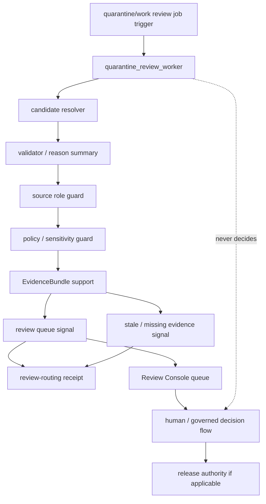

<!-- [KFM_META_BLOCK_V2]
doc_id: kfm://app/workers/src/quarantine-review-worker/readme
title: Quarantine Review Worker README
type: app-readme
version: v0.1
status: draft
owners: OWNER_TBD — Worker steward · Review steward · Quarantine steward · Evidence steward · Policy steward · Audit steward · Docs steward
created: 2026-06-16
updated: 2026-06-16
policy_label: public
related:
  - ../README.md
  - ../../README.md
  - ../../../review-console/README.md
  - ../../../review-console/src/features/README.md
  - ../../../review-console/src/features/queue/README.md
  - ../../../review-console/src/features/record_view/README.md
  - ../../../governed-api/README.md
  - ../../../../docs/architecture/ui/REVIEW_CONSOLE.md
  - ../../../../pipelines/README.md
  - ../../../../pipeline_specs/README.md
  - ../../../../packages/README.md
  - ../../../../policy/README.md
  - ../../../../schemas/contracts/v1/
  - ../../../../contracts/
  - ../../../../data/README.md
  - ../../../../data/receipts/
  - ../../../../data/proofs/
  - ../../../../release/README.md
tags: [kfm, apps, workers, quarantine-review-worker, quarantine, work, review-queue, review-routing, evidencebundle, policydecision, receipts, watcher-non-publisher]
notes:
  - "Replaces the greenfield quarantine_review_worker stub with a bounded worker-source contract."
  - "This worker may support quarantine/work review routing, queue candidate enrichment, stale-state signals, and receipt emission, but it must not approve/reject items, mutate lifecycle state locally, publish, or bypass Review Console/governed API decision paths."
  - "Worker source files, job definitions, queue contracts, schemas, fixtures, tests, review outputs, receipt outputs, deployment state, logs, dashboards, and CI pass state remain NEEDS VERIFICATION."
[/KFM_META_BLOCK_V2] -->

<a id="top"></a>

<div align="center">

# Quarantine Review Worker

`apps/workers/src/quarantine_review_worker/`

**App-local worker-source boundary for quarantine/work review support jobs: candidate readiness checks, review queue routing signals, validator-policy-evidence summaries, stale-state detection, reason-code normalization, receipt capture, and non-publishing worker enforcement.**


[Purpose](#1-purpose) · [Repo fit](#2-repo-fit) · [Boundary](#3-authority-boundary) · [Inputs](#5-inputs) · [Exclusions](#6-exclusions) · [Worker map](#7-quarantine-review-worker-map) · [Definition of done](#14-definition-of-done)

</div>

---

> [!IMPORTANT]
> **Status:** draft / `NEEDS VERIFICATION`  
> **Owners:** `OWNER_TBD` — Worker steward · Review steward · Quarantine steward · Evidence steward · Policy steward · Audit steward · Docs steward  
> **Path:** `apps/workers/src/quarantine_review_worker/README.md`  
> **Responsibility root:** `apps/` — deployable application surfaces  
> **Truth posture:** CONFIRMED README path / CONFIRMED Workers source boundary / CONFIRMED Review Console feature boundary / PROPOSED quarantine-review-worker contract / UNKNOWN source files, queue contracts, schemas, tests, fixtures, runtime behavior, deployment state, and CI pass state

> [!CAUTION]
> The Quarantine Review Worker is not a reviewer and not release authority. It may emit review-routing candidates, reason summaries, stale-state signals, and receipts, but it must not approve, reject, promote, publish, alter lifecycle state locally, or convert quarantine/work material into public truth.

---

## 1. Purpose

`apps/workers/src/quarantine_review_worker/` is the proposed app-local worker-source home for quarantine/work review support jobs.

It may eventually contain modules for:

- quarantine/work candidate job intake from approved schedules, queues, or operator-triggered dry runs;
- idempotency and retry handling for review-routing jobs;
- candidate reference validation and lifecycle-phase checks;
- validator summary, reason-code, policy label, and source-role normalization;
- EvidenceRef/EvidenceBundle support checks for claim-bearing queue summaries;
- sensitivity, rights, redaction, and restriction posture checks;
- review queue routing signal generation;
- stale-state, missing-evidence, malformed-candidate, and restriction signals;
- review-precheck and queue-routing receipt emission;
- safe failure states with no claim or protected detail leakage.

This README does not prove that any quarantine review worker source file, queue contract, schema, fixture, test, receipt writer, review queue integration, deployment, log, dashboard, or CI pass state exists.

[Back to top](#top)

---

## 2. Repo fit

| Concern | Owning root | Expected relationship |
|---|---|---|
| Quarantine Review worker source | `apps/workers/src/quarantine_review_worker/` | App-local worker source, if implemented |
| Workers source | `apps/workers/src/` | Worker source boundary and non-publisher enforcement |
| Workers app | `apps/workers/` | Background deployable boundary |
| Review Console | `apps/review-console/` | Human review queue and decision surface |
| Review Console features | `apps/review-console/src/features/` | Role-gated queue/detail/decision/audit feature modules |
| Governed API | `apps/governed-api/` | Trust membrane and governed public API path |
| Pipelines | `pipelines/`, `pipeline_specs/` | Pipeline logic and declarative pipeline definitions |
| Shared packages | `packages/` | Reusable implementation libraries after extraction/review |
| Policy | `policy/` | Admissibility, sensitivity, rights, review, and release policy |
| Lifecycle artifacts | `data/` | RAW/WORK/QUARANTINE/PROCESSED/catalog/triplet/published states, receipts, proofs |
| Receipts and proofs | `data/receipts/`, `data/proofs/` | Receipt/proof support for material outputs |
| Release authority | `release/` | Publication, correction, rollback authority |
| Schemas/contracts | `schemas/contracts/v1/`, `contracts/` | Machine shape and object meaning |

## 3. Authority boundary

This worker may support review queue preparation and routing signals for WORK/QUARANTINE candidates. It does not own review decisions, reviewer authorization, Review Console behavior, lifecycle state transitions, source authority, EvidenceBundle truth, policy decisions, schemas, contracts, release decisions, publication, correction approval, rollback approval, source ingestion, pipeline authority, public API behavior, public UI behavior, canonical store mutation outside approved flows, or runtime/model authority.

```text
apps/workers/src/quarantine_review_worker/ = app-local quarantine review worker source
apps/workers/src/                          = worker source boundary
apps/workers/                              = background worker deployable
apps/review-console/                       = human review and decision surface
apps/review-console/src/features/          = role-gated review features
apps/governed-api/                         = governed public trust membrane
pipelines/                                 = executable pipeline logic
pipeline_specs/                            = declarative pipeline definitions
packages/                                  = reusable libraries
policy/                                    = admissibility and decision policy
data/                                      = lifecycle artifacts, receipts, proofs, registries
release/                                   = publication, correction, rollback authority
```

## 4. Default posture

The Quarantine Review Worker should fail closed. A job should not emit review-routing candidates, queue signals, reason summaries, stale-state outputs, receipts, or downstream impact outputs when any of these are unresolved:

- job trigger authenticity, queue ownership, idempotency key, and worker identity;
- candidate schema, lifecycle phase, and review eligibility;
- source identity, source role, provenance, rights, cadence, and integrity hash;
- validator report, reason code, quality flags, and limitations;
- PolicyDecision, sensitivity, redaction/generalization, rights, and access posture;
- EvidenceRef and EvidenceBundle support for any claim-bearing summary;
- quarantine reason, restriction reason, missing-evidence reason, and next-steward lane;
- review state, correction state, rollback state, release state, and stale-state impacts;
- output lifecycle home, receipt home, review queue signal target, and owning steward;
- retry, resume, safe-disable, and rollback behavior;
- safe error behavior and no raw/internal detail leakage.

## 5. Inputs

| Input family | Examples | Required posture |
|---|---|---|
| Job trigger | schedule, queue message, operator dry run, new quarantine signal | Audited and idempotent |
| Job context | job id, run id, idempotency key, retry count, worker identity | Durable and traceable |
| Candidate context | candidate id, lifecycle phase, validator status, quarantine reason | Governed projection only |
| Source context | SourceDescriptor, source role, rights, provenance, integrity hash | Preserved and validated |
| Policy context | PolicyDecision, sensitivity label, restriction reason, allowed lanes | Policy-runtime derived |
| Evidence context | EvidenceRef, EvidenceBundle refs, proof context, limitations | Resolver-backed where material |
| Queue output | review queue signal, reviewer lane hint, reason summary, stale-state signal | Candidate only, not a decision |
| Receipt output | review-routing receipt, job receipt, failure receipt | Durable and auditable |

## 6. Exclusions

| Does not belong here | Correct home |
|---|---|
| Review decisions, approvals, rejects, defers, or reviewer rationale | `apps/review-console/` decision flow |
| Review Console feature implementation | `apps/review-console/src/features/` |
| Lifecycle state mutation or promotion | Governed pipeline/release flows, not worker-local edits |
| Source-specific connector implementation | `connectors/` |
| Reusable review/pipeline logic | `pipelines/` or `packages/` |
| Declarative pipeline definitions | `pipeline_specs/` |
| Schemas and contracts | `schemas/contracts/v1/`, `contracts/` |
| Policy rules and access decisions | `policy/` |
| Lifecycle data and canonical stores | `data/` |
| Receipts and proofs | `data/receipts/`, `data/proofs/` |
| Release manifests, correction notices, rollback cards | `release/` |
| Public or semi-public API surface | `apps/governed-api/` |
| Public UI or map rendering | `apps/explorer-web/` |
| Direct model/runtime public access | `runtime/` behind governed API only |
| Deployment-only values | Deployment environment/config channels |

## 7. Quarantine review worker map

Exact implementation files remain `NEEDS VERIFICATION`.

| Candidate module | Purpose | Required safeguard | Status |
|---|---|---|---|
| `job_contract` | Queue message and job envelope handling | Closed schema and idempotency | PROPOSED |
| `candidate_resolver` | Resolve candidate refs and lifecycle phase | No raw-store shortcut | PROPOSED |
| `validator_summary` | Normalize validator reports and reason codes | No raw validator internals | PROPOSED |
| `source_role_guard` | Preserve source role and authority limits | No authority upcast | PROPOSED |
| `policy_guard` | Policy/sensitivity/access precheck | Fail closed on unresolved state | PROPOSED |
| `evidence_guard` | EvidenceBundle support check | No unsupported review summary | PROPOSED |
| `queue_signal` | Review queue routing signal generation | Candidate only, no decision | PROPOSED |
| `stale_signal` | Stale-state and missing-evidence signal emission | Receipt-backed and bounded | PROPOSED |
| `receipt_writer` | Review-routing/job receipt emission | Durable data-root output | PROPOSED |
| `safe_errors` | Failure, retry, and safe log shaping | No internal detail leakage | PROPOSED |

> [!WARNING]
> Candidate module names are not implementation proof. Do not claim a quarantine review worker module is live until files, queues, schemas, fixtures, tests, policy gates, evidence checks, review queue signals, receipts, and deployment evidence confirm it.

## 8. Diagram



## 9. Worker obligations

| Obligation | Example effect |
|---|---|
| `watcher_non_publisher` | Worker emits review signals and receipts, not final decisions or releases |
| `candidate_only` | Queue signals remain candidates until governed human/review decision |
| `no_local_lifecycle_mutation` | Worker does not approve, reject, promote, or move candidate state locally |
| `source_role_preserved` | Source role is carried forward and not upcast by worker convenience |
| `policy_required` | Policy, sensitivity, rights, and access gates run before material output |
| `evidence_required` | Claim-bearing queue summaries carry EvidenceRef/EvidenceBundle support |
| `reason_code_required` | Routing signals use bounded reason codes and limitations |
| `receipt_required` | Material routing/stale/error outputs emit durable receipts |
| `idempotent_jobs` | Re-running a job should not duplicate authoritative outputs |
| `safe_error_only` | Failures reveal no protected data, raw payloads, internal paths, or validator internals |

## 10. Job contract

Each durable quarantine review worker module or child README should state:

- job purpose and owner;
- authorized producer and trigger type;
- queue message shape and idempotency key;
- accepted candidate refs and lifecycle phase;
- denied inputs and correct homes;
- schema, contract, validator, and receipt dependencies;
- policy, sensitivity, rights, and access dependencies;
- EvidenceBundle dependency where material;
- queue signal refs and receipt types emitted;
- reason-code vocabulary and reviewer-lane mapping;
- safe-disable, retry, and rollback path;
- tests and fixtures required;
- open verification items.

## 11. Inspection path

Quarantine review worker source files, queue contracts, schemas, tests, fixtures, policy integration, evidence resolver integration, review queue signal generation, receipt outputs, deployment state, logs, dashboards, and emitted artifacts remain `NEEDS VERIFICATION`.

```bash
find apps/workers/src/quarantine_review_worker -maxdepth 7 -type f | sort
find apps/workers apps/review-console apps/governed-api pipelines pipeline_specs packages policy schemas contracts data release tests fixtures -maxdepth 7 -type f 2>/dev/null | grep -Ei 'quarantine|work|review|queue|ReviewDecision|ReviewRecord|PolicyDecision|EvidenceRef|EvidenceBundle|ValidationReport|SourceDescriptor|receipt|candidate|stale|reason|worker|job|test|fixture' | sort
```

## 12. Validation expectations

Useful validation for this worker should cover:

- unauthorized producers cannot enqueue quarantine review jobs;
- malformed job/input envelopes fail closed;
- missing candidate refs, lifecycle phase, validator summary, source role, policy, evidence, or queue target blocks material output;
- review queue signals are candidates only and do not approve/reject/defer/promote items;
- worker does not write review decisions, mutate lifecycle state, publish, or rewrite canonical/source records;
- source role, rights, policy label, EvidenceRef/EvidenceBundle refs, reason codes, stale-state, and limitations are preserved where material;
- material routing/stale/error outputs emit receipts with job id, input refs, output refs, reason codes, and limitations;
- retry/idempotency prevents duplicate authoritative outputs;
- safe errors reveal no raw payloads, protected detail, internal paths, validator internals, or deployment-only values.

## 13. Safe change pattern

For Quarantine Review Worker changes:

1. Add or update quarantine review worker inventory and job contract.
2. Link job, candidate, validator summary, queue signal, receipt, and policy DTOs to schemas/contracts before changing shapes.
3. Add fixtures for valid queue signal, missing candidate, invalid lifecycle state, missing validator report, weak source role, missing evidence, missing policy, sensitivity hold, restricted item, stale candidate, duplicate idempotency key, retry, and safe error cases.
4. Add no-review-decision, no-lifecycle-mutation, no-publish, source-role-preservation, candidate-only, evidence-support, policy-support, reason-code, receipt-required, idempotency, and safe-error tests before enabling jobs.
5. Preserve EvidenceRef/EvidenceBundle refs, PolicyDecision refs, source role, lifecycle state, validator status, receipt refs, review refs, release/correction/rollback refs, job ids, reason codes, timestamps, hashes, and limitations through every material output.
6. Update this README, parent Workers README, Workers source README, Review Console docs, pipeline docs, governed API docs, policy docs, schemas/contracts, and tests when behavior materially changes.

## 14. Definition of done

- [ ] Owners are confirmed and `OWNER_TBD` is replaced.
- [ ] Quarantine review worker module inventory and ownership are documented.
- [ ] Job/candidate/queue-signal/receipt DTOs and schemas are verified.
- [ ] Authorized producer, queue, idempotency key, retry, and safe-disable behavior are documented and tested.
- [ ] Candidate resolving, lifecycle phase checks, source-role preservation, policy runtime, evidence resolver, validator-summary handling, reason-code handling, and receipt writer are documented and tested.
- [ ] Worker cannot approve/reject/defer/promote, publish, mutate lifecycle state, rewrite canonical records, or upcast source authority.
- [ ] Review queue signals remain candidate-only until governed Review Console decision paths.
- [ ] Sensitive-domain, weak-source, missing-evidence, missing-policy, and safe-error tests are present and passing.
- [ ] Deployment, logs, dashboards, and runbooks are documented with current evidence.

## 15. Open verification items

| Item | Why it matters |
|---|---|
| Confirm source files beyond README | Prevents overclaiming implementation maturity |
| Confirm quarantine review job/queue contract | Required before worker behavior claims |
| Confirm candidate lifecycle schema and queue-signal schema | Required before shape claims |
| Confirm Review Console queue handoff | Required before review routing claims |
| Confirm policy and evidence integration | Required before governed-output claims |
| Confirm source-role and validator-summary handling | Required before candidate-readiness claims |
| Confirm reason-code vocabulary and lane mapping | Required before queue routing claims |
| Confirm receipt outputs and target paths | Required before auditability claims |
| Confirm no-review-decision and no-lifecycle-mutation behavior | Required before trust claims |
| Confirm tests, fixtures, deployment, logs, and dashboards | Required before operational maturity claims |

<details>
<summary>Appendix A — no-loss preservation note</summary>

The previous README was a greenfield stub. This replacement adds a bounded Quarantine Review Worker contract without claiming source files, queues, schemas, tests, fixtures, policy enforcement, EvidenceBundle checks, review queue integration, receipt emission, deployment, logs, dashboards, or CI pass state are implemented.

</details>

## Status summary

`apps/workers/src/quarantine_review_worker/` should contain quarantine/work review-routing worker source only after job inventory, queue contract, schema validation, candidate lifecycle checks, source-role preservation, policy runtime integration, evidence resolver integration, validator-summary handling, queue handoff, receipt emission, tests, and operational evidence are verified.

It must preserve the quarantine review boundary: this worker may emit review queue candidates, stale-state signals, reason summaries, and receipts, but it must not approve/reject/defer/promote, mutate lifecycle state, publish artifacts, rewrite canonical records, upcast source authority, expose protected material, or substitute automation for governed human review decisions.

<p align="right"><a href="#top">Back to top</a></p>
