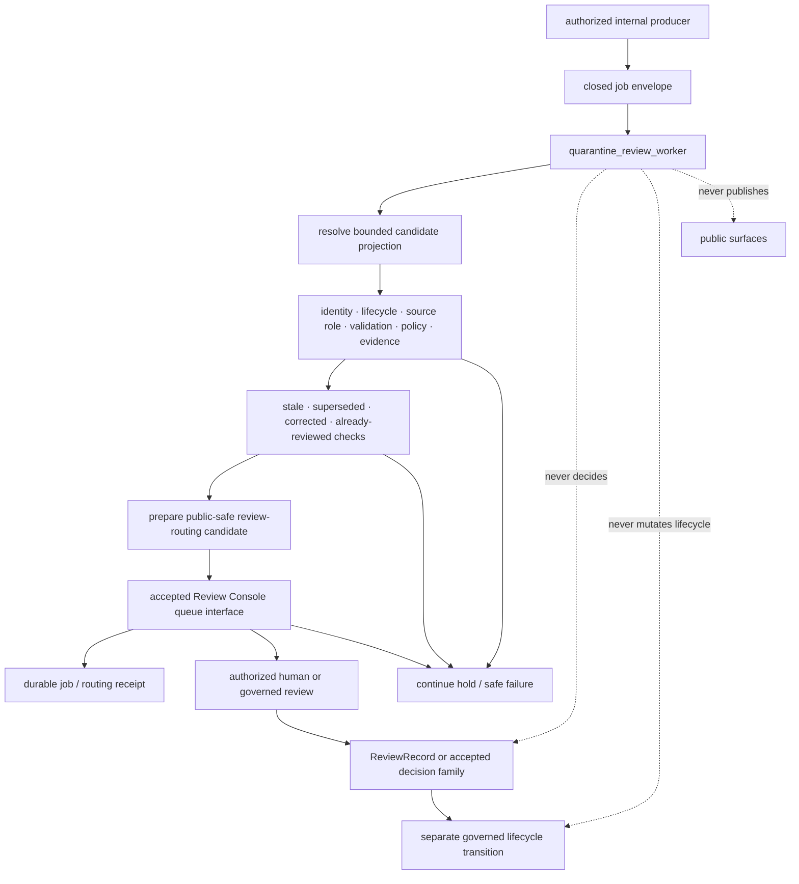

<!-- [KFM_META_BLOCK_V2]
doc_id: kfm://app/workers/src/quarantine-review-worker/readme
title: Quarantine Review Worker README
type: app-readme
subtype: worker-lane-readme
version: v0.2
prior_version: v0.1
status: draft; repository-grounded; placeholder-only
owner: "NEEDS VERIFICATION — CODEOWNERS routes default repository review to @bartytime4life; no accepted Quarantine Review Worker steward, independent quarantine reviewer, runtime operator, policy authority, or release authority was verified"
created: 2026-06-16
updated: 2026-08-12
policy_label: public
current_path: apps/workers/src/quarantine_review_worker/README.md
scope_id: apps/workers/src/quarantine_review_worker/
owning_root: apps/
inherited_parent: apps/workers/src/README.md
responsibility: "Orient contributors to the inert Quarantine Review Worker lane, its candidate-only review-routing boundary, surrounding quarantine and review surfaces, implementation admission requirements, validation, maintenance, correction, and rollback."
truth_posture: cite-or-abstain
truth_labels: [CONFIRMED, PROPOSED, UNKNOWN, NEEDS VERIFICATION, CONFLICTED]
authority_class: inherited app-local worker lane
authority_rank: "Implementation orientation subordinate to adopted doctrine, accepted ADRs, semantic contracts, schemas, policy, evidence, lifecycle records, review records, release decisions, receipts, and operational authorization."
canonical_relationship: "Same-path update; no new authority, generated projection, compatibility path, queue, review decision, lifecycle transition, runtime binding, or publication capability created."
evidence_repository: bartytime4life/Kansas-Frontier-Matrix
evidence_base_ref: main
evidence_base_commit: 959017b442179bea2e98483ef4c9c55c7c44ddc0
evidence_repository_tree: 82b1687d754ebde10ee9c6f036e6a179c2e7a110
evidence_apps_tree: b42508d948e33456c21f720ff9d60a2ca07228a3
evidence_workers_tree: c31de1160f1e21332fbc4916b6c0013915a22a01
evidence_source_tree: ab3dfd47f06fb015d8adcb404505099ec0ab645d
evidence_lane_tree: 1c8978e7e88a275eec29ff923e14b861e0b5b435
evidence_target_prior_blob: 5c5a90cc0c471bd17a18678b5c73b35e10049a4a
evidence_entrypoint_blob: eaef2862a7c1038590e5afba8224b52de54c5c96
evidence_parent_source_blob: 08ad9f8116f64817ffa4f8b2058613749360c102
evidence_workers_readme_blob: 5b5c1e6b067e652a380bf445488a6227028dfc0e
evidence_review_console_readme_blob: 02512b6b8d16a8f1dfcd4c564f8b6d68b61b49e3
evidence_review_console_package_blob: 9c83b3dee793e2428a33c4aae072e668f1c2a4f8
evidence_review_queue_readme_blob: 6923b702cf97816cee15a5ded38e6e3a8c20fce8
evidence_quarantine_root_blob: 9b375d795d96b15c06e51ef54770a023cd14454c
evidence_lifecycle_law_blob: 4eb1f0a38a31130bb9928867450709724bd4cacb
evidence_adr_0021_blob: bcd98911a420a5cf00fd3571a8fe18e15e2efe70
evidence_adr_0021_status: proposed
evidence_review_record_contract_blob: 9641345d1e5d939dc59687a900e60a563d92c4f0
evidence_governance_review_schema_blob: fe2f2223af46481e7fb19b0baa94f62ce9c6c855
evidence_review_family_schema_blob: a053448d68e8379b92b12a16e6528275b975433c
evidence_review_validator_blob: a26f10fa18edaf7b2d2e3bf499e233c05f3007cd
evidence_directory_rules_blob: fd49a0b83e55cef52c1124281f093e263526898d
evidence_directory_rules_adoption: ADR-0029; accepted
evidence_codeowners_blob: dd2a84aa514d8ecd9208bc347f90f9a2ed37dd61
evidence_direct_files: 2
evidence_executable_python_lines: 0
evidence_repository_runtime_bindings: 0
related:
  - ../README.md
  - ../../README.md
  - ../../../review-console/README.md
  - ../../../review-console/src/README.md
  - ../../../review-console/src/features/README.md
  - ../../../review-console/src/features/queue/README.md
  - ../../../review-console/src/features/record_view/README.md
  - ../../../review-console/src/features/sensitivity_review/README.md
  - ../../../governed-api/README.md
  - ../../../../docs/doctrine/directory-rules.md
  - ../../../../docs/adr/ADR-0029-adopt-directory-governance-standard-v2.md
  - ../../../../docs/doctrine/lifecycle-law.md
  - ../../../../docs/adr/ADR-0021-quarantine-has-structured-exit-paths.md
  - ../../../../docs/runbooks/QUARANTINE_HANDLING.md
  - ../../../../docs/architecture/ui/REVIEW_CONSOLE.md
  - ../../../../data/quarantine/README.md
  - ../../../../data/receipts/README.md
  - ../../../../contracts/governance/ReviewRecord.md
  - ../../../../schemas/contracts/v1/governance/review_record.schema.json
  - ../../../../schemas/contracts/v1/review/review_record.schema.json
  - ../../../../tools/validators/validate_review_record.py
  - ../../../../fixtures/contracts/v1/governance/review_record/README.md
  - ../../../../policy/README.md
tags: [kfm, apps, workers, quarantine-review-worker, placeholder, quarantine, review-routing, candidate-only, fail-closed, non-publisher, separation-of-duties]
notes:
  - "v0.2 replaces generalized implementation uncertainty with exact repository evidence: this lane contains one README and one 65-byte, comment-only Python placeholder with zero executable lines."
  - "Quarantine doctrine, a canonical data/quarantine lane, a proposed structured-exit ADR, Review Console feature READMEs, ReviewRecord contract/schema/fixture surfaces, and a fixture-only promotion review validator exist elsewhere; no import, trigger, queue, schedule, package, deployment, or runtime binding connects them to this lane."
  - "Quarantine exit grammar and ReviewRecord authority are not closed: ADR-0021 remains proposed, ReviewRecord has competing schema-family paths, and the existing validator is scoped to synthetic promotion Gate G fixtures rather than this worker."
  - "This documentation-only update does not inspect a live quarantine payload, route an actual candidate, record a review, transition lifecycle state, admit a source, approve policy, release an artifact, or publish anything."
[/KFM_META_BLOCK_V2] -->

<a id="top"></a>

<div align="center">

# Quarantine Review Worker

`apps/workers/src/quarantine_review_worker/`

**Repository-grounded boundary for a possible asynchronous quarantine-review preparation wrapper. The current lane is inert: its only Python file is a one-line greenfield-placeholder comment, and no repository binding makes it a job, queue consumer, review router, lifecycle mutator, receipt writer, or deployable process.**

[](#2-repo-fit)
[](#3-authority-boundary)
[](#4-default-posture)
[](#9-worker-obligations)
[](#6-exclusions)
[](../../../../docs/adr/ADR-0029-adopt-directory-governance-standard-v2.md)
[](#11-inspection-and-evidence)

**Quick navigation:** [Purpose](#1-purpose) · [Repo fit](#2-repo-fit) · [Authority](#3-authority-boundary) · [Posture](#4-default-posture) · [Inputs and outputs](#5-inputs-and-outputs) · [Exclusions](#6-exclusions) · [Lane map](#7-current-lane-map) · [Required flow](#8-required-quarantine-review-flow) · [Obligations](#9-worker-obligations) · [Admission contract](#10-job-admission-contract) · [Evidence](#11-inspection-and-evidence) · [Validation](#12-validation-expectations) · [Change pattern](#13-safe-change-pattern) · [Done](#14-definition-of-done) · [Gaps](#15-open-verification-items) · [Maintenance](#16-maintenance-and-review-triggers) · [Rollback](#17-correction-and-rollback)

</div>

> [!IMPORTANT]
> **Current state: `CONFIRMED / PLACEHOLDER-ONLY`.** At `main@959017b442179bea2e98483ef4c9c55c7c44ddc0`, this lane contains exactly two tracked files: this README and a 65-byte [`main.py`](./main.py). The Python file contains only `# quarantine_review_worker entrypoint — greenfield placeholder`, for zero imports, definitions, executable statements, or side effects.

Repository-wide name and path inspection found no import, trigger, queue, schedule, package, configuration, worker-local test, deployment, or output binding for `quarantine_review_worker`. This is bounded repository evidence, not proof about untracked experiments or external systems.

> [!CAUTION]
> A Quarantine Review Worker must never become a reviewer, lifecycle authority, policy authority, evidence authority, release authority, or publisher. It may eventually prepare a bounded review candidate through accepted interfaces, but it must not read protected stores by path, expose quarantined content to a public surface, approve or reject an item, select a quarantine exit, mutate lifecycle state, or treat a successful job, validator result, queue row, receipt, pull request, or dashboard as review completion.

> [!NOTE]
> The repository contains meaningful quarantine and review documentation plus selected contract, schema, fixture, and validator surfaces. Their existence is `CONFIRMED`; their composition into this worker is `CONFIRMED ABSENT` at the pinned base. Nearby capability is not worker wiring, and documentation is not runtime evidence.

---

## 1. Purpose

`apps/workers/src/quarantine_review_worker/` inherits the app-local source boundary from [`apps/workers/src/`](../README.md) and the background deployable boundary from [`apps/workers/`](../../README.md).

If an asynchronous quarantine-review preparation model is later accepted, this directory may own only a thin worker wrapper: authenticated job intake, app-local dependency composition, process lifecycle, bounded error translation, read-only candidate projection resolution, safe summary construction, candidate routing, and delegation to lifecycle, review, policy, evidence, receipt, and queue interfaces owned elsewhere.

The current lane implements none of those responsibilities. It has no package manifest, import graph, queue consumer, schedule, command-line entry point, message parser, lifecycle client, review client, policy client, evidence client, validator client, queue writer, receipt writer, configuration reader, network access, deployment binding, health check, or emitted artifact.

This README therefore exists to:

1. record the exact placeholder state without upgrading intent into implementation;
2. preserve quarantine as a fail-closed hold rather than a publishable staging lane;
3. separate candidate preparation from human or governed review decisions;
4. distinguish surrounding repository capability from actual worker composition;
5. expose current exit-grammar and ReviewRecord authority conflicts rather than selecting a path by filename similarity; and
6. define the evidence, least privilege, validation, separation of duties, correction, and rollback needed before this lane can claim executable maturity.

### Audience

This document is for worker implementers, data-lifecycle maintainers, quarantine and review stewards, contract and schema maintainers, policy and evidence reviewers, security reviewers, Review Console developers, operators, and pull-request reviewers deciding whether a proposed change belongs in this lane and whether the lane remains a scaffold.

### Non-goals

This document does not:

- define or select a canonical quarantine job, queue message, queue row, case record, review record, or receipt schema;
- accept [ADR-0021](../../../../docs/adr/ADR-0021-quarantine-has-structured-exit-paths.md) or make its five proposed exits executable;
- authorize direct reads from `data/quarantine/` or any other internal lifecycle store;
- activate a queue, trigger, schedule, source, policy bundle, review route, or deployment;
- decide whether a quarantined item should remain held, return to WORK, advance, be restricted, be denied, be corrected, or be withdrawn;
- create a `ReviewRecord`, `PolicyDecision`, `EvidenceBundle`, lifecycle transition, promotion decision, correction notice, rollback card, or release record;
- resolve the competing ReviewRecord schema-family paths or the contract-path case mismatch;
- grant write access to Review Console, lifecycle, policy, evidence, release, or public-delivery systems;
- claim that fixture validation proves an operational review flow; or
- release, deploy, promote, publish, activate sources, or change repository settings.

[Back to top](#top)

---

## 2. Repo fit

Accepted Directory Rules places deployable processes and process-local composition under `apps/` while semantic meaning remains in `contracts/`, machine shape in `schemas/`, admissibility in `policy/`, lifecycle and accountability instances in `data/`, reusable behavior in `packages/` or `pipelines/`, declarative execution in `pipeline_specs/`, and review/release decisions in their governing surfaces.

### Current lane evidence

| Claim | Truth | Repository evidence | Limitation |
|---|---|---|---|
| The lane exists under the deployable `apps/` responsibility root. | CONFIRMED | Accepted ADR-0029, parent Workers READMEs, and current tree | Placement does not grant runtime capability. |
| The lane contains exactly two direct files and no child directory. | CONFIRMED | Lane tree `1c8978e7e88a275eec29ff923e14b861e0b5b435` | Directory shape does not prove runtime behavior. |
| `main.py` is a 65-byte, one-line placeholder comment. | CONFIRMED | Blob `eaef2862a7c1038590e5afba8224b52de54c5c96` | A filename and intent comment are not an entry point. |
| The lane contains zero non-comment executable Python lines. | CONFIRMED | Exact content inspection | Future branches and external deployments are outside this snapshot. |
| Repository code imports, invokes, registers, queues, schedules, configures, tests, packages, or deploys `quarantine_review_worker`. | CONFIRMED absent from bounded inspection | Complete lane inventory plus repository name/path search | External systems not represented in Git remain `UNKNOWN`. |
| The lane is active, healthy, or routing review candidates. | UNKNOWN | No runtime, deployment, queue, log, metric, or emitted receipt is bound to this revision | Never infer operations from documentation, a commit, a pull request, or green CI. |
| This README changes quarantine or review behavior. | CONFIRMED false | Same-path Markdown-only change | `main.py` and every runtime surface remain unchanged. |

### Confirmed surrounding surfaces

| Surface | Current repository evidence | Relationship to this lane |
|---|---|---|
| Canonical quarantine lane | [`data/quarantine/README.md`](../../../../data/quarantine/README.md) defines a fail-closed hold and prohibits silent promotion or direct public use | Lifecycle authority context; not a worker data API |
| Lifecycle doctrine | [`lifecycle-law.md`](../../../../docs/doctrine/lifecycle-law.md) preserves `(Pre-RAW) → RAW → WORK / QUARANTINE → PROCESSED → CATALOG / TRIPLET → PUBLISHED` | Governing stage semantics; no queue or worker wiring |
| Quarantine runbook | [`QUARANTINE_HANDLING.md`](../../../../docs/runbooks/QUARANTINE_HANDLING.md) describes draft operational handling and proposed reason-code/case-record concepts | Human/runbook guidance; implementation references remain proposed |
| Structured exits | [ADR-0021](../../../../docs/adr/ADR-0021-quarantine-has-structured-exit-paths.md) proposes five governed exits | Proposed decision only; no accepted exit grammar or executable binding |
| Review Console root | [`apps/review-console/`](../../../review-console/README.md) has a README, a minimal `package.json`, and a documentation-only source tree | Adjacent app scaffold; not an operational review service |
| Review queue feature | [`features/queue/README.md`](../../../review-console/src/features/queue/README.md) is the only tracked file in the queue feature directory | Proposed role-gated projection boundary; no queue implementation |
| Record and sensitivity features | [`record_view`](../../../review-console/src/features/record_view/README.md) and [`sensitivity_review`](../../../review-console/src/features/sensitivity_review/README.md) each have boundary documentation | Proposed feature contracts; no worker binding |
| Review architecture | [`REVIEW_CONSOLE.md`](../../../../docs/architecture/ui/REVIEW_CONSOLE.md) describes a proposed human-in-the-loop architecture | Conceptual architecture; component, route, and data-shape claims remain proposed |
| Review semantic contract | [`contracts/governance/ReviewRecord.md`](../../../../contracts/governance/ReviewRecord.md) defines draft ReviewRecord meaning | Semantic proposal; not a decision instance or accepted worker input |
| Governance review schema | [`schemas/contracts/v1/governance/review_record.schema.json`](../../../../schemas/contracts/v1/governance/review_record.schema.json) is a closed proposed shape | One candidate machine shape; exact authority and compatibility remain unresolved |
| Review-family schema | [`schemas/contracts/v1/review/review_record.schema.json`](../../../../schemas/contracts/v1/review/review_record.schema.json) is an empty permissive scaffold | Competing path; must not be silently selected |
| Review validator and fixtures | [`validate_review_record.py`](../../../../tools/validators/validate_review_record.py) plus governance review fixtures exist | Explicitly fixture-only promotion Gate G profile; not a general quarantine review validator |
| Receipt lane | [`data/receipts/README.md`](../../../../data/receipts/README.md) owns governed process memory | Receipt instances belong there through an accepted writer, not as worker-local files |

### Authority and compatibility gaps

A future worker must not infer a complete quarantine-review platform from nearby files:

| Gap | Current evidence | Required posture |
|---|---|---|
| Worker job contract | No accepted queue/event/job schema or authorized producer is bound to this lane | `NEEDS VERIFICATION`; define and review before code |
| Quarantine case shape | Runbook proposes `QuarantineRecord`; ADR-0021 proposes `quarantine_case_record`; no closed accepted binding was verified | `CONFLICTED / NEEDS VERIFICATION`; do not invent an adapter |
| Exit grammar | Current quarantine README, runbook, and proposed ADR-0021 describe related but not identical dispositions | Preserve the hold; worker must not choose an exit |
| ReviewRecord home | ReviewRecord appears under both `schemas/contracts/v1/governance/` and `schemas/contracts/v1/review/` | `CONFLICTED`; resolve through accepted authority, compatibility note, or migration |
| Contract path casing | Governance schema metadata names lowercase `contracts/governance/review_record.md`, while the tracked contract is `ReviewRecord.md` | `NEEDS VERIFICATION`; case-sensitive environments can fail |
| Review validator scope | Existing validator is fixture-only and promotion-Gate-G-specific | Do not represent it as a general worker or quarantine validator |
| Queue projection contract | Review Console queue directory contains only a README | No runtime route, DTO, authorization, count-redaction, or handoff behavior is proven |
| Policy composition | General policy roots exist, but no accepted quarantine-review policy bundle is bound here | Fail closed; no local fallback policy |
| Worker receipt family | No accepted quarantine-review job, routing, hold, or failure receipt interface is bound here | Do not create ad hoc receipt files |
| Runtime authorization | No service identity, capability matrix, queue ACL, secret, or deployment binding exists | Deny material execution until admitted |
| Public exposure | No public-safe quarantine projection is authorized | No direct public route; no hidden-count or reason-detail leakage |

### Responsibility split

| Concern | Canonical owner | This lane's allowed relationship |
|---|---|---|
| Deployable process composition | `apps/workers/` | Thin wrapper only after admission |
| Human review and decision UX | `apps/review-console/` | Submit bounded candidates through accepted interfaces; never decide locally |
| Public trust membrane | `apps/governed-api/` | No direct public route from this worker |
| Reusable review or lifecycle behavior | `packages/` or `pipelines/` | Call reviewed public interfaces; do not duplicate logic |
| Declarative run graph, schedule, and resources | `pipeline_specs/` | Consume an accepted specification; do not define authority locally |
| Semantic meaning | `contracts/` | Bind exact accepted contract IDs, paths, and versions |
| Machine shape | `schemas/` | Validate exact accepted schema IDs and versions |
| Admissibility and obligations | `policy/` | Apply returned decisions; never author or weaken policy |
| Lifecycle instances | `data/` | Use capability-scoped interfaces; never infer access from a path |
| Evidence and proofs | Governed evidence/proof lanes | Resolve references through owned interfaces; never upcast unsupported claims |
| Review records and authority bindings | Accepted governance/review families | Consume or submit through accepted contracts; never mint authority |
| Receipts | `data/receipts/` | Emit only through an accepted idempotent writer |
| Release, correction, withdrawal, and rollback | `release/` | Read bounded context when authorized; never self-authorize or execute |
| Deployment, network, identity, and secrets | `infra/` plus approved secret stores | Receive least privilege only after separate operational authorization |
| Synthetic conformance evidence | `fixtures/`, `tests/` | Prove bounded behavior; never use fixtures as live data |

### Directory Rules profile

This is a same-path `PLACE` modernization under the canonical `apps/` root. It does not create, move, rename, split, delete, generate, mirror, localize, or deprecate a path and does not change authority, lifecycle, exposure, or public state.

The lane follows the Directory Rules **Boundary Compact** profile:

| Compact element | Where covered |
|---|---|
| Purpose and inherited parent | Sections 1–2 |
| Belongs and prohibited | Sections 3 and 6 |
| Inputs and outputs | Section 5 |
| Exposure, mutation, and retention | Section 3 |
| Validation | Section 12 |
| Governing surfaces | Sections 2, 10, and 11 |
| Current status and direct-child map | Sections 2 and 7 |
| Open verification and review triggers | Sections 14–16 |

[Back to top](#top)

---

## 3. Authority boundary

This lane may become an app-local asynchronous wrapper only after a quarantine-review job model and its interfaces are accepted. It does not inherit authority from the words `quarantine`, `review`, or `worker`, from adjacent schemas and READMEs, or from placement under `apps/`.

### A future lane may own

- process startup, shutdown, graceful drain, health, and app-local dependency composition;
- authenticated consumption of an accepted internal quarantine-review-preparation job contract;
- correlation, job, run, attempt, idempotency, deadline, timeout, retry, cancellation, and safe-disable plumbing;
- read-only resolution of typed candidate, lifecycle, source, validation, evidence, policy, review-authority, and stale-state references through governed interfaces;
- bounded construction of a review-routing candidate or safe hold summary where an accepted contract permits it;
- translation of dependency outcomes into the job contract's finite terminal states;
- submission of candidate and receipt payloads through explicitly granted writer interfaces;
- safe logs and metrics for the worker process; and
- app-local tests proving delegation, candidate-only behavior, denied writes, fail-closed startup, and no publication.

### This lane must not own

- reviewer identity assignment, review authority, independence determination, or separation-of-duties policy;
- review disposition, rationale, approval, rejection, request-for-changes, abstention, denial, escalation, or defer decisions;
- quarantine entry or exit authority, lifecycle-state mutation, promotion, correction, withdrawal, or rollback;
- source authority, source-role changes, evidence truth, policy rules, contract meaning, or schema authority;
- direct reads from filesystem, database, object-store, or queue internals merely because a path is documented;
- free-form payload editing, canonical-record rewriting, history deletion, or retroactive receipt mutation;
- public queue counts, item existence, sensitive reason details, protected geometry, or restricted evidence exposure;
- public routes, browser-to-worker access, direct model calls, or public-generated summaries;
- another application's internals, reusable lifecycle logic, pipeline semantics, or infrastructure definitions;
- release, deployment, promotion, publication, repository administration, or secret management; or
- treating a validator pass, fixture match, queue insertion, review comment, receipt, check, merge, or dashboard panel as an authoritative review or lifecycle transition.

### Exposure, mutation, and retention

| Dimension | Current state | Required future posture |
|---|---|---|
| Public exposure | None implemented | No public route; authorized internal producer and consumer only |
| Read capability | None implemented | Typed, bounded projections through governed interfaces; no direct internal-store traversal |
| Write capability | None implemented | Candidate/receipt interfaces explicitly declared; no lifecycle, policy, review, or release writes |
| Mutation | None implemented | Append-only candidate and receipt submission where accepted; no payload or history mutation |
| Sensitive content | None present in this lane | References and public-safe summaries only; protected detail remains in approved restricted systems |
| Logs | None implemented | Public-safe identifiers, finite codes, timing, and counts only; no payloads, private locators, or protected reasons |
| Retention | None implemented | Contract-defined retention for job metadata and receipts; no worker-local canonical store |
| Review authority | None implemented | Verified authority remains outside the worker and is resolved before candidate handoff |
| Release authority | None implemented | Always outside this lane |
| Correction | README correction only | Runtime correction requires accepted append-only records and downstream invalidation behavior |

### Trust boundaries that must survive composition

1. **Candidate is not decision.** A prepared row, summary, or routing signal has no review authority.
2. **Review is not transition.** A `ReviewRecord` may support a transition, but lifecycle and release machinery remain separate.
3. **Receipt is not proof.** A process receipt records what the worker attempted; it does not prove the candidate is true, safe, reviewed, or released.
4. **Queue is not storage authority.** Queue visibility and ordering are projections, not canonical lifecycle state.
5. **Policy is not prose.** The worker must consume a versioned policy result, not infer permissions from documentation.
6. **Evidence remains evidence-subordinate.** Any claim-bearing summary resolves `EvidenceRef` to `EvidenceBundle` or narrows/abstains.
7. **Quarantine stays non-public.** No route, log, metric, badge, count, export, map, graph, search result, or AI answer may leak protected quarantine state.
8. **Unknown bindings fail closed.** A nearby file with a matching name is not sufficient authority to select a schema or contract.

[Back to top](#top)

---

## 4. Default posture

The Quarantine Review Worker must fail closed. It should not start, consume a job, resolve a candidate, emit a queue candidate, write a receipt, or claim success when any material dependency is unresolved.

### Startup gates

A future process should refuse material work unless it can verify:

- exact worker build identity, package version, configuration profile, and service identity;
- accepted job contract, schema identifier, version, and maximum payload size;
- authorized producer, consumer, queue or transport, and replay boundary;
- capability-scoped read and write permissions;
- exact candidate, case, review, policy, evidence, validation, and receipt bindings;
- safe logging and metric-redaction profile;
- idempotency, deduplication, lease, timeout, retry, cancellation, dead-letter, and recovery behavior;
- configuration digest and compatible dependency versions;
- network-deny or endpoint allowlist posture;
- safe-disable mechanism and operational owner; and
- health checks that do not reveal sensitive queue or candidate state.

### Per-job gates

A job should remain held or terminate safely when any of these are unresolved:

- job authenticity, producer authorization, worker identity, correlation ID, and idempotency key;
- candidate reference, version, digest, current lifecycle state, and review eligibility;
- source identity, source role, provenance, rights, cadence, and integrity;
- validator report identity, status, reason codes, scope, and limitations;
- policy decision identity, version, obligations, sensitivity, rights, access, and audience;
- `EvidenceRef` resolution and `EvidenceBundle` support for any claim-bearing summary;
- reviewer-lane or authority requirements, separation-of-duties state, and unresolved conflicts;
- stale, superseded, corrected, withdrawn, or already-reviewed state;
- queue target, output contract, receipt contract, and writer capability;
- safe error behavior and no protected-data leakage; or
- downstream availability needed for atomic or compensatable submission.

### Deny-by-default cases

Material execution should be denied or held when:

- the job requests a direct lifecycle-state change;
- the job includes raw payload bytes where only references are allowed;
- the requested output would expose a protected reason, geometry, person, source locator, or hidden item count;
- the candidate has an unknown or disputed source role;
- rights, sensitivity, sovereignty, consent, or access scope is unresolved;
- the job selects one of the unresolved ReviewRecord or quarantine-case schema paths without accepted authority;
- the job asks the worker to create or approve a `ReviewRecord`;
- the candidate version no longer matches the current governed projection;
- the item already has a terminal or superseding review state;
- the author and reviewer independence requirement cannot be resolved;
- a receipt writer is unavailable and the job contract requires durable process memory; or
- a dependency returns an unknown state that the accepted adapter cannot map safely.

### Safe logging minimum

A future implementation may log only the minimum public-safe operational context required to diagnose the process, such as:

- worker build and configuration digest;
- opaque job/run/attempt/correlation identifiers;
- public-safe object-family name and schema version;
- finite outcome and public-safe reason-code family;
- elapsed time, retry count, and dependency class;
- output reference digest after successful submission; and
- receipt reference after durable completion.

It must not log raw payloads, source contents, exact protected geometry, restricted policy reasons, private endpoints, credentials, tokens, EvidenceBundle excerpts, reviewer private data, unredacted queue rows, or internal filesystem/object-store paths.

[Back to top](#top)

---

## 5. Inputs and outputs

No runtime input or output is implemented in this lane. The tables below define the admission burden for a future design; they do not create DTOs, queues, APIs, or schemas.

### Candidate future inputs

| Input family | Minimum semantic need | Current binding |
|---|---|---|
| Job envelope | Job/run/attempt/correlation identity, idempotency, producer, deadline, requested operation | None |
| Candidate reference | Stable candidate ID, version/digest, lifecycle state, domain/scope, current disposition | None |
| Quarantine context | Case/record reference, hold reasons, defect class, prior transitions, remediation status | CONFLICTED / no accepted closed shape verified |
| Source context | `SourceDescriptor` reference, source role, provenance, rights, cadence, integrity | No worker binding |
| Validation context | Versioned validation-report reference, status, bounded reasons, scope, limitations | No worker binding |
| Policy context | Versioned `PolicyDecision`, obligations, sensitivity, access, rights, allowed audience | No worker binding |
| Evidence context | `EvidenceRef` values and resolvable `EvidenceBundle` support | No worker binding |
| Review requirement | Required reviewer role/lane, authority basis, independence needs, expiry | Competing/proposed review surfaces |
| Stale/correction context | Supersession, correction, withdrawal, stale-state, already-reviewed markers | No worker binding |
| Output capability | Accepted queue-candidate and receipt writer interfaces | None |

### Candidate future outputs

| Output family | Allowed semantic effect | Must not imply |
|---|---|---|
| Review-routing candidate | A bounded, versioned candidate is ready to be considered by an authorized review surface | Review occurred or the candidate is approved |
| Continued-hold signal | One or more material blockers remain unresolved | Terminal denial unless a governing decision says so |
| Revalidation-needed signal | Candidate requires a named validation or remediation step | Lifecycle state changed |
| Stale/superseded signal | Current candidate projection is no longer suitable for review | Correction or withdrawal was executed |
| Duplicate/already-reviewed signal | Job found an existing current candidate or review reference | The prior review is valid for every scope or time |
| Safe failure result | Worker could not safely prepare or submit a candidate | Fallback allow, hidden retry success, or partial publication |
| Job/routing receipt | Durable process memory for the bounded attempt | Evidence truth, policy approval, review approval, promotion, release, or publication |

### Candidate projection content

A future review-routing candidate should carry references and public-safe summaries only. At minimum, its accepted contract should decide whether and how to include:

- stable candidate ID, version, and digest;
- job/run/correlation/idempotency identity;
- lifecycle stage and quarantine-case reference;
- source role and public-safe source-family summary;
- validator status and public-safe reason-code families;
- policy decision reference, public-safe obligations, and audience;
- evidence support status and references, without protected excerpts;
- stale, corrected, superseded, or already-reviewed markers;
- required reviewer lane and authority requirements;
- candidate creation/expiry time;
- limitations and unresolved blockers;
- output and receipt references; and
- an explicit `authority_created: false` or equivalent non-authority invariant if the accepted object family uses one.

### Explicitly non-normative example

The example below illustrates the boundary. It is not an accepted contract, schema, queue message, or runtime instruction.

```yaml
profile: PROPOSED-quarantine-review-candidate-example
job_id: kfm:job:opaque-example
candidate_ref: kfm:candidate:opaque-example
candidate_version: sha256:<64-lowercase-hex>
lifecycle_state: QUARANTINE
source_role_summary: CONTEXT_ONLY
validation:
  status: HOLD
  reason_code_families:
    - EVIDENCE
    - RIGHTS
policy_decision_ref: kfm:policy-decision:opaque-example
evidence_refs:
  - kfm:evidence-ref:opaque-example
review_requirement:
  lane: NEEDS_VERIFICATION
  independent_reviewer_required: true
limitations:
  - Protected details omitted from the routing projection.
authority_created: false
lifecycle_mutation_allowed: false
release_authorized: false
publication_authorized: false
```

> [!WARNING]
> Do not copy this example into code. A future implementation must bind exact accepted contracts and schemas, validate compatibility, and document any projection or extension rules.

### Transport and storage

No transport or store is selected. A future design must explicitly decide and test:

- queue, stream, scheduled batch, or operator-triggered invocation;
- message-size and reference-only rules;
- at-least-once or exactly-once claims;
- visibility timeout, lease renewal, duplicate delivery, and poison-message behavior;
- candidate writer and receipt writer ownership;
- transaction or compensation boundary between candidate submission and receipt completion;
- retention and deletion posture;
- encryption, authentication, authorization, and audit requirements; and
- offline/no-network fixture behavior.

[Back to top](#top)

---

## 6. Exclusions

| Does not belong here | Correct owner or action |
|---|---|
| Quarantine payloads, case instances, or lifecycle storage | `data/quarantine/` and governed lifecycle services |
| Free-form payload editing or remediation logic | Owning pipeline/package plus reviewed WORK flow |
| Source-specific acquisition | `connectors/` |
| Reusable normalization, validation, or routing logic | `packages/` or `pipelines/` after review |
| Declarative schedules, resources, and run graphs | `pipeline_specs/` |
| Contract meaning | `contracts/` |
| Machine shape | `schemas/` |
| Policy rules, sensitivity decisions, or access decisions | `policy/` |
| Evidence truth, bundle contents, or proof closure | Governed evidence/proof lanes |
| Review authority, assignment, or disposition | Accepted review/governance object families and `apps/review-console/` |
| Queue display, filters, counts, badges, or item-detail UI | `apps/review-console/src/features/` |
| Lifecycle transition execution | Governed pipeline and decision machinery |
| Promotion, release, correction, withdrawal, and rollback decisions | `release/` |
| Public or semi-public API surface | `apps/governed-api/` |
| Public UI, map, graph, search, export, or AI answer | Governed released delivery surfaces |
| Worker-local receipts or canonical audit files | `data/receipts/` through an accepted writer |
| Direct model calls or generated review rationale | Governed runtime behind accepted interfaces; never sovereign review |
| Credentials, tokens, private endpoints, or secrets | Approved secret-management systems |
| Infrastructure, queue provisioning, IAM, or deployment manifests | `infra/` and deployment governance |
| Repository settings, rulesets, branch protection, or merge authority | Separate repository administration |
| Live source activation, release, deployment, or publication | Separate governed transition |

[Back to top](#top)

---

## 7. Current lane map

### Direct children

```text
apps/workers/src/quarantine_review_worker/
├── README.md   # boundary and implementation-orientation document
└── main.py     # one-line comment; zero executable Python lines
```

| Path | Blob at evidence base | Bytes | What it proves | What it does not prove |
|---|---|---:|---|---|
| `README.md` before this update | `5c5a90cc0c471bd17a18678b5c73b35e10049a4a` | 20,963 | A v0.1 boundary README existed | Runtime, queue, review, or deployment |
| `main.py` | `eaef2862a7c1038590e5afba8224b52de54c5c96` | 65 | Placeholder intent comment exists | Importability, entrypoint behavior, packaging, or execution |

### Surrounding capability map

| Surface | Confirmed presence | Current maturity relevant to this worker |
|---|---:|---|
| Workers app and source READMEs | Yes | Repository-grounded scaffold contracts |
| Review Console root README | Yes | Documentation-led app boundary |
| Review Console `package.json` | Yes | Name/private/version only; no scripts or dependencies |
| Review Console source | Yes | README plus feature directories |
| Queue feature implementation files | No; README only | No queue route, adapter, component, DTO, or test proven |
| Quarantine root README | Yes | Canonical lane guidance; runtime enforcement unverified |
| Quarantine runbook | Yes | Draft, doctrine-anchored; object paths and reason codes remain proposed |
| ADR-0021 | Yes | Proposed, not accepted |
| ReviewRecord semantic contract | Yes | Draft semantic meaning |
| Governance ReviewRecord schema | Yes | Proposed closed shape |
| Review-family ReviewRecord schema | Yes | Empty permissive scaffold |
| ReviewRecord fixture profile | Yes | Synthetic valid/invalid fixtures |
| ReviewRecord validator | Yes | Fixture-only promotion Gate G scope |
| Quarantine exit validator/policy | No verified implementation | Named only in proposed ADR |
| Worker-local tests or fixtures | None | No executable maturity |
| Queue, schedule, deployment, service identity, logs, receipts | None bound | Operational state unknown |

### Maturity ladder

| Level | Requirement | Current state |
|---|---|---|
| L0 — documented placeholder | README and inert placeholder | CONFIRMED |
| L1 — contract-bound fixture slice | Accepted job/candidate/receipt contracts, fixtures, validator, app-local tests | NOT PRESENT |
| L2 — no-network executable wrapper | Package, entrypoint, dependency composition, finite outcomes, denied writes | NOT PRESENT |
| L3 — internal integration | Authenticated producer/consumer, governed projections, receipt writer, observability | NOT PRESENT |
| L4 — operational service | Deployment, SLOs, runbook, recovery drill, security review | NOT PRESENT |
| L5 — release-significant use | Independent review, production evidence, correction and rollback proof | NOT PRESENT |

The README must be updated whenever the lane crosses a maturity level. A file, commit, pull request, merge, test, receipt, or deployment declaration alone is not sufficient evidence of graduation.

[Back to top](#top)

---

## 8. Required quarantine review flow

The diagram is a future acceptance model, not current implementation.


```mermaid
flowchart TD
    producer["authorized internal producer"] --> envelope["closed job envelope"]
    envelope --> worker["quarantine_review_worker"]
    worker --> candidate["resolve bounded candidate projection"]
    candidate --> guards["identity · lifecycle · source role · validation · policy · evidence"]
    guards --> freshness["stale · superseded · corrected · already-reviewed checks"]
    freshness --> prepare["prepare public-safe review-routing candidate"]
    prepare --> submit["accepted Review Console queue interface"]
    submit --> receipt["durable job / routing receipt"]
    submit --> human["authorized human or governed review"]
    human --> decision["ReviewRecord or accepted decision family"]
    decision --> transition["separate governed lifecycle transition"]

    guards --> hold["continue hold / safe failure"]
    freshness --> hold
    submit --> hold

    worker -. "never decides" .-> decision
    worker -. "never mutates lifecycle" .-> transition
    worker -. "never publishes" .-> public["public surfaces"]
```

Plain-text equivalent:

```text
authorized internal producer
  -> validate closed job envelope
  -> resolve bounded candidate projection
  -> verify identity, lifecycle, source role, validation, policy, and evidence
  -> check stale, superseded, corrected, duplicate, and already-reviewed state
  -> prepare a public-safe review-routing candidate
  -> submit through an accepted Review Console queue interface
  -> emit durable process receipt

separate authority path:
authorized reviewer -> review record/decision -> governed lifecycle transition

worker terminal boundary:
candidate or safe hold/failure only
no review decision
no lifecycle mutation
no release
no publication
```

### Stage obligations

| Stage | Required behavior | Failure posture |
|---|---|---|
| Authenticate producer | Verify producer, service identity, operation, and scope | Reject without revealing authorization internals |
| Validate envelope | Closed schema, size/depth limits, duplicate-key rejection, finite values, known version | Safe error or deny |
| Deduplicate | Stable idempotency key and current candidate/review lookup | Return bounded existing reference or hold |
| Resolve candidate | Governed read-only projection with version/digest | Hold on mismatch or missing current version |
| Resolve guards | Source, validation, policy, evidence, rights, sensitivity, and review needs | Fail closed |
| Check currentness | Stale, corrected, superseded, terminal, duplicate, or already-reviewed state | Hold or bounded no-op |
| Prepare candidate | Reference-only and public-safe summary; no protected detail | Deny unsafe projection |
| Submit candidate | Accepted writer, atomic or compensatable behavior, stable output identity | Retry only under declared policy |
| Write receipt | Durable idempotent process memory without payload leakage | Do not claim completion without required receipt |
| Handoff | Human/governed review remains separate | Worker stops at candidate submission |

### Concurrency and idempotency

A future implementation must specify and test:

- deterministic job and candidate identity;
- whether the idempotency scope is candidate version, review requirement, policy version, or a combination;
- duplicate delivery before, during, and after candidate submission;
- concurrent attempts for the same candidate;
- candidate replacement or supersession while a job is in flight;
- stale lease, visibility timeout, and worker crash recovery;
- candidate submitted but receipt missing;
- receipt written but queue acknowledgement missing;
- reviewer decision arriving before a retry;
- policy or evidence state changing between resolution and submission; and
- safe behavior when the target queue or receipt writer is partially available.

A retry must not duplicate a candidate, overwrite a review, reopen a terminal item without authority, broaden scope, or convert an old policy/evidence snapshot into current support.

### Cancellation and safe disablement

Cancellation should be cooperative and bounded. A future worker must:

1. stop before new side effects when cancellation is observed;
2. finish or compensate an already-started atomic operation according to the accepted contract;
3. preserve idempotency and a durable terminal receipt when required;
4. reveal no payload in cancellation logs;
5. distinguish operator cancellation from deadline, policy hold, dependency failure, and deployment shutdown; and
6. support a deny-by-default global disable that prevents new jobs without altering existing review or lifecycle state.

[Back to top](#top)

---

## 9. Worker obligations

| Obligation | Required effect |
|---|---|
| `candidate_only` | Worker emits at most a bounded review-routing candidate and process receipt |
| `reviewer_separated` | Author/producer, worker, reviewer, and lifecycle-transition authority remain distinguishable |
| `no_review_decision` | Worker cannot approve, reject, request changes, abstain, deny, escalate, or defer as reviewer |
| `no_lifecycle_mutation` | Worker cannot move, relabel, delete, promote, correct, withdraw, or release a candidate |
| `no_direct_store_path` | Worker consumes accepted interfaces, not repository or storage paths as capability |
| `no_public_path` | No public or browser-facing route reaches the worker or quarantine state |
| `no_hidden_count_leak` | Metrics, filters, empty states, logs, and errors do not reveal restricted item existence |
| `source_role_preserved` | Source role and authority limits are carried forward without upcast or collapse |
| `evidence_required` | Claim-bearing summaries resolve admissible evidence or narrow/abstain |
| `policy_required` | Rights, sensitivity, sovereignty, access, audience, and obligations come from policy |
| `version_bound` | Candidate, schema, policy, evidence, validation, and review requirements are version-bound |
| `currentness_checked` | Stale, corrected, superseded, duplicate, and already-reviewed state is handled |
| `reason_codes_bounded` | Only accepted public-safe reason families cross the worker boundary |
| `least_privilege` | Read/write capabilities are minimal, explicit, separable, and testable |
| `idempotent_jobs` | Retry cannot duplicate authoritative or candidate outputs |
| `receipt_required` | Material attempts emit the accepted durable process record |
| `safe_error_only` | Failures expose no payload, protected detail, private locator, secret, or internal path |
| `observability_bounded` | Metrics prove process health without leaking candidate content |
| `correction_aware` | Supersession and corrections never silently rewrite prior candidate or review history |
| `non_publisher` | No code path can authorize or perform release or publication |

### Capability matrix

A future implementation should declare capabilities as a reviewable matrix rather than a broad service role:

| Capability | Default | Possible admitted scope |
|---|---:|---|
| Read job envelope | DENY | One accepted queue/transport and schema family |
| Read candidate projection | DENY | Versioned read-only projection by opaque reference |
| Read policy result | DENY | Specific decision reference and public-safe obligations |
| Resolve evidence status | DENY | Status and references only unless contract requires more |
| Read reviewer requirement | DENY | Role/lane/independence requirement without private roster leakage |
| Write review-routing candidate | DENY | One accepted idempotent writer |
| Write process receipt | DENY | One accepted receipt writer and object family |
| Mutate lifecycle state | DENY | Never admitted to this worker |
| Write ReviewRecord | DENY | Never admitted to this worker |
| Read raw/quarantined payload | DENY | Prefer reference/projection; exception requires separate decision and stricter process |
| Publish or release | DENY | Never admitted |
| Network access | DENY | Allowlisted internal interfaces only if implementation requires them |
| Secret access | DENY | Minimum runtime credential references through secret manager |

### Separation of duties

At minimum, future evidence must identify:

- job producer;
- worker service identity;
- candidate author or source process;
- required reviewer role;
- actual reviewer identity and authority basis;
- lifecycle-transition authority;
- release authority when applicable; and
- whether any required independence rule is satisfied.

The worker must return a safe hold when required authority or independence cannot be established. CODEOWNERS routing, repository admin status, a GitHub review, or the worker's own service account is not a substitute for an accepted review-authority binding.

[Back to top](#top)

---

## 10. Job admission contract

No executable work should enter this lane until the following admission packet is dependency-closed and reviewed.

### Required admission evidence

| Area | Minimum evidence |
|---|---|
| Purpose | One bounded job purpose and explicit non-goals |
| Owner | Worker steward, operational owner, contract/schema owners, review owner, security reviewer |
| Producer | Authenticated producer, operation scope, trust boundary, replay behavior |
| Job contract | Semantic contract, closed schema, stable ID/version, size/depth limits |
| Candidate contract | Exact reference/projection family, version/digest rules, authority and sensitivity limits |
| Quarantine binding | Accepted case/record semantics and compatibility with current lifecycle contract |
| Review binding | Exact ReviewRecord/review-requirement family and authority relationship |
| Policy | Versioned decision/obligation contract and fail-closed adapter behavior |
| Evidence | Resolution interface, claim burden, citation/abstain behavior |
| Validation | Report binding, public-safe reason vocabulary, stale/supersession checks |
| Outputs | Candidate and receipt contracts, stable identity, writer ownership |
| Capabilities | Read/write/network/secret matrix with denied-write tests |
| Reliability | Idempotency, concurrency, timeout, retry, cancellation, dead-letter, compensation |
| Security | Threat model, payload minimization, injection handling, safe logs, dependency review |
| Operations | Health, metrics, alerts, runbook, safe disable, drain, recovery |
| Testing | Synthetic no-network fixtures, negative cases, integration boundary, property/replay tests |
| Correction | Supersession, invalidation, duplicate review, stale candidate, rollback |
| Deployment | Package, lockfile, image/runtime identity, SBOM/attestation as required |
| Review | Independent review where policy-significant; no self-approval |
| Rollback | Code/config rollback plus data-side compensation or no-op proof |

### Binding rules

An admitted implementation must:

1. pin exact semantic contract and schema identifiers rather than rely on paths alone;
2. declare whether a local object is canonical, a projection, an adapter, or a compatibility view;
3. validate every inbound and outbound object before side effects;
4. preserve unknown fields only when the accepted schema explicitly permits them;
5. reject duplicate JSON keys, non-finite values, excessive size/depth, symlink traversal, and unsafe paths where applicable;
6. avoid importing another app's internal modules;
7. delegate reusable behavior to an accepted package or pipeline interface;
8. treat policy and evidence failures as finite safe outcomes, never exceptions that fall through to allow;
9. bind receipts to input/output digests, effective configuration, and attempt identity without copying protected content;
10. deny startup when an accepted authority binding is missing or ambiguous; and
11. document every intentional tradeoff against the parent Workers contracts.

### Illustrative module decomposition

Module names remain `PROPOSED`; they are not a request to create these files.

| Candidate module | App-local responsibility | Must delegate |
|---|---|---|
| `main` | Process lifecycle and dependency composition | All semantic behavior |
| `settings` | Validated app-local non-secret configuration | Secret retrieval and infra definitions |
| `consumer` | Accepted job transport and acknowledgement | Queue provisioning |
| `job_guard` | Authentication, schema, size, idempotency, deadline | Contract/schema definitions |
| `candidate_client` | Governed read-only candidate projection | Lifecycle storage |
| `policy_client` | Apply policy decision and obligations | Policy authorship |
| `evidence_client` | Resolve evidence support state | Evidence authority |
| `review_requirement_client` | Resolve required lane/authority/independence | Reviewer assignment and decision |
| `candidate_builder` | Assemble accepted public-safe projection | Review semantics and source truth |
| `candidate_writer` | Idempotent candidate submission | Review Console internals |
| `receipt_client` | Idempotent process receipt submission | Receipt authority/storage |
| `outcomes` | Closed internal mapping to accepted job outcomes | Invented public vocabularies |
| `telemetry` | Safe metrics and logs | Payload inspection |
| `shutdown` | Drain, cancellation, lease release | Orchestrator ownership |

### Dependency direction

```text
quarantine_review_worker
  -> accepted contracts and schemas
  -> public package / pipeline interfaces
  -> governed internal clients
  -> policy and evidence results
  -> candidate and receipt writers

never:
  -> review-console internal source imports
  -> direct lifecycle-store traversal
  -> raw connector output
  -> public browser route
  -> direct model provider
  -> release or publication authority
```

### Documentation closure

An executable change must update, where materially affected:

- this lane README;
- parent [`apps/workers/src/README.md`](../README.md);
- parent [`apps/workers/README.md`](../../README.md);
- Review Console and queue feature contracts;
- quarantine runbook and lane README;
- exact semantic contracts and schemas;
- policy and reason-code documentation;
- fixtures and tests;
- operator runbook and safe-disable procedure; and
- correction, rollback, and release documentation when the change can affect downstream state.

Documentation updates do not substitute for implementation or tests.

[Back to top](#top)

---

## 11. Inspection and evidence

### Read-only inspection commands

Run from the repository root. These commands inspect; they do not install, execute, mutate, or claim that a runnable worker exists.

```bash
git rev-parse --show-toplevel
git status --short
git branch --show-current
git rev-parse HEAD

find apps/workers/src/quarantine_review_worker -maxdepth 4 -type f -print | sort
sed -n '1,240p' apps/workers/src/quarantine_review_worker/README.md
sed -n '1,120p' apps/workers/src/quarantine_review_worker/main.py

find apps/review-console data/quarantine contracts/governance \
  schemas/contracts/v1/governance schemas/contracts/v1/review \
  tools/validators fixtures/contracts/v1/governance/review_record \
  docs/runbooks docs/adr policy -maxdepth 7 -type f 2>/dev/null \
  | grep -Ei 'quarantine|review|queue|policy|evidence|receipt|exit|worker' \
  | sort

git grep -n -E \
  'quarantine_review_worker|QuarantineRecord|quarantine_case_record|ReviewRecord|validate_quarantine_exit|quarantine_exits'
```

### Evidence ledger

| Evidence | Pinned identity | Supports | Does not support |
|---|---|---|---|
| Repository base | `959017b442179bea2e98483ef4c9c55c7c44ddc0` | Exact inspection checkpoint | Runtime or external deployment |
| Repository tree | `82b1687d754ebde10ee9c6f036e6a179c2e7a110` | Root topology at checkpoint | Operational behavior |
| Worker source tree | `ab3dfd47f06fb015d8adcb404505099ec0ab645d` | Eight-lane source inventory | Executable workers |
| Target lane tree | `1c8978e7e88a275eec29ff923e14b861e0b5b435` | Two direct target files | Queue, schedule, or runtime |
| Prior target README | `5c5a90cc0c471bd17a18678b5c73b35e10049a4a` | v0.1 content and rollback source | Current worker behavior |
| Target `main.py` | `eaef2862a7c1038590e5afba8224b52de54c5c96` | One-line comment-only placeholder | Importability or execution |
| Parent source README | `08ad9f8116f64817ffa4f8b2058613749360c102` | Source-boundary and eight placeholder lanes | Child implementation |
| Parent Workers README | `5b5c1e6b067e652a380bf445488a6227028dfc0e` | App scaffold and non-publisher boundary | Worker operation |
| Quarantine root README | `9b375d795d96b15c06e51ef54770a023cd14454c` | Canonical fail-closed lane contract | Recursive payloads or enforcement |
| Lifecycle Law | `4eb1f0a38a31130bb9928867450709724bd4cacb` | Stage and trust-membrane doctrine | Queue or worker wiring |
| ADR-0021 | `bcd98911a420a5cf00fd3571a8fe18e15e2efe70` | Proposed five-exit design and explicit gaps | Accepted or executable exit grammar |
| Review Console README | `02512b6b8d16a8f1dfcd4c564f8b6d68b61b49e3` | Adjacent app boundary | Running review service |
| Review Console package | `9c83b3dee793e2428a33c4aae072e668f1c2a4f8` | Minimal private package identity | Scripts, dependencies, build, or deployment |
| Queue feature README | `6923b702cf97816cee15a5ded38e6e3a8c20fce8` | Proposed queue display boundary | Queue implementation |
| ReviewRecord contract | `9641345d1e5d939dc59687a900e60a563d92c4f0` | Draft semantic meaning and anti-collapse rules | Accepted machine shape or review instance |
| Governance ReviewRecord schema | `fe2f2223af46481e7fb19b0baa94f62ce9c6c855` | Proposed closed shape | Canonical selection or worker binding |
| Review-family ReviewRecord schema | `a053448d68e8379b92b12a16e6528275b975433c` | Competing permissive scaffold | Useful closed validation |
| ReviewRecord validator | Current tracked file; exact blob must be rechecked before implementation | Synthetic promotion Gate G validation behavior | General quarantine review validation |
| ReviewRecord fixtures | Current tracked valid/invalid fixture directories | Synthetic conformance examples | Live review data or operational flow |
| Directory Rules | `fd49a0b83e55cef52c1124281f093e263526898d` adopted by ADR-0029 | Same-path placement and responsibility separation | Runtime authority |
| CODEOWNERS | `dd2a84aa514d8ecd9208bc347f90f9a2ed37dd61` | Default GitHub review routing | Stewardship, independence, approval, or release authority |

### Reproducibility note

The evidence checkpoint is deliberately pinned. Later commits may add, remove, or change files. Re-run the inspection before implementation or review and update this README when evidence materially changes. Do not silently carry a stale base commit forward as current truth.

[Back to top](#top)

---

## 12. Validation expectations

Validation is divided into documentation validation for this change and executable acceptance for any future worker.

### Documentation validation

This README should pass:

- UTF-8 decoding and exactly one final newline;
- GFM/CommonMark parsing;
- exactly one H1;
- monotonic heading hierarchy;
- balanced, language-tagged fenced code blocks;
- structurally rectangular Markdown tables;
- local anchor resolution;
- repository-relative link resolution;
- balanced `<details>` elements;
- parseable `KFM_META_BLOCK_V2`;
- no trailing whitespace or tab characters;
- no secret, token, private-key, private-endpoint, or protected-location content;
- no invented current commands, routes, owners, tests, runtime, deployment, release, or publication claims; and
- remote branch read-back matching the authored bytes.

### Future executable acceptance

An executable worker is not done until focused tests prove at least the following.

#### Input and transport

- unauthorized producers cannot enqueue or invoke jobs;
- unknown operations, versions, and profiles fail closed;
- malformed JSON, duplicate keys, non-finite values, excessive size/depth, and unsafe references are rejected;
- replay and duplicate delivery produce one bounded candidate identity;
- stale leases, concurrent attempts, deadlines, and cancellation are deterministic;
- raw payload bytes are denied when the contract requires references;
- symlink/path traversal and caller-controlled path leakage are denied where file input exists; and
- no-network unit and fixture tests remain the default.

#### Candidate and lifecycle

- missing or mismatched candidate ID, version, digest, or lifecycle state blocks preparation;
- direct reads from lifecycle/canonical stores are impossible through the worker's normal interfaces;
- candidate state is rechecked before submission;
- already-reviewed, corrected, withdrawn, terminal, stale, or superseded candidates do not reopen silently;
- worker cannot choose or execute a quarantine exit;
- worker cannot move, relabel, delete, or mutate a lifecycle record; and
- every projection preserves source role, time, scope, rights, sensitivity, and limitations.

#### Review and authority

- worker cannot write a ReviewRecord or review disposition;
- self-review and missing reviewer-authority conditions fail closed where relevant;
- competing ReviewRecord schema paths cannot be selected implicitly;
- contract/schema case mismatch is detected in case-sensitive validation;
- review requirements are versioned and expiry-aware;
- queue candidate is distinguishable from a review record and lifecycle decision;
- reviewer identity and private roster details are not leaked; and
- Review Console handoff uses a governed bounded identifier.

#### Policy, evidence, and sensitivity

- missing policy, unknown obligations, or adapter failure blocks material output;
- missing or unresolvable evidence narrows/abstains rather than inventing support;
- weak/context-only source roles are not upcast;
- protected reason codes, exact geometry, private locators, living-person data, DNA, archaeology, rare-species locations, infrastructure detail, and sovereignty-sensitive context are absent from public-safe output;
- hidden candidate existence is not leaked through counts, metrics, filters, empty states, logs, errors, or timing where material; and
- public clients cannot reach quarantine candidates or the worker.

#### Outputs, receipts, and reliability

- candidate output validates against the exact accepted schema before submission;
- candidate identity is deterministic and duplicate-safe;
- candidate and receipt writes are atomic or have tested compensation;
- a missing required receipt prevents a success claim;
- retries never duplicate a candidate, overwrite a review, or broaden scope;
- safe errors contain no raw payload, protected detail, internal path, private endpoint, token, or validator internals;
- metrics remain public-safe and bounded;
- worker shutdown drains or compensates in-flight work correctly;
- dead-letter handling preserves safe references and reason families only; and
- rollback or disablement leaves lifecycle/review authority unchanged.

### Required negative tests

At minimum, include named negative cases for:

- unauthorized producer;
- unknown job version;
- duplicate delivery;
- stale candidate version;
- direct lifecycle mutation request;
- raw payload included;
- missing source role;
- missing validation report;
- missing policy decision;
- unknown policy obligation;
- missing evidence;
- weak source-role upcast attempt;
- protected reason-detail leak;
- hidden-count leak;
- schema-home ambiguity;
- contract-path case mismatch;
- worker-authored review decision;
- self-review or missing independent-review requirement;
- already-reviewed candidate;
- corrected/superseded candidate;
- candidate submitted but receipt failed;
- retry after reviewer decision;
- unsafe log/error content; and
- public-route attempt.

### Validation evidence hierarchy

A passing test proves only its declared scope. Confidence should accumulate in this order:

1. exact source and configuration inspection;
2. schema and contract tests with valid and invalid fixtures;
3. app-local unit and property tests;
4. adapter contract tests;
5. no-network integration tests;
6. denied-write and security tests;
7. controlled internal end-to-end dry run with synthetic data;
8. deployment and recovery evidence;
9. independent review and operational receipts; and
10. correction/rollback drill.

None of these alone creates review, policy, release, or publication authority.

[Back to top](#top)

---

## 13. Safe change pattern

For Quarantine Review Worker changes:

1. **Re-pin evidence.** Inspect current `main`, target lane, parent READMEs, applicable ADRs, quarantine/review surfaces, open branches, and pull requests.
2. **Classify the change.** Documentation, wrapper, contract/schema, policy, queue, runtime, or operational change; isolate authority-changing work.
3. **Resolve placement.** Apply accepted Directory Rules and record any conflict instead of creating a parallel home.
4. **Close direct dependencies.** Bind exact semantic contracts, schemas, policy, evidence, validation, candidate, receipt, and review-authority interfaces.
5. **Preserve non-effects.** No review decision, lifecycle mutation, public route, release, or publication.
6. **Add fixture-first tests.** Valid and invalid synthetic cases before network or queue integration.
7. **Prove least privilege.** Capability matrix plus denied-read, denied-write, no-public-path, and safe-log tests.
8. **Prove reliability.** Idempotency, concurrency, retry, cancellation, partial failure, compensation, and recovery.
9. **Update connected docs.** Parent workers, quarantine, review console, contracts/schemas/policy, operations, and rollback where behavior changes.
10. **Validate the exact head.** Changed-area checks, repository-native checks, remote read-back, and hosted CI classification.
11. **Keep review separate.** A worker implementation and its tests cannot approve their own governance or release.
12. **Record rollback.** Code/config rollback and any candidate/receipt correction or compensation path.

### Smallest credible first executable slice

A future first slice should be deliberately narrow:

- fixture-only and no-network;
- one accepted job envelope;
- one synthetic candidate projection;
- one explicit candidate output profile;
- no direct lifecycle-store access;
- no ReviewRecord write;
- no lifecycle transition;
- no public route;
- deterministic identity and replay;
- policy/evidence adapters mocked through accepted interfaces;
- safe logging;
- one idempotent in-memory or fixture writer;
- valid/invalid fixtures;
- denied-write and non-publisher tests; and
- a documented rollback to the inert placeholder.

Even this slice remains a test harness until package, runtime, producer, consumer, and operational evidence are separately admitted.

### Changes requiring broader review

Require additional review when a change:

- selects or migrates a quarantine-case or ReviewRecord authority;
- changes lifecycle or quarantine exit semantics;
- adds a queue, transport, schedule, producer, consumer, or writer;
- grants access to protected lifecycle or review state;
- changes policy, sensitivity, rights, sovereignty, consent, or exposure behavior;
- adds network access, secrets, service identity, or deployment configuration;
- changes reason-code visibility or queue-count behavior;
- can affect correction, withdrawal, rollback, release, or public delivery;
- introduces AI-generated review summaries or rationale; or
- changes Directory Rules, ADR status, or a canonical authority boundary.

[Back to top](#top)

---

## 14. Definition of done

### Documentation-only update

- [x] Target path and prior content inspected.
- [x] Current base, repository tree, lane tree, README blob, and placeholder blob pinned.
- [x] Accepted Directory Rules and parent Workers boundaries reconciled.
- [x] Quarantine, Review Console, ReviewRecord, schema, fixture, and validator surfaces inspected.
- [x] Current implementation remains explicitly placeholder-only.
- [x] Authority conflicts and absent bindings are visible.
- [x] Candidate-only, non-reviewer, no-lifecycle-mutation, no-public-path, and non-publisher boundaries are explicit.
- [x] Inputs, outputs, exclusions, validation, maintenance, correction, and rollback are documented.
- [x] Prior useful semantics are preserved in the no-loss ledger.
- [ ] Human review is complete.
- [ ] Merge is authorized.
- [ ] Runtime behavior exists.
- [ ] Release, deployment, or publication occurred.

The last four items are intentionally not satisfied by this documentation change.

### Executable worker graduation

- [ ] Accepted owner and operational responsibility assignments exist.
- [ ] Exact job, candidate, quarantine, review-requirement, and receipt semantic contracts are accepted.
- [ ] Exact closed schemas and compatibility rules are accepted.
- [ ] ReviewRecord schema/path conflict and contract-case mismatch are resolved.
- [ ] ADR-0021 status and quarantine-exit composition are deliberately resolved.
- [ ] Authorized producer, consumer, transport, service identity, and capability matrix are approved.
- [ ] Policy, evidence, validation, lifecycle, currentness, and review-authority adapters are implemented.
- [ ] Worker cannot write review decisions or lifecycle/release state.
- [ ] Deterministic identity, idempotency, concurrency, retry, cancellation, compensation, and recovery are tested.
- [ ] Safe logging, metric redaction, hidden-count protection, and sensitive-domain tests pass.
- [ ] Candidate and receipt writers are idempotent and auditable.
- [ ] Package, locked dependencies, SBOM/attestation posture, and supply-chain review are complete as required.
- [ ] No-network fixture suite and changed-area CI pass at exact head.
- [ ] Controlled synthetic end-to-end dry run emits expected candidate and receipt only.
- [ ] Deployment, runbook, alerts, safe-disable, drain, and rollback drill are verified.
- [ ] Independent human review is recorded where required.
- [ ] Documentation accurately describes the observed implementation.
- [ ] No claim of release or publication is made without separate governed evidence.

[Back to top](#top)

---

## 15. Open verification items

### P0 — blocks implementation admission

| Item | Current status | Required evidence |
|---|---|---|
| Quarantine job and candidate contract | UNKNOWN | Accepted semantics, closed schemas, producer/consumer, versioning, fixtures |
| Quarantine case/record authority | CONFLICTED | Accepted contract/schema home, compatibility and migration decision |
| Exit grammar | CONFLICTED / ADR-0021 PROPOSED | Accepted decision or explicit bounded non-use |
| ReviewRecord authority | CONFLICTED | Canonical contract/schema, aliases, compatibility, validator, fixtures |
| Contract path casing | NEEDS VERIFICATION | Case-sensitive link/registry validation and correction |
| Review authority binding | UNKNOWN | Accepted reviewer roles, identity, independence, expiry, escalation |
| Policy binding | UNKNOWN | Versioned bundle/decision adapter and fail-closed tests |
| Evidence binding | UNKNOWN | Resolver interface, support burden, citation/abstain behavior |
| Queue candidate and receipt families | UNKNOWN | Contracts, schemas, writers, identities, retention |
| Capability matrix | UNKNOWN | Service identity, queue ACLs, read/write/network/secret denial evidence |
| Public and sensitive exposure | UNKNOWN | Threat model, redaction rules, hidden-count tests, no-public-path proof |
| Runtime owner and safe-disable authority | UNKNOWN | Assigned owner, runbook, escalation and disable procedure |

### P1 — blocks no-network executable slice

| Item | Current status | Required evidence |
|---|---|---|
| Package and entrypoint | ABSENT | Package manifest, locked dependencies, importable/explicit command |
| App-local test root | ABSENT | Unit/property tests and fixtures |
| Deterministic identity | UNKNOWN | Canonicalization and replay contract |
| Finite outcome mapping | UNKNOWN | Accepted job outcome vocabulary and adapter table |
| Candidate currentness checks | UNKNOWN | Stale/superseded/corrected/already-reviewed tests |
| Idempotent writer behavior | UNKNOWN | Duplicate and partial-failure tests |
| Safe logging and metrics | UNKNOWN | Redaction tests and bounded telemetry schema |
| Review Console handoff | UNKNOWN | Governed queue interface, authorization, projection, no-hidden-count tests |
| Receipt closure | UNKNOWN | Candidate/receipt atomicity or compensation |
| Rollback to inert state | PROPOSED | Tested code/config rollback and candidate cleanup/invalidating note |

### P2 — blocks internal integration

| Item | Current status | Required evidence |
|---|---|---|
| Queue/transport | UNKNOWN | Provisioning, authentication, delivery semantics, DLQ, quotas |
| Deployment | UNKNOWN | Image/runtime, environment, health, resource limits, secret references |
| Observability | UNKNOWN | Dashboards, alerts, SLOs, runbook, public-safe labels |
| Security review | UNKNOWN | Threat model, dependency scan, least privilege, abuse tests |
| Recovery drill | UNKNOWN | Crash, lease, partial writer, outage, replay, drain evidence |
| Retention and deletion | UNKNOWN | Job/candidate/receipt retention and correction behavior |
| Operational currentness | UNKNOWN | Stale policy/evidence/schema/config protection |
| Independent review | NEEDS VERIFICATION | ReviewRecord or accepted governance evidence |

### P3 — later optimization

| Item | Why deferred |
|---|---|
| Batch routing | Single-candidate correctness and isolation come first |
| Priority scoring | Must not obscure policy, age, authority, or evidence gaps |
| Cross-domain queues | Requires accepted lane and sensitivity composition |
| Automated reviewer assignment | High authority and privacy burden |
| AI-assisted summaries | Evidence, leakage, prompt, and review-authority risks |
| Adaptive retries | Deterministic bounded retry comes first |
| Performance tuning | No executable baseline exists |
| Multi-region deployment | No internal service exists |

### Questions that require decisions rather than technical discovery

1. Which quarantine-case and ReviewRecord object families are canonical?
2. Is ADR-0021 to be accepted, narrowed, superseded, or retained as proposal?
3. Which quarantine dispositions may this worker prepare for review, if any?
4. Which role owns candidate preparation, queue operations, review, lifecycle transition, and release?
5. Which reason details may cross into a reviewer queue, metrics, and receipts?
6. What independence requirements apply by sensitivity and consequence?
7. What is the accepted candidate expiry and stale-state rule?
8. Does the first slice use a generic review-routing candidate or a quarantine-specific projection?
9. What process receipt family records routing without becoming review proof?
10. What correction invalidates a queued candidate after policy, evidence, or lifecycle state changes?

[Back to top](#top)

---

## 16. Maintenance and review triggers

### Re-review this README when

- `main.py` gains executable code;
- the lane gains a package, module, child directory, test, fixture, config, or deployment file;
- a queue, schedule, producer, consumer, or service identity is added;
- Review Console queue, record, sensitivity, audit, or decision features gain implementation;
- a quarantine-case, ReviewRecord, candidate, or receipt contract/schema is accepted or migrated;
- ADR-0021 changes status or quarantine exit semantics;
- policy, evidence, source-role, rights, sensitivity, sovereignty, or review-authority behavior changes;
- a direct lifecycle read/write capability is proposed;
- a reason-code, hidden-count, logging, metric, or exposure rule changes;
- a worker receipt or runtime artifact is emitted;
- correction, withdrawal, rollback, or release integration is added;
- hosted validation exposes a material documentation or trust-boundary defect; or
- six months elapse without evidence refresh.

### Maintenance checklist

1. Re-pin the exact base commit, trees, blobs, and current branch state.
2. Re-run open branch and pull-request reconciliation.
3. Re-inventory the lane and all bound interfaces.
4. Compare docs with implementation, tests, workflows, and emitted artifacts.
5. Re-evaluate ownership, CODEOWNERS, independence, and separation of duties.
6. Recheck Directory Rules, ADR status, contract/schema/policy authority, and compatibility paths.
7. Recheck queue, transport, deployment, service identity, secrets, and capabilities.
8. Recheck sensitive exposure, hidden counts, safe logs, and public routes.
9. Re-run focused and repository-native validation.
10. Update the evidence ledger, maturity level, open gaps, correction path, and rollback target.

### Documentation drift rules

- Mark stale implementation claims; do not silently keep optimistic prose.
- Preserve exact historical evidence in Git rather than in duplicated current-state sections.
- Do not update pinned evidence fields without re-reading the referenced bytes.
- Do not convert `PROPOSED` object names into current facts because a matching file appears.
- Record conflicts between docs and code, contracts and schemas, or schemas and validators.
- Prefer a narrow correction over a broad rewrite when only one claim is wrong.
- Update connected READMEs only when their behavior or boundary actually changes.

[Back to top](#top)

---

## 17. Correction and rollback

### Documentation correction

Correct this README through a focused pull request when:

- a pinned identity is wrong or stale;
- a linked path is moved, renamed, deprecated, or removed;
- an implementation, queue, test, deployment, or runtime binding appears;
- an asserted absence is disproved;
- ADR, contract, schema, policy, review, or release authority changes;
- a security or sensitivity boundary is incomplete; or
- validation finds a broken anchor, link, table, metadata field, or rendering defect.

Preserve the prior version in Git history. Do not create a sibling `final`, `new`, `complete`, or `v2` README as a substitute for same-path correction.

### Before merge

Rollback is:

1. close the draft pull request;
2. abandon the feature branch; and
3. retain `main.py` and every runtime surface unchanged.

No data, queue, review, policy, schema, receipt, deployment, release, cache, or public-state rollback is required.

### After an authorized merge

A documentation rollback may:

- revert the merge commit;
- revert the authored README commit; or
- restore prior blob `5c5a90cc0c471bd17a18678b5c73b35e10049a4a` through a reviewed forward correction.

A rollback must not imply that the older README is more accurate if repository reality has changed. Prefer a forward correction when new evidence exists.

### Future runtime rollback

An executable worker must have separate rollback and recovery evidence for:

- code/image/config rollback;
- queue consumer disablement and drain;
- service-identity and capability revocation;
- in-flight lease and retry handling;
- candidate submitted without receipt;
- receipt written without acknowledgement;
- duplicate or stale queued candidate invalidation;
- policy/evidence/review-state changes after candidate submission;
- safe removal of worker-generated candidate projections;
- preservation of authoritative lifecycle and review history; and
- confirmation that no public, release, or lifecycle authority was created.

Runtime rollback must never delete review, policy, evidence, lifecycle, correction, release, or receipt history merely to make the worker state look clean.

### Rollback acceptance

A rollback is complete only when:

- the target code/config revision is verified;
- the worker is disabled or healthy at the intended revision;
- queue delivery and in-flight attempts are reconciled;
- candidate and receipt references have a documented disposition;
- no lifecycle or review state was silently changed;
- logs and metrics show no continuing protected exposure;
- affected documentation reflects the actual state; and
- an authorized operator records the result.

[Back to top](#top)

---

<details>
<summary><strong>Appendix A — semantic no-loss ledger</strong></summary>

| v0.1 element | v0.2 disposition | Result |
|---|---|---|
| Quarantine/work review-support purpose | KEEP + GROUND | Preserved as a possible thin wrapper, not current behavior |
| Candidate readiness checks | KEEP + BOUND | Requires accepted contracts and read-only projections |
| Validator/policy/evidence summaries | KEEP + HARDEN | Public-safe references and reason families only |
| Review queue routing signals | KEEP + CLARIFY | Candidate only; queue and review remain separate |
| Stale-state detection | KEEP + EXPAND | Adds corrected/superseded/already-reviewed handling |
| Reason-code normalization | KEEP + NARROW | Accepted public-safe vocabulary required |
| Receipt capture | KEEP + SEPARATE | Receipt is process memory, not review proof |
| Non-publisher enforcement | KEEP + STRENGTHEN | Adds no review decision and no lifecycle mutation |
| Repo fit table | KEEP + REPLACE | Replaced generic expected relationships with pinned current evidence |
| Candidate module map | KEEP AS PROPOSED | Moved into admission guidance; names remain non-authoritative |
| Diagram | KEEP + REPLACE | Adds explicit human review and separate lifecycle transition |
| Job contract checklist | KEEP + EXPAND | Adds capabilities, reliability, security, correction, and operations |
| Inspection commands | KEEP + GROUND | Read-only and aligned to current paths |
| Validation expectations | KEEP + EXPAND | Adds negative tests, schema conflict, hidden counts, and partial failure |
| Definition of done | KEEP + SPLIT | Documentation completion separated from executable graduation |
| Open verification list | KEEP + PRIORITIZE | P0–P3 decision and evidence backlog |
| Greenfield-stub note | CORRECT | Lane has a rich README but executable source remains a one-line placeholder |

No accurate boundary was intentionally deleted. Generic future-module assertions were converted into evidence-bounded admission guidance. Current implementation claims were narrowed to what the pinned tree proves.

</details>

<details>
<summary><strong>Appendix B — object and authority conflict register</strong></summary>

| Area | Surface A | Surface B | Conflict or ambiguity | Worker posture |
|---|---|---|---|---|
| Quarantine instance | Runbook `QuarantineRecord` proposal | ADR-0021 `quarantine_case_record` proposal | Name, shape, path, and status unresolved | Do not bind |
| Quarantine exits | Canonical quarantine README operating contract | ADR-0021 five exits | Related but not identical; ADR remains proposed | Do not choose or execute |
| ReviewRecord contract | `contracts/governance/ReviewRecord.md` | Schema metadata lowercases path | Case-sensitive path mismatch | Fail admission until resolved |
| ReviewRecord schema | `schemas/contracts/v1/governance/review_record.schema.json` | `schemas/contracts/v1/review/review_record.schema.json` | Closed proposed shape versus empty permissive scaffold | No implicit precedence |
| Review validator | `tools/validators/validate_review_record.py` | General review needs | Existing tool explicitly validates synthetic promotion Gate G profile | Do not reuse as general authority without adapter decision |
| Review fixtures | Governance ReviewRecord fixture family | Quarantine-review candidate needs | Fixtures prove their own profile only | Add separate accepted profile |
| Review UI | Review Console architecture | Queue feature README-only tree | Conceptual architecture versus no implementation | No runtime handoff claim |
| Decision semantics | ReviewRecord dispositions | Quarantine exit/lifecycle decisions | Review can support but not equal lifecycle transition | Preserve separation |
| Reason codes | Runbook proposed codes | Domain/policy vocabularies | Canonical namespace and public-safe subset unresolved | Do not normalize ad hoc |
| Receipt family | Generic governed receipts | Worker routing receipt need | No accepted exact object family | Do not write ad hoc files |

Conflict resolution belongs in accepted ADRs, contracts, schemas, policy, compatibility/migration notes, and tests. This README records the conflicts; it does not decide them.

</details>

<details>
<summary><strong>Appendix C — explicit non-effects of this update</strong></summary>

This documentation change:

- does not modify `main.py`;
- does not create a package, import, job, queue, schedule, service identity, configuration, test, fixture, workflow, deployment, or network path;
- does not read or write a quarantine payload;
- does not accept ADR-0021 or alter lifecycle doctrine;
- does not select a QuarantineRecord, quarantine-case, ReviewRecord, candidate, or receipt schema;
- does not implement Review Console queue, record, sensitivity, audit, or decision behavior;
- does not create or modify a policy decision, EvidenceBundle, ReviewRecord, candidate, receipt, lifecycle transition, release record, correction, withdrawal, or rollback card;
- does not activate a source, expose a protected detail, grant access, or change a public route;
- does not create review, policy, lifecycle, release, or publication authority;
- does not release, deploy, promote, publish, merge, or change repository settings.

</details>

<details>
<summary><strong>Appendix D — reviewer checklist</strong></summary>

### Documentation review

- [ ] Meta block parses and evidence identities match the branch.
- [ ] Exactly one H1 and all navigation anchors resolve.
- [ ] Relative links resolve at the exact head.
- [ ] Current lane inventory remains two files.
- [ ] `main.py` remains comment-only.
- [ ] No runtime, queue, review, lifecycle, or deployment claim exceeds evidence.
- [ ] ADR-0021 remains labeled proposed.
- [ ] ReviewRecord path/schema conflicts are accurately represented.
- [ ] Candidate-only, no-review-decision, no-lifecycle-mutation, no-public-path, and non-publisher boundaries are clear.
- [ ] Security, sensitivity, hidden-count, correction, and rollback posture is sufficient.
- [ ] No secrets, private locators, payloads, or protected details appear.
- [ ] Diff remains dependency-closed and reviewable.

### Future implementation review

- [ ] Exact authority and compatibility decisions are accepted.
- [ ] Job, candidate, review requirement, and receipt contracts are closed.
- [ ] Producer, consumer, service identity, and capabilities are explicit.
- [ ] Direct lifecycle and ReviewRecord writes are impossible.
- [ ] Idempotency, concurrency, partial failure, and recovery are tested.
- [ ] Policy/evidence/currentness/authority failures fail closed.
- [ ] Hidden counts, protected reasons, and sensitive detail cannot leak.
- [ ] Controlled dry run emits only the accepted candidate and receipt.
- [ ] Independent review and operational rollback evidence exist.
- [ ] Documentation matches observed behavior.

</details>

---

## Status summary

`apps/workers/src/quarantine_review_worker/` is a repository-confirmed placeholder lane, not a working quarantine review service.

The repository has meaningful lifecycle doctrine, a canonical quarantine README, a draft quarantine runbook, a proposed structured-exit ADR, Review Console boundary documents, ReviewRecord semantic/schema/fixture surfaces, and a fixture-only promotion review validator outside this lane. Those surfaces are not composed here, and several authority bindings conflict or remain unresolved.

A future implementation must remain a thin, authenticated, least-privilege, candidate-only wrapper. It must bind exact accepted contracts and schemas; consume policy, evidence, validation, lifecycle, and review-authority projections through governed interfaces; preserve source role, rights, sensitivity, currentness, separation of duties, correction lineage, and receipt auditability; and prove that it cannot decide review, mutate lifecycle state, expose quarantine material publicly, or publish.

Until that evidence exists, the correct status is:

```text
PLACEHOLDER-ONLY
NOT RUNNABLE
NOT DEPLOYED
NOT A REVIEWER
NOT A LIFECYCLE AUTHORITY
NOT A RELEASE AUTHORITY
NOT A PUBLISHER
```

<p align="right"><a href="#top">Back to top</a></p>
