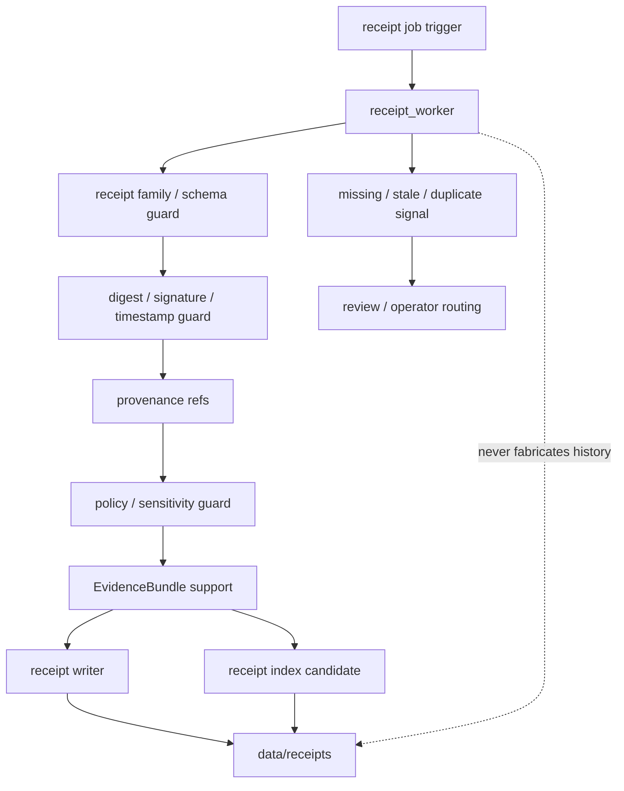

<!-- [KFM_META_BLOCK_V2]
doc_id: kfm://app/workers/src/receipt-worker/readme
title: Receipt Worker README
type: app-readme
version: v0.1
status: draft
owners: OWNER_TBD — Worker steward · Receipt steward · Evidence steward · Policy steward · Pipeline steward · Release steward · Docs steward
created: 2026-06-16
updated: 2026-06-16
policy_label: public
related:
  - ../README.md
  - ../../README.md
  - ../../../governed-api/README.md
  - ../../../review-console/README.md
  - ../../../../pipelines/README.md
  - ../../../../pipeline_specs/README.md
  - ../../../../packages/README.md
  - ../../../../policy/README.md
  - ../../../../schemas/contracts/v1/
  - ../../../../contracts/
  - ../../../../data/README.md
  - ../../../../data/receipts/
  - ../../../../data/proofs/
  - ../../../../release/README.md
  - ../../../../infra/README.md
tags: [kfm, apps, workers, receipt-worker, receipts, provenance, audit, evidencebundle, policydecision, lifecycle, idempotency]
notes:
  - "Replaces the greenfield receipt_worker stub with a bounded worker-source contract."
  - "This worker may support receipt normalization, validation, indexing, integrity checks, and receipt-emission orchestration, but it must not fabricate receipts, rewrite authoritative history, publish, mutate release records, or replace EvidenceBundle/provenance truth."
  - "Worker source files, job definitions, queue contracts, schemas, fixtures, tests, receipt outputs, indexes, deployment state, logs, dashboards, and CI pass state remain NEEDS VERIFICATION."
[/KFM_META_BLOCK_V2] -->

<a id="top"></a>

<div align="center">

# Receipt Worker

`apps/workers/src/receipt_worker/`

**App-local worker-source boundary for receipt-support background jobs: receipt emission coordination, receipt validation, receipt index preparation, integrity/digest checks, provenance reference capture, stale/missing receipt signals, retry/idempotency controls, and non-publishing worker enforcement.**


[Purpose](#1-purpose) · [Repo fit](#2-repo-fit) · [Boundary](#3-authority-boundary) · [Inputs](#5-inputs) · [Exclusions](#6-exclusions) · [Worker map](#7-receipt-worker-map) · [Definition of done](#14-definition-of-done)

</div>

---

> [!IMPORTANT]
> **Status:** draft / `NEEDS VERIFICATION`  
> **Owners:** `OWNER_TBD` — Worker steward · Receipt steward · Evidence steward · Policy steward · Pipeline steward · Release steward · Docs steward  
> **Path:** `apps/workers/src/receipt_worker/README.md`  
> **Responsibility root:** `apps/` — deployable application surfaces  
> **Truth posture:** CONFIRMED README path / CONFIRMED Workers source boundary / CONFIRMED data-root receipt/proof lifecycle home / PROPOSED receipt-worker contract / UNKNOWN source files, queue contracts, schemas, tests, fixtures, runtime behavior, deployment state, and CI pass state

> [!CAUTION]
> The Receipt Worker is not a truth-maker. It may help emit, validate, index, and report receipt state, but it must not fabricate receipts, rewrite history, change release state, publish artifacts, or make unsupported claims appear evidenced.

---

## 1. Purpose

`apps/workers/src/receipt_worker/` is the proposed app-local worker-source home for receipt-support jobs.

It may eventually contain modules for:

- receipt job intake from approved schedules, queues, or operator-triggered dry runs;
- idempotency and retry handling for receipt jobs;
- material run, ingest, validation, transform, AI, catalog, tile, correction, rollback, and release-adjacent receipt checks;
- receipt schema validation and closed-enum checks;
- digest, hash, signature, timestamp, and provenance reference checks;
- receipt index or lookup candidate generation;
- missing-receipt, stale-receipt, duplicate-receipt, and drift signals;
- safe handoff to Review Console, governed API, release/correction, or operator reports;
- safe failure states with no claim or protected detail leakage.

This README does not prove that any receipt worker source file, queue contract, schema, fixture, test, receipt writer, receipt indexer, deployment, log, dashboard, or CI pass state exists.

[Back to top](#top)

---

## 2. Repo fit

| Concern | Owning root | Expected relationship |
|---|---|---|
| Receipt worker source | `apps/workers/src/receipt_worker/` | App-local worker source, if implemented |
| Workers source | `apps/workers/src/` | Worker source boundary and non-publisher enforcement |
| Workers app | `apps/workers/` | Background deployable boundary |
| Governed API | `apps/governed-api/` | Trust membrane and governed public API path |
| Review Console | `apps/review-console/` | Human review and decision surface |
| Pipelines | `pipelines/`, `pipeline_specs/` | Pipeline logic and declarative pipeline definitions |
| Shared packages | `packages/` | Reusable receipt/provenance/evidence helpers after extraction/review |
| Policy | `policy/` | Admissibility, sensitivity, rights, review, release, and decision rules |
| Receipts | `data/receipts/` | Receipt lifecycle home and material output target |
| Proofs | `data/proofs/` | EvidenceBundle and proof support; not worker-owned truth |
| Lifecycle artifacts | `data/` | RAW/WORK/QUARANTINE/PROCESSED/catalog/triplet/published states and registries |
| Release authority | `release/` | Publication, correction, rollback, release manifest authority |
| Schemas/contracts | `schemas/contracts/v1/`, `contracts/` | Machine shape and object meaning |
| Infra | `infra/` | Deployment, least privilege, audit, scheduling, process isolation |

## 3. Authority boundary

This worker may support receipt validation, emission orchestration, missing-receipt detection, and receipt index preparation. It does not own receipt truth by assertion, EvidenceBundle truth, policy decisions, schemas, contracts, lifecycle storage, release decisions, publication, correction approval, rollback approval, review decisions, source ingestion, pipeline authority, public API behavior, public UI behavior, canonical store mutation outside approved flows, runtime/model authority, or deployment configuration.

```text
apps/workers/src/receipt_worker/ = app-local receipt worker source
apps/workers/src/                 = worker source boundary
apps/workers/                     = background worker deployable
data/receipts/                    = receipt lifecycle home
data/proofs/                      = EvidenceBundle/proof support
data/                             = lifecycle artifacts and registries
policy/                           = admissibility and decision policy
schemas/contracts/v1/             = machine shape
contracts/                        = object meaning
release/                          = publication, correction, rollback authority
apps/governed-api/                = governed public trust membrane
apps/review-console/              = human review and decision surface
```

## 4. Default posture

The Receipt Worker should fail closed. A job should not emit receipt records, receipt indexes, missing-receipt signals, drift signals, routing signals, or downstream impact outputs when any of these are unresolved:

- job trigger authenticity, queue ownership, idempotency key, and worker identity;
- receipt family, schema, contract, closed enums, and expected output target;
- input artifact refs, source refs, lifecycle refs, and output refs;
- digest/hash/signature/timestamp/provenance reference checks;
- PolicyDecision, sensitivity, rights, release, correction, and rollback posture where material;
- EvidenceRef and EvidenceBundle support where receipt claims depend on evidence;
- duplicate detection and supersession strategy;
- receipt home, index home, signal home, and owning steward;
- review state, release state, correction state, rollback state, and stale-state impacts;
- retry, resume, safe-disable, and rollback behavior;
- safe error behavior and no raw/internal detail leakage.

## 5. Inputs

| Input family | Examples | Required posture |
|---|---|---|
| Job trigger | schedule, queue message, operator dry run, missing-receipt signal | Audited and idempotent |
| Job context | job id, run id, idempotency key, retry count, worker identity | Durable and traceable |
| Receipt candidate | receipt family, receipt ref, output ref, input refs, expected schema | Schema-validated |
| Provenance context | source refs, transform refs, run refs, reviewer refs, timestamps | Reference-preserving |
| Integrity context | digest, hash, signature, content length, timestamp, version | Deterministic and auditable |
| Policy context | PolicyDecision, sensitivity label, rights posture, release constraints | Policy-runtime derived where material |
| Evidence context | EvidenceRef, EvidenceBundle refs, proof context, limitations | Resolver-backed where material |
| Output refs | receipt ref, receipt index candidate, missing-receipt signal, drift signal | Correct lifecycle/root target required |

## 6. Exclusions

| Does not belong here | Correct home |
|---|---|
| Receipt schema or contract authorship | `schemas/contracts/v1/`, `contracts/` |
| EvidenceBundle/proof truth | `data/proofs/` and evidence resolver packages |
| Lifecycle data and canonical stores | `data/` |
| Release manifests, correction notices, rollback cards | `release/` |
| Policy rules and release decisions | `policy/`, `release/` |
| Source-specific connector implementation | `connectors/` |
| Reusable receipt/pipeline/provenance logic | `pipelines/` or `packages/` |
| Declarative pipeline definitions | `pipeline_specs/` |
| Public or semi-public API surface | `apps/governed-api/` |
| Public UI or map rendering | `apps/explorer-web/` |
| Review decisions and manual adjudication | `apps/review-console/` |
| Fabricated or synthetic receipts without backing event | Out of scope |
| Direct model/runtime public access | `runtime/` behind governed API only |
| Deployment-only values | Deployment environment/config channels |

## 7. Receipt worker map

Exact implementation files remain `NEEDS VERIFICATION`.

| Candidate module | Purpose | Required safeguard | Status |
|---|---|---|---|
| `job_contract` | Queue message and job envelope handling | Closed schema and idempotency | PROPOSED |
| `receipt_family_guard` | Receipt family and schema precheck | No unknown receipt type | PROPOSED |
| `integrity_guard` | Digest/hash/signature/timestamp checks | Deterministic and auditable | PROPOSED |
| `provenance_guard` | Source/run/reviewer/proof refs | No orphan receipt | PROPOSED |
| `policy_guard` | Policy/sensitivity/release precheck | Fail closed on unresolved state | PROPOSED |
| `evidence_guard` | EvidenceBundle support check | No unsupported receipt claim | PROPOSED |
| `receipt_writer` | Receipt emission coordination | Durable data-root output only | PROPOSED |
| `receipt_indexer` | Receipt index candidate preparation | Derived and receipt-backed | PROPOSED |
| `drift_signal` | Missing/stale/duplicate receipt signal | Candidate only, no decision | PROPOSED |
| `safe_errors` | Failure, retry, and safe log shaping | No internal detail leakage | PROPOSED |

> [!WARNING]
> Candidate module names are not implementation proof. Do not claim a receipt worker module is live until files, queues, schemas, fixtures, tests, receipt outputs, indexes, policy gates, evidence checks, and deployment evidence confirm it.

## 8. Diagram



## 9. Worker obligations

| Obligation | Example effect |
|---|---|
| `receipt_event_required` | Every receipt must correspond to a real material event or governed check |
| `no_history_rewrite` | Worker does not rewrite old receipt history without governed supersession/correction flow |
| `schema_required` | Receipt family and shape are validated before material output |
| `integrity_required` | Digests, hashes, timestamps, and signatures are preserved where material |
| `provenance_required` | Source/run/reviewer/output refs remain traceable |
| `policy_required` | Policy and sensitivity gates run before material output where relevant |
| `evidence_required` | Evidence-dependent receipts carry EvidenceRef/EvidenceBundle support |
| `derived_stays_derived` | Receipt indexes and summaries do not replace receipt/proof truth |
| `idempotent_jobs` | Re-running a job should not duplicate authoritative receipts |
| `safe_error_only` | Failures reveal no protected data, raw payloads, internal paths, or deployment-only values |

## 10. Job contract

Each durable receipt worker module or child README should state:

- job purpose and owner;
- authorized producer and trigger type;
- queue message shape and idempotency key;
- receipt family and schema dependency;
- accepted event refs, artifact refs, and denied inputs;
- integrity, provenance, signature, and timestamp requirements;
- policy, sensitivity, release, correction, and rollback dependencies where material;
- EvidenceBundle dependency where material;
- output refs and receipt/index/signal types emitted;
- safe-disable, retry, and rollback path;
- tests and fixtures required;
- open verification items.

## 11. Inspection path

Receipt worker source files, queue contracts, schemas, tests, fixtures, policy integration, evidence resolver integration, receipt emission, receipt indexes, drift signals, deployment state, logs, dashboards, and emitted artifacts remain `NEEDS VERIFICATION`.

```bash
find apps/workers/src/receipt_worker -maxdepth 7 -type f | sort
find apps/workers pipelines pipeline_specs packages policy schemas contracts data release infra tests fixtures -maxdepth 7 -type f 2>/dev/null | grep -Ei 'receipt|Receipt|RunReceipt|TransformReceipt|ValidationReport|AIReceipt|PolicyDecision|EvidenceRef|EvidenceBundle|provenance|prov|signature|digest|hash|timestamp|drift|missing|duplicate|worker|job|queue|test|fixture' | sort
```

## 12. Validation expectations

Useful validation for this worker should cover:

- unauthorized producers cannot enqueue receipt jobs;
- malformed job/input envelopes fail closed;
- missing receipt family, schema, event ref, output ref, provenance ref, integrity hash, policy, evidence, or receipt target blocks material output where required;
- worker does not fabricate receipts without backing events;
- worker does not rewrite receipt history outside governed supersession/correction flows;
- receipt indexes and summaries remain derived and do not replace receipt/proof truth;
- material outputs preserve source refs, event refs, output refs, hashes, timestamps, signatures, reason codes, and limitations;
- retry/idempotency prevents duplicate authoritative receipts;
- missing/stale/duplicate receipt signals remain candidates and require governed review/operator paths;
- safe errors reveal no raw payloads, protected detail, internal paths, signatures/secrets, or deployment-only values.

## 13. Safe change pattern

For Receipt Worker changes:

1. Add or update receipt worker inventory and job contract.
2. Link job, receipt, event, index, drift-signal, and policy DTOs to schemas/contracts before changing shapes.
3. Add fixtures for valid receipt, missing receipt family, missing event ref, missing provenance ref, missing hash, missing policy, duplicate idempotency key, duplicate receipt, stale receipt, safe error, and supersession/correction cases.
4. Add no-fabricated-receipt, no-history-rewrite, schema-required, integrity-required, provenance-required, evidence-support, policy-support, receipt-required, idempotency, and safe-error tests before enabling jobs.
5. Preserve EvidenceRef/EvidenceBundle refs, PolicyDecision refs, source refs, event refs, output refs, lifecycle state, receipt refs, release/correction/rollback refs, job ids, reason codes, timestamps, hashes, signatures, and limitations through every material output.
6. Update this README, parent Workers README, Workers source README, receipt docs, pipeline docs, governed API/review-console docs, policy docs, schemas/contracts, and tests when behavior materially changes.

## 14. Definition of done

- [ ] Owners are confirmed and `OWNER_TBD` is replaced.
- [ ] Receipt worker module inventory and ownership are documented.
- [ ] Job/receipt/event/index/signal DTOs and schemas are verified.
- [ ] Authorized producer, queue, idempotency key, retry, and safe-disable behavior are documented and tested.
- [ ] Receipt family validation, integrity checks, provenance refs, policy runtime, evidence resolver, and receipt writer are documented and tested.
- [ ] Worker cannot fabricate receipts, rewrite history, publish, mutate release records, or upcast source authority.
- [ ] Receipt indexes and drift signals are derived/candidate outputs only until governed review/operator action.
- [ ] Missing-event, missing-provenance, duplicate-receipt, stale-receipt, and safe-error tests are present and passing.
- [ ] Deployment, logs, dashboards, and runbooks are documented with current evidence.

## 15. Open verification items

| Item | Why it matters |
|---|---|
| Confirm source files beyond README | Prevents overclaiming implementation maturity |
| Confirm receipt job/queue contract | Required before worker behavior claims |
| Confirm receipt schemas and contracts | Required before shape claims |
| Confirm receipt family catalog | Required before allowed receipt-type claims |
| Confirm provenance and integrity handling | Required before auditability claims |
| Confirm policy and evidence integration | Required before governed-output claims |
| Confirm receipt outputs and target paths | Required before lifecycle claims |
| Confirm no-fabrication and no-history-rewrite behavior | Required before trust claims |
| Confirm tests, fixtures, deployment, logs, and dashboards | Required before operational maturity claims |
| Confirm review/operator handoff for drift signals | Required before signal workflow claims |

<details>
<summary>Appendix A — no-loss preservation note</summary>

The previous README was a greenfield stub. This replacement adds a bounded Receipt Worker contract without claiming source files, queues, schemas, tests, fixtures, policy enforcement, EvidenceBundle checks, receipt emission, receipt indexing, deployment, logs, dashboards, or CI pass state are implemented.

</details>

## Status summary

`apps/workers/src/receipt_worker/` should contain receipt-support worker source only after job inventory, queue contract, schema validation, receipt family validation, provenance handling, integrity checks, policy runtime integration, evidence resolver integration, receipt emission/indexing, tests, and operational evidence are verified.

It must preserve the receipt boundary: this worker may help emit, validate, index, and report receipt state, but it must not fabricate receipts, rewrite history, publish artifacts, mutate release records, replace EvidenceBundle/provenance truth, or substitute derived indexes for durable receipts and proofs.

<p align="right"><a href="#top">Back to top</a></p>
