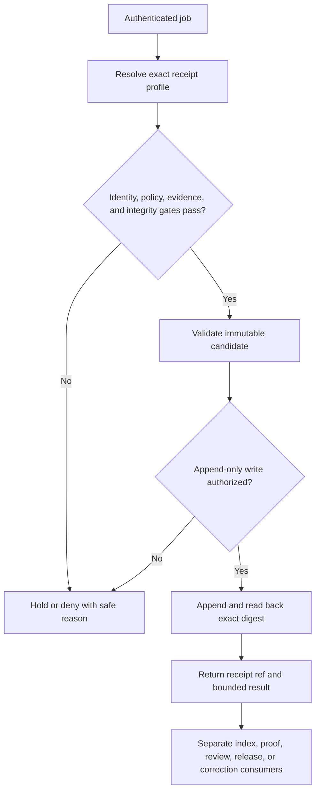

<!-- [KFM_META_BLOCK_V2]
doc_id: kfm://app/workers/src/receipt-worker/readme
title: Receipt Worker README
type: app-readme
subtype: worker-lane-readme
version: v0.2
prior_version: v0.1
status: draft; repository-grounded; placeholder-only
owner: "NEEDS VERIFICATION — CODEOWNERS routes default repository review to @bartytime4life; no accepted Receipt Worker steward, runtime operator, receipt-profile authority, evidence steward, or release authority was verified"
created: 2026-06-16
updated: 2026-08-12
policy_label: public
current_path: apps/workers/src/receipt_worker/README.md
scope_id: apps/workers/src/receipt_worker/
owning_root: apps/
inherited_parent: apps/workers/src/README.md
responsibility: orient contributors to the inert Receipt Worker lane, receipt-family separation, future job admission requirements, validation, maintenance, and rollback
truth_posture: cite-or-abstain
truth_labels: [CONFIRMED, PROPOSED, UNKNOWN, NEEDS VERIFICATION, CONFLICTED]
authority_class: inherited app-local worker lane
authority_rank: implementation orientation subordinate to adopted doctrine, accepted ADRs, semantic contracts, schemas, policy, evidence, review, receipt instances, release decisions, and operational authorization
canonical_relationship: same-path update; no new authority, generated projection, compatibility path, job, queue, runtime binding, writer, receipt instance, release decision, or publication capability created
evidence_repository: bartytime4life/Kansas-Frontier-Matrix
evidence_base_ref: main
evidence_base_commit: 079bedbf566ad321b11e278749a188998f430165
evidence_repository_tree: ec9204c4eaf6e2b40efa00aa359cb54db87d08ca
evidence_lane_tree: 00e67290ff158b74761133b7e3a5deaea5c57838
evidence_target_prior_blob: ad25d9d9fd82990b4a2303be3deee774202adeff
evidence_entrypoint_blob: 0a80db14c4eecb130ad5a5f427742a7d793323d1
evidence_parent_source_blob: 08ad9f8116f64817ffa4f8b2058613749360c102
evidence_workers_readme_blob: 5b5c1e6b067e652a380bf445488a6227028dfc0e
evidence_directory_rules_blob: fd49a0b83e55cef52c1124281f093e263526898d
evidence_directory_rules_adoption: ADR-0029; accepted
evidence_codeowners_blob: dd2a84aa514d8ecd9208bc347f90f9a2ed37dd61
evidence_receipt_separation_adr_blob: 40b0f47b87d584040803ed76aa6b31f5204b7fca
evidence_receipts_tree: 7a99ac33f792bfd4cf7c6399a92ffc8a7637b102
evidence_direct_files: 2
evidence_executable_python_lines: 0
evidence_repository_runtime_bindings: 0
related:
  - ../README.md
  - ../../README.md
  - ../../../../docs/doctrine/directory-rules.md
  - ../../../../docs/adr/ADR-0029-adopt-directory-governance-standard-v2.md
  - ../../../../docs/adr/ADR-0011-receipts-vs-proofs-vs-manifests-vs-catalog-separation.md
  - ../../../../docs/standards/RUN_RECEIPT.md
  - ../../../../docs/atlases/receipt-catalog.md
  - ../../../../data/receipts/README.md
  - ../../../../data/receipts/generated/README.md
  - ../../../../data/proofs/README.md
  - ../../../../contracts/source/ingest_receipt.md
  - ../../../../contracts/governance/receipt_catalog_assessment.md
  - ../../../../contracts/governance/receipt_proof_pairing_assessment.md
  - ../../../../contracts/release/promotion_receipt.md
  - ../../../../schemas/contracts/v1/runtime/run_receipt.schema.json
  - ../../../../schemas/contracts/v1/runtime/ai_receipt.schema.json
  - ../../../../schemas/contracts/v1/receipts/generated_receipt.schema.json
  - ../../../../release/README.md
tags: [kfm, apps, workers, receipt-worker, placeholder, receipts, provenance, append-only, idempotency, evidence, non-publisher]
notes:
  - "v0.2 replaces generalized source uncertainty with exact repository evidence: this lane contains one README and one 55-byte, comment-only Python placeholder with zero executable lines."
  - "The repository has a broad, heterogeneous receipt ecosystem: 831 tracked entries under data/receipts at the pinned base, multiple substantive fixture-first validators, several proposed or conflicted profiles, and no accepted catalog or runtime binding for this lane."
  - "RunReceipt, IngestReceipt, AIReceipt, GENERATED_RECEIPT, PromotionReceipt, receipt-catalog assessment, and receipt-proof pairing are distinct profiles; no one family is a generic substitute for the others."
  - "This documentation-only update does not create, backfill, validate, index, sign, attest, emit, supersede, publish, or delete a receipt."
[/KFM_META_BLOCK_V2] -->

<a id="top"></a>

<div align="center">

# Receipt Worker

`apps/workers/src/receipt_worker/`

**Repository-grounded boundary for a possible receipt-support wrapper. The current lane is inert: its only Python file is a one-line greenfield-placeholder comment, and no repository binding makes it a job, queue consumer, receipt validator, receipt writer, indexer, attester, or deployable process.**

[](#2-repo-fit)
[](#3-authority-boundary)
[](#9-worker-obligations)
[](#6-exclusions)
[](../../../../docs/adr/ADR-0029-adopt-directory-governance-standard-v2.md)
[](#11-inspection-path)

**Quick navigation:** [Purpose](#1-purpose) · [Repo fit](#2-repo-fit) · [Authority](#3-authority-boundary) · [Posture](#4-default-posture) · [Inputs and outputs](#5-inputs-and-outputs) · [Exclusions](#6-exclusions) · [Lane map](#7-current-lane-map) · [Required flow](#8-required-receipt-flow) · [Obligations](#9-worker-obligations) · [Admission contract](#10-job-admission-contract) · [Evidence](#11-inspection-path) · [Validation](#12-validation-expectations) · [Change pattern](#13-safe-change-pattern) · [Done](#14-definition-of-done) · [Gaps](#15-open-verification-items) · [Rollback](#17-correction-and-rollback)

</div>

> [!NOTE]
> Badges summarize the pinned repository inspection. They are navigation aids, not live health, deployment, validation, approval, or release signals.

> [!IMPORTANT]
> **Current state:** `CONFIRMED / PLACEHOLDER-ONLY`. At `main@079bedbf566ad321b11e278749a188998f430165`, this lane contains exactly two tracked files: this README and a 55-byte [`main.py`](./main.py). The Python file contains only `# receipt_worker entrypoint — greenfield placeholder`, for zero imports, definitions, executable statements, or side effects.

Repository-wide name and path inspection found no import, trigger, queue, schedule, package, configuration, test, policy binding, deployment, writer, or output binding for `receipt_worker`. This is bounded repository evidence, not proof about untracked experiments or external systems.

> [!CAUTION]
> A Receipt Worker must never become event truth, evidence, policy, review, proof, release, correction, signature, or publication authority. A receipt records a declared process event or attempt under an exact profile. It does not make a claim true, admissible, approved, released, or public.

---

## 1. Purpose

`apps/workers/src/receipt_worker/` inherits the app-local source boundary from [`apps/workers/src/`](../README.md) and the background deployable boundary from [`apps/workers/`](../../README.md).

If a receipt-support model is later accepted, this directory may own only a thin process wrapper: authenticated job intake, app-local dependency composition, exact receipt-profile selection, bounded validation orchestration, append-only write dispatch through an owned interface, readback verification, safe error translation, and process lifecycle.

The current lane implements none of those responsibilities. It has no package manifest, import graph, queue consumer, schedule, command-line entry point, message parser, receipt catalog client, schema registry client, policy client, evidence client, signer, validator binding, writer, indexer, configuration reader, network access, deployment binding, health check, or emitted artifact.

This README therefore exists to:

1. record the exact placeholder state without upgrading intent into implementation;
2. prevent heterogeneous receipt families from collapsing into a generic receipt shape;
3. preserve append-only history, event-time emission, provenance, idempotency, separation of duties, and non-publisher boundaries;
4. distinguish the populated receipt ecosystem from actual worker composition; and
5. define the evidence, decisions, validation, and rollback required before this lane can claim executable maturity.

### Audience

This document is for worker implementers, receipt and contract stewards, policy and evidence reviewers, security reviewers, operators, and pull-request reviewers deciding whether a proposed change belongs in this lane and whether it remains a scaffold.

### Non-goals

This document does not:

- choose a canonical receipt catalog, generic receipt envelope, job contract, queue, schedule, writer, signer, or retention profile;
- activate a worker, source, policy bundle, service, credential, route, or public surface;
- treat a receipt as proof, evidence closure, policy permission, review approval, release authority, or publication;
- reconcile every receipt-shaped contract and schema in the repository;
- backfill a missing historical receipt or rewrite an existing one;
- grant read or write access to any repository or runtime resource;
- claim fixture validation proves operational integrity; or
- release, deploy, promote, publish, merge, or change repository settings.

[Back to top](#top)

---

## 2. Repo fit

### Current evidence

| Claim | Truth | Repository evidence | Limit |
|---|---|---|---|
| The lane exists under the deployable `apps/` responsibility root. | CONFIRMED | Accepted Directory Rules, parent Workers READMEs, and current tree | Placement does not grant runtime capability. |
| The lane contains exactly a README and `main.py`. | CONFIRMED at pinned base | Lane tree `00e67290ff158b74761133b7e3a5deaea5c57838` | Does not describe untracked or external files. |
| `main.py` is one 55-byte comment and has zero executable Python lines. | CONFIRMED | Blob `0a80db14c4eecb130ad5a5f427742a7d793323d1` | A filename and comment do not form an entry point. |
| A receipt worker is imported, registered, queued, scheduled, configured, tested, packaged, deployed, or active. | CONFIRMED absent from bounded repository inspection | Complete lane inventory plus repository name/path search | External deployment state remains UNKNOWN. |
| `data/receipts/` is populated and heterogeneous. | CONFIRMED at pinned base | Tree `7a99ac33f792bfd4cf7c6399a92ffc8a7637b102`: 831 tracked entries, including 747 JSON files, 47 Markdown files, and 37 `.gitkeep` files | File counts do not establish validity, completeness, canonical status, or one common schema. |
| Substantive receipt contracts, schemas, validators, fixtures, and tests exist elsewhere. | CONFIRMED for representative profiles | Run, ingest, AI, generated-authoring, promotion, catalog-assessment, and proof-pairing surfaces | Adjacent capability is not worker wiring or operational authority. |
| One accepted repository-wide receipt catalog and worker binding exists. | NOT ESTABLISHED | Receipt catalog and separation ADR are draft/proposed; adjacent inventories report drift | The worker must not invent a canonical family map. |
| This README implements receipt behavior. | CONFIRMED false | Markdown-only same-path update | No runtime behavior changes. |

### Responsibility split

| Concern | Canonical owner | This lane's allowed relationship |
|---|---|---|
| Deployable process composition | `apps/workers/` | Thin wrapper only after admission |
| Reusable receipt behavior | `packages/` or `pipelines/` | Call reviewed public interfaces; do not duplicate logic |
| Declarative run graph, schedule, and resources | `pipeline_specs/` | Consume an accepted specification; do not define authority locally |
| Semantic meaning | `contracts/` and accepted standards | Bind exact accepted contract IDs and versions |
| Machine shape | `schemas/` | Validate exact schema IDs and versions before work |
| Policy decisions and obligations | `policy/` | Apply returned decisions; never author or weaken policy |
| Evidence and proof support | `data/proofs/` and governed evidence lanes | Preserve references; never convert a receipt into proof |
| Receipt instances and durable process memory | `data/receipts/` or an accepted runtime store | Write only through an authorized append-only interface |
| Human adjudication | `apps/review-console/` and accepted review records | Route candidates or holds; never self-approve |
| Release, correction, withdrawal, and rollback decisions | `release/` | Consume accepted decisions; never infer them from a receipt |
| Public trust membrane | `apps/governed-api/` | No direct public route from this worker |
| Deployment, network, identity, and secrets | `infra/` plus external secret stores | Receive least privilege only after separate authorization |
| Repository validators and attestation helpers | `tools/` | Reuse narrowly; do not promote a tool into a generic authority |
| Synthetic conformance evidence | `fixtures/`, `tests/` | Prove bounded behavior; never use fixtures as live receipts |

### Directory Rules profile

This is a same-path `PLACE` modernization under the canonical `apps/` root. It does not create, move, rename, split, delete, generate, mirror, localize, or deprecate a path and does not change an authority, lifecycle, or public boundary.

The lane follows the Directory Rules **Boundary Compact** profile:

| Compact element | Where it is covered |
|---|---|
| Purpose and inherited parent | Sections 1–2 |
| Belongs and prohibited | Sections 3 and 6 |
| Inputs and outputs | Section 5 |
| Exposure, mutation, and retention | Section 3 |
| Validation | Section 12 |
| Governing surfaces | Sections 2, 10, and 11 |
| Current status and direct-child map | Sections 2 and 7 |
| Open verification and review triggers | Sections 14–15 |

[Back to top](#top)

---

## 3. Authority boundary

### A future lane may own

- process startup, shutdown, graceful drain, health, and app-local dependency composition;
- authenticated and schema-closed job intake from an accepted producer;
- stable job, run, attempt, subject, correlation, and idempotency identity plumbing;
- exact receipt-profile lookup through an accepted registry or catalog interface;
- read-only resolution of event, artifact, decision, evidence, policy, review, and lineage references;
- deterministic validation orchestration through profile-owned validators;
- append-only dispatch through a capability-scoped writer followed by readback verification;
- bounded retry, cancellation, timeout, hold, dead-letter, and safe-disable behavior; and
- public-safe process metrics and receipt-attempt observability.

### This lane must not own

- the truth of the event, claim, source, evidence, policy decision, review, or release state being recorded;
- receipt-family semantics, canonical schemas, validation rules, policy, evidence authority, or source authority;
- a universal receipt shape that discards family-specific meaning;
- retroactive fabrication, silent backfill, mutation, deletion, or replacement of durable receipt history;
- signing identity, key custody, or signature verification policy as local application logic;
- proof closure, evidence sufficiency, catalog closure, release approval, correction approval, or rollback approval;
- public notice wording, public aliases, public APIs, or direct publication;
- another application's internals, reusable receipt logic, pipeline semantics, or infrastructure definitions; or
- release, deployment, promotion, publication, repository administration, or secret management.

### Exposure, mutation, and retention

| Dimension | Current state | Required future posture |
|---|---|---|
| Exposure | No executable or network surface | Internal-only authenticated ingress; no browser or ordinary public client path |
| Source mutation | README is versioned; placeholder source is unchanged | App source remains versioned through review |
| Runtime reads | None | Reference-based, least-privilege, authenticated, policy-checked interfaces only |
| Runtime writes | None | Capability-scoped append-only writer; deny by default; verify exact stored bytes or digest |
| Existing receipts | Untouched | Immutable except through a separately accepted supersession/correction model that preserves prior history |
| Release/public state | None | Never local; worker completion cannot move release state or make content public |
| Retention | No worker data | Instances, indexes, logs, and metrics remain in declared owning stores under explicit retention |
| Sensitive content | None | Logs, errors, indexes, and receipts minimize or reference protected values; no secrets, raw payloads, harmful precision, or reviewer deliberation |

### Receipt families must not collapse

| Object or event | What it may establish | What it never establishes by itself |
|---|---|---|
| `RunReceipt` | A declared run or attempt and its bounded outcome | Scientific correctness, source authority, proof, release, or publication |
| `IngestReceipt` | A declared retrieval/ingest episode under its source profile | Source activation, admissibility, downstream acceptance, or publication |
| `AIReceipt` | A declared AI-mediated runtime event under its profile | Factual truth, human review, evidence closure, or generated-repository provenance |
| `GENERATED_RECEIPT` | Provenance for AI-authored repository artifacts and declared checks | Runtime inference, factual proof, merge approval, release, or publication |
| `PromotionReceipt` | A declared promotion attempt and bounded transition result | Authority to promote or evidence that public state changed outside the accepted profile |
| Receipt catalog assessment | A candidate assessment of catalog consistency | Canonical catalog status or authority to rewrite receipt instances |
| Receipt-proof pairing assessment | A candidate relationship check | Proof closure, truth, admissibility, or release |
| Worker execution receipt | A declared worker attempt or side effect | The underlying decision, event, artifact, or claim is true or approved |

[Back to top](#top)

---

## 4. Default posture

This lane is inactive and must fail closed. Until a producer, transport, exact job envelope, accepted receipt-family catalog, profile versions, validator bindings, writer capability, retention, observability, and deactivation path are accepted, the only safe behavior is **no execution and no side effect**.

A future job must stop before material work when any applicable prerequisite is missing, stale, conflicted, unresolvable, unauthorized, or broader than the accepted scope:

- authenticated producer, worker identity, transport ownership, and activation state;
- exact job-envelope contract and schema version;
- stable job, run, attempt, subject, correlation, and idempotency identities;
- exact receipt-family, semantic-contract, schema, validator, and finite-outcome version;
- event-time, subject, artifact, decision, evidence, policy, review, release, and lineage references required by that profile;
- source-role, rights, sensitivity, freshness, and disclosure posture;
- allowed writer target, namespace, partition, and append-only capability;
- digest, canonicalization, clock, signer, verification, and key-policy requirements, where applicable;
- retention, index exposure, redaction/generalization, and observability rules;
- retry, duplicate, replay, cancellation, timeout, and partial-write handling; or
- readback verification, safe failure receipt policy, and independent operator escalation.

The worker must return a finite reason-coded result. It must not reinterpret an unknown profile, coerce a partial payload into a different family, weaken a validator, write a best-effort receipt, or treat `success` as evidence beyond the declared operation.

### Finite outcome posture

The exact vocabulary belongs to the admitted job and receipt profiles. A future wrapper should preserve distinctions such as:

- `RECORDED` — the exact candidate was validated, appended, and read back;
- `ALREADY_RECORDED` — an identical idempotent record already exists;
- `HELD` — review, evidence, policy, sensitivity, or dependency closure is unresolved;
- `DENIED` — an authenticated rule or capability rejects the operation;
- `INVALID` — contract, schema, identity, integrity, or family validation failed;
- `CONFLICTED` — the idempotency key or subject maps to non-identical content;
- `RETRYABLE_FAILURE` — a bounded transient dependency failure occurred before an unverified effect;
- `NON_RETRYABLE_FAILURE` — a deterministic or unsafe condition blocks retry; and
- `CANCELLED` — cancellation completed with declared effect status.

These are illustrative wrapper outcomes, not a new canonical receipt enum. The job result, durable receipt outcome, policy decision, review state, release state, and publication state must remain separate fields and object families.

[Back to top](#top)

---

<a id="5-inputs"></a>

## 5. Inputs and outputs

### Current inputs and outputs

| Surface | Current state |
|---|---|
| Input | None; `main.py` parses nothing and reads nothing |
| Output | None; no receipt, index, log, metric, file, message, or network request is emitted |
| Side effect | None |
| Failure mode | Not applicable because no executable path exists |

### Required input declaration for a future worker

An implementation must declare and validate, at minimum:

- producer identity, authorization context, transport, message version, received time, and delivery identifier;
- job, run, attempt, subject, correlation, causation, and idempotency identifiers;
- exact receipt family, contract ID/version, schema ID/version, validator version, and expected outcome vocabulary;
- immutable event and artifact references with digests and canonicalization profile;
- relevant evidence, proof, policy decision, review, source, release, correction, and lineage references;
- event time separately from observation, receipt, processing, retry, and storage times;
- rights, sensitivity, disclosure, retention, and indexability posture;
- requested operation, allowed target, expected prior state, deadline, retry count, and cancellation token; and
- signer/attestation requirements and trusted clock/key references, if that receipt family requires them.

Paths, branch names, filenames, free text, unverified timestamps, and producer-supplied status labels are untrusted inputs. They cannot choose arbitrary validators, write targets, modules, commands, algorithms, network destinations, keys, or public routes.

### Required future output constraints

Permitted outputs are limited to the admitted profile:

- a validated immutable receipt candidate;
- an append-only receipt reference plus stored digest/readback result;
- a finite job result with reason codes and no authority upcast;
- a derived index or catalog candidate clearly linked to its receipts;
- public-safe logs, metrics, health, and alert signals; and
- an explicit hold, denial, conflict, cancellation, or failure record when the profile authorizes one.

Every output must preserve profile identity, event/subject identity, attempt identity, provenance, exact versions, timestamps, reason codes, limitations, and the distinction between asserted, observed, computed, reviewed, decided, recorded, released, and published state.

No partial or failed write may be reported as recorded. If the durable effect cannot be determined, return an explicit unknown/held operational state and require readback or operator reconciliation rather than retrying blindly.

[Back to top](#top)

---

## 6. Exclusions

The following do not belong in this lane:

- canonical receipt semantics, schemas, registries, policy bundles, proof rules, or retention authority;
- a generic `Receipt` model that erases profile-specific required fields and outcomes;
- raw source payloads, evidence bodies, secrets, private endpoints, keys, tokens, unrestricted filesystem paths, or protected location detail;
- direct writes to Git-tracked receipt directories from an unreviewed runtime path;
- direct database, object-store, release, cache, alias, or publication mutation without an accepted owner interface and scoped capability;
- silent backfill, timestamp invention, signer impersonation, receipt mutation, deletion, or in-place correction;
- automatic promotion of draft/proposed contracts, schemas, ADRs, fixture results, or docs into accepted runtime authority;
- proof generation, evidence adjudication, policy authorship, human review, release decision, correction decision, or rollback decision;
- direct public API, UI, download, search, map, or notification behavior;
- reusable domain logic, pipeline definitions, infrastructure manifests, deployment credentials, or another app's internals; and
- release, promotion, deployment, publication, merge, or repository-settings behavior.

The narrow `tools/attest/build_runreceipt.py` helper is not a generic receipt-worker implementation. The populated `data/receipts/generated/` lane records AI-assisted repository-authoring provenance and is not evidence that a runtime Receipt Worker exists.

[Back to top](#top)

---

<a id="7-receipt-worker-map"></a>

## 7. Current lane map

The complete direct-child map at the pinned base is:

| Direct child | Kind | Verified state | Runtime role |
|---|---|---|---|
| [`README.md`](./README.md) | Boundary documentation | This same-path v0.2 update replaces prior blob `ad25d9d9fd82990b4a2303be3deee774202adeff` | None |
| [`main.py`](./main.py) | Python source placeholder | 55 bytes; one comment; zero executable Python lines | None |

There is no `__init__.py`, package manifest, dependency declaration, configuration, schema, fixture, test, queue adapter, scheduler, command, writer, signer, indexer, health endpoint, deployment descriptor, or runbook in this lane.

The neighboring durable receipt tree is broad but is not owned by this app-local source lane. At the pinned base, `data/receipts/` has 23 direct child directories:

| Group | Verified direct children |
|---|---|
| Cross-cutting/process | `aggregation/`, `ai/`, `generated/`, `ingest/`, `pipeline/`, `redaction/`, `release/`, `telemetry/`, `validation/` |
| Domain-oriented | `agriculture/`, `archaeology/`, `atmosphere/`, `fauna/`, `flora/`, `geology/`, `habitat/`, `hazards/`, `hydrology/`, `people-dna-land/`, `roads-rail-trade/`, `settlement/`, `settlements-infrastructure/`, `soil/` |

The 831 tracked entries under that tree include 747 JSON files, 47 Markdown files, and 37 `.gitkeep` files. Of those, `data/receipts/generated/` accounts for 747 tracked entries—746 JSON files and one README. These are pinned lexical/file counts only; they do not claim that every JSON file validates, every family is canonical, every event is complete, or every receipt belongs to one schema.

[Back to top](#top)

---

<a id="8-diagram"></a>

## 8. Required receipt flow

The current lane performs no flow. Any future implementation must preserve this dependency direction and stop at every failed gate:


```mermaid
flowchart TD
    A["Authenticated job"] --> B["Resolve exact receipt profile"]
    B --> C{"Identity, policy, evidence, and integrity gates pass?"}
    C -- "No" --> D["Hold or deny with safe reason"]
    C -- "Yes" --> E["Validate immutable candidate"]
    E --> F{"Append-only write authorized?"}
    F -- "No" --> D
    F -- "Yes" --> G["Append and read back exact digest"]
    G --> H["Return receipt ref and bounded result"]
    H --> I["Separate index, proof, review, release, or correction consumers"]
```

The final consumers remain separate authorities. An index may project a receipt; proof may cite it; review may consider it; release may require it; correction may supersede it. None of those relationships lets this worker silently decide the consumer's state.

### Phase contract

| Phase | Required behavior | Fail-closed condition |
|---|---|---|
| Admit | Authenticate producer and bind exact job/profile versions | Unknown producer, transport, version, scope, or activation |
| Resolve | Resolve contract, schema, validator, target, policy, and dependency versions | Missing, draft-only where acceptance is required, conflicted, or ambiguous binding |
| Gate | Check identity, provenance, rights, sensitivity, policy, evidence, review, time, and capability prerequisites | Any required reference or decision is missing, stale, denied, or unverifiable |
| Validate | Canonicalize and validate one immutable candidate under one exact profile | Unknown field policy, digest mismatch, invalid enum, missing ref, or family collapse |
| Write | Append once using expected-state and idempotency controls | Existing non-identical record, broad target, denied capability, or uncertain prior effect |
| Verify | Read back exact bytes/digest and durable identifier | Write cannot be independently observed or bytes differ |
| Report | Return finite job state, receipt reference, limitations, and safe telemetry | Output would imply truth, approval, release, or publication beyond the operation |

[Back to top](#top)

---

## 9. Worker obligations

A future Receipt Worker must satisfy all applicable obligations below; none is implemented now.

1. **Record a real declared event or attempt.** Do not create a receipt merely to satisfy a checklist, repair optics, or make an earlier claim appear evidenced.
2. **Bind one exact profile.** Carry contract, schema, validator, canonicalization, outcome-vocabulary, and policy versions. Do not guess from a filename or payload resemblance.
3. **Keep receipt separate from truth.** A valid receipt can still describe a denied, failed, held, incomplete, synthetic, or non-authoritative event.
4. **Append; do not rewrite.** Preserve the original object and connect any accepted correction or supersession explicitly.
5. **Verify integrity.** Bind immutable inputs and outputs by exact digest under a declared algorithm and canonicalization rule; reject mixed or unresolved bindings.
6. **Do not upcast signatures.** A signature proves only what its identity, key policy, protected fields, and verification result establish. An unsigned receipt must remain visibly unsigned.
7. **Make retries idempotent.** Identical replay may return the existing record; non-identical reuse of an idempotency key is a conflict, not an update.
8. **Separate subject from attempt.** The event or artifact identity must not collapse into a worker delivery, process run, retry, or storage write identity.
9. **Keep derived state derived.** Catalog rows, dashboards, metrics, indexes, summaries, and search projections must reference receipts and remain rebuildable.
10. **Use finite outcomes and reason codes.** Never smuggle operational uncertainty into free-text `success` or omit a partial-effect state.
11. **Use least privilege.** Read only declared refs; write only the admitted family and namespace; deny arbitrary paths, commands, modules, destinations, and keys.
12. **Observe safely.** Logs and metrics may identify profile/version, bounded outcome, duration, retry class, and opaque correlation refs—not raw payloads or sensitive content.
13. **Remain a non-publisher.** Receipt validation, persistence, signing, or indexing does not authorize release, promotion, correction, rollback, or publication.

### Correction, backfill, and replay

| Situation | Required posture | Prohibited shortcut |
|---|---|---|
| Malformed candidate before write | Reject or hold; no durable success claim | Coerce fields or select a looser family |
| Retry after confirmed append | Resolve by idempotency key and exact digest; return existing ref | Append a duplicate with a new event time |
| Retry after uncertain write | Read back by stable identity before deciding | Blindly retry and risk duplicate/contradictory history |
| Incorrect stored receipt | Preserve original; use accepted correction/supersession semantics and lineage | Edit or delete the prior receipt in place |
| Missing historical receipt | Record the gap and follow an accepted late-record/backfill profile if one exists | Invent an event-time receipt or signer identity |
| Schema or contract evolution | Interpret old receipts under their pinned versions; migrate only through an accepted projection | Retroactively validate all history under the newest profile |
| Derived index drift | Rebuild the projection from authoritative receipt inputs and record the operation as required | Mutate receipts to match the index |
| Worker bug with emitted effects | Disable intake, bound the affected set, preserve logs/receipts, and invoke accepted correction procedures | Hide, rewrite, or recursively emit unbounded repair receipts |

Receipt emission can itself require an operational receipt. That recursion must terminate under an accepted profile—for example, by treating append/write evidence as part of the primary receipt or as a separately bounded storage event. A worker must not enter an infinite “receipt for the receipt” chain.

[Back to top](#top)

---

<a id="10-job-contract"></a>

## 10. Job admission contract

No receipt job is admitted now. A future implementation PR must answer every row before activation:

| Admission field | Required decision |
|---|---|
| Owner and operator | Named accountable steward, runtime operator, security reviewer, receipt-profile authority, and escalation path |
| Producer and transport | Authenticated producer allowlist, queue/event/schedule owner, delivery semantics, replay behavior, and deactivation |
| Job identity | Contract/schema versions plus stable job, run, attempt, subject, correlation, causation, and idempotency keys |
| Receipt binding | Exact family, semantic contract, schema, validator, outcome vocabulary, canonicalization, and compatibility policy |
| Input authority | Required event, artifact, source, evidence, proof, policy, review, release, correction, and lineage refs with source roles |
| Time model | Event, observation, decision, receipt, processing, retry, and storage times plus trusted-clock rules |
| Integrity/attestation | Digest algorithms, canonical bytes, signer identity, key policy, verification, rotation, revocation, and unsigned posture |
| Capabilities | Exact read/write resources, namespace, allowed actions, expected prior state, expiry, and denied-write behavior |
| Persistence | Append-only target, atomicity, uniqueness, readback, replication, retention, legal hold, and disaster recovery |
| Retry/replay | Retry classes, backoff, maximum attempts, duplicate resolution, uncertain-effect recovery, cancellation, and dead-letter/hold handling |
| Derived outputs | Index/catalog/search projection ownership, rebuild semantics, exposure, staleness, and correction behavior |
| Observability | Public-safe logs, metrics, alerts, health/readiness, cardinality, retention, audit access, and incident response |
| Non-effects | Explicit proof the job cannot approve, release, publish, rewrite history, broaden authority, or modify repository settings |
| Validation and rollback | Fixtures, tests, workflow preflight, disable path, correction procedure, data recovery, and exact rollback owner |

### Surrounding profile readiness

| Profile or surface | Confirmed repository support | Current limit for this lane |
|---|---|---|
| `RunReceipt` | Draft standard; substantive runtime schema, validator, fixtures, and tests; narrow PMTiles helper | Standard is proposed and names a schema path that does not exist; no accepted generic worker binding |
| `IngestReceipt` | Proposed semantic contract, source schema, validator, fixtures, and tests | Connector-gate and live producer/persistence prerequisites remain unresolved; no worker binding |
| `AIReceipt` | Proposed AI/runtime schemas plus validator, fixtures, and tests | Runtime event family is distinct from repository-authoring provenance; exact schema authority and worker binding unresolved |
| `GENERATED_RECEIPT` | Closed proposed schema, populated `data/receipts/generated/`, bounded validator, fixtures, tests, and CI surfaces | Records AI-assisted repository-artifact provenance; it is not a generic runtime receipt or proof |
| `PromotionReceipt` | Proposed semantic contract, schema, deterministic validator, fixtures, and tests | Fixture-first and non-authorizing; does not grant promotion or release capability |
| Receipt catalog assessment | Proposed-inactive semantic contract, schema, fixture matrix, validator, and tests | Review-required candidate; not a canonical catalog or writer registry |
| Receipt-proof pairing assessment | Proposed-inactive semantic contract, schema, fixture matrix, validator, and tests | Fixture-only and non-authoritative; does not establish proof closure |
| `data/receipts/` | Large populated hierarchy with domain and process sublanes | Mixed maturity and family conventions; inventory does not select a worker profile |
| `policy/runtime/run_receipt.rego` | A four-line default-deny proposed scaffold | No substantive admitted policy bundle or runtime binding |
| `tools/attest/build_runreceipt.py` | Narrow writer for one PMTiles-oriented run receipt | Uses a specific shape and current UTC time; not a generic worker, signer, catalog, or authority |

### Binding conflicts that must be resolved, not guessed

1. Run-receipt shapes occur under runtime, source, and multiple domain schema paths; the draft standard also points to absent `schemas/contracts/v1/receipts/run_receipt.v1.schema.json`.
2. `AIReceipt` shapes occur in more than one schema family, while `GENERATED_RECEIPT` is a separate repository-authoring provenance family.
3. Receipt semantic meaning is split among contracts, standards, schema descriptions, lane READMEs, and exploratory material with different statuses.
4. The draft receipt catalog explicitly reports adjacent inventory and classification conflict; proposed ADR-0011 is useful separation rationale but is not accepted migration authority.
5. `data/receipts/` contains many path conventions and domain sublanes; path presence alone cannot determine canonical family, profile version, or retention.
6. Digest canonicalization, signer/key policy, trusted time, event-time versus write-time semantics, and correction/backfill behavior are not uniform across profiles.
7. A generated authoring receipt, runtime receipt, proof-pairing assessment, promotion receipt, and release run receipt cannot substitute for one another.
8. No accepted receipt-worker job envelope, producer, transport, profile registry, generic validator interface, append-only writer, index contract, or deployment was verified.

An implementation PR must provide an accepted binding matrix or applicable ADR/migration decision. It must not select a payload merely because its filename is closest to the worker name.

[Back to top](#top)

---

## 11. Inspection path

The repository state in this README can be reproduced without network access:

```bash
git rev-parse 079bedbf566ad321b11e278749a188998f430165^{tree}
git rev-parse 079bedbf566ad321b11e278749a188998f430165:apps/workers/src/receipt_worker
git ls-tree -rl 079bedbf566ad321b11e278749a188998f430165 \
  apps/workers/src/receipt_worker
git show 079bedbf566ad321b11e278749a188998f430165:apps/workers/src/receipt_worker/main.py
git grep -n -i -E 'receipt_worker|receipt worker' \
  079bedbf566ad321b11e278749a188998f430165 -- \
  ':!apps/workers/src/receipt_worker/README.md'
git ls-tree -r --name-only 079bedbf566ad321b11e278749a188998f430165 -- \
  data/receipts
rg --files contracts schemas fixtures tests tools policy release data docs \
  | rg -i 'receipt|proof|provenance|attest|signature|catalog'
```

The file totals above were calculated from the pinned tree, not the mutable working directory. The repository-wide `rg --files` result is a lexical discovery aid; matching names are not automatically canonical or admitted.

### Evidence ledger

| Evidence | Pinned object | Supports | Does not prove |
|---|---|---|---|
| Repository base | commit `079bedbf566ad321b11e278749a188998f430165`; tree `ec9204c4eaf6e2b40efa00aa359cb54db87d08ca` | Exact review baseline | Runtime, security, release, or deployment state |
| Receipt Worker lane | tree `00e67290ff158b74761133b7e3a5deaea5c57838` | Complete two-file lane inventory | Off-repository state |
| Prior README | blob `ad25d9d9fd82990b4a2303be3deee774202adeff` | Same-path baseline and no-loss review | Worker behavior |
| Placeholder entrypoint | blob `0a80db14c4eecb130ad5a5f427742a7d793323d1` | Exact comment-only source bytes | Importability or execution |
| Parent source README | blob `08ad9f8116f64817ffa4f8b2058613749360c102` | Inherited placeholder, thin-wrapper, and non-publisher contract | Child maturity |
| Parent Workers README | blob `5b5c1e6b067e652a380bf445488a6227028dfc0e` | Scaffold-only background app boundary | Active deployment |
| Accepted Directory Rules | blob `fd49a0b83e55cef52c1124281f093e263526898d`; accepted ADR-0029 blob `b01322ef64f8c2b1ecb41de7ef4685b97cfa2a62` | Placement, dependency, Boundary Compact, lifecycle, and receipt/proof/release separation rules | Runtime authorization |
| CODEOWNERS | blob `dd2a84aa514d8ecd9208bc347f90f9a2ed37dd61` | Default repository review route to `@bartytime4life` | Receipt stewardship, runtime authentication, or release approval |
| Receipt separation ADR | blob `40b0f47b87d584040803ed76aa6b31f5204b7fca`; status PROPOSED | Explicit distinction among receipts, proofs, manifests, catalog, and release | Accepted migration, complete catalog, or operational binding |
| Receipt data tree | tree `7a99ac33f792bfd4cf7c6399a92ffc8a7637b102` | Pinned 831-entry receipt hierarchy and file counts | Per-file validity, completeness, authority, or shared schema |
| Run-receipt standard | blob `144f6a153ba9223a617e2718bca3e161bf24e605`; status draft | Proposed field and validation posture plus acknowledged drift | Accepted generic runtime contract or worker binding |
| Runtime RunReceipt schema/validator | blobs `c930ff0fd4da34d8b4ff202d9fd576110258974c` / `d57bc57234a16dc11908e1509b293124e185d388` | Substantive bounded validation profile | Production writer, signing, storage, or activation |
| Generated-receipt schema/validator | blobs `fba21ed27ebccf1362fe397fe0c3ebd85e072685` / `70c54b877ef3f9f13a839f9a06cb8c14e67cb753` | Separate repository-authoring provenance profile | Runtime AI event, factual proof, merge, release, or publication |
| PromotionReceipt contract/validator | blobs `ed432f8e3e02d170589c9e04d78087a69346909d` / `876c1b82d712623e52c7029a87f33c8ed9eb9668` | Existing fixture-first promotion-attempt profile | Promotion authority, release, or live state transition |

Evidence pins make repository claims reviewable. They do not turn supporting documents, schemas, fixtures, validators, workflows, files, or receipts into implementation or authority.

[Back to top](#top)

---

## 12. Validation expectations

### Documentation-only changes

Run repository-owned, no-network checks against the changed file and exact feature head:

```bash
git diff --check
python tools/validators/docs/meta-block/check_meta_blocks.py \
  --repo-root . --profile present \
  --registry control_plane/document_registry.yaml \
  --format text apps/workers/src/receipt_worker/README.md
python tools/validators/docs/link-check/check_links.py \
  --repo-root . --format text \
  apps/workers/src/receipt_worker/README.md
python tools/validators/docs/document-graph/check_document_graph.py \
  --repo-root . \
  --entrypoint apps/workers/src/receipt_worker/README.md \
  --registry control_plane/document_registry.yaml \
  --format text apps/workers/src/receipt_worker/README.md
python tools/validators/docs/stale-scan/check_stale_docs.py \
  --repo-root . --as-of 2026-08-12 --profile advisory \
  --review-window-days 365 --placeholder-grace-days 90 \
  --format text apps/workers/src/receipt_worker/README.md
python -m unittest discover \
  --start-directory tests/validators/docs/meta-block \
  --pattern 'test_*.py' --verbose
python -m unittest discover \
  --start-directory tests/validators/docs/link-check \
  --pattern 'test_*.py' --verbose
python -m unittest discover \
  --start-directory tests/validators/docs/document-graph \
  --pattern 'test_*.py' --verbose
python -m unittest discover \
  --start-directory tests/validators/docs/stale-scan \
  --pattern 'test_*.py' --verbose
```

Also verify the README-specific structure:

```bash
test "$(rg -c '^# ' apps/workers/src/receipt_worker/README.md)" -eq 1
test "$(rg -c '^<!-- \[KFM_META_BLOCK_V2\]$' \
  apps/workers/src/receipt_worker/README.md)" -eq 1
for anchor in 5-inputs 7-receipt-worker-map 8-diagram 10-job-contract; do
  rg -q "id=\"$anchor\"" apps/workers/src/receipt_worker/README.md
done
test $(( $(rg -c '^```' apps/workers/src/receipt_worker/README.md) % 2 )) -eq 0
test "$(tail -c 1 apps/workers/src/receipt_worker/README.md | wc -l)" -eq 1
```

The final-newline command succeeds only when the last byte is a newline. A green documentation result proves only bounded metadata, links, document graph, freshness, Markdown structure, tests, and diff hygiene. It does not prove a worker is implemented, safe, deployed, active, profile-complete, policy-bound, evidence-bound, receipt-complete, release-approved, or public.

### First executable receipt slice

Replacing the placeholder requires, at minimum:

- deterministic no-network unit tests with synthetic, public-safe fixtures for one explicitly admitted receipt family;
- exact job, semantic contract, schema, validator, canonicalization, finite-outcome, policy, evidence, writer, and retention bindings;
- unauthorized producer, malformed envelope, unknown profile/version, extra field, missing ref, invalid enum, unsupported algorithm, and digest mismatch cases;
- event-time/write-time confusion, untrusted clock, signer mismatch, revoked or unknown key, missing signature, and invalid signature cases where applicable;
- duplicate delivery, identical replay, conflicting idempotency key, retry after confirmed write, retry after uncertain write, timeout, cancellation, and dependency-unavailable cases;
- missing, stale, conflicted, denied, sensitive, rights-restricted, weak-source, or unsupported evidence/policy/review dependencies where applicable;
- family-collapse cases proving `RunReceipt`, `IngestReceipt`, `AIReceipt`, `GENERATED_RECEIPT`, `PromotionReceipt`, proof, catalog, and release objects cannot substitute for one another;
- append-only, expected-state, atomicity, readback-digest, no-backfill, no-history-rewrite, and explicit supersession/correction cases;
- partial-effect and recovery tests proving an uncertain write is never reported as success and is not blindly retried;
- denied path traversal, arbitrary module/command/URL, broad namespace, direct release write, direct public route, and protected-data logging cases;
- bounded integration tests across public contract, schema, validator, policy, evidence, writer, and index interfaces without importing another app's internals; and
- workflow preflight proving the branch cannot deploy, activate, release, promote, publish, mutate settings, or expose secrets.

The first slice should admit one family end to end in an inactive or dry-run profile. It must not simultaneously create a generic catalog, generic signer, multiple family adapters, live queue, production writer, public index, and deployment.

No worker-specific executable test target is currently bound to `apps/workers/src/receipt_worker/`.

[Back to top](#top)

---

## 13. Safe change pattern

1. Pin current `main`, the lane tree, README and placeholder blobs, parent contracts, accepted directory governance, exact receipt profiles, validators, policies, stores, workflows, open pull requests, and deployment evidence.
2. Decide and record whether receipt orchestration belongs here, who owns the runtime, and which receipt family is the first admitted profile.
3. Resolve the exact job envelope, producer, transport, semantic contract, schema, validator, outcome vocabulary, target, canonicalization, signer, time, retention, correction, and compatibility bindings before code consumes a payload.
4. Define stable identities, allowed reads/writes, event/write timing, idempotency, retry, partial-effect, cancellation, observability, safe-disable, correction, and rollback behavior.
5. Keep the app wrapper thin; add reusable behavior to the correct package, pipeline, policy, evidence, attestation, storage, or tooling root with its own tests.
6. Add synthetic positive and negative fixtures before claiming executable maturity; never use live protected data or copied production receipts as convenient fixtures.
7. Prove no family collapse, fabricated event, silent backfill, history rewrite, signer upcast, policy bypass, proof upcast, self-release, direct public path, or unreceipted side effect exists.
8. Reconcile this README, its parent source README, Workers app README, and directly affected contracts, schemas, standards, policies, packages, pipelines, receipt stores, fixtures, tests, runbooks, and operators in one dependency-closed slice.
9. Run changed-area and safety validation, inspect the complete diff, refresh the mainline collision check, and deliver through a feature branch and draft pull request.
10. Keep deployment, activation, credential issuance, writer capability, signing-key access, release, promotion, publication, merge, and repository settings as separate authorized transitions.

[Back to top](#top)

---

## 14. Definition of done

### This documentation modernization

- [x] Stable `doc_id`, current path, title, creation date, top anchor, and one-H1 structure are preserved.
- [x] The prior README was reviewed for no-loss preservation and materially useful constraints were retained.
- [x] Current lane claims are pinned to an exact commit, tree, and blobs.
- [x] The verified two-file, zero-executable-line direct-child map replaces speculative source-module inventory.
- [x] Receipt, proof, evidence, policy, review, catalog, release, correction, and publication authority remain separated.
- [x] Current zero-input/zero-output behavior is distinct from future admission requirements.
- [x] Legacy anchors remain available for inbound links.
- [x] Validation, maintenance, open-verification, correction, and rollback guidance is explicit.
- [x] The change is documentation-only and does not modify `main.py` or any runtime surface.

### Future executable maturity

- [ ] Accepted owner, receipt-profile authority, runtime operator, security reviewer, escalation path, and non-publisher scope.
- [ ] Accepted orchestration owner and one exact first receipt profile.
- [ ] Executable entry point plus reproducible package, dependency, and build identity.
- [ ] Authorized producer, inactive-by-default transport, authentication, delivery/replay semantics, and deactivation behavior.
- [ ] Reviewed binding matrix covering semantic contract, schema, validator, outcome vocabulary, canonicalization, time, signing, storage, retention, and compatibility.
- [ ] Accepted capability model with exact resources, actions, namespace, expiry, identity, expected-state, and denial behavior.
- [ ] Stable job/run/attempt/subject/correlation/causation/idempotency identities and bounded retry/cancellation behavior.
- [ ] Append-only atomic persistence, exact readback verification, duplicate/conflict handling, and uncertain-effect recovery.
- [ ] Evidence, source-role, rights, sensitivity, policy, review, release, correction, and lineage prerequisites integrated through owned interfaces.
- [ ] Derived indexes remain rebuildable projections and cannot replace or mutate receipts.
- [ ] Positive, negative, mixed-version, family-collapse, replay, race, partial-failure, denied-write, no-public-route, correction, and rollback tests pass.
- [ ] Safe logs, metrics, health, alerts, incident, disable, retention, and disaster-recovery paths exist.
- [ ] Deployment and activation evidence is tied to an exact revision, if separately authorized.
- [ ] Documentation is reconciled with exact code, contracts, schemas, policy, tests, workflows, storage, and operational evidence.
- [ ] No truth, proof, approval, release, promotion, publication, or settings authority is inferred from code, CI, deployment, signature, receipt, or merge.

[Back to top](#top)

---

## 15. Open verification items

| Item | Current truth | Required evidence or decision |
|---|---|---|
| Receipt Worker stewardship and independent review | NEEDS VERIFICATION | Accepted responsibility assignment, authenticated roles, separation of duties, and escalation route |
| Worker implementation | CONFIRMED absent | Dependency-closed code, package identity, tests, and review evidence |
| Producer, transport, queue, event, or schedule | CONFIRMED absent in repository bindings | Accepted contract, producer identity, delivery/replay semantics, activation, and dead-letter/hold posture |
| Canonical receipt inventory/catalog | CONFLICTED / NOT ESTABLISHED | Accepted family registry, statuses, owners, versions, compatibility, and migration decision |
| Generic job and result envelope | NOT ESTABLISHED | Accepted semantic contract/schema with stable identities, finite outcomes, and safe errors |
| First admitted receipt profile | UNDECIDED | Named family with accepted contract, schema, validator, fixtures, tests, policy, and target |
| Receipt storage/writer interface | NOT ESTABLISHED | Append-only API, atomicity, target allowlist, uniqueness, readback, replication, retention, and access control |
| Canonicalization and digest posture | NEEDS VERIFICATION across families | Exact byte model, algorithm allowlist, multi-hash posture, and migration behavior |
| Signing and trusted time | NEEDS VERIFICATION | Key ownership, identity, protected fields, trusted clock, rotation/revocation, verification, and unsigned posture |
| Event-time, late record, and backfill semantics | NEEDS VERIFICATION | Accepted timing fields, permissible lateness, gap handling, and no-fabrication policy |
| Correction and supersession | NEEDS VERIFICATION | Append-only object model, prior/new refs, reason codes, reviewer authority, indexes, and retention |
| Receipt-proof and receipt-release relationships | PROPOSED / profile-specific | Accepted non-collapse mappings and consumer contracts |
| Derived catalog/index behavior | NOT ESTABLISHED for this lane | Projection owner, schema, rebuild, staleness, exposure, retention, and correction rules |
| Runtime policy | Proposed default-deny scaffold only | Substantive bundle, decision contract, representative allow/hold/deny/abstain tests, and worker binding |
| Deployment, activation, health, logs, metrics, and alerts | UNKNOWN | Exact deployed revision, public-safe observed telemetry, operator evidence, and separate activation authority |

Re-review this README when the placeholder changes, a producer or transport is proposed, one receipt family is admitted, a receipt catalog or separation ADR is accepted, a writer/signer/index is introduced, receipt storage conventions change, parent worker boundaries change, ADR-0029 is superseded, CODEOWNERS routing changes, or deployment/operational evidence becomes available.

[Back to top](#top)

---

## 16. Documentation change history

| Version | Date | Change | Runtime effect |
|---|---|---|---|
| `v0.1` | 2026-06-16 | Replaced a greenfield stub with a broad proposed receipt-support worker contract. | None; documentation only. |
| `v0.2` | 2026-08-12 | Pinned current repository evidence; recorded the two-file comment-only lane and populated receipt ecosystem; reconciled accepted Directory Rules with proposed/conflicted receipt governance; separated representative receipt families and authorities; replaced speculative modules with the verified direct-child map; and strengthened admission, flow, validation, maintenance, correction, and rollback guidance. | None; documentation only. |

<details>
<summary>Appendix A — no-loss and correction note</summary>

The v0.1 edition correctly preserved core constraints: a receipt worker must not fabricate receipts, rewrite history, publish, mutate release records, or replace evidence and provenance truth. It also identified useful future concerns including validation, integrity, provenance references, indexing, drift signals, idempotency, retries, safe errors, and governed handoffs.

This edition retains those constraints while correcting the evidence posture. Source-file presence is no longer unknown: `main.py` exists as a comment-only placeholder. Receipt contracts, schemas, validators, fixtures, tests, policies, data lanes, and helpers also exist elsewhere. None is wired to this lane; maturity and authority vary; several families or paths conflict; and no accepted receipt-worker job, profile catalog, writer, signer, index, deployment, or runtime binding was verified.

</details>

<details>
<summary>Appendix B — material disposition from v0.1</summary>

| Prior material | v0.2 disposition |
|---|---|
| Proposed purpose and non-publisher warning | Preserved and narrowed to a future thin wrapper |
| Root responsibility map | Reconciled with accepted Directory Rules and current parent READMEs |
| Generalized `NEEDS VERIFICATION` for all source files | Corrected to the exact README plus comment-only `main.py` inventory |
| Speculative worker modules | Removed; no such direct children exist |
| Receipt validation, integrity, provenance, indexing, and signal concerns | Preserved as future obligations, with authority and profile boundaries made explicit |
| Broad list of receipt types | Replaced by a representative readiness matrix and a no-collapse rule; no canonical catalog is claimed |
| Generic job fields and validation list | Expanded into an admission contract, finite outcome posture, phase gates, and executable-slice tests |
| Safe change sequence and definition of done | Retained, evidence-pinned, and split between this docs change and future runtime maturity |
| Open questions | Converted into truth-labeled verification items with required evidence |
| No-loss note | Expanded to record corrected claims and retained constraints |

</details>

## 17. Correction and rollback

Before merge, abandon or close the feature branch and draft pull request. After an independently authorized merge, use a transparent revert or forward-fix pull request restoring prior blob `ad25d9d9fd82990b4a2303be3deee774202adeff`, then rerun the same documentation checks.

A README rollback changes no Python source, contract, schema, policy, package, pipeline, fixture, test, queue, schedule, configuration, capability, receipt, proof, index, signature, key, release, data, deployment, activation, promotion, publication, or repository setting. If a later implementation affects those surfaces, its accepted execution record, partial-effect handling, append-only correction lineage, index rebuild, deployment, and rollback obligations control; restoring prose alone is not an operational rollback.

---

## Status summary

`apps/workers/src/receipt_worker/` is correctly located as an inherited app-local lane but is not an implemented or active worker. Its repository state is exactly one boundary README and one 55-byte comment-only placeholder, with zero executable lines and no import, trigger, queue, schedule, package, policy binding, test, configuration, writer, signer, index, deployment, or output binding.

The wider repository contains substantial but heterogeneous receipt material. That ecosystem does not supply a canonical generic receipt or activate this lane. Future work must first select one accepted profile and resolve orchestration ownership, exact contract/schema/validator/policy/storage bindings, event and attempt identity, append-only correction, idempotency, time, integrity, signing, retention, and least-privilege execution.

Any admitted implementation must remain thin, authenticated, profile-closed, append-only, provenance-preserving, evidence- and policy-bounded, idempotent, replay-safe, least-privileged, independently reviewable, readback-verified, public-safe, non-publishing, and subordinate to proof, review, correction, release, and publication authority.

<p align="right"><a href="#top">Back to top</a></p>
