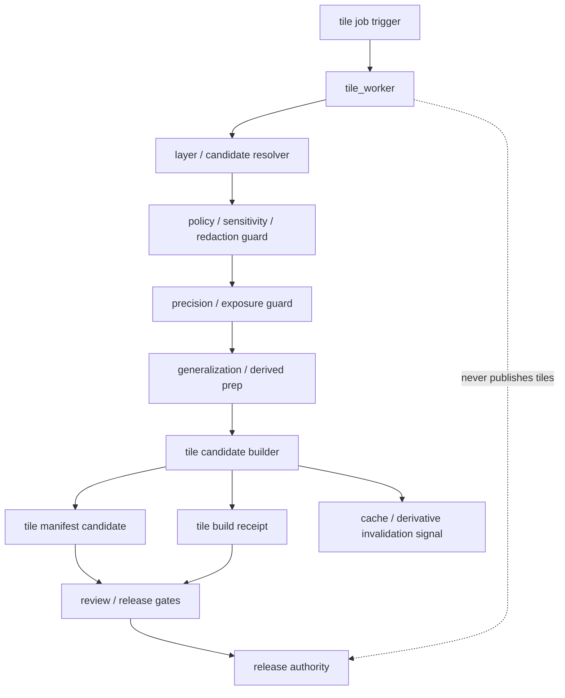

<!-- [KFM_META_BLOCK_V2]
doc_id: kfm://app/workers/src/tile-worker/readme
title: Tile Worker README
type: app-readme
version: v0.1
status: draft
owners: OWNER_TBD — Worker steward · Tile steward · Map steward · Policy steward · Evidence steward · Release steward · Docs steward
created: 2026-06-16
updated: 2026-06-16
policy_label: public
related:
  - ../README.md
  - ../../README.md
  - ../../../governed-api/README.md
  - ../../../explorer-web/README.md
  - ../../../review-console/README.md
  - ../../../../pipelines/README.md
  - ../../../../pipeline_specs/README.md
  - ../../../../packages/README.md
  - ../../../../packages/maplibre/README.md
  - ../../../../policy/README.md
  - ../../../../policy/redaction/README.md
  - ../../../../schemas/contracts/v1/
  - ../../../../contracts/
  - ../../../../data/README.md
  - ../../../../data/receipts/
  - ../../../../data/proofs/
  - ../../../../release/README.md
tags: [kfm, apps, workers, tile-worker, tiles, maplibre, vector-tiles, raster-tiles, generalization, redaction, receipts, lifecycle, derived-artifacts]
notes:
  - "Replaces the greenfield tile_worker stub with a bounded worker-source contract."
  - "This worker may build policy-safe tile candidates and derived map artifacts, but it must not replace canonical truth, publish directly, expose restricted precision/detail, bypass redaction/generalization, or become a public tile authority."
  - "Worker source files, job definitions, queue contracts, schemas, fixtures, tests, tile outputs, receipt outputs, deployment state, logs, dashboards, and CI pass state remain NEEDS VERIFICATION."
[/KFM_META_BLOCK_V2] -->

<a id="top"></a>

<div align="center">

# Tile Worker

`apps/workers/src/tile_worker/`

**App-local worker-source boundary for policy-safe tile and map-derived artifact support: tile job intake, source/candidate refs, sensitivity and redaction gates, generalization, tile candidate generation, tile manifest/metadata support, receipt emission, cache invalidation signals, and non-publishing worker enforcement.**


[Purpose](#1-purpose) · [Repo fit](#2-repo-fit) · [Boundary](#3-authority-boundary) · [Inputs](#5-inputs) · [Exclusions](#6-exclusions) · [Worker map](#7-tile-worker-map) · [Definition of done](#14-definition-of-done)

</div>

---

> [!IMPORTANT]
> **Status:** draft / `NEEDS VERIFICATION`  
> **Owners:** `OWNER_TBD` — Worker steward · Tile steward · Map steward · Policy steward · Evidence steward · Release steward · Docs steward  
> **Path:** `apps/workers/src/tile_worker/README.md`  
> **Responsibility root:** `apps/` — deployable application surfaces  
> **Truth posture:** CONFIRMED README path / CONFIRMED Workers source boundary / CONFIRMED apps-root worker non-publisher role / PROPOSED tile-worker contract / UNKNOWN source files, queue contracts, schemas, tests, fixtures, runtime behavior, deployment state, and CI pass state

> [!CAUTION]
> The Tile Worker is not a publication authority or canonical spatial truth store. It may build derived tile candidates and receipts, but it must not publish directly, expose restricted precision or protected locations, bypass redaction/generalization policy, or let map-derived artifacts replace evidence, catalog, triplet, or release authority.

---

## 1. Purpose

`apps/workers/src/tile_worker/` is the proposed app-local worker-source home for tile and map-derived artifact support jobs.

It may eventually contain modules for:

- tile job intake from approved schedules, queues, release-window triggers, or operator-triggered dry runs;
- idempotency and retry handling for tile jobs;
- catalog/triplet/processed candidate input validation;
- policy, sensitivity, rights, redaction, and generalization prechecks;
- vector tile, raster tile, terrain/3D tile, or tile metadata candidate generation where authorized;
- tile manifest, layer manifest, cache key, and tile index candidate support;
- derivative invalidation and cache refresh signals;
- tile build receipt emission;
- review/release queue routing signals where material;
- safe failure states with no claim, restricted geometry, or protected detail leakage.

This README does not prove that any tile worker source file, queue contract, schema, fixture, test, tile builder, tile manifest writer, receipt writer, deployment, log, dashboard, or CI pass state exists.

[Back to top](#top)

---

## 2. Repo fit

| Concern | Owning root | Expected relationship |
|---|---|---|
| Tile worker source | `apps/workers/src/tile_worker/` | App-local worker source, if implemented |
| Workers source | `apps/workers/src/` | Worker source boundary and non-publisher enforcement |
| Workers app | `apps/workers/` | Background deployable boundary |
| Governed API | `apps/governed-api/` | Trust membrane and governed public API path |
| Explorer Web | `apps/explorer-web/` | Public/semi-public map consumer through governed API and released artifacts |
| Review Console | `apps/review-console/` | Human review and decision surface |
| Pipelines | `pipelines/`, `pipeline_specs/` | Pipeline logic and declarative pipeline definitions |
| Shared packages | `packages/`, `packages/maplibre/` | Reusable tile/map helpers after extraction/review |
| Policy | `policy/`, `policy/redaction/` | Admissibility, sensitivity, redaction, generalization, and release policy |
| Lifecycle artifacts | `data/` | Lifecycle states, receipts, proofs, registries, catalog, triplets, published outputs |
| Receipts and proofs | `data/receipts/`, `data/proofs/` | Receipt/proof support for material outputs |
| Release authority | `release/` | Publication, correction, rollback authority |
| Schemas/contracts | `schemas/contracts/v1/`, `contracts/` | Machine shape and object meaning |

## 3. Authority boundary

This worker may support tile candidate and tile metadata generation. It does not own spatial truth, source authority, catalog truth, triplet truth, EvidenceBundle truth, policy decisions, redaction policy, schemas, contracts, lifecycle storage, release decisions, publication, correction approval, rollback approval, review decisions, source ingestion, pipeline authority, public API behavior, public UI behavior, canonical store mutation outside approved flows, or runtime/model authority.

```text
apps/workers/src/tile_worker/ = app-local tile worker source
apps/workers/src/             = worker source boundary
apps/workers/                 = background worker deployable
apps/governed-api/            = governed public trust membrane
apps/explorer-web/            = map consumer; no raw/internal direct reads
pipelines/                    = executable pipeline logic
pipeline_specs/               = declarative pipeline definitions
packages/                     = reusable libraries
packages/maplibre/            = shared map/tile rendering helpers if present
policy/                       = admissibility and decision policy
policy/redaction/             = redaction/generalization policy if present
data/                         = lifecycle artifacts, receipts, proofs, registries
release/                      = publication, correction, rollback authority
```

## 4. Default posture

The Tile Worker should fail closed. A job should not emit tile candidates, tile manifests, cache indexes, invalidation signals, receipts, or downstream map outputs when any of these are unresolved:

- job trigger authenticity, queue ownership, idempotency key, and worker identity;
- input lifecycle phase and tile-build eligibility;
- source identity, source role, provenance, rights, cadence, and integrity hash;
- catalog/triplet/processed refs and release/review authorization;
- schema, contract, validator, and fixture availability;
- PolicyDecision, sensitivity, redaction/generalization, geoprivacy, rights, and release-state posture;
- exact geometry exposure risk, precision tier, temporal exposure risk, and attribute exposure risk;
- EvidenceRef and EvidenceBundle support where tile metadata or labels carry claims;
- deterministic tile identity, cache key, version, and supersession strategy;
- output lifecycle home, receipt home, manifest home, and owning steward;
- review state, release state, correction state, rollback state, invalidation state, and stale-state impacts;
- retry, resume, safe-disable, and rollback behavior;
- safe error behavior and no raw/internal detail leakage.

## 5. Inputs

| Input family | Examples | Required posture |
|---|---|---|
| Job trigger | schedule, queue message, operator dry run, release-window signal | Audited and idempotent |
| Job context | job id, run id, idempotency key, retry count, worker identity | Durable and traceable |
| Spatial input | processed layer ref, catalog/triplet ref, geometry ref, time/version ref | Correct lifecycle phase required |
| Policy context | PolicyDecision, sensitivity label, redaction profile, generalization tier | Policy-runtime derived |
| Evidence context | EvidenceRef, EvidenceBundle refs, proof context, limitations | Resolver-backed where material |
| Tile config | tile scheme, zoom range, layer id, cache key, style/layer ref | Versioned and bounded |
| Output refs | tile candidate ref, tile manifest ref, tile receipt ref, invalidation signal | Correct lifecycle/root target required |
| Release context | release state, correction state, rollback state, supersession refs | Required when material |

## 6. Exclusions

| Does not belong here | Correct home |
|---|---|
| Map UI rendering | `apps/explorer-web/`, shared UI/map packages |
| Public tile/API serving | `apps/governed-api/` and released/public-safe artifact services |
| Redaction/generalization policy authoring | `policy/`, `policy/redaction/` |
| Reusable tile/pipeline logic | `pipelines/` or `packages/` |
| Declarative pipeline definitions | `pipeline_specs/` |
| Schemas and contracts | `schemas/contracts/v1/`, `contracts/` |
| Lifecycle data and canonical stores | `data/` |
| Receipts and proofs | `data/receipts/`, `data/proofs/` |
| Published tile artifacts | `data/published/` through release authority |
| Release manifests, correction notices, rollback cards | `release/` |
| Source-specific connector implementation | `connectors/` |
| Review decisions and manual adjudication | `apps/review-console/` |
| Direct model/runtime public access | `runtime/` behind governed API only |
| Deployment-only values | Deployment environment/config channels |

## 7. Tile worker map

Exact implementation files remain `NEEDS VERIFICATION`.

| Candidate module | Purpose | Required safeguard | Status |
|---|---|---|---|
| `job_contract` | Queue message and job envelope handling | Closed schema and idempotency | PROPOSED |
| `input_resolver` | Resolve layer/candidate refs and lifecycle phase | No raw-store shortcut | PROPOSED |
| `policy_guard` | Policy/sensitivity/redaction precheck | Fail closed on unresolved state | PROPOSED |
| `precision_guard` | Geometry precision, zoom, attribute, and temporal exposure checks | No restricted detail leakage | PROPOSED |
| `generalization` | Generalized geometry/attribute preparation | Policy-derived and receipt-backed | PROPOSED |
| `tile_builder` | Vector/raster/tile candidate assembly | Candidate only, no publish | PROPOSED |
| `manifest_writer` | Tile/layer manifest candidate support | Versioned and bounded | PROPOSED |
| `cache_invalidation` | Derived tile/cache stale signals | Candidate only, receipt-backed | PROPOSED |
| `receipt_writer` | Tile build/job receipt emission | Durable data-root output | PROPOSED |
| `safe_errors` | Failure, retry, and safe log shaping | No internal detail leakage | PROPOSED |

> [!WARNING]
> Candidate module names are not implementation proof. Do not claim a tile worker module is live until files, queues, schemas, fixtures, tests, policy gates, redaction/generalization checks, tile outputs, receipts, and deployment evidence confirm it.

## 8. Diagram



## 9. Worker obligations

| Obligation | Example effect |
|---|---|
| `watcher_non_publisher` | Worker emits tile candidates and receipts, not published tile releases |
| `derived_stays_derived` | Tiles, caches, indexes, and previews do not replace canonical truth |
| `policy_required` | Policy, sensitivity, rights, and release gates run before material output |
| `redaction_required` | Restricted geometry/attributes are redacted or generalized before tile output |
| `precision_required` | Zoom/precision/time/attribute exposure is bounded by policy |
| `evidence_required` | Claim-bearing tile metadata carries EvidenceRef/EvidenceBundle support |
| `receipt_required` | Material tile builds emit durable receipts |
| `candidate_only` | Tile outputs remain candidates until governed release |
| `idempotent_jobs` | Re-running a job should not duplicate authoritative outputs |
| `safe_error_only` | Failures reveal no protected data, raw payloads, internal paths, or restricted geometry |

## 10. Job contract

Each durable tile worker module or child README should state:

- job purpose and owner;
- authorized producer and trigger type;
- queue message shape and idempotency key;
- accepted layer/candidate refs and lifecycle phase;
- denied inputs and correct homes;
- schema, contract, validator, and receipt dependencies;
- policy, sensitivity, redaction, generalization, geoprivacy, and rights dependencies;
- EvidenceBundle dependency where material;
- tile output refs, manifest refs, cache refs, and receipt types emitted;
- deterministic tile identity, cache key, and supersession posture;
- safe-disable, retry, and rollback path;
- tests and fixtures required;
- open verification items.

## 11. Inspection path

Tile worker source files, queue contracts, schemas, tests, fixtures, policy integration, redaction/generalization integration, tile generation, tile manifests, cache invalidation, receipt outputs, deployment state, logs, dashboards, and emitted artifacts remain `NEEDS VERIFICATION`.

```bash
find apps/workers/src/tile_worker -maxdepth 7 -type f | sort
find apps/workers apps/explorer-web apps/governed-api pipelines pipeline_specs packages policy schemas contracts data release tests fixtures -maxdepth 7 -type f 2>/dev/null | grep -Ei 'tile|tiles|vector|raster|mbtiles|pmtiles|maplibre|style|layer|geometry|geoprivacy|redaction|generalization|PolicyDecision|EvidenceRef|EvidenceBundle|receipt|manifest|cache|invalidation|worker|job|queue|test|fixture' | sort
```

## 12. Validation expectations

Useful validation for this worker should cover:

- unauthorized producers cannot enqueue tile jobs;
- malformed job/input envelopes fail closed;
- missing layer refs, lifecycle phase, source role, policy, evidence, redaction/generalization profile, tile config, or output target blocks material output where required;
- tile outputs are candidates until governed release;
- worker does not write directly to final `data/published/`, mutate release records, or rewrite canonical/catalog records;
- restricted geometry, sensitive attributes, rare-species locations, archaeology/sacred site data, infrastructure, living-person/DNA data, or other protected content is not exposed through tile features, metadata, zoom levels, cache keys, errors, or logs;
- material tile outputs emit receipts with job id, input refs, output refs, hashes, policy/redaction refs, and limitations;
- retry/idempotency prevents duplicate authoritative outputs;
- cache invalidation signals remain candidates until governed cache/release workflow acts;
- safe errors reveal no raw payloads, protected detail, internal paths, or deployment-only values.

## 13. Safe change pattern

For Tile Worker changes:

1. Add or update tile worker inventory and job contract.
2. Link job, input layer, tile manifest, tile output, receipt, cache-invalidation, and policy DTOs to schemas/contracts before changing shapes.
3. Add fixtures for valid tile candidate, missing layer ref, missing policy, missing evidence, missing redaction profile, restricted geometry, precision downgrade, stale cache, duplicate idempotency key, retry, and safe error cases.
4. Add no-publish, no-canonical-rewrite, derived-stays-derived, redaction-required, precision-required, policy-support, evidence-support, receipt-required, idempotency, and safe-error tests before enabling jobs.
5. Preserve EvidenceRef/EvidenceBundle refs, PolicyDecision refs, source role, lifecycle state, redaction/generalization refs, receipt refs, release/correction/rollback refs, cache refs, job ids, reason codes, timestamps, hashes, and limitations through every material output.
6. Update this README, parent Workers README, Workers source README, tile/map docs, pipeline docs, governed API/explorer docs, policy docs, schemas/contracts, and tests when behavior materially changes.

## 14. Definition of done

- [ ] Owners are confirmed and `OWNER_TBD` is replaced.
- [ ] Tile worker module inventory and ownership are documented.
- [ ] Job/input/tile-output/manifest/cache/receipt DTOs and schemas are verified.
- [ ] Authorized producer, queue, idempotency key, retry, and safe-disable behavior are documented and tested.
- [ ] Policy runtime, evidence resolver, redaction/generalization checks, precision guard, tile builder, and receipt writer are documented and tested.
- [ ] Worker cannot publish, mutate release records, rewrite canonical records, or expose restricted geometry/details.
- [ ] Tile outputs and cache-invalidation signals are candidate/derived outputs only until governed release/cache workflows.
- [ ] Sensitive-domain, missing-policy, missing-evidence, redaction, precision, and safe-error tests are present and passing.
- [ ] Deployment, logs, dashboards, and runbooks are documented with current evidence.

## 15. Open verification items

| Item | Why it matters |
|---|---|
| Confirm source files beyond README | Prevents overclaiming implementation maturity |
| Confirm tile job/queue contract | Required before worker behavior claims |
| Confirm tile/layer/manifest schemas and contracts | Required before shape claims |
| Confirm policy/redaction/generalization integration | Required before exposure-safety claims |
| Confirm EvidenceBundle and source-role handling | Required before claim-bearing tile metadata claims |
| Confirm tile output and cache target paths | Required before lifecycle/output claims |
| Confirm receipt outputs and target paths | Required before auditability claims |
| Confirm no-publish and no-sensitive-detail-leak behavior | Required before trust claims |
| Confirm tests, fixtures, deployment, logs, and dashboards | Required before operational maturity claims |
| Confirm governed API / Explorer Web consumption path | Required before public map behavior claims |

<details>
<summary>Appendix A — no-loss preservation note</summary>

The previous README was a greenfield stub. This replacement adds a bounded Tile Worker contract without claiming source files, queues, schemas, tests, fixtures, policy enforcement, redaction/generalization checks, tile generation, tile manifests, receipt emission, deployment, logs, dashboards, or CI pass state are implemented.

</details>

## Status summary

`apps/workers/src/tile_worker/` should contain tile-support worker source only after job inventory, queue contract, schema validation, source-role/evidence handling, policy/redaction/generalization checks, precision/exposure guards, tile output/manifest generation, receipt emission, tests, and operational evidence are verified.

It must preserve the tile boundary: this worker may build policy-safe tile candidates and map-derived artifacts, but it must not publish artifacts, expose restricted precision/detail, rewrite canonical records, upcast source authority, bypass review/release gates, or let derived tiles replace evidence, catalog, triplet, or release authority.

<p align="right"><a href="#top">Back to top</a></p>
