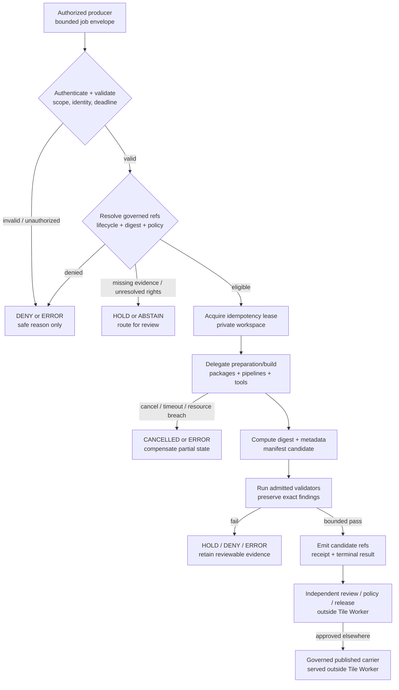

<!-- [KFM_META_BLOCK_V2]
doc_id: kfm://app/workers/src/tile-worker/readme
title: Tile Worker README
type: app-readme
subtype: worker-lane-boundary-readme
version: v0.2
prior_version: v0.1
status: draft; repository-grounded; placeholder-only
owner: "NEEDS VERIFICATION — CODEOWNERS routes default repository review to @bartytime4life; no accepted Tile Worker steward, operations owner, independent reviewer, security owner, or release authority was verified"
created: 2026-06-16
updated: 2026-08-12
policy_label: public
current_path: apps/workers/src/tile_worker/README.md
owning_root: apps/
responsibility: Define the repository-grounded boundary, current scaffold maturity, tile-carrier relationships, non-publisher controls, implementation admission gates, validation burden, correction path, cache-invalidation posture, and rollback requirements for the app-local Tile Worker lane
truth_posture: "CONFIRMED pinned repository bytes and adopted placement authority / PROPOSED future worker contract / UNKNOWN queue, scheduler, deployment, storage, and operational behavior / NEEDS VERIFICATION ownership, permissions, schema authority, policy integration, signing, and release coupling"
evidence_snapshot:
  repository: bartytime4life/Kansas-Frontier-Matrix
  base_ref: main
  base_commit: 079bedbf566ad321b11e278749a188998f430165
  base_tree: ec9204c4eaf6e2b40efa00aa359cb54db87d08ca
  tile_worker_tree: 2dcca2d7ba67407cfad87810df72f85d51713ffa
  target_prior_blob: 2f7e556480d003615e789d42113642d2e619ac45
  entrypoint_blob: 28f3fd3b3327b6398cd514e371f485ed33817001
  workers_readme_blob: 5b5c1e6b067e652a380bf445488a6227028dfc0e
  workers_src_readme_blob: 08ad9f8116f64817ffa4f8b2058613749360c102
  tile_artifact_schema_blob: ed8fb0834c06a6254d6175f9a08b8d17ccc68d71
  pmtiles_validator_readme_blob: 00948c34bc7361e1a86fe5a97ed7e870d854b514
  pmtiles_attestation_workflow_blob: 6b5e73f7361d542de8f43c80e897d16c6b5bca96
  pmtiles_attestation_standard_blob: acf86aa94fb34dcdc8c0687bd823b7ff3b6f6134
  maplibre_package_blob: b0582955feeb51016327113692fa5c98ecad8816
  maplibre_entrypoint_blob: 91664eb00583f9e3d0405eb7954fefa9a48f4ee9
  published_pmtiles_readme_blob: 1b40b18badf10d57ec2cce363770784bae21649e
  explorer_cache_projection_blob: 9e52c7c186ce72d56e2728c8c1a35737fe5f1540
  directory_rules_blob: fd49a0b83e55cef52c1124281f093e263526898d
  root_registry_blob: 024f668b5f0a9239bafa4f8b09e2afd86300ff8c
  codeowners_blob: dd2a84aa514d8ecd9208bc347f90f9a2ed37dd61
  inspection_mode: GitHub connector reads, exact-path probes, bounded repository search, open-pull-request reconciliation, and deterministic Markdown checks
related:
  - ../README.md
  - ../../README.md
  - ../../../README.md
  - ../../../explorer-web/README.md
  - ../../../governed-api/README.md
  - ../../../review-console/README.md
  - ../../../../docs/doctrine/directory-rules.md
  - ../../../../docs/adr/ADR-0029-adopt-directory-governance-standard-v2.md
  - ../../../../docs/doctrine/derived-stays-derived.md
  - ../../../../docs/doctrine/map-first.md
  - ../../../../docs/standards/pmtiles/PMTILES_ATTESTATION_STANDARD.md
  - ../../../../docs/standards/pmtiles/PMIDX_SPEC_V1.md
  - ../../../../contracts/release/tile_artifact_manifest.md
  - ../../../../contracts/runtime/pmtiles_release_cache.md
  - ../../../../schemas/contracts/v1/map/tile_artifact_manifest.schema.json
  - ../../../../tools/validators/pmtiles/README.md
  - ../../../../tools/validators/pmtiles/validate_attestation_bundle.py
  - ../../../../tools/validators/pmtiles/validate_header.py
  - ../../../../tools/validators/pmtiles/verify_merkle.py
  - ../../../../tools/validators/pmtiles/verify_partial_read.py
  - ../../../../tools/attest/sign_pmtiles.py
  - ../../../../fixtures/pmtiles/attestation/README.md
  - ../../../../tests/validators/test_pmtiles_attestation_bundle.py
  - ../../../../.github/workflows/pmtiles-attestation.yml
  - ../../../../packages/maplibre/README.md
  - ../../../../packages/maplibre/src/index.ts
  - ../../../../pipelines/domains/roads-rail-trade/emit_pmtiles_layers.py
  - ../../../../data/published/pmtiles/README.md
  - ../../../explorer-web/src/features/map_runtime/pmtiles_release_cache.ts
  - ../../../explorer-web/tests/pmtiles-release-cache.test.ts
  - ../../../../release/README.md
  - ../../../../policy/README.md
tags:
  - kfm
  - apps
  - workers
  - tile-worker
  - pmtiles
  - mvt
  - tilejson
  - cog
  - derived-artifact
  - evidence
  - policy
  - receipts
  - attestation
  - cache-invalidation
  - non-publisher
  - fail-closed
  - rollback
notes:
  - "v0.2 replaces proposal-heavy worker claims with a current repository-grounded maturity and graduation contract."
  - "The lane contains only this README and one comment-only main.py placeholder at the pinned base."
  - "The repository has meaningful PMTiles structural validators, generated-fixture tests, and a read-only path-scoped workflow elsewhere, but those surfaces retain authority NONE and explicit cryptographic, policy, schema, release, correction, and rollback holds."
  - "The TileArtifactManifest semantic contract is draft and schema-family-unresolved; the existing map-family schema is an empty permissive scaffold."
  - "The reusable MapLibre package and one inspected domain PMTiles emitter remain placeholder-level; the Explorer PMTiles cache evaluator is fixture-only and performs no fetch or cache mutation."
  - "This documentation change adds no worker code, queue wiring, tile bytes, source activation, policy decision, signing, release state, cache mutation, deployment, or publication."
[/KFM_META_BLOCK_V2] -->

<a id="top"></a>

<div align="center">

# Tile Worker

`apps/workers/src/tile_worker/`

**App-local deployment-wrapper boundary for future, asynchronous tile-candidate coordination—without owning source truth, reusable geospatial logic, lifecycle transforms, policy, evidence, signing, release decisions, tile serving, cache mutation, or publication.**

[](#2-repository-grounded-status)
[](#3-authority-and-placement)
[](#6-outputs-and-write-boundary)
[](#4-operating-boundary)
[](#7-tile-carrier-families-and-current-maturity)
[](#13-validation-and-test-strategy)
[](#3-authority-and-placement)

[Purpose](#1-purpose) · [Current state](#2-repository-grounded-status) · [Boundary](#4-operating-boundary) · [Inputs](#5-inputs-and-preflight) · [Outputs](#6-outputs-and-write-boundary) · [Carrier families](#7-tile-carrier-families-and-current-maturity) · [Execution](#8-execution-model) · [Security](#11-security-rights-and-sensitivity) · [Validation](#13-validation-and-test-strategy) · [Graduation](#17-graduation-plan) · [Done](#18-definition-of-done) · [Rollback](#20-maintenance-correction-and-rollback)

</div>

---

> [!IMPORTANT]
> **Current state:** repository-grounded draft / placeholder-only. The directory contains this README and [`main.py`](./main.py); `main.py` is a one-line comment and establishes no executable Tile Worker behavior. No queue consumer, scheduler, tile builder, service loop, package binding, worker-specific test, deployment manifest, service identity, storage capability, or release integration was verified at `main@079bedbf566ad321b11e278749a188998f430165`.

> [!CAUTION]
> A Tile Worker may eventually coordinate bounded **tile-candidate** jobs. It must never treat generated tiles, a valid archive header, a digest, a Merkle root, a manifest, a signature-shaped object, a receipt, a test, a workflow result, a cache entry, a pull request, or a merge as evidence truth, policy approval, release authority, lifecycle promotion, or KFM publication.

> [!NOTE]
> The repository has real PMTiles validation code and generated-fixture tests outside this lane. Their documented success is structural and non-authoritative. Cryptographic signature verification, trusted-key evaluation, canonical `TileArtifactManifest` schema authority, policy execution, release/correction/rollback closure, and publication remain separately held.

> [!NOTE]
> Badge color is presentation only. The plain-text status, evidence snapshot, validation record, and repository bytes control every claim in this README.

---

## 1. Purpose

`apps/workers/src/tile_worker/` is the app-local source lane reserved for a future deployable Tile Worker wrapper.

Its primary responsibility, if implemented, is narrow:

1. receive an authenticated, schema-valid, idempotent tile-build job from an authorized producer;
2. verify that the job references governed, lifecycle-eligible inputs and an admitted carrier profile;
3. enforce policy-returned obligations without inventing policy;
4. delegate reusable geospatial preparation, tiling, packaging, and validation to their owning roots;
5. coordinate finite, receipted candidate outcomes;
6. hand off immutable output references for independent review and release;
7. stop before release approval, public serving, cache mutation, or publication.

The worker is a **deployment wrapper**, not the tile system itself. Accepted Directory Rules place independently deployable processes in `apps/`, reusable non-deployable behavior in `packages/`, executable lifecycle transformations in `pipelines/`, repository-wide validators and builders in `tools/`, declarative run graphs in `pipeline_specs/`, semantic meaning in `contracts/`, machine shape in `schemas/`, admissibility in `policy/`, governed instances in `data/`, and release decisions in `release/`.

### 1.1 One-line operating law

> The Tile Worker may coordinate deterministic, policy-bounded tile-candidate work from declared inputs to finite, receipted outputs; it cannot create truth, approve policy, sign with production authority, promote lifecycle state, release artifacts, mutate public caches, serve tiles, or publish.

### 1.2 Goals

A future implementation should make tile-candidate work:

- deterministic where the admitted toolchain permits;
- idempotent under duplicate delivery, retry, and replay;
- bounded by explicit carrier, layer, spatial, temporal, and resource scope;
- downstream of source identity, evidence, rights, sensitivity, validation, policy, and review state;
- explicit about representation limits and derivation lineage;
- safe against attribute and geometry leakage;
- transparent about finite terminal outcomes and retained holds;
- auditable through receipts and manifests without treating them as proof or release;
- reversible through explicit prior-safe targets and cache-invalidation candidates;
- reusable across domains without collapsing domain meaning or source roles;
- non-networked by default in unit and fixture validation;
- capable of cancellation and safe shutdown without orphaning partial artifacts.

### 1.3 Non-goals

This lane does not exist to:

- ingest external sources;
- normalize canonical domain records;
- define PMTiles, MVT, TileJSON, COG, 3D Tiles, `LayerManifest`, or `TileArtifactManifest` semantics;
- become a second schema, policy, source-registry, receipt, proof, or release home;
- select a canonical attestation profile by implementation convenience;
- decide rights, sensitivity, harmful precision, field allowlists, access, review, or release;
- create or hold production signing keys;
- store production tile bytes inside the worker source tree;
- write directly to `data/published/`, public object storage, CDN aliases, or release manifests;
- become a public tile server, OGC API, browser cache, Service Worker, map renderer, or public API;
- treat PMTiles or another carrier as canonical truth;
- infer support for a carrier merely because documentation or a placeholder exists;
- hide unique reusable tiling logic inside one deployable wrapper;
- silently repair, generalize, redact, simplify, clip, or drop features without a declared transform and receipt;
- make workflow success, branch mergeability, or file presence equivalent to release readiness.

[Back to top](#top)

---

<a id="2-repo-fit"></a>
<a id="11-inspection-path"></a>

## 2. Repository-grounded status

### 2.1 Current profile

| Field | Bounded result |
|---|---|
| Repository snapshot | `main@079bedbf566ad321b11e278749a188998f430165` |
| Repository tree | `ec9204c4eaf6e2b40efa00aa359cb54db87d08ca` |
| Tile Worker tree | `2dcca2d7ba67407cfad87810df72f85d51713ffa` |
| Directory contents | Exactly `README.md` and `main.py` |
| Prior README blob | `2f7e556480d003615e789d42113642d2e619ac45` |
| Entrypoint blob | `28f3fd3b3327b6398cd514e371f485ed33817001` |
| Entrypoint bytes | `# tile_worker entrypoint — greenfield placeholder` plus final newline |
| Executable Python in this lane | None verified |
| Queue, schedule, or event contract | Not found / `UNKNOWN` |
| Producer or consumer wiring | Not found by bounded `tile_worker` search |
| Worker-specific tests | Not found by bounded search |
| Worker-specific workflow | Not found by bounded search |
| Deployment/runtime evidence | `UNKNOWN` |
| Public/release authority | Denied by boundary; no authority verified |
| Review route | Default CODEOWNERS route is `@bartytime4life`; stewardship, independence, and approval remain separate |
| Path-scoped instruction file | No `AGENTS.md` found at repository root, `apps/`, `apps/workers/`, or `apps/workers/src/` |
| Open-PR overlap | No open pull request targeting this exact README was found before the task branch was created |

### 2.2 What is confirmed now

**CONFIRMED from pinned repository bytes:**

- the requested lane exists under the canonical `apps/` responsibility root;
- the target README existed and is being revised in place;
- [`main.py`](./main.py) is comment-only;
- the parent [Workers app](../../README.md) and [Workers source](../README.md) documents classify all eight worker lanes as placeholders and non-publishers;
- accepted [ADR-0029](../../../../docs/adr/ADR-0029-adopt-directory-governance-standard-v2.md) makes [`docs/doctrine/directory-rules.md`](../../../../docs/doctrine/directory-rules.md) the writable Directory Rules authority;
- the machine [Root Registry](../../../../control_plane/root_registry.yaml) projects `apps/` as the canonical home for deployable applications while explicitly denying schema and release-decision authority;
- [CODEOWNERS](../../../../.github/CODEOWNERS) routes default review to `@bartytime4life` and explicitly states that routing is not stewardship, review completion, policy, release, or publication authority;
- bounded `tile_worker` search surfaced this README, its placeholder entrypoint, and parent worker documents, but no executable Tile Worker consumer;
- meaningful tile contracts, schemas, PMTiles validators, fixtures, tests, workflow, published-lane documentation, and fixture-only cache logic exist elsewhere with mixed maturity;
- no inspected adjacent surface establishes Tile Worker wiring.

### 2.3 Adjacent tile and map maturity

| Surface | Pinned evidence | Current bounded interpretation |
|---|---|---|
| [`main.py`](./main.py) | One comment; no imports, functions, classes, statements, or side effects | Tile Worker remains placeholder-only |
| [`packages/maplibre/package.json`](../../../../packages/maplibre/package.json) | Private package `@kfm/maplibre`, version `0.0.0`, no declared dependencies | Package identity exists; production renderer/build capability is not established |
| [`packages/maplibre/src/index.ts`](../../../../packages/maplibre/src/index.ts) | Placeholder comment plus `export const placeholder = true` | Reusable MapLibre package remains scaffold-level |
| [`roads-rail-trade` PMTiles emitter](../../../../pipelines/domains/roads-rail-trade/emit_pmtiles_layers.py) | Docstring-only proposed placeholder | This inspected domain emitter provides no tile-build implementation |
| [`TileArtifactManifest` contract](../../../../contracts/release/tile_artifact_manifest.md) | Draft v0.3 semantic contract; schema family unresolved | Meaning is substantially documented; canonical machine profile remains unselected |
| [`TileArtifactManifest` map schema](../../../../schemas/contracts/v1/map/tile_artifact_manifest.schema.json) | Empty `properties`, `additionalProperties: true`, status `PROPOSED` | The current schema is too permissive to prove contract conformance |
| [`PMTiles Attestation Standard`](../../../../docs/standards/pmtiles/PMTILES_ATTESTATION_STANDARD.md) | Draft v1.2; partial structural implementation confirmed | Defines a proposed chain and explicit unresolved authority holds |
| [`PMTiles validators`](../../../../tools/validators/pmtiles/README.md) | Executable header, Merkle, bundle, partial-read, mobile-fixture, and review-packet validators exist | Bounded structural compatibility checks exist; authority remains `NONE` |
| [`PMTiles tests`](../../../../tests/validators/test_pmtiles_attestation_bundle.py) | Generates temporary valid/invalid archives and many mutation cases | Strong fixture-first conformance surface; not worker, policy, release, or publication proof |
| [`PMTiles workflow`](../../../../.github/workflows/pmtiles-attestation.yml) | Read-only, pinned, no-secret/no-OIDC, path-scoped workflow | Runs structural checks and deliberately denies incomplete candidate authority |
| [`sign_pmtiles.py`](../../../../tools/attest/sign_pmtiles.py) | Writes a development PMSIG shell with an invalid placeholder signature | Production signing is not implemented by this helper |
| [`data/published/pmtiles/`](../../../../data/published/pmtiles/README.md) | Format-specific published-lane index | README and child lanes do not prove payload bytes, release approval, or hosting readiness |
| [`PMTiles cache contract`](../../../../contracts/runtime/pmtiles_release_cache.md) | Proposed-inactive, fixture-only, no Service Worker side effects | Defines bounded cache decision meaning only |
| [`PMTiles cache evaluator`](../../../explorer-web/src/features/map_runtime/pmtiles_release_cache.ts) | Actual deterministic TypeScript evaluator; `authority: NONE`, no fetch, no CacheStorage mutation | Fixture-only planning exists; no browser cache worker or network path is established |
| [`PMTiles cache tests`](../../../explorer-web/tests/pmtiles-release-cache.test.ts) | Replays declared states and asserts no network/cache calls | Executable negative and replay evidence for the fixture-only evaluator |
| [`release/`](../../../../release/README.md) | Separate release decision plane | Tile Worker cannot approve publication or rollback by implication |

### 2.4 PMTiles compatibility boundary

The current PMTiles implementation is meaningful but deliberately incomplete.

**CONFIRMED structural capabilities:**

- exact PMTiles v3 header and bounded metadata inspection;
- archive SHA-256 reconciliation;
- PMIDX chunk-leaf and Merkle-root recomputation;
- bounded range-to-leaf checks;
- split-bundle reconciliation across PMTiles, PMIDX, PMSIG subject shape, and one RunReceipt subject;
- an explicit opt-in `kfm.pmtiles.tile-artifact-manifest.compat.v1` descriptor profile;
- generated valid and invalid fixture families;
- no-network standard-library test behavior;
- workflow-level candidate completeness checks and fail-closed denial.

**CONFIRMED or declared holds:**

- cryptographic PMSIG verification is not wired;
- trusted-key evaluation is not wired;
- range metadata is not authenticated by the current root commitment;
- canonical PMTiles attestation profile is unresolved;
- canonical `TileArtifactManifest` schema family is unresolved;
- declared source refs and generation-tool identifiers are syntax-only in the compatibility profile;
- policy and review are not executed by structural validation;
- release, correction, withdrawal, rollback, and publication are not authorized;
- Brotli and Zstandard metadata are outside the current local compatibility subset.

A future worker must preserve these distinctions. It may call a structural validator, but it must not convert `STRUCTURAL_PASS` or `STRUCTURAL_HOLD` into publication eligibility.

### 2.5 Maturity conclusion

> **Current Tile Worker maturity: `PLACEHOLDER_ONLY`.** The repository has meaningful tile-adjacent structural validation and fixture-only cache logic elsewhere, but no evidence shows that `tile_worker` imports, executes, schedules, consumes, emits, deploys, signs, publishes, serves, or owns any of it.

The correct documentation posture is therefore neither “nothing exists” nor “tile generation is implemented.” The lane has a governed placement and a detailed future admission contract. Some supporting validators and tests are executable, while the worker and key trust/release integrations remain unimplemented or unverified.

### 2.6 README impact

| Dimension | Result |
|---|---|
| Artifact operation | Same-path complete replacement of the existing README |
| Change class | Editorial and additive documentation; no behavioral implementation |
| Modernization intent | Combined semantic correction and evidence-backed presentation |
| Intensity | Showcase, bounded by current repository evidence |
| Direct dependencies changed | None |
| Runtime effect | None |
| Data/evidence/policy/release effect | None |
| Compatibility | Path, document ID, created date, and useful prior semantics preserved |
| Review state | Human review required; draft delivery only |
| Rollback | Restore prior blob or revert the documentation commit |

### 2.7 Last reviewed

- **Date:** 2026-08-12
- **Repository:** `bartytime4life/Kansas-Frontier-Matrix`
- **Base:** `main@079bedbf566ad321b11e278749a188998f430165`
- **Target prior blob:** `2f7e556480d003615e789d42113642d2e619ac45`
- **Inspection:** exact target and entrypoint bytes; parent worker contracts; adopted Directory Rules, ADR, Root Registry, and CODEOWNERS; open-PR overlap; bounded worker reference search; TileArtifactManifest contract and schema; PMTiles standard, validators, fixtures, tests, workflow, and development signing helper; MapLibre package scaffold; one domain PMTiles emitter; published PMTiles lane; Explorer cache contract, evaluator, and tests
- **Not inspected as operational proof:** deployed worker, queue, scheduler, service identity, runtime logs, dashboard, production signing service, storage transaction, CDN/cache provider, public tile serving, policy execution, or release/publication activity

[Back to top](#top)

---

<a id="3-authority-boundary"></a>

## 3. Authority and placement

### 3.1 Directory Rules basis

Accepted ADR-0029 adopts Directory Rules v2. The relevant responsibility split is:

| Responsibility | Owning root | Tile Worker relationship |
|---|---|---|
| Independently deployable background process | `apps/` | This lane may become a thin app-local worker wrapper |
| Reusable non-deployable geospatial logic | `packages/` | Worker delegates; it must not hide reusable tiling logic locally |
| Lifecycle transformation and build orchestration | `pipelines/` | Worker invokes accepted transforms; it does not create a second pipeline engine |
| Declarative run graph, schedule, and resource envelope | `pipeline_specs/` | Worker consumes an accepted specification |
| Repository-wide builders and validators | `tools/` | Worker calls pinned tools through declared interfaces |
| Semantic object meaning | `contracts/` | Worker consumes contracts; it does not redefine manifests locally |
| Machine-checkable shape | `schemas/` | Worker validates against an accepted schema/version |
| Allow, deny, hold, restrict, abstain | `policy/` | Worker enforces decisions and obligations; it does not author policy |
| Lifecycle and accountability instances | `data/` | Worker writes only through explicit capabilities to declared candidate lanes |
| Release, correction, withdrawal, rollback | `release/` | Separate authority plane; worker may provide candidates only |
| Runtime adapters | `runtime/` | Bounded runtime behavior remains outside this worker |
| Deployment, identity, network, secrets | `infra/` | Infrastructure grants least-privilege runtime capability |
| Public map and API surfaces | `apps/explorer-web/`, `apps/governed-api/` | Downstream consumers; no direct worker-to-public path |
| Human adjudication | `apps/review-console/` | Worker may route evidence; it cannot decide review |
| Tests and fixtures | `tests/`, `fixtures/` | Positive and negative conformance evidence |

### 3.2 Placement decision

`apps/workers/src/tile_worker/README.md` already exists in the correct responsibility root for a deployable-process boundary. This modernization is:

> **`PLACE` — same-path update of an existing app-local worker README.**

It creates no root, child directory, schema, contract, policy, source, registry, tile artifact, receipt, proof, release record, cache entry, runtime, deployment, or publication authority.

### 3.3 Bounded context

Within this lane, “Tile Worker” means only the deployable wrapper that coordinates one admitted job.

It does **not** mean:

- all map delivery;
- all PMTiles logic;
- all raster processing;
- all vector simplification;
- all MapLibre behavior;
- the TileArtifactManifest object family;
- the publication pipeline;
- a public tile service;
- a cache controller;
- a signing service;
- a release authority.

This bounded context prevents an app wrapper from absorbing map, domain, lifecycle, policy, evidence, and release responsibilities merely because it invokes related tools.

### 3.4 Belongs here

A future implementation may place here:

- process bootstrap and dependency composition;
- authenticated message or schedule adapter wiring;
- app-local configuration parsing for non-secret references;
- startup, readiness, liveness, graceful shutdown, and safe-disable hooks;
- lease acquisition and renewal wiring;
- translation from an accepted job envelope to reusable package/pipeline/tool interfaces;
- finite result-envelope assembly from dependency outcomes;
- app-local retry, cancellation, and deadline enforcement;
- app-local tests proving delegation, authority limits, and fail-closed behavior;
- safe operator diagnostics that reveal no protected payloads.

### 3.5 Does not belong here

| Concern | Correct home | Reason |
|---|---|---|
| Source fetch, capture, and admission | `connectors/` | Source-specific behavior and rights posture are not app-owned |
| Canonical geometry normalization | `pipelines/` or `packages/` | Reusable lifecycle behavior must remain independently testable |
| General vector/raster tiling algorithm | `packages/`, `pipelines/`, or `tools/` | Avoid unique app-local implementation |
| Declarative schedule or DAG | `pipeline_specs/` | Specification remains distinct from execution |
| PMTiles/MVT/COG/TileJSON meaning | `contracts/`, standards docs | Worker does not define object semantics |
| JSON Schema | `schemas/` | Machine shape authority is separate |
| Rights/sensitivity/publication rules | `policy/` | Worker cannot invent admissibility |
| Production signing keys or key registry | accepted security/release infrastructure | Worker must never own raw key material |
| Candidate or published tile bytes | lifecycle/artifact storage under accepted interfaces | Source tree is not an artifact store |
| Receipts and proofs | `data/receipts/`, `data/proofs/` | Accountability objects remain distinct |
| Release manifest or promotion decision | `release/` | Independent governed state transition |
| Tile serving and public routing | governed API/delivery infrastructure | Background execution is not a public endpoint |
| Browser cache or Service Worker code | Explorer/runtime surfaces | Client cache policy is not worker authority |
| Map styling and rendering | style/MapLibre/UI owners | Renderer remains downstream of released artifacts |

### 3.6 Dependency direction

A future dependency direction should remain:

```text
authorized trigger
    -> apps/workers/src/tile_worker
        -> accepted contracts/schemas/policy clients
        -> packages / pipelines / tools
        -> governed candidate-storage and receipt interfaces
    -> independent validation/review/release
    -> governed delivery
```

The worker must not import a public UI as its domain engine, depend on release instances to define processing semantics, or write back into contracts, schemas, policy, source registries, or canonical evidence.

[Back to top](#top)

---

<a id="4-operating-boundary"></a>

## 4. Operating boundary

### 4.1 Authority matrix

| Action | Tile Worker posture |
|---|---|
| Authenticate a declared producer | May enforce through an accepted adapter |
| Validate job-envelope shape | May call accepted schema validation |
| Resolve a referenced input | May use a least-privilege governed interface |
| Evaluate or obtain policy | May request and enforce; cannot author the outcome |
| Build a candidate artifact | May coordinate through admitted reusable tools |
| Emit a candidate manifest | May coordinate through an accepted contract/schema |
| Emit a run/transform receipt | May coordinate through a governed receipt writer |
| Mark structural validation result | May preserve validator output exactly |
| Decide evidence truth | **DENY** |
| Change source authority | **DENY** |
| Select redaction/generalization ad hoc | **DENY** |
| Create production signature authority | **DENY** |
| Approve review or policy | **DENY** |
| Promote to `PUBLISHED` | **DENY** |
| Write a release manifest or rollback decision | **DENY** |
| Serve tiles to ordinary clients | **DENY** |
| Mutate browser/CDN/public caches directly | **DENY** |
| Publish, deploy, or activate sources | **DENY** |

### 4.2 Non-publisher invariants

A future Tile Worker must preserve all of the following:

1. **Derived stays derived.** A tile carrier is a downstream representation, not canonical truth.
2. **Candidate is not release.** Candidate bytes, manifests, receipts, and tests carry no publication authority.
3. **Structural pass is not policy pass.** Header, digest, Merkle, and shape validation cannot approve public use.
4. **Signature shape is not signature trust.** A PMSIG-shaped object with an invalid development signature is not attestation.
5. **Receipt is not proof.** A receipt records process memory; it does not establish claim truth or release.
6. **Manifest is not payload or release.** A `TileArtifactManifest` references an artifact and trust context; it does not store bytes or approve serving.
7. **Map pixel is not evidence.** A renderer, screenshot, sampled pixel, or visible feature is not an EvidenceBundle.
8. **Cache hit is not release.** A cached artifact remains bound to release, artifact, and policy identity.
9. **Job success is not lifecycle promotion.** The worker may complete without changing authoritative state.
10. **Watcher is not publisher.** Triggering from a change detector cannot collapse review and release.
11. **No hidden public path.** Ordinary clients receive only released, public-safe carriers through governed interfaces.
12. **No silent transform.** Simplification, clipping, field filtering, generalization, reprojection, rasterization, or dropping must be declared and receipted.
13. **No authority upgrade on retry.** Retry cannot convert a prior hold or deny into allow without new governing evidence.
14. **No destructive cleanup as compensation.** Partial-artifact handling must preserve audit and correction needs.
15. **No release by path.** Writing to a directory named `published` or `release` is not a governed state transition.

### 4.3 Source-role and support-type anti-collapse

The worker must not collapse:

- observation into model;
- model into authoritative measurement;
- historic interpretation into modern observation;
- generalized public geometry into exact canonical geometry;
- raster class into vector boundary truth;
- tile-derived feature properties into source-record completeness;
- a domain-specific field allowlist into a global allowlist;
- a stale artifact into a current artifact because the layer ID is unchanged;
- a style filter into a policy redaction;
- a client-side hidden feature into a safely transformed artifact;
- a candidate carrier into an EvidenceBundle;
- a map release into a source release.

When a requested carrier or support type is ambiguous, the worker must hold or reject rather than infer.

[Back to top](#top)

---

## 5. Inputs and preflight

### 5.1 Current inputs and outputs

| Surface | Current state | Truth |
|---|---|---|
| CLI arguments | None implemented | CONFIRMED |
| Imported Python APIs | None implemented | CONFIRMED |
| Queue messages | No consumer or message binding present | CONFIRMED |
| Schedules or event triggers | No registration present under this lane | CONFIRMED |
| Environment variables or secret references | None read by the placeholder | CONFIRMED |
| Filesystem, database, object-store, API, or tool inputs | No code path present | CONFIRMED |
| Tile candidates or manifests | None emitted | CONFIRMED |
| Receipts, proofs, signatures, logs, or metrics | None emitted by this source | CONFIRMED |
| Public cache or serving mutation | None implemented | CONFIRMED |

### 5.2 Proposed future job envelope

No canonical Tile Worker job schema was verified. The following is a **PROPOSED minimum contract**, not a claim about current implementation:

| Field family | Required meaning |
|---|---|
| Contract identity | Stable job-contract ID and version |
| Job identity | Deterministic `job_id`, `run_id`, `attempt_id`, and idempotency key |
| Producer | Authenticated producer identity, role, and allowed operation |
| Trigger | Queue, schedule, manual review, or dependency event with replay posture |
| Operation | Finite admitted operation such as build candidate, validate candidate, or invalidate candidate |
| Carrier profile | Exact accepted profile/version; no generic “tiles” shortcut |
| Input refs | Immutable or digest-bound refs to lifecycle-eligible inputs |
| Source/evidence refs | Source role, EvidenceRef requirements, and declared limitations |
| Layer refs | Layer identity, field allowlist, geometry class, and representation obligations |
| Spatial scope | CRS, bounds, tile matrix, zoom limits, clipping/generalization profile |
| Temporal scope | Valid/observed/source/retrieval/release windows as applicable |
| Rights and sensitivity | Governing decision refs and mandatory transforms |
| Build spec | Canonicalized build-spec ref plus `spec_hash` |
| Toolchain | Pinned builder/validator identities and versions |
| Output capability | Exact candidate lane and allowed object families |
| Resource envelope | CPU, memory, disk, file count, output bytes, duration, and cancellation deadline |
| Receipt target | Governed receipt-writer interface and required subjects |
| Prior-safe target | Correction, supersession, or rollback reference when relevant |
| Policy refs | Decision IDs, obligations, expirations, and reason codes |
| Trace context | Correlation ID and safe diagnostics context |

### 5.3 Startup admission gates

A future process must fail readiness when any mandatory startup dependency is unresolved:

- accepted job contract and schema;
- allowed producer registry or authenticated transport;
- least-privilege service identity;
- non-secret configuration profile;
- external secret references and secret provider;
- admitted build and validator toolchain;
- writable candidate target and atomic staging behavior;
- receipt writer and durable result target;
- policy client or local verified bundle, where required;
- cancellation and safe-disable mechanism;
- resource limit enforcement;
- metrics/log sinks with redaction;
- rollback or disable runbook;
- operator ownership and escalation path.

A readiness check must not test by writing public artifacts or using production signing keys.

### 5.4 Per-job preflight gates

Before material work, the worker should verify in this order:

1. parse the bounded envelope without executing embedded content;
2. reject undeclared fields when the accepted schema is closed;
3. authenticate the producer and operation;
4. verify job/run/attempt and idempotency identities;
5. enforce deadline, retry budget, and resource envelope;
6. resolve input refs without path traversal or mutable-latest shortcuts;
7. verify lifecycle eligibility and content digests;
8. resolve source roles, rights, sensitivity, and policy obligations;
9. verify carrier profile, CRS, bounds, zoom, temporal scope, and field allowlist;
10. verify build-spec canonicalization and `spec_hash`;
11. verify toolchain identity and version;
12. confirm candidate output capability and atomic staging;
13. confirm receipt and terminal-result destinations;
14. acquire a lease or deduplication lock;
15. start material work only after all required gates pass.

### 5.5 Prohibited inputs

The worker must reject or hold:

- raw credentials or signing keys in a job payload;
- arbitrary shell command strings;
- untrusted executable code or templates;
- mutable `latest` input refs without release-bound resolution;
- direct public URLs to canonical/internal stores;
- path traversal, absolute host paths, device paths, or symlink escapes;
- undeclared network endpoints;
- unbounded archives or compressed payloads;
- embedded tile bytes inside a manifest or control envelope;
- exact sensitive coordinates without approved transform obligations;
- unresolved rights, source role, or policy state;
- unsupported CRS, tile matrix, compression, carrier profile, or geometry class;
- a request to bypass validation, signing, review, release, or rollback;
- a cache-mutation instruction masquerading as a build job;
- a request that conflates candidate generation with publication.

[Back to top](#top)

---

## 6. Outputs and write boundary

### 6.1 Candidate outputs a future worker may coordinate

Subject to accepted contracts and capabilities, a future worker may coordinate:

- immutable candidate tile archives in an approved WORK or candidate artifact lane;
- digest and byte-size reports;
- candidate `TileArtifactManifest` instances;
- build/transform receipts;
- validator reports;
- source/layer lineage references;
- PMTiles PMIDX sidecars and PMSIG **candidates**;
- review-packet references;
- candidate cache-invalidation plans;
- candidate correction/supersession maps;
- dead-letter or hold records with safe reason codes;
- terminal result envelopes;
- metrics and redacted structured logs.

Each output must state its object family and authority level. A file extension or directory name must not determine authority.

### 6.2 Outputs the worker must not create as authority

- `EvidenceBundle` truth;
- source admission decisions;
- policy allow/deny decisions authored locally;
- review approvals;
- production signing-key registrations;
- promotion decisions;
- release manifests as approved records;
- rollback execution decisions;
- withdrawal authority;
- public aliases such as `latest`;
- direct public URLs;
- public cache entries;
- deployed MapLibre sources or styles;
- ordinary-client API responses;
- published tiles;
- claims that an artifact is public-safe without governing evidence.

### 6.3 Transaction pattern

A safe candidate build should use an explicit transaction pattern:

```text
reserve deterministic run identity
    -> create private temporary workspace
    -> materialize only allowed inputs
    -> build candidate under resource limits
    -> fsync/close candidate bytes
    -> compute digest and bounded metadata
    -> run structural/domain/policy-required validators
    -> prepare manifest and receipt candidates
    -> atomically commit candidate references
    -> emit terminal result
    -> release lease
```

The worker should not expose partially written archives under stable names. If the storage interface cannot provide atomic commit semantics, the contract must define staging markers, completion markers, orphan detection, and compensation.

### 6.4 Write-capability matrix

| Target | Default | Admission requirement |
|---|---|---|
| Private temporary workspace | Allow, bounded | Per-run isolation, quotas, cleanup rules |
| Approved WORK/candidate lane | Hold until explicit capability | Contract, policy, service identity, atomicity, retention |
| `data/processed/` | Deny by default | Separate lifecycle transition authority |
| `data/catalog/` | Deny by default | Catalog owner and closure contract |
| `data/receipts/` | Through governed writer only | Accepted receipt contract and writer capability |
| `data/proofs/` | Deny direct write | Proof owner and validation/review closure |
| `release/` | Deny | Separate release authority |
| `data/published/` | Deny | Governed promotion and release required |
| Public object store/CDN | Deny | Separate release/deployment process |
| Browser/Service Worker cache | Deny | Client/runtime authority |
| Source registry | Deny | Source-admission authority |
| Contracts/schemas/policy | Deny | Authoring occurs through reviewed repository changes, not runtime jobs |

[Back to top](#top)

---

## 7. Tile-carrier families and current maturity

The term “tile” spans different carrier families. A future worker must use an explicit accepted profile and must not claim generic coverage.

### 7.1 PMTiles

**Current repository evidence:** PMTiles has the strongest inspected structural validation surface.

Current checks cover a bounded subset of:

- PMTiles v3 header and metadata;
- MVT tile type;
- XYZ scheme in the declared compatibility profile;
- WGS 84 bounds narrowed to the Web-Mercator latitude envelope;
- min/max zoom;
- vector-layer IDs and field maps;
- SHA-256 archive digest;
- `spec_hash`;
- PMIDX leaf/root reconciliation;
- PMSIG subject shape;
- one RunReceipt subject;
- explicit candidate completeness;
- generated mutation fixtures.

Current checks do **not** establish:

- generic PMTiles v3 compatibility;
- Brotli or Zstandard metadata support in the local reader;
- trusted cryptographic signature;
- approved key registry;
- canonical manifest schema conformance;
- rights/sensitivity policy pass;
- release/correction/rollback closure;
- public-serving eligibility.

A Tile Worker may eventually call these validators. It must preserve every hold and must not relabel `authority: NONE`.

### 7.2 MVT and TileJSON

MVT and TileJSON are related but distinct:

- MVT carries tiled vector feature data;
- TileJSON describes access and metadata;
- PMTiles may package MVT;
- a `LayerManifest` defines a governed KFM layer relationship;
- a `TileArtifactManifest` describes a tile artifact by ref/digest and trust context.

A future worker must verify:

- declared vector-layer IDs;
- field allowlist and type map;
- geometry types;
- extent and clipping behavior;
- simplification and minimum-feature rules;
- zoom-dependent field/geometry exposure;
- tile matrix and scheme;
- bounds and center semantics;
- attribution and rights;
- stable feature identity where interaction depends on it;
- compatibility with governed renderer and API contracts.

Client rendering success does not prove semantic completeness or public safety.

### 7.3 Raster tiles and COG-derived carriers

Raster carriers can encode continuous measurements, categorical surfaces, imagery, hillshade, or model output. They must not be treated as interchangeable.

A future worker must distinguish:

- observation raster from model raster;
- source imagery from interpreted classification;
- categorical values from continuous values;
- nodata from zero;
- mask from policy redaction;
- resampling method and its consequences;
- source resolution from output resolution;
- color ramp from measurement;
- COG source artifact from derived tile cache;
- temporal composite from single observation;
- public-safe overview from exact source pixel access.

COG or raster support remains **NEEDS VERIFICATION** for this worker. No inspected worker or shared tile builder establishes it.

### 7.4 3D Tiles, terrain, point clouds, and synthetic scenes

3D carriers require separate admission because they can reveal vertical detail, infrastructure, archaeology, private property, or reconstruction assumptions.

A future worker must not infer 3D support from MapLibre documentation. It needs:

- accepted carrier and plugin profile;
- scene/asset contract;
- 3D admission decision where required;
- public-safe geometry and level-of-detail policy;
- reality-boundary or interpretation note for synthetic content;
- provenance and transform receipts;
- resource and browser budgets;
- 2D evidence parity;
- negative tests for precise sensitive geometry;
- release and rollback support.

No current Tile Worker implementation or inspected reusable package proves 3D build capability.

### 7.5 Style, sprites, and glyphs

Styles, sprites, and glyphs are tile-adjacent delivery dependencies, not tile truth. A worker must not:

- embed secrets or internal URLs in style JSON;
- use style filtering as policy redaction;
- claim a layer is complete because its style renders;
- publish glyph or sprite dependencies without release binding;
- permit a cache hit when required companion assets are missing;
- change semantic field meaning through style expressions.

### 7.6 Public cache and release-scoped identity

The inspected Explorer cache evaluator demonstrates an important boundary:

```text
cache key = release identity + artifact digest + policy digest
```

It returns finite `PASS`, `HOLD`, `DENY`, or `ERROR` outcomes while keeping:

- `authority: NONE`;
- `cacheMutated: false`;
- `networkRequested: false`.

This logic is fixture-only. A future Tile Worker may emit a cache-invalidation **candidate** after correction or supersession, but it must not mutate browser, Service Worker, CDN, or public caches directly unless a separately accepted architecture explicitly grants that capability.

### 7.7 Carrier admission matrix

| Carrier/profile | Current worker support | Adjacent evidence | Worker posture |
|---|---|---|---|
| PMTiles v3/MVT compatibility subset | Not wired | Structural validators/tests/workflow exist | PROPOSED future adapter; preserve holds |
| Generic PMTiles v3 | Not established | Local compression/profile limits documented | HOLD |
| MVT directory/archive | Not established | Standards/contract references exist | NEEDS VERIFICATION |
| TileJSON | Not established | Semantic references exist | NEEDS VERIFICATION |
| Raster tile archive | Not established | Documentation exists elsewhere | NEEDS VERIFICATION |
| COG-derived tiles | Not established | COG validators exist elsewhere, not inspected as worker wiring | NEEDS VERIFICATION |
| Terrain/DEM | Not established | Map doctrine only for this lane | HOLD pending profile |
| OGC 3D Tiles/glTF | Not established | Separate map/3D contracts may exist | HOLD pending governance |
| Point clouds | Not established | No worker implementation verified | HOLD |
| Style/sprite/glyph package | Not established | Cache fixture expects companion completeness | NEEDS VERIFICATION |
| Public tile serving | None | Separate delivery surfaces exist | DENY for this worker |
| Public cache mutation | None | Fixture-only planner explicitly avoids mutation | DENY for this worker |

[Back to top](#top)

---

## 8. Execution model

### 8.1 Governed candidate flow


```mermaid
flowchart TD
    A["Authorized producer<br/>bounded job envelope"] --> B{"Authenticate + validate<br/>scope, identity, deadline"}
    B -->|invalid / unauthorized| Z["DENY or ERROR<br/>safe reason only"]
    B -->|valid| C{"Resolve governed refs<br/>lifecycle + digest + policy"}
    C -->|missing evidence / unresolved rights| H["HOLD or ABSTAIN<br/>route for review"]
    C -->|denied| Z
    C -->|eligible| D["Acquire idempotency lease<br/>private workspace"]
    D --> E["Delegate preparation/build<br/>packages + pipelines + tools"]
    E -->|cancel / timeout / resource breach| X["CANCELLED or ERROR<br/>compensate partial state"]
    E --> F["Compute digest + metadata<br/>manifest candidate"]
    F --> G["Run admitted validators<br/>preserve exact findings"]
    G -->|fail| Q["HOLD / DENY / ERROR<br/>retain reviewable evidence"]
    G -->|bounded pass| R["Emit candidate refs<br/>receipt + terminal result"]
    R --> S["Independent review / policy / release<br/>outside Tile Worker"]
    S -->|approved elsewhere| P["Governed published carrier<br/>served outside Tile Worker"]
```

### 8.2 Plain-text equivalent

1. An authorized producer submits a bounded job envelope.
2. The worker authenticates the producer and validates shape, operation, identity, deadline, retry, and resource scope.
3. The worker resolves governed refs, digests, lifecycle eligibility, policy obligations, rights, sensitivity, and carrier profile.
4. Missing or denied prerequisites stop before material work.
5. The worker acquires an idempotency lease and creates an isolated temporary workspace.
6. The worker delegates reusable transforms and build operations to admitted implementations.
7. The worker computes artifact identity and calls required validators.
8. Findings are preserved exactly; structural success does not upgrade authority.
9. The worker atomically commits candidate references and process receipts.
10. Independent review, policy closure, signing, promotion, release, serving, and publication occur outside this worker.
11. Cancellation, failure, correction, or supersession produces explicit, auditable candidate outcomes.

### 8.3 Proposed finite worker outcomes

No canonical Tile Worker result contract exists. A future contract should define a finite vocabulary. A reasonable **PROPOSED** set is:

| Outcome | Meaning | Authority |
|---|---|---|
| `PASS` | Declared worker step completed under its bounded contract | No release authority |
| `NO_OP` | Deterministic duplicate or already-satisfied candidate | No mutation beyond allowed receipt/result |
| `HOLD` | Checkable prerequisite is unresolved | Route for review; do not guess |
| `ABSTAIN` | Evidence/scope cannot support the requested operation | No artifact claim |
| `DENY` | Policy, authorization, sensitivity, or invariant blocks work | No retry without changed governing state |
| `ERROR` | Operational or parser/tool failure | Safe diagnostic; may be retryable by class |
| `CANCELLED` | Deadline, operator, shutdown, or supersession stopped work | Partial state compensated |
| `STALE` | Input or decision changed before commit | Re-resolve; do not publish old output |

These labels must be reconciled with accepted parent/result contracts before implementation. A dependency’s result must not be silently renamed to a stronger outcome.

[Back to top](#top)

---

## 9. Deterministic identity, idempotency, and replay

### 9.1 Identity layers

A future implementation should keep these identities distinct:

| Identity | Purpose |
|---|---|
| `job_id` | Stable logical request identity |
| `run_id` | One execution of the logical request |
| `attempt_id` | One retry attempt |
| idempotency key | Deduplicate equivalent requests |
| input content digests | Pin exact bytes/records |
| build-spec hash | Pin canonical build parameters |
| toolchain identity | Pin builder and validator versions |
| artifact digest | Identify exact output bytes |
| manifest ID | Identify metadata/trust context |
| receipt ID | Identify process-memory record |
| release ID | Identify separate governed release |
| correction/supersession ID | Preserve change lineage |

A filename, path, URL, layer ID, or timestamp alone is not sufficient identity.

### 9.2 Idempotency key

A deterministic key should include, as applicable:

```text
job-contract version
+ admitted operation
+ carrier profile/version
+ ordered input identities and digests
+ layer/field/geometry profile
+ spatial and temporal scope
+ canonical build-spec hash
+ toolchain identity
+ policy-decision/obligation identity
+ requested candidate target
```

It should not include secrets or unstable wall-clock values.

### 9.3 Duplicate behavior

For an identical accepted key:

- if a completed candidate and receipt still reconcile, return `NO_OP` or a stable prior result;
- if an active lease exists, return or wait according to contract without starting a competing build;
- if a prior attempt failed retryably, create a new `attempt_id` under the same logical `run_id` or accepted retry model;
- if governing inputs changed, create a new key rather than mutating history;
- if prior output was withdrawn or superseded, do not resurrect it through cache or deduplication;
- if artifact bytes differ for the same deterministic key, treat this as drift and hold.

### 9.4 Replay verification

A replay test should prove:

- same declared inputs and toolchain produce the same artifact digest where determinism is promised;
- nondeterministic metadata is excluded, normalized, or explicitly receipted;
- feature ordering and archive metadata ordering are stable;
- locale, timezone, hash seed, thread count, and environment-sensitive behavior are controlled;
- output variance is finite and declared where byte identity cannot be promised;
- replay never changes release state;
- a mismatch produces a stable finding and preserved candidate evidence.

### 9.5 Drift categories

| Drift | Example | Default outcome |
|---|---|---|
| Input drift | Source digest changed | `STALE` or new job identity |
| Spec drift | `spec_hash` changed | New candidate; prior result not reused |
| Toolchain drift | Builder version changed | New candidate and replay review |
| Policy drift | Policy digest/obligations changed | Re-evaluate; old cache/candidate not assumed safe |
| Schema drift | Contract/schema version changed | Hold until compatibility path is declared |
| Artifact drift | Same key produces different digest | `HOLD` / deterministic-replay failure |
| Release drift | Release withdrawn/superseded | Deny reuse and emit invalidation candidate |
| Cache drift | Cache key mismatches release/artifact/policy | `DENY` |

[Back to top](#top)

---

## 10. Retry, cancellation, shutdown, and partial failure

### 10.1 Failure classes

| Class | Example | Default handling |
|---|---|---|
| Permanent input | Invalid schema, unsupported carrier, bad CRS | `DENY` or `ERROR`; no blind retry |
| Authorization/policy | Producer denied, rights unresolved | `DENY` or `HOLD`; retry only after new decision |
| Evidence/scope | Missing required refs or temporal support | `ABSTAIN` or `HOLD` |
| Transient dependency | Temporary object-store or queue failure | Bounded retry with jitter |
| Resource | Memory, disk, CPU, output-size, file-count breach | Cancel, compensate, stable reason |
| Tool crash | Builder exits unexpectedly | Capture safe diagnostic; bounded retry by class |
| Determinism | Replay digest mismatch | `HOLD`; preserve both evidence sets |
| Cancellation | Operator, deadline, supersession | Stop cooperatively; compensate |
| Shutdown | Lease-aware process termination | Stop intake; finish/abort safely |
| Commit failure | Candidate bytes written but result not committed | Reconcile or quarantine orphan; never expose |
| Receipt failure | Candidate exists but receipt commit failed | Hold candidate; no release eligibility |

### 10.2 Retry rules

A future retry policy should:

- use a finite attempt budget;
- distinguish permanent from transient errors;
- respect the original deadline;
- reuse the same logical idempotency identity;
- never skip preflight on retry;
- re-resolve policy and lifecycle state when the contract requires it;
- avoid retry storms through jitter and concurrency limits;
- preserve attempt-level receipts;
- stop when an operator or supersession signal cancels the job;
- never turn a deny into a pass merely because time elapsed.

### 10.3 Cancellation

Cancellation must be cooperative and observable:

1. stop accepting new work for the run;
2. signal the builder/tool process;
3. wait for a bounded grace period;
4. terminate remaining child processes safely;
5. close files and release resources;
6. mark staging outputs incomplete;
7. emit a cancellation result and attempt receipt;
8. release the lease;
9. route orphaned material for cleanup/review;
10. avoid deleting evidence needed for incident or correction review.

### 10.4 Graceful shutdown

A process shutdown should:

- fail readiness before stopping;
- stop queue intake or schedule claims;
- preserve lease ownership until work is safely settled;
- finish only operations that can complete within the grace period;
- avoid acknowledging a message before durable result commit;
- emit no success for incomplete work;
- flush safe logs and metrics;
- release leases;
- exit nonzero when contractually required.

### 10.5 Partial artifacts

Partial archives and sidecars must:

- remain private and explicitly incomplete;
- use non-stable staging names;
- never be indexed by public aliases;
- be distinguishable from completed candidates;
- have bounded retention;
- be reconciled on restart;
- be removed only through an auditable cleanup policy;
- preserve incident evidence when integrity or security is in question.

### 10.6 Compensation

Compensation may include:

- remove or quarantine a temporary object;
- clear a staging marker;
- release a reservation;
- emit an orphan record;
- invalidate a candidate ref;
- route a correction task.

Compensation must not:

- delete canonical source or evidence;
- alter policy/review/release decisions;
- silently replace an artifact;
- mark a failed build successful;
- publish a prior artifact;
- hide an integrity mismatch.

[Back to top](#top)

---

## 11. Security, rights, and sensitivity

### 11.1 Threat model

A future Tile Worker processes data that may be large, spatially precise, externally sourced, toolchain-dependent, and publication-adjacent. Material threats include:

- malicious job payloads;
- path traversal and symlink attacks;
- command/argument injection;
- decompression bombs;
- archive parser abuse;
- unbounded feature or raster size;
- denial of service through zoom/extent combinations;
- sensitive geometry or attribute leakage;
- source URL leakage;
- mutable artifact substitution;
- toolchain or dependency compromise;
- untrusted plugin execution;
- signing-key exposure;
- receipt/log injection;
- public cache poisoning;
- stale-release resurrection;
- confused-deputy writes;
- cross-tenant workspace reuse;
- unauthorized network egress.

### 11.2 Input and process hardening

An implementation should:

- parse a closed, size-bounded envelope;
- use allowlisted operations and carrier profiles;
- pass tool arguments as arrays, never concatenated shell strings;
- run builders in isolated, least-privilege environments;
- deny privileged containers and host mounts;
- use read-only inputs where possible;
- enforce file, feature, pixel, zoom, memory, CPU, disk, and duration limits;
- reject symlinks and path escapes;
- pin toolchain versions and verify their provenance;
- disable network by default;
- allow only declared egress through a controlled adapter when required;
- scan generated metadata for internal paths, credentials, private URLs, and control characters;
- use private temporary directories with restrictive permissions;
- avoid sharing workspaces between runs;
- treat embedded metadata and field names as untrusted text.

### 11.3 Sensitive geometry

Client-side hiding is not redaction. Before a public-safe carrier is eligible, sensitive geometry must be transformed upstream under policy.

Examples requiring fail-closed treatment include:

- archaeology and cultural sites;
- rare-species occurrences;
- critical infrastructure;
- private wells or facilities;
- living-person and land/title joins;
- genomic or genealogy-linked locations;
- private property detail;
- precise field observations;
- security-sensitive elevation or interior detail.

The worker may enforce a supplied approved transform profile. It must not invent buffer distances, rounding, aggregation, field removal, or zoom thresholds.

### 11.4 Attribute exposure

A tile field allowlist must be explicit and versioned. The worker should fail closed when:

- a source field appears that is not allowlisted;
- a field type changes;
- a field contains precise coordinates or internal IDs;
- a free-text field may contain sensitive or personal data;
- a null/suppression code is misinterpreted;
- a domain-specific classification is mapped to a generic public label without review;
- metadata exposes source locators, internal paths, or embargo details;
- vector-layer field maps differ from the declared manifest.

### 11.5 Rights and attribution

Before candidate eligibility, the worker should require references that resolve:

- source identity and authority role;
- license or terms;
- redistribution permission;
- derivative permission;
- required attribution;
- access class;
- embargo;
- prohibited uses;
- update/correction obligations;
- required public caveats.

Unknown rights must hold or deny. A technically valid tile is not releasable when terms are unresolved.

### 11.6 Signing boundary

The worker must not hold production private keys in repository configuration or job payloads.

A production signing design must separately establish:

- accepted signature format;
- key custody;
- signer identity and authorization;
- trusted-key registry;
- rotation and revocation;
- validity windows;
- offline behavior;
- cryptographic verification;
- audit receipts;
- separation of builder and release signer where required;
- incident response.

The inspected `sign_pmtiles.py` creates a development placeholder signature. A future worker must not treat it as a production signer.

### 11.7 Logs and diagnostics

Logs must exclude:

- raw source payloads;
- tile bytes;
- feature properties;
- exact sensitive coordinates;
- credentials, tokens, keys, or secret refs;
- internal hostnames and private URLs;
- signed payload bodies;
- EvidenceBundle contents;
- policy-sensitive reason detail;
- host filesystem paths;
- prompts or generated private text.

Safe fields may include:

- contract/profile version;
- opaque job/run/attempt IDs;
- outcome and stable reason code;
- duration and bounded resource totals;
- carrier class;
- artifact digest prefix only when approved;
- validator version;
- retry count;
- redacted dependency class;
- correlation ID.

[Back to top](#top)

---

## 12. Observability, receipts, and health

### 12.1 Observability is not authority

Metrics, logs, traces, dashboards, and alerts help operate the worker. They do not prove:

- source truth;
- EvidenceBundle closure;
- policy approval;
- public safety;
- release;
- publication;
- correction completion;
- rollback completion.

A green dashboard cannot upgrade a held artifact.

### 12.2 Proposed metrics

| Metric | Purpose | Safety note |
|---|---|---|
| jobs received/completed by finite outcome | Throughput and failure posture | No payload labels |
| queue age or schedule lag | Backlog health | No source details |
| active leases | Concurrency health | Opaque IDs only |
| build duration | Capacity planning | Bucketed |
| input/output byte totals | Resource planning | Aggregate only |
| feature/tile counts | Capacity and anomaly detection | Avoid sensitive layer labels |
| retry count | Dependency health | Stable class only |
| cancellation count | Operator/deadline health | No protected reason |
| deterministic replay mismatch | Integrity signal | High severity; no raw bytes |
| orphan/partial candidate count | Cleanup/recovery signal | Internal only |
| policy/rights hold count | Governance health | Do not expose sensitive reasons publicly |
| cache-invalidation candidate count | Correction propagation | Candidate only |
| receipt commit failures | Accountability health | High severity |
| validator findings by stable code | QA trend | Avoid free-text payload |

### 12.3 Receipt posture

A process receipt should record, as permitted:

- job/run/attempt IDs;
- contract/schema/policy/profile versions;
- input refs and digests;
- toolchain identity;
- canonical build-spec hash;
- start/end times;
- declared resource envelope and measured totals;
- output refs and digests;
- exact dependency outcomes;
- retry/cancellation state;
- safe finding codes;
- prior-safe/correction refs.

A receipt must not claim:

- that source content is true;
- that public exposure is allowed;
- that a signature is trusted without verification;
- that a release occurred;
- that a cache was invalidated;
- that rollback executed;
- that review was approved.

### 12.4 Health endpoints

A future worker may expose internal health signals, but not a public application endpoint.

| Signal | Meaning |
|---|---|
| Liveness | Process event loop is responsive |
| Readiness | Mandatory startup dependencies and safe-disable state permit new jobs |
| Draining | Process is shutting down and accepts no new work |
| Degraded | Optional dependency unavailable; job admission may be narrowed |
| Hold | Mandatory governance or capability dependency unresolved |

Readiness must fail when the process cannot preserve its authority boundary or durable result semantics.

### 12.5 Alerts

Operational alerts should target:

- repeated deterministic mismatch;
- orphaned completed bytes without receipt/result;
- receipt writer failure;
- lease leakage;
- retry storm;
- resource-limit breach;
- unexpected network egress;
- unsupported carrier/compression spike;
- policy service unavailable;
- signing/verification service unavailable;
- public-path or cache-mutation attempt;
- stale or withdrawn release reuse attempt.

Alerts remain internal and must not expose sensitive job details.

[Back to top](#top)

---

## 13. Validation and test strategy

### 13.1 Documentation checks for this README

This document should pass:

- UTF-8 and LF normalization;
- one final newline;
- one H1;
- no skipped heading levels;
- balanced fenced blocks with language tags;
- structurally consistent tables;
- unique explicit anchors;
- internal-fragment resolution;
- repository-relative link resolution;
- KFM Meta Block v2 presence and parse;
- no tabs or trailing whitespace;
- bounded secret/private-key marker scan;
- Markdown parser acceptance;
- changed-area documentation workflows.

These checks prove document structure only. They do not prove worker implementation or tile release readiness.

### 13.2 Future unit tests

Unit tests should cover:

- envelope parsing and size limits;
- producer and operation allowlists;
- deterministic idempotency key;
- deadline and retry budget;
- resource-envelope enforcement;
- profile/CRS/bounds/zoom validation;
- field allowlist behavior;
- digest and `spec_hash` reconciliation;
- dependency-result preservation;
- safe reason-code mapping;
- no secret/sensitive reflection;
- cancellation state transitions;
- lease ownership;
- duplicate/no-op behavior;
- partial-workspace cleanup;
- cache-invalidation candidate generation;
- no public/release write capabilities.

### 13.3 Contract and schema tests

Before implementation:

- accepted job and result contracts exist;
- paired schemas are closed where appropriate;
- valid and invalid fixtures exercise all required fields and invariants;
- schema version changes have compatibility fixtures;
- unknown fields fail as intended;
- identity and ref syntax is deterministic;
- `TileArtifactManifest` schema authority is resolved or the worker remains held;
- policy and receipt refs are machine-checkable;
- reason codes are finite and documented.

### 13.4 Integration tests

Fixture-only integration tests should prove:

1. authorized synthetic job reaches candidate output;
2. unauthorized producer is denied before material work;
3. unresolved rights hold before build;
4. unsupported carrier/profile holds;
5. sensitive field/geometry is denied without an approved transform;
6. deterministic replay produces the promised result;
7. digest mismatch fails closed;
8. structural validator holds are preserved;
9. production-placeholder signature is rejected;
10. receipt failure prevents candidate eligibility;
11. duplicate delivery does not build twice;
12. cancellation leaves no stable partial artifact;
13. shutdown does not acknowledge incomplete work;
14. candidate output cannot reach `release/` or `data/published/`;
15. network access is absent unless explicitly admitted;
16. logs contain no payload, secret, internal path, or protected coordinate;
17. cache-invalidation output is a candidate, not an executed mutation;
18. withdrawn release cannot be reused.

### 13.5 Security tests

Include negative tests for:

- path traversal;
- symlink escape;
- absolute path;
- shell metacharacters;
- control characters and bidirectional text;
- oversized JSON;
- archive bombs;
- too many files/features/tiles;
- extreme zoom/extent combinations;
- malicious metadata;
- untrusted plugin/tool path;
- unsupported compression;
- mutable URL/ref substitution;
- internal URL exposure;
- exact sensitive-coordinate leakage;
- free-text PII;
- key/token marker reflection;
- unauthorized egress;
- cache poisoning;
- stale-release resurrection.

### 13.6 PMTiles-specific tests

Reuse and extend the repository’s fixture-first PMTiles surface without absorbing it into the worker.

A worker adapter should test:

- complete structural bundle;
- missing PMIDX/PMSIG/RunReceipt;
- header mismatch;
- archive digest mismatch;
- leaf/root mismatch;
- range mismatch;
- `spec_hash` mismatch;
- artifact-ref mismatch;
- manifest undeclared field;
- embedded payload denial;
- vector-layer duplicate or field-map mismatch;
- bounds/zoom mismatch;
- unsupported metadata compression;
- signature placeholder rejection;
- authority remains `NONE`;
- cryptographic/policy/release holds remain visible;
- worker does not claim canonical schema conformance.

### 13.7 End-to-end acceptance

A later end-to-end proof should be offline and synthetic first:

```text
synthetic processed layer
    -> accepted tile job
    -> deterministic candidate build
    -> structural/domain validators
    -> candidate manifest + receipt
    -> independent policy/review/release dry run
    -> released test artifact in isolated test scope
    -> governed resolver
    -> headless render check
    -> correction/supersession
    -> cache-invalidation plan
    -> rollback drill
```

No live source, public route, production key, or production cache is required for the first proof.

### 13.8 CI coupling

A future Tile Worker workflow should be path-scoped, read-only for pull requests, pinned to immutable actions, no-secret/no-OIDC unless separately justified, and fixture-only by default.

It must not:

- publish artifacts on untrusted pull-request code;
- sign with production identity;
- deploy;
- write to main;
- mutate release/publication state;
- hide skipped work as success;
- turn a held dependency into a green publication result.

[Back to top](#top)

---

## 14. Operations and deployment readiness

### 14.1 Current operational state

| Concern | Current status |
|---|---|
| Worker process | Placeholder-only |
| Package/dependency definition for worker | Not verified |
| Queue/scheduler | Not verified |
| Service identity | Not verified |
| Secret provider | Not verified |
| Storage capabilities | Not verified |
| Build toolchain | Not bound to worker |
| Policy client | Not bound to worker |
| Receipt writer | Not bound to worker |
| Metrics/logging | Not bound to worker |
| Container/service unit | Not verified |
| Deployment | UNKNOWN |
| Runbook | Not verified for this lane |
| On-call/owner | NEEDS VERIFICATION |
| Production signing | Not established |
| Public serving/cache | Outside worker boundary |

### 14.2 Deployment prerequisites

Before deployment, require:

- accepted architecture and contracts;
- named operational owner;
- independent security/policy/release reviewers as appropriate;
- threat model;
- package and lockfile;
- pinned toolchain;
- SBOM/provenance posture;
- non-root runtime;
- read-only filesystem except bounded workspace;
- seccomp/capability restrictions where applicable;
- egress controls;
- resource quotas;
- service identity and least-privilege storage permissions;
- external secret references;
- safe health endpoints;
- structured redacted telemetry;
- cancellation/drain behavior;
- dead-letter/hold routing;
- incident and rollback runbook;
- focused and end-to-end tests;
- deployment smoke test;
- explicit disabled-by-default activation;
- no public ingress.

### 14.3 Safe activation

Activation should be a separate, reviewable state change.

A deployed binary or merged branch is not activation. The activation record should bind:

- exact image/build digest;
- configuration profile digest;
- accepted contract/schema/policy versions;
- allowed producers and operations;
- service identity;
- storage capabilities;
- toolchain;
- resource limits;
- start time;
- owner and review;
- rollback/disable target.

### 14.4 Safe disable

Operators need a documented way to:

1. stop new intake;
2. drain or cancel active jobs;
3. mark unresolved candidates held;
4. release leases;
5. disable schedule/consumer activation;
6. preserve receipts and diagnostics;
7. verify no public serving changed;
8. restore the previous disabled state;
9. record the action.

[Back to top](#top)

---

## 15. Correction, supersession, cache invalidation, and rollback

### 15.1 Correction posture

Tiles are derived carriers. When upstream evidence or policy changes, the worker may be asked to build a corrected candidate. It must preserve:

- prior artifact digest and release ID;
- correction/supersession reason;
- changed source/evidence/policy refs;
- new build-spec and toolchain identity;
- new candidate digest;
- affected layers, zooms, time windows, and caches;
- review/release requirements;
- prior-safe rollback target;
- withdrawal or stale-state behavior.

It must not overwrite the prior artifact in place.

### 15.2 Supersession

A superseding candidate should:

- have a distinct artifact and manifest identity;
- point to the prior artifact/release;
- preserve why it supersedes;
- identify changed fields/geometry/time/source/policy;
- support independent comparison;
- avoid mutable aliases before release;
- leave prior audit records resolvable.

### 15.3 Cache invalidation candidate

A cache-invalidation plan may identify:

- release IDs;
- artifact digests;
- policy digests;
- stable cache keys;
- URLs/aliases under release control;
- affected companion assets;
- ordering constraints;
- verification checks.

The Tile Worker must not execute public cache invalidation by default. A separate delivery/release operator must authorize and record execution.

### 15.4 Withdrawal

When a release is withdrawn:

- new builds must not reuse it as current;
- cache planners must deny it;
- public aliases must be managed by release/delivery authority;
- the worker may emit rebuild or invalidation candidates only;
- exact sensitive details about the withdrawal may remain restricted;
- prior bytes remain audit-bound according to retention policy.

### 15.5 Rollback

Rollback has two layers:

1. **Documentation rollback** — restore this README’s prior blob or revert its commit.
2. **Future operational rollback** — separately restore an approved prior release through release/delivery authority.

A worker must not infer operational rollback authority from a `rollback_target_ref`. It may verify and carry the reference; execution remains separate.

### 15.6 Rollback drill

A future test drill should prove:

- a corrected candidate can be built without deleting the prior artifact;
- release state can select a prior safe artifact;
- governed resolver stops serving the withdrawn artifact;
- cache invalidation targets exact release/artifact/policy identity;
- Evidence Drawer and correction surfaces show lineage;
- replay and receipts remain intact;
- the worker itself never changes public state.

[Back to top](#top)

---

## 16. Proposed implementation architecture

Everything in this section is **PROPOSED** until accepted and implemented.

### 16.1 Thin wrapper shape

```text
apps/workers/src/tile_worker/
├── README.md
└── main.py
```

Do not add a local framework tree merely for appearance. Add files only when the first accepted slice needs them and their responsibility belongs in the app wrapper.

A likely mature wrapper might eventually need:

```text
apps/workers/src/tile_worker/
├── README.md
├── main.py
├── app.py
├── config.py
├── health.py
├── job_adapter.py
└── result_adapter.py
```

This is not a current repo fact or an approved tree. Shared logic must stay outside the app lane.

### 16.2 Reusable implementation homes

| Capability | Proposed owning surface | Admission note |
|---|---|---|
| Generic tile build planning | `packages/` or `pipelines/` | Choose after inspecting actual reuse and lifecycle role |
| PMTiles structural validation | Existing `tools/validators/pmtiles/` | Reuse current interfaces; preserve authority holds |
| Artifact manifest semantics | Existing `contracts/release/tile_artifact_manifest.md` | Canonical schema family still unresolved |
| Artifact manifest schema | ADR/contract decision under `schemas/contracts/v1/` | Do not select by convenience in worker PR |
| Domain field allowlists | Domain contracts/policy | Must not become one global worker list |
| Build-spec canonicalization | Shared contract/tool | Deterministic and independently tested |
| Receipt writing | Governed receipt package/service | Worker does not create a competing receipt store |
| Candidate storage | Lifecycle-aware data/artifact interface | No direct published write |
| Production signing | Security/release service | Key custody outside worker |
| Release/correction/rollback | `release/` | Independent authority |
| Public tile resolution | governed API/delivery | No direct worker public endpoint |
| Cache execution | client/delivery runtime | Worker emits candidates only |

### 16.3 First implementation slice

The smallest credible first slice is **not** live tile generation. It should be an offline coordinator over synthetic fixtures:

1. accept one closed synthetic job envelope;
2. authenticate through a deterministic mock;
3. resolve one synthetic processed-layer ref;
4. enforce one synthetic allow and one deny/hold policy;
5. call the existing PMTiles generated-fixture builder/validator path or a dedicated test adapter;
6. preserve `authority: NONE` and all structural holds;
7. emit one candidate result and one process receipt into a temporary test directory;
8. prove duplicate delivery is `NO_OP`;
9. prove cancellation leaves no stable partial artifact;
10. prove no network, public path, release write, signing key, or cache mutation occurs.

This slice should not introduce a live source, production PMTiles archive, public endpoint, production signer, release approval, or deployment.

### 16.4 ADR triggers

Open or update an ADR before:

- selecting a canonical `TileArtifactManifest` schema family;
- adopting one canonical PMTiles attestation profile over competing drafts;
- granting the worker direct candidate-storage capabilities with cross-root implications;
- granting production signing access;
- granting public cache/CDN mutation;
- creating a new root or parallel artifact home;
- changing public-client trust paths;
- adding a generic multi-carrier plugin framework;
- changing release/promotion boundaries;
- adopting a breaking job/result contract;
- making the worker a public service.

[Back to top](#top)

---

## 17. Graduation plan

### Gate 0 — Documentation and evidence baseline

Required:

- current README and entrypoint inventory;
- accepted Directory Rules placement;
- bounded adjacent-surface maturity map;
- explicit owner and authority gaps;
- no unsupported implementation claims;
- rollback instructions.

**Current status:** this README targets Gate 0.

### Gate 1 — Contract and fixture admission

Required:

- accepted worker job/result contracts;
- closed schemas;
- finite reason codes;
- synthetic valid/invalid fixtures;
- deterministic identity rules;
- no-network test profile;
- owner/reviewer assignments;
- explicit non-publisher tests.

### Gate 2 — Offline wrapper

Required:

- executable app-local wrapper;
- deterministic mock producer and dependencies;
- lease/idempotency behavior;
- cancellation/shutdown;
- resource limits;
- safe logging;
- temporary candidate/receipt output only;
- negative capability tests.

### Gate 3 — Structural PMTiles adapter

Required:

- explicit adapter to current PMTiles validator surface;
- exact dependency-result preservation;
- unsupported profile/compression holds;
- no canonical-schema overclaim;
- no production signing;
- no release/public writes;
- replay and mutation tests.

### Gate 4 — Governed candidate integration

Required:

- authenticated real producer;
- least-privilege candidate storage;
- accepted policy integration;
- receipt writer;
- lifecycle eligibility;
- operations/runbook;
- deployment in disabled-by-default mode;
- incident and rollback drill.

### Gate 5 — Release handoff proof

Required:

- independent release dry run;
- trusted signature verification through separate authority;
- manifest/policy/review closure;
- correction and rollback;
- governed resolver and headless render test;
- cache-invalidation candidate and execution proof through owning system;
- no direct worker publication.

### Gate 6 — Additional carrier profiles

Each new PMTiles, MVT, TileJSON, raster, COG, terrain, or 3D profile requires:

- accepted contract/profile;
- rights/sensitivity analysis;
- deterministic fixtures;
- resource budgets;
- negative tests;
- release and rollback behavior;
- explicit support statement.

No profile inherits approval merely because another tile profile graduated.

[Back to top](#top)

---

## 18. Definition of done

### 18.1 Documentation done

This README modernization is done when:

- current repository state is accurately described;
- prior useful semantics are preserved;
- authority and non-ownership boundaries are explicit;
- adjacent tile maturity is reconciled without overclaim;
- links, anchors, tables, metadata, and diagrams validate;
- open verification items are visible;
- rollback is exact;
- only this README changes.

Documentation done does not mean worker done.

### 18.2 Implementation done

A first worker implementation is done only when:

- the worker has accepted job/result contracts and schemas;
- executable code replaces the placeholder;
- dependencies are delegated to proper roots;
- producer authentication and least privilege are tested;
- idempotency, replay, retry, cancellation, shutdown, and partial failure are tested;
- resource limits and safe diagnostics are tested;
- structural holds and dependency outcomes are preserved;
- candidate writes are atomic and receipted;
- no public/release/cache/signing authority is granted;
- fixture-only end-to-end tests pass;
- docs and runbooks match behavior.

### 18.3 Operational done

Operational readiness requires:

- named owner and on-call/escalation path;
- threat model and security review;
- deployment manifest and immutable image/build identity;
- service identity and secret-provider integration;
- queue/scheduler contract;
- observability and alerts;
- disabled-by-default activation;
- drain/disable runbook;
- incident response;
- backup/retention/orphan cleanup;
- correction and rollback drill;
- independent review appropriate to publication consequence.

### 18.4 Release done

Release is never a Tile Worker definition of done. It belongs to the release system and requires evidence, policy, review, signature, manifest, correction, rollback, serving, and cache evidence appropriate to the artifact.

[Back to top](#top)

---

## 19. Open verification backlog

### P0 — Must resolve before executable worker admission

| ID | Question | Evidence needed |
|---|---|---|
| TILE-WORKER-P0-01 | Who owns Tile Worker implementation and operations? | Accepted stewardship/operations assignment |
| TILE-WORKER-P0-02 | What job and result contracts are canonical? | Accepted contracts and closed schemas |
| TILE-WORKER-P0-03 | Which carrier profile is first? | Reviewed scope decision |
| TILE-WORKER-P0-04 | Where is the canonical `TileArtifactManifest` schema family? | ADR/contract-schema decision |
| TILE-WORKER-P0-05 | Which PMTiles attestation profile is canonical? | Governed profile decision |
| TILE-WORKER-P0-06 | What producer/transport is authorized? | Queue/schedule/producer contract |
| TILE-WORKER-P0-07 | What service identity and permissions are allowed? | Infrastructure/security design |
| TILE-WORKER-P0-08 | Which candidate storage interface is authorized? | Lifecycle/storage contract and policy |
| TILE-WORKER-P0-09 | Which policy bundle and obligations apply? | Policy IDs, tests, review |
| TILE-WORKER-P0-10 | What is the receipt writer and receipt schema? | Accepted receipt contract and implementation |
| TILE-WORKER-P0-11 | How are production signatures verified and keys governed? | Security/release architecture |
| TILE-WORKER-P0-12 | What exact non-publisher tests are required? | Test contract and required CI |

### P1 — Must resolve before integrated candidate builds

| ID | Question | Evidence needed |
|---|---|---|
| TILE-WORKER-P1-01 | Which reusable builder implementation exists or must be created? | Package/pipeline/tool inspection and design |
| TILE-WORKER-P1-02 | What deterministic build-spec canonicalization is accepted? | Contract, fixtures, cross-language tests |
| TILE-WORKER-P1-03 | Which CRS, matrix, bounds, and zoom profiles are allowed? | Map/representation decision |
| TILE-WORKER-P1-04 | How are domain field allowlists resolved? | Domain contracts and policy |
| TILE-WORKER-P1-05 | What geometry generalization/redaction profiles exist? | Sensitivity policy and transform tests |
| TILE-WORKER-P1-06 | What resource budgets apply per profile? | Benchmarks and operational SLOs |
| TILE-WORKER-P1-07 | What atomic commit and orphan-recovery semantics exist? | Storage integration tests |
| TILE-WORKER-P1-08 | What lease/idempotency store is used? | Runtime architecture and failure tests |
| TILE-WORKER-P1-09 | What deployment platform and safe-disable mechanism apply? | Infra manifests and runbook |
| TILE-WORKER-P1-10 | Which workflows become required checks? | Ruleset/branch-protection review |

### P2 — Must resolve before release handoff maturity

| ID | Question | Evidence needed |
|---|---|---|
| TILE-WORKER-P2-01 | How does independent release consume candidate refs? | End-to-end release dry run |
| TILE-WORKER-P2-02 | How are correction, supersession, and withdrawal propagated? | Release/correction tests |
| TILE-WORKER-P2-03 | Who executes public cache/CDN invalidation? | Delivery ownership and receipts |
| TILE-WORKER-P2-04 | How does governed API resolve exact released artifacts? | API contract and integration tests |
| TILE-WORKER-P2-05 | How is headless render parity validated? | Browser/render fixtures and budgets |
| TILE-WORKER-P2-06 | How are sprites/glyphs/style companions released? | Release bundle contract |
| TILE-WORKER-P2-07 | How are stale/revoked signatures and keys handled? | Key-rotation/revocation drill |
| TILE-WORKER-P2-08 | How are release artifacts retained and deleted? | Retention, legal, rollback policy |
| TILE-WORKER-P2-09 | What audit/dashboard evidence is required? | Operational acceptance criteria |
| TILE-WORKER-P2-10 | What independent review/separation of duties is required? | Governance decision |

### P3 — Expansion questions

| ID | Question | Evidence needed |
|---|---|---|
| TILE-WORKER-P3-01 | Should raster/COG builds share this worker or use a separate lane? | Workload, dependency, and risk analysis |
| TILE-WORKER-P3-02 | Should 3D/terrain/point-cloud builds use a separate process? | ADR and resource/security analysis |
| TILE-WORKER-P3-03 | Is a plugin/adaptor registry needed? | At least two mature profiles and governance design |
| TILE-WORKER-P3-04 | Can reproducible builds be byte-identical across platforms? | Cross-platform benchmark and replay |
| TILE-WORKER-P3-05 | Should remote builders be supported? | Trust, network, identity, and artifact-transfer design |
| TILE-WORKER-P3-06 | What multi-tenant isolation is required? | Threat model and deployment context |
| TILE-WORKER-P3-07 | What large-artifact external storage model is accepted? | Directory Rules logical/physical storage decision |
| TILE-WORKER-P3-08 | What performance SLOs apply to each carrier profile? | Production-like benchmarks |
| TILE-WORKER-P3-09 | What domain-specific tile review tools are needed? | Steward workflows and UI studies |
| TILE-WORKER-P3-10 | Which standards/version watches should trigger review? | Watcher contract; non-publisher behavior |

[Back to top](#top)

---

## 20. Maintenance, correction, and rollback

### 20.1 Update this README when

- `main.py` gains executable behavior;
- a job/result contract is accepted;
- a queue, scheduler, or producer is wired;
- a reusable tile builder is implemented;
- the canonical `TileArtifactManifest` schema family is decided;
- PMTiles attestation or signing maturity changes;
- policy/release integration changes;
- a deployment or service identity is added;
- a carrier profile graduates;
- a public cache/serving relationship changes;
- a correction/rollback drill is completed;
- ownership or review requirements change;
- Directory Rules or accepted ADRs change the boundary.

### 20.2 Documentation correction

When this README is wrong:

1. open a bounded documentation correction;
2. identify the exact unsupported or stale claim;
3. cite current repository evidence;
4. preserve useful historical context;
5. update truth labels and dates;
6. repair links/anchors;
7. rerun changed-area checks;
8. record rollback.

Do not silently rewrite implementation history or convert a proposed field into a confirmed one.

### 20.3 Rollback for this documentation change

Before merge:

- close the draft pull request;
- abandon `docs/modernize-tile-worker-readme-20260812` through normal repository controls.

After an authorized merge:

- revert the documentation commit or merge commit; or
- restore prior blob `2f7e556480d003615e789d42113642d2e619ac45` through a reviewed forward correction;
- rerun the same Markdown and documentation checks.

No tile bytes, worker process, queue, schema, policy, key, receipt, proof, release, deployment, cache, or public artifact requires operational rollback because this change is documentation-only.

### 20.4 Future operational rollback boundary

A future operational rollback must be separately designed and authorized. It may:

- disable intake;
- drain/cancel jobs;
- restore a prior worker image/configuration;
- hold affected candidates;
- roll back a release through `release/`;
- invalidate caches through delivery authority;
- preserve receipts and correction lineage.

This README does not authorize those actions.

[Back to top](#top)

---

## Appendix A — Inspection and validation path

<details>
<summary><strong>Evidence sources inspected for this edition</strong></summary>

- `apps/workers/src/tile_worker/README.md`
- `apps/workers/src/tile_worker/main.py`
- `apps/workers/src/README.md`
- `apps/workers/README.md`
- `docs/doctrine/directory-rules.md`
- `docs/adr/ADR-0029-adopt-directory-governance-standard-v2.md`
- `control_plane/root_registry.yaml`
- `.github/CODEOWNERS`
- `contracts/release/tile_artifact_manifest.md`
- `schemas/contracts/v1/map/tile_artifact_manifest.schema.json`
- `docs/standards/pmtiles/PMTILES_ATTESTATION_STANDARD.md`
- `tools/validators/pmtiles/README.md`
- `tools/validators/pmtiles/validate_attestation_bundle.py`
- `tools/validators/pmtiles/validate_header.py`
- `tools/validators/pmtiles/verify_merkle.py`
- `tools/validators/pmtiles/verify_partial_read.py`
- `tools/attest/sign_pmtiles.py`
- `fixtures/pmtiles/attestation/README.md`
- `tests/validators/test_pmtiles_attestation_bundle.py`
- `.github/workflows/pmtiles-attestation.yml`
- `packages/maplibre/package.json`
- `packages/maplibre/src/index.ts`
- `pipelines/domains/roads-rail-trade/emit_pmtiles_layers.py`
- `data/published/pmtiles/README.md`
- `contracts/runtime/pmtiles_release_cache.md`
- `apps/explorer-web/src/features/map_runtime/pmtiles_release_cache.ts`
- `apps/explorer-web/tests/pmtiles-release-cache.test.ts`
- open pull requests and bounded `tile_worker` repository search
- exact `AGENTS.md` probes at repository root, `apps/`, `apps/workers/`, and `apps/workers/src/`

Operational systems, deployed services, private storage, signing infrastructure, runtime logs, dashboards, CDN state, and external consumers were not inspected.

</details>

<details>
<summary><strong>Representative future local checks</strong></summary>

These are examples for a future mounted checkout. Use repository-native commands and accepted environments rather than copying them blindly.

```bash
git status --short
git branch --show-current
git rev-parse HEAD

python -m unittest -v tests.validators.test_pmtiles_attestation_bundle
python tools/validators/pmtiles/validate_attestation_bundle.py \
  path/to/fixture.pmtiles \
  --tile-manifest path/to/tile-artifact-manifest.compat.json

# Documentation checks should use the repository's current scripts/workflows.
# Do not run live source access, production signing, release, deployment, or publication.
```

</details>

[Back to top](#top)

---

## Appendix B — No-loss preservation ledger

<details>
<summary><strong>Useful v0.1 semantics retained or strengthened</strong></summary>

| Prior semantic | v0.2 disposition |
|---|---|
| Tile Worker is a non-publisher | Retained and expanded into an authority matrix and invariants |
| Inputs must be validated and policy-eligible | Retained with startup/per-job preflight gates |
| Tile artifacts remain derived | Retained as “derived stays derived” |
| Evidence and release references must remain visible | Retained across inputs, outputs, receipts, and correction |
| Deterministic identity and idempotency | Expanded into separate identity layers and replay rules |
| Rights and sensitivity fail closed | Expanded with geometry, attribute, rights, and signing sections |
| Public clients use governed interfaces | Retained; direct tile serving/cache mutation denied |
| Receipts are required but non-authoritative | Retained and clarified |
| Partial writes and cleanup need control | Expanded with transaction, cancellation, orphan, and compensation rules |
| Cache invalidation and rollback matter | Expanded into separate candidate/execution authority |
| Validation must include negative tests | Expanded into layered test strategy |
| Worker logic should delegate to proper roots | Retained through Directory Rules responsibility split |
| Unknown implementation remains visible | Replaced generic uncertainty with pinned evidence and a prioritized backlog |
| Mermaid flow and inspection guidance | Rebuilt with a repository-grounded flow and plain-text equivalent |

No accurate, unique, governance-significant v0.1 concept was intentionally discarded. Generic proposal language was replaced where current repository evidence allowed a more precise statement.

</details>

[Back to top](#top)

---

## Appendix C — Maintainer review checklist

<details>
<summary><strong>Review this README change</strong></summary>

### Scope and evidence

- [ ] Only `apps/workers/src/tile_worker/README.md` changed.
- [ ] The base commit and prior blobs match the pull-request evidence.
- [ ] `main.py` remains unchanged and comment-only.
- [ ] No open overlapping Tile Worker README pull request was missed.
- [ ] No path-scoped `AGENTS.md` instruction was overlooked.
- [ ] Current implementation claims are backed by repository bytes.
- [ ] Supporting PMTiles code is not misrepresented as worker wiring.
- [ ] Structural validation is not misrepresented as policy, release, or publication.

### Authority and placement

- [ ] The same-path `PLACE` decision is consistent with ADR-0029 and Directory Rules.
- [ ] The worker remains an app-local wrapper.
- [ ] Reusable logic is routed to packages/pipelines/tools.
- [ ] Contracts, schemas, policy, data, receipts, proofs, and release remain separate.
- [ ] No production signing, public serving, or cache authority is implied.

### Safety and operations

- [ ] Sensitive geometry and field leakage are fail-closed.
- [ ] Retry, cancellation, shutdown, partial writes, and compensation are covered.
- [ ] Logs exclude secrets, payloads, protected locations, and internal paths.
- [ ] Resource and network controls are explicit.
- [ ] Correction, supersession, withdrawal, cache invalidation, and rollback stay governed.

### Documentation quality

- [ ] H1, heading levels, anchors, links, tables, fences, and metadata validate.
- [ ] Diagram has a plain-text equivalent.
- [ ] Badges do not overclaim.
- [ ] Open verification items are actionable.
- [ ] Rollback is exact and reversible.

</details>

[Back to top](#top)

---

## Appendix D — Future reason-code guidance

<details>
<summary><strong>Reason-code design constraints</strong></summary>

A future result contract should use stable, finite codes. Codes should describe the failed invariant without exposing protected content.

Illustrative, **PROPOSED** families:

| Family | Examples |
|---|---|
| Envelope | `TILE_JOB_INPUT_INVALID`, `TILE_JOB_PROFILE_UNSUPPORTED` |
| Authorization | `TILE_JOB_PRODUCER_DENIED`, `TILE_JOB_OPERATION_DENIED` |
| Lifecycle | `TILE_JOB_INPUT_PHASE_INELIGIBLE`, `TILE_JOB_INPUT_STALE` |
| Rights/policy | `TILE_JOB_RIGHTS_UNRESOLVED`, `TILE_JOB_POLICY_DENY` |
| Sensitivity | `TILE_JOB_GEOMETRY_TRANSFORM_REQUIRED`, `TILE_JOB_FIELD_DENIED` |
| Identity | `TILE_JOB_IDEMPOTENCY_CONFLICT`, `TILE_JOB_DIGEST_MISMATCH` |
| Resource | `TILE_JOB_MEMORY_LIMIT`, `TILE_JOB_OUTPUT_LIMIT`, `TILE_JOB_DEADLINE` |
| Tooling | `TILE_JOB_BUILDER_ERROR`, `TILE_JOB_VALIDATOR_ERROR` |
| Integrity | `TILE_JOB_REPLAY_MISMATCH`, `TILE_JOB_MANIFEST_MISMATCH` |
| Persistence | `TILE_JOB_CANDIDATE_COMMIT_FAILED`, `TILE_JOB_RECEIPT_COMMIT_FAILED` |
| Cancellation | `TILE_JOB_CANCELLED`, `TILE_JOB_SHUTDOWN_ABORT` |
| Boundary | `TILE_JOB_PUBLIC_WRITE_DENIED`, `TILE_JOB_RELEASE_WRITE_DENIED`, `TILE_JOB_CACHE_MUTATION_DENIED` |

Before adoption, reconcile naming with repository-wide reason-code contracts. Do not log source payloads or sensitive details as free-text reasons.

</details>

[Back to top](#top)

---

**Current terminal statement:** `apps/workers/src/tile_worker/` remains a placeholder-only, non-publishing worker lane. This README defines a future admission and operating boundary; it does not implement a worker, build or sign tiles, activate a source, approve policy, promote lifecycle state, release an artifact, mutate a cache, deploy a service, or publish KFM content.
