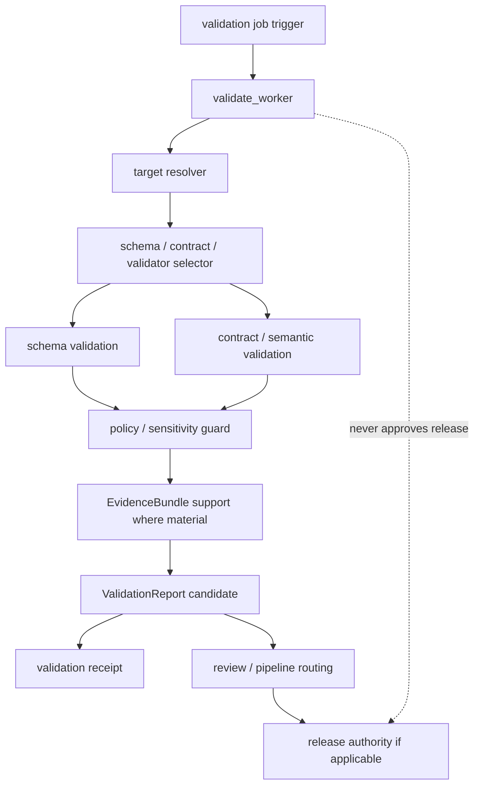

<!-- [KFM_META_BLOCK_V2]
doc_id: kfm://app/workers/src/validate-worker/readme
title: Validate Worker README
type: app-readme
version: v0.1
status: draft
owners: OWNER_TBD — Worker steward · Validation steward · Schema steward · Contract steward · Evidence steward · Policy steward · Docs steward
created: 2026-06-16
updated: 2026-06-16
policy_label: public
related:
  - ../README.md
  - ../../README.md
  - ../../../governed-api/README.md
  - ../../../review-console/README.md
  - ../../../../pipelines/README.md
  - ../../../../pipeline_specs/README.md
  - ../../../../packages/README.md
  - ../../../../policy/README.md
  - ../../../../schemas/contracts/v1/
  - ../../../../contracts/
  - ../../../../data/README.md
  - ../../../../data/receipts/
  - ../../../../data/proofs/
  - ../../../../tests/
  - ../../../../tools/
  - ../../../../release/README.md
tags: [kfm, apps, workers, validate-worker, validation, validationreport, schemas, contracts, receipts, policydecision, evidencebundle, lifecycle]
notes:
  - "Replaces the greenfield validate_worker stub with a bounded worker-source contract."
  - "This worker may run validation jobs and emit validation reports/receipts, but it must not author schemas/contracts, silently promote data, publish, rewrite canonical records, or replace review/release authority."
  - "Worker source files, job definitions, queue contracts, schemas, fixtures, tests, validation outputs, receipt outputs, deployment state, logs, dashboards, and CI pass state remain NEEDS VERIFICATION."
[/KFM_META_BLOCK_V2] -->

<a id="top"></a>

<div align="center">

# Validate Worker

`apps/workers/src/validate_worker/`

**App-local worker-source boundary for validation background jobs: schema/contract validation orchestration, validator execution, ValidationReport candidate emission, policy/evidence precheck support, receipt capture, stale/failed validation signals, retry/idempotency controls, and non-publishing worker enforcement.**


[Purpose](#1-purpose) · [Repo fit](#2-repo-fit) · [Boundary](#3-authority-boundary) · [Inputs](#5-inputs) · [Exclusions](#6-exclusions) · [Worker map](#7-validate-worker-map) · [Definition of done](#14-definition-of-done)

</div>

---

> [!IMPORTANT]
> **Status:** draft / `NEEDS VERIFICATION`  
> **Owners:** `OWNER_TBD` — Worker steward · Validation steward · Schema steward · Contract steward · Evidence steward · Policy steward · Docs steward  
> **Path:** `apps/workers/src/validate_worker/README.md`  
> **Responsibility root:** `apps/` — deployable application surfaces  
> **Truth posture:** CONFIRMED README path / CONFIRMED Workers source boundary / CONFIRMED data-root receipt/report lifecycle home / PROPOSED validate-worker contract / UNKNOWN source files, queue contracts, validators, schemas, tests, fixtures, runtime behavior, deployment state, and CI pass state

> [!CAUTION]
> The Validate Worker is not schema, contract, policy, lifecycle, review, or release authority. It may run validation and emit validation reports/receipts, but it must not silently promote data, patch invalid records, rewrite canonical stores, publish artifacts, or treat a passing validation as release approval.

---

## 1. Purpose

`apps/workers/src/validate_worker/` is the proposed app-local worker-source home for validation-support background jobs.

It may eventually contain modules for:

- validation job intake from approved schedules, queues, pipeline triggers, or operator-triggered dry runs;
- idempotency and retry handling for validation jobs;
- schema, contract, fixture, and validator selection;
- lifecycle-phase and eligibility prechecks;
- schema and contract validation execution;
- semantic, policy, evidence, source-role, and sensitivity preflight checks where configured;
- ValidationReport candidate generation;
- validation receipt emission;
- stale-validation, failed-validation, malformed-input, and missing-validator signals;
- review-console or pipeline routing signals for failed or restricted validation outcomes;
- safe failure states with no claim or protected detail leakage.

This README does not prove that any validate worker source file, queue contract, schema, fixture, test, validator integration, ValidationReport writer, receipt writer, deployment, log, dashboard, or CI pass state exists.

[Back to top](#top)

---

## 2. Repo fit

| Concern | Owning root | Expected relationship |
|---|---|---|
| Validate worker source | `apps/workers/src/validate_worker/` | App-local worker source, if implemented |
| Workers source | `apps/workers/src/` | Worker source boundary and non-publisher enforcement |
| Workers app | `apps/workers/` | Background deployable boundary |
| Governed API | `apps/governed-api/` | Trust membrane and governed public API path |
| Review Console | `apps/review-console/` | Human review and decision surface |
| Pipelines | `pipelines/`, `pipeline_specs/` | Pipeline logic and declarative pipeline definitions |
| Shared packages | `packages/` | Reusable validator helpers after extraction/review |
| Policy | `policy/` | Admissibility, sensitivity, rights, review, and release policy |
| Schemas/contracts | `schemas/contracts/v1/`, `contracts/` | Machine shape and object meaning; not worker-authored |
| Tests and tools | `tests/`, `tools/` | Repo-wide validators, fixtures, and checks |
| Lifecycle artifacts | `data/` | Lifecycle states, receipts, proofs, reports, registries, catalog, triplets, published outputs |
| Receipts and proofs | `data/receipts/`, `data/proofs/` | Receipt/proof support for material outputs |
| Release authority | `release/` | Publication, correction, rollback authority |

## 3. Authority boundary

This worker may orchestrate validation jobs. It does not own schemas, contracts, validation policy, source authority, EvidenceBundle truth, policy decisions, lifecycle storage, canonical records, release decisions, publication, correction approval, rollback approval, review decisions, source ingestion, pipeline authority, public API behavior, public UI behavior, canonical store mutation outside approved flows, runtime/model authority, or CI truth by assertion.

```text
apps/workers/src/validate_worker/ = app-local validation worker source
apps/workers/src/                 = worker source boundary
apps/workers/                     = background worker deployable
schemas/contracts/v1/             = machine shape authority
contracts/                        = object meaning authority
tests/ and tools/                 = validation/test/validator infrastructure where applicable
pipelines/                        = executable pipeline logic
pipeline_specs/                   = declarative pipeline definitions
packages/                         = reusable libraries
policy/                           = admissibility and decision policy
data/                             = lifecycle artifacts, receipts, proofs, reports, registries
release/                          = publication, correction, rollback authority
apps/governed-api/                = governed public trust membrane
apps/review-console/              = human review and decision surface
```

## 4. Default posture

The Validate Worker should fail closed. A job should not emit ValidationReport candidates, validation receipts, pass/fail signals, routing signals, or downstream readiness outputs when any of these are unresolved:

- job trigger authenticity, queue ownership, idempotency key, and worker identity;
- candidate/input ref, lifecycle phase, and validation eligibility;
- schema, contract, validator version, fixture set, and closed-enum posture;
- source identity, source role, provenance, rights, cadence, and integrity hash where material;
- PolicyDecision, sensitivity, redaction/generalization, rights, and access posture where material;
- EvidenceRef and EvidenceBundle support for validation claims where material;
- input artifact hash, output target, report target, and receipt target;
- deterministic report identity, version, and supersession strategy;
- review state, release state, correction state, rollback state, and stale-state impacts;
- retry, resume, safe-disable, and rollback behavior;
- safe error behavior and no raw/internal detail leakage.

## 5. Inputs

| Input family | Examples | Required posture |
|---|---|---|
| Job trigger | schedule, queue message, operator dry run, pipeline validation signal | Audited and idempotent |
| Job context | job id, run id, idempotency key, retry count, worker identity | Durable and traceable |
| Validation target | lifecycle ref, artifact ref, record ref, candidate ref, hash | Correct lifecycle phase required |
| Validator context | schema id, contract id, validator id, version, fixture family | Versioned and reviewable |
| Policy context | PolicyDecision, sensitivity label, rights posture, release constraints | Policy-runtime derived where material |
| Evidence context | EvidenceRef, EvidenceBundle refs, proof context, limitations | Resolver-backed where material |
| Output refs | ValidationReport ref, validation receipt ref, failure signal, review queue signal | Correct lifecycle/root target required |
| Release context | release state, correction state, rollback state, supersession refs | Required when material |

## 6. Exclusions

| Does not belong here | Correct home |
|---|---|
| Schema or contract authorship | `schemas/contracts/v1/`, `contracts/` |
| Repo-wide validator source or generators | `tools/` unless app-local wrapper is justified |
| Test fixtures and CI definitions | `tests/`, `.github/`, or tool-specific test roots |
| Policy rules and access/release decisions | `policy/`, `release/` |
| Lifecycle data and canonical stores | `data/` |
| Validation reports, receipts, and proofs | `data/` and `data/receipts/`, `data/proofs/` |
| Source-specific connector implementation | `connectors/` |
| Reusable validation/pipeline logic | `pipelines/` or `packages/` |
| Declarative pipeline definitions | `pipeline_specs/` |
| Public or semi-public API surface | `apps/governed-api/` |
| Public UI or map rendering | `apps/explorer-web/` |
| Review decisions and manual adjudication | `apps/review-console/` |
| Release approval or publication | `release/` |
| Direct model/runtime public access | `runtime/` behind governed API only |
| Deployment-only values | Deployment environment/config channels |

## 7. Validate worker map

Exact implementation files remain `NEEDS VERIFICATION`.

| Candidate module | Purpose | Required safeguard | Status |
|---|---|---|---|
| `job_contract` | Queue message and job envelope handling | Closed schema and idempotency | PROPOSED |
| `target_resolver` | Resolve candidate/input refs and lifecycle phase | No raw-store shortcut | PROPOSED |
| `validator_selector` | Pick schema/contract/validator versions | Version-pinned and auditable | PROPOSED |
| `schema_runner` | Schema validation orchestration | Closed enums and fail-closed | PROPOSED |
| `contract_runner` | Contract/semantic validation orchestration | Contract-bound and fixture-backed | PROPOSED |
| `policy_guard` | Policy/sensitivity/access precheck | Fail closed on unresolved state | PROPOSED |
| `evidence_guard` | EvidenceBundle support check | No unsupported validation claim | PROPOSED |
| `report_writer` | ValidationReport candidate emission | Durable data-root output | PROPOSED |
| `receipt_writer` | Validation/job receipt emission | Durable data-root output | PROPOSED |
| `safe_errors` | Failure, retry, and safe log shaping | No internal detail leakage | PROPOSED |

> [!WARNING]
> Candidate module names are not implementation proof. Do not claim a validate worker module is live until files, queues, schemas, validators, fixtures, tests, policy gates, evidence checks, validation reports, receipts, and deployment evidence confirm it.

## 8. Diagram



## 9. Worker obligations

| Obligation | Example effect |
|---|---|
| `validation_not_publication` | Passing validation does not equal review, release, or publication approval |
| `schema_contract_authority_preserved` | Worker runs schemas/contracts but does not author them |
| `closed_enum_fail_closed` | Unknown outcome, status, or lifecycle values fail closed |
| `policy_required` | Policy, sensitivity, rights, and release gates run before material readiness output |
| `evidence_required` | Evidence-dependent validation claims carry EvidenceRef/EvidenceBundle support |
| `report_required` | Material validation runs emit ValidationReport refs |
| `receipt_required` | Material validation outputs emit durable receipts |
| `candidate_only` | Validation reports/signals remain candidates until governed downstream gates act |
| `idempotent_jobs` | Re-running a job should not duplicate authoritative reports/receipts |
| `safe_error_only` | Failures reveal no protected data, raw payloads, internal paths, or validator internals |

## 10. Job contract

Each durable validate worker module or child README should state:

- job purpose and owner;
- authorized producer and trigger type;
- queue message shape and idempotency key;
- accepted target refs and lifecycle phase;
- denied inputs and correct homes;
- schema, contract, validator, fixture, report, and receipt dependencies;
- policy and sensitivity dependencies where material;
- EvidenceBundle dependency where material;
- output refs and report/receipt/signal types emitted;
- deterministic report identity and supersession posture;
- safe-disable, retry, and rollback path;
- tests and fixtures required;
- open verification items.

## 11. Inspection path

Validate worker source files, queue contracts, schemas, validators, tests, fixtures, policy integration, evidence resolver integration, ValidationReport generation, receipt outputs, deployment state, logs, dashboards, and emitted artifacts remain `NEEDS VERIFICATION`.

```bash
find apps/workers/src/validate_worker -maxdepth 7 -type f | sort
find apps/workers pipelines pipeline_specs packages policy schemas contracts data release tests tools fixtures -maxdepth 7 -type f 2>/dev/null | grep -Ei 'validate|validation|ValidationReport|schema|contract|validator|fixture|PolicyDecision|EvidenceRef|EvidenceBundle|receipt|candidate|status|outcome|worker|job|queue|test|fixture' | sort
```

## 12. Validation expectations

Useful validation for this worker should cover:

- unauthorized producers cannot enqueue validation jobs;
- malformed job/input envelopes fail closed;
- missing target refs, lifecycle phase, schema, contract, validator, fixture set, policy, evidence, report target, or receipt target blocks material output where required;
- unknown enum/status/outcome/lifecycle values fail closed;
- validation reports remain candidates and do not approve/reject/promote/publish items;
- worker does not write directly to final published outputs or mutate release records;
- material validation outputs emit ValidationReport refs and receipts with job id, target refs, schema/contract/validator version, hashes, status, reason codes, and limitations;
- retry/idempotency prevents duplicate authoritative reports/receipts;
- safe errors reveal no raw payloads, protected detail, internal paths, validator internals, or deployment-only values.

## 13. Safe change pattern

For Validate Worker changes:

1. Add or update validate worker inventory and job contract.
2. Link job, validation target, ValidationReport, receipt, status, outcome, and policy DTOs to schemas/contracts before changing shapes.
3. Add fixtures for valid pass, valid fail, missing schema, missing contract, missing validator, malformed input, unknown enum, missing policy, missing evidence, duplicate idempotency key, retry, timeout, and safe error cases.
4. Add validation-not-publication, schema-contract-authority, closed-enum-fail-closed, candidate-only, evidence-support, policy-support, report-required, receipt-required, idempotency, and safe-error tests before enabling jobs.
5. Preserve EvidenceRef/EvidenceBundle refs, PolicyDecision refs, source refs, lifecycle state, validation target refs, report refs, receipt refs, release/correction/rollback refs, job ids, reason codes, timestamps, hashes, validator versions, and limitations through every material output.
6. Update this README, parent Workers README, Workers source README, validation docs, pipeline docs, governed API/review-console docs, policy docs, schemas/contracts, tools, and tests when behavior materially changes.

## 14. Definition of done

- [ ] Owners are confirmed and `OWNER_TBD` is replaced.
- [ ] Validate worker module inventory and ownership are documented.
- [ ] Job/target/report/receipt DTOs and schemas are verified.
- [ ] Authorized producer, queue, idempotency key, retry, and safe-disable behavior are documented and tested.
- [ ] Schema runner, contract runner, validator selector, policy runtime, evidence resolver, ValidationReport writer, and receipt writer are documented and tested.
- [ ] Worker cannot approve/reject/defer/promote, publish, mutate release records, rewrite canonical records, or author schemas/contracts/policy.
- [ ] ValidationReport outputs remain candidate/support outputs until governed downstream gates.
- [ ] Missing-schema, missing-validator, unknown-enum, malformed-input, missing-policy, and safe-error tests are present and passing.
- [ ] Deployment, logs, dashboards, and runbooks are documented with current evidence.

## 15. Open verification items

| Item | Why it matters |
|---|---|
| Confirm source files beyond README | Prevents overclaiming implementation maturity |
| Confirm validation job/queue contract | Required before worker behavior claims |
| Confirm validation target and report schemas | Required before shape claims |
| Confirm schema/contract/validator selection | Required before validation claims |
| Confirm policy and evidence integration | Required before governed-output claims |
| Confirm ValidationReport and receipt output targets | Required before lifecycle/auditability claims |
| Confirm closed-enum/fail-closed behavior | Required before trust claims |
| Confirm no-publication and no-lifecycle-mutation behavior | Required before governance claims |
| Confirm tests, fixtures, deployment, logs, and dashboards | Required before operational maturity claims |
| Confirm review/pipeline handoff | Required before candidate routing claims |

<details>
<summary>Appendix A — no-loss preservation note</summary>

The previous README was a greenfield stub. This replacement adds a bounded Validate Worker contract without claiming source files, queues, schemas, validators, tests, fixtures, policy enforcement, EvidenceBundle checks, ValidationReport generation, receipt emission, deployment, logs, dashboards, or CI pass state are implemented.

</details>

## Status summary

`apps/workers/src/validate_worker/` should contain validation worker source only after job inventory, queue contract, schema validation, contract validation, validator selection, policy runtime integration, evidence resolver integration, ValidationReport generation, receipt emission, tests, and operational evidence are verified.

It must preserve the validation boundary: this worker may run validation and emit reports/receipts, but it must not author schemas/contracts, patch invalid records, approve review decisions, publish artifacts, rewrite canonical records, mutate release records, or treat passing validation as release authority.

<p align="right"><a href="#top">Back to top</a></p>
