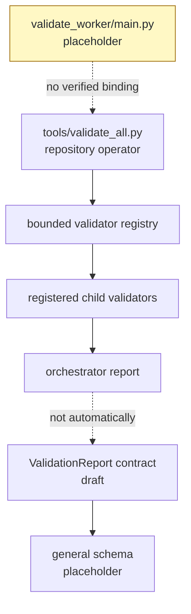

<!-- [KFM_META_BLOCK_V2]
doc_id: kfm://app/workers/src/validate-worker/readme
title: Validate Worker README
type: app-readme
subtype: worker-lane-boundary-readme
version: v0.2
prior_version: v0.1
status: draft; repository-grounded; placeholder-only; no-executable-worker-binding
owners: OWNER_TBD — Worker steward · Validation steward · Runtime steward · Contract steward · Schema steward · Evidence steward · Policy steward · Receipt steward · Security reviewer · Operations steward · Docs steward
review_route: .github/CODEOWNERS defaults GitHub review routing to @bartytime4life; this is not stewardship, independent approval, validation authority, policy authority, review authority, release authority, or proof that review occurred
created: 2026-06-16
updated: 2026-08-12
policy_label: public-documentation; app-boundary; fail-closed; candidate-only; non-authoritative; no-direct-publication
current_path: apps/workers/src/validate_worker/README.md
owning_root: apps/
parent_boundary: apps/workers/src/README.md
deployable_boundary: apps/workers/README.md
scope_id: kfm://app/workers/src/validate-worker
responsibility: Defines the app-local boundary for a future deployable validation-job wrapper; preserves validator, contract, schema, policy, evidence, receipt, review, lifecycle, and release authority in their owning roots
authority_sources:
  - ../../../../docs/adr/ADR-0029-adopt-directory-governance-standard-v2.md
  - ../../../../docs/doctrine/directory-rules.md
  - ../README.md
  - ../../README.md
evidence_commit: 60a54f63404929a4ccb3043a5059a2351747df50
evidence_tree: 47b58b71fc4746e92cb8a0b9e0119aa5d8e8c33e
evidence_reviewed: 2026-08-12
evidence:
  target_tree: 4bae7b3d49bf7282351dcd0fb0616cf44dda943c
  target_readme_blob: 5ea1800d06a57aeb7faa90799004fc2136bd8bf8
  target_entrypoint_blob: d42e8a837b61ba42038d7a4fbc260072e53feea8
  workers_source_tree: 0a59ece917327aefc57cca453e89594f34308d0b
  workers_source_readme_blob: 08ad9f8116f64817ffa4f8b2058613749360c102
  workers_app_readme_blob: 5b5c1e6b067e652a380bf445488a6227028dfc0e
  directory_rules_blob: fd49a0b83e55cef52c1124281f093e263526898d
  directory_rules_adr_blob: b01322ef64f8c2b1ecb41de7ef4685b97cfa2a62
  codeowners_blob: dd2a84aa514d8ecd9208bc347f90f9a2ed37dd61
  validator_entrypoint_blob: c308015da780d7b72f56277b521fb0e42317651e
  validator_orchestrator_blob: 728cf1404839a5b95e03d70d44567863a6f9b6df
  validator_registry_blob: c65c1c2b27b85be4bdc3c42d0555c6e8e44698e2
  validator_orchestrator_test_blob: 649b0d3eaaa3ea8faabf6c8231a9f7c3aa207131
  validation_report_contract_blob: 1ee7872dc4144c159816fabdc2433548e5f47a78
  validation_report_schema_blob: 14d1eeffbb15fa07f233c778a7a30106a4a14fd6
  shared_validate_readme_blob: ee38f7876e75848854294642a696f8dcf6be155a
  shared_validate_entrypoint_blob: ab3aaa5d6ec49fe4f1a03aca633b89f79fce3246
  cli_validate_entrypoint_blob: 43eb0a7eb1f7d06a3d189a9382552f36a7c02f9f
implementation_facts:
  lane_inventory: README.md plus main.py; no direct child directory
  entrypoint: one comment; zero executable Python lines
  worker_package: not present
  worker_job_contract: not present
  worker_queue_or_schedule_binding: not verified
  worker_local_tests_or_fixtures: not present
  worker_deployment_binding: not verified
  repository_validator_orchestrator: confirmed executable outside this worker
  shared_validate_pipeline_entrypoint: one comment; zero executable Python lines
  cli_validate_entrypoint: one comment; zero executable Python lines
  general_validation_report_contract: draft semantic contract
  general_validation_report_schema: proposed greenfield placeholder requiring only id and allowing additional properties
  declared_general_validation_report_validator: absent at the schema-declared path
  declared_general_validation_report_fixture_root: absent
related:
  - ../README.md
  - ../../README.md
  - ../../../cli/src/kfm_cli/commands/validate.py
  - ../../../governed-api/README.md
  - ../../../review-console/README.md
  - ../../../../tools/validate_all.py
  - ../../../../tools/validators/README.md
  - ../../../../tools/validators/validate_all.py
  - ../../../../tools/validators/validator_registry.json
  - ../../../../tests/validators/test_validator_orchestrator.py
  - ../../../../docs/runbooks/VALIDATOR_ORCHESTRATOR.md
  - ../../../../docs/dashboards/observability/validator-orchestrator-health.md
  - ../../../../pipelines/validate/README.md
  - ../../../../pipelines/validate/main.py
  - ../../../../pipeline_specs/README.md
  - ../../../../contracts/data/validation_report.md
  - ../../../../schemas/contracts/v1/data/validation_report.schema.json
  - ../../../../contracts/validation/README.md
  - ../../../../schemas/contracts/v1/validation/README.md
  - ../../../../artifacts/qa/validation/README.md
  - ../../../../data/receipts/validation/README.md
  - ../../../../data/proofs/validation_report/README.md
  - ../../../../policy/README.md
  - ../../../../release/README.md
  - ../../../../.github/workflows/validator-suite.yml
  - ../../../../.github/workflows/schema-validation.yml
  - ../../../../.github/workflows/contracts-validate.yml
non_effects:
  - No executable worker code, package, import, validator, queue, schedule, service identity, configuration, test, fixture, deployment, network access, report, receipt, proof, review record, release record, lifecycle mutation, or public route is created
  - No schema, contract, policy, evidence, review, lifecycle, release, correction, rollback, or publication authority is changed
  - No repository validator is registered, executed, weakened, promoted into a runtime dependency, or represented as complete coverage
  - No source, connector, dataset, live payload, sensitive location, private locator, secret, or external service is accessed or activated
  - No validation outcome is translated into policy approval, review approval, release readiness, or publication
tags: [kfm, apps, workers, validate-worker, validation, validator-orchestrator, validation-report, receipts, proofs, contracts, schemas, evidence, policy, lifecycle, fail-closed, non-publisher]
notes:
  - "This edition replaces future-state ambiguity with exact placeholder evidence and a bounded implementation path."
  - "Repository-wide validator orchestration exists under tools/, but Directory Rules prohibit production apps from depending on tools as runtime libraries."
  - "The general ValidationReport prose contract, placeholder schema, orchestrator report, domain reports, receipts, and proof-support lanes are distinct surfaces and must not be collapsed."
[/KFM_META_BLOCK_V2] -->

<a id="top"></a>

<div align="center">

# Validate Worker

`apps/workers/src/validate_worker/`

**Boundary contract for a future thin validation-job worker that preserves finite outcomes and delegates to admitted runtime interfaces without becoming validator, policy, review, lifecycle, release, or publication authority.**

[](#21-current-profile)
[](#22-what-is-confirmed-now)
[](#3-authority-and-placement)
[](#43-core-invariants)
[](#151-current-executable-review-route)
[](#44-trust-membrane)

[Purpose](#1-purpose) · [Current state](#2-repository-grounded-status) · [Boundary](#3-authority-and-placement) · [Inputs](#5-inputs) · [Outputs](#6-outputs) · [Validation](#13-validation-and-test-strategy) · [Done](#18-definition-of-done)

</div>

> [!IMPORTANT]
> **Current state:** the tracked lane contains this README and a 56-byte `main.py` whose only content is one comment. There is no executable Validate Worker, worker package, worker-local job contract, worker-local test, or verified queue, schedule, deployment, report-writer, or receipt-writer binding.

> [!CAUTION]
> Validation is an observation about a bounded check. A passing validator does not make data true, authorize use, resolve evidence, grant rights, satisfy policy, complete review, promote lifecycle state, approve release, or publish an artifact.

> [!NOTE]
> `.github/CODEOWNERS` routes review to `@bartytime4life`. That executable route is not evidence that the project has assigned the unresolved steward roles listed in the metadata block.

---

<a id="1-purpose"></a>

## 1. Purpose

`apps/workers/src/validate_worker/` is the app-local boundary for a **future** deployable validation-job wrapper.

Its eventual purpose may be to:

- receive an authenticated, schema-valid, idempotent validation job;
- resolve a version-locked validation plan through an accepted runtime interface;
- invoke admitted validation capabilities with bounded resources;
- preserve each validator's native finite result without translating it into a stronger authority claim;
- request or route candidate validation reports and execution receipts through their owning interfaces;
- expose safe operational state to internal observability; and
- terminate, retry, hold, or recover without mutating governed lifecycle or release state.

It is not an implementation claim. At the evidence commit, no executable code performs those actions in this lane.

### 1.1 One-line operating law

> A future Validate Worker may coordinate admitted checks; it must never turn check execution or a `PASS` into truth, policy, review, promotion, release, or publication authority.

### 1.2 Goals

This boundary document:

- states what belongs in a deployable worker wrapper and what must stay elsewhere;
- reconciles the placeholder lane with the implemented repository validator orchestrator;
- protects the `apps/` → `packages/` dependency direction required by Directory Rules;
- distinguishes job execution, validator findings, `ValidationReport`, receipt, proof, policy, review, and release object families;
- defines fail-closed input, output, security, retry, observability, and recovery expectations;
- supplies a staged, testable path from placeholder to an admitted runtime;
- keeps unresolved contracts, outcome mappings, ownership, and deployment choices visible; and
- gives maintainers a review, validation, correction, and rollback checklist.

### 1.3 Non-goals

This README does not:

- implement the worker;
- make `main.py` executable;
- register or run validators;
- turn `tools/validators/` into production application code;
- complete the shared `pipelines/validate/` stage or `kfm validate` CLI;
- accept the draft `ValidationReport` contract or expand its placeholder schema;
- create a queue, schedule, service account, secret, network path, deployment, or dashboard;
- define policy or decide whether an object is allowed;
- write lifecycle, receipt, proof, review, or release instances;
- activate domain validation or live data;
- certify full repository coverage; or
- authorize merge, release, deployment, promotion, or publication.

[Back to top](#top)

---

<a id="2-repo-fit"></a>

## 2. Repository-grounded status

### 2.1 Current profile

| Field | Confirmed value |
|---|---|
| Repository | `bartytime4life/Kansas-Frontier-Matrix` |
| Evidence base | `main@60a54f63404929a4ccb3043a5059a2351747df50` |
| Repository tree | `47b58b71fc4746e92cb8a0b9e0119aa5d8e8c33e` |
| Workers source tree | `0a59ece917327aefc57cca453e89594f34308d0b` |
| Validate Worker tree | `4bae7b3d49bf7282351dcd0fb0616cf44dda943c` |
| Prior README blob | `5ea1800d06a57aeb7faa90799004fc2136bd8bf8` |
| Entrypoint blob | `d42e8a837b61ba42038d7a4fbc260072e53feea8` |
| README profile | `BOUNDARY_COMPACT`, expanded because this is a deployable trust boundary |
| Placement | `PLACE` — same-path update under the existing `apps/` responsibility root |
| Change class | Additive semantic and presentation modernization; no runtime or authority change |
| Executable maturity | Placeholder only |
| Ownership | `OWNER_TBD`; CODEOWNERS routing is known, stewardship is not |
| Public exposure | None verified |
| Mutation capability | None implemented in this lane |
| Retention behavior | None implemented in this lane |

### 2.2 What is confirmed now

| Claim | Evidence | State |
|---|---|---:|
| The lane exists. | Current repository tree and target tree. | **CONFIRMED** |
| The lane has exactly two direct files. | `README.md` and `main.py`; no direct child directory. | **CONFIRMED** |
| `main.py` is not an executable worker. | One comment, zero executable Python lines. | **CONFIRMED** |
| The parent source README classifies this lane as a placeholder. | [`../README.md`](../README.md). | **CONFIRMED** |
| The Workers app documents a future validation-job role. | [`../../README.md`](../../README.md). | **CONFIRMED PROPOSED ROLE** |
| A repository-wide validator orchestrator exists. | [`tools/validate_all.py`](../../../../tools/validate_all.py), its implementation, registry, tests, and runbook. | **CONFIRMED OUTSIDE THIS WORKER** |
| A bounded registry currently lists ten validators. | [`validator_registry.json`](../../../../tools/validators/validator_registry.json). | **CONFIRMED** |
| The general `ValidationReport` semantic contract exists. | [`contracts/data/validation_report.md`](../../../../contracts/data/validation_report.md). | **CONFIRMED DRAFT** |
| The paired general schema is complete. | It requires only `id`, permits extra properties, and labels itself a greenfield placeholder. | **DENIED** |
| The schema-declared general report validator and fixture root exist. | Neither declared path is present in the pinned tree. | **NOT PRESENT** |
| The shared Validate pipeline or CLI implements worker behavior. | Both entrypoints are one-comment placeholders. | **DENIED** |
| Existing tools, workflows, pipelines, or domain validators are bound to this worker. | No binding is established by this lane, its parents, or the bounded adjacent evidence reviewed here. | **NOT VERIFIED** |
| A queue, schedule, deployment, service identity, secret, runtime config, worker-local test, or operational dashboard is bound here. | No such binding is present in this lane. | **NOT VERIFIED** |

### 2.3 Current direct-child map

The tree below is current, not proposed.

```text
apps/workers/src/validate_worker/
├── README.md    # this boundary contract
└── main.py      # one-comment greenfield placeholder
```

There is no package initializer, worker module, queue consumer, configuration file, schema, fixture, test, deployment descriptor, or child directory in this lane.

### 2.4 Adjacent validation capability

KFM contains substantial validation capability. Presence elsewhere must not be mistaken for worker composition.

| Surface | Confirmed capability | Boundary relative to this worker |
|---|---|---|
| [`tools/validate_all.py`](../../../../tools/validate_all.py) | Canonical thin repository entrypoint. | Repository tool, not a worker runtime API. |
| [`tools/validators/validate_all.py`](../../../../tools/validators/validate_all.py) | Bounded deterministic orchestrator with registry validation, selection, timeouts, finite results, and JSON output. | Executable repository tooling; production apps must not import `tools/`. |
| [`tools/validators/validator_registry.json`](../../../../tools/validators/validator_registry.json) | Ten registered validators across `focused`, `changed-area`, `release-dry-run`, and `full` profiles. | Registry scope is bounded; `full` means every registered entry, not every repository checker. |
| [`tests/validators/test_validator_orchestrator.py`](../../../../tests/validators/test_validator_orchestrator.py) | Ten focused tests for deterministic bytes, result mapping, selection, registry safety, and compatibility inventory. | Test evidence for the tool, not for this worker. |
| [`docs/runbooks/VALIDATOR_ORCHESTRATOR.md`](../../../../docs/runbooks/VALIDATOR_ORCHESTRATOR.md) | Operator commands, profiles, exit semantics, report contract, maintenance, failure handling, and rollback. | Runbook for repository tooling, not deployment proof. |
| [`pipelines/validate/`](../../../../pipelines/validate/README.md) | Rich shared-stage boundary documentation. | Its `main.py` remains a placeholder; no active shared stage is established. |
| Domain pipeline and spec lanes | Domain `validate.py` files and validation specifications exist in the tree. | Independent domain capability; no worker binding is inferred. |
| Validation workflows | Validator suite, schema validation, contract validation, and many focused workflows exist. | CI execution is not a background worker deployment. |
| [`ValidationReport`](../../../../contracts/data/validation_report.md) | Draft semantic meaning and proposed finite outcomes. | General schema/fixture/validator closure remains incomplete. |
| Domain validation-report families | Several domain contracts, schemas, fixtures, validators, and tests exist. | Domain-specific artifacts do not complete the general report or this worker. |
| [`data/receipts/validation/`](../../../../data/receipts/validation/README.md) | Parent and selected child README boundaries. | Process-memory lane; no worker writer is bound. |
| [`data/proofs/validation_report/`](../../../../data/proofs/validation_report/README.md) | Parent plus Atmosphere and Flora README/placeholder sublanes. | Proof-support lane; no worker writer is bound. |
| [`artifacts/qa/validation/`](../../../../artifacts/qa/validation/README.md) | Transitional inspection-output lane. | Its tracked JSON is an explicit empty proposed placeholder, not a receipt or proof. |

### 2.5 Important maturity distinctions

| Statement | Accurate? | Reason |
|---|---:|---|
| “KFM has executable validators.” | Yes. | Many repository and domain validators are present. |
| “KFM has a bounded aggregate validator orchestrator.” | Yes. | The registry-driven tool and focused tests are present. |
| “Every repository validator is registered.” | No. | The orchestrator runbook explicitly limits `full` to the current registry. |
| “The Validate Worker runs the orchestrator.” | No. | `main.py` is a comment and no binding is established. |
| “The shared validation pipeline is operational.” | No. | Its executable entrypoint is also a comment-only placeholder. |
| “The `kfm validate` CLI is operational.” | No. | Its command file is a comment-only placeholder. |
| “The general ValidationReport shape is ready for production.” | No. | The schema is permissive placeholder scaffolding and its declared validator/fixtures are absent. |
| “A successful CI workflow is a ValidationReport.” | No. | Workflow state, orchestrator output, semantic report, and process receipt are separate objects. |
| “A validation pass authorizes release.” | No. | Policy, review, proof, and release decisions remain separate. |

### 2.6 Maturity conclusion

The safe current conclusion is:

> KFM has executable validation tools and CI surfaces, but `apps/workers/src/validate_worker/` remains a documentation-plus-comment placeholder with no verified runtime binding.

Any stronger statement requires code, a job contract, an admitted dependency path, tests, deployment evidence, operational evidence, and separately verified output writers.

### 2.7 README impact

This document changes maintainers' understanding of the lane. It does not change:

- Python execution;
- validator selection;
- report or receipt output;
- workflow behavior;
- dependency graphs;
- data or lifecycle state;
- policy or review decisions;
- release state; or
- public behavior.

### 2.8 Last reviewed

Evidence was reviewed against the immutable base in §2.1 on `2026-08-12`.

Re-review is required when the target lane, parent Workers boundaries, Directory Rules, validator orchestrator, general ValidationReport contract/schema, shared Validate pipeline, queue/deployment configuration, or output-family ownership changes.

[Back to top](#top)

---

<a id="3-authority-boundary"></a>

## 3. Authority and placement

### 3.1 Directory Rules basis

Accepted ADR-0029 identifies [`docs/doctrine/directory-rules.md`](../../../../docs/doctrine/directory-rules.md) as the canonical writable human authority. Its responsibility split applies directly:

| Root | Authority relevant to validation |
|---|---|
| `apps/` | Deployable process and service boundary. |
| `packages/` | Reusable, independently testable, non-deployable implementation. |
| `pipelines/` | Executable lifecycle transformation and orchestration. |
| `pipeline_specs/` | Declarative run graphs, schedules, inputs, outputs, and resource envelopes. |
| `tools/` | Repository-wide validators, generators, inspectors, and operators. |
| `contracts/` | Semantic meaning. |
| `schemas/` | Machine-checkable shape. |
| `policy/` | Normative allow, deny, hold, restrict, and abstain rules. |
| `tests/` | Executable conformance evidence. |
| `fixtures/` | Reusable synthetic and public-safe test inputs and expected outputs. |
| `data/` | Governed lifecycle, accountability, and projection instances. |
| `release/` | Promotion, release, correction, withdrawal, and rollback decisions. |

Directory Rules add two decisive constraints:

1. an app wrapper should delegate reusable logic to `packages/`, source acquisition to `connectors/`, and transformations to `pipelines/`; and
2. repository tools must not become runtime dependencies of production apps.

Therefore, a future worker cannot simply import `tools.validators.validate_all` or shell out to repository tools in production and call that an architecture.

### 3.2 Placement outcome

`PLACE` applies because:

- the tracked README remains at its established path;
- the path is an app-local worker boundary;
- no root, lane, object family, lifecycle phase, or authority owner changes;
- no generated or mirror marker applies;
- the direct-child map stays unchanged; and
- the edit only clarifies current state and future admission requirements.

This README does not authorize executable implementation by itself.

### 3.3 Dependency direction

```text
authorized producer
        │
        ▼
apps/workers/src/validate_worker/      thin deployable wrapper
        │
        ├──► packages/                 reusable admitted runtime behavior
        ├──► contracts/ + schemas/     meaning and machine shape
        ├──► policy client             policy input/result transport, not policy authorship
        ├──► pipeline interface        lifecycle orchestration, when applicable
        └──► bounded runtime adapter   process composition and capabilities

Denied production dependency directions:

apps/ ─X─► tools/       repository operators are not application libraries
apps/ ─X─► tests/       tests are evidence, not production behavior
apps/ ─X─► fixtures/    fixtures are not production input
apps/ ─X─► other apps' internals
apps/ ─X─► raw or published stores as hidden authority
```

If reusable orchestration is needed by the worker, it must be extracted or implemented behind an accepted interface in the proper root and tested there. The existing tool may remain a repository operator and compatibility surface.

### 3.4 Bounded context

The worker boundary may eventually own:

- process bootstrap and shutdown;
- authenticated job intake;
- job-level idempotency and concurrency control;
- capability-scoped invocation of admitted validation interfaces;
- operational timeouts, cancellation, retry, and backpressure;
- mapping between job execution state and preserved validator results;
- safe telemetry and health state; and
- routing of candidate output requests.

It does not own the semantic meaning of the target, validation rules, machine schemas, admissibility policy, EvidenceBundle truth, review judgment, data lifecycle, durable receipt/proof families, or release decisions.

### 3.5 Local scope identity

The local scope identifier is:

```text
kfm://app/workers/src/validate-worker
```

This is a documentation identity for the boundary. It is not a service identity, queue name, deployment identity, validator registry ID, report ID, or release ID.

[Back to top](#top)

---

<a id="4-default-posture"></a>

## 4. Operating boundary

### 4.1 What belongs here

After contract-first admission, the lane may contain thin app-local code for:

- bootstrapping the worker process;
- loading app-local non-secret configuration;
- authenticating the job producer;
- validating the job envelope;
- resolving approved runtime capabilities;
- applying worker-level resource limits;
- coordinating cancellation and graceful shutdown;
- recording safe operational signals; and
- invoking accepted package, pipeline, policy-client, and output-writer interfaces.

Every such file must state its owner, inputs, outputs, side effects, dependency direction, failure behavior, tests, and rollback.

<a id="6-exclusions"></a>

### 4.2 What does not belong here

| Prohibited local authority or implementation | Correct owner |
|---|---|
| Repository-wide validator implementations or registry | `tools/validators/` |
| Reusable validation runtime library | `packages/` after explicit admission |
| Lifecycle transformation logic | `pipelines/` |
| Declarative validation graphs or schedules | `pipeline_specs/` |
| Contract meaning | `contracts/` |
| JSON Schema and generated type authority | `schemas/` |
| Policy rules | `policy/` |
| Canonical fixtures and expected outcomes | `fixtures/` |
| Repository and domain test suites | `tests/` |
| Source-specific acquisition | `connectors/` |
| Canonical data or lifecycle state | `data/` |
| Validation receipt instances | accepted lane under `data/receipts/` |
| Validation proof-support instances | accepted lane under `data/proofs/` |
| Review decisions | review object families and Review Console boundaries |
| Promotion, release, correction, withdrawal, or rollback decisions | `release/` |
| Public API routes | `apps/governed-api/` |
| Public UI or map rendering | `apps/explorer-web/` |
| Secrets | external secret store; references only in deployment configuration |
| Unique deployment topology | `infra/` |

<a id="9-worker-obligations"></a>

### 4.3 Core invariants

| Invariant | Required effect |
|---|---|
| `validation_not_truth` | A result describes a check; it does not make the target true. |
| `pass_not_policy` | `PASS` cannot be translated into `ALLOW`. |
| `failure_not_policy` | `FAIL` cannot be silently translated into `DENY` unless an accepted policy explicitly does so. |
| `error_not_failure` | Tool error and reviewed validation rejection remain distinct. |
| `abstain_not_pass` | Missing coverage or dependencies cannot become success. |
| `receipt_not_report` | Process memory and semantic validation findings remain separate. |
| `report_not_proof` | A ValidationReport may support proof; it does not close proof. |
| `proof_not_release` | Proof support cannot approve release. |
| `worker_not_validator_authority` | The wrapper cannot alter validator meaning or outcome. |
| `worker_not_lifecycle_authority` | Job completion cannot mutate lifecycle state by inference. |
| `worker_not_publisher` | No code path may publish or expose a public carrier. |
| `source_role_preserved` | Validation never upgrades what a source can prove. |
| `finite_outcomes_preserved` | Native result and reason codes survive routing unchanged. |
| `unknown_fails_closed` | Unknown enum, identity, capability, version, or authority blocks consequential output. |

### 4.4 Trust membrane

The worker remains behind KFM's governed trust membrane.

It may emit internal operational state and candidate references through accepted interfaces. It must not expose:

- raw payloads;
- restricted locations;
- private locators;
- credentials or tokens;
- validator stdout/stderr containing protected detail;
- internal filesystem paths;
- evidence not cleared for the consumer;
- review identities beyond allowed disclosure;
- policy internals not intended for the surface; or
- release-shaped language that implies approval.

Public consumers use governed APIs or released public-safe carriers. They never read worker queues, logs, receipt lanes, proof lanes, or internal report stores directly.

### 4.5 Exposure, mutation, and retention

| Axis | Current lane | Future minimum |
|---|---|---|
| Exposure | README only; no runtime endpoint. | Internal, authenticated worker interface only. |
| Mutation | None. | Job-state mutation and candidate-output requests only through accepted interfaces. |
| Data access | None. | Least-privilege, target-reference-scoped access. |
| Network | None. | Deny by default; only declared egress required by admitted dependencies. |
| Secrets | None. | Secret references, short-lived credentials, and redaction; never committed values. |
| Retention | Git history for documentation. | Bounded logs; durable receipts/reports only in owning stores. |
| Public path | None. | Still none; governed downstream presentation remains separate. |

### 4.6 Lifecycle posture

Validation may occur at several lifecycle gates, but the worker does not own the lifecycle:

```text
RAW → WORK / QUARANTINE → PROCESSED → CATALOG / TRIPLETS → PUBLISHED
```

A result can support a hold, correction, review, or promotion decision only after the owning policy, review, and release processes act. A job completion event is never a promotion event.

[Back to top](#top)

---

<a id="5-inputs"></a>

## 5. Inputs

### 5.1 Current inputs

There are no implemented runtime inputs. The placeholder does not parse arguments, environment variables, files, queue messages, schedules, network requests, or stdin.

### 5.2 Future admissible input families

Every future input field remains `PROPOSED` until a semantic contract, schema, fixtures, validator, tests, and producer binding establish it.

| Input family | Required information | Why it is needed |
|---|---|---|
| Job envelope | job identity, version, producer identity, issued time, expiry, idempotency key | Authenticated intake and replay control |
| Validation target | stable target ref, target type, version/digest, lifecycle context | Bind findings to exact bytes or object state |
| Validation plan | plan/registry/profile ref, plan digest, requested validators, ordering | Prevent hidden or drifting check selection |
| Validator identity | stable validator IDs, versions/digests, capability requirements | Reproducibility and authority separation |
| Contract/schema context | canonical refs and digests | Bind meaning and shape |
| Evidence context | EvidenceRefs/EvidenceBundle refs when consequential | Keep findings evidence-aware |
| Policy context | policy input or decision refs, never inline invented policy | Preserve policy authority |
| Sensitivity/rights context | classifications, handling constraints, allowed precision | Fail closed before unsafe access or output |
| Execution budget | timeout, memory/CPU limits, output cap, cancellation deadline | Bound resource use |
| Output routing | accepted report/receipt request destinations and correlation IDs | Prevent path injection and misplaced trust objects |
| Correction context | superseded run/report refs and reason | Preserve revalidation and correction lineage |

### 5.3 Input prohibitions

The worker must reject or hold:

- unsigned or unauthenticated producer messages;
- expired or future-issued jobs outside accepted clock tolerance;
- missing target identity or digest where deterministic binding is required;
- raw filesystem paths from untrusted producers;
- path traversal, symlinks, absolute paths, device paths, URL userinfo, or private metadata endpoints;
- arbitrary shell commands, executable paths, Python modules, arguments, or environment assignments;
- inline validator code;
- unknown validator, schema, contract, policy, or output-writer identifiers;
- mutable aliases without resolved immutable versions;
- unbounded target sets, recursive globs, output capture, timeouts, retries, or concurrency;
- secrets embedded in job payloads;
- live source activation or production data retrieval not separately authorized;
- output destinations under `data/published/` or `release/`;
- requests to reinterpret results into review or release decisions; and
- instructions embedded in data that try to alter worker authority.

### 5.4 Time and version locking

A consequential run must distinguish:

- producer issue time;
- job receipt time;
- validation start and completion time;
- target observation or validity time where relevant;
- contract/schema/policy/validator effective version;
- report and receipt creation time;
- correction or supersession time; and
- release time, if a downstream release later references the run.

The worker must never substitute execution time for source time or report time for release time.

### 5.5 Admission sequence

Before executing any validation capability, a future worker must:

1. authenticate the producer and service context;
2. validate the job envelope against its exact schema version;
3. verify expiry, idempotency, replay, and cancellation state;
4. resolve the target and immutable binding;
5. resolve the validation plan and each validator capability;
6. verify contract, schema, evidence, policy, rights, and sensitivity prerequisites;
7. authorize the least-privilege read and candidate-output capabilities;
8. establish resource budgets and safe output capture;
9. record an admitted execution identity; and
10. execute only the approved plan.

Any unresolved prerequisite yields a finite hold, abstention, denial, or error as defined by the owning contract. It never defaults to pass.

### 5.6 Producer authentication

GitHub identity, a queue name, a network location, or possession of a job ID does not by itself prove producer authority.

A future producer binding must define:

- accepted producer identity type;
- authentication and freshness checks;
- authorization scope;
- replay protection;
- revocation and rotation;
- audit fields;
- failure behavior; and
- separation between job submission and review/release approval.

[Back to top](#top)

---

## 6. Outputs

### 6.1 Current outputs

There are no implemented worker outputs. The placeholder writes no stdout, stderr, file, report, receipt, metric, queue message, data record, proof, review record, release record, or public artifact.

### 6.2 Permitted future output classes

Through accepted interfaces, a future worker may produce or request:

| Output class | Content | Authority limit |
|---|---|---|
| Job execution state | Authenticated state transition and correlation fields | Operational state only |
| Preserved validator result | Native outcome, reason code, validator ID, digests, bounded diagnostics | No outcome strengthening |
| Orchestrator result | Plan selection, selected count, aggregate execution outcome, child result refs | Not the semantic `ValidationReport` unless a contract explicitly maps it |
| ValidationReport candidate request | Exact target, rule/validator refs, findings, limitations, evidence/policy refs | Candidate support object; not proof or release |
| Validation receipt request | Process memory: what ran, when, with which identity and bindings | Not findings, proof, or approval |
| Hold or review-routing signal | Bounded reason and target reference | Does not assign a reviewer or decide the case |
| Safe telemetry | Counts, latency, resource use, result family, health | Non-authoritative; low-cardinality and redacted |
| Correction/revalidation link | Prior run/report ref plus new run and reason | Append-only lineage; no history rewrite |

Direct writes require a separately accepted writer contract and capability. This README does not establish one.

### 6.3 Keep object families distinct

| Object | Answers | Does not answer |
|---|---|---|
| Worker job state | Did the wrapper accept, run, cancel, or complete the job? | Was the target valid or releasable? |
| Validator result | What did one bounded checker return? | Is all relevant validation complete? |
| Orchestrator report | Which registered checks were selected and how did they execute? | Is it the canonical semantic ValidationReport? |
| `ValidationReport` | What findings apply to an exact target under identified rules? | Did the process execute exactly as claimed, or is release approved? |
| Validation receipt | What process ran with which bindings? | Are the findings true or sufficient? |
| EvidenceBundle / proof support | What evidence supports consequential claims? | Is policy satisfied or release approved? |
| PolicyDecision | Is the action allowed, denied, held, restricted, or abstained under a policy? | Did human review or release occur? |
| ReviewRecord | What review was performed and decided? | Is the artifact published? |
| Release decision/manifest | What governed release transition is authorized? | Does a worker job or CI check alone prove it? |
| Published carrier | What approved bytes are exposed? | Does placement alone establish their authority? |

### 6.4 Finite-outcome preservation

The adjacent surfaces currently use different bounded vocabularies:

| Surface | Confirmed or proposed vocabulary | Status |
|---|---|---|
| Repository validator orchestrator | `PASS`, `ABSTAIN`, `FAIL`, `ERROR` | **CONFIRMED EXECUTABLE** |
| General `ValidationReport` contract | `PASS`, `WARN`, `FAIL`, `ABSTAIN`, `DENY`, `ERROR`, `REVIEW_REQUIRED` | **PROPOSED** |
| Validation proof-support README | includes `PASS`, `WARN`, `HOLD`, `ABSTAIN`, `DENY`, `RESTRICT`, `ERROR`, `READY_FOR_REVIEW` | **PROPOSED** |
| Individual validators and domain reports | Surface-specific finite results and reason codes | **VARIES; MUST BE RESOLVED PER CONTRACT** |
| Worker job execution | No accepted worker contract or enum | **ABSENT** |

The worker must preserve separate axes:

1. **job execution state** — what the wrapper did;
2. **validator outcome** — what each check reported;
3. **aggregate orchestration outcome** — how the selected plan concluded;
4. **semantic report outcome** — what the accepted report contract permits;
5. **policy/review/release state** — determined elsewhere.

No automatic cross-axis translation is authorized. Outcome convergence is a contract decision, not a convenience mapping in app code.

### 6.5 Storage rule

The app-local lane does not become a durable trust-object store.

- App-local ephemeral state must be bounded and recoverable.
- Durable execution memory belongs in an accepted receipt store.
- Durable semantic findings belong in an accepted report/proof-support store.
- Policy, review, and release decisions belong in their owning families.
- Rebuildable QA output may use `artifacts/qa/`, but it is not a receipt or proof.
- Public carriers belong under the governed public delivery path only after release.

### 6.6 No partial-authority output

If report or receipt writing fails after validation executes:

- preserve the execution result and write failure as separate facts;
- do not claim report creation;
- do not claim receipt closure;
- do not mark the job authoritative;
- do not retry semantic validation blindly if only the writer failed;
- use idempotent writer keys;
- hold downstream action; and
- retain enough safe correlation information for recovery.

[Back to top](#top)

---

<a id="7-validate-worker-map"></a>

## 7. Adjacent validation interfaces

### 7.1 Repository validator orchestrator

The confirmed repository operator consists of:

- canonical wrapper: [`tools/validate_all.py`](../../../../tools/validate_all.py);
- implementation: [`tools/validators/validate_all.py`](../../../../tools/validators/validate_all.py);
- selection registry: [`tools/validators/validator_registry.json`](../../../../tools/validators/validator_registry.json);
- focused tests: [`tests/validators/test_validator_orchestrator.py`](../../../../tests/validators/test_validator_orchestrator.py); and
- operator runbook: [`docs/runbooks/VALIDATOR_ORCHESTRATOR.md`](../../../../docs/runbooks/VALIDATOR_ORCHESTRATOR.md).

Confirmed behavior includes:

- registry size and JSON-safety budgets;
- duplicate-key and non-finite-number rejection;
- normalized repository-relative script and glob checks;
- Python-script-only registry entries under `tools/validators/`;
- symlink, path escape, missing script, duplicate ID, and profile-drift rejection;
- explicit, profile, and changed-area selection;
- per-validator timeouts;
- bounded stdout/stderr capture;
- deterministic JSON without timing by default;
- atomic optional output writing;
- `PASS`/`ABSTAIN`/`FAIL`/`ERROR` aggregation; and
- exit `0`/`1`/`2` separation.

Those facts support the tool. They do not establish a production worker API, remote execution safety, multi-tenant isolation, or complete validator coverage.

#### Current profiles

| Profile | Current selection |
|---|---|
| `focused` | SourceDescriptor, EvidenceRef, EvidenceBundle, and RuntimeResponseEnvelope |
| `changed-area` | Registry entries whose path globs match supplied changed paths; empty selection abstains |
| `release-dry-run` | EvidenceBundle, LayerManifest, DecisionEnvelope, RunReceipt, and IngestReceipt |
| `full` | All ten registry entries exactly once, in registry order |

The registry also includes workflow-security and repository-topology validators in `full`.

> [!WARNING]
> `full` means complete coverage of the ten-entry registry. It is not a claim that every validator or invariant in the repository is registered.

### 7.2 Why the worker cannot import the tool

Directory Rules state that `tools/` owns repository-wide operators and that production apps must not depend on tools. The tool also assumes a repository checkout, repository-relative paths, Python scripts under `tools/validators/`, and subprocess execution.

A production worker needs a separately admitted interface with explicit:

- package ownership;
- capability model;
- dependency policy;
- execution isolation;
- validator discovery and version binding;
- target access;
- output writers;
- authentication;
- multi-tenant and denial-of-service posture;
- observability;
- tests; and
- deployment rollback.

Reusing algorithms may be reasonable. Reusing the repository tool as hidden production architecture is not.

### 7.3 General ValidationReport

[`contracts/data/validation_report.md`](../../../../contracts/data/validation_report.md) defines rich draft semantics: exact target binding, validator/rule identity, input hashes, findings, evidence refs, policy implications, lifecycle effects, review state, release refs, and correction refs.

The paired [`validation_report.schema.json`](../../../../schemas/contracts/v1/data/validation_report.schema.json):

- labels itself `PROPOSED`;
- describes itself as a greenfield placeholder;
- requires only `id`;
- makes `version` and `spec_hash` optional strings;
- allows arbitrary additional properties;
- declares `fixtures/data/validation_report/`; and
- declares `tools/validators/data/validate_validation_report.py`.

The declared fixture root and validator path are absent at the pinned tree.

Therefore:

- the prose contract is not machine-enforced in full;
- the schema cannot safely validate the recommended semantics;
- the worker cannot claim it emits conforming general ValidationReports; and
- domain-specific report implementations must not be silently treated as closure of the general family.

### 7.4 Orchestrator report versus ValidationReport

The executable orchestrator emits `kfm.validator-orchestrator-report.v1`. It records registry identity/digest, selection, counts, finite aggregate outcome, child return codes, output digests and line counts, and optional artifact refs.

That report is useful execution evidence. It is not automatically the semantic `ValidationReport` described by the data contract.

A future mapping requires:

- an accepted semantic contract;
- a closed schema;
- explicit field mapping;
- loss analysis;
- native outcome preservation;
- evidence and policy handling;
- fixtures and negative tests;
- deterministic identity;
- receipt separation; and
- review of authority claims.

### 7.5 Receipts, proofs, and QA artifacts

The current repository distinguishes:

- [`data/receipts/validation/`](../../../../data/receipts/validation/README.md) for validation process memory;
- [`data/proofs/validation_report/`](../../../../data/proofs/validation_report/README.md) for proof-side validation-report support; and
- [`artifacts/qa/validation/`](../../../../artifacts/qa/validation/README.md) for rebuildable inspection output.

At the pinned tree:

- the validation receipt parent has Atmosphere, doctrine-artifact-check, and Flora documentation sublanes;
- the validation-report proof parent has Atmosphere and Flora documentation/placeholder sublanes; and
- the QA `validation_report.json` declares zero checks and explicitly identifies itself as a proposed inspection placeholder.

None is evidence of a Validate Worker writer.

### 7.6 Shared pipeline and CLI

The shared [`pipelines/validate/README.md`](../../../../pipelines/validate/README.md) is detailed and repository-grounded. Its [`main.py`](../../../../pipelines/validate/main.py) is still a one-comment placeholder.

The CLI command at [`apps/cli/src/kfm_cli/commands/validate.py`](../../../cli/src/kfm_cli/commands/validate.py) is also a one-comment placeholder.

These are adjacent boundaries, not callable worker capabilities.

### 7.7 Domain validation

The tree contains domain validation contracts, schemas, pipeline files, specifications, validators, tests, fixtures, and workflows. Their maturity varies by domain and artifact family.

The worker must not:

- infer one universal domain-validator interface from filenames;
- assume all domain outputs share one enum;
- treat domain fixtures as production data;
- bypass domain policy or sensitivity controls;
- run every domain validator for every target;
- combine cross-domain findings without a declared seam; or
- claim general ValidationReport closure from one domain implementation.

### 7.8 CI validation surfaces

Relevant current workflows include:

- [`validator-suite`](../../../../.github/workflows/validator-suite.yml);
- [`schema-validation`](../../../../.github/workflows/schema-validation.yml); and
- [`contracts-validate`](../../../../.github/workflows/contracts-validate.yml).

They run in GitHub Actions with their own event, permission, dependency, fixture, and reporting boundaries. They are CI evidence, not an always-on validation service, worker queue, or release authority.

<a id="8-diagram"></a>

### 7.9 Current topology


```mermaid
flowchart TD
    worker["validate_worker/main.py<br/>placeholder"]:::hold
    tool["tools/validate_all.py<br/>repository operator"] --> registry["bounded validator registry"]
    registry --> checks["registered child validators"]
    checks --> toolReport["orchestrator report"]
    contract["ValidationReport contract<br/>draft"] --> schema["general schema<br/>placeholder"]
    worker -. "no verified binding" .-> tool
    toolReport -. "not automatically" .-> contract

    classDef hold fill:#fff8c5,stroke:#9a6700,color:#24292f
```

Text equivalent:

1. `validate_worker/main.py` is a placeholder.
2. The repository tool independently loads a bounded registry and runs registered validators.
3. The tool emits its own orchestrator-report shape.
4. The general ValidationReport semantic contract independently points to a placeholder schema.
5. No verified worker-to-tool binding exists.
6. No accepted automatic mapping converts an orchestrator report into a general ValidationReport.

[Back to top](#top)

---

<a id="7-validate-worker-map-compat"></a>

## 8. Execution model

### 8.1 Thin-wrapper architecture

A future admitted shape should remain thin:

```text
validate_worker
├── authenticates and admits a job
├── resolves bounded runtime capabilities
├── delegates reusable behavior to packages/pipelines
├── preserves validator-native results
├── requests candidate report/receipt writes
├── exposes safe operational state
└── stops before policy, review, lifecycle, release, or publication decisions
```

The worker must not grow a second validator registry, schema store, policy engine, evidence resolver, report authority, or release implementation.

### 8.2 Candidate app-local components

The names below are conceptual, not proposed filenames or implementation evidence.

| Concept | Local responsibility | Must delegate |
|---|---|---|
| Bootstrap | Process start, config validation, dependency health | Reusable logic |
| Job admission | Authentication, envelope validation, expiry, idempotency | Contract/schema authority |
| Capability resolver | Resolve approved runner and writers | Registry and policy ownership |
| Execution coordinator | Cancellation, resource budgets, concurrency | Actual validation behavior |
| Outcome preserver | Keep job, validator, aggregate, report, and policy axes distinct | Semantic outcome definitions |
| Report request adapter | Submit exact candidate report request | Durable report storage |
| Receipt request adapter | Submit execution-memory request | Durable receipt storage |
| Safe observability | Metrics, traces, redacted logs, health | Dashboard and alert ownership |
| Recovery coordinator | Resume, compensate, or hold without double-write | Correction/release authority |

### 8.3 Runtime capability model

A future worker must receive narrow capabilities, not ambient repository authority:

- read an exact authorized target;
- resolve an admitted validation plan;
- execute named validator capabilities;
- write bounded ephemeral state;
- submit a report candidate;
- submit a receipt candidate;
- update job state;
- emit safe metrics; and
- acknowledge or reject a queue message.

Capabilities to mutate policy, review, lifecycle, release, published data, repository settings, or secrets are denied.

### 8.4 Subprocess posture

The existing repository tool uses bounded subprocess execution for reviewed Python validators. A deployable worker cannot assume that model is safe for untrusted remote jobs.

If a future runtime uses child processes or containers, it must define:

- an immutable allowlist of validator images or executables;
- no shell interpolation;
- exact arguments generated from validated fields;
- credential-scrubbed environment;
- read-only filesystem where practical;
- non-root identity;
- CPU, memory, file, process, network, and time limits;
- bounded stdout/stderr;
- signal and cancellation behavior;
- output integrity verification;
- image/package provenance;
- isolation between jobs; and
- finite error mapping.

### 8.5 Network posture

Default runtime network access is denied.

Network access may be admitted only when:

- the validator's semantic contract requires it;
- the source/service is separately approved;
- egress targets and ports are allowlisted;
- credentials are least-privilege and short-lived;
- requests are bounded and replay-safe;
- private, loopback, link-local, metadata, and unsafe redirect targets are blocked;
- response size and content type are bounded;
- sensitive locators are redacted; and
- deterministic no-network coverage still exists.

This README does not authorize any networked validator.

### 8.6 Filesystem posture

A future worker must:

- resolve paths from trusted identifiers, not raw producer strings;
- deny absolute paths, traversal, device files, FIFOs, sockets, and symlinks;
- use a per-job isolated workspace;
- mount target bytes read-only;
- cap file count and total bytes;
- verify expected digests before and after access;
- write outputs atomically through accepted writers;
- clean only exact ephemeral job paths; and
- never scan the entire repository or host by default.

### 8.7 Shutdown and cancellation

Graceful shutdown must:

1. stop admitting new jobs;
2. mark leases as draining;
3. request cooperative validator cancellation;
4. enforce a bounded termination deadline;
5. preserve completed child results;
6. avoid claiming completion for interrupted work;
7. write or queue safe execution-memory state if the receipt interface is available;
8. release locks and capabilities; and
9. make replay or manual recovery unambiguous.

Forced termination must produce a distinct interrupted or error condition, not a validation failure.

[Back to top](#top)

---

<a id="10-job-contract"></a>

## 9. Job contract and deterministic identity

### 9.1 Current contract state

No Validate Worker job contract, schema, fixture family, validator, producer binding, or worker result contract is present in this lane.

The table below is a documentation requirement for future work, not an accepted schema.

### 9.2 Minimum future envelope

| Field category | Required semantics |
|---|---|
| Contract identity | Stable contract ID and version |
| Job identity | Deterministic job ID and idempotency key |
| Producer | Authenticated producer ID, authorization ref, issued time, expiry |
| Target | Stable ref, object family, version/digest, lifecycle context |
| Plan | Validation plan/profile ref and digest |
| Validators | Ordered stable IDs and immutable versions/digests |
| Meaning and shape | Contract and schema refs/digests |
| Evidence | Evidence refs required by consequential checks |
| Policy/sensitivity | Policy context refs and handling constraints |
| Runtime budget | Timeout, resource, output, retry, and concurrency caps |
| Output routing | Accepted report, receipt, and job-state interface refs |
| Correlation | Trace, parent run, pipeline, correction, and supersession refs |
| Requested mode | Dry run, fixture-only, candidate check, or admitted runtime mode |
| Non-effects | Explicitly denied authority and side effects |

### 9.3 Identity rules

A deterministic job identity should bind at least:

```text
job-contract version
+ producer scope
+ immutable target identity and digest
+ validation-plan identity and digest
+ ordered validator identities and versions
+ material contract/schema/policy/evidence refs
+ execution mode
+ output-routing contract version
```

Time, retry count, worker replica, host, or random request ID must not silently change semantic identity.

If a nonce is needed for distinct intentional reruns, the contract must say why and keep the prior run linked.

### 9.4 Idempotency

Repeated delivery of the same admitted job must:

- resolve to the same semantic job identity;
- avoid duplicate authoritative report or receipt instances;
- preserve an existing completed result when all material bindings match;
- resume only from a contract-defined safe point;
- refuse reuse when target, plan, validator, contract, schema, policy, evidence, or writer binding drifted;
- record retry attempts separately from semantic results; and
- never overwrite prior findings.

### 9.5 Replay and drift

Replay must declare whether it is:

- exact replay against immutable prior inputs;
- revalidation with newer validator/rule versions;
- correction after target change;
- recovery after infrastructure failure; or
- comparison for drift assessment.

Each mode requires distinct identity and lineage. A newer successful run does not erase an older failed, abstained, denied, held, or errored result.

### 9.6 Concurrency

The worker must define:

- lease owner and expiry;
- heartbeat rules;
- duplicate-delivery behavior;
- target-level or plan-level exclusion where required;
- writer idempotency;
- cancellation precedence;
- stale-worker fencing token or equivalent;
- partial-result ownership; and
- exact recovery after lease loss.

Last-writer-wins is denied for reports, receipts, review state, correction lineage, or release-adjacent state.

### 9.7 Result envelope

A future worker result must preserve, without conflation:

- job identity and attempt;
- execution status;
- target and plan bindings;
- each validator's native status and reason code;
- aggregate orchestrator status and reason;
- output request/write status;
- report and receipt references only when actually created;
- limitations and unresolved dependencies;
- cancellation, timeout, or infrastructure error;
- correction/supersession links; and
- explicit non-authority.

[Back to top](#top)

---

## 10. Security, rights, and sensitivity

### 10.1 Fail-closed rule

If identity, authorization, target binding, validator plan, runtime capability, evidence, policy, rights, sensitivity, output routing, or resource bounds cannot be established, consequential validation does not start or its output remains held.

### 10.2 Threat model

The worker must assume an attacker or malformed producer may attempt to:

- select an arbitrary executable or module;
- inject shell syntax or environment variables;
- traverse paths or exploit symlinks;
- request internal network or cloud metadata;
- exfiltrate target bytes through diagnostics;
- load a permissive or substituted schema;
- downgrade validator, contract, policy, or evidence versions;
- exploit output writers to reach release or published paths;
- trigger unbounded recursion, decompression, output, memory, CPU, or retries;
- replay an old job after revocation;
- collide idempotency keys;
- infer restricted data from metric labels or counts;
- turn `ERROR` or `ABSTAIN` into `PASS`;
- turn `PASS` into `ALLOW`;
- alter correction lineage; or
- use instructions embedded in target data to expand authority.

### 10.3 Required safeguards

| Safeguard | Required behavior |
|---|---|
| Authentication | Verify producer and service identity before parsing consequential fields. |
| Authorization | Bind target, plan, validator, output, and network capabilities independently. |
| Version pinning | Resolve immutable schema, contract, validator, policy, and evidence bindings. |
| Command safety | No shell; immutable allowlist; exact arguments; bounded environment. |
| Path safety | Repository/store IDs, normalized paths, no traversal or symlinks. |
| Network safety | Deny by default; SSRF protections; egress allowlist; bounded responses. |
| Resource limits | CPU, memory, process, file, byte, time, retry, and concurrency caps. |
| Secret handling | References only in jobs; redact logs; prevent child inheritance by default. |
| Sensitive data | Minimize access; preserve classification; generalize or withhold unsafe output. |
| Output integrity | Atomic/idempotent writes and digest verification. |
| Outcome integrity | Preserve native status and reason codes; unknown values fail closed. |
| Auditability | Correlation, immutable bindings, attempts, cancellation, and correction lineage. |

### 10.4 Untrusted-instruction boundary

Targets, fixtures, schemas, contract prose, validator output, logs, external responses, and job metadata are data. They cannot:

- change the worker's instructions;
- grant new capabilities;
- request secrets;
- add validators;
- alter network policy;
- change output destinations;
- suppress a finding;
- authorize review or release; or
- redefine the object's source role.

### 10.5 Rights and sensitivity

Validation access does not create permission to inspect, retain, summarize, or disclose all target content.

A future worker must:

- verify rights and handling posture before opening protected material;
- prefer metadata and digest checks over content access when sufficient;
- preserve embargo and access restrictions;
- avoid copying sensitive payloads into reports or receipts;
- generalize or redact harmful precision;
- prevent living-person, genomic, archaeological, rare-species, infrastructure, and land/title detail leakage;
- keep restricted results off public metrics and logs; and
- route unresolved handling questions to hold or review.

### 10.6 Public-safe errors

Safe external or cross-boundary errors include:

- stable reason code;
- correlation ID;
- retryability;
- high-level affected stage;
- redacted target type;
- safe next action; and
- support reference.

They exclude:

- target payload;
- secrets;
- private URLs;
- host paths;
- source code excerpts;
- SQL or stack traces;
- validator stdout/stderr;
- evidence details unavailable to the caller;
- restricted counts or coordinates; and
- policy internals that would enable bypass.

### 10.7 Threat-focused negative cases

Future tests must include:

- arbitrary validator ID;
- shell metacharacters in arguments;
- path traversal and symlink target;
- absolute output path;
- private/loopback/metadata URL;
- redirect from public to private address;
- oversized archive and decompression bomb;
- output flood;
- timeout and child process leak;
- secret in stdout/stderr;
- unknown outcome and reason code;
- future-issued or expired job;
- replay after producer revocation;
- changed target under the same idempotency key;
- missing policy/evidence/sensitivity context;
- restricted target with public telemetry labels;
- report write success plus receipt write failure;
- duplicate writer response;
- cancellation racing with completion; and
- embedded instruction attempting authority escalation.

[Back to top](#top)

---

## 11. Observability and receipts

### 11.1 Observability is not authority

Metrics, traces, logs, dashboards, alerts, uptime, and a green CI check describe operations. They do not prove:

- target validity;
- evidence closure;
- policy approval;
- rights or sensitivity clearance;
- review completion;
- release readiness; or
- publication.

The existing [`validator-orchestrator-health`](../../../../docs/dashboards/observability/validator-orchestrator-health.md) document is a draft dashboard specification, not evidence of a deployed worker dashboard.

### 11.2 Minimum safe signals

| Signal | Safe dimensions | Denied dimensions |
|---|---|---|
| Job intake count | worker version, accepted/held/rejected family | target ID, source locator, person, coordinate |
| Queue age | bounded queue class | raw job payload |
| Execution duration | admitted plan/profile class | sensitive target name |
| Validator result count | stable validator ID and finite result | raw finding or stdout |
| Retry count | retry class and attempt bucket | secrets or message body |
| Writer outcome | report/receipt request status | full destination path |
| Resource use | bounded worker/plan class | tenant-identifying labels unless explicitly permitted |
| Health/readiness | dependency class and finite state | credentials or internal topology |

### 11.3 Logs and traces

Logs and traces should include:

- job and attempt correlation IDs;
- worker version;
- admitted plan digest;
- validator IDs;
- stage transitions;
- bounded duration/resource data;
- native finite status and safe reason codes;
- retry and cancellation state; and
- report/receipt correlation refs when created.

They must omit target payloads, credentials, private locators, restricted coordinates, raw stdout/stderr, and unreviewed stack traces.

### 11.4 Receipt content

A validation receipt records process memory. When an accepted receipt contract exists, candidate content should cover:

- receipt and run identity;
- worker and runtime identity/version;
- producer and job refs;
- exact target and plan bindings;
- validator identities and versions;
- contract/schema/policy/evidence refs;
- input and output digests;
- start/completion/cancellation times;
- resource and retry summary;
- native aggregate outcome and reason;
- report refs, if actually created;
- limitations;
- correction/supersession refs; and
- explicit non-release/non-publication statement.

A receipt must not duplicate protected inputs or masquerade as a ValidationReport.

### 11.5 Health and readiness

`live` should mean only that the process can answer a local health probe.

`ready` should require, at minimum:

- valid app configuration;
- service identity;
- authenticated queue or job source;
- contract/schema resolver availability;
- admitted validation runtime availability;
- report/receipt writer availability if required;
- policy/evidence dependencies where required;
- no unresolved migration or kill switch;
- resource capacity; and
- safe clock state.

Readiness does not mean the system is releasable or all targets are valid.

### 11.6 Cardinality and retention

- Metrics use bounded registered labels.
- Logs use a documented retention period and access policy.
- Raw child output is not retained by default.
- Durable report and receipt retention follows their owning contracts.
- Failed, abstained, denied, held, cancelled, and errored attempts remain auditable.
- Correction appends lineage rather than rewriting history.
- Operational cache is disposable and cannot become canonical state.

[Back to top](#top)

---

## 12. Failure, retry, and recovery

### 12.1 Failure classes

| Condition | Preserve as | Default action |
|---|---|---|
| Producer authentication failure | Admission rejection | Do not execute; audit safely |
| Invalid or expired envelope | Admission failure | Do not execute |
| Duplicate completed job | Idempotent replay | Return existing refs if authorized |
| Target missing or digest mismatch | Hold/abstain/error per contract | Do not validate substituted bytes |
| Plan, validator, contract, or schema missing | Configuration/dependency error | Hold; no pass |
| Validator returns reviewed rejection | Native `FAIL` or domain result | Preserve findings; do not retry automatically |
| Validator cannot decide | Native `ABSTAIN`/hold family | Preserve missing dependency; do not pass |
| Validator crashes or times out | `ERROR` | Retry only if contract allows |
| Policy/evidence dependency unavailable | Hold/abstain/error | No consequential readiness output |
| Report writer fails | Output failure | Preserve run result; hold downstream |
| Receipt writer fails | Audit-closure failure | Hold downstream; recover idempotently |
| Cancellation | Cancelled/interrupted execution state | Stop safely; no validity inference |
| Worker lease loss | Fenced/stale attempt | Prevent late writes |
| Version drift during run | Drift/error | Do not mix versions |
| Unsafe diagnostic content | Security event | Suppress output, isolate, review |

### 12.2 Retry policy

Retry may be appropriate for:

- transient queue or writer transport failure;
- bounded dependency unavailability;
- retryable infrastructure failure;
- lease recovery; or
- explicitly retryable timeout.

Do not automatically retry:

- schema or contract rejection;
- semantic validation failure;
- policy denial;
- missing rights or sensitivity clearance;
- unsupported source role;
- unknown validator or enum;
- deterministic target digest mismatch;
- revoked producer;
- security violation; or
- cancellation requested by an authorized actor.

Retries must use bounded exponential backoff with jitter, maximum attempts, maximum age, and a terminal held state.

### 12.3 Held or dead-letter work

Held work must preserve:

- job and target identity;
- last admitted binding set;
- attempt history;
- finite reason code;
- safe diagnostic summary;
- retryability;
- next required evidence or action;
- retention and access class; and
- correction/replay instructions.

A dead-letter queue is not a quarantine lifecycle store, review queue, or correction record by itself.

### 12.4 Partial failure

Multi-validator plans must retain each completed child result. Aggregate failure must not:

- erase passing or failing child evidence;
- call unexecuted validators passed;
- treat timeout as rejection;
- emit a complete report when required children are missing;
- write a receipt claiming outputs that were not created; or
- acknowledge the job before durable required state is secured.

### 12.5 Recovery and correction

Recovery must distinguish:

- retry of the same attempt;
- resume from a safe checkpoint;
- exact replay;
- revalidation under a new plan/version;
- correction after target change; and
- manual abandonment.

Correction links old and new jobs, reports, receipts, findings, and downstream consumers. It does not delete or rewrite prior evidence.

### 12.6 Stale validation

A prior `PASS` may become stale when:

- target bytes change;
- source role or rights change;
- schema, contract, policy, validator, or evidence changes;
- sensitivity classification changes;
- a correction or withdrawal occurs;
- a required dependency expires; or
- a vulnerability invalidates the execution environment.

The worker may signal revalidation need. It cannot independently withdraw a release or rewrite published state.

[Back to top](#top)

---

<a id="11-inspection-path"></a>

## 13. Validation and test strategy

### 13.1 Documentation validation for this README

This same-path documentation change should pass:

- UTF-8 and LF checks;
- exactly one final newline;
- one H1;
- ordered heading hierarchy;
- balanced, language-tagged fences;
- table separator and row parity;
- GitHub alert syntax;
- internal anchor resolution;
- repository-relative link resolution;
- balanced `<details>` blocks;
- `KFM_META_BLOCK_V2` YAML parsing;
- trailing-whitespace and tab checks;
- bounded secret/private-key scan;
- current direct-child tree parity; and
- remote byte and one-file diff read-back.

<a id="12-validation-expectations"></a>

### 13.2 Existing adjacent validation commands

The current orchestrator runbook documents:

```bash
python tools/validate_all.py --validate-registry
python tools/validate_all.py --list
python tools/validate_all.py --profile focused
python tools/validate_all.py --profile full
```

Its focused unit suite is:

```bash
python -m unittest discover \
  --start-directory tests/validators \
  --pattern 'test_validator_orchestrator.py' \
  --verbose
```

These commands validate repository tooling. They are not worker tests and should not be run by a production app merely because they appear here.

### 13.3 Future worker test layers

| Layer | Required coverage |
|---|---|
| Contract/schema | Valid, invalid, unknown-version, duplicate-key, closed-enum, bounds |
| Admission | Authentication, authorization, expiry, replay, revocation, idempotency |
| Capability | Allowed and denied target, validator, writer, network, and resource scopes |
| Execution | Pass, fail, abstain, error, timeout, cancellation, signal handling |
| Outcome mapping | Native result preservation and prohibited strengthening |
| Writer integration | Atomic/idempotent report and receipt requests; partial failure |
| Security | Command/path injection, SSRF, symlink, secret leakage, resource exhaustion |
| Sensitivity | Redaction, harmful precision, restricted labels, rights hold |
| Concurrency | Duplicate delivery, lease loss, stale worker, racing cancellation |
| Recovery | Retry, resume, exact replay, revalidation, correction, abandonment |
| Operations | Health, readiness, graceful shutdown, backpressure, bounded telemetry |
| Boundary | No policy, review, lifecycle, release, published-store, or settings mutation |

### 13.4 Fixture posture

Fixtures must be:

- synthetic or explicitly public-safe;
- deterministic;
- minimal;
- rights-safe;
- free of secrets and private locators;
- versioned;
- paired with expected finite outcomes and reason codes;
- separated from production data;
- safe for no-network execution; and
- sufficient to prove both positive behavior and fail-closed boundaries.

Fixture success proves tested behavior only. It does not prove real-source truth, production isolation, operational reliability, or release fitness.

### 13.5 Minimum negative matrix

Before queue or deployment wiring, tests should cover at least:

- missing producer identity;
- invalid signature;
- expired job;
- replay after revocation;
- malformed target ref;
- digest mismatch;
- missing or unknown plan;
- missing validator;
- unregistered validator;
- unknown result enum;
- validator exit outside accepted range;
- timeout;
- cancellation;
- output flood;
- path traversal;
- symlink;
- command injection;
- private network target;
- secret in diagnostic output;
- missing evidence;
- missing policy;
- missing rights/sensitivity context;
- report writer failure;
- receipt writer failure;
- duplicate writer response;
- lease loss;
- changed target under same idempotency key;
- `PASS` translated to `ALLOW`;
- `FAIL` translated to policy `DENY` without authority;
- `ABSTAIN` translated to pass;
- `ERROR` translated to validation rejection;
- direct lifecycle mutation;
- direct release mutation; and
- direct publication attempt.

### 13.6 Worker acceptance matrix

| Scenario | Expected worker behavior | Forbidden claim |
|---|---|---|
| All admitted validators pass | Preserve pass results; request bounded outputs | “Released” or “true” |
| One validator fails | Preserve exact failure; hold downstream per contract | “Policy denied” unless policy acted |
| No changed-area validator matches | Preserve `ABSTAIN` | “All validation passed” |
| Validator crashes | Preserve `ERROR`; apply bounded retry policy | “Target invalid” |
| Policy dependency unavailable | Hold/abstain/error | “Allowed” |
| Evidence unresolved | Hold/abstain | “Evidence complete” |
| Report writer fails | Preserve execution result and write failure | “Report emitted” |
| Receipt writer fails | Hold required downstream closure | “Audited” |
| Job cancelled | Stop and preserve interruption | “Validation failed” |
| Duplicate job | Reuse or recover idempotently | Duplicate authoritative outputs |

### 13.7 What passing tests do not prove

Passing worker tests do not by themselves prove:

- live queue authorization;
- production isolation;
- deployment health;
- source truth;
- complete validator coverage;
- policy correctness;
- rights or sensitivity clearance;
- evidence closure;
- independent review;
- release readiness;
- correction completeness; or
- publication.

### 13.8 Hosted workflows

Documentation changes should be classified against hosted results for the exact branch head. Relevant checks may include documentation control-plane, link, metadata, stale-scan, build, security, CodeQL, schema, contract, topology, and validator-suite workflows.

A failure must be compared with the exact base before unrelated code, schemas, policy, data, receipts, workflows, or release files are changed.

[Back to top](#top)

---

<a id="13-safe-change-pattern"></a>

## 14. Safe implementation sequence

### Gate 0 — Current placeholder

Required state:

- documentation accurately says placeholder;
- no runtime claims;
- no queue/deployment binding;
- no report/receipt writer;
- no tool-as-runtime dependency.

This is the current gate.

### Gate 1 — Contract-first job boundary

Before code:

- decide job and result semantic contracts;
- add closed schemas;
- define finite execution states separately from validation outcomes;
- define producer, target, plan, evidence, policy, sensitivity, writer, idempotency, retry, cancellation, and correction fields;
- add synthetic valid/invalid fixtures;
- add validators and focused tests; and
- resolve ownership and review burden.

### Gate 2 — Reusable runtime interface

Create or select an admitted non-deployable interface in the proper root:

- no `apps/` import of `tools/`;
- stable capability contract;
- deterministic plan selection;
- immutable validator identity;
- bounded execution;
- native outcome preservation;
- security isolation; and
- focused unit and negative tests.

If extracting logic from the repository orchestrator, preserve the tool as a thin caller and avoid two registries or divergent outcome semantics.

### Gate 3 — Synthetic in-process dry run

Prove without queue, network, secrets, live data, or durable writers:

- envelope admission;
- target/plan binding;
- deterministic identity;
- pass/fail/abstain/error preservation;
- timeout and cancellation;
- resource bounds;
- safe diagnostics; and
- zero policy/review/lifecycle/release/publication side effects.

### Gate 4 — Thin worker adapter

Add app-local bootstrap and adapter code with:

- explicit package dependencies;
- non-secret configuration;
- no ambient repository checkout assumptions;
- health and readiness;
- graceful shutdown;
- worker-local tests; and
- deployment-disabled default.

### Gate 5 — Candidate report and receipt writers

Only after general or selected output contracts are closed:

- use accepted writer interfaces;
- preserve report/receipt separation;
- implement idempotency and atomicity;
- test partial failure;
- bind exact digests and versions;
- preserve correction lineage; and
- keep outputs candidate-only and non-public.

### Gate 6 — Authorized queue or schedule

Require:

- authenticated producer;
- least-privilege service identity;
- durable lease/idempotency;
- bounded retries and dead-letter behavior;
- rate and concurrency controls;
- revocation;
- operational runbook;
- incident handling;
- rollback; and
- exact hosted evidence.

### Gate 7 — Deployment and operational evidence

Before an operational claim:

- approved infrastructure;
- secret references and rotation;
- environment-specific configuration;
- threat model;
- dependency and image provenance;
- health/readiness and alerts;
- capacity and backpressure tests;
- failure injection;
- restore/rollback drill;
- access review;
- runbook; and
- independent review appropriate to risk.

### 14.1 First recommended implementation slice

The safest first executable slice is **not** a queue consumer. It is a contract-first, synthetic, no-network job/result boundary plus an app-local adapter test that uses a deterministic fake capability.

That slice should prove:

- no dependency on `tools/`;
- exact job identity;
- explicit result-axis separation;
- pass/fail/abstain/error preservation;
- cancellation and timeout;
- no durable write;
- no lifecycle/release/publication authority; and
- clean rollback.

### 14.2 Graduation evidence

| Graduation | Minimum evidence |
|---|---|
| Placeholder → contract | Contract/schema/fixtures/validator/tests agree |
| Contract → library | Package boundary, deterministic API, negative tests |
| Library → app adapter | Worker-local tests, capability limits, shutdown |
| Adapter → durable outputs | Accepted writer contracts, idempotency, recovery |
| Outputs → queue | Producer auth, lease/retry, dead-letter, rate limits |
| Queue → deployment | Infra, secrets, operations, incident and rollback evidence |
| Deployment → release support | Policy, evidence, review, proof, correction, rollback integration |

No graduation step authorizes publication.

[Back to top](#top)

---

## 15. Review burden and separation of duties

### 15.1 Current executable review route

`.github/CODEOWNERS` defaults repository review to:

```text
@bartytime4life
```

The file explicitly states that CODEOWNERS is not a stewardship assignment, ReviewRecord, PolicyDecision, release approval, publication authority, or proof of review.

### 15.2 Review roles by change

| Change | Required review perspective |
|---|---|
| README-only clarification | Worker boundary, validation semantics, documentation |
| Job/result contract or schema | Contract, schema, validation, compatibility |
| Runtime package | Python/runtime, validation, security |
| Validator registry mapping | Validator owner, domain owner, tooling, tests |
| Policy/evidence integration | Policy, evidence, sensitivity, rights |
| Report/receipt writer | Data, receipt/proof, integrity, correction |
| Queue/service identity | Operations, security, platform |
| Networked validator | Source/service owner, security, privacy, rights |
| Sensitive domain target | Domain, sensitivity, sovereignty/geoprivacy, rights |
| Release-adjacent output | Release, review, evidence, rollback |

Role names are review burdens until verified identities are assigned. Do not encode placeholders as executable GitHub owners.

### 15.3 Separation rules

The same automated worker cannot serve as:

- job producer and authorization authority;
- validator and independent reviewer of its own completeness;
- validation executor and policy author;
- report emitter and release approver;
- receipt emitter and proof of independent review;
- correction executor and sole correction approver; or
- publisher.

High-consequence release requires independent evidence and human or governed decision surfaces appropriate to the action.

### 15.4 Reviewer checklist

- [ ] Exact current lane remains understood as a placeholder.
- [ ] No prose implies an operational worker.
- [ ] `apps/` does not depend on `tools/`, `tests/`, or `fixtures/`.
- [ ] Job, validator, report, receipt, proof, policy, review, lifecycle, and release states remain distinct.
- [ ] General ValidationReport schema gaps remain visible.
- [ ] Outcome vocabularies are not silently mapped.
- [ ] Inputs and outputs are bounded, authenticated, and reference-based.
- [ ] Network, subprocess, path, secret, and resource risks fail closed.
- [ ] Sensitive data and harmful precision do not leak through diagnostics.
- [ ] Retries do not repeat deterministic validation failures.
- [ ] Partial writer failures do not create false closure.
- [ ] Correction and replay preserve lineage.
- [ ] Passing checks are not represented as policy, release, or publication authority.
- [ ] Rollback is exact and reviewable.

[Back to top](#top)

---

## 16. Related folders and interfaces

### 16.1 Worker neighborhood

- [Workers source boundary](../README.md)
- [Workers deployable boundary](../../README.md)
- [Placeholder entrypoint](./main.py)
- [CLI Validate placeholder](../../../cli/src/kfm_cli/commands/validate.py)
- [Governed API boundary](../../../governed-api/README.md)
- [Review Console boundary](../../../review-console/README.md)

### 16.2 Validator orchestration and pipelines

- [Canonical validator entrypoint](../../../../tools/validate_all.py)
- [Validator root](../../../../tools/validators/README.md)
- [Validator orchestrator implementation](../../../../tools/validators/validate_all.py)
- [Validator registry](../../../../tools/validators/validator_registry.json)
- [Validator orchestrator tests](../../../../tests/validators/test_validator_orchestrator.py)
- [Validator orchestrator runbook](../../../../docs/runbooks/VALIDATOR_ORCHESTRATOR.md)
- [Shared Validate pipeline boundary](../../../../pipelines/validate/README.md)
- [Shared Validate pipeline placeholder](../../../../pipelines/validate/main.py)
- [Pipeline specifications boundary](../../../../pipeline_specs/README.md)

### 16.3 Contracts, schemas, and assurance

- [General ValidationReport semantic contract](../../../../contracts/data/validation_report.md)
- [General ValidationReport placeholder schema](../../../../schemas/contracts/v1/data/validation_report.schema.json)
- [Validation assurance contract family](../../../../contracts/validation/README.md)
- [Validation assurance schema family](../../../../schemas/contracts/v1/validation/README.md)
- [Policy boundary](../../../../policy/README.md)

### 16.4 Receipts, proofs, QA, review, and release

- [Validation receipt boundary](../../../../data/receipts/validation/README.md)
- [ValidationReport proof-support boundary](../../../../data/proofs/validation_report/README.md)
- [Validation QA output boundary](../../../../artifacts/qa/validation/README.md)
- [Review Console](../../../review-console/README.md)
- [Release boundary](../../../../release/README.md)

### 16.5 Workflows and governance

- [Validator suite workflow](../../../../.github/workflows/validator-suite.yml)
- [Schema validation workflow](../../../../.github/workflows/schema-validation.yml)
- [Contract validation workflow](../../../../.github/workflows/contracts-validate.yml)
- [Accepted Directory Rules ADR](../../../../docs/adr/ADR-0029-adopt-directory-governance-standard-v2.md)
- [Canonical Directory Rules](../../../../docs/doctrine/directory-rules.md)
- [CODEOWNERS routing](../../../../.github/CODEOWNERS)

[Back to top](#top)

---

## 17. ADRs and unresolved decisions

### 17.1 Accepted placement authority

ADR-0029 is accepted and adopts the pinned Directory Rules v2 bytes. This same-path README update relies on that accepted responsibility-root and README-profile authority.

It does not amend the ADR or Directory Rules.

### 17.2 Decisions not made here

This README does not decide:

- who owns the worker;
- the job or result contract IDs;
- accepted job execution enums;
- the runtime package or API;
- whether any existing tool logic should be extracted;
- validator discovery, packaging, or sandbox technology;
- how domain and general validation plans compose;
- the canonical outcome mapping between orchestrator and ValidationReport families;
- whether and how the general ValidationReport schema should graduate;
- the report and receipt writer APIs;
- queue, schedule, service identity, deployment, scaling, or region;
- networked validation;
- sensitive target handling policy;
- retention periods;
- operational SLOs;
- review assignment;
- promotion/release coupling; or
- publication.

### 17.3 Current conflicts and gaps to preserve

| Gap | Current evidence | Required disposition |
|---|---|---|
| Worker executable | Comment-only `main.py` | Implement only after contract and package gates |
| Worker job/result contracts | No lane-local or identified binding | Design and validate before code |
| Tools/runtime dependency | Tools orchestrator is real; apps must not depend on tools | Extract admitted reusable interface or keep separate |
| Shared Validate pipeline | Rich README; comment-only entrypoint | Do not claim active pipeline |
| CLI Validate | Comment-only command | Do not document as runnable |
| General ValidationReport | Rich draft prose | Preserve draft status |
| General report schema | Permissive placeholder | Close fields and invariants before production use |
| General report validator/fixtures | Schema-declared paths absent | Add dependency-closed family before reliance |
| Orchestrator versus semantic report | Different shape and purpose | Explicit mapping or continued separation |
| Outcome vocabularies | Several overlapping proposed/confirmed sets | Adopt bounded mapping without semantic loss |
| Durable writers | Receipt/proof lanes exist; no worker binding | Define accepted writer contracts and capabilities |
| Deployment and operations | No lane-local evidence | Keep operational claims denied |
| Ownership | CODEOWNERS route only | Verify stewardship separately |

### 17.4 ADR or governance triggers

A future change may require a separate architecture or governance decision when it:

- changes authority ownership;
- creates a new canonical object family or root;
- makes a compatibility path writable;
- introduces a public endpoint;
- establishes a cross-domain validator seam;
- changes lifecycle or release semantics;
- introduces a new source/provider authority;
- changes the canonical general ValidationReport identity or version incompatibly;
- makes tools a runtime service;
- selects a sandbox/platform with material trust implications; or
- changes correction, withdrawal, rollback, or publication authority.

Ordinary contract, package, test, and app implementation inside accepted roots does not require inventing an ADR when no decision trigger applies.

[Back to top](#top)

---

<a id="14-definition-of-done"></a>

## 18. Definition of done

### 18.1 README modernization done

- [x] Preserves path, H1, document ID, created date, and prior lineage.
- [x] Pins repository, tree, lane, README, and entrypoint evidence.
- [x] Records the exact two-file placeholder state.
- [x] Applies the accepted Directory Rules responsibility split.
- [x] Defines belongs/prohibited, inputs/outputs, exposure/mutation/retention, and direct-child map.
- [x] Separates repository tooling from future production-app runtime.
- [x] Distinguishes job state, validator result, orchestrator report, ValidationReport, receipt, proof, policy, review, release, and publication.
- [x] Surfaces the general ValidationReport schema, validator, and fixture gaps.
- [x] Preserves outcome-vocabulary conflicts as open decisions.
- [x] Defines security, rights, sensitivity, observability, retry, recovery, correction, and rollback boundaries.
- [x] Provides a staged implementation path and test burden.
- [x] Uses linked, accessible, source-backed GitHub presentation.
- [x] Does not change executable or governed state.

### 18.2 Future implementation done

- [ ] Verified worker steward and review roles are assigned.
- [ ] Job and result semantic contracts are accepted.
- [ ] Closed schemas, fixtures, validators, and focused tests exist.
- [ ] Outcome axes and mappings are explicit and lossless.
- [ ] A reusable admitted runtime interface exists outside `tools/`.
- [ ] App-local code is thin, tested, and dependency-compliant.
- [ ] Authentication, authorization, idempotency, cancellation, and concurrency are implemented.
- [ ] Subprocess/container, filesystem, network, secret, and resource controls are tested.
- [ ] Report and receipt writer contracts are accepted and distinct.
- [ ] Partial failure and idempotent recovery are proven.
- [ ] Evidence, policy, rights, and sensitivity prerequisites fail closed.
- [ ] No lifecycle, review, release, or publication mutation is possible.
- [ ] Queue/schedule integration is authenticated and bounded.
- [ ] Deployment, health, readiness, observability, incident, and rollback evidence exists.
- [ ] Exact-head hosted validation passes for the implementation.

### 18.3 Operational claim done

An operational claim additionally requires:

- deployed revision identity;
- environment and infrastructure refs;
- service identity and access review;
- secret rotation evidence;
- health/readiness evidence;
- representative production-safe run receipts;
- capacity and failure-injection results;
- alert and incident runbooks;
- rollback drill;
- known limitations; and
- current review.

### 18.4 Release and publication done

Worker completion is never release or publication completion.

Release/publication requires the separate evidence, policy, review, proof, release, correction, withdrawal, cache, and rollback closure defined by those owning surfaces.

[Back to top](#top)

---

<a id="15-open-verification-items"></a>

## 19. Open verification register

| Priority | Item | Current state | Evidence needed to close |
|---:|---|---|---|
| P0 | Worker steward | `OWNER_TBD` | Verified assignment and review route |
| P0 | Job contract | Absent | Semantic contract with authority boundaries |
| P0 | Job schema | Absent | Closed versioned schema |
| P0 | Result contract | Absent | Separate execution and validation axes |
| P0 | Outcome mapping | Unresolved | Lossless mapping decision and tests |
| P0 | Runtime dependency home | Unresolved | Accepted package/interface; no tools import |
| P0 | Producer authentication | Unresolved | Identity, auth, expiry, revocation, replay contract |
| P0 | Capability model | Unresolved | Target/validator/writer/network scopes |
| P0 | General ValidationReport schema | Placeholder | Dependency-closed schema graduation |
| P0 | General report validator | Declared path absent | Executable validator and tests |
| P0 | General report fixtures | Declared root absent | Valid/invalid synthetic fixtures |
| P0 | Report/receipt separation | Documented only | Accepted writer contracts and integration tests |
| P1 | Validator packaging/discovery | Unresolved | Immutable identities and distribution model |
| P1 | Domain-plan composition | Unresolved | Domain and cross-domain selection contract |
| P1 | Evidence/policy integration | Unresolved | Resolver/client contracts and fail-closed cases |
| P1 | Rights/sensitivity enforcement | Unresolved | Handling policy and negative tests |
| P1 | Idempotency and leases | Unresolved | Store semantics, fencing, concurrency tests |
| P1 | Cancellation | Unresolved | Cooperative/forced behavior and tests |
| P1 | Resource isolation | Unresolved | CPU/memory/file/process/output limits |
| P1 | Network policy | Denied by default | Explicit approved use case and SSRF tests |
| P1 | Writer recovery | Unresolved | Partial-failure and replay proof |
| P1 | Correction/revalidation | Unresolved | Append-only lineage contract |
| P2 | Queue or schedule | Not verified | Producer, lease, rate, retry, dead-letter design |
| P2 | Service identity | Not verified | Least-privilege identity and access review |
| P2 | Deployment | Not verified | Infra/config/image and rollback evidence |
| P2 | Health/readiness | Not implemented | Dependency-aware probes and tests |
| P2 | Metrics/logs/traces | Not implemented | Safe schema, cardinality, redaction, retention |
| P2 | Incident runbook | Absent for worker | Detection, containment, recovery, correction |
| P2 | Capacity/backpressure | Not tested | Load and degradation evidence |
| P3 | Dashboard | Draft specification only | Bound deployed signals and access controls |
| P3 | SLOs | Unresolved | Measurable objective and error budget |
| P3 | Multi-region/tenant model | Not applicable yet | Explicit architecture only if needed |
| P3 | Release integration | Separate future concern | Governed end-to-end evidence |

Open items are not permission to guess. They are concrete gates for later dependency-closed slices.

[Back to top](#top)

---

## 20. Maintenance, correction, and rollback

### 20.1 Re-review triggers

Re-review this README when:

- any file is added to or removed from this lane;
- `main.py` becomes executable;
- a worker package, job contract, queue, schedule, deployment, or service identity appears;
- the validator orchestrator, registry, profiles, report shape, or exit semantics change;
- reusable validation runtime moves into `packages/`;
- the general ValidationReport contract/schema/validator/fixtures change;
- a report, receipt, proof, policy, review, lifecycle, or release writer is bound;
- a networked or sensitive validator is admitted;
- Directory Rules or ADR-0029 changes;
- CODEOWNERS or stewardship changes;
- a public route is proposed; or
- correction, rollback, or publication semantics change.

### 20.2 Documentation correction

When a factual claim becomes stale:

1. pin the new repository base and affected blobs;
2. classify whether behavior, authority, or only documentation changed;
3. update the smallest dependency-closed surface;
4. preserve stable IDs and compatibility anchors;
5. rerun changed-area documentation checks;
6. link corrections to the prior edition; and
7. avoid rewriting historical evidence as though it never existed.

### 20.3 Rollback for this README-only change

Before merge:

- close the draft pull request; and
- abandon the feature branch through normal repository controls.

After an authorized merge:

- revert the merge or authored commit through a reviewed pull request; or
- restore prior README blob `5ea1800d06a57aeb7faa90799004fc2136bd8bf8` through a forward correction.

No data, schema, policy, validator, queue, deployment, report, receipt, proof, release, cache, or published-artifact migration is required.

### 20.4 Rollback for future worker behavior

Future executable rollback must separately address:

- disabling intake;
- draining or fencing active jobs;
- preserving completed results;
- cancelling or recovering in-flight attempts;
- reverting app and package versions;
- retaining report and receipt history;
- correcting false or stale findings;
- invalidating unsafe operational caches;
- withdrawing capabilities and credentials;
- revalidating downstream dependents; and
- triggering governed correction/withdrawal if public reliance occurred.

A Git revert alone may not complete correction after external or public reliance.

[Back to top](#top)

---

<details>
<summary>Appendix A — material no-loss ledger</summary>

The v0.1 README contained useful boundary material. This edition preserves or strengthens it as follows:

| Prior element | Disposition | Current location |
|---|---|---|
| Document ID, title, type, created date | **KEEP** | Metadata block |
| Draft and owner-unknown posture | **CLARIFY** | Metadata and §2 |
| Validate-worker purpose | **CLARIFY** | §1 |
| Repository-root responsibility split | **ENRICH** | §3 |
| Authority exclusions | **ENRICH** | §4 |
| Fail-closed default | **ENRICH** | §§4, 5, 10 |
| Input families | **ENRICH** | §5 |
| Exclusions | **ENRICH** | §4.2 |
| Candidate module map | **RELOCATE** | §8.2 as conceptual components, not filenames |
| Architecture diagram | **REPAIR** | §7.9 with current binding evidence and text equivalent |
| Worker obligations | **ENRICH** | §4.3 |
| Job contract requirements | **ENRICH** | §9 |
| Inspection path | **REPAIR** | §§2, 7, and 13 use exact pinned evidence and commands |
| Validation expectations | **ENRICH** | §13 |
| Safe change pattern | **ENRICH** | §14 staged gates |
| Definition of done | **SPLIT** | §18 separates README, implementation, operations, and release |
| Open verification items | **ENRICH** | §19 prioritized register |
| Status summary | **KEEP AND CLARIFY** | Final section |
| Claim that source files were unknown | **REPAIR** | `main.py` is now explicitly confirmed as a comment-only placeholder |
| Claim that all validators/schemas/tests were unknown | **SURFACE CONFLICT** | Adjacent validator capability is confirmed while worker binding remains absent |

Stable prior heading fragments are retained through explicit compatibility anchors for:

- `1-purpose`;
- `2-repo-fit`;
- `3-authority-boundary`;
- `4-default-posture`;
- `5-inputs`;
- `6-exclusions`;
- `7-validate-worker-map`;
- `8-diagram`;
- `9-worker-obligations`;
- `10-job-contract`;
- `11-inspection-path`;
- `12-validation-expectations`;
- `13-safe-change-pattern`;
- `14-definition-of-done`; and
- `15-open-verification-items`.

</details>

<details>
<summary>Appendix B — maintainer preflight checklist</summary>

### Repository and authority

- [ ] Pin current `main`, root tree, target tree, README blob, and entrypoint blob.
- [ ] Read target and both parent Workers READMEs completely.
- [ ] Read accepted ADR-0029 and current Directory Rules.
- [ ] Confirm no generated/mirror marker.
- [ ] Search open PRs and branches for target-path overlap.
- [ ] Confirm CODEOWNERS route without inventing stewardship.

### Implementation and dependencies

- [ ] Freeze exact writable paths.
- [ ] Identify job, result, runtime, report, receipt, policy, evidence, and deployment dependencies.
- [ ] Prove `apps/` does not import `tools/`, `tests/`, fixtures, or another app's internals.
- [ ] Distinguish current capability from plans and placeholders.
- [ ] Keep one observable acceptance and rollback boundary.

### Security and data

- [ ] Threat-model producer, target, validator, subprocess, network, writers, and diagnostics.
- [ ] Use synthetic/public-safe fixtures.
- [ ] Scrub ambient credentials during tests.
- [ ] Deny live connectors and production data unless separately authorized.
- [ ] Preserve source role, rights, sensitivity, embargo, and harmful-precision controls.

### Validation and delivery

- [ ] Run focused local checks in an isolated environment.
- [ ] Validate Markdown structure, links, metadata, anchors, tables, fences, and secrets.
- [ ] Inspect full diff for false implementation or authority claims.
- [ ] Re-read target blobs before commit if `main` moved.
- [ ] Use a feature branch and non-force update.
- [ ] Read remote bytes and one-file diff back.
- [ ] Open a draft PR.
- [ ] Classify hosted checks against the exact head and base.
- [ ] Do not merge, release, deploy, promote, publish, or change settings.

</details>

<details>
<summary>Appendix C — proposed configuration categories</summary>

These categories are illustrative requirements, not accepted names, fields, defaults, or environment variables.

| Category | Examples of required decisions |
|---|---|
| Worker identity | service identity, version, environment |
| Job intake | producer, queue/topic, poll/lease, batch size |
| Admission | contract/schema refs, clock tolerance, replay window |
| Runtime | capability provider, validator distribution, isolation |
| Resources | CPU, memory, disk, process, output, timeout |
| Concurrency | worker count, per-target lock, fencing |
| Retry | classes, attempts, backoff, age, dead-letter |
| Network | default deny, allowlist, DNS/redirect/port controls |
| Target access | store/provider refs and least-privilege scopes |
| Report writer | endpoint/interface, idempotency, required/optional |
| Receipt writer | endpoint/interface, idempotency, required/optional |
| Evidence/policy | resolver/client refs and failure posture |
| Sensitivity | redaction, precision, access, retention |
| Observability | metric/log/trace schemas and retention |
| Shutdown | drain deadline, cancellation, lease release |
| Kill switch | intake disable, validator disable, writer disable |

Configuration must use non-secret values or secret references. It must not embed credentials, policy source, release decisions, private locators, or unrestricted commands.

</details>

<details>
<summary>Appendix D — evidence ledger</summary>

| Evidence | Blob or tree | What it supports | What it does not prove |
|---|---|---|---|
| Target lane | `4bae7b3d49bf7282351dcd0fb0616cf44dda943c` | Two-file direct-child inventory | Runtime behavior |
| `main.py` | `d42e8a837b61ba42038d7a4fbc260072e53feea8` | Comment-only placeholder | Future architecture |
| Workers source README | `08ad9f8116f64817ffa4f8b2058613749360c102` | Parent intent and placeholder classification | Deployment |
| Workers app README | `5b5c1e6b067e652a380bf445488a6227028dfc0e` | Deployable boundary and validation role intent | Worker execution |
| Directory Rules | `fd49a0b83e55cef52c1124281f093e263526898d` | Root ownership, dependency, README, data/release separation | Acceptance by itself |
| ADR-0029 | `b01322ef64f8c2b1ecb41de7ef4685b97cfa2a62` | Accepted Directory Rules authority | Worker implementation |
| CODEOWNERS | `dd2a84aa514d8ecd9208bc347f90f9a2ed37dd61` | GitHub review routing | Stewardship or completed review |
| Validator wrapper | `c308015da780d7b72f56277b521fb0e42317651e` | Canonical thin tool entrypoint | Worker API |
| Validator orchestrator | `728cf1404839a5b95e03d70d44567863a6f9b6df` | Executable bounded tool behavior | Production isolation |
| Validator registry | `c65c1c2b27b85be4bdc3c42d0555c6e8e44698e2` | Ten current registered validators/profiles | Complete repository coverage |
| Orchestrator tests | `649b0d3eaaa3ea8faabf6c8231a9f7c3aa207131` | Focused tool behavior | Worker behavior |
| ValidationReport contract | `1ee7872dc4144c159816fabdc2433548e5f47a78` | Draft semantic meaning | Accepted machine enforcement |
| ValidationReport schema | `14d1eeffbb15fa07f233c778a7a30106a4a14fd6` | Current permissive placeholder shape | Rich contract closure |
| Shared Validate README | `ee38f7876e75848854294642a696f8dcf6be155a` | Shared-stage boundary | Executable stage |
| Shared Validate `main.py` | `ab3aaa5d6ec49fe4f1a03aca633b89f79fce3246` | Comment-only placeholder | Pipeline runtime |
| CLI Validate command | `43eb0a7eb1f7d06a3d189a9382552f36a7c02f9f` | Comment-only placeholder | Supported CLI |

</details>

---

## Change history

### v0.2 — 2026-08-12

- Pinned current lane, parent, governance, validator-orchestrator, and ValidationReport evidence.
- Replaced broad uncertainty with an exact two-file placeholder profile.
- Distinguished executable repository tooling from absent worker composition.
- Enforced the `apps/` to `packages/` dependency rule and denied tools-as-runtime coupling.
- Defined input/output, object-family, outcome, security, observability, retry, recovery, correction, testing, review, and rollback boundaries.
- Added a staged path from contract-first synthetic behavior to separately authorized deployment.
- Preserved prior material and compatibility anchors.

### v0.1 — 2026-06-16

- Established the initial draft worker-source contract.
- Identified validation-not-publication, schema/contract authority, report/receipt, idempotency, and safe-error expectations.
- Left source files and adjacent implementation broadly unverified.

---

## Status summary

`apps/workers/src/validate_worker/` is a **confirmed placeholder lane**, not an operational validation service.

KFM's repository-wide validator orchestrator is real and tested, but it lives under `tools/` and is not a production app dependency. The general ValidationReport contract is rich but draft; its paired schema remains permissive placeholder scaffolding, and its declared general fixture and validator paths are absent. The shared Validate pipeline and CLI entrypoints also remain comment-only placeholders.

A future Validate Worker may become a thin, authenticated, least-privilege coordinator over admitted package and pipeline interfaces. It must preserve native finite outcomes, keep reports and receipts distinct, fail closed on unresolved evidence/policy/rights/sensitivity, and stop before review, lifecycle, release, or publication authority.

<p align="right"><a href="#top">Back to top</a></p>
