<!-- [KFM_META_BLOCK_V2]
doc_id: kfm://doc/root-artifacts-readme
title: artifacts/ — Compatibility Root README
type: readme
version: v0.1
status: draft
owners: ["@kfm-docs-steward", "@kfm-stewards"]  # PROPOSED placeholders; pin in CODEOWNERS
created: 2026-05-10
updated: 2026-05-10
policy_label: public
related:
  - docs/doctrine/directory-rules.md          # §5, §8, §13, §15, §16, §18
  - docs/adr/ADR-0001-schema-home.md          # referenced; not authoritative for artifacts/
  - docs/registers/DRIFT_REGISTER.md
  - data/proofs/                              # canonical home for trust content NOT placed here
  - data/receipts/
  - data/catalog/
  - data/published/
  - release/
tags: [kfm, directory-rules, compatibility-root, transitional, artifacts, governance, repo-hygiene]
notes:
  - "Compatibility root, class `transitional` per directory-rules.md §8.1 default."
  - "Trust-bearing content (receipts, proofs, manifests, releases) forbidden here per §8.2 / §13.2 / §13.5."
  - "Disposition (retain as compatibility, or fully retire) is the §18 OPEN question; ADR pending."
  - "Owners list and Last reviewed date are PROPOSED until pinned in CODEOWNERS and accepted on first review."
  - "Repository was not mounted at draft time; specific validator names, workflow names, and link targets remain PROPOSED / NEEDS VERIFICATION."
[/KFM_META_BLOCK_V2] -->

<!-- KFM-DOC-GRAPH-HINT
This README is parseable. Do not delete the META block above.
Validators that consume it (PROPOSED): tools/docs/parse_meta_block.py,
tools/validators/readme_contract/, tools/validators/directory_rules/.
-->

# `artifacts/`

> Optional, tightly scoped **compatibility root** for **build outputs, generated docs, QA reports, and temporary working files** — never for trust-bearing content.

[][dr-5]
[][dr-8]
[][dr-82]
[][dr-82]
[][dr-15]
[][dr-18]

| Field | Value |
|---|---|
| **Authority level** | Compatibility |
| **Class** | `transitional` *(default per [§8.1][dr-81]; see [Open questions](#adrs-and-open-questions))* |
| **Status** | `NEEDS VERIFICATION` — pending ADR on retention vs. retirement[^retire] |
| **Owners** | _PROPOSED — repo stewards; pin in `CODEOWNERS`_ |
| **CODEOWNERS reference** | `CODEOWNERS` entry for `/artifacts/` *(PROPOSED)* |
| **Last reviewed** | _YYYY-MM-DD — set on first acceptance_ |

**Jump to:** [Purpose](#purpose) · [Authority level](#authority-level) · [Status](#status) · [What belongs here](#what-belongs-here) · [What does NOT belong here](#what-does-not-belong-here) · [Inputs](#inputs) · [Outputs](#outputs) · [Validation](#validation) · [Review burden](#review-burden) · [Related folders](#related-folders) · [ADRs and open questions](#adrs-and-open-questions) · [Last reviewed](#last-reviewed)

---

## Purpose

`artifacts/` is a **compatibility root** that exists for one job: holding **derived, regenerable, non-authoritative working material** — compiled build outputs, generated documentation sites, QA and lint reports, and ephemeral working files — without polluting the canonical trust path.

It is **not** an evidence store, a publication store, a release store, or a catalog. Trust-bearing material — receipts, proofs, evidence bundles, release manifests, promotion decisions, rollback cards, correction notices, catalog records, and published layers — lives in canonical homes under `data/` and `release/`, **never here**[^artrule].

> [!IMPORTANT]
> If you are about to drop a `release_manifest`, `EvidenceBundle`, `RollbackCard`, `CorrectionNotice`, signed receipt, STAC item, DCAT record, or published layer into this tree — **stop**. It belongs in `data/proofs/`, `data/receipts/`, `data/catalog/`, `data/published/`, or `release/`. Putting it here is the named anti-pattern in [§13.2 / §13.5][dr-13].

### Key terms (used below)

Authority root
: A repo-root folder that carries one of the §3 governance responsibilities. `artifacts/` is **not** one of these.

Compatibility root
: A root that exists for legacy, mirror, deprecated, external-export, or `transitional` reasons. `artifacts/` is one of these.

Trust content
: Receipts, proofs, evidence bundles, release manifests, promotion decisions, rollback cards, correction notices, catalog records, and published layers. **Forbidden here.**

Trust membrane
: The boundary that prevents raw / unreviewed / generated / internal state from becoming public truth. Operational form: `apps/governed-api/`. **Does not read from `artifacts/`.**

---

## Authority level

**Compatibility**, with class **`transitional`**.

| Aspect | Statement |
|---|---|
| Repo-root authority | Compatibility (not canonical). Per [§5][dr-5] of Directory Rules. |
| Class default ([§8.1][dr-81]) | `transitional` — retained pending ADR on full retirement. |
| Independent evolution | **Forbidden.** Compatibility roots MUST NOT evolve independently of canonical homes ([§8.3][dr-83]). |
| Parallel authority | **Forbidden.** No parallel home for schemas, contracts, policy, sources, registries, releases, proofs, or receipts ([§16][dr-16]). |
| ADR required to change root state | Adding / removing / renaming the root, or promoting it to canonical, requires an ADR (§2.4). |

---

## Status

`NEEDS VERIFICATION`.

The root is governed by doctrine, but its long-term disposition is an **OPEN question** in Directory Rules [§18][dr-18]: kept as compatibility, or fully retired in favor of `data/receipts/`, `data/proofs/`, `release/`, and `data/published/`? Until that ADR lands, this folder operates under the `transitional` default and the strict `build/docs/qa/temporary` scope.

> [!NOTE]
> The **rules** that govern this folder are `CONFIRMED` (directory-rules.md §8). The **presence and contents** of any specific subdirectory below are `PROPOSED` until verified against mounted-repo evidence. This README was authored without a mounted repo.

---

## What belongs here

Accepted contents — **derived, regenerable, non-authoritative** material only:

| Subdir | Accepted contents | Examples |
|---|---|---|
| `build/` | Compiled outputs and distributables | Bundled `apps/explorer-web` site builds; packaged tarballs; compiled binaries; transpiled JS; SBOM staging copies prior to canonical placement |
| `docs/` | **Generated** documentation outputs | Rendered MkDocs / Docusaurus site output; generated API reference; rendered ADR index; Markdown→HTML exports |
| `qa/` | QA and inspection reports | Test coverage reports; lint output; static-analysis dumps; type-check reports; bundle-size reports; broken-link reports |
| `temporary/` | Ephemeral working files | Scratch generations during a CI run; intermediate transcoded media; agent / tool scratchpads. **Gitignored or pruned regularly.** |

### Recommended structure

```text
artifacts/
├── README.md       # this file — declares class and what does NOT belong
├── build/          # compiled outputs, distributables
├── docs/           # generated documentation (mkdocs site, API reference)
├── qa/             # QA reports, lint output, test coverage
└── temporary/      # ephemeral; gitignored or pruned regularly
```

> [!TIP]
> Source documentation (`docs/`), source code (`apps/`, `packages/`, `tools/`, `scripts/`), and **input** fixtures (`fixtures/`, `tests/fixtures/`) are **inputs to** this folder — they do not live in it. If a file is hand-authored and reviewed as source-of-record, it does not belong under `artifacts/`.

---

## What does NOT belong here

**Trust content is forbidden in `artifacts/`.** The list below is as load-bearing as the "what belongs" list. Each item has a canonical home:

| Forbidden here | Why | Canonical home |
|---|---|---|
| `EvidenceBundle` / evidence sidecars | Authoritative support for claims; resolved via the trust membrane | `data/proofs/<domain>/` |
| Run receipts, transform receipts, redaction receipts | Append-only process memory | `data/receipts/<domain>/` |
| `ReleaseManifest` | Release **decision** artifact | `release/manifests/` |
| `RollbackCard` | Rollback decision artifact | `release/rollback_cards/` |
| `CorrectionNotice` | Public correction artifact | `release/correction_notices/` |
| Promotion decisions, gate decision envelopes | Governed state transition records | `release/` + `data/proofs/` |
| STAC items / collections, DCAT records, PROV-JSON | Catalog records | `data/catalog/stac/`, `data/catalog/dcat/`, `data/catalog/prov/` |
| Published layers (PMTiles, MVT, COG, style JSON, sprites, glyphs) | Released artifacts, manifest-bound | `data/published/layers/<domain>/` |
| Source descriptors, source registry entries | Source authority | `data/registry/<domain>/` |
| Canonical schemas / contracts / policy | Authority homes | `schemas/`, `contracts/`, `policy/` |
| Long-lived, trust-bearing scripts | Must graduate to a real home | `tools/`, `pipelines/`, or `packages/` |
| Hand-authored source documentation | Authored, reviewed text is canonical | `docs/` |

### The boundary diagram

```mermaid
flowchart LR
  classDef canon fill:#e6f3ff,stroke:#1a73e8,color:#000;
  classDef compat fill:#fff4e5,stroke:#c87f00,color:#000;
  classDef rule fill:#ffe6e6,stroke:#c00,color:#000;

  subgraph CANON["Canonical trust homes"]
    direction TB
    R["data/receipts/"]:::canon
    P["data/proofs/"]:::canon
    CAT["data/catalog/"]:::canon
    PUB["data/published/"]:::canon
    REL["release/"]:::canon
  end

  subgraph ART["artifacts/ — compatibility · transitional"]
    direction TB
    B["build/"]:::compat
    D["docs/"]:::compat
    Q["qa/"]:::compat
    T["temporary/"]:::compat
  end

  RULE["§8.2 — trust content MUST NOT live in artifacts/"]:::rule
  CANON -.->|enforced by| RULE
  RULE -.->|denies content into| ART
```



> [!WARNING]
> A release manifest in `artifacts/`, an evidence bundle in `artifacts/`, or a signed receipt in `artifacts/` is the named **drift anti-pattern** in [§13.2 / §13.5][dr-13]. Open a drift entry in `docs/registers/DRIFT_REGISTER.md` and migrate.

---

## Inputs

Files arrive in `artifacts/` from **generators, not authors**:

- CI build steps that compile, bundle, or package source from `apps/`, `packages/`, and `tools/`.
- Documentation generators (e.g., MkDocs, Docusaurus, TypeDoc-equivalents) reading hand-authored sources from `docs/`.
- QA, lint, type-check, coverage, and static-analysis tools invoked from `tools/qa/` *(PROPOSED — verify presence)* or from CI workflows under `.github/workflows/`.
- Pipeline scratch space during runs that have not yet promoted output to canonical lifecycle phases.

`artifacts/` does **not** accept hand-edited, hand-committed working files of record. If a human wants it preserved as authority, it goes to its responsibility root.

---

## Outputs

Material under `artifacts/` is **terminal or transient**:

- `build/` outputs may be **uploaded** as release assets (then referenced by `release/manifests/` — but the manifest itself lives in `release/`, not here).
- `docs/` rendered output may be **deployed** to a docs site host (GitHub Pages, etc.). The deployment target is configured in `infra/` or `.github/workflows/` *(PROPOSED — verify)*.
- `qa/` reports may be uploaded as CI run artifacts and surfaced on PRs.
- `temporary/` is pruned. Never relied on by downstream consumers.

Nothing under `artifacts/` is consumed by the **trust membrane** ([`apps/governed-api/`](../apps/governed-api/)) or by the public client. Public clients consume governed APIs and released artifacts in `data/published/` — never `artifacts/`.

---

## Validation

The folder is checked at three levels. Specific tool and workflow names below are **PROPOSED / NEEDS VERIFICATION** until inspected in the mounted repo.

| Check | What it asserts | Where it should live *(PROPOSED)* |
|---|---|---|
| Trust-content-not-in-`artifacts/` scan | No receipts, proofs, manifests, rollback cards, correction notices, STAC/DCAT/PROV records, or published layers reside under `artifacts/` | `tools/validators/directory_rules/` |
| Substructure conformance | Only `build/`, `docs/`, `qa/`, `temporary/` (and `README.md`) appear as direct children | `tools/validators/directory_rules/` |
| README §15 contract | This README contains the required sections in the required order | `tools/validators/readme_contract/` |
| KFM Meta Block v2 presence | The HTML-comment META block at the top of this file parses against `schemas/docs/meta_block.v2.schema.json` *(PROPOSED schema home)* | `tools/docs/parse_meta_block.py` *(PROPOSED)* |
| `temporary/` hygiene | `temporary/` is gitignored or pruned on schedule | repo `.gitignore` + a maintenance job |
| Compatibility-root drift check | `artifacts/` is not evolving independently of canonical homes ([§8.3][dr-83]) | `tools/validators/drift_register/` |
| CI workflow | The validators above run on every PR | `.github/workflows/` *(NEEDS VERIFICATION)* |

A failure on any of these checks SHOULD open an entry in `docs/registers/DRIFT_REGISTER.md`.

### Reviewer's quick check

- [ ] Did the PR add any file under `artifacts/` other than `README.md` or the four allowed subdirectories?
- [ ] Does any new file look like a receipt, proof, manifest, rollback card, correction notice, catalog record, or published layer? If yes, **block and reroute**.
- [ ] Does this README still parse a valid KFM Meta Block v2?
- [ ] Is the §15 section order preserved?
- [ ] Does the change cite a Directory Rules section in the PR body?

---

## Review burden

- **Reviewers required:** repo steward + at least one subsystem owner for any structural change to `artifacts/` (adding a sibling, retiring a sibling, changing class).
- **CODEOWNERS:** add `/artifacts/` and `/artifacts/README.md` to `CODEOWNERS` so changes route to the docs steward *(PROPOSED — set on first acceptance)*.
- **ADR required:** any of these MUST open an ADR (per §2.4 / §17 of Directory Rules):
  - Promoting `artifacts/` to canonical.
  - Retiring `artifacts/` entirely (the [§18][dr-18] open question).
  - Adding a new top-level child beyond `build/`, `docs/`, `qa/`, `temporary/`.
  - Reversing the trust-content prohibition.

---

## Related folders

| Folder | Relationship |
|---|---|
| [`data/raw/`](../data/raw/) · [`data/work/`](../data/work/) · [`data/quarantine/`](../data/quarantine/) · [`data/processed/`](../data/processed/) | Canonical lifecycle phases. **Not interchangeable with `artifacts/`.** |
| [`data/catalog/`](../data/catalog/) | STAC / DCAT / PROV records. Canonical catalog home. |
| [`data/published/`](../data/published/) | Released, manifest-bound public artifacts (tiles, layers). |
| [`data/proofs/`](../data/proofs/) · [`data/receipts/`](../data/receipts/) | Trust content: evidence bundles, run receipts, transform receipts. |
| [`release/`](../release/) | Release decisions: manifests, rollback cards, correction notices. |
| [`apps/governed-api/`](../apps/governed-api/) | Trust membrane. Reads from canonical stores, **not** from `artifacts/`. |
| [`docs/`](../docs/) | Hand-authored documentation source (input to `artifacts/docs/`). |
| [`apps/`](../apps/) · [`packages/`](../packages/) · [`tools/`](../tools/) | Source code (input to `artifacts/build/`). |
| [`tools/validators/`](../tools/validators/) | Validators that enforce the rules above *(PROPOSED — verify presence)*. |
| [`docs/registers/DRIFT_REGISTER.md`](../docs/registers/DRIFT_REGISTER.md) | Where violations are recorded. |

> [!NOTE]
> Relative links above resolve against the repo root. Targets marked *PROPOSED* may not exist in every checkout; verify before relying on a link.

---

## ADRs and open questions

| ID | Status | Topic |
|---|---|---|
| _Open question_ ([§18][dr-18]) | OPEN | Treatment of `artifacts/` — kept as compatibility (current state), or fully retired in favor of `data/receipts/`, `data/proofs/`, `release/`, and `data/published/`? An ADR is needed to close this. |
| ADR-0001 (schema home) | Referenced | Confirms canonical schema home is `schemas/contracts/v1/...`; reinforces that `artifacts/` is **not** a schema home. |
| `docs/adr/ADR-XXXX-artifacts-disposition.md` | _PROPOSED, not yet authored_ | Decision: retain `transitional`, promote to `legacy`, or retire. |

<details>
<summary><strong>If the disposition ADR retires <code>artifacts/</code></strong> — outline of the structural-move plan</summary>

A retirement ADR would follow §14.2 structural-move discipline:

1. Open the ADR with context, decision, consequences, alternatives, migration plan, rollback plan.
2. Inventory current contents and route each subdirectory to its canonical home:
   - `build/` → CI artifact storage and/or release assets.
   - `docs/` → docs-site deployment target (configured under `infra/` or `.github/workflows/`).
   - `qa/` → CI run artifacts uploaded per workflow.
   - `temporary/` → `.gitignore` and a prune schedule.
3. Add a migration manifest under `migrations/` with old → new mapping and `git_sha_before` / `git_sha_after`.
4. Record a deprecation entry in `control_plane/deprecation_register.yaml` with a sunset date.
5. Verify rollback with a dry-run rollback card.
6. Remove the root only after the verification window passes.

</details>

<details>
<summary><strong>If the disposition ADR retains <code>artifacts/</code></strong> — what tightens</summary>

A retain-as-compatibility ADR would lock in the current scope:

1. Pin the class as `transitional` (or promote to `legacy` if no migration is planned).
2. Codify the four-child rule (`build/`, `docs/`, `qa/`, `temporary/`) in the directory-rules validator.
3. Mark this README `status: stable` and bump `version: v1`.
4. Add a CODEOWNERS entry routing all `/artifacts/**` PRs to the docs steward.
5. Wire the trust-content-not-in-`artifacts/` scan into required CI checks.

</details>

---

## Last reviewed

`YYYY-MM-DD` — _set when this README is first accepted into the repo. Older than 6 months → flag for review (per [§15][dr-15])._

---

<sub>Governed by [directory-rules.md][dr] — [§5][dr-5] (root tree), [§8][dr-8] (compatibility roots), [§13][dr-13] (anti-patterns), [§15][dr-15] (README contract), [§16][dr-16] (path-validation checklist), §17 (change discipline), [§18][dr-18] (open questions). Any conflict with this README is resolved by Directory Rules, then by an accepted ADR, then by this README.</sub>

[⬆ Back to top](#artifacts)

[^retire]: The §18 open question reads, verbatim: "Treatment of `artifacts/` — kept as compatibility, or fully retired in favor of `data/receipts/`, `data/proofs/`, `release/`, and `data/published/`?" Until an ADR closes this, the folder remains `transitional` and the strict scope applies.

[^artrule]: Per directory-rules.md §8.2: "`artifacts/` MUST NOT be the canonical home for: receipts, proofs, evidence bundles, release manifests, promotion decisions, rollback cards, correction notices, catalog records, published layers."

<!-- Reference-style links (kept at bottom to keep prose clean; update if anchors change) -->
[dr]:     ../docs/doctrine/directory-rules.md
[dr-5]:   ../docs/doctrine/directory-rules.md#5-canonical-root-tree
[dr-8]:   ../docs/doctrine/directory-rules.md#8-compatibility-roots
[dr-81]:  ../docs/doctrine/directory-rules.md#81-common-compatibility-roots-and-their-canonical-homes
[dr-82]:  ../docs/doctrine/directory-rules.md#82-the-artifacts-rule
[dr-83]:  ../docs/doctrine/directory-rules.md#83-compatibility-roots-are-not-parallel-authority
[dr-13]:  ../docs/doctrine/directory-rules.md#13-anti-patterns-and-drift-prevention
[dr-15]:  ../docs/doctrine/directory-rules.md#15-required-readme-contract
[dr-16]:  ../docs/doctrine/directory-rules.md#16-path-validation-checklist-for-reviewers
[dr-18]:  ../docs/doctrine/directory-rules.md#18-open-questions-and-needs-verification
