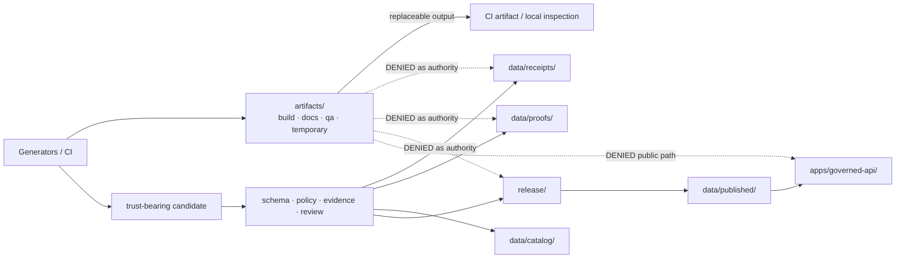

<!-- [KFM_META_BLOCK_V2]
doc_id: kfm://doc/root-artifacts-readme
title: artifacts/ — Transitional Generated-Output Compatibility Root
type: readme
subtype: compatibility-root-landing-page
version: v0.3
prior_version: v0.2
status: draft; repository-grounded; transitional; mixed-conformance; non-authoritative
owner: "NEEDS VERIFICATION — CODEOWNERS routes all repository paths to @bartytime4life; no accepted artifacts steward, required-review rule, or independent approval control was verified"
created: 2026-05-10
updated: 2026-07-23
policy_label: public
current_path: artifacts/README.md
owning_root: artifacts/
responsibility: orient contributors to the tightly scoped generated-output compatibility boundary and route trust-bearing material to canonical data and release homes
truth_posture: cite-or-abstain
truth_labels: [CONFIRMED, PROPOSED, UNKNOWN, NEEDS VERIFICATION, CONFLICTED]
authority_class: compatibility root landing page
authority_rank: non-authoritative generated-output boundary subordinate to Directory Rules, accepted ADRs, canonical responsibility roots, lifecycle records, evidence, policy, and release records
canonical_relationship: same-path update; no sibling authority created
evidence_snapshot:
  repository: bartytime4life/Kansas-Frontier-Matrix
  base_ref: main
  base_commit: 1f093dfc7295f0c2e63c89c3573061ad08698a88
  target_prior_blob: d921f0789939b0789df84d55a3ddabe5d4dd3f5a
  prior_convergence_commit: 43f1d97954debda98691b2685c1bb75c4b63c872
  continuity_compare: 43f1d97954debda98691b2685c1bb75c4b63c872...1f093dfc7295f0c2e63c89c3573061ad08698a88
  artifacts_path_changes_after_prior_convergence: 0
  tracked_artifact_files: 44
  tracked_artifact_bytes: 734530
  directory_rules_doctrine_blob: 2affb080e6f0043867c64c7f06c1ca52030fbd55
  directory_rules_architecture_blob: 18653c00ba193a4afaa3e07a0924452807fb98ef
  codeowners_blob: dd2a84aa514d8ecd9208bc347f90f9a2ed37dd61
  drift_register_blob: 5c5078b93c467e66f4cc8b86a7a696dbce5ae7e0
  adr_index_blob: cf08fae322ac53426f7394d97897fdb942253049
  generated_receipt_schema_blob: fba21ed27ebccf1362fe397fe0c3ebd85e072685
  docs_build_workflow_blob: 202360a8bee431b50633e78c442cc70ca939206a
  maplibre_perf_workflow_blob: bfb36a84ba72bec68d964976dc7964cde7f5d603
  makefile_blob: 51537af34ee065c2de571134688415042b83b22a
related:
  - ../README.md
  - ../docs/doctrine/directory-rules.md
  - ../docs/architecture/directory-rules.md
  - ../docs/adr/INDEX.md
  - ../docs/adr/ADR-0011-receipts-vs-proofs-vs-manifests-vs-catalog-separation.md
  - ../docs/registers/DRIFT_REGISTER.md
  - ../docs/quality/maplibre-perf-governance.md
  - ../data/receipts/generated/genrec-artifacts-readme-modernization-20260723-001.json
  - ../data/receipts/
  - ../data/proofs/
  - ../data/catalog/
  - ../data/published/
  - ../release/
tags: [kfm, artifacts, compatibility-root, transitional, generated-output, trust-boundary, drift, rollback]
notes:
  - "v0.3 is a same-path modernization and evidence refresh. It preserves the v0.2 four-lane boundary, exact tracked inventory, trust-content prohibition, drift findings, validation guidance, migration alternatives, and rollback posture."
  - "The 44-file, 734530-byte inventory is carried forward from the prior recursive scan because the commit compare from the prior convergence merge through the current base contains zero changed paths under artifacts/."
  - "Two distinct Directory Rules files remain live at different blob SHAs. Both impose the same artifacts compatibility boundary; this README records the identity conflict without treating either duplicate placement as resolved canon."
  - "No artifact lane, generated payload, workflow, source, contract, schema, policy, lifecycle record, receipt, proof, release, deployment, promotion, or publication behavior changes in this documentation revision."
[/KFM_META_BLOCK_V2] -->

<!-- KFM-DOC-GRAPH-HINT
This README is parseable. Keep the KFM meta block synchronized with the visible
status, evidence ledger, generated-work receipt, and rollback instructions whenever
this file changes materially.
-->

<a id="top"></a>

<div align="center">

# `artifacts/`

**Transitional compatibility root for disposable generated output—never a truth, evidence, receipt, proof, catalog, release, or publication authority.**

[](#status)
[](#authority-level)
[](#authority-level)
[](#what-belongs-here)
[](#what-does-not-belong-here)
[](#status)
[](#tracked-tree-continuity)
[](#authority-level)

**Quick navigation:** [Purpose](#purpose) · [Authority](#authority-level) · [Status](#status) · [Belongs](#what-belongs-here) · [Exclusions](#what-does-not-belong-here) · [Inputs](#inputs) · [Outputs](#outputs) · [Validation](#validation) · [Review](#review-burden) · [Related](#related-folders) · [ADRs](#adrs) · [Last reviewed](#last-reviewed) · [Drift](#current-drift-and-migration-state) · [Safe change](#safe-change-pattern) · [Rollback](#correction-and-rollback) · [Open verification](#open-verification-register)

</div>

> [!IMPORTANT]
> `artifacts/` is a **compatibility root**, not a source of KFM truth. Its permitted role is limited to derived, regenerable, non-authoritative build output, generated documentation previews, QA reports, and temporary files.

> [!CAUTION]
> The current tree remains on **conformance hold**: tracked `artifacts/release/` and generated `artifacts/perf/` contain or produce trust-shaped names outside the four-lane compatibility boundary. Those paths do not prove release, promotion, correction, rollback, or publication.

> [!WARNING]
> **Directory Rules identity is unresolved.** [`docs/doctrine/directory-rules.md`](../docs/doctrine/directory-rules.md) and [`docs/architecture/directory-rules.md`](../docs/architecture/directory-rules.md) are distinct live files at different blob SHAs. Both restrict `artifacts/` to the same generated-output boundary. Treat the pair as `CONFLICTED` documentation until an accepted placement decision resolves the duplicate identity.

---

## Purpose

`artifacts/` provides a bounded compatibility location for **derived, regenerable, non-authoritative output** that should not pollute canonical source, lifecycle, evidence, or release roots.

Its allowed responsibility is deliberately narrow:

- compiled build output and replaceable distributables;
- generated documentation previews;
- QA, lint, validation, and test reports;
- temporary working files that are ignored or pruned.

It is **not** an evidence store, receipt store, proof store, catalog, published-data store, or release-decision store. If a generated file becomes trust-bearing or durable, it must graduate to its canonical responsibility root through a reviewed, auditable change.

### Terms used in this README

| Term | Meaning here |
|---|---|
| **Compatibility root** | A noncanonical root retained for legacy, mirror, external-export, deprecated, or transitional reasons. |
| **Generated output** | Rebuildable output produced from reviewed source inputs; not edited as source-of-record. |
| **Trust content** | Receipts, proofs, EvidenceBundles, manifests, promotion decisions, rollback/correction records, catalog records, and published artifacts. |
| **Staging** | Disposable intermediate output whose location does not grant authority or release status. |
| **Promotion** | A governed state transition supported by evidence, policy, review, release, correction, and rollback—not a file copy or path name. |

## Authority level

**Compatibility / `transitional` / non-authoritative.**

| Question | Current answer |
|---|---|
| Does this root define object meaning? | No. Semantic meaning belongs in `contracts/`. |
| Does it define machine shape? | No. Schemas belong in `schemas/`. |
| Does it decide allow, deny, hold, or abstain? | No. Policy belongs in `policy/`. |
| Does it hold lifecycle truth? | No. Lifecycle state belongs in `data/`. |
| Does it own evidence, receipts, proofs, catalogs, or published artifacts? | No. Those belong in canonical `data/` lanes. |
| Does it approve release, correction, withdrawal, or rollback? | No. Decisions belong in `release/`. |
| May public clients consume it? | No. Standard clients use governed APIs and released artifacts. |
| May it evolve independently of canonical homes? | No. Compatibility roots must not become parallel authority. |
| What changes require an ADR? | Retiring, promoting, renaming, or materially changing the authority or allowed child-lane contract. |

A generated file under `artifacts/` remains non-authoritative even when it is schema-valid, signed, uploaded by CI, named `ReleaseManifest`, or produced by a passing workflow. Authority follows the governed object lifecycle and owning root, not the filename.

## Status

**CONFIRMED root / transitional class / mixed conformance / `HOLD`.**

The allowed compatibility contract is `build/`, `docs/`, `qa/`, and `temporary/`. Current repository evidence also contains tracked `artifacts/release/`, while MapLibre performance tooling names `artifacts/perf/` as generated staging. Those two paths remain unresolved drift.

### Evidence ledger

| Claim | Truth | Evidence | Limitation |
|---|---|---|---|
| `artifacts/` exists as a tracked root with a README. | CONFIRMED | Current branch file read | Does not establish that every generated/ignored path is inventoried. |
| Directory Rules classifies `artifacts/` as transitional and restricts it to four generated-output lanes. | CONFIRMED doctrine | Both live Directory Rules copies | Their duplicate placement/identity remains `CONFLICTED`. |
| The prior recursive inventory found 44 tracked files and 734,530 bytes. | CONFIRMED | Prior convergence receipt and tracked-tree scan | The count excludes ignored and untracked runtime output. |
| No path under `artifacts/` changed between the prior convergence merge and this base. | CONFIRMED | Commit compare `43f1d979…1f093dfc` | Proves continuity of tracked paths/bytes only, not runtime cleanliness. |
| `artifacts/release/` remains tracked and nonconforming. | CONFIRMED | Tracked tree plus drift register | No move or retirement is authorized by this README. |
| `artifacts/perf/` remains a workflow/script output target and is absent from the tracked inventory. | CONFIRMED | Makefile, scripts, and MapLibre workflow definitions | Generated run contents were not inspected in this session. |
| The docs workflow establishes a built or published documentation site. | UNKNOWN / explicitly held | `docs-build` readiness workflow | The workflow reports no accepted generator, manifest, hosting, or publication handoff. |
| MapLibre performance artifacts constitute valid receipts, proofs, or release records. | DENIED by boundary | MapLibre readiness workflow and Directory Rules | Trust-shaped staging does not become canonical by execution or naming. |
| Deployment, retention, artifact-store, branch-protection, and public-operation posture is established. | UNKNOWN | No admissible operational evidence inspected | Verify separately from settings, infrastructure, logs, and retained workflow artifacts. |

### Tracked-tree continuity

The following inventory was established by the prior recursive scan and remains applicable because the compare from `43f1d97954debda98691b2685c1bb75c4b63c872` through `1f093dfc7295f0c2e63c89c3573061ad08698a88` contains **zero changed paths under `artifacts/`**.

| Tracked lane | Files | Bytes | Conformance | Current evidence |
|---|---:|---:|---|---|
| Root `README.md` | 1 | 20,290 | Allowed | Compatibility-root contract; updated in place by this candidate revision |
| `build/` | 8 | 164,397 | Allowed lane | READMEs, ignore policy, and proposed environment/tool-version scaffolds; no compiled payload tracked |
| `docs/` | 2 | 47,721 | Allowed lane | README plus `.gitkeep`; no generated site or build manifest tracked |
| `qa/` | 26 | 410,757 | Allowed lane, mixed maturity | README scaffolds plus small placeholder report samples; local JUnit output is ignored |
| `release/` | 5 | 78,114 | **Nonconforming / `BLOCKED_ADR`** | Domain README scaffolds plus one proposed release-manifest placeholder |
| `temporary/` | 2 | 13,251 | Allowed lane | README plus `.gitkeep`; expected to be ephemeral |
| **Total** | **44** | **734,530** | **HOLD** | Excludes generated, ignored, and untracked run output |

> [!NOTE]
> The byte total is continuity evidence for the pre-edit tree. This README revision changes the root README bytes; it does not change the child-lane inventory or make the root conformant.

## What belongs here

Only **derived, regenerable, non-authoritative** outputs belong here.

| Allowed lane | Accepted contents | Required posture |
|---|---|---|
| `build/` | Compiled output, distributables, packaging residue | Rebuildable, noncanonical, ignored/pruned where practical |
| `docs/` | Generated documentation previews or renderer output | Source remains under canonical `docs/`; preview is not publication |
| `qa/` | Lint, coverage, validation, JUnit, render-smoke, and inspection reports | May be uploaded as CI artifacts; never proof of release by itself |
| `temporary/` | Scratch files, intermediate work, local run debris | Ephemeral, excluded from trust decisions, regularly pruned |

### Governed target structure

```text
artifacts/
├── README.md       # compatibility contract
├── build/          # compiled outputs and replaceable distributables
├── docs/           # generated documentation previews
├── qa/             # QA, lint, coverage, validation, test reports
└── temporary/      # ephemeral; ignored or pruned
```

A file may remain here only while all of the following are true:

- it is generated rather than hand-authored as source-of-record;
- it is reproducible or safely disposable;
- no public or internal trust decision depends on this copy;
- it does not create a second authority home;
- its retention and cleanup posture are explicit;
- any uploaded CI copy is treated as a run artifact, not KFM publication.

## What does NOT belong here

Trust-bearing or canonical material is forbidden.

| Forbidden content | Why | Canonical home |
|---|---|---|
| `EvidenceBundle`, evidence sidecars, proof packs | Consequential claim support | `data/proofs/` |
| Run, transform, redaction, AI, validation, or release receipts | Durable process memory | `data/receipts/` |
| `ReleaseManifest`, `PromotionDecision`, release signatures | Release decisions and attestations | `release/` |
| `RollbackCard`, correction or withdrawal notice | Governed correction/rollback state | `release/rollback_cards/`, `release/correction_notices/`, `release/withdrawal_notices/` |
| STAC, DCAT, PROV, or domain catalog records | Catalog authority | `data/catalog/` |
| PMTiles, MVT, COG, GeoParquet, style, sprite, glyph, report, or story released for consumers | Published artifact | `data/published/` |
| Source descriptors, source activation, rights/sensitivity registries | Source and admission authority | `data/registry/` and `policy/` |
| Contracts, schemas, policy, validators, or reusable implementation | Canonical source/implementation | `contracts/`, `schemas/`, `policy/`, `tools/`, `packages/`, or `pipelines/` |
| Hand-authored documentation | Human source-of-record | `docs/` |
| Secrets, tokens, keys, private endpoints, protected geometry, restricted payloads | Security and sensitivity violation | Approved external secret/restricted stores; never ordinary Git artifacts |

### Observed held paths

| Path | Truth status | Boundary problem | Safe disposition now |
|---|---|---|---|
| `artifacts/release/` | CONFIRMED tracked | Parallel release-shaped lane; Directory Rules `OPEN-DR-09-b` | Freeze authority claims; retain only as documented drift until accepted ADR + migration + rollback |
| `artifacts/perf/` | CONFIRMED output target; not tracked | Workflow/scripts stage receipt-, proof-, correction-, rollback-, and release-shaped names here | Treat as disposable QA staging; do not cite as canonical; migrate generators only through reviewed work |

### Boundary diagram



## Inputs

Inputs are canonical source material and generator definitions—not ad hoc hand-edited files placed into the output tree.

| Input | Owning root | Artifact use |
|---|---|---|
| Application/package/tool source | `apps/`, `packages/`, `tools/`, `scripts/` | Compile or package into replaceable `build/` output |
| Authored documentation | `docs/` | Generate non-authoritative preview output under `docs/` lane |
| Tests, fixtures, validators | `tests/`, `fixtures/`, `tools/validators/` | Produce QA reports under `qa/` |
| Safe non-secret configuration | `configs/` | Parameterize generators without becoming output authority |
| Workflow definitions | `.github/workflows/` | Orchestrate bounded generation/upload; no publication authority |
| Pipeline scratch state | `pipelines/` plus lifecycle stores | May use temporary staging only when no trust decision depends on it |

Current confirmed generators and checks include documentation-readiness workflows, boundary-guard JUnit emission, and MapLibre performance readiness scripts. Their presence proves configured paths—not current successful execution, retention, release, or publication.

## Outputs

Outputs are terminal, transient, or uploaded run artifacts:

| Output class | Allowed downstream use | Prohibited interpretation |
|---|---|---|
| Build output | Replaceable package/build inspection or external CI upload | Released KFM data or evidence |
| Docs preview | Renderer/build inspection | Canonical authored documentation or public publication |
| QA report | Debugging, review support, bounded CI evidence | Proof pack, policy approval, or release approval by itself |
| Temporary output | Local/intermediate processing | Durable input to a governed decision |
| Held `perf/` staging | Static/runtime readiness work while placement is unresolved | Canonical receipt, proof, correction, rollback, or release record |

Nothing under `artifacts/` is a standard input to [`apps/governed-api/`](../apps/governed-api/) or [`apps/explorer-web/`](../apps/explorer-web/). Public and semi-public clients consume governed API responses and released artifacts from canonical homes.

## Validation

Validation must distinguish **source inspection**, **command availability**, **observed execution**, and **authority**.

### Repository-native surfaces

| Surface | Current verified role | What it proves | What it does not prove |
|---|---|---|---|
| `make validate` | Aggregate schema/contract command is defined | A repository command exists | It was executed successfully for this revision or validates artifact placement |
| `make boundary-guards` | Public/trust-boundary test command is defined | Bounded negative controls are wired | Complete information-flow proof or release readiness |
| `make boundary-guards-ci` | Writes JUnit to `artifacts/qa/` | QA output path is intentional | JUnit output is canonical evidence or release approval |
| `docs-build` workflow | Explicit readiness hold | `docs/` source and `artifacts/docs/` preview boundary are inspected | Docs were rendered, uploaded, hosted, released, or published |
| `MapLibre Perf Governance` workflow | Runs syntax and bounded negative checks, then holds runtime/governance maturity | Current static checks and held assumptions | Browser performance, proof closure, signing, release eligibility, or publication safety |
| Prior convergence receipt | Records `make validate` and boundary checks passing at the prior convergence snapshot | Historical bounded validation lineage | Current branch execution or human approval |
| Compatibility allowlist validator | None verified | — | The four-child contract is not currently machine-enforced |

### Required checks for a material `artifacts/` change

- exact tracked and ignored/generated path inventory;
- no trust-bearing object under `artifacts/`;
- no new top-level child beyond the four permitted lanes without accepted authority;
- no public or governed-API read from `artifacts/`;
- deterministic generator input/output and cleanup behavior;
- secret and protected-content scan;
- repository-relative link and fragment validation for README changes;
- KFM Meta Block, heading order, code fence, Mermaid, and HTML balance;
- generated-work receipt whose hash matches the final README;
- rollback or migration plan for any path move, retirement, or generator rehome.

> [!NOTE]
> This documentation session performs source-level structural validation. It does not claim local repository test execution, hosted workflow success, deployment health, or human review.

## Review burden

| Change | Required concern |
|---|---|
| README-only clarification | Compatibility boundary, evidence accuracy, links, no-loss, rollback |
| New or changed generated output | Generator ownership, reproducibility, retention, upload, cleanup, secrets, sensitivity |
| New child lane | Directory Rules, ADR trigger, parallel-authority risk, migration/rollback |
| Trust-shaped output | Canonical destination, schema/contract, evidence, policy, release, correction, rollback |
| Workflow or uploader | Least privilege, untrusted PR code, network, retention, artifact naming, public exposure |
| Retirement or canonical promotion | Accepted ADR, complete inventory, migration manifest, compatibility window, rollback drill |

Current GitHub review routing is the repository-wide `* @bartytime4life` rule. That is a verified review-request route—not proof of an accepted artifacts steward, required code-owner review, approval, separation of duties, or branch protection.

No contributor may use a generated receipt, green check, signed staging file, or this README as self-approval for release or publication.

## Related folders

| Folder | Relationship |
|---|---|
| [`data/receipts/`](../data/receipts/) | Canonical process-memory records; never mirrored as authority here |
| [`data/proofs/`](../data/proofs/) | EvidenceBundles, proof packs, integrity and validation support |
| [`data/catalog/`](../data/catalog/) | STAC/DCAT/PROV and domain catalog records |
| [`data/published/`](../data/published/) | Released public-safe artifacts consumed downstream |
| [`release/`](../release/) | Release, promotion, correction, withdrawal, signature, and rollback decisions |
| [`docs/`](../docs/) | Authored documentation source; may generate preview output here |
| [`tests/`](../tests/) · [`fixtures/`](../fixtures/) | Test definitions and safe fixtures; may generate QA reports here |
| [`tools/validators/`](../tools/validators/) | Validator source; no artifact-root allowlist validator verified |
| [`apps/governed-api/`](../apps/governed-api/) | Public trust membrane; must not read `artifacts/` as truth |
| [`apps/explorer-web/`](../apps/explorer-web/) | Map-first client; must consume governed interfaces and released artifacts |
| [`docs/registers/DRIFT_REGISTER.md`](../docs/registers/DRIFT_REGISTER.md) | Records the open artifacts authority drift |
| [`docs/quality/maplibre-perf-governance.md`](../docs/quality/maplibre-perf-governance.md) | Describes the MapLibre staging and proof/release maturity gap |

## ADRs

No accepted ADR currently changes the compatibility-root boundary or resolves the disposition of `artifacts/`.

| Record | Current repository posture | Relationship |
|---|---|---|
| Directory Rules §18 `artifacts/` disposition question | OPEN | Retain the compatibility root or retire it in favor of canonical data/release homes |
| Directory Rules `OPEN-DR-09-b` | `BLOCKED_ADR` | Resolve tracked `artifacts/release/` as a parallel release-shaped home |
| Directory Rules `OPEN-DR-14` / duplicate placement question | OPEN / `CONFLICTED` | Resolve the two live Directory Rules identities before treating either placement as exclusive canon |
| [`ADR-0011`](../docs/adr/ADR-0011-receipts-vs-proofs-vs-manifests-vs-catalog-separation.md) | Effective status `proposed` | Design lineage for keeping receipts, proofs, manifests, and catalogs distinct; not accepted authority |
| [`ADR index`](../docs/adr/INDEX.md) | 28 numbered records, all effectively `proposed` at its pinned inventory | An index cannot promote a decision or prove approval |

A README edit may document these questions; it cannot decide them.

## Last reviewed

**2026-07-23**, against `main@1f093dfc7295f0c2e63c89c3573061ad08698a88`.

Re-review after any of the following:

- an accepted artifacts-disposition or release-placement ADR;
- a move, deletion, or new child under `artifacts/`;
- a MapLibre performance output-path change;
- a documentation generator or hosting contract becoming implementation-bearing;
- an artifact upload, retention, or cleanup policy change;
- a trust-content placement validator becoming executable;
- a Directory Rules identity/placement resolution;
- a default-branch change that invalidates the evidence snapshot.

## Current drift and migration state

### Drift register

| Drift | Current state | Decision needed | Until resolved |
|---|---|---|---|
| `artifacts/release/` | Tracked, nonconforming | Retire/rehome through accepted ADR and one-pass migration | Freeze authority claims; no new release truth here |
| `artifacts/perf/` | Generated staging target, untracked in prior inventory | Rehome trust-shaped products or explicitly define disposable staging | Do not cite staging as canonical; keep workflow fail-safe |
| Four-child allowlist not machine-enforced | Verification gap | Add a repository-owned validator only through reviewed scope | Review every new path manually and fail closed |
| Duplicate Directory Rules identities | `CONFLICTED` documentation | Accepted placement/supersession decision | Cite both where material and avoid unilateral canonicality claims |

### Decision alternatives

<details>
<summary><strong>Retain <code>artifacts/</code> as a compatibility root</strong></summary>

A retain decision should:

1. freeze the class and four-child allowlist;
2. rehome `artifacts/release/` and trust-shaped `artifacts/perf/` products;
3. add an executable allowlist and trust-content placement validator;
4. make retention and cleanup explicit per lane;
5. keep all standard clients and release processes on canonical homes;
6. preserve a tested rollback for generator path changes.

</details>

<details>
<summary><strong>Retire <code>artifacts/</code></strong></summary>

A retirement decision should:

1. inventory tracked, ignored, generated, uploaded, and downstream-consumed outputs;
2. route build/docs/QA outputs to CI artifact storage or reviewed deployment targets;
3. route trust-bearing objects to canonical `data/` and `release/` homes;
4. update generators, workflows, docs, links, ignores, retention rules, and consumers in one migration plan;
5. record deprecation and compatibility windows;
6. verify rollback before deleting the root.

</details>

Neither alternative is selected by this README.

## Safe change pattern

1. Pin the base commit and read the complete target, child-lane READMEs, Directory Rules, ADR index, drift register, generators, workflows, and consumers.
2. Classify each proposed output as disposable generated material or trust-bearing/canonical content.
3. Keep disposable output within `build/docs/qa/temporary`; route everything else to its owning root.
4. Define deterministic inputs, output identity, retention, cleanup, secret/sensitivity handling, and failure states.
5. Add positive and negative tests appropriate to the generator and destination.
6. Validate links, metadata, hashes, path allowlists, public-boundary denial, and rollback.
7. Deliver through a scoped branch and separate draft PR; do not merge, release, deploy, promote, or publish as part of routine documentation work.

## Version history and no-loss ledger

| Version | Date | Change | Authority effect |
|---|---|---|---|
| v0.2 | 2026-07-22 | Reconciled the compatibility boundary, exact inventory, tracked release drift, generated perf drift, validation, and migration alternatives | Documentation + drift record only |
| v0.3 | 2026-07-23 | Refreshes current evidence, ownership language, Directory Rules conflict, exact §15 heading order, validation claims, review limits, change lineage, and rollback | Documentation + generated provenance only |

### v0.2 material preserved

- compatibility / transitional classification;
- strict `build/docs/qa/temporary` allowlist;
- complete trust-content prohibition and canonical destination table;
- 44-file / 734,530-byte inventory and per-lane counts;
- `artifacts/release/` and `artifacts/perf/` drift findings;
- generator, input, output, validation, review, and related-root guidance;
- boundary diagram and reviewer checks;
- retain-versus-retire alternatives;
- drift-register linkage and MapLibre placement conflict;
- correction, migration, and rollback posture.

No stable target path or authority surface was replaced by a sibling document.

## Correction and rollback

### Documentation correction

When a claim in this README becomes stale:

1. pin the correcting evidence;
2. update the claim and truth label at this same path;
3. preserve prior wording in Git history rather than silently erasing lineage;
4. update the generated-work receipt and relevant drift/verification records;
5. avoid changing artifact structure merely to make the prose appear correct.

### Candidate rollback

To roll back this documentation-only modernization before merge:

- restore `artifacts/README.md` from prior blob `d921f0789939b0789df84d55a3ddabe5d4dd3f5a`;
- remove `data/receipts/generated/genrec-artifacts-readme-modernization-20260723-001.json` from the candidate branch;
- preserve the abandoned branch/PR history if review findings are useful.

After merge, use a transparent revert or a reviewed corrective PR. Do not rewrite shared history. This rollback has no artifact-generator, lifecycle, release, deployment, or publication effect because the change modifies none of those surfaces.

## Open verification register

| Item | Truth | Evidence needed |
|---|---|---|
| Current ignored/untracked contents beneath `artifacts/` | UNKNOWN | Clean mounted checkout plus `git status --ignored`, generator dry-runs, and retained workflow artifact inventory |
| Exact generator-to-output map | NEEDS VERIFICATION | Static path analysis plus safe executions and output manifests |
| CI artifact retention and access posture | UNKNOWN | Repository Actions retention settings, artifact permissions, and observed runs |
| Public or deployed consumers of artifact URLs | UNKNOWN | Deployment config, reverse proxy/CDN, application config, logs, and runtime traces |
| Four-child compatibility allowlist enforcement | NEEDS VERIFICATION | Repository-owned validator, negative fixtures, workflow invocation, and current run |
| Accepted artifacts disposition | UNKNOWN / OPEN | Accepted ADR, migration manifest, review record, transition window, rollback proof |
| Independent reviewer and steward enforcement | NEEDS VERIFICATION | Rulesets, branch protection, review records, and stewardship assignments |
| Directory Rules canonical identity | CONFLICTED | Accepted supersession/placement decision and repaired inbound links |

---

> **Current conclusion:** `artifacts/` remains a transitional generated-output compatibility root with four permitted lanes and unresolved authority drift. Keep it disposable, non-public, and outside the trust membrane. Do not let release-shaped filenames, uploaded CI output, or passing checks convert staging into evidence, proof, release, or publication.

<p align="right"><a href="#top">Back to top</a></p>
