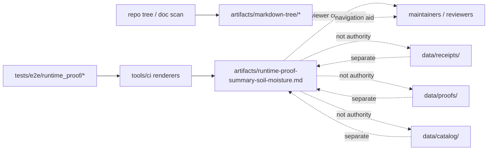

<!-- [KFM_META_BLOCK_V2]
doc_id: kfm://doc/NEEDS-VERIFICATION
title: artifacts
type: standard
version: v1
status: draft
owners: NEEDS VERIFICATION
created: YYYY-MM-DD
updated: YYYY-MM-DD
policy_label: NEEDS VERIFICATION
related: [../README.md, ./markdown-tree/README.md, ./runtime-proof-summary-soil-moisture.md, ../tests/e2e/runtime_proof/soil_moisture/README.md, ../tools/ci/README.md, ../data/receipts/README.md, ../data/proofs/README.md, ../data/catalog/README.md, ../.github/workflows/README.md]
tags: [kfm, artifacts, reviewer-output, markdown-tree, derived]
notes: [Grounded to the current public-main artifacts tree and the substantive runtime-proof summary artifact visible in this directory. `doc_id`, owners, dates, and policy label still need repo-backed verification.]
[/KFM_META_BLOCK_V2] -->

<a id="top"></a>

# artifacts

Generated, reviewer-facing, and repo-inspection artifacts that help people inspect KFM state without replacing canonical contracts, receipts, proofs, or catalogs.

> **Status:** `experimental`  
> **Owners:** `NEEDS VERIFICATION`  
> **Path:** `artifacts/README.md`  
>       
> **Quick jumps:** [Scope](#scope) · [Repo fit](#repo-fit) · [Accepted inputs](#accepted-inputs) · [Exclusions](#exclusions) · [Current public snapshot](#current-public-snapshot) · [Directory tree](#directory-tree) · [Quickstart](#quickstart) · [Usage](#usage) · [Diagram](#diagram) · [Artifact classes](#artifact-classes) · [Definition of done](#definition-of-done) · [FAQ](#faq)

> [!IMPORTANT]
> `artifacts/` is a **derived-artifact surface**.
>
> It is for compact reviewer outputs, inventory exports, and similar convenience artifacts that clarify already-produced evidence.
>
> It is **not** the canonical home for:
>
> - source-admission law
> - policy bundles
> - run receipts
> - proof packs
> - release manifests
> - catalog closure
> - hidden publish logic

> [!NOTE]
> The current public tree for this directory is intentionally small.
>
> This README therefore does two jobs at once:
>
> 1. records the **confirmed current snapshot** honestly  
> 2. gives the directory a **clean repo-fit contract** so future additions do not drift into policy, proof, or catalog authority by accident

---

## Scope

`artifacts/` is the repo surface for **small derived outputs** that are useful to reviewers and maintainers but are **not themselves authoritative trust objects**.

In practical KFM terms, this directory is a good fit for:

- reviewer-facing summary Markdown
- compact exports of repo documentation structure
- generated indexes that help people navigate repo-facing materials
- lightweight derived views over stronger upstream evidence

It is a poor fit for anything whose primary job is to **define truth**, **decide policy**, **carry release authority**, or **store canonical process memory**.

### One-line rule

Use `artifacts/` when the main job is to **help humans inspect** repo state or already-produced evidence quickly.

Move out of `artifacts/` when the main job becomes:

- define canonical object shape
- decide allow/deny/review outcomes
- store process-memory receipts
- store release-significant proofs
- close `STAC + DCAT + PROV`
- act as the publish surface itself

[Back to top](#top)

---

## Repo fit

**Path:** `artifacts/README.md`  
**Primary role:** directory README for generated reviewer aids and inspection-friendly derived outputs

| Direction | Surface | Why it matters |
|---|---|---|
| Upstream | [`../README.md`](../README.md) | Root repo identity and overall verification-first posture |
| Local child | [`./markdown-tree/README.md`](./markdown-tree/README.md) | Child export lane for markdown-tree outputs |
| Local child | [`./runtime-proof-summary-soil-moisture.md`](./runtime-proof-summary-soil-moisture.md) | Current substantive reviewer-facing artifact already in this directory |
| Adjacent | [`../tests/e2e/runtime_proof/soil_moisture/README.md`](../tests/e2e/runtime_proof/soil_moisture/README.md) | Upstream runtime-proof leaf whose derived reviewer summary currently lands here |
| Adjacent | [`../tools/ci/README.md`](../tools/ci/README.md) | Reviewer-facing render helpers and compact CI summaries belong there, not here |
| Adjacent | [`../.github/workflows/README.md`](../.github/workflows/README.md) | Workflow orchestration may publish or upload artifacts, but workflow docs remain the orchestration boundary |
| Downstream-adjacent | [`../data/receipts/README.md`](../data/receipts/README.md) | Receipts are process memory and should stay separate |
| Downstream-adjacent | [`../data/proofs/README.md`](../data/proofs/README.md) | Proof packs and release evidence remain stronger trust objects than convenience artifacts |
| Downstream-adjacent | [`../data/catalog/README.md`](../data/catalog/README.md) | Catalog closure belongs there, not in `artifacts/` |

### Repo-fit summary

| Question | Answer |
|---|---|
| What is `artifacts/` for? | Small, derived, review-friendly outputs that summarize or expose stronger upstream work without replacing it |
| What is `artifacts/` **not** for? | Not canonical contracts, not policy truth, not receipt storage, not release proof, not outward catalog authority |
| Why keep this boundary sharp? | Because KFM depends on visible separation between convenience outputs and trust-bearing objects |

[Back to top](#top)

---

## Accepted inputs

The directory should stay selective.

| Accepted input | Why it belongs here | Typical shape |
|---|---|---|
| Reviewer-facing summary Markdown | Lets reviewers inspect already-produced evidence without opening the full lane | `*-summary*.md` |
| Repo-inspection exports | Makes directory and README structure easy to scan | `tree.md`, `tree.json`, `index.csv` |
| Small generated indexes | Useful for navigation and review when they point back to stronger sources | `.md`, `.json`, `.csv` |
| Compact derived views of runtime/release checks | Helpful when they stay clearly subordinate to receipts, proofs, and catalogs | summary-only artifacts |
| Public-safe generated documentation aids | Keeps repo-facing navigation easy without mixing in canonical authority | markdown or index artifacts |

### Input rules

1. Prefer **small** outputs over heavy bundles.
2. Prefer **deterministic** outputs over hand-edited drift.
3. Keep the upstream authority visible.
4. Keep filenames reviewable and purpose-specific.
5. Keep trust splits explicit:
   - summary ≠ receipt
   - summary ≠ proof
   - summary ≠ catalog
   - export ≠ authority

[Back to top](#top)

---

## Exclusions

These do **not** belong here as the normal case.

| Does **not** belong here | Put it here instead | Why |
|---|---|---|
| Raw source payloads or intake captures | `../data/raw/` | Raw evidence should stay in the governed data lifecycle |
| In-flight transforms and staging material | `../data/work/` | Work state is not a reviewer-summary surface |
| Blocked or unresolved material | `../data/quarantine/` | Ambiguity should stay explicit |
| Canonical processed versions | `../data/processed/` | Stable transformed authority belongs there |
| Run receipts and validation memory | `../data/receipts/` | Process memory must remain queryable and distinct |
| Proof packs, attestations, signed manifests | `../data/proofs/` | Release-significant evidence should not be flattened into convenience files |
| `STAC + DCAT + PROV` closure artifacts | `../data/catalog/` | Catalog closure is a stronger outward truth surface |
| Policy bundles or decision grammars | `../policy/` | Decision authority must stay upstream |
| Schema or contract source of truth | `../schemas/`, `../contracts/` | `artifacts/` should consume authority, not invent it |
| Live workflow code or hidden automation logic | `../.github/workflows/`, `../tools/`, `../scripts/` | Orchestration and helpers belong in their own lanes |

[Back to top](#top)

---

## Current public snapshot

The current public-main snapshot is small enough to state directly.

| Path | Current visible state | Evidence posture | Notes |
|---|---|---|---|
| `artifacts/README.md` | Present | **CONFIRMED** | Existing file is effectively empty; this revision gives it a real directory contract |
| `artifacts/markdown-tree/` | Present | **CONFIRMED** | Child export surface with `README.md`, `index.csv`, `tree.json`, and `tree.md` |
| `artifacts/markdown-tree/README.md` | Present | **CONFIRMED** | Currently empty in the visible public tree |
| `artifacts/runtime-proof-summary-soil-moisture.md` | Present | **CONFIRMED** | Current substantive derived artifact in this directory |
| `artifacts/` overall role as a derived-artifact surface | Derived from visible contents | **INFERRED** | The current child set points toward inspection/export/reviewer-summary work rather than canonical authority |

[Back to top](#top)

---

## Directory tree

### Current confirmed snapshot

```text
artifacts/
├── README.md
├── markdown-tree/
│   ├── README.md
│   ├── index.csv
│   ├── tree.json
│   └── tree.md
└── runtime-proof-summary-soil-moisture.md
```

### Reading rule

Treat the tree above as a **confirmed current snapshot**, not as a promise that every future branch will stay identical.

This README should be updated when:

- a new committed artifact family appears here
- a child export surface becomes substantive
- a generated artifact starts carrying more trust weight than “review convenience”

[Back to top](#top)

---

## Quickstart

Use inspection-first commands so this README stays honest as the branch evolves.

### 1. Inspect the local subtree

```bash
find artifacts -maxdepth 3 -print | sort
```

### 2. Read the current substantive child artifact

```bash
sed -n '1,220p' artifacts/runtime-proof-summary-soil-moisture.md
```

### 3. Inspect the markdown-tree export surface

```bash
find artifacts/markdown-tree -maxdepth 2 -print | sort
sed -n '1,80p' artifacts/markdown-tree/tree.md
```

### 4. Re-check adjacent stronger authority lanes before widening this one

```bash
sed -n '1,220p' data/receipts/README.md
sed -n '1,220p' data/proofs/README.md
sed -n '1,220p' data/catalog/README.md
sed -n '1,220p' tools/ci/README.md
sed -n '1,220p' tests/e2e/runtime_proof/soil_moisture/README.md
```

> [!TIP]
> If a proposed new artifact would be hard to explain after those reads, it likely belongs somewhere else.

[Back to top](#top)

---

## Usage

### 1. Generate from stronger upstream surfaces

A file in `artifacts/` should usually be derived from something stronger, such as:

- a runtime-proof leaf
- a CI renderer/helper lane
- a documentation-tree export
- a release or review summary pipeline

Do not make `artifacts/` the first place where meaning appears.

### 2. Keep the trust split visible

A summary file can help a reviewer, but it should still make the upstream truth objects discoverable.

Keep these distinctions explicit:

- runtime response
- receipt
- proof
- catalog closure
- published scope

### 3. Prefer compact, legible outputs

The best fit here is usually:

- one screen to a few screens of reviewable Markdown
- a compact CSV/JSON index
- a small export that helps orientation

Large bundles and opaque generated blobs belong elsewhere.

### 4. Make deletion or regeneration cheap

Unless a file is intentionally committed as a durable review artifact, prefer shapes that are easy to:

- regenerate
- compare
- replace
- drop without damaging canonical trust state

[Back to top](#top)

---

## Diagram



### Reading rule

The center of gravity here is **derived convenience**, not **canonical authority**.

`artifacts/` is strongest when it helps reviewers move faster **without** blurring where truth actually lives.

[Back to top](#top)

---

## Artifact classes

| Artifact class | Current fit | Status |
|---|---|---|
| Reviewer summary Markdown | Strong fit | **CONFIRMED by current soil-moisture summary artifact** |
| Repo-tree export bundle | Strong fit | **CONFIRMED by current `markdown-tree/` contents** |
| Compact generated index files | Good fit | **CONFIRMED / INFERRED** |
| Release-significant signed bundles | Poor fit as primary home | **EXCLUDED** |
| Canonical policy or schema sources | Poor fit as primary home | **EXCLUDED** |
| Large raw or processed datasets | Poor fit as primary home | **EXCLUDED** |

[Back to top](#top)

---

## Definition of done

This README is in good shape when:

- [ ] the current public tree snapshot is stated honestly
- [ ] the directory role is clear in one screenful
- [ ] receipts, proofs, catalogs, and artifacts stay visibly separate
- [ ] local child surfaces are linked directly
- [ ] accepted inputs and exclusions are concrete
- [ ] inspection-first quickstart commands are present
- [ ] no section quietly upgrades this directory into a stronger authority lane
- [ ] future maintainers can tell where a new file belongs before they commit it

[Back to top](#top)

---

## FAQ

### Is `artifacts/` the same as `data/receipts/`?

No.

`data/receipts/` is for **process memory**: run receipts, validation reports, and replay/correction-ready audit linkage.

`artifacts/` is for **derived convenience outputs** that help review and inspection.

### Is `artifacts/` the same as `data/proofs/`?

No.

`data/proofs/` is where **release-significant evidence** belongs.

`artifacts/` may summarize or point at proof-bearing material, but it should not replace it.

### Is `artifacts/markdown-tree/` a source of truth for repo structure?

Not by itself.

It is a useful export surface for repo inspection, but the checked-out tree remains the stronger source of “what exists now”.

### Should every generated summary land here?

No.

Use `artifacts/` only when the artifact is:

- small
- reviewable
- public-safe or repo-safe to commit
- clearly subordinate to stronger upstream authority

If the output is release-significant, policy-bearing, or canonical, move it elsewhere.

[Back to top](#top)
