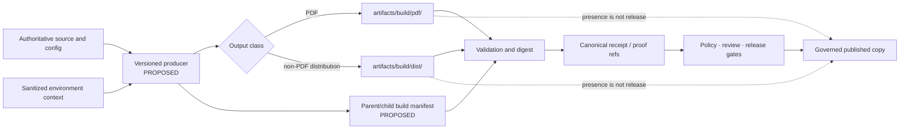

<!-- [KFM_META_BLOCK_V2]
doc_id: kfm://doc/artifacts-build-readme
title: artifacts/build/ — Governed Build-Staging Parent and Mixed-Maturity Output Matrix
type: readme; directory-readme; build-staging-parent; compatibility-boundary; reproducibility-index; release-handoff-index
version: v1.1
status: draft; repository-grounded; compatibility-root; transitional; mixed-maturity; parent-readme-and-gitkeep-tracked; env-scaffolds-tracked-incomplete; pdf-readme-only; dist-readme-only-generated-contents-ignored; no-parent-producer; no-parent-manifest; no-parent-schema; no-parent-validator; no-parent-workflow; reproducibility-unproven; release-binding-unestablished; non-authoritative
owners: OWNER_TBD — Build steward · Reproducibility steward · Packaging steward · PDF/document steward · Application/package stewards · Supply-chain steward · Security/privacy steward · Rights/accessibility stewards · Receipt/proof steward · Release steward · CI steward · Docs steward
created: 2026-05-20
updated: 2026-07-16
supersedes: v1 doctrine-only build-output README
policy_label: public-doc; artifacts; build; compatibility-root; generated-output; reproducibility; deterministic-builds; no-secrets; no-trust-authority; no-release-authority; correction-aware; rollback-aware
current_path: artifacts/build/README.md
truth_posture: CONFIRMED target README and prior blob, Directory Rules classification of artifacts as a transitional compatibility root, root artifacts README boundary, tracked parent README and .gitkeep, tracked env README/build-env.json/tool-versions.yaml, tracked pdf README, tracked dist README, current child maturity statements, root package and Explorer Web build commands remaining TODO-only, Makefile lacking parent/PDF/dist/environment build targets, docs-build workflow remaining TODO-only, root gitignore applying dist/ to nested distribution directories while not protecting pdf/ or env/ generally, MapLibre artifact commands writing to artifacts/perf rather than artifacts/build, bounded search surfacing no parent producer or consumer, and checked absence of artifacts/build/build-manifest.json, schemas/artifacts/build-manifest.schema.json, scripts/build-artifacts.sh, and .github/workflows/build-artifacts.yml / PROPOSED parent build manifest, source-to-output registry, producer registry, output-class routing rules, immutable build-run identity, normalized environment contract, deterministic PDF and archive profiles, repeated-build comparisons, digest and SBOM sidecars, structured validation reports, CI artifact retention, canonical receipt/proof/release binding, correction and rollback propagation, and migration or retirement / CONFLICTED parent v1 claims of pinned deterministic PDF/A-2u and digest production versus no verified producer or validator; env files tracked and mutable-looking versus immutable per-run evidence needs; pdf output not ignored versus dist output ignored; compatibility staging versus canonical receipt/proof/release homes; local sidecars versus governed records; parent "build" name versus substantive MapLibre outputs written to artifacts/perf; and generated-output convenience versus repository-binary growth / UNKNOWN untracked local outputs, ignored dist contents, CI-only artifacts, external build systems, release assets, object stores, complete recursive inventory, installed tools, reproducibility rate, security scan state, rights/accessibility review state, active consumers, branch-protection significance, operational retention, deployment behavior, and production use / NEEDS VERIFICATION accepted owners, CODEOWNERS, retain/migrate/retire decision, complete child registry, generated-output commit policy, producer and consumer contracts, manifest/schema homes, toolchain pins, source-date derivation, no-network policy, secret/path redaction, PDF conformance profile, archive normalization profile, SBOM/signature policy, CI ownership, retention classes, release handoff, correction consumers, and rollback execution
evidence_snapshot:
  repository: bartytime4life/Kansas-Frontier-Matrix
  repository_id: "1059091169"
  visibility: public
  base_ref: main
  base_commit: d4da1d8bd25fac0255c87ea4d05e2e4c2f5a2fd3
  target_prior_blob: 6444fca11743ffff6256fd24ba775b4b29c13e1f
  confirmed_parent_files:
    - artifacts/build/README.md
    - artifacts/build/.gitkeep
  confirmed_child_lanes:
    - artifacts/build/env/README.md
    - artifacts/build/env/build-env.json
    - artifacts/build/env/tool-versions.yaml
    - artifacts/build/pdf/README.md
    - artifacts/build/dist/README.md
  checked_absent_paths:
    - artifacts/build/build-manifest.json
    - schemas/artifacts/build-manifest.schema.json
    - scripts/build-artifacts.sh
    - .github/workflows/build-artifacts.yml
  execution_surfaces:
    - package.json
    - apps/explorer-web/package.json
    - Makefile
    - .github/workflows/docs-build.yml
    - .gitignore
  bounded_inventory_note: tracked repository evidence cannot establish ignored distribution contents, uncommitted local files, CI workspaces, external builders, historical outputs, release assets, object stores, registries, or uninspected subprojects
related:
  - ../README.md
  - ./env/README.md
  - ./pdf/README.md
  - ./dist/README.md
  - ./env/build-env.json
  - ./env/tool-versions.yaml
  - ../../docs/doctrine/directory-rules.md
  - ../../docs/runbooks/DOCTRINE_ARTIFACT_PREFLIGHT.md
  - ../../package.json
  - ../../apps/explorer-web/package.json
  - ../../Makefile
  - ../../.github/workflows/docs-build.yml
  - ../../.gitignore
  - ../../data/receipts/README.md
  - ../../data/proofs/README.md
  - ../../data/published/README.md
  - ../../release/README.md
tags: [kfm, artifacts, build, compatibility, environment, pdf, dist, reproducibility, deterministic-builds, digests, sbom, accessibility, security, retention, release-handoff, correction, rollback]
notes:
  - "v1.1 replaces doctrine-only and over-specific implementation claims with a commit-pinned parent inventory and mixed-maturity child matrix."
  - "The parent has no established producer, manifest, schema, validator, workflow, or consumer."
  - "The environment lane contains tracked incomplete scaffolds; the PDF lane is README-only; distribution bytes are normally ignored by the root dist/ rule."
  - "MapLibre performance artifacts are a separate artifacts/perf lane and do not establish artifacts/build maturity."
  - "This revision changes documentation only."
[/KFM_META_BLOCK_V2] -->

<a id="top"></a>

# `artifacts/build/` — Governed Build-Staging Parent and Mixed-Maturity Output Matrix

> **Purpose.** Route derived build context and generated bytes into narrowly scoped staging lanes while preserving reproducibility, security, accessibility, rights, evidence, release, correction, and rollback boundaries. A build command, generated file, digest, validation log, CI artifact, or successful workflow never becomes source authority, evidence closure, release approval, publication, or production truth.

<p>
  
  
  
  
  
  
</p>

**Quick navigation:** [Status](#status-and-evidence-boundary) · [Purpose](#purpose-and-audience) · [Authority](#authority-and-directory-rules-basis) · [Inventory](#confirmed-current-inventory) · [Lane matrix](#child-lane-maturity-and-routing-matrix) · [Build model](#governed-build-staging-model) · [Inputs](#input-and-source-contract) · [Outputs](#output-classification-and-routing) · [Environment](#environment-and-toolchain-contract) · [PDF](#pdf-build-contract) · [Distribution](#distribution-build-contract) · [Reproducibility](#reproducibility-and-determinism) · [Security](#security-rights-accessibility-and-sensitive-content) · [Digests](#digests-sboms-signatures-and-provenance) · [Lifecycle](#lifecycle-receipt-proof-and-release-boundary) · [Producer](#producer-and-consumer-contracts) · [Validation](#validation-and-finite-outcomes) · [CI](#ci-artifact-and-retention-boundary) · [Correction](#correction-withdrawal-and-rollback) · [Review](#review-burden-and-change-control) · [Done](#definition-of-done) · [Plan](#smallest-sound-implementation-sequence) · [Open](#open-verification-register) · [Evidence](#evidence-ledger) · [Rollback](#documentation-correction-and-rollback)

---

## Status and evidence boundary

> [!IMPORTANT]
> **Snapshot:** `main@d4da1d8bd25fac0255c87ea4d05e2e4c2f5a2fd3`<br>
> **Prior README blob:** `6444fca11743ffff6256fd24ba775b4b29c13e1f`<br>
> **Confirmed parent files:** `README.md`, `.gitkeep`<br>
> **Confirmed children:** `env/`, `pdf/`, `dist/`<br>
> **Parent producer / manifest / schema / validator / workflow / consumer:** not established<br>
> **Reproducibility and release binding:** not established

`artifacts/build/` is a repository-confirmed transitional compatibility parent. It is **not** an operational build platform.

The prior README correctly protected the trust boundary, but it presented a detailed Pandoc → XeLaTeX → Ghostscript → qpdf chain, PDF/A-2u output, linearization, and `ARTIFACT_DIGEST` sidecars as if current implementation supported them. Current repository evidence does not establish those behaviors.

### Safe conclusion

| Capability | Status | Evidence-bounded conclusion |
|---|---:|---|
| Parent README and `.gitkeep` | `CONFIRMED` | The parent boundary and directory retention marker exist. |
| Child lane structure | `CONFIRMED` | `env/`, `pdf/`, and `dist/` are documented children. |
| Environment context | `SCAFFOLD ONLY` | Two tracked machine files are incomplete and `PROPOSED`. |
| PDF output system | `NOT ESTABLISHED` | Direct lane is README-only; no producer or conformance chain is verified. |
| Distribution system | `NOT ESTABLISHED` | Direct lane is README-only; generated contents are normally ignored. |
| Parent build producer | `NOT ESTABLISHED` | No parent writer or orchestration command surfaced. |
| Parent manifest/schema/validator | `NOT ESTABLISHED` | Checked candidate paths are absent. |
| Parent CI workflow | `NOT ESTABLISHED` | No build-artifact workflow surfaced. |
| Root package build | `TODO-ONLY` | The root `build` script only echoes a TODO. |
| Explorer Web build | `TODO-ONLY` | The app-local `build` script only echoes TODO. |
| Documentation build | `TODO-ONLY` | `docs-build.yml` does not build or publish. |
| MapLibre artifact chain | `SEPARATE LANE` | Substantive commands write to `artifacts/perf/`, not this parent. |
| Repeated-build proof | `NOT ESTABLISHED` | No equality or normalized-equivalence report was verified. |
| Canonical receipt/proof/release refs | `NOT ESTABLISHED` | No governed record is bound to this parent. |
| Production/public use | `UNKNOWN` | Repository staging documentation does not prove deployment. |

### Truth labels

| Label | Meaning in this README |
|---|---|
| `CONFIRMED` | Verified from current repository files, exact paths, or bounded search. |
| `PROPOSED` | A recommended contract, path, command, manifest, or gate not established as current implementation. |
| `CONFLICTED` | Current files or documentation create incompatible expectations. |
| `UNKNOWN` | Not observable or not established from inspected evidence. |
| `NEEDS VERIFICATION` | Checkable, but not sufficiently proven for reliance, release, or public claims. |
| `DENY` | A prohibited trust, security, rights, release, publication, or lifecycle interpretation. |

[Back to top](#top)

---

## Purpose and audience

This README is the parent operating contract for maintainers who generate, inspect, retain, package, validate, upload, sign, release, delete, or reference build outputs.

It is intended for:

- build and reproducibility stewards;
- application, package, documentation, PDF, and packaging maintainers;
- CI and artifact-retention maintainers;
- supply-chain, security, privacy, rights, and accessibility reviewers;
- receipt, proof, release, correction, and rollback stewards;
- reviewers deciding whether generated material is safe to retain or hand off;
- documentation maintainers correcting maturity and path claims.

The durable question is:

> Can KFM generate and inspect build material without allowing staging files, metadata, logs, hashes, workflow artifacts, or generated prose to become authority?

A correct build result is always scoped. It may still be unsupported, unreproducible, inaccessible, rights-restricted, sensitive, stale, unreleased, or unsafe to publish.

[Back to top](#top)

---

## Authority and Directory Rules basis

Directory Rules classify `artifacts/` as a compatibility root for derived, regenerable, non-authoritative material. This parent inherits that classification.

```text
source and implementation roots          authoritative inputs and build logic
configs/                                 stable non-secret configuration
artifacts/build/env/                     sanitized build-context staging
artifacts/build/pdf/                     generated PDF staging
artifacts/build/dist/                    generated non-PDF distribution staging
data/receipts/                           canonical process memory
data/proofs/                             canonical proof and evidence support
release/                                 promotion, correction, withdrawal, rollback
data/published/                          governed published copies
```

This parent may organize staging lanes and human contracts. It must not become:

- a second source-code or documentation root;
- a schema, contract, or policy authority;
- a secret or deployment-configuration store;
- a package registry or container registry;
- a receipt, proof, EvidenceBundle, or attestation store;
- a release-manifest or promotion-decision directory;
- a catalog or published-artifact root;
- a public download surface.

### Authority matrix

| Responsibility | Authority home | Role of `artifacts/build/` |
|---|---|---|
| Source meaning and identity | owning source root | Reference only. |
| Build logic | `tools/`, `pipelines/`, `packages/`, or app-owned implementation | Never implement here. |
| Stable build configuration | `configs/` or implementation-owned configuration | Reference only. |
| Sanitized environment context | `artifacts/build/env/` | Transitional staging. |
| PDF bytes | `artifacts/build/pdf/` | Transitional staging. |
| Other distributables | `artifacts/build/dist/` | Transitional staging. |
| Validation implementation | `tools/validators/` or accepted package | External executable. |
| Receipts and proofs | `data/receipts/`, `data/proofs/` | Canonical binding. |
| Release and publication | `release/`, `data/published/` | Governed decisions and released copies. |
| Secrets and signing keys | protected CI or secret manager | Never serialize here. |

No file under this parent gains trust merely by existing, being tracked, being uploaded by CI, or receiving a digest.

[Back to top](#top)

---

## Confirmed current inventory

Bounded tracked evidence supports:

```text
artifacts/build/
├── README.md
├── .gitkeep
├── env/
│   ├── README.md
│   ├── build-env.json
│   └── tool-versions.yaml
├── pdf/
│   └── README.md
└── dist/
    └── README.md
```

Checked absent at representative parent contract paths:

```text
artifacts/build/build-manifest.json
schemas/artifacts/build-manifest.schema.json
scripts/build-artifacts.sh
.github/workflows/build-artifacts.yml
```

This is not an exhaustive recursive inventory. Ignored distribution output, local developer files, CI workspaces, external build services, historical artifacts, release assets, and object-store contents remain `UNKNOWN`.

### Current parent observations

- `.gitkeep` confirms an intentional retained directory, not an operational system.
- `env/` contains two tracked machine-readable scaffolds.
- `pdf/` contains no confirmed PDF payload or manifest.
- `dist/` contains no confirmed tracked distributable payload or manifest.
- the root package build command is TODO-only;
- the Explorer Web build command is TODO-only;
- the Makefile has no parent, PDF, distribution, or environment build target;
- `docs-build.yml` is TODO-only;
- no parent build producer or consumer surfaced;
- the repository does contain substantive MapLibre performance artifact commands, but they write to `artifacts/perf/`, a separate lane.

[Back to top](#top)

---

## Child-lane maturity and routing matrix

| Lane | Confirmed tracked state | Current maturity | Parent routing rule |
|---|---|---|---|
| [`env/`](env/README.md) | README, `build-env.json`, `tool-versions.yaml` | Incomplete scaffolds; no generator, validator, workflow, or consumer | Use only for minimal sanitized build context. |
| [`pdf/`](pdf/README.md) | README only | No producer, PDF/A/linearization/accessibility validator, digest, workflow, or consumer | Use only for generated PDF staging after a producer exists. |
| [`dist/`](dist/README.md) | README only in bounded tracked evidence | No producer, manifest, digest, CI upload, or release binding | Use for non-PDF generated outputs; ordinary generated contents are normally ignored by `dist/`. |

### Parent-to-child routing

Use the primary output responsibility:

- environment/toolchain context → `env/`;
- PDF bytes → `pdf/`;
- archives, application bundles, package archives, generated clients, and other non-PDF distributables → `dist/`;
- generated documentation sites whose primary responsibility is rendered documentation → `artifacts/docs/`;
- QA, lint, coverage, static-analysis, and inspection reports → `artifacts/qa/`;
- transient intermediate work → `artifacts/temporary/`;
- MapLibre performance evidence-shaped temporary outputs → the existing `artifacts/perf/` lane until its own migration decision is resolved;
- receipts, proofs, release records, catalogs, and published copies → canonical roots, never this parent.

Do not introduce another child lane without:

1. proving that `env/`, `pdf/`, `dist/`, `docs/`, `qa/`, or `temporary/` cannot own the responsibility;
2. consulting Directory Rules;
3. checking current repository paths and ADRs;
4. documenting migration and rollback;
5. avoiding parallel schema, receipt, proof, release, or publication homes.

[Back to top](#top)

---

## Governed build-staging model



The intended sequence is:

1. resolve authoritative sources and stable configuration;
2. identify a versioned producer;
3. capture minimal sanitized build context;
4. generate output into the correct staging child;
5. validate format, security, rights, accessibility, and policy-relevant properties;
6. compute final-byte digests;
7. compare independent builds where reproducibility is claimed;
8. write canonical receipts and proofs elsewhere;
9. apply review and release policy;
10. publish an immutable governed copy;
11. retain correction and rollback targets.

Skipping a step does not silently promote the output. It yields a failure, hold, abstention, or denied release posture according to the governing contract.

[Back to top](#top)

---

## Input and source contract

Every material build requires declared inputs.

### Minimum input identity

| Field | Requirement |
|---|---|
| `source_ref` | Immutable source commit, tag, or content digest. |
| `source_paths` | Explicit relative paths or a governed input manifest. |
| `source_status` | Clean, dirty, generated, or externally supplied. |
| `producer_ref` | Versioned script, package, image, or workflow identity. |
| `config_refs` | Stable non-secret configuration and templates. |
| `dependency_refs` | Lockfile, image, package, font, and plugin digests where material. |
| `policy_profile` | Rights, sensitivity, audience, accessibility, and release profile where applicable. |
| `expected_outputs` | Nonempty declared output set and child-lane routing. |

### Input prohibitions

Do not:

- build from an unidentified dirty workspace without recording the state;
- rely on mutable branch heads as the only identity;
- copy source files into this parent as an alternate source home;
- infer rights or sensitivity from successful compilation;
- treat an AI-generated source or summary as evidence without its governing support;
- include secrets, credentials, signing keys, private endpoints, or unrestricted environment dumps;
- read directly from protected lifecycle stores merely because the output is temporary.

[Back to top](#top)

---

## Output classification and routing

### Accepted output classes

| Output class | Staging home | Required posture |
|---|---|---|
| Sanitized environment snapshot | `env/` | Minimal, allowlisted, non-secret, digestable. |
| Toolchain declaration/observation | `env/` | Declared and observed values separated. |
| PDF document | `pdf/` | Derived bytes; conformance and accessibility claims independently tested. |
| Application/static bundle | `dist/` | Deterministic where practical; archive and supply-chain controls applied. |
| Package archive | `dist/` | Source/lock identity, SBOM/license review, digest. |
| Generated client/reference archive | `dist/` or `artifacts/docs/` | Route by primary responsibility. |
| Parent/child inventory manifest | child lane or proposed parent manifest | Non-authoritative; references canonical records elsewhere. |
| Temporary digest/SBOM/signature copy | child lane when justified | Staging aid only; canonical trust record elsewhere. |

### Forbidden output classes

Never store these under `artifacts/build/`:

- source-of-record documents or implementation;
- canonical schemas, semantic contracts, or policy bundles;
- source descriptors, registries, or source-head records;
- `RunReceipt`, `TransformReceipt`, `ValidationReport`, `AIReceipt`, or other canonical receipts;
- `EvidenceBundle`, ProofPack, DSSE/in-toto attestation, or canonical signature record;
- `ReleaseManifest`, `PromotionDecision`, `CorrectionNotice`, `WithdrawalNotice`, or `RollbackCard`;
- STAC, DCAT, PROV, triplet, or catalog authority records;
- governed published copies;
- secrets, private keys, credentials, tokens, or live deployment configuration;
- non-regenerable assets whose owning responsibility is elsewhere.

[Back to top](#top)

---

## Environment and toolchain contract

The `env/` lane has the only confirmed machine-readable build scaffolds, but both remain incomplete.

### Required separation

A mature implementation should separate:

1. **declared toolchain policy** — intended versions, images, fonts, plugins, and deterministic controls;
2. **observed build snapshot** — what the runner actually resolved and used;
3. **canonical build receipt** — what ran, against which inputs, producing which digests and outcomes.

`CONFIRMED_BY_DOCTRINE` in a tool declaration is not proof that the executable:

- is installed;
- resolves on `PATH`;
- matches the declared version;
- matches an approved package or image digest;
- was invoked;
- produced the output;
- is safe or supported.

### Environment safeguards

- collect through an explicit allowlist;
- redact usernames, hostnames, home paths, tokens, private endpoints, and runner identifiers;
- never dump the ambient process environment;
- normalize locale and timezone;
- record source-date derivation;
- record container/image and dependency-lock digests;
- use immutable per-run identifiers rather than silently overwriting a generic snapshot;
- bind snapshots to outputs by digest;
- scan both field names and values for secrets.

See [`env/README.md`](env/README.md) for the detailed lane contract.

[Back to top](#top)

---

## PDF build contract

A PDF staging file must not be described as PDF/A, linearized, accessible, reproducible, secure, signed, or released unless each claim has specific evidence.

### Required PDF layers

| Layer | Example checks |
|---|---|
| Syntax/readability | Parser opens file; page tree and cross references are valid. |
| Deterministic production | Stable source/date/locale/fonts/templates/options; repeated-build comparison. |
| PDF/A or other profile | Named profile, validator, validator version, and report. |
| Linearization | Explicit check after the final byte transform. |
| Accessibility | Tags, language, title, reading order, headings, alternate text, tables, links, forms, bookmarks, and manual review where material. |
| Security/privacy | Metadata scrub, no active JavaScript, no unintended attachments, secrets, private paths, or hidden sensitive content. |
| Fonts/color/images | Embedding, substitution, licensing, color profile, image provenance, and quality controls. |
| Final digest | Computed after all normalization, signing, or approved final transforms. |
| Release handoff | Canonical receipt/proof/release references and published-copy identity. |

A visually correct PDF is not necessarily accessible, conformant, reproducible, evidence-backed, rights-cleared, released, or safe.

See [`pdf/README.md`](pdf/README.md) for the detailed lane contract.

[Back to top](#top)

---

## Distribution build contract

Non-PDF distributables include archives, application bundles, package archives, generated clients, static assets, and similar generated bytes.

### Required archive and bundle controls

- deterministic file ordering;
- normalized timestamps, ownership, group, permissions, and path separators;
- stable compression settings and tool versions;
- no absolute paths or path traversal;
- explicit symlink policy;
- no device nodes or special files;
- extraction size and file-count limits;
- dependency and lockfile identity;
- SBOM and license/attribution review where material;
- secret, malware, vulnerability, and private-path scans;
- nonempty expected output assertions;
- final-byte digests and repeated-build comparison when claimed;
- explicit external publishing and retention policy.

The root `dist/` ignore rule normally suppresses ordinary generated files under the child lane. Force-adding output requires an explicit reviewed retention decision; ignore bypass is never the default release mechanism.

See [`dist/README.md`](dist/README.md) for the detailed lane contract.

[Back to top](#top)

---

## Reproducibility and determinism

Reproducibility is a measured property, not a badge or intention.

### Deterministic control matrix

| Concern | Required control |
|---|---|
| Source | Immutable commit/content identity and dirty-tree state. |
| Time | Declared `SOURCE_DATE_EPOCH`; no uncontrolled wall-clock fields. |
| Locale/timezone | Explicit stable values. |
| Ordering | Stable traversal, manifest, archive, and object ordering. |
| Paths | Repository-relative or normalized logical paths. |
| Ownership/permissions | Stable numeric or canonical values. |
| Toolchain | Declared and observed versions plus digests where possible. |
| Dependencies | Lockfile, package, font, plugin, image, and template identity. |
| Randomness | Fixed seed or randomness disabled. |
| Parallelism | Stable output or deterministic merge strategy. |
| Compression | Pinned algorithm, implementation, level, and metadata behavior. |
| Network | Disabled by default or fully declared, cached, digested, and separately reviewed. |
| Encoding/newlines | Explicit and normalized. |
| Environment | Minimal allowlisted snapshot, not ambient dump. |

### Repeated-build proof

A credible reproducibility claim requires at least two isolated builds from the same declared inputs.

Possible outcomes:

- `BYTE_IDENTICAL`;
- `NORMALIZED_EQUIVALENT` with accepted normalization profile and report;
- `DIFFERENT_EXPECTED` with documented non-deterministic fields and no stronger claim;
- `FAIL`;
- `ERROR`;
- `NOT_RUN`.

A single successful build is never reproducibility proof.

[Back to top](#top)

---

## Security, rights, accessibility, and sensitive content

Build success does not clear safety or publication obligations.

### Security controls

- scan source and generated bytes for secrets and credentials;
- scan metadata, manifests, logs, archive entries, embedded files, and serialized environment values;
- reject private absolute paths and internal endpoints;
- reject unsafe archive paths and extraction bombs;
- validate dependency, package, and container provenance;
- perform vulnerability and malware checks where material;
- keep signing keys outside the repository and staging directories;
- record signatures and attestations in canonical trust homes;
- ensure cleanup removes sensitive temporary files.

### Rights and licensing

- identify source and dependency licenses;
- preserve required notices and attribution;
- verify font, image, icon, dataset, and embedded-asset rights;
- do not infer redistribution rights from repository presence;
- route unclear rights to hold, restricted access, redaction, substitution, or denial.

### Accessibility

Accessibility applies to the output class:

- PDF accessibility and tagged structure;
- generated documentation navigation and semantics;
- application bundle keyboard, screen-reader, contrast, and reduced-motion behavior;
- alternate formats where required;
- manual review for consequential public artifacts.

### Sensitive content

For living-person data, DNA/genomics, archaeology, rare species, infrastructure, land/ownership, sovereignty, and culturally sensitive material:

- use public-safe transformed inputs;
- deny precise or protected values by default;
- scan generated files, metadata, thumbnails, indexes, and archives;
- preserve transform and review receipts elsewhere;
- require explicit audience and release policy;
- invalidate and correct all downstream copies when needed.

[Back to top](#top)

---

## Digests, SBOMs, signatures, and provenance

These objects have distinct meanings.

| Object | What it proves | What it does not prove |
|---|---|---|
| Byte digest | Identity/integrity of exact bytes | Source truth, safety, rights, accessibility, policy approval, or release |
| Build manifest | Declared relationship among inputs, producer, context, and outputs | That the declaration is accurate or approved |
| SBOM | Declared component inventory | Absence of vulnerabilities or license issues |
| Signature | A key signed bytes or a statement | Signer authority, semantic truth, policy approval, or release |
| Provenance statement | Declared build process and materials | Evidence closure or publication permission |
| Validation report | Named checks ran with named outcomes | Checks not included, production parity, or release |
| Receipt | Canonical process memory when emitted under accepted contracts | Claim truth by itself |
| EvidenceBundle/proof | Support under its evidence scope | Release approval unless release gates also pass |
| ReleaseManifest | Governed release decision and bound identities | Future correctness or immunity from correction |

### Final-byte rule

Compute the release-bound digest only after all approved transformations that change bytes, including:

- metadata normalization;
- font embedding;
- PDF linearization;
- archive normalization;
- minification;
- source map inclusion/exclusion;
- signing when the signed object is the release identity;
- packaging or compression.

Any byte-changing correction creates a new digest and must not silently reuse an earlier release identity.

[Back to top](#top)

---

## Lifecycle, receipt, proof, and release boundary

The KFM lifecycle remains:

```text
RAW -> WORK / QUARANTINE -> PROCESSED -> CATALOG / TRIPLET -> PUBLISHED
```

`artifacts/build/` does not create another lifecycle phase. It is temporary derived staging.

### Required trust handoff

A material build output should have, as applicable:

1. immutable source identity;
2. producer identity;
3. sanitized environment/toolchain identity;
4. input and output manifests;
5. validation outcomes;
6. final-byte digest;
7. reproducibility outcome;
8. security, rights, sensitivity, and accessibility review;
9. canonical receipt and proof references;
10. review record;
11. release decision;
12. published-copy identity;
13. correction and rollback targets.

### Denied interpretations

- “It is under `artifacts/build/`, therefore it is released.”
- “CI uploaded it, therefore it is authoritative.”
- “It has a SHA-256, therefore it is safe.”
- “It passed schema validation, therefore it is true.”
- “It is signed, therefore it is approved.”
- “It looks correct, therefore it is accessible.”
- “It builds twice, therefore the source is authoritative.”
- “It is in a release archive, therefore rights and sensitivity are cleared.”

[Back to top](#top)

---

## Producer and consumer contracts

### Producer contract

A producer should declare:

- producer name, version, source path, and digest;
- source refs and configuration refs;
- expected output class and child lane;
- deterministic controls;
- network and side-effect policy;
- sanitized environment-capture rules;
- validation commands;
- final digest timing;
- cleanup behavior;
- finite exit outcomes;
- receipt/proof/release handoff behavior.

A producer must fail if the expected output set is empty unless the contract explicitly permits a no-op.

### Consumer contract

A consumer should declare:

- accepted output class and manifest version;
- digest verification;
- required validation outcomes;
- rights, sensitivity, accessibility, and policy requirements;
- canonical receipt/proof/release refs;
- retention and cache rules;
- correction, withdrawal, supersession, and rollback behavior.

No normal public or internal consumer should treat a mutable staging path as the authoritative lookup key.

### Parent manifest proposal

A future parent manifest may index child build runs, but it must remain non-authoritative and should include:

- manifest version and immutable run ID;
- source and producer refs;
- environment snapshot ref/digest;
- child-lane output manifests;
- final output paths and digests;
- validation and reproducibility outcomes;
- canonical receipt/proof/release refs;
- retention class and expiry;
- correction/supersession state.

A parent manifest must not duplicate the full contents of canonical receipts, proofs, or release records.

[Back to top](#top)

---

## Validation and finite outcomes

### Validation layers

1. directory placement and allowed child-lane checks;
2. source, producer, configuration, and environment identity;
3. output presence and nonempty expected inventory;
4. format-specific syntax and conformance;
5. deterministic metadata and repeated-build comparison;
6. digest and manifest consistency;
7. secret, path, malware, vulnerability, and active-content checks;
8. rights, license, attribution, sensitivity, and accessibility checks;
9. receipt/proof/release reference integrity;
10. retention, correction, withdrawal, and rollback readiness.

### Finite validation outcomes

| Outcome | Meaning |
|---|---|
| `PASS` | All checks in the declared profile passed. |
| `FAIL` | A declared invariant or expected property failed. |
| `HOLD` | Review, rights, sensitivity, accessibility, or release evidence is incomplete. |
| `ABSTAIN` | The validator lacks enough evidence to make the stronger claim. |
| `DENY` | The output or requested handoff violates a governing boundary. |
| `ERROR` | The validator or dependency could not complete reliably. |
| `NOT_RUN` | The check was not executed and must not be implied. |

A green workflow that only echoes TODO commands is not a substantive pass.

### Anti-tautology requirements

Validation must not pass merely because:

- no outputs were discovered;
- no fixtures were discovered;
- a manifest listed itself;
- a digest was compared only with its own copied value;
- a scanner examined zero files;
- a path filter skipped the workflow;
- expected invalid cases were absent;
- the producer and validator share the same unchecked assumption;
- ignored local content was invisible to repository inspection.

[Back to top](#top)

---

## CI, artifact, and retention boundary

No parent build workflow is currently established.

A mature workflow should:

- install pinned tools from declared sources;
- run in a clean isolated workspace;
- disable network by default;
- capture a sanitized environment snapshot;
- build expected outputs;
- fail on empty output sets;
- validate child-specific profiles;
- run security, rights, accessibility, and policy checks;
- run independent repeated builds where reproducibility is claimed;
- emit structured validation results;
- upload temporary CI artifacts with explicit retention;
- write canonical receipts/proofs through governed tooling;
- require human or policy review before release;
- publish only immutable digest-bound copies;
- clean staging files on completion or failure.

### Retention classes

| Class | Meaning |
|---|---|
| `ephemeral` | Delete after the local or CI run. |
| `ci-short` | Retain temporarily for review; not a release asset. |
| `investigation` | Retain under an incident or correction process with explicit owner. |
| `release-candidate` | Retain until promotion or rejection; still not published. |
| `externally-published` | Copy to a governed immutable destination and reference from release records. |

Repository retention of generated binaries requires an explicit policy and review. The parent README and scaffolds may be tracked; generated outputs should not be committed merely because they are convenient.

[Back to top](#top)

---

## Correction, withdrawal, and rollback

Generated artifacts can become stale, unsafe, rights-conflicted, or incorrect after creation.

A correction process should:

1. identify affected source, producer, environment, output, and release identities;
2. stop new handoffs;
3. invalidate mutable staging copies and caches;
4. preserve audit metadata without preserving restricted payloads unnecessarily;
5. issue canonical correction or withdrawal records;
6. rebuild from corrected inputs;
7. generate new output digests;
8. rerun validation and review;
9. bind the new release;
10. retain rollback targets and supersession links;
11. notify downstream consumers.

Never overwrite a released artifact while preserving its old digest or release identity.

### Documentation rollback

This README can be rolled back independently of runtime behavior because this revision changes documentation only. Any future behavioral rollback must also address producers, schemas, validators, workflows, manifests, receipts, proofs, release records, caches, published copies, and downstream consumers.

[Back to top](#top)

---

## Review burden and change control

| Change | Required review |
|---|---|
| Parent README only | Docs steward + build steward |
| New child lane | Directory steward + build steward + affected subsystem owner |
| Producer or build command | Build/reproducibility + owning implementation + security |
| Environment capture | Security/privacy + CI/platform + reproducibility |
| PDF profile | PDF/document + accessibility + security + rights |
| Distribution/archive profile | Packaging + supply chain + security + rights |
| Manifest/schema/validator | Contract/schema/validator owners + build steward |
| Generated binary committed | Build + security + repository steward + release/retention owner |
| Receipt/proof binding | Evidence/receipt steward + subsystem owner |
| Release/publication | Release + policy + rights/sensitivity + rollback owner |
| Retention or deletion | Build + CI/storage + audit/release owner |
| Migration or retirement | Directory steward + ADR or migration note when required |

### Change discipline

Prefer the smallest reversible change:

- documentation before speculative implementation;
- schema and contract before producer lock-in;
- validator before release dependency;
- one output class before a generic all-build framework;
- explicit migration over parallel homes;
- immutable identities over mutable filenames;
- deny or hold over unsupported publication.

[Back to top](#top)

---

## Definition of done

The parent build system is not mature until all applicable items are satisfied.

- [ ] Owners and CODEOWNERS are accepted.
- [ ] Retain, migrate, or retire posture is decided.
- [ ] Child lane registry is complete.
- [ ] Generated-output commit and ignore policy is accepted.
- [ ] At least one versioned producer is implemented.
- [ ] Parent or child manifests have accepted contracts and schemas.
- [ ] Sanitized environment generation and validation are implemented.
- [ ] Declared and observed toolchains are compared.
- [ ] PDF profile and validators are implemented where PDFs are built.
- [ ] Distribution/archive profile and validators are implemented where bundles are built.
- [ ] Expected nonempty output sets are enforced.
- [ ] Final-byte digest timing is defined.
- [ ] Repeated-build comparison is implemented for reproducibility claims.
- [ ] Secret, path, dependency, malware, rights, sensitivity, and accessibility checks are implemented as applicable.
- [ ] Structured validation reports are emitted.
- [ ] CI workflow and retention are implemented.
- [ ] Canonical receipt/proof/release refs are bound.
- [ ] Correction, withdrawal, supersession, and rollback are tested.
- [ ] Public consumers use governed immutable copies, not staging paths.
- [ ] Documentation matches current behavior and logs.

[Back to top](#top)

---

## Smallest sound implementation sequence

### Phase 1 — Parent inventory and policy

- accept owners;
- confirm complete tracked child inventory;
- decide generated-output commit/ignore policy;
- record retain/migrate/retire decision.

### Phase 2 — Contracts and schemas

- define a minimal build-run contract;
- define environment snapshot and child manifest schemas;
- define finite validation outcomes and reason codes.

### Phase 3 — One producer slice

- choose one bounded output;
- implement a versioned producer;
- generate environment context and manifest;
- enforce nonempty output.

### Phase 4 — Validation and security

- implement placement, schema, digest, secret, and path validators;
- add output-specific conformance, rights, sensitivity, and accessibility checks.

### Phase 5 — Reproducibility

- run two isolated builds;
- compare bytes or accepted normalized representations;
- emit a structured report.

### Phase 6 — Canonical handoff

- emit receipts and proofs through governed tooling;
- bind review and release records;
- publish an immutable digest-bound copy.

### Phase 7 — Correction and scale

- test correction, withdrawal, supersession, and rollback;
- add additional output classes only after the first slice is stable;
- prevent parallel build, proof, and release homes.

[Back to top](#top)

---

## Open verification register

| ID | Question | Status |
|---|---|---|
| BUILD-01 | Who owns the parent and each child lane? | `NEEDS VERIFICATION` |
| BUILD-02 | Is `artifacts/build/` retained, migrated, or retired long-term? | `NEEDS VERIFICATION` |
| BUILD-03 | Is the confirmed tracked inventory complete? | `NEEDS VERIFICATION` |
| BUILD-04 | Should `.gitkeep` remain after child files exist? | `NEEDS VERIFICATION` |
| BUILD-05 | What generated outputs may be committed, if any? | `NEEDS VERIFICATION` |
| BUILD-06 | Should PDF outputs receive an ignore rule? | `NEEDS VERIFICATION` |
| BUILD-07 | When may ignored distribution outputs be force-added? | `NEEDS VERIFICATION` |
| BUILD-08 | What is the first accepted producer? | `UNKNOWN` |
| BUILD-09 | Where does the producer implementation belong? | `NEEDS VERIFICATION` |
| BUILD-10 | Is a parent build manifest needed? | `PROPOSED` |
| BUILD-11 | What is the manifest contract and schema home? | `NEEDS VERIFICATION` |
| BUILD-12 | What immutable build-run ID format is accepted? | `NEEDS VERIFICATION` |
| BUILD-13 | What source and dirty-tree identity is required? | `NEEDS VERIFICATION` |
| BUILD-14 | What environment variable allowlist is accepted? | `NEEDS VERIFICATION` |
| BUILD-15 | What secret and private-path redaction rules apply? | `NEEDS VERIFICATION` |
| BUILD-16 | What declared and observed toolchain format is accepted? | `NEEDS VERIFICATION` |
| BUILD-17 | What tool/package/image digests are required? | `NEEDS VERIFICATION` |
| BUILD-18 | How is `SOURCE_DATE_EPOCH` derived? | `NEEDS VERIFICATION` |
| BUILD-19 | What no-network policy applies to builds? | `NEEDS VERIFICATION` |
| BUILD-20 | What PDF/A profile, if any, is required? | `NEEDS VERIFICATION` |
| BUILD-21 | What PDF accessibility baseline is required? | `NEEDS VERIFICATION` |
| BUILD-22 | What PDF metadata, attachment, font, and color policy applies? | `NEEDS VERIFICATION` |
| BUILD-23 | What archive normalization and extraction-safety profile applies? | `NEEDS VERIFICATION` |
| BUILD-24 | What SBOM, vulnerability, malware, and license checks apply? | `NEEDS VERIFICATION` |
| BUILD-25 | When are signatures or attestations required? | `NEEDS VERIFICATION` |
| BUILD-26 | What final-byte digest format is canonical? | `NEEDS VERIFICATION` |
| BUILD-27 | What repeated-build comparison qualifies as reproducibility? | `NEEDS VERIFICATION` |
| BUILD-28 | What structured validation report is accepted? | `NEEDS VERIFICATION` |
| BUILD-29 | Which workflow owns parent build validation? | `UNKNOWN` |
| BUILD-30 | Which checks are required by branch protection? | `UNKNOWN` |
| BUILD-31 | What CI artifact retention classes and durations apply? | `NEEDS VERIFICATION` |
| BUILD-32 | What canonical receipt and proof families bind outputs? | `NEEDS VERIFICATION` |
| BUILD-33 | What release and published-copy paths are accepted? | `NEEDS VERIFICATION` |
| BUILD-34 | How do corrections invalidate staging and published copies? | `NEEDS VERIFICATION` |
| BUILD-35 | Which consumers currently read build outputs? | `UNKNOWN` |
| BUILD-36 | How are caches and external registries invalidated? | `UNKNOWN` |
| BUILD-37 | Does `artifacts/perf/` remain separate or migrate? | `NEEDS VERIFICATION` |
| BUILD-38 | What storage and cleanup budgets apply? | `NEEDS VERIFICATION` |
| BUILD-39 | What production or external build services exist? | `UNKNOWN` |
| BUILD-40 | What operational rollback drills have run successfully? | `UNKNOWN` |

[Back to top](#top)

---

## Evidence ledger

| Evidence | What it supports | What it does not support |
|---|---|---|
| `artifacts/build/README.md` prior blob | Prior doctrine and trust boundary | Current implementation claims |
| `artifacts/build/.gitkeep` | Parent retention marker exists | Build execution |
| `env/README.md` | Current environment-lane contract | Generator or runtime use |
| `env/build-env.json` | Proposed empty scaffold exists | A build ran |
| `env/tool-versions.yaml` | Partial declared toolchain scaffold exists | Executables are installed or used |
| `pdf/README.md` | Current PDF staging contract | PDF payload, conformance, accessibility, or release |
| `dist/README.md` | Current distribution staging contract | Distributable payload or release |
| `package.json` | Root build command is TODO; separate MapLibre commands exist | Parent build orchestration |
| `apps/explorer-web/package.json` | App build command is TODO | Explorer build output |
| `Makefile` | No parent/PDF/dist/env target; separate MapLibre artifact commands | Complete build inventory |
| `docs-build.yml` | Workflow exists but runs TODO echoes | Documentation or PDF build success |
| `.gitignore` | `dist/` ignored; `.env` names ignored; PDF/env generally not protected | Safety of tracked JSON/YAML or binaries |
| Directory Rules | Compatibility-root and authority boundaries | Specific producer or runtime behavior |
| bounded search and exact-path checks | Representative current tracked state and absences | Ignored, external, historical, dynamic, or uninspected systems |

### No-loss assessment

This v1.1 revision preserves the prior README's strongest material:

- `artifacts/build/` remains compatibility/transitional staging;
- generated outputs never become trust surfaces;
- receipts, proofs, evidence, release records, catalogs, and published artifacts remain forbidden here;
- outputs should be regenerable and digestable;
- source, toolchain, environment, validation, rights, release, correction, and rollback remain explicit;
- canonical trust records live elsewhere;
- migration or retirement remains open.

It corrects over-specific implementation implications by labeling the detailed PDF/A, linearization, toolchain, digest, workflow, and release chain as proposed until executable evidence exists.

[Back to top](#top)

---

## Documentation correction and rollback

This revision changes only `artifacts/build/README.md`.

Before merge:

- close the draft pull request; or
- restore prior blob `6444fca11743ffff6256fd24ba775b4b29c13e1f` in a transparent follow-up commit.

After merge:

- revert the documentation commit; or
- publish a corrective repository-grounded revision with updated evidence.

No build, data, policy, release, deployment, or production rollback is required for this documentation-only change.

---

*Last updated: 2026-07-16 · Status: draft · Authority: compatibility boundary only · [Back to top](#top)*
