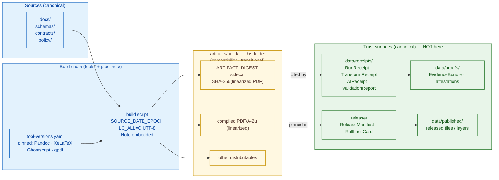

<!-- [KFM_META_BLOCK_V2]
doc_id: kfm://doc/artifacts-build-readme
title: artifacts/build/ — Compiled Build Outputs and Distributables
type: readme
version: v1
status: draft
owners: @kfm-docs-steward, @kfm-build-steward
created: 2026-05-20
updated: 2026-05-20
policy_label: public
related: [
  docs/doctrine/directory-rules.md,
  artifacts/README.md,
  data/receipts/README.md,
  data/proofs/README.md,
  release/README.md,
  data/published/README.md,
  docs/doctrine/ai-build-operating-contract.md
]
tags: [kfm, artifacts, build, compatibility-root, reproducibility, ARTIFACT_DIGEST]
notes: [
  "Authored doctrine-only; no mounted repo inspected.",
  "Subfolder of compatibility root artifacts/ per Directory Rules §8.2.",
  "Class transitional inherited from parent artifacts/."
]
[/KFM_META_BLOCK_V2] -->

# `artifacts/build/`

> Compiled, byte-deterministic build outputs and distributables — staged here for hash-pinning and citation, never as a trust surface.

[](../../docs/doctrine/directory-rules.md#8-compatibility-roots)
[](../../docs/doctrine/directory-rules.md#81-common-compatibility-roots-and-their-canonical-homes)
[](../../docs/doctrine/directory-rules.md#82-the-artifacts-rule)
[](#11-validation)
[](#12-last-reviewed)

<sub><strong>Status:</strong> PROPOSED &nbsp;·&nbsp; <strong>Owners:</strong> <code>@kfm-docs-steward</code> · <code>@kfm-build-steward</code> &nbsp;·&nbsp; <strong>Updated:</strong> 2026-05-20</sub>

> [!NOTE]
> **Truth posture.** This README was authored against the attached KFM doctrine corpus (Directory Rules v1.1; Pass-10 Idea Index Category C13; Domains v1.1 + Pass 23–32 Atlas; AI Build Operating Contract; Unified Implementation Architecture Build Manual). **No mounted repository, CI run, build log, or generated artifact was inspected.** Doctrine claims are `CONFIRMED`. Path, tool-version, file-presence, and orchestration claims are `PROPOSED` or `NEEDS VERIFICATION`.

---

<a id="top"></a>

## Quick jump

1. [Purpose](#1-purpose)
2. [Boundary diagram](#2-boundary-diagram)
3. [Authority level](#3-authority-level)
4. [Status](#4-status)
5. [What belongs here](#5-what-belongs-here)
6. [What does NOT belong here](#6-what-does-not-belong-here)
7. [Directory shape (PROPOSED)](#7-directory-shape-proposed)
8. [Inputs](#8-inputs)
9. [Outputs](#9-outputs)
10. [Validation](#10-validation)
11. [Review burden](#11-review-burden)
12. [Related folders](#12-related-folders)
13. [ADRs and open questions](#13-adrs-and-open-questions)
14. [Anti-patterns to watch for](#14-anti-patterns-to-watch-for)
15. [Appendix — reproducibility & toolchain reference](#15-appendix--reproducibility--toolchain-reference)
16. [Last reviewed](#16-last-reviewed)

---

## 1. Purpose

`artifacts/build/` is the staging home for **compiled, byte-deterministic build outputs** — primarily PDFs and other distributables — produced by KFM build pipelines from sources elsewhere in the repository.

It is a **build-scratch lane**, not a trust surface:

- Files here are the *bytes* that a downstream receipt will pin by `ARTIFACT_DIGEST`.
- Files here do **not** themselves prove provenance, validation, policy posture, or release state.
- Files here may be regenerated at any time by re-running the pinned toolchain against the source `git_sha`.

The folder exists so the build chain has a predictable place to write output **before** that output is digested, cited by a receipt under `data/receipts/`, attested under `data/proofs/`, and (when applicable) bound into a `ReleaseManifest` under `release/`.

[Back to top](#top)

---

## 2. Boundary diagram



> [!IMPORTANT]
> The arrows from `artifacts/build/` to trust surfaces are **one-way**. Build output flows *into* receipts and release manifests by hash reference; receipts and manifests do **not** flow back into `artifacts/build/`.

[Back to top](#top)

---

## 3. Authority level

| Dimension | Value | Basis |
|---|---|---|
| Authority level | **Compatibility** | Directory Rules §8.1 lists `artifacts/` as a compatibility root. |
| Class | **`transitional`** | Directory Rules §8.1 default class for `artifacts/`. |
| Inherited from | `artifacts/` | This folder sits inside the `artifacts/` compatibility root; class flows down unless overridden. |
| Public trust surface? | **No** | The public trust path is `apps/governed-api/`. Build outputs are inputs to that path, not outputs of it. |
| Canonical home for trust content | **Elsewhere** — see §6 | Per Directory Rules §8.2, trust-bearing material belongs in `data/receipts/`, `data/proofs/`, `release/`, `data/catalog/`, `data/published/`. |

> [!NOTE]
> A future ADR may retire `artifacts/` entirely in favor of canonical trust homes plus a true scratch surface (e.g., under `tools/`). Directory Rules §18.a lists the open question. Until that ADR is accepted, this folder remains a `transitional` compatibility surface.

[Back to top](#top)

---

## 4. Status

`PROPOSED` — pending mounted-repo verification.

| Claim | Label | Why |
|---|---|---|
| `artifacts/build/` MAY exist as a `transitional` compatibility subfolder for "compiled outputs, distributables". | **CONFIRMED** doctrine | Directory Rules §8.2. |
| The repository currently contains `artifacts/build/`. | **NEEDS VERIFICATION** | No mounted repo inspected. |
| The build chain emits PDFs into this folder under the pinned toolchain. | **PROPOSED** | Pass-10 C13 describes the chain; runtime presence not verified. |
| `ARTIFACT_DIGEST` sidecars accompany each compiled PDF. | **PROPOSED** | Pass-10 C13-04 describes the convention; sidecar placement here vs. alongside the citing receipt is `NEEDS VERIFICATION`. |
| No receipts, proofs, evidence bundles, release manifests, promotion decisions, rollback cards, correction notices, catalog records, or published layers live here. | **CONFIRMED** rule | Directory Rules §8.2 forbids them. |

[Back to top](#top)

---

## 5. What belongs here

Each accepted artifact belongs to the **build output** family — bytes that are content-addressable, regenerable from source plus toolchain pins, and **never** a substitute for a receipt.

| Accepted artifact | Form | Notes |
|---|---|---|
| Compiled PDF documents | `.pdf` (PDF/A-2u, linearized) | Produced from `docs/` sources via the pinned Pandoc → XeLaTeX → Ghostscript → qpdf chain (Pass-10 C13-01). |
| `ARTIFACT_DIGEST` sidecars | sidecar manifest, e.g. `<name>.digest.json` | SHA-256 of the linearized PDF; convention from Pass-10 C13-04. Cited by receipts under `data/receipts/`. |
| Build-environment fingerprint | `tool-versions.yaml` snapshot, optional `build-env.json` | Records the toolchain pin in effect for this build (Pass-10 C13-01). |
| Other deterministic distributables | tarballs, generated HTML bundles, API reference bundles | Long-form HTML site outputs SHOULD live under the sibling `artifacts/docs/` per Directory Rules §8.2. |
| Build-time logs *that are part of provenance, not a receipt* | `.log`, `.txt` | Only the deterministic portions; non-deterministic noise (wall-clock timestamps, hostnames) must be neutralized per `SOURCE_DATE_EPOCH` discipline (Pass-10 C13-02). |

> [!TIP]
> If you are unsure whether something is a *build output* or a *receipt*, ask: **"Does this file record a decision, a validation, a policy check, a review, or a promotion?"** If yes → it is a receipt, proof, or release object, and it belongs elsewhere — never here.

[Back to top](#top)

---

## 6. What does NOT belong here

This list is at least as important as §5. Placing any of the following in `artifacts/build/` is a **CONFIRMED** anti-pattern under Directory Rules §13 and Atlas §24.9.1 ("Artifacts directory holding receipts").

| Forbidden content | Canonical home | Why |
|---|---|---|
| `RunReceipt`, `TransformReceipt`, `AggregationReceipt`, `RedactionReceipt`, `RepresentationReceipt`, `ModelRunReceipt`, `AIReceipt`, `EventRunReceipt`, `SourceIntakeRecord`, `CitationValidationReport`, `PromotionReceipt`, `ValidationReport` | `data/receipts/` | Receipts are **process memory** with audit weight; storing them in scratch collapses governance. |
| `EvidenceBundle`, `EvidenceRef` resolution objects, proof packs, DSSE/in-toto/cosign attestations | `data/proofs/` | Proofs are the evidence-side trust object and must not be regenerable scratch. |
| `ReleaseManifest`, `MapReleaseManifest`, released `LayerManifest`, `PolicyDecision`, `RollbackCard`, `CorrectionNotice` | `release/` | Release decisions are governed state transitions, not file moves. |
| Catalog records, STAC/DCAT items, triplets, vector indexes | `data/catalog/`, `data/triplets/` | Catalog publication is a separate lifecycle phase. |
| Published map layers, PMTiles archives, COGs intended for public consumption | `data/published/` | `PUBLISHED` is a lifecycle phase bound by a `ReleaseManifest`. |
| `SourceDescriptor` records, source registry entries | `data/registry/` | Source admission is the upstream `RAW` boundary. |
| Source documents under active authoring | `docs/`, `contracts/`, `schemas/`, `policy/`, etc. | Sources are not artifacts; authoring is not building. |
| Secrets, credentials, signing keys, cosign keying material | secrets manager · `infra/` (deny-by-default) | Never in any repo-checked-in artifact. |
| Anything non-regenerable from current sources + pinned toolchain | The lane that owns it | If you cannot rebuild it, it is not a build artifact. |

> [!WARNING]
> The **"artifacts directory holding receipts"** anti-pattern is explicitly catalogued at Atlas §24.9.1 and Directory Rules §13. It collapses build output, process memory, and trust-bearing records into a single drift-prone surface. Reviewers MUST reject PRs that place any of the items above under `artifacts/build/` (or any other subfolder of `artifacts/`).

[Back to top](#top)

---

## 7. Directory shape (`PROPOSED`)

> [!NOTE]
> The tree below is `PROPOSED` under Directory Rules §8.2. Subfolder names and presence are `NEEDS VERIFICATION` against a mounted repo.

```text
artifacts/
└── build/                          # this folder — compatibility · transitional
    ├── README.md                   # this file
    ├── pdf/                        # PROPOSED — linearized PDF/A-2u outputs of docs/ sources
    │   ├── <doc-id>.pdf
    │   └── <doc-id>.digest.json    # PROPOSED — ARTIFACT_DIGEST sidecar (Pass-10 C13-04)
    ├── dist/                       # PROPOSED — other deterministic distributables (tarballs, bundles)
    └── env/                        # PROPOSED — per-build toolchain fingerprint
        ├── tool-versions.yaml      # NEEDS VERIFICATION — canonical home in policy bundle vs here
        └── build-env.json
```

Sibling subfolders of `artifacts/` (for reference; not governed by this README):

```text
artifacts/
├── README.md     # declares class of artifacts/ as a whole
├── build/        # ← this folder
├── docs/         # generated documentation (mkdocs site, API ref) — Directory Rules §8.2
├── qa/           # QA reports, lint output, test coverage — Directory Rules §8.2
└── temporary/    # ephemeral; gitignored or pruned regularly — Directory Rules §8.2
```

[Back to top](#top)

---

## 8. Inputs

| Input | Origin | Notes |
|---|---|---|
| Markdown / LaTeX source for documentation builds | `docs/` | The authoring surface; never modified by the build. |
| Schemas, contracts, policy text for embedded reference | `schemas/`, `contracts/`, `policy/` | Read-only inputs. |
| Build scripts and Pandoc filters | `tools/` (or `pipelines/publish/`) | Long-lived, trust-bearing build logic graduates to `tools/` or `pipelines/`, never `scripts/one_off/` (Directory Rules §7.5). `PROPOSED` exact path. |
| Toolchain pins | `policy/build/tool-versions.yaml` (`PROPOSED`) | The pin file is part of the policy bundle per Pass-10 C13-01. Path is `NEEDS VERIFICATION`. |
| Fonts | `assets/fonts/noto/` (`PROPOSED`) | Noto family embedded in the build image, not the repo, in most patterns. `NEEDS VERIFICATION`. |
| `SOURCE_DATE_EPOCH` | derived from `git` commit time | Pass-10 C13-02. |

[Back to top](#top)

---

## 9. Outputs

| Output | Downstream consumer | How it is bound |
|---|---|---|
| Compiled PDF | A `RunReceipt` recorded under `data/receipts/` | The receipt cites the linearized PDF by `ARTIFACT_DIGEST`. |
| `ARTIFACT_DIGEST` sidecar | Any receipt or `ReleaseManifest` that cites the PDF | The digest is the citation anchor (Pass-10 C13-04). |
| Build-environment fingerprint | The same receipt | Documents which pinned toolchain produced the bytes. |
| Other distributables (tarballs, bundles) | Release process (`release/`) and/or consumer download | Only after digest, receipt, and release-manifest binding. |

> [!IMPORTANT]
> Outputs from this folder become trusted **only** by reference — i.e., when a receipt under `data/receipts/` or a manifest under `release/` records their `ARTIFACT_DIGEST`. A file's presence in `artifacts/build/` confers no trust on its own.

[Back to top](#top)

---

## 10. Validation

The folder is validated by checks on the build process and on the regenerable property of its contents. Doctrine claims are `CONFIRMED`; named tool / validator presence is `PROPOSED`.

| Check | What it verifies | Status |
|---|---|---|
| Tool-pin check | Discovered toolchain matches `tool-versions.yaml`; fails closed on mismatch. | `CONFIRMED` doctrine · `PROPOSED` implementation (Pass-10 C13-01) |
| `SOURCE_DATE_EPOCH` + locale + font-embed determinism | Two builds of the same `git_sha` produce byte-identical output. | `CONFIRMED` doctrine · `PROPOSED` implementation (Pass-10 C13-02) |
| `ARTIFACT_DIGEST` recomputation | A consumer can recompute SHA-256 of the linearized PDF and match the sidecar. | `CONFIRMED` doctrine · `PROPOSED` implementation (Pass-10 C13-04) |
| Font-embed coverage | Every referenced font is embedded; build fails otherwise. | `PROPOSED` (Pass-10 C13-02 expansion direction) |
| PDF/UA accessibility preflight | Tagged structure, alt-text, table headers; result recorded in sidecar. | `PROPOSED` · `NEEDS VERIFICATION` for tool choice (Pass-10 C13-03) |
| "Nothing forbidden" scan of `artifacts/build/` | No receipt, proof, manifest, catalog record, or published layer file types present here. | `PROPOSED` validator (no mounted repo) |
| Validator orchestrator integration | `tools/validators/validate_all.py` includes the above checks where applicable. | `PROPOSED` — see Directory Rules §7.5.a and §18 OPEN-DR-03 |

> [!TIP]
> Validators MUST exercise their **negative** paths — a build that fails the pin check, an over-embedded sidecar, a forbidden file dropped into `artifacts/build/` — not only the success path. See Directory Rules §7.5.a negative-state rule.

[Back to top](#top)

---

## 11. Review burden

| Role | Scope |
|---|---|
| `@kfm-build-steward` *(placeholder)* | Toolchain pins, build scripts, pin advancements (Pass-10 C13-01). |
| `@kfm-docs-steward` *(placeholder)* | Source-to-PDF authoring discipline; this README. |
| `@kfm-policy-steward` *(placeholder)* | Confirms no trust-bearing content has drifted into this folder. |
| `CODEOWNERS` entry | `PROPOSED` — `artifacts/build/  @kfm-docs-steward @kfm-build-steward`. Verify in mounted repo. |

> [!NOTE]
> Owners listed above are **placeholders** for review and not asserted as the current `CODEOWNERS` of the mounted repo.

[Back to top](#top)

---

## 12. Related folders

| Path | Relationship | Status |
|---|---|---|
| [`../README.md`](../README.md) | Parent `artifacts/` README — declares class and what does NOT belong | `PROPOSED` presence |
| [`../docs/`](../docs/) | Sibling — generated documentation (mkdocs site, API ref) | `PROPOSED` |
| [`../qa/`](../qa/) | Sibling — QA reports, lint output, test coverage | `PROPOSED` |
| [`../temporary/`](../temporary/) | Sibling — ephemeral; gitignored or pruned | `PROPOSED` |
| [`../../data/receipts/`](../../data/receipts/) | Canonical home for receipts that cite outputs here | `PROPOSED` path; doctrine `CONFIRMED` |
| [`../../data/proofs/`](../../data/proofs/) | Canonical home for `EvidenceBundle`s and attestations | `PROPOSED` path; doctrine `CONFIRMED` |
| [`../../release/`](../../release/) | Canonical home for `ReleaseManifest`, `RollbackCard`, `CorrectionNotice` | `PROPOSED` path; doctrine `CONFIRMED` |
| [`../../data/published/`](../../data/published/) | Released map layers / artifacts (the `PUBLISHED` phase) | `PROPOSED` path; doctrine `CONFIRMED` |
| [`../../tools/`](../../tools/) | Build scripts, validators, the `validate_all.py` orchestrator | `PROPOSED` |
| [`../../docs/doctrine/directory-rules.md`](../../docs/doctrine/directory-rules.md) | Authoritative placement contract | `CONFIRMED` doctrine |

[Back to top](#top)

---

## 13. ADRs and open questions

| Reference | Topic | State |
|---|---|---|
| Directory Rules §8.1 + §8.2 | The `artifacts/` rule and the `build/` subfolder | `CONFIRMED` |
| Directory Rules §18.a — fate of `artifacts/` | Whether `artifacts/` is kept as compatibility or fully retired in favor of `data/receipts/`, `data/proofs/`, `release/`, `data/published/` | **OPEN** |
| Atlas Open-ADR Backlog **ADR-S-15** — doctrine artifact lifecycle | Cadence of revisions, deprecation rule, supersession path for doctrine artifacts (PDFs built here) | **OPEN** |
| Pass-10 C13-01 — pin-advancement playbook | Cadence (security-driven only? scheduled?), interaction with migration receipts (C11-04) | **OPEN** |
| Pass-10 C13-03 — accessibility preflight tool selection | Which preflight tool, what conformance level for publication | **OPEN · NEEDS VERIFICATION** |
| `ARTIFACT_DIGEST` sidecar placement | Whether the sidecar lives here next to the PDF, or alongside the citing receipt in `data/receipts/`, or both | **OPEN · NEEDS VERIFICATION** |
| `tool-versions.yaml` canonical home | `policy/build/` vs `artifacts/build/env/` vs both | **OPEN · NEEDS VERIFICATION** |

[Back to top](#top)

---

## 14. Anti-patterns to watch for

> [!CAUTION]
> Each row below has happened often enough in similar repos that doctrine names it. Treat any PR matching one of these as a drift candidate.

| Anti-pattern | Symptom | Counter-rule |
|---|---|---|
| Artifacts directory holding receipts | A `RunReceipt`, `AIReceipt`, or `ValidationReport` lands under `artifacts/build/` to be "near the build". | Receipts go to `data/receipts/`. The receipt references the build artifact by `ARTIFACT_DIGEST`. *(Atlas §24.9.1 · Directory Rules §13)* |
| Release manifest in `artifacts/` | A `ReleaseManifest` is written here because it was "produced by the build". | `ReleaseManifest` is a release **decision**, not a build output. It lives in `release/`. |
| Published layer in `artifacts/` | A PMTiles archive is staged here and consumed publicly from this path. | Published layers live in `data/published/`, bound by a `ReleaseManifest`. |
| Build that depends on wall-clock time | Two builds of the same `git_sha` produce different bytes; `ARTIFACT_DIGEST` chain breaks. | Use `SOURCE_DATE_EPOCH` from `git` commit time; pin locale; embed fonts. *(Pass-10 C13-02)* |
| Tool pin drift | The build runs on whatever Pandoc/XeLaTeX/Ghostscript/qpdf is installed. | The build verifier MUST fail closed when discovered tool versions do not match the pin. *(Pass-10 C13-01)* |
| Source files committed under `artifacts/build/` | Authoring drifts into the build-output folder. | Sources live in `docs/`, `schemas/`, `contracts/`, `policy/`. |
| Trust by location | "It's in `artifacts/build/`, so it's official." | Trust is by reference: a receipt or release manifest must cite the artifact by `ARTIFACT_DIGEST`. Location confers nothing. |

[Back to top](#top)

---

## 15. Appendix — reproducibility & toolchain reference

<details>
<summary><strong>Pinned toolchain (Pass-10 C13-01)</strong></summary>

| Tool | Pinned version (per corpus) | Role |
|---|---|---|
| Pandoc | `3.1.12.3` (`CONFIRMED` doctrine pin) | Source → intermediate transformation |
| XeLaTeX | named TeX Live release (`PROPOSED` exact tag) | Typesetting engine |
| Ghostscript | named version (`PROPOSED` exact tag) | PDF post-processing |
| qpdf | named version (`PROPOSED` exact tag) | Linearization → PDF/A-2u |

The pinned tool set is captured in `tool-versions.yaml`, **shipped as part of the policy bundle** per Pass-10 C13-01. The build script fails closed when the discovered tool versions do not match the pin. The pin file's canonical home (`policy/build/` vs `artifacts/build/env/` vs both) is `NEEDS VERIFICATION`.

</details>

<details>
<summary><strong>Determinism inputs (Pass-10 C13-02)</strong></summary>

| Input | Convention |
|---|---|
| `SOURCE_DATE_EPOCH` | Exported from the build's `git` commit time so PDF timestamps and metadata are stable. Pandoc and PDF metadata respect it. |
| Fonts | Noto family **embedded** in the build image; no reliance on system fonts. |
| Locale | `LC_ALL=C.UTF-8` (or equivalent) pinned at build time to neutralize locale-dependent number/date/sort formatting. |
| Linearization | `qpdf --linearize` is the final byte-shaping step; the digest is taken over its output. |

Tradeoff (Pass-10 C13-02): embedded fonts increase output size; the corpus accepts the cost as the price of reproducibility but warns the convention must be applied uniformly so no artifact silently relies on system fonts.

</details>

<details>
<summary><strong>ARTIFACT_DIGEST contract (Pass-10 C13-04)</strong></summary>

- `ARTIFACT_DIGEST = SHA-256(linearized PDF/A-2u output of the pinned chain)`.
- The digest is published in a sidecar manifest alongside the PDF, in catalog metadata, and in any receipt that cites the document.
- A consumer fetches the PDF, computes SHA-256, and verifies the match **before** treating the content as authoritative.
- On mismatch: the document has been tampered with, the wrong version was fetched, or the build chain has drifted. In all three cases, the consumer MUST NOT treat the content as authoritative.

Without the digest, receipts that reference documentation point at moving content. With the digest, the citation is a hash-pin equivalent to every other content-addressed reference in KFM (`spec_hash`, source heads, content digests).

</details>

<details>
<summary><strong>Reviewer checklist (PROPOSED) for any change touching <code>artifacts/build/</code></strong></summary>

- [ ] No new file under `artifacts/build/` matches a forbidden content type from §6.
- [ ] Any new compiled PDF is accompanied by an `ARTIFACT_DIGEST` sidecar (or the receipt that cites it carries the digest).
- [ ] The toolchain pin file (`tool-versions.yaml`) is unchanged, **or** the pin advance includes the playbook entry called out in §13.
- [ ] The PR description names the Directory Rules sections that justify any new placement.
- [ ] No content drifts from this scratch lane into the public path (`apps/governed-api/`) without a receipt under `data/receipts/` and (where applicable) a `ReleaseManifest` under `release/`.
- [ ] Build is deterministic on a clean image — same `git_sha` produces identical bytes.

</details>

[Back to top](#top)

---

## 16. Last reviewed

| Field | Value |
|---|---|
| Last reviewed | `2026-05-20` |
| Next review due | `2026-11-20` (six-month default per Directory Rules §15) |
| Reviewer roles | `@kfm-docs-steward`, `@kfm-build-steward` *(placeholders)* |
| Authoring posture | Doctrine-only (no mounted repo) — see top-of-file Truth posture |

---

### Related docs

- [`../../docs/doctrine/directory-rules.md`](../../docs/doctrine/directory-rules.md) — placement contract (canonical authority for this README) · *CONFIRMED doctrine*
- [`../README.md`](../README.md) — parent `artifacts/` README (declares class, lists what does NOT belong) · *PROPOSED presence*
- [`../../data/receipts/README.md`](../../data/receipts/README.md) — canonical home for receipts that cite outputs here · *PROPOSED presence*
- [`../../data/proofs/README.md`](../../data/proofs/README.md) — canonical home for `EvidenceBundle`s and attestations · *PROPOSED presence*
- [`../../release/README.md`](../../release/README.md) — canonical home for `ReleaseManifest`, `RollbackCard`, `CorrectionNotice` · *PROPOSED presence*
- [`../../docs/doctrine/ai-build-operating-contract.md`](../../docs/doctrine/ai-build-operating-contract.md) — operating contract for AI-authored builds · *PROPOSED path*
- [Pass-10 Idea Index — Category C13 (Reproducible Documentation and Build Artifacts)](../../docs/atlases/) — reproducibility doctrine for this folder · *NEEDS VERIFICATION on atlas path*

**Last updated:** 2026-05-20 &nbsp;·&nbsp; [Back to top ↑](#top)
