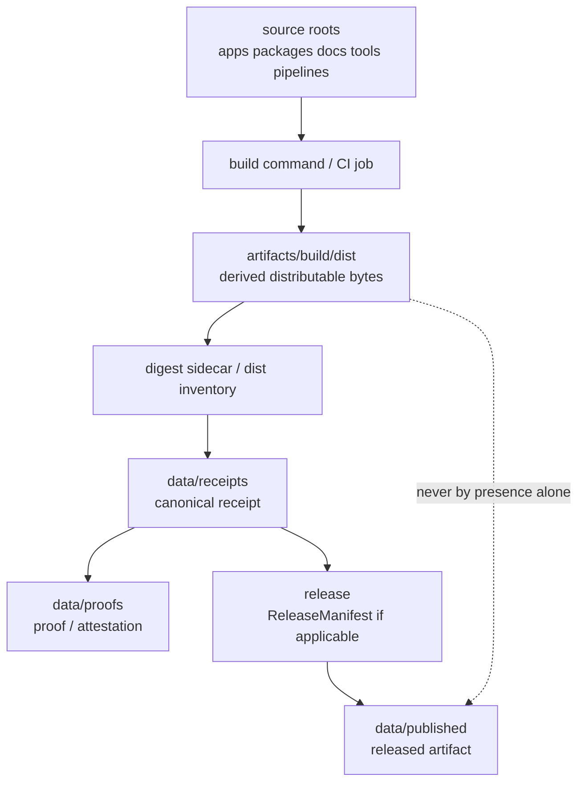

<!-- [KFM_META_BLOCK_V2]
doc_id: kfm://doc/artifacts-build-dist-readme
title: artifacts/build/dist/ — Deterministic Distributable Build Outputs
type: readme
version: v0.1
status: draft
owners: OWNER_TBD — Build steward · Release steward · Docs steward · Security steward · Evidence steward
created: 2026-06-16
updated: 2026-06-16
policy_label: public
related:
  - ../README.md
  - ../../README.md
  - ../../../docs/doctrine/directory-rules.md
  - ../../../data/receipts/README.md
  - ../../../data/proofs/README.md
  - ../../../data/published/README.md
  - ../../../release/README.md
  - ../../../tools/README.md
  - ../../../pipelines/README.md
  - ../../../packages/README.md
tags: [kfm, artifacts, build, dist, distributables, compiled-output, deterministic-bytes, artifact-digest, compatibility-root, transitional]
notes:
  - "Replaces the short artifacts/build/dist README with a bounded distributable-output contract."
  - "This directory is a compatibility/transitional build-output lane, not a trust surface, release surface, evidence store, receipt store, proof store, catalog, published artifact home, source-code home, or package authority."
  - "Specific build products, digests, workflows, packaging commands, artifact retention rules, and CI pass state remain NEEDS VERIFICATION."
[/KFM_META_BLOCK_V2] -->

<a id="top"></a>

<div align="center">

# Deterministic Distributable Build Outputs

`artifacts/build/dist/`

**Compatibility/transitional staging lane for compiled, reproducible distributable bytes — app bundles, tarballs, zip files, generated API/reference bundles, package archives, and similar build outputs — while they are prepared for digesting, review, packaging, or later governed release binding.**


[Purpose](#1-purpose) · [Authority boundary](#3-authority-boundary) · [Allowed contents](#5-allowed-contents) · [Forbidden contents](#6-forbidden-contents) · [Validation](#10-validation-expectations) · [Definition of done](#12-definition-of-done)

</div>

---

> [!IMPORTANT]
> **Status:** draft / `NEEDS VERIFICATION`  
> **Path:** `artifacts/build/dist/README.md`  
> **Responsibility root:** `artifacts/` — compatibility root, transitional build-output lane  
> **Truth posture:** CONFIRMED README path / CONFIRMED parent `artifacts/` compatibility-root boundary / CONFIRMED `artifacts/build/` build-output boundary / PROPOSED dist-lane contract / UNKNOWN actual files, build jobs, digest sidecars, packaging commands, CI workflows, retention policy, release binding, and generated artifact inventory

> [!CAUTION]
> `artifacts/build/dist/` is not a canonical trust home. Do not store receipts, proofs, EvidenceBundles, ReleaseManifests, RollbackCards, CorrectionNotices, catalog records, published layers, source descriptors, source code, schemas, policy rules, secrets, or release decisions here.

---

## 1. Purpose

`artifacts/build/dist/` holds **compiled deterministic distributables** while they are being prepared for hash digesting, review, packaging, or later release binding.

Typical accepted material includes:

- app bundles produced from `apps/` source;
- package archives produced from `packages/` source;
- deterministic tarballs or zip files;
- generated API/reference bundles when the generated-docs lane is not a better fit;
- reproducible byte outputs that are not themselves receipts, proofs, manifests, catalog records, or published artifacts.

This folder exists so build tooling has a predictable staging location before the resulting bytes are pinned by digest and referenced by canonical trust records in `data/receipts/`, `data/proofs/`, or `release/` where applicable.

This README does not prove any distributable currently exists, any CI job writes here, any digest sidecar is present, or any release process consumes this directory.

[Back to top](#top)

---

## 2. Repo fit

| Concern | Owning root | Expected relationship |
|---|---|---|
| Distributable staging | `artifacts/build/dist/` | Derived, reproducible, non-authoritative build-output lane |
| Build output parent | `artifacts/build/` | Compiled byte outputs and distributables before digest/release binding |
| Compatibility root | `artifacts/` | Transitional compatibility root; trust content forbidden |
| Source code | `apps/`, `packages/`, `tools/`, `pipelines/` | Inputs to build; not stored here |
| Generated documentation site output | `artifacts/docs/` when better fit | Long-form docs output lane |
| QA reports | `artifacts/qa/` | Test, lint, coverage, bundle-size, static-analysis reports |
| Receipts | `data/receipts/` | Canonical receipt/process-memory home |
| Proofs / EvidenceBundles | `data/proofs/` | Canonical evidence/proof home |
| Published artifacts | `data/published/` | Released artifact home after governed publication |
| Release records | `release/` | ReleaseManifest, RollbackCard, CorrectionNotice, release decisions |
| Schemas/contracts/policy | `schemas/`, `contracts/`, `policy/` | Authority roots, never staged here |

## 3. Authority boundary

`artifacts/build/dist/` has **compatibility authority only**. It may hold derived bytes; it does not establish provenance, evidence, validation, policy posture, review state, release state, publication state, or source authority.

```text
SOURCE ROOTS                  BUILD OUTPUT STAGING          TRUST / RELEASE HOMES
apps/ packages/ tools/  --->  artifacts/build/dist/  --->   data/receipts/
pipelines/ docs/              derived bytes only            data/proofs/
schemas/ contracts/ policy/   not authoritative             release/
                                                           data/published/
```

A file in this folder may be referenced by digest from a receipt or release record. The digest reference is the governed bridge; the file's mere presence here is not release evidence.

## 4. Default posture

Build outputs in this folder should be treated as **untrusted until pinned and reviewed**.

A distributable should not be treated as ready for release, publication, deployment, citation, or downstream consumption unless the relevant canonical records exist and pass review:

- reproducible build command and source `git_sha`;
- toolchain/version fingerprint;
- content digest or manifest;
- ValidationReport or equivalent build verification where applicable;
- receipt in `data/receipts/` where material;
- proof/EvidenceBundle or attestation in `data/proofs/` where material;
- policy/sensitivity/rights review where content exposure is material;
- ReleaseManifest, RollbackCard, or CorrectionNotice linkage where release is involved;
- rollback and correction path.

## 5. Allowed contents

| Allowed artifact | Examples | Required posture |
|---|---|---|
| App build bundles | static web app bundle, server bundle, worker bundle | Derived, reproducible, digestable |
| Package archives | `.tar.gz`, `.zip`, `.whl`, `.tgz` | Build output only, not package authority |
| Generated reference bundles | generated API reference archive, generated client bundle | Use `artifacts/docs/` if long-form docs output is primary |
| Build distributable manifests | non-authoritative dist inventory, build list | Must point to canonical receipts when trust-bearing |
| SBOM staging copies | generated SBOM copy before canonical placement | Canonical SBOM/receipt home must be elsewhere if trust-bearing |
| Digest sidecars | `<artifact>.sha256`, `<artifact>.digest.json` | Staging only; receipts remain in `data/receipts/` |
| Packaging metadata | reproducible build metadata, source commit ref, toolchain snapshot | Must not contain secrets or deployment-only values |

## 6. Forbidden contents

| Forbidden here | Correct home |
|---|---|
| RunReceipt, TransformReceipt, ValidationReport, AIReceipt, RedactionReceipt | `data/receipts/` |
| EvidenceBundle, proof bundles, attestations | `data/proofs/` |
| ReleaseManifest, RollbackCard, CorrectionNotice | `release/` |
| Published layers, released PMTiles/MVT/COG/style assets | `data/published/` after governed release |
| Catalog records, STAC/DCAT/PROV records | `data/catalog/` |
| Source descriptors and registry records | `data/registry/` or governed source registry home |
| Source code, scripts, packages, build logic | `apps/`, `packages/`, `tools/`, `scripts/`, `pipelines/` |
| Schemas, contracts, policy rules | `schemas/`, `contracts/`, `policy/` |
| Secrets, tokens, private keys, deployment-only values | Never commit; use deployment secret/config channels |
| Hand-authored source documentation | `docs/` |
| Long-lived QA reports | `artifacts/qa/` |

## 7. Directory shape

Current implementation inventory remains `NEEDS VERIFICATION`.

```text
artifacts/build/dist/
├── README.md
├── <artifact-name>.<ext>              # PROPOSED deterministic distributable
├── <artifact-name>.sha256             # PROPOSED digest sidecar
├── <artifact-name>.digest.json        # PROPOSED digest metadata sidecar
├── dist-manifest.json                 # PROPOSED non-authoritative listing
└── build-env.json                     # PROPOSED non-secret toolchain/build context
```

> [!WARNING]
> Do not treat this suggested shape as repo fact. Verify actual files, build outputs, digests, and workflows before making implementation claims.

## 8. Diagram



## 9. Obligations

| Obligation | Example effect |
|---|---|
| `derived_only` | Files here are build outputs, not canonical records |
| `reproducible_bytes` | Outputs should be reproducible from source ref plus toolchain pins |
| `digest_required` | Material outputs should be hash-pinned before trust use |
| `receipt_elsewhere` | Trust-bearing receipts go to `data/receipts/`, not here |
| `proof_elsewhere` | Evidence/proof support goes to `data/proofs/`, not here |
| `release_elsewhere` | Release decisions and manifests go to `release/`, not here |
| `published_elsewhere` | Public released artifacts go to `data/published/`, not here |
| `no_secrets` | Build outputs and metadata must not contain secrets or deployment-only values |
| `safe_to_delete_if_regenerable` | Contents should be rebuildable or documented as exceptions |
| `no_parallel_authority` | This folder must not become a second package, release, or catalog root |

## 10. Validation expectations

Useful validation for this folder should cover:

- every retained distributable has a reproducible source ref;
- material outputs have deterministic digests;
- digest sidecars do not replace receipts;
- build metadata contains no secrets, tokens, host-specific private paths, or deployment-only values;
- no receipts, proofs, release records, catalog records, source descriptors, schemas, contracts, policy rules, or published artifacts are stored here;
- outputs are either temporary/regenerable or referenced by governed records outside this directory;
- retention/pruning behavior is documented;
- release binding, if any, happens through `release/` and `data/published/`, not by treating this folder as public.

## 11. Safe change pattern

For changes under `artifacts/build/dist/`:

1. Confirm the artifact is a derived distributable and not source or trust content.
2. Confirm the source refs, build command, and toolchain versions are known.
3. Produce deterministic bytes where practical.
4. Generate digest sidecars only as staging aids.
5. Write canonical receipts/proofs/release records to their owning roots, not here.
6. Verify no secrets, private paths, protected details, or deployment-only values are embedded.
7. Update this README, parent `artifacts/build/` docs, build tooling docs, receipts/proofs/release docs, and tests when behavior materially changes.

## 12. Definition of done

- [ ] Owners are confirmed and `OWNER_TBD` is replaced.
- [ ] Actual build-output inventory is verified.
- [ ] Build commands and toolchain pins are documented.
- [ ] Digest format and sidecar convention are documented.
- [ ] Retention and pruning behavior are documented.
- [ ] Canonical receipt/proof/release homes are linked where material.
- [ ] No trust-bearing records live here.
- [ ] No source files, schemas, contracts, policy rules, secrets, or published artifacts live here.
- [ ] CI/workflow behavior is verified or marked `NEEDS VERIFICATION`.

## 13. Open verification items

| Item | Why it matters |
|---|---|
| Confirm actual files under `artifacts/build/dist/` | Prevents overclaiming artifact inventory |
| Confirm build jobs that write here | Required before CI/workflow claims |
| Confirm digest sidecar convention | Required before hash-pinning claims |
| Confirm retention/pruning policy | Required before storage-lifecycle claims |
| Confirm no trust records are stored here | Required before Directory Rules compliance claims |
| Confirm release handoff, if any | Required before publication claims |
| Confirm artifact reproducibility | Required before deterministic-byte claims |
| Confirm secret scanning / metadata scrubbing | Required before safety claims |

<details>
<summary>Appendix A — no-loss preservation note</summary>

The previous README established that compiled deterministic distributables that are not PDFs belong here while being prepared for digesting, review, or packaging; accepted examples included app bundles, tarballs, zip files, generated API/reference bundles, and other reproducible byte outputs; it also prohibited receipts, proofs, EvidenceBundles, release manifests, catalog records, published layers, secrets, and source files. This replacement preserves those constraints and expands the governed directory contract.

</details>

## Status summary

`artifacts/build/dist/` is a transitional compatibility lane for deterministic distributable build outputs. It is useful as a staging location, but it does not carry trust by itself.

A file here becomes relevant to KFM trust only when a canonical receipt, proof, or release record elsewhere references it by digest and passes the appropriate validation, policy, review, publication, correction, and rollback gates.

<p align="right"><a href="#top">Back to top</a></p>
