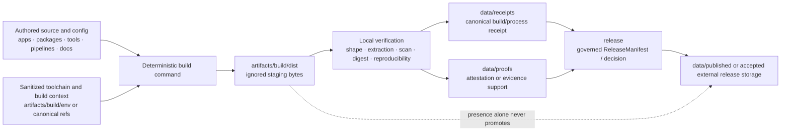

<!-- [KFM_META_BLOCK_V2]
doc_id: kfm://doc/artifacts-build-dist-readme
title: artifacts/build/dist/ — Ignored Distribution Staging, Reproducibility, and Release-Handoff Boundary
type: readme; directory-readme; build-output-staging; distribution-contract; compatibility-boundary; release-handoff-index
version: v0.2
status: draft; repository-grounded; compatibility-root; transitional; tracked-readme-only; generated-contents-gitignored; no-confirmed-producer; no-confirmed-consumer; no-confirmed-dist-manifest; build-environment-scaffolds-present; reproducibility-partial; release-binding-unestablished; no-network-by-default; non-authoritative
owners: OWNER_TBD — Build steward · Packaging steward · Application/package stewards · Reproducibility steward · Supply-chain steward · Security steward · Rights/sensitivity steward · Receipt/proof steward · Release steward · CI steward · Docs steward
created: 2026-06-16
updated: 2026-07-16
supersedes: v0.1 bounded distributable-output contract
policy_label: public-doc; artifacts; build; dist; generated-output; reproducibility; deterministic-bytes; gitignored; transient; no-secrets; no-trust-authority; no-release-authority; correction-aware; rollback-aware
current_path: artifacts/build/dist/README.md
truth_posture: CONFIRMED target README and prior blob, Directory Rules classification of artifacts as a compatibility root, parent artifacts/build and sibling pdf/env README boundaries, tracked build-env and tool-versions scaffolds, root package build script remaining TODO-only, Explorer Web build script remaining TODO-only, root gitignore containing an unanchored dist/ rule, bounded repository search surfacing no direct artifacts/build/dist producer or consumer, and checked absence of dist-manifest.json, build-env.json, and .gitkeep under this lane / PROPOSED stable distribution manifest, canonical archive normalization rules, producer and consumer contracts, digest and SBOM sidecars, structured validation report, retention classes, CI artifact upload, release binding, correction/withdrawal propagation, and migration or retirement procedure / CONFLICTED tracked README inside an ignored output directory; parent documentation describing deterministic distributables while active build producers are TODO-only; compatibility-root staging versus canonical receipt/proof/release homes; optional local sidecars versus governed records elsewhere / UNKNOWN exhaustive ignored workspace contents, developer-local outputs, CI-only outputs, historical artifacts, dynamic build products, artifact counts, actual package formats, active downstream consumers, current reproducibility rate, current secret-scan status, branch-protection significance, operational retention, and deployment behavior / NEEDS VERIFICATION accepted owners, CODEOWNERS, whether generated bytes should ever be force-added, exact build command, source-to-output registry, archive canonicalization profile, toolchain pins, rights and license scanning, malware/supply-chain scanning, artifact retention, CI ownership, release handoff, published-copy destination, correction consumers, and rollback execution
evidence_snapshot:
  repository: bartytime4life/Kansas-Frontier-Matrix
  repository_id: "1059091169"
  visibility: public
  base_ref: main
  base_commit: 13af79197a193b6f7b8d07ef059b4564a6b19169
  target_prior_blob: 719f01eac348dda112518840acd9a6d359f5f662
  direct_lane_files_confirmed:
    - artifacts/build/dist/README.md
  checked_absent_paths:
    - artifacts/build/dist/dist-manifest.json
    - artifacts/build/dist/build-env.json
    - artifacts/build/dist/.gitkeep
  related_tracked_build_scaffolds:
    - artifacts/build/env/build-env.json
    - artifacts/build/env/tool-versions.yaml
  execution_surfaces:
    - package.json
    - apps/explorer-web/package.json
    - .gitignore
  bounded_inventory_note: repository search and exact-path checks establish the tracked snapshot only; ignored local outputs, CI workspaces, historical files, branch-local files, release assets, external registries, object stores, and uninspected build systems remain UNKNOWN
related:
  - ../README.md
  - ../env/README.md
  - ../pdf/README.md
  - ../../README.md
  - ../../../docs/doctrine/directory-rules.md
  - ../../../package.json
  - ../../../apps/explorer-web/package.json
  - ../../../.gitignore
  - ../../../data/receipts/README.md
  - ../../../data/proofs/README.md
  - ../../../data/published/README.md
  - ../../../release/README.md
  - ../../../tools/README.md
  - ../../../pipelines/README.md
  - ../../../packages/README.md
tags: [kfm, artifacts, build, dist, distributables, deterministic-builds, archives, bundles, digests, sbom, provenance, gitignore, retention, release-handoff, correction, rollback]
notes:
  - "v0.2 replaces a generic proposed dist tree with a commit-pinned account of the tracked README, ignored generated-content posture, incomplete build scaffolds, and absent producer/consumer evidence."
  - "The unanchored root .gitignore rule dist/ applies to nested dist directories under standard Git ignore semantics; generated files here are therefore normally untracked unless already tracked or explicitly force-added."
  - "No repository command or workflow was established as writing to or reading from artifacts/build/dist/."
  - "The root monorepo build command and Explorer Web build command both remain TODO-only at the pinned snapshot."
  - "The sibling build-env and tool-version files are tracked scaffolds with proposed or incomplete values; they are not proof of an executed reproducible build."
  - "This revision changes documentation only and creates no distributable, manifest, digest, SBOM, receipt, proof, release record, workflow behavior, package behavior, deployment, or public artifact."
[/KFM_META_BLOCK_V2] -->

<a id="top"></a>

# `artifacts/build/dist/` — Ignored Distribution Staging, Reproducibility, and Release-Handoff Boundary

> **Purpose.** Define the repository boundary for generated non-PDF distributable bytes—archives, application bundles, package archives, generated clients, and similar outputs—without turning a build directory, filename, digest sidecar, CI artifact, or successful build into source authority, evidence, release approval, publication, or production truth.

<p>
  
  
  
  
  
  
  
</p>

**Quick navigation:** [Status](#status-and-evidence-boundary) · [Purpose](#purpose-and-audience) · [Authority](#authority-and-directory-rules-basis) · [Inventory](#confirmed-current-inventory) · [Git ignore](#tracked-readme-and-gitignored-output-contract) · [Model](#distribution-staging-model) · [Classes](#accepted-distributable-classes) · [Manifest](#proposed-distribution-manifest-contract) · [Reproducibility](#reproducible-byte-contract) · [Digests](#digests-sboms-and-provenance-sidecars) · [Security](#security-rights-sensitivity-and-supply-chain) · [Lifecycle](#lifecycle-release-and-publication-boundary) · [Producer](#producer-contract) · [Consumer](#consumer-and-release-handoff-contract) · [Validation](#validation-and-finite-outcomes) · [CI](#ci-workflow-artifact-and-retention-boundary) · [Correction](#correction-withdrawal-and-rollback) · [Review](#review-burden-and-change-control) · [Done](#definition-of-done) · [Plan](#smallest-sound-implementation-sequence) · [Open](#open-verification-register) · [Evidence](#evidence-ledger) · [Rollback](#documentation-correction-and-rollback)

---

## Status and evidence boundary

> [!IMPORTANT]
> **Snapshot:** `main@13af79197a193b6f7b8d07ef059b4564a6b19169`
> **Prior target blob:** `719f01eac348dda112518840acd9a6d359f5f662`
> **Direct tracked lane:** `artifacts/build/dist/README.md` only in bounded evidence
> **Generated-output posture:** ignored by the root `dist/` rule
> **Confirmed producer:** not established
> **Confirmed consumer or release handoff:** not established
> **Confirmed distribution manifest or digest sidecar:** not established

### Safe conclusion

`artifacts/build/dist/` is a repository-confirmed **compatibility and transitional staging path**, but it is not an established distribution system.

The inspected repository supports these narrower conclusions:

- `artifacts/` is the compatibility root for derived, regenerable, non-authoritative outputs.
- `artifacts/build/` documents compiled bytes and distributables before digest or release binding.
- `artifacts/build/dist/README.md` is tracked.
- the root `.gitignore` contains `dist/`; under standard Git ignore semantics, that unanchored directory rule applies to nested directories named `dist`;
- tracked files remain tracked, but ordinary new generated files under this path are normally suppressed from Git status unless explicitly force-added;
- `artifacts/build/env/build-env.json` exists as a `PROPOSED` empty scaffold;
- `artifacts/build/env/tool-versions.yaml` exists as a partially filled proposed toolchain scaffold;
- the root `npm run build` command only prints a TODO message;
- `apps/explorer-web` also has a TODO-only build command;
- bounded repository search did not establish a script or workflow that writes to or reads from this directory;
- checked paths did not establish `dist-manifest.json`, lane-local `build-env.json`, or `.gitkeep`;
- the contents of ignored local workspaces and CI runners are not visible from the tracked repository and remain `UNKNOWN`.

### Maturity matrix

| Capability | Status | Evidence-bounded conclusion |
|---|---:|---|
| Boundary README | `CONFIRMED` | This tracked contract exists. |
| Parent compatibility boundary | `CONFIRMED` | `artifacts/` permits derived outputs but forbids trust content. |
| Parent build-output boundary | `CONFIRMED` | `artifacts/build/` routes compiled outputs and distributables. |
| Tracked distributable inventory | `README ONLY` | No additional tracked file was surfaced in bounded search. |
| Ignored local/CI output inventory | `UNKNOWN` | GitHub cannot enumerate untracked ignored workspace files. |
| Build producer | `NOT ESTABLISHED` | Root and Explorer Web build scripts remain TODO-only; no lane writer surfaced. |
| Distribution manifest | `NOT ESTABLISHED` | Checked canonical candidate path was absent. |
| Digest sidecars | `NOT ESTABLISHED` | No tracked sidecar or convention implementation surfaced. |
| Environment context | `SCAFFOLD PRESENT` | Sibling env files exist but are incomplete and non-authoritative. |
| Build reproducibility | `UNKNOWN` | No repeated-build comparison or byte equality report was verified. |
| CI artifact upload | `NOT ESTABLISHED FOR THIS LANE` | Other artifact workflows do not prove this directory is uploaded. |
| Release binding | `NOT ESTABLISHED` | No ReleaseManifest or governed record was linked to this lane. |
| Published copy | `NOT ESTABLISHED` | Nothing here is public by location or filename. |
| Retention/pruning | `UNKNOWN` | No accepted schedule or cleanup command was verified. |
| Required check or branch protection | `UNKNOWN` | Workflow presence elsewhere does not establish gate significance. |

### Truth labels

| Label | Meaning in this README |
|---|---|
| `CONFIRMED` | Verified from repository files, exact paths, or bounded search at the pinned snapshot. |
| `PROPOSED` | Recommended format, process, command, manifest, or gate not established as current implementation. |
| `CONFLICTED` | Current repository surfaces create incompatible or ambiguous expectations. |
| `UNKNOWN` | Not observable or not established from inspected evidence. |
| `NEEDS VERIFICATION` | Checkable, but not sufficiently verified for reliance, release, or public claims. |
| `DENY` | A prohibited trust, publication, security, rights, or lifecycle interpretation. |

[Back to top](#top)

---

## Purpose and audience

This README is the operating contract for maintainers who generate, inspect, retain, package, upload, sign, release, delete, or reference non-PDF distribution outputs.

It is intended for:

- build and packaging stewards;
- application and package maintainers;
- reproducibility and supply-chain reviewers;
- CI and artifact-retention maintainers;
- security, privacy, rights, and sensitivity reviewers;
- receipt, proof, and release stewards;
- reviewers deciding whether generated bytes are safe to retain or hand off;
- documentation maintainers correcting path, maturity, or workflow claims.

The durable question is:

> Can a generated distributable be rebuilt, identified, scanned, digested, reviewed, and handed off without the staging copy becoming source authority, evidence, a release decision, or the public artifact of record?

A correct answer is scoped. A generated archive can be byte-valid and still be unsupported, unsafe, rights-restricted, unreleased, stale, or unsuitable for publication.

[Back to top](#top)

---

## Authority and Directory Rules basis

Directory Rules classify `artifacts/` as a compatibility root. It may contain derived, regenerable, non-authoritative working material. It may not become an independent authority root.

```text
apps/ packages/ tools/ pipelines/   source and implementation
configs/                             non-secret configuration
artifacts/build/env/                 non-secret build-context scaffolds
artifacts/build/pdf/                 generated PDF staging
artifacts/build/dist/                generated non-PDF distribution staging
data/receipts/                       canonical process memory
data/proofs/                         canonical proof and evidence support
release/                             promotion, release, correction, rollback decisions
data/published/                      governed released artifact copies
```

The existing path is appropriate **only** because its primary responsibility is transient generated-output staging.

### Authority boundary

| Responsibility | Authority home | Role of this lane |
|---|---|---|
| Source code and authored inputs | `apps/`, `packages/`, `tools/`, `pipelines/`, `docs/` | Build from; never replace. |
| Build configuration | accepted source/config roots | Reference; do not hide canonical build logic here. |
| Build environment fingerprints | `artifacts/build/env/` as transitional support | Reference sanitized context; not proof. |
| Generated PDF bytes | `artifacts/build/pdf/` | Sibling staging lane. |
| Generated non-PDF bytes | `artifacts/build/dist/` | This lane. |
| Process receipts | `data/receipts/` | Link by digest; never store canonical receipts here. |
| Evidence and attestations | `data/proofs/` | Link by digest; never store canonical proof here. |
| Release and rollback decisions | `release/` | Consume explicit decisions; never infer them. |
| Released artifact copies | `data/published/` or accepted external release storage | Publish only after governed release. |
| Test and QA reports | `artifacts/qa/` or governed report homes | Do not mix long-lived QA reports with distributable bytes. |
| Package registries and release assets | external or accepted publishing systems | Upload only through governed release procedures. |

### Prohibited authority upgrades

The following interpretations are denied:

```text
file exists in dist/              -> approved package
archive extracts successfully     -> semantically correct release
digest matches                    -> evidence closure
SBOM exists                       -> secure artifact
CI uploaded an artifact           -> governed publication
filename contains a version       -> accepted version
signed bytes                      -> rights or policy approval
release asset exists              -> KFM ReleaseManifest exists
download URL works                -> public truth
```

[Back to top](#top)

---

## Confirmed current inventory

### Direct lane

```text
artifacts/build/dist/
└── README.md
```

This is the complete **tracked inventory established by bounded repository evidence**. It is not a claim about ignored developer or CI workspaces.

### Checked absent candidate files

The following conventional candidates were checked and were not present at the pinned ref:

```text
artifacts/build/dist/dist-manifest.json
artifacts/build/dist/build-env.json
artifacts/build/dist/.gitkeep
```

Absence of those names does not prove that every possible distributable or sidecar name is absent. It proves only that the checked paths were not tracked.

### Adjacent tracked scaffolds

The sibling environment lane contains:

- `build-env.json` with null build fields and an empty output list;
- `tool-versions.yaml` with a Pandoc version but unresolved XeLaTeX, Ghostscript, and qpdf versions.

Those files support future reproducibility work. They do not prove this lane has generated outputs or that the toolchain is accepted.

### Bounded producer search

No direct reference to `artifacts/build/dist/` was surfaced outside sibling README links.

The root package manifest declares:

```json
"build": "echo 'TODO: pnpm -r build'"
```

The Explorer Web package declares:

```json
"build": "echo TODO"
```

Therefore this README must not advertise a working package build, web bundle output, archive producer, or distribution pipeline.

[Back to top](#top)

---

## Tracked README and gitignored output contract

The repository root `.gitignore` includes:

```gitignore
dist/
```

Because the pattern is unanchored, standard Git ignore behavior applies it to directories named `dist` throughout the worktree, including this lane.

### Current consequences

1. The tracked README remains tracked.
2. New ordinary generated files under this directory are normally ignored.
3. Local ignored outputs are not an inspectable repository inventory.
4. A CI job may create files here without those files appearing in a commit.
5. Force-adding an ignored output is an exceptional act and requires explicit review.
6. A pull request that changes only this README does not prove anything about local or CI-generated bytes.
7. Cleanup of ignored outputs must not delete canonical receipts, proofs, release records, or published copies because those objects must live elsewhere.

### Force-add policy

> [!CAUTION]
> Do not use `git add -f artifacts/build/dist/...` as a routine packaging mechanism.

A generated output should be committed only when all of the following are explicitly established:

- the repository, rather than CI artifact storage or a release asset system, is the accepted retention home;
- the file is small enough and appropriate for source control;
- the artifact is reproducible or an exception is documented;
- the artifact has a stable identity and version;
- rights, licenses, sensitivity, and embedded-content review are complete;
- no secrets, private paths, credentials, internal endpoints, or restricted data are embedded;
- canonical receipts, proofs, and release records remain in their own roots;
- an ADR or accepted repository rule permits tracked generated bytes;
- correction, supersession, and deletion behavior are documented.

Until those conditions are accepted, generated contents should remain ephemeral and ignored.

### README exception

The README is a human governance boundary, not a distributable. Its tracked state is intentional and must not be used as evidence that other files should be tracked.

[Back to top](#top)

---

## Distribution staging model

The preferred governed flow is:



### Staging states

| State | Meaning | Allowed next step |
|---|---|---|
| `GENERATED_UNVERIFIED` | Build command emitted bytes; no verification closure. | Verify or delete. |
| `BUILD_FAILED` | Producer failed or output is incomplete. | Delete partials, preserve diagnostic report elsewhere if required. |
| `VERIFIED_LOCAL` | Configured local checks passed. | Create canonical receipt/proof candidates. |
| `REPRODUCIBILITY_UNCONFIRMED` | Artifact passed local checks but byte reproducibility was not demonstrated. | Hold or label limitation. |
| `READY_FOR_RELEASE_REVIEW` | Required canonical refs exist for human/governed review. | Submit to release process. |
| `RELEASED_COPY_EXISTS_ELSEWHERE` | Governed public/restricted copy is stored outside this lane. | Retain or prune staging copy according to policy. |
| `SUPERSEDED` | Newer artifact replaces this candidate. | Delete staging bytes after audit references remain resolvable. |
| `WITHDRAWN_OR_REVOKED` | Artifact must not be distributed. | Remove staging and release-access copies; preserve canonical correction records. |

These states are **PROPOSED** process labels, not current implemented enums.

[Back to top](#top)

---

## Accepted distributable classes

A file belongs here only when its primary responsibility is a generated non-PDF distribution output.

| Class | Examples | Required posture |
|---|---|---|
| Web application bundle | static site archive, server bundle, worker bundle | Generated from accepted app source; not a deployed public site by location alone. |
| Package archive | `.whl`, `.tar.gz`, `.tgz`, `.zip` | Generated from package source; package registry remains external or governed elsewhere. |
| Binary or executable archive | platform bundle, compressed executable set | Platform, signature, malware scan, and rights posture required. |
| Generated client bundle | API client archive, SDK archive | Generated from accepted contracts/schemas; compatibility and versioning explicit. |
| Generated reference bundle | compact generated reference archive | Use `artifacts/docs/` when rendered documentation is the primary purpose. |
| Offline data/application package | review-safe offline bundle | Must not embed unreleased, restricted, or sensitive data. |
| Distribution inventory | non-authoritative local manifest | Must not be called a ReleaseManifest or receipt. |
| Digest sidecar | `.sha256`, `.digest.json` | Staging aid only; canonical process memory remains elsewhere. |
| SBOM staging copy | SPDX/CycloneDX candidate | Supply-chain metadata only; canonical retention and release binding elsewhere. |
| Signature staging copy | detached signature candidate | Signing does not establish release, rights, or evidence closure. |

### Ambiguous cases

| Candidate | Route |
|---|---|
| PDF | `artifacts/build/pdf/` |
| Generated documentation site | `artifacts/docs/` |
| Test report or coverage HTML | `artifacts/qa/` |
| Temporary intermediate file | `artifacts/temporary/` or tool-local scratch |
| Receipt or validation report with audit weight | `data/receipts/` or accepted canonical report home |
| Attestation or EvidenceBundle | `data/proofs/` |
| ReleaseManifest or RollbackCard | `release/` |
| Public released artifact | `data/published/` or governed external release storage |
| Source package or hand-authored file | source responsibility root |
| Container image | external registry plus canonical digest/receipt/release refs; not an opaque committed image here |

[Back to top](#top)

---

## Proposed distribution manifest contract

No `dist-manifest.json` is currently established. If adopted, one lane-local manifest should remain **non-authoritative** and should describe only the current staging set.

### Minimum proposed fields

```json
{
  "manifest_version": "PROPOSED-v1",
  "status": "GENERATED_UNVERIFIED",
  "generated_at": "normalized-or-null",
  "source_git_sha": "full-commit-sha",
  "producer": {
    "command_id": "stable-build-command-id",
    "command": "reviewable invocation or command ref",
    "working_directory": "repository-relative-path"
  },
  "environment_ref": "../env/build-env.json",
  "artifacts": [
    {
      "artifact_id": "stable-distribution-id",
      "path": "relative-file-name.tgz",
      "media_type": "application/gzip",
      "size_bytes": 0,
      "sha256": "64-lowercase-hex",
      "source_refs": ["packages/example/"],
      "platform": "any-or-explicit",
      "reproducibility": "UNVERIFIED",
      "sbom_ref": null,
      "signature_ref": null
    }
  ],
  "canonical_refs": {
    "receipt_ref": null,
    "proof_ref": null,
    "release_ref": null
  }
}
```

### Manifest rules

- Repository-relative paths only.
- No absolute home, runner, mount, temp, or network paths.
- No secrets, tokens, credentials, private endpoints, or internal hostnames.
- Artifact list must be nonempty when the manifest claims generated outputs.
- Every listed path must exist at validation time.
- Every retained file must have a digest.
- Duplicate artifact IDs or paths fail.
- Unlisted files fail or are explicitly classified as ignored intermediates.
- A lane-local manifest must never use the canonical names or authority claims of `ReleaseManifest`, `RunReceipt`, `EvidenceBundle`, or `PromotionDecision`.
- Canonical refs may be null during staging but must be populated before a release claim.
- Manifest generation must be deterministic where practical.
- The manifest is safe to delete and regenerate with the staging bytes unless an accepted policy says otherwise.

[Back to top](#top)

---

## Reproducible byte contract

A reproducible distributable should be a function of declared inputs:

```text
artifact bytes =
  f(
    source_git_sha,
    declared source paths,
    lockfiles,
    build configuration,
    toolchain versions,
    platform profile,
    locale,
    timezone,
    SOURCE_DATE_EPOCH,
    deterministic archive rules
  )
```

### Required controls

| Control | Requirement |
|---|---|
| Source identity | Full source commit SHA and relevant source paths are explicit. |
| Dependency identity | Lockfiles, package indexes, container digests, or equivalent inputs are pinned. |
| Toolchain identity | Compiler, packager, archive tool, runtime, and generator versions are explicit. |
| Time normalization | Wall-clock timestamps are removed or normalized using an accepted source date. |
| Locale normalization | Locale and timezone do not change bytes or generated ordering. |
| File ordering | Archive members are sorted deterministically. |
| Permission normalization | File modes and ownership fields are normalized. |
| Path normalization | No developer home, runner mount, drive letter, or temporary absolute path leaks. |
| Compression normalization | Compression algorithm, level, and implementation are pinned where byte identity matters. |
| Metadata normalization | User names, hostnames, build IDs, random UUIDs, and nondeterministic comments are removed or declared. |
| Symlink handling | Symlinks are denied or normalized according to an explicit profile. |
| Executable bits | Executable permissions are intentional and tested. |
| Line endings | Text files use a declared normalization rule. |
| Encoding | Text encoding is declared and stable. |
| Archive safety | Extraction must reject traversal, absolute paths, unsafe links, and device entries. |

### Reproducibility outcomes

| Outcome | Meaning |
|---|---|
| `BYTE_REPRODUCIBLE` | Independent clean builds produce identical digests. |
| `FUNCTIONALLY_REPRODUCIBLE` | Bytes differ, but an accepted normalized comparison proves equivalent content. |
| `REPRODUCIBILITY_UNVERIFIED` | No second-build comparison was performed. |
| `NONDETERMINISTIC_KNOWN` | A documented source of nondeterminism remains. |
| `REPRODUCIBILITY_FAILED` | Repeated builds differ outside accepted normalization. |

These outcomes are proposed. Current repository evidence establishes none for this lane.

### Clean-build comparison

A mature gate should:

1. create two isolated workspaces;
2. use the same pinned source and dependencies;
3. disable network access after dependency material is prepared;
4. build independently;
5. compare artifact inventories;
6. compare raw digests;
7. when raw bytes differ, compare an accepted normalized representation;
8. emit a canonical report or receipt outside this directory;
9. fail closed when the difference is unexplained.

[Back to top](#top)

---

## Digests, SBOMs, and provenance sidecars

### Digest posture

A digest proves byte identity, not meaning, safety, evidence, policy, rights, review, or release.

Recommended digest rules:

- SHA-256 lowercase hexadecimal unless an accepted profile specifies more;
- compute after final archive normalization;
- record size and media type beside the digest;
- never digest a mutable path and later overwrite bytes without updating all refs;
- use one canonical artifact ID independent of display filename;
- canonical receipts and release records reference the digest;
- lane-local `.sha256` files are disposable staging aids.

### SBOM posture

An SBOM may describe components included in a distributable. It does not prove:

- every component was detected;
- every component is licensed for the intended use;
- no vulnerability exists;
- no malicious content exists;
- the artifact is released;
- the artifact matches the SBOM unless digest-bound.

A mature SBOM record should be:

- generated from the final candidate bytes or exact build graph;
- format/version identified;
- artifact-digest-bound;
- path-sanitized;
- license and package identity normalized;
- retained in an accepted canonical or release-support home;
- referenced from the release record where required.

### Signature posture

A valid cryptographic signature proves only that the signing key signed the bytes or statement.

Signing must not be interpreted as:

```text
signature valid -> policy allowed
signature valid -> evidence adequate
signature valid -> rights cleared
signature valid -> vulnerability free
signature valid -> release approved
```

Key material must never be placed in this lane.

### Provenance posture

Build provenance should identify:

- source commit and source repository;
- producer identity;
- builder image or toolchain digest;
- declared build command;
- material inputs;
- artifact digest;
- relevant environment normalization;
- invocation parameters;
- result and timestamps;
- canonical receipt/proof/release refs.

Trust-bearing provenance belongs in canonical receipt or proof homes, not solely beside the output.

[Back to top](#top)

---

## Security, rights, sensitivity, and supply chain

A distributable can expose more than its source tree suggests. Generated bundles may contain source maps, embedded data, licenses, credentials, URLs, user names, exact coordinates, debug symbols, or dependency payloads.

### Required security checks

- secret and credential scanning;
- private endpoint and internal hostname scanning;
- absolute-path and user-home scanning;
- archive traversal and unsafe-link testing;
- executable and script inventory;
- malware or suspicious-content scanning where practical;
- dependency and vulnerability scanning;
- source-map and debug-symbol review;
- minified bundle inspection for embedded configuration;
- signature and digest verification when used;
- maximum file count, nesting depth, expansion ratio, and total extracted size;
- no unexpected network access during verification;
- no execution of untrusted generated content during inspection.

### Rights and license checks

Before distribution:

- source licenses and dependency licenses are identified;
- generated third-party notices are complete where required;
- fonts, images, datasets, map styles, icons, and media have appropriate redistribution rights;
- restricted source data is not embedded;
- attribution obligations are preserved;
- export or redistribution restrictions are reviewed when applicable;
- license files are digest-bound to the candidate package where material.

### Sensitive-content checks

The output must fail closed when it contains or may reconstruct:

- exact protected species or archaeology locations;
- living-person identifiers;
- DNA or genomic data;
- private land or ownership detail beyond approved scope;
- sensitive infrastructure detail;
- private credentials or access tokens;
- unpublished source material;
- policy-restricted geometry;
- internal model prompts, hidden chain-of-thought, private logs, or unreleased evidence.

Redaction or generalization must occur upstream through governed transforms. Deleting a sensitive file from an archive after packaging is not an adequate provenance model unless the transform is recorded and the final bytes are revalidated.

### Supply-chain result classes

```text
PASS
FAIL
HOLD
DENY
NEEDS_REVIEW
ERROR
```

- `PASS` means configured checks passed.
- `FAIL` means technical validation failed.
- `HOLD` means required support or review is missing.
- `DENY` means policy or security forbids distribution.
- `NEEDS_REVIEW` means automated checks cannot resolve the issue.
- `ERROR` means the verification system failed.

These are validation outcomes, not release states.

[Back to top](#top)

---

## Lifecycle, release, and publication boundary

KFM’s lifecycle remains:

```text
RAW -> WORK / QUARANTINE -> PROCESSED -> CATALOG / TRIPLET -> PUBLISHED
```

This directory is not itself one of those canonical lifecycle states. It is transient build staging.

### Normal flow

1. Accepted source and configuration are selected.
2. The build runs in an isolated, declared environment.
3. Generated bytes land in ignored staging.
4. Shape, extraction, security, rights, sensitivity, and reproducibility checks run.
5. Canonical receipts or proof records are emitted outside this lane.
6. A governed release process evaluates the candidate.
7. An accepted ReleaseManifest or equivalent record binds the artifact digest.
8. The released copy is uploaded to `data/published/` or an accepted external release store.
9. The staging copy is pruned or retained according to policy.
10. Corrections, withdrawals, and rollbacks operate through canonical records and release storage.

### Release gate

Before any release claim, verify:

- artifact digest and size;
- source commit and build command;
- producer and toolchain identity;
- required validation results;
- reproducibility posture;
- security and supply-chain results;
- rights and attribution posture;
- sensitivity and disclosure posture;
- human review state;
- canonical receipt and proof refs;
- release identifier and version;
- correction, withdrawal, and rollback targets;
- destination and audience;
- retention and deletion obligations.

### Public client boundary

Public or normal UI clients must never read this directory as their artifact source.

They consume:

- governed API responses;
- released and manifest-bound artifacts;
- public-safe published derivatives;
- explicit correction and withdrawal state.

A static file server pointed at `artifacts/build/dist/` would bypass the intended release boundary and must be denied unless an accepted architecture explicitly wraps it in governed release controls.

[Back to top](#top)

---

## Producer contract

No current producer is established. A future producer should declare one stable contract rather than relying on convention.

### Required producer inputs

```text
BuildRequest {
  build_id
  producer_id
  source_git_sha
  source_paths[]
  target_ids[]
  build_profile
  dependency_lock_refs[]
  toolchain_ref
  environment_ref
  source_date_epoch
  network_mode
  output_root
}
```

### Producer requirements

- output root is explicit and repository-relative;
- clean or isolated output directory is used;
- stale files from previous builds cannot contaminate the result;
- partial outputs are removed or clearly marked on failure;
- input source refs are immutable for the invocation;
- dependency acquisition is separated from the no-network build phase where practical;
- environment values are allowlisted rather than dumped wholesale;
- secrets are not inherited into the build unless strictly required and never emitted;
- output filenames are deterministic;
- output inventory is explicit and nonempty;
- every output is closed before digesting;
- build returns a finite result;
- a failed build never leaves a candidate marked ready;
- canonical receipts are emitted by governed tooling outside this lane;
- the producer does not publish or approve release.

### Proposed producer result

```json
{
  "build_id": "stable-id",
  "outcome": "PASS",
  "artifact_count": 1,
  "manifest_path": "artifacts/build/dist/dist-manifest.json",
  "receipt_candidate_ref": "generated-but-not-authoritative",
  "warnings": [],
  "errors": []
}
```

The result envelope is proposed. It must not be called a ReleaseManifest.

### Failure cleanup

On failure:

- stop downstream release work;
- mark or remove partial outputs;
- preserve bounded diagnostics in an accepted QA or receipt lane;
- do not preserve secrets or full environment dumps;
- do not reuse partial archives;
- do not overwrite a previously verified artifact;
- return a nonzero process status;
- leave the canonical source tree unchanged.

[Back to top](#top)

---

## Consumer and release-handoff contract

A consumer may inspect staging bytes. It must not treat the path as authority.

### Allowed consumers

- local verification tooling;
- CI artifact-upload steps;
- packaging scanners;
- reproducibility comparison jobs;
- release-assembly tooling that reads by exact digest;
- human reviewers using bounded review copies;
- cleanup and retention tooling.

### Consumer requirements

A consumer must:

- identify the expected artifact by manifest entry and digest;
- verify the digest before use;
- reject undeclared extra files where the profile requires closure;
- reject missing sidecars or refs when required;
- avoid executing untrusted binaries during inspection;
- extract archives only in a sandbox with resource limits;
- respect rights, sensitivity, and audience restrictions;
- record the exact consumed digest in canonical process memory;
- refuse stale, superseded, withdrawn, or mismatched candidates;
- use canonical release records to decide publication;
- never infer release from the directory path.

### Release handoff

The handoff should be explicit:

```text
staging artifact digest
  + canonical build receipt
  + canonical proof/attestation refs
  + policy/review result
  + ReleaseManifest
  + rollback target
  -> accepted release storage
```

The staging pathname may change or disappear. Canonical records should resolve by digest and stable artifact identity rather than by a mutable local path alone.

### External publishing

When publishing to a package registry, release page, object store, or CDN:

- target system and repository are explicit;
- authentication is handled outside generated metadata;
- upload is digest-verified;
- immutable versioning is preferred;
- overwrite rules are denied or tightly governed;
- published digest is read back and compared;
- release record captures the external locator;
- deletion, yanking, withdrawal, and correction procedures are known;
- public clients do not depend on the staging path.

[Back to top](#top)

---

## Validation and finite outcomes

### Required validation layers

| Layer | Example checks |
|---|---|
| Lane boundary | Output belongs under non-PDF distribution staging. |
| Inventory | Expected outputs exist; unexpected outputs are classified or rejected. |
| File shape | Media type, extension, and internal format agree. |
| Archive safety | No traversal, absolute paths, unsafe symlinks, device files, or extraction bombs. |
| Source binding | Source commit, source paths, and build profile are explicit. |
| Environment binding | Toolchain and sanitized environment refs exist. |
| Digest | Size and cryptographic digest match. |
| Reproducibility | Repeat-build comparison has a declared outcome. |
| Security | Secrets, endpoints, malware, vulnerabilities, and debug leakage checked. |
| Rights | Licenses, attribution, and redistribution permissions checked. |
| Sensitivity | Restricted or reconstructable data denied or transformed upstream. |
| Supply chain | Dependency inventory, SBOM, signature, and provenance checked where required. |
| Release refs | Canonical receipt, proof, review, release, correction, and rollback refs present where claimed. |
| Retention | Staging copy has an expiry or accepted retention class. |
| Public boundary | No direct serving or public-client dependency on this path. |

### Finite validation outcomes

```text
PASS
FAIL
HOLD
DENY
NEEDS_REVIEW
ERROR
```

Every tool should distinguish:

- a candidate that fails validation;
- a candidate held for missing support;
- a policy/security denial;
- an infrastructure or tool error;
- an unimplemented check;
- an empty discovery result.

### Empty-output rule

A command that is expected to produce distributables must fail or return an explicit `NO_OUTPUT`/`HOLD` result when zero outputs are produced.

It must not report success merely because no files were available to validate.

### Anti-tautology rules

A valid check must not:

- generate the expected digest from the same mutable field it is testing;
- compare a manifest to itself;
- validate only filenames while ignoring bytes;
- scan an empty directory and report compliance;
- accept every archive because extraction was skipped;
- trust a sidecar without hashing the referenced file;
- trust a signature without binding the exact artifact digest;
- trust an SBOM without binding it to final bytes;
- treat a TODO command as a successful build;
- treat ignored output absence in Git as proof that no local output exists.

[Back to top](#top)

---

## CI, workflow, artifact, and retention boundary

### Current state

No workflow inspected in bounded search was established as a producer or consumer of `artifacts/build/dist/`.

The root and Explorer Web build commands are TODO-only. Therefore:

- no CI success rate is claimed;
- no artifact name is canonical;
- no retention period is confirmed;
- no release asset handoff is confirmed;
- no branch-protection significance is confirmed;
- no build log proves reproducibility.

### Proposed CI sequence

```text
checkout pinned source
  -> install pinned dependencies
  -> prepare sanitized environment fingerprint
  -> isolate output directory
  -> run build
  -> require nonempty declared inventory
  -> validate shape and archive safety
  -> scan secrets, licenses, dependencies, and sensitivity
  -> compute digests
  -> rebuild independently
  -> compare bytes or normalized content
  -> emit canonical receipt/proof candidates
  -> upload staging artifact with bounded retention
  -> request governed release review
```

### CI artifact upload

CI artifacts are transport and review conveniences. They are not release records.

Required upload metadata should include:

- workflow and run ID;
- source commit;
- build profile;
- artifact digest;
- retention days;
- audience/access scope;
- producer version;
- verification outcome;
- canonical receipt/proof refs when available.

### Retention classes

| Class | Proposed use | Default |
|---|---|---|
| `EPHEMERAL_FAILED_BUILD` | Partial or failed outputs | Delete immediately after bounded diagnostics. |
| `PR_REVIEW` | Candidate for pull-request inspection | Short retention. |
| `REPRODUCIBILITY_PAIR` | Two builds retained for comparison | Delete after comparison record is canonical. |
| `RELEASE_CANDIDATE` | Candidate under governed review | Retain until decision and correction window are resolved. |
| `RELEASED_STAGING_COPY` | Copy remains after external publication | Prune after read-back verification unless policy requires longer. |
| `LEGAL_OR_AUDIT_HOLD` | Explicit external obligation | Retain only under documented authority; staging lane may not be suitable. |

These classes are proposed. An accepted retention policy must define exact durations and deletion ownership.

### Cleanup contract

Cleanup tooling must:

- operate only within the resolved staging root;
- reject symlink escapes;
- support dry-run;
- log selected artifact IDs and digests;
- preserve tracked README files;
- avoid deleting canonical receipts, proofs, releases, or published copies;
- respect active review, release, or legal holds;
- be idempotent;
- return a finite result;
- produce canonical deletion/correction records where required.

[Back to top](#top)

---

## Correction, withdrawal, and rollback

Generated bytes can be technically valid and later become unsafe, incorrect, vulnerable, rights-restricted, or superseded.

### Correction triggers

- source correction;
- dependency vulnerability;
- signing-key compromise;
- rights or license change;
- sensitivity reclassification;
- embedded secret discovery;
- reproducibility failure;
- manifest/digest mismatch;
- malicious dependency discovery;
- release metadata error;
- public copy mismatch;
- unsupported platform or compatibility claim.

### Required response

1. Stop new distribution.
2. Identify affected artifact digests and versions.
3. Quarantine or delete staging copies.
4. Update canonical correction, withdrawal, or release records.
5. Remove, yank, revoke, or supersede external published copies as applicable.
6. Invalidate caches and mirrors where governed.
7. Notify downstream consumers according to release policy.
8. Rebuild from corrected source and pinned dependencies.
9. rerun all required validation.
10. publish only through a new governed release decision.
11. preserve the audit trail without preserving restricted bytes in this lane.

### Rollback target

A rollback should identify an accepted previous release digest, not merely an old file in `dist/`.

```text
DENY:
  rollback_target = artifacts/build/dist/old-bundle.zip

PREFERRED:
  rollback_target = governed release ID + immutable artifact digest
```

### Deleting staging bytes

Deleting ignored staging bytes is normally operational cleanup, not a release rollback. It becomes governance-significant when a canonical record depends on that local copy and no other digest-resolvable copy exists. A mature release process must avoid that dependency.

[Back to top](#top)

---

## Review burden and change control

| Change type | Minimum review |
|---|---|
| README-only boundary correction | Docs steward + build or repository steward |
| Build producer or output path change | Build steward + owning app/package steward + CI steward |
| New archive or binary format | Build/packaging steward + security/supply-chain reviewer |
| New SBOM, signature, or provenance convention | Supply-chain steward + receipt/proof steward + release steward |
| Force-adding generated bytes | Repository steward + build steward + release/security review; ADR or exception record where required |
| Sensitive or restricted distributable | Domain steward + policy/sensitivity/rights reviewers + release steward |
| External registry or CDN publication | Release steward + platform owner + security reviewer |
| Retention/deletion policy change | Build/CI steward + release/correction steward |
| Removing validation | QA/build steward + affected owners; explicit risk and rollback note |
| Changing `dist/` ignore semantics | Repository steward + build/package owners + migration plan |

### Pull-request evidence

A PR that changes production behavior should include:

- exact source and output paths;
- producer command;
- expected artifact classes;
- sample manifest or schema;
- validation commands;
- network posture;
- security and rights checks;
- reproducibility result;
- canonical receipt/proof/release routing;
- retention and cleanup behavior;
- rollback plan;
- known limitations;
- whether any ignored file must be force-added.

[Back to top](#top)

---

## Definition of done

This lane is mature only when all applicable items are satisfied.

### Ownership and placement

- [ ] Owners and CODEOWNERS are accepted.
- [ ] This compatibility lane is retained or retired by an accepted decision.
- [ ] Distribution outputs are correctly separated from PDF, docs, QA, temporary, source, and trust records.
- [ ] Force-add policy is explicit.

### Producer and inventory

- [ ] One accepted producer command or registry exists.
- [ ] Producer inputs and outputs are machine-enumerable.
- [ ] Empty-output success is impossible.
- [ ] Partial-build cleanup is tested.
- [ ] A stable artifact identity and version model exists.

### Reproducibility

- [ ] Source commit and dependency locks are recorded.
- [ ] Toolchain and platform profiles are pinned.
- [ ] Time, locale, ordering, permissions, paths, and compression are normalized.
- [ ] Two-clean-build comparison is implemented.
- [ ] Reproducibility outcomes are recorded canonically.

### Security, rights, and sensitivity

- [ ] Secret and private-path scanning is implemented.
- [ ] Archive-safety and resource-limit checks are implemented.
- [ ] Dependency/SBOM and vulnerability checks are implemented where applicable.
- [ ] License and attribution checks are implemented.
- [ ] Sensitive-content and reconstruction-risk checks are implemented.
- [ ] Signing-key handling remains outside the lane.

### Digests and trust handoff

- [ ] Every retained artifact has a verified digest.
- [ ] Manifest-to-file closure is enforced.
- [ ] Canonical receipt and proof homes are used.
- [ ] Release decisions bind immutable digests.
- [ ] Public copies are read-back verified.
- [ ] Staging presence is never treated as release.

### CI and operations

- [ ] Substantive CI builds and validates the lane.
- [ ] CI artifacts have bounded retention and access.
- [ ] Branch-protection significance is documented.
- [ ] Cleanup tooling is path-safe, dry-runnable, and idempotent.
- [ ] Correction, withdrawal, and rollback drills are tested.
- [ ] Metrics and failure reports are retained in accepted homes.

### Documentation

- [ ] This README matches actual implementation.
- [ ] Parent and sibling READMEs agree.
- [ ] Build and release runbooks exist.
- [ ] Open conflicts and exceptions are visible.
- [ ] A maintainer can rebuild, verify, release, correct, and prune without hidden knowledge.

[Back to top](#top)

---

## Smallest sound implementation sequence

### Phase 1 — Decide retention and tracking posture

1. Confirm whether this lane remains ignored staging.
2. Decide whether any generated outputs may ever be committed.
3. Assign owners and CODEOWNERS.
4. Record exceptions through ADR or policy.

### Phase 2 — Establish one producer

1. Replace TODO build scripts for one bounded target.
2. Pin dependencies and toolchain.
3. Write only to a clean, resolved staging directory.
4. Require a nonempty inventory.
5. Return finite outcomes.

### Phase 3 — Establish manifest and digest closure

1. Define a non-authoritative distribution manifest schema.
2. Generate one entry per output.
3. Verify paths, sizes, media types, and digests.
4. Reject undeclared extras and missing files.
5. Keep canonical receipts outside the lane.

### Phase 4 — Add deterministic and security validation

1. Normalize archives and metadata.
2. Add clean-build reproducibility comparison.
3. Add secret, path, archive, license, dependency, and sensitivity scans.
4. Add resource limits and sandbox extraction.
5. Emit structured validation results.

### Phase 5 — Add CI artifact transport

1. Run the producer in CI.
2. Upload digest-bound candidates with short retention.
3. Restrict access where content is non-public.
4. Read back and verify uploaded bytes.
5. Keep CI artifacts explicitly non-release.

### Phase 6 — Bind governed release

1. Emit canonical build receipt and proof refs.
2. Require policy and human review.
3. Create ReleaseManifest with immutable digests.
4. Publish to accepted storage.
5. Record external locators and read-back digests.

### Phase 7 — Exercise correction and rollback

1. Simulate a vulnerable or rights-restricted candidate.
2. Hold or deny release.
3. Simulate withdrawal of a released candidate.
4. Verify external and cached copies are addressed.
5. Roll back by accepted release ID and digest.
6. Prune staging copies without losing auditability.

[Back to top](#top)

---

## Open verification register

| ID | Verification item | Status |
|---|---|---|
| `DIST-OPEN-01` | Confirm accepted owners and CODEOWNERS. | `NEEDS VERIFICATION` |
| `DIST-OPEN-02` | Decide retain-versus-retire posture for `artifacts/` compatibility root. | `NEEDS DECISION` |
| `DIST-OPEN-03` | Confirm whether the unanchored `dist/` ignore rule is intentionally meant to cover this lane. | `NEEDS VERIFICATION` |
| `DIST-OPEN-04` | Decide whether any generated distributable may be force-added. | `NEEDS DECISION` |
| `DIST-OPEN-05` | Complete recursive tracked-file inventory for this lane. | `NEEDS VERIFICATION` |
| `DIST-OPEN-06` | Identify local or CI producers, if any. | `NEEDS VERIFICATION` |
| `DIST-OPEN-07` | Replace or retire TODO root build command. | `PROPOSED` |
| `DIST-OPEN-08` | Replace or retire TODO Explorer Web build command. | `PROPOSED` |
| `DIST-OPEN-09` | Define one accepted output-root convention. | `PROPOSED` |
| `DIST-OPEN-10` | Define stable artifact identity and version rules. | `PROPOSED` |
| `DIST-OPEN-11` | Define distribution manifest schema and validator. | `PROPOSED` |
| `DIST-OPEN-12` | Define media-type and extension validation. | `PROPOSED` |
| `DIST-OPEN-13` | Define deterministic archive profile. | `PROPOSED` |
| `DIST-OPEN-14` | Complete toolchain pins in sibling env scaffold. | `NEEDS VERIFICATION` |
| `DIST-OPEN-15` | Define environment snapshot schema and secret-scrubbing checks. | `PROPOSED` |
| `DIST-OPEN-16` | Implement clean-build reproducibility comparison. | `PROPOSED` |
| `DIST-OPEN-17` | Define digest and content-addressing convention. | `PROPOSED` |
| `DIST-OPEN-18` | Define SBOM format, generator, and canonical retention home. | `PROPOSED` |
| `DIST-OPEN-19` | Define signature and provenance profiles. | `PROPOSED` |
| `DIST-OPEN-20` | Implement secret, private-path, and endpoint scanning. | `PROPOSED` |
| `DIST-OPEN-21` | Implement archive traversal and extraction-bomb protections. | `PROPOSED` |
| `DIST-OPEN-22` | Implement dependency vulnerability and malware scanning. | `PROPOSED` |
| `DIST-OPEN-23` | Implement license, attribution, and redistribution review. | `PROPOSED` |
| `DIST-OPEN-24` | Implement sensitive-content and reconstruction-risk checks. | `PROPOSED` |
| `DIST-OPEN-25` | Define canonical receipt and proof bindings. | `PROPOSED` |
| `DIST-OPEN-26` | Define ReleaseManifest and published-copy handoff. | `PROPOSED` |
| `DIST-OPEN-27` | Define external registry/CDN upload and read-back verification. | `PROPOSED` |
| `DIST-OPEN-28` | Define CI artifact retention and access policy. | `PROPOSED` |
| `DIST-OPEN-29` | Define safe cleanup and pruning command. | `PROPOSED` |
| `DIST-OPEN-30` | Define correction, withdrawal, supersession, and rollback drill. | `PROPOSED` |
| `DIST-OPEN-31` | Determine branch-protection or promotion-gate significance. | `UNKNOWN` |
| `DIST-OPEN-32` | Confirm production or public clients never consume this path. | `NEEDS VERIFICATION` |
| `DIST-OPEN-33` | Define metrics: build success, reproducibility, scan failures, artifact age, and stale candidates. | `PROPOSED` |
| `DIST-OPEN-34` | Reconcile parent and sibling READMEs after implementation changes. | `PROPOSED` |

[Back to top](#top)

---

## Evidence ledger

| Evidence | Status | Supports | Limits |
|---|---:|---|---|
| `artifacts/build/dist/README.md` prior blob | `CONFIRMED` | Existing purpose, allowed/forbidden content, trust boundary, open items. | Documentation did not establish implementation. |
| `docs/doctrine/directory-rules.md` | `CONFIRMED doctrine` | `artifacts/` is a compatibility root; trust content belongs elsewhere. | Root disposition remains open. |
| `artifacts/README.md` | `CONFIRMED` | Compatibility/transitional posture and strict non-trust scope. | Authored before mounted-repo verification and remains partly stale. |
| `artifacts/build/README.md` | `CONFIRMED` | Build-output staging and digest/release handoff concepts. | Describes proposed deterministic chain not proven by execution. |
| `artifacts/build/pdf/README.md` | `CONFIRMED` | PDF sibling boundary and dist separation. | PDF inventory and workflows remain unverified. |
| `artifacts/build/env/README.md` | `CONFIRMED` | Environment sibling boundary and non-secret posture. | Its maturity claims are partly superseded by actual scaffold files. |
| `artifacts/build/env/build-env.json` | `CONFIRMED scaffold` | A tracked environment snapshot candidate exists. | Fields are null/empty and status is proposed. |
| `artifacts/build/env/tool-versions.yaml` | `CONFIRMED scaffold` | A tracked toolchain candidate exists. | Multiple versions remain null and acceptance is unverified. |
| `.gitignore` | `CONFIRMED` | Contains the unanchored `dist/` rule and QA XML ignore. | Does not reveal ignored workspace contents. |
| Root `package.json` | `CONFIRMED` | Root build script is TODO-only. | Does not prove package-local external builds do not exist. |
| `apps/explorer-web/package.json` | `CONFIRMED` | Explorer Web build script is TODO-only. | Does not establish every app/package build surface. |
| Bounded repository search for `artifacts/build/dist/` | `CONFIRMED bounded` | Surfaced sibling README references but no producer/consumer implementation. | Search is not exhaustive of ignored, generated, historical, or external systems. |
| Exact checks for manifest/env/.gitkeep | `CONFIRMED absent at checked paths` | Conventional tracked candidates are absent. | Other filenames and ignored files remain unknown. |
| Current `main` commit | `CONFIRMED` | Pins this revision’s repository snapshot. | Later commits may change implementation. |

### No-loss assessment

The v0.1 README established these durable points, all preserved here:

- this is a compatibility/transitional build-output lane;
- it is for non-PDF distributable bytes;
- outputs should be reproducible and digestable;
- staging bytes are not receipts, proofs, release decisions, catalog records, or published artifacts;
- source code, schemas, contracts, policy, secrets, and hand-authored documentation do not belong here;
- release relevance arises only through canonical digest references and governed review;
- deletion is acceptable when bytes are regenerable and canonical records remain elsewhere;
- actual producer, inventory, digest, retention, reproducibility, and release behavior required verification.

v0.2 adds current repository evidence, explicit ignore behavior, producer/consumer contracts, deterministic archive requirements, supply-chain controls, lifecycle/release handoff, correction/rollback procedures, CI and retention boundaries, and an actionable verification register.

[Back to top](#top)

---

## Documentation correction and rollback

This update is documentation-only.

### Before merge

- close the draft PR; or
- restore prior blob `719f01eac348dda112518840acd9a6d359f5f662` in a transparent follow-up commit.

### After merge

- revert the documentation commit; or
- publish a corrective evidence-grounded revision with the changed facts and their sources.

### Implementation rollback

No build producer, distributable, digest, manifest, receipt, proof, release record, package, workflow, deployment, or public artifact is changed by this README revision. No operational rollback is required.

A future implementation rollback must separately address:

- generated staging bytes;
- CI artifacts;
- external release assets;
- package registry versions;
- published copies and caches;
- canonical receipts, proofs, and release records;
- correction, withdrawal, supersession, and rollback notices.

---

**Status summary:** `artifacts/build/dist/` is a tracked governance boundary inside an ignored generated-output path. It is suitable for transient non-PDF distributable staging only after a real producer exists. It is not a release directory, package registry, proof store, receipt store, published artifact home, or public trust surface.

<p align="right"><a href="#top">Back to top</a></p>
