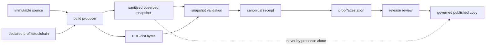

<!-- [KFM_META_BLOCK_V2]
doc_id: kfm://doc/artifacts-build-env-readme
title: artifacts/build/env/ — Sanitized Build Context and Reproducibility Boundary
type: readme; directory-readme; build-environment-staging; reproducibility-context; compatibility-boundary
version: v0.2
status: draft; repository-grounded; compatibility-root; transitional; three-tracked-files; scaffolds-incomplete; generator-not-established; schema-not-established; validator-not-established; ci-not-established; reproducibility-unproven; release-binding-unestablished; non-authoritative
owners: OWNER_TBD — Build steward · Reproducibility steward · CI/platform steward · Supply-chain steward · Security/privacy steward · Receipt/proof steward · Release steward · Docs steward
created: 2026-06-16
updated: 2026-07-16
supersedes: v0.1 bounded build-environment fingerprint contract
policy_label: public-doc; artifacts; build; environment; toolchain; reproducibility; deterministic-builds; non-secret; sanitized; no-trust-authority; no-release-authority; correction-aware; rollback-aware
current_path: artifacts/build/env/README.md
truth_posture: CONFIRMED target README and prior blob, Directory Rules classification of artifacts as a transitional compatibility root, parent build and sibling pdf/dist boundaries, direct tracked inventory of README.md plus build-env.json plus tool-versions.yaml, build-env.json status PROPOSED with null identity/time/platform fields and empty tools/outputs arrays, tool-versions.yaml status PROPOSED with one doctrine-sourced Pandoc version and null XeLaTeX/Ghostscript/qpdf versions, root and Explorer Web build commands TODO-only, root gitignore protecting .env names but not arbitrary data serialized into tracked JSON/YAML, bounded search surfacing no generator or consumer, checked absence of env-manifest.json and build-platform.json, and checked absence of schemas/artifacts/build-env.schema.json / PROPOSED stable snapshot schema, generator, declared-versus-observed tool split, immutable snapshot identity, explicit variable allowlist, path and secret redaction, tool/container/lock digests, input/output linkage, repeated-build comparison, validator, CI, retention, release binding, correction, migration, and retirement / CONFLICTED mutable-looking tracked scaffold names versus immutable per-run records; compatibility staging versus canonical receipt/proof/release homes; doctrine-sourced tool declarations versus unverified executable discovery; .env ignore rules versus tracked JSON/YAML; and deterministic-build prose versus no active producer / UNKNOWN local or CI-only snapshots, installed tools, external build services, current secret-scan state, reproducibility rate, consumers, branch-protection significance, retention, deployment, and production behavior / NEEDS VERIFICATION owners, CODEOWNERS, scaffold disposition, schema home, generator location, filename strategy, source-date derivation, allowlisted variables, redaction rules, tool discovery, platform normalization, dependency locks, output linkage, CI ownership, release handoff, correction consumers, and rollback execution
evidence_snapshot:
  repository: bartytime4life/Kansas-Frontier-Matrix
  repository_id: "1059091169"
  visibility: public
  base_ref: main
  base_commit: 0bc925d42301025dbf5e5ce08a154bbc35388bca
  target_prior_blob: c48bbb8edda9c9f9e894cc405c3f5d73c50ddc2e
  direct_lane_files:
    - README.md
    - build-env.json
    - tool-versions.yaml
  direct_lane_blobs:
    README.md: c48bbb8edda9c9f9e894cc405c3f5d73c50ddc2e
    build-env.json: f9f8fae72f8304c5ded6ada2f991692de502dcba
    tool-versions.yaml: 0d2befc9c8778e863d9cbcc8cedf88478f27de4c
  checked_absent:
    - env-manifest.json
    - build-platform.json
    - schemas/artifacts/build-env.schema.json
  bounded_inventory_note: tracked repository evidence cannot establish uncommitted local files, CI workspaces, external builders, registries, object stores, historical snapshots, or uninspected subprojects
related:
  - ../README.md
  - ../dist/README.md
  - ../pdf/README.md
  - ../../README.md
  - ../../../docs/doctrine/directory-rules.md
  - ../../../docs/runbooks/DOCTRINE_ARTIFACT_PREFLIGHT.md
  - ../../../package.json
  - ../../../apps/explorer-web/package.json
  - ../../../.gitignore
  - ../../../data/receipts/README.md
  - ../../../data/proofs/README.md
  - ../../../data/published/README.md
  - ../../../release/README.md
tags: [kfm, artifacts, build, environment, toolchain, source-date-epoch, locale, platform, reproducibility, secret-scrubbing, path-redaction, provenance, receipts, release-handoff, correction, rollback]
notes:
  - "The lane contains three tracked files, but both machine files explicitly remain incomplete PROPOSED scaffolds."
  - "CONFIRMED_BY_DOCTRINE is not proof that an executable is installed, resolved, used, or digest-verified."
  - "No repository generator, schema, validator, workflow, or consumer was established for this lane."
  - "The root .gitignore ignores .env names but does not make tracked build-env.json or tool-versions.yaml safe."
  - "This revision changes documentation only."
[/KFM_META_BLOCK_V2] -->

<a id="top"></a>

# `artifacts/build/env/` — Sanitized Build Context and Reproducibility Boundary

> Record only the minimum non-secret context needed to explain or reproduce a specific build. Never copy the ambient environment, and never treat a tool-version file, environment snapshot, container label, or successful build as evidence closure, release approval, publication, or production truth.

<p>
  
  
  
  
  
  
</p>

**Quick navigation:** [Status](#status-and-evidence-boundary) · [Authority](#authority-and-repository-fit) · [Inventory](#confirmed-inventory) · [Files](#current-file-semantics) · [Model](#governed-record-model) · [Snapshot](#proposed-snapshot-contract) · [Toolchain](#declared-and-observed-toolchain) · [Normalization](#deterministic-normalization) · [Secrets](#allowlist-secret-and-path-controls) · [Reproducibility](#reproducibility-proof) · [Lifecycle](#lifecycle-and-release-boundary) · [Producer](#producer-and-consumer-contracts) · [Validation](#validation-and-ci) · [Correction](#correction-and-rollback) · [Done](#definition-of-done) · [Open](#open-verification-register) · [Evidence](#evidence-ledger)

---

## Status and evidence boundary

> [!IMPORTANT]
> **Snapshot:** `main@0bc925d42301025dbf5e5ce08a154bbc35388bca`<br>
> **Prior README blob:** `c48bbb8edda9c9f9e894cc405c3f5d73c50ddc2e`<br>
> **Tracked files:** `README.md`, `build-env.json`, `tool-versions.yaml`<br>
> **Generator / schema / validator / workflow / consumer:** not established<br>
> **Reproducibility and release binding:** not established

`artifacts/build/env/` is a repository-confirmed transitional compatibility lane containing two incomplete machine-readable scaffolds. It is not an operational environment-capture system.

| Capability | Status | Safe conclusion |
|---|---:|---|
| README | `CONFIRMED` | Human boundary exists. |
| `build-env.json` | `CONFIRMED SCAFFOLD` | Status is `PROPOSED`; identity, time, locale, platform, tools, and outputs are null or empty. |
| `tool-versions.yaml` | `CONFIRMED PARTIAL SCAFFOLD` | Pandoc is doctrine-declared; three other tool versions are null. |
| Generator | `NOT ESTABLISHED` | No writer surfaced. |
| Consumer | `NOT ESTABLISHED` | No build, receipt, proof, or release process surfaced as reading this lane. |
| Schema and validator | `NOT ESTABLISHED` | Checked candidate schema absent; no validator surfaced. |
| Secret scrubbing | `NOT ESTABLISHED` | Prose rules exist; executable controls do not. |
| Immutable snapshot identity | `NOT ESTABLISHED` | Generic `build-env.json` can be overwritten. |
| Repeated-build comparison | `NOT ESTABLISHED` | No byte or semantic-equivalence report verified. |
| Receipt/proof/release refs | `NOT ESTABLISHED` | Canonical homes are documented but not bound. |
| Production use | `UNKNOWN` | Repository scaffolds do not prove external or deployed behavior. |

Truth labels used here: `CONFIRMED`, `PROPOSED`, `CONFLICTED`, `UNKNOWN`, `NEEDS VERIFICATION`, and `DENY`.

[Back to top](#top)

---

## Authority and repository fit

Directory Rules classify `artifacts/` as a compatibility root for derived, regenerable, non-authoritative material.

```text
apps/ packages/ tools/ pipelines/   build implementation
configs/                             non-secret configuration
artifacts/build/env/                 sanitized build-context staging
artifacts/build/pdf/                 generated PDF staging
artifacts/build/dist/                generated distribution staging
data/receipts/                       canonical process memory
data/proofs/                         canonical proof / EvidenceBundle homes
release/                             promotion, correction, withdrawal, rollback
data/published/                      governed published copies
```

This lane may support reproducibility. It must not become a second configuration root, secret store, lockfile home, container registry, SBOM authority, receipt/proof store, release directory, deployment inventory, or public artifact root.

| Responsibility | Authority home | Role here |
|---|---|---|
| Build logic | implementation roots | Reference producer; never implement here. |
| Stable configuration | `configs/` or implementation-owned config | Reference declared policy. |
| Environment context | this lane | Minimal sanitized staging only. |
| Object meaning and shape | `contracts/`, `schemas/` | External authority if implemented. |
| Validation | `tools/validators/` or accepted package | External executable. |
| Receipts and proofs | `data/receipts/`, `data/proofs/` | Canonical binding. |
| Release and publication | `release/`, `data/published/` | Governed decisions and copies. |
| Secrets | protected CI / secret manager | Never serialize here. |

A snapshot can be referenced by digest from canonical records. It cannot replace them.

[Back to top](#top)

---

## Confirmed inventory

```text
artifacts/build/env/
├── README.md
├── build-env.json
└── tool-versions.yaml
```

No checked `env-manifest.json`, `build-platform.json`, or candidate `schemas/artifacts/build-env.schema.json` exists at the pinned snapshot.

| File | Current role | Current limitation |
|---|---|---|
| `README.md` | Human contract | v0.1 inventory was stale. |
| `build-env.json` | Proposed per-build snapshot scaffold | No actual build identity, platform, tools, or outputs. |
| `tool-versions.yaml` | Proposed toolchain declaration | Partial, unobserved, and not receipt-bound. |

The root and Explorer Web `build` scripts remain TODO-only. Bounded search found no direct producer or consumer for this lane.

[Back to top](#top)

---

## Current file semantics

### `build-env.json`

The scaffold identifies itself as `0.1-scaffold` and `PROPOSED`. Its `generated_at`, `source_git_sha`, `source_date_epoch`, `locale`, and `platform` are null; `tools` and `outputs` are empty.

Therefore it proves only that a design placeholder exists. It does not prove a build ran, a source commit was used, tools were discovered, bytes were produced, or a receipt was emitted.

### `tool-versions.yaml`

The scaffold declares Pandoc `3.1.12.3` as `CONFIRMED_BY_DOCTRINE`; XeLaTeX, Ghostscript, and qpdf remain null. It also declares `SOURCE_DATE_EPOCH` derivation, `C.UTF-8`, and embedded fonts.

`CONFIRMED_BY_DOCTRINE` may support an intended pin. It does not prove:

- executable installation or PATH resolution;
- executable or package digest;
- actual use by CI;
- use for a specific output;
- compatibility or security review;
- release readiness.

### Required semantic split

| Object | Question | Current state |
|---|---|---:|
| Toolchain policy | What tools and versions are permitted? | Partial scaffold |
| Observed snapshot | What was actually present for one build? | Not implemented |
| Build receipt | What ran, with which inputs, and which outputs resulted? | Canonical record belongs elsewhere |

Do not collapse these objects into a mutable file.

[Back to top](#top)

---

## Governed record model

A mature snapshot must be:

- tied to one immutable source and build profile;
- minimal and allowlisted;
- scrubbed of secrets and private context;
- immutable after canonical reference;
- canonically serialized and digestable;
- linked to exact input and output digests;
- machine-validatable;
- correctable without rewriting history;
- subordinate to receipts, proofs, policy, review, and release.

```text
declared toolchain policy
  -> build producer
  -> sanitized observed snapshot + exact output digests
  -> canonical RunReceipt / proof
  -> release review and immutable ReleaseManifest binding
```

A successful snapshot validation proves only the configured snapshot checks.

[Back to top](#top)

---

## Proposed snapshot contract

> [!WARNING]
> This example is `PROPOSED`; it is not the current schema.

```json
{
  "schema_version": "1.0.0",
  "snapshot_id": "buildenv:<sha256>",
  "status": "OBSERVED",
  "generated_at": "2026-07-16T00:00:00Z",
  "source": {
    "repository": "bartytime4life/Kansas-Frontier-Matrix",
    "git_sha": "<40-hex>",
    "tree_dirty": false
  },
  "determinism": {
    "source_date_epoch": 0,
    "timezone": "UTC",
    "locale": "C.UTF-8",
    "umask": "0022",
    "path_policy": "relative-and-redacted"
  },
  "platform": {
    "os_family": "linux",
    "architecture": "x86_64",
    "container_image_digest": "sha256:<digest>"
  },
  "tools": [
    {
      "name": "pandoc",
      "declared_version": "3.1.12.3",
      "observed_version": "3.1.12.3",
      "executable_digest": "sha256:<digest>",
      "discovery": "pandoc --version"
    }
  ],
  "dependency_locks": [{"path": "<lockfile>", "digest": "sha256:<digest>"}],
  "inputs": [{"path": "<relative-input>", "digest": "sha256:<digest>"}],
  "outputs": [{"path": "<relative-output>", "digest": "sha256:<digest>", "media_type": "<type>"}],
  "environment": {
    "captured_keys": ["LC_ALL", "LANG", "TZ", "SOURCE_DATE_EPOCH"],
    "values": {"LC_ALL": "C.UTF-8", "TZ": "UTC", "SOURCE_DATE_EPOCH": "0"}
  },
  "generator": {"name": "kfm-build-env", "version": "<version>", "digest": "sha256:<digest>"},
  "canonical_refs": {"run_receipt_ref": null, "proof_ref": null, "release_ref": null}
}
```

Required fields should include schema version, snapshot ID, source commit and dirty state, deterministic controls, platform identity, declared and observed tools, lock/input/output digests, captured-key allowlist, generator identity, and canonical references.

A closed schema should reject raw environment dumps, credentials, private keys, authorization headers, user-home content, private endpoints, process listings, sensitive filenames, and unbounded logs.

[Back to top](#top)

---

## Declared and observed toolchain

Declared versions describe intended policy. Observed versions describe one run. A strict build requires an explicit comparison.

| Condition | Proposed result |
|---|---|
| Required declared and observed versions match | `MATCH` |
| Required observed version differs | `MISMATCH` and HOLD/FAIL |
| Required version cannot be discovered | `ERROR` |
| Required pin is absent | `UNRESOLVED` |
| Optional unused tool | `NOT_APPLICABLE` with reason |

A tool entry should record a controlled tool ID, declared version/range, observed version, discovery command, normalized path class, package or executable digest where material, source/image identity, and compatibility outcome.

Null required versions must fail closed. Silently omitting required tools is not acceptable.

[Back to top](#top)

---

## Deterministic normalization

Control byte-affecting context where material:

- `SOURCE_DATE_EPOCH` from an accepted rule;
- fixed timezone and locale;
- stable file ordering and directory traversal;
- normalized archive timestamps, ownership, permissions, and umask;
- stripped or tokenized absolute paths;
- excluded hostnames and usernames;
- deterministic random seeds;
- pinned compression and tool flags;
- explicit encoding and line-ending policy;
- pinned fonts and rights review;
- controlled parallelism where ordering changes bytes.

The current `derived-from-git-commit-time` statement still needs decisions about which commit/time field, dirty trees, submodules, shallow clones, corrections, and timezone normalization.

Reproducibility maturity should be labeled distinctly: `DECLARED`, `OBSERVED`, `REPEATED`, `BYTE_IDENTICAL`, `SEMANTICALLY_EQUIVALENT`, or `NON_REPRODUCIBLE`.

[Back to top](#top)

---

## Allowlist, secret, and path controls

> **Never serialize the ambient process environment. Capture only explicitly allowlisted, build-relevant, non-secret keys.**

Candidate safe classes include deterministic controls (`SOURCE_DATE_EPOCH`, `TZ`, `LC_ALL`, `LANG`), controlled build-profile IDs, and bounded non-secret byte-affecting settings.

Deny names or values resembling tokens, passwords, private keys, cloud credentials, registry auth, signing keys, cookies, authorization headers, database URLs with credentials, SSH material, internal service credentials, or high-entropy secrets.

Also remove or normalize:

- developer usernames and email addresses;
- home directories and temporary paths;
- workstation or runner hostnames;
- private mirrors, shares, and endpoints;
- private certificate paths;
- sensitive source/output filenames;
- exact protected-domain identifiers.

The root `.gitignore` ignores `.env` and `.env.*` filenames. It does **not** protect secrets copied into tracked `build-env.json`, `tool-versions.yaml`, logs, or manifests. Content scanning is mandatory.

[Back to top](#top)

---

## Reproducibility proof

One observed run is not proof. A governed comparison should:

1. resolve the same immutable source;
2. use the same accepted profile and declared toolchain;
3. start from clean independent workspaces;
4. generate independent snapshots;
5. build without live network unless governed and pinned;
6. compare normalized environment fields;
7. compare required output digests;
8. use an accepted semantic comparator only when byte equality is not required;
9. emit a structured QA/proof report in its owning lane;
10. reference results from canonical receipts/releases.

Proposed outcomes: `BYTE_IDENTICAL`, `SEMANTICALLY_EQUIVALENT`, `ENVIRONMENT_MISMATCH`, `OUTPUT_MISMATCH`, `INSUFFICIENT_CONTEXT`, and `ERROR`.

The harness must fail if zero outputs are compared, the same file is compared to itself, missing files are skipped, both runs reuse dirty output state, both snapshots are empty scaffolds, or unpinned network inputs are accepted.

[Back to top](#top)

---

## Lifecycle and release boundary

The KFM lifecycle remains:

```text
RAW -> WORK / QUARANTINE -> PROCESSED -> CATALOG / TRIPLET -> PUBLISHED
```

Environment snapshots are derived operational context, not a new lifecycle phase.



The canonical bridge must bind snapshot digest, source commit, command/generator identity, input manifest, output digests, validation, review, release decision, and correction/rollback targets.

Snapshot presence does not prove source admission, semantic correctness, evidence closure, rights permission, sensitivity safety, reproducibility, release, deployment, or publication.

[Back to top](#top)

---

## Producer and consumer contracts

A future producer must:

- require an immutable source/profile;
- fail on dirty source unless explicitly non-release;
- resolve declared and observed tools;
- capture only allowlisted keys;
- normalize time, locale, paths, platform, ordering, and permissions;
- scan for secrets and private context;
- bind input and output digests;
- emit canonical deterministic JSON and a snapshot digest;
- validate before use;
- return a finite outcome;
- never write receipts, proofs, releases, or published outputs here.

It must not mutate source, dump the full environment, call live network by default, overwrite referenced snapshots, sign using keys from this lane, publish, or approve release.

Appropriate consumers include reproducibility tooling, receipt emitters, supply-chain attestations, release preflight, correction analysis, and maintainers debugging byte drift.

Forbidden consumers include public clients, direct UI/API reads, release automation that checks file presence only, AI treating snapshots as domain evidence, and deployment systems sourcing secrets/configuration from this lane.

[Back to top](#top)

---

## Validation and CI

Proposed validation outcomes:

| Outcome | Meaning |
|---|---|
| `PASS` | Configured shape, identity, security, and reproducibility checks pass. |
| `FAIL` | Snapshot is malformed, unsafe, mismatched, or incomplete. |
| `HOLD` | Required checkable context is unresolved. |
| `NOT_APPLICABLE` | Optional field/tool genuinely does not apply, with reason. |
| `ERROR` | Harness or dependency failed; never interpret as PASS. |

Validation families should cover shape, immutable identity, source/dirty state, declared-versus-observed tools, deterministic controls, secrets/privacy, platform/container identity, dependency locks, nonempty inputs/outputs, canonical references, and correction state.

A validator must fail on zero files, empty required fixtures, arbitrary extra secret-bearing fields, null required release fields, zero scanned strings, self-comparison, unchecked output digests, or a `PROPOSED` scaffold mislabeled as an observed run.

Current CI state: no workflow was established as generating, validating, uploading, retaining, or consuming this lane.

A future substantive workflow should generate and validate a sanitized snapshot, build outputs, bind digests, run secret/path scans, compare repeated builds where required, upload scrubbed ephemeral artifacts with explicit retention, and emit canonical receipts/proofs through governed tooling.

[Back to top](#top)

---

## Correction and rollback

Correction triggers include secret exposure, wrong tool/source/output identity, dirty source mislabeled clean, private path leakage, mutable image tags, missing locks, invalid normalization, untrusted generator, or use after supersession.

Correction flow:

1. stop downstream reliance;
2. classify security, privacy, rights, release, and reproducibility impact;
3. rotate exposed credentials immediately;
4. preserve the incorrect digest/history under appropriate access;
5. emit a corrected immutable snapshot;
6. revalidate outputs and downstream effects;
7. issue canonical correction/supersession records outside this lane;
8. update receipts, proofs, releases, caches, and public derivatives as governed;
9. preserve a tested rollback target.

Never edit a receipt-referenced snapshot in place.

[Back to top](#top)

---

## Definition of done

- [ ] Owners and CODEOWNERS are accepted.
- [ ] Retain/migrate/retire posture is decided.
- [ ] Toolchain policy, observed snapshot, and build receipt are separated.
- [ ] A closed contract/schema and compatibility policy exist.
- [ ] Immutable ID, canonical serialization, and digest rules exist.
- [ ] A bounded allowlist-based generator exists.
- [ ] Secret, privacy, and path-redaction validation is executable.
- [ ] Declared/observed tool comparison is executable.
- [ ] Source, locks, inputs, outputs, platform, and generator are digest-bound.
- [ ] Null and empty required cases fail closed.
- [ ] Two clean builds can be compared non-vacuously.
- [ ] CI generation, validation, artifact retention, and cleanup are substantive.
- [ ] Canonical receipt/proof/release references resolve.
- [ ] Correction, supersession, withdrawal, and rollback are tested.
- [ ] Workflow significance and branch protection are verified rather than inferred.

[Back to top](#top)

---

## Open verification register

| ID | Question | Status |
|---|---|---:|
| ENV-001 | Who owns the lane and machine files? | `NEEDS VERIFICATION` |
| ENV-002 | Retain, migrate, or retire this compatibility lane? | `NEEDS VERIFICATION` |
| ENV-003 | Should the two scaffolds remain tracked or move to examples/config? | `NEEDS VERIFICATION` |
| ENV-004 | What semantic contract and canonical schema apply? | `UNKNOWN` |
| ENV-005 | What generator and validator own implementation? | `NOT ESTABLISHED` |
| ENV-006 | What immutable filename/ID strategy is accepted? | `UNKNOWN` |
| ENV-007 | Which environment keys are allowlisted? | `UNKNOWN` |
| ENV-008 | Which secret/value patterns are denied? | `UNKNOWN` |
| ENV-009 | How are usernames, hosts, and paths normalized? | `UNKNOWN` |
| ENV-010 | How exactly is `SOURCE_DATE_EPOCH` derived? | `DECLARED / UNIMPLEMENTED` |
| ENV-011 | How are dirty trees, submodules, and shallow clones handled? | `UNKNOWN` |
| ENV-012 | Which tools are required by each build profile? | `UNKNOWN` |
| ENV-013 | How are versions, packages, executables, and image digests observed? | `UNKNOWN` |
| ENV-014 | Which dependency lockfiles are canonical and digest-bound? | `UNKNOWN` |
| ENV-015 | How are input/output manifests generated and validated? | `UNKNOWN` |
| ENV-016 | What two-build harness and comparators are accepted? | `NOT ESTABLISHED` |
| ENV-017 | Where do QA comparison reports live? | `NEEDS VERIFICATION` |
| ENV-018 | Which workflow generates and validates snapshots? | `NOT ESTABLISHED` |
| ENV-019 | What retention applies to success/failure snapshots? | `UNKNOWN` |
| ENV-020 | Are failure artifacts scrubbed before upload? | `UNKNOWN` |
| ENV-021 | Which receipt, proof, and release families reference snapshots? | `UNKNOWN` |
| ENV-022 | Are checks required by promotion or branch protection? | `UNKNOWN` |
| ENV-023 | How are corrections, credential revocations, and consumer invalidations handled? | `UNKNOWN` |
| ENV-024 | How is rollback exercised? | `UNKNOWN` |
| ENV-025 | Do external or production build systems emit equivalent governed records? | `UNKNOWN` |

[Back to top](#top)

---

## Evidence ledger

| Evidence | Supports | Does not support |
|---|---|---|
| Prior README | Existing authority boundary | Operational capture |
| `build-env.json` | Proposed scaffold exists | A completed build or receipt |
| `tool-versions.yaml` | Partial declaration exists | Installed or used tools |
| Parent/sibling READMEs | Build staging boundaries | Active producers/consumers |
| Directory Rules | Placement doctrine | Implementation maturity |
| Root and Explorer package files | Build commands are TODO-only | Bundle generation |
| `.gitignore` | `.env` names are ignored | Safety of tracked JSON/YAML |
| Doctrine preflight runbook | Proposed reproducibility expectations | Accepted implementation |
| Bounded search | No direct producer/consumer surfaced | Exhaustive absence everywhere |
| Checked 404 paths | Named candidates absent | Permanent absence |

For current behavior, executable code, schemas, workflows/logs, actual snapshot/output bytes, and canonical receipts/proofs/releases outrank this README.

### No-loss assessment

v0.1 established that this lane is non-secret reproducibility support inside a transitional compatibility root; that environment files are not receipts, proofs, release records, deployment config, or authority; and that secrets, trust records, source code, schemas, policy, and published artifacts are forbidden. Those boundaries are preserved.

v0.2 adds verified inventory, scaffold analysis, declared-versus-observed separation, immutable identity, allowlisted capture, security/privacy controls, repeated-build proof, producer/consumer contracts, CI/retention, correction, and rollback.

---

## Documentation correction and rollback

This is a documentation-only revision.

Before merge, close the draft PR or restore prior blob `c48bbb8edda9c9f9e894cc405c3f5d73c50ddc2e` in a transparent commit. After merge, revert the documentation commit or publish a corrective evidence-grounded revision.

No generator, schema, validator, environment snapshot, tool version, package, workflow, receipt, proof, release object, deployment, secret, or public artifact is changed.

> **Current determination:** the lane contains useful design scaffolds, but it does not yet provide observed, validated, immutable, secret-safe, receipt-bound build-environment evidence.

<p align="right"><a href="#top">Back to top</a></p>
