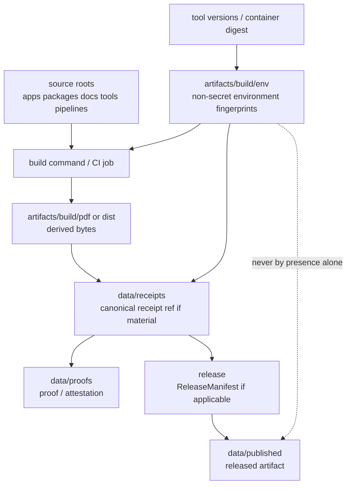

<!-- [KFM_META_BLOCK_V2]
doc_id: kfm://doc/artifacts-build-env-readme
title: artifacts/build/env/ — Build Environment Fingerprints
type: readme
version: v0.1
status: draft
owners: OWNER_TBD — Build steward · Reproducibility steward · Security steward · Evidence steward · Docs steward
created: 2026-06-16
updated: 2026-06-16
policy_label: public
related:
  - ../README.md
  - ../dist/README.md
  - ../pdf/README.md
  - ../../README.md
  - ../../../docs/doctrine/directory-rules.md
  - ../../../data/receipts/README.md
  - ../../../data/proofs/README.md
  - ../../../release/README.md
  - ../../../tools/README.md
  - ../../../pipelines/README.md
  - ../../../packages/README.md
tags: [kfm, artifacts, build, env, build-environment, toolchain, reproducibility, source-date-epoch, artifact-digest, compatibility-root, transitional]
notes:
  - "Replaces the short artifacts/build/env README with a bounded build-environment fingerprint contract."
  - "This directory is a compatibility/transitional build-output support lane for non-secret environment/toolchain fingerprints, not a receipt store, proof store, release record, CI authority, deployment secret home, or canonical build provenance authority."
  - "Specific environment snapshots, toolchain pins, digest linkage, workflow names, CI runs, reproducibility checks, and release binding remain NEEDS VERIFICATION."
[/KFM_META_BLOCK_V2] -->

<a id="top"></a>

<div align="center">

# Build Environment Fingerprints

`artifacts/build/env/`

**Compatibility/transitional staging lane for non-secret build-environment fingerprints and toolchain snapshots that help reproduce outputs staged under `artifacts/build/pdf/`, `artifacts/build/dist/`, and related build-output lanes.**


[Purpose](#1-purpose) · [Repo fit](#2-repo-fit) · [Authority boundary](#3-authority-boundary) · [Allowed contents](#5-allowed-contents) · [Forbidden contents](#6-forbidden-contents) · [Validation](#10-validation-expectations) · [Definition of done](#12-definition-of-done)

</div>

---

> [!IMPORTANT]
> **Status:** draft / `NEEDS VERIFICATION`  
> **Path:** `artifacts/build/env/README.md`  
> **Responsibility root:** `artifacts/` — compatibility root, transitional build-output support lane  
> **Truth posture:** CONFIRMED README path / CONFIRMED parent `artifacts/` compatibility-root boundary / CONFIRMED `artifacts/build/` build-output boundary / PROPOSED build-env fingerprint contract / UNKNOWN actual `tool-versions.yaml`, `build-env.json`, build jobs, CI workflows, digest linkage, retention policy, reproducibility checks, and release binding

> [!CAUTION]
> `artifacts/build/env/` is not a secret store, deployment config home, receipt store, proof store, release record, evidence store, or canonical build provenance authority. It may contain non-secret reproducibility fingerprints only.

---

## 1. Purpose

`artifacts/build/env/` holds **non-secret build-environment fingerprints** that support reproducibility of deterministic build outputs.

Typical accepted material includes:

- pinned toolchain snapshots such as `tool-versions.yaml`;
- non-secret per-build environment snapshots such as `build-env.json`;
- normalized locale/timezone/source-date metadata needed for deterministic builds;
- reproducibility hints referenced by generated distributables or PDF build outputs;
- non-authoritative environment manifests used before canonical receipts/proofs/release records are written elsewhere.

This folder exists to help explain *how build bytes were produced*. It does not prove by itself that a build was valid, policy-safe, reviewed, released, or reproducible.

This README does not prove any environment snapshot currently exists, any CI job writes here, any artifact cites these files, any digest links are present, or any release process consumes this directory.

[Back to top](#top)

---

## 2. Repo fit

| Concern | Owning root | Expected relationship |
|---|---|---|
| Build environment fingerprints | `artifacts/build/env/` | Non-secret reproducibility support for build outputs |
| Build output parent | `artifacts/build/` | Compiled byte outputs and distributables before digest/release binding |
| Distributables | `artifacts/build/dist/` | Deterministic distributable build outputs |
| PDFs | `artifacts/build/pdf/` | Deterministic PDF build outputs where present |
| Compatibility root | `artifacts/` | Transitional compatibility root; trust content forbidden |
| Source code/build logic | `apps/`, `packages/`, `tools/`, `pipelines/` | Inputs and build implementation; not stored here |
| Receipts | `data/receipts/` | Canonical process-memory and receipt home |
| Proofs / EvidenceBundles | `data/proofs/` | Canonical evidence/proof home |
| Release records | `release/` | ReleaseManifest, RollbackCard, CorrectionNotice, release decisions |
| Published artifacts | `data/published/` | Released artifact home after governed publication |
| Schemas/contracts/policy | `schemas/`, `contracts/`, `policy/` | Authority roots, never staged here |
| Secrets/deployment config | deployment environment/secret manager | Never committed here |

## 3. Authority boundary

`artifacts/build/env/` has **compatibility authority only**. It may hold non-secret environment fingerprints; it does not establish provenance, evidence, validation, policy posture, review state, release state, publication state, deployment authority, or source authority.

```text
SOURCE + TOOLCHAIN INPUTS       ENV SNAPSHOT STAGING        TRUST / RELEASE HOMES
apps/ packages/ tools/  --->    artifacts/build/env/  --->  data/receipts/
pipelines/ docs/                non-secret fingerprints     data/proofs/
schemas/ contracts/ policy/     not authoritative           release/
                                                           data/published/
```

A build environment snapshot may be referenced by digest or path from a receipt or release record. The canonical record is the trust-bearing object; the environment file's presence here is not trust evidence by itself.

## 4. Default posture

Files in this folder should be treated as **supporting reproducibility context only**.

A build output should not be treated as ready for release, publication, deployment, citation, or downstream consumption just because it has a toolchain or environment snapshot. The relevant canonical records must still exist and pass review:

- reproducible build command and source `git_sha`;
- toolchain/version fingerprint;
- normalized non-secret environment snapshot;
- content digest or artifact manifest;
- ValidationReport or equivalent build verification where applicable;
- receipt in `data/receipts/` where material;
- proof/EvidenceBundle or attestation in `data/proofs/` where material;
- policy/sensitivity/rights review where content exposure is material;
- ReleaseManifest, RollbackCard, or CorrectionNotice linkage where release is involved;
- rollback and correction path.

## 5. Allowed contents

| Allowed file | Examples | Required posture |
|---|---|---|
| Toolchain pin snapshot | `tool-versions.yaml`, `tool-versions.lock.yaml` | Non-secret, source-ref-linked, reviewable |
| Build environment snapshot | `build-env.json`, `build-env.<run-id>.json` | Non-secret, normalized, deterministic where practical |
| Reproducibility metadata | `source-date-epoch.txt`, `locale.txt`, `build-platform.json` | No host secrets or private paths |
| Build input fingerprint | source `git_sha`, package-lock hash, container image digest | References only; no embedded secrets |
| Dist/PDF link manifest | env-to-artifact relation manifest | Non-authoritative; receipts remain elsewhere |
| Sanitized build context | compiler versions, tool versions, OS/image digest | No tokens, keys, user-home paths, internal endpoints |

## 6. Forbidden contents

| Forbidden here | Correct home |
|---|---|
| Secrets, tokens, private keys, credentials, deployment-only values | Never commit; use deployment secret/config channels |
| `.env` files with secrets or live endpoints | Never commit; use deployment config channels |
| RunReceipt, TransformReceipt, ValidationReport, AIReceipt, RedactionReceipt | `data/receipts/` |
| EvidenceBundle, proof bundles, attestations | `data/proofs/` |
| ReleaseManifest, RollbackCard, CorrectionNotice | `release/` |
| Published layers, released PMTiles/MVT/COG/style assets | `data/published/` after governed release |
| Catalog records, STAC/DCAT/PROV records | `data/catalog/` |
| Source descriptors and registry records | `data/registry/` or governed source registry home |
| Source code, scripts, packages, build logic | `apps/`, `packages/`, `tools/`, `scripts/`, `pipelines/` |
| Schemas, contracts, policy rules | `schemas/`, `contracts/`, `policy/` |
| Hand-authored source documentation | `docs/` |
| Long-lived QA reports | `artifacts/qa/` |

## 7. Directory shape

Current implementation inventory remains `NEEDS VERIFICATION`.

```text
artifacts/build/env/
├── README.md
├── tool-versions.yaml              # PROPOSED pinned toolchain snapshot
├── build-env.json                  # PROPOSED sanitized environment snapshot
├── source-date-epoch.txt           # PROPOSED deterministic timestamp helper
├── build-platform.json             # PROPOSED sanitized OS/container/tool context
└── env-manifest.json               # PROPOSED non-authoritative env inventory
```

> [!WARNING]
> Do not treat this suggested shape as repo fact. Verify actual files, build outputs, environment snapshots, digest links, and workflows before making implementation claims.

## 8. Diagram



## 9. Obligations

| Obligation | Example effect |
|---|---|
| `non_secret_only` | No tokens, keys, credentials, private endpoints, or deployment-only values |
| `supporting_context_only` | Environment snapshots support reproducibility but do not prove release state |
| `reproducibility_focused` | Captures toolchain, source ref, locale/time, and normalized build context |
| `digest_linkable` | Material snapshots should be hashable and referenceable from canonical receipts |
| `receipt_elsewhere` | Trust-bearing receipts go to `data/receipts/`, not here |
| `proof_elsewhere` | Evidence/proof support goes to `data/proofs/`, not here |
| `release_elsewhere` | Release decisions and manifests go to `release/`, not here |
| `published_elsewhere` | Public released artifacts go to `data/published/`, not here |
| `no_parallel_authority` | This folder must not become a second release, CI, package, or provenance root |
| `safe_to_delete_if_regenerable` | Contents should be rebuildable or documented as exceptions |

## 10. Validation expectations

Useful validation for this folder should cover:

- every retained environment snapshot is non-secret and scrubbed;
- material snapshots reference a source `git_sha`, toolchain version, and reproducible build context;
- snapshots avoid host-specific private paths, user names, tokens, internal endpoints, and deployment-only values;
- snapshots are hashable and can be referenced by canonical receipts where material;
- no receipts, proofs, release records, catalog records, source descriptors, schemas, contracts, policy rules, or published artifacts are stored here;
- outputs are either temporary/regenerable or referenced by governed records outside this directory;
- retention/pruning behavior is documented;
- release binding, if any, happens through `release/` and `data/published/`, not by treating this folder as public.

## 11. Safe change pattern

For changes under `artifacts/build/env/`:

1. Confirm the file is a non-secret build-environment fingerprint and not source or trust content.
2. Scrub secrets, deployment-only values, internal private paths, tokens, and host-specific identifiers.
3. Confirm source refs, build commands, toolchain versions, and deterministic controls are known.
4. Keep digestable environment snapshots small, deterministic, and reviewable.
5. Write canonical receipts/proofs/release records to their owning roots, not here.
6. Verify no protected details or deployment-only values are embedded.
7. Update this README, parent `artifacts/build/` docs, build tooling docs, receipts/proofs/release docs, and tests when behavior materially changes.

## 12. Definition of done

- [ ] Owners are confirmed and `OWNER_TBD` is replaced.
- [ ] Actual environment snapshot inventory is verified.
- [ ] Toolchain pin and build environment formats are documented.
- [ ] Secret-scrubbing and metadata-scrubbing rules are documented.
- [ ] Digest format and canonical receipt linkage are documented where material.
- [ ] Retention and pruning behavior are documented.
- [ ] No trust-bearing records live here.
- [ ] No source files, schemas, contracts, policy rules, secrets, or published artifacts live here.
- [ ] CI/workflow behavior is verified or marked `NEEDS VERIFICATION`.

## 13. Open verification items

| Item | Why it matters |
|---|---|
| Confirm actual files under `artifacts/build/env/` | Prevents overclaiming environment inventory |
| Confirm build jobs that write here | Required before CI/workflow claims |
| Confirm `tool-versions.yaml` and `build-env.json` schemas | Required before shape claims |
| Confirm secret-scrubbing behavior | Required before safety claims |
| Confirm digest/reference convention | Required before receipt-linkage claims |
| Confirm retention/pruning policy | Required before storage-lifecycle claims |
| Confirm no trust records are stored here | Required before Directory Rules compliance claims |
| Confirm release handoff, if any | Required before publication claims |
| Confirm artifact reproducibility | Required before deterministic-build claims |
| Confirm metadata scrubbing for private paths/endpoints | Required before safe publication claims |

<details>
<summary>Appendix A — no-loss preservation note</summary>

The previous README established that build-environment fingerprints for outputs staged in `artifacts/build/pdf/` and `artifacts/build/dist/` belong here, and that `tool-versions.yaml` and `build-env.json` support reproducibility but are not receipts, proofs, or release decisions. This replacement preserves those constraints and expands the governed directory contract.

</details>

## Status summary

`artifacts/build/env/` is a transitional compatibility lane for non-secret build-environment fingerprints. It is useful as reproducibility context, but it does not carry trust by itself.

A file here becomes relevant to KFM trust only when a canonical receipt, proof, or release record elsewhere references it by digest and passes appropriate validation, policy, review, publication, correction, and rollback gates.

<p align="right"><a href="#top">Back to top</a></p>
