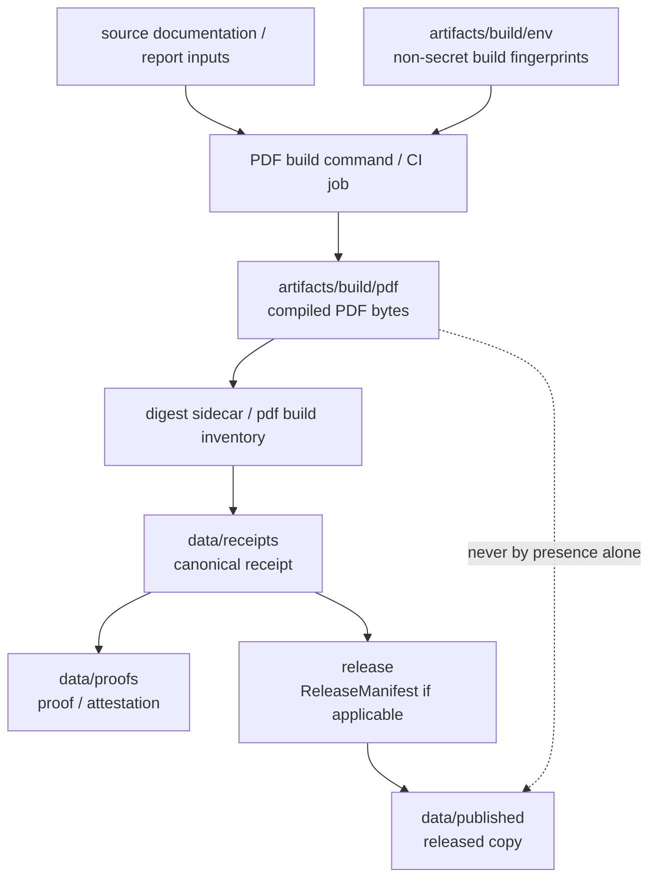

<!-- [KFM_META_BLOCK_V2]
doc_id: kfm://doc/artifacts-build-pdf-readme
title: artifacts/build/pdf/ — Deterministic PDF Build Outputs
type: readme
version: v0.1
status: draft
owners: OWNER_TBD — Build steward · PDF steward · Release steward · Evidence steward · Docs steward
created: 2026-06-16
updated: 2026-06-16
policy_label: public
related:
  - ../README.md
  - ../dist/README.md
  - ../env/README.md
  - ../../README.md
  - ../../../docs/doctrine/directory-rules.md
  - ../../../data/receipts/README.md
  - ../../../data/proofs/README.md
  - ../../../data/published/README.md
  - ../../../release/README.md
  - ../../../tools/README.md
  - ../../../pipelines/README.md
tags: [kfm, artifacts, build, pdf, pdf-a, deterministic-bytes, artifact-digest, reproducibility, compatibility-root, transitional]
notes:
  - "Replaces the short artifacts/build/pdf README with a bounded PDF build-output contract."
  - "This directory is a compatibility/transitional PDF build-output lane, not a source documentation home, trust surface, release surface, evidence store, receipt store, proof store, published artifact home, or canonical documentation authority."
  - "Specific PDFs, digest sidecars, PDF/A validation results, build workflows, toolchain fingerprints, artifact retention rules, and CI pass state remain NEEDS VERIFICATION."
[/KFM_META_BLOCK_V2] -->

<a id="top"></a>

<div align="center">

# Deterministic PDF Build Outputs

`artifacts/build/pdf/`

**Compatibility/transitional staging lane for compiled PDF bytes — especially reproducible, linearized PDF/PDF-A outputs — while they are prepared for digesting, citation, review, packaging, or later governed release binding.**


[Purpose](#1-purpose) · [Repo fit](#2-repo-fit) · [Authority boundary](#3-authority-boundary) · [Allowed contents](#5-allowed-contents) · [Forbidden contents](#6-forbidden-contents) · [Validation](#10-validation-expectations) · [Definition of done](#12-definition-of-done)

</div>

---

> [!IMPORTANT]
> **Status:** draft / `NEEDS VERIFICATION`  
> **Path:** `artifacts/build/pdf/README.md`  
> **Responsibility root:** `artifacts/` — compatibility root, transitional build-output lane  
> **Truth posture:** CONFIRMED README path / CONFIRMED parent `artifacts/` compatibility-root boundary / CONFIRMED `artifacts/build/` build-output boundary / PROPOSED PDF build-output contract / UNKNOWN actual PDFs, digest sidecars, PDF/A validation results, build jobs, CI workflows, retention policy, release binding, and generated artifact inventory

> [!CAUTION]
> `artifacts/build/pdf/` is not canonical documentation, not an evidence store, not a receipt store, not a release store, and not a publication store. A PDF staged here becomes relevant to trust only when a canonical receipt, proof, or release record elsewhere references its digest.

---

## 1. Purpose

`artifacts/build/pdf/` holds **compiled PDF outputs** while they are being staged for digesting, citation, review, packaging, or later release binding.

Typical accepted material includes:

- compiled PDFs generated from source Markdown, documentation, reports, or build scripts elsewhere;
- linearized PDF outputs where deterministic linearization is part of the build chain;
- PDF/A outputs where conformance is part of the documented build process;
- PDF digest sidecars such as `<doc-id>.digest.json` when emitted here as staging aids;
- non-secret PDF build metadata that directly supports reproducibility and digest citation.

This folder exists so build tooling has a predictable staging location for PDF bytes before those bytes are pinned by digest and referenced by canonical trust records in `data/receipts/`, `data/proofs/`, or `release/` where applicable.

This README does not prove any PDF currently exists, any build job writes here, any digest sidecar is present, any PDF/A validation passed, or any release process consumes this directory.

[Back to top](#top)

---

## 2. Repo fit

| Concern | Owning root | Expected relationship |
|---|---|---|
| PDF staging | `artifacts/build/pdf/` | Derived, reproducible, non-authoritative PDF byte-output lane |
| Build output parent | `artifacts/build/` | Compiled byte outputs and distributables before digest/release binding |
| Build environment fingerprints | `artifacts/build/env/` | Non-secret toolchain/environment context |
| Distributables | `artifacts/build/dist/` | Non-PDF deterministic distributable build outputs |
| Compatibility root | `artifacts/` | Transitional compatibility root; trust content forbidden |
| Source documentation | `docs/` | Hand-authored source documentation; not stored here |
| Source code/build logic | `apps/`, `packages/`, `tools/`, `pipelines/` | Inputs and build implementation; not stored here |
| Receipts | `data/receipts/` | Canonical process-memory and receipt home |
| Proofs / EvidenceBundles | `data/proofs/` | Canonical evidence/proof home |
| Release records | `release/` | ReleaseManifest, RollbackCard, CorrectionNotice, release decisions |
| Published artifacts | `data/published/` | Released artifact home after governed publication |
| Schemas/contracts/policy | `schemas/`, `contracts/`, `policy/` | Authority roots, never staged here |

## 3. Authority boundary

`artifacts/build/pdf/` has **compatibility authority only**. It may hold derived PDF bytes; it does not establish source truth, documentation truth, provenance, evidence, validation, policy posture, review state, release state, publication state, or source authority.

```text
SOURCE + BUILD INPUTS          PDF BUILD OUTPUT STAGING       TRUST / RELEASE HOMES
docs/ apps/ packages/  --->    artifacts/build/pdf/     --->  data/receipts/
tools/ pipelines/              compiled PDF bytes only        data/proofs/
schemas/ contracts/ policy/    not authoritative              release/
                                                             data/published/
```

A PDF file in this folder may be referenced by digest from a receipt or release record. The digest reference is the governed bridge; the PDF's mere presence here is not evidence, proof, validation, release approval, or publication.

## 4. Default posture

PDF build outputs in this folder should be treated as **untrusted until pinned and reviewed**.

A PDF should not be treated as ready for citation, publication, release, deployment, or downstream consumption unless the relevant canonical records exist and pass review:

- source document/path and source `git_sha`;
- reproducible build command and toolchain/version fingerprint;
- normalized build environment context from `artifacts/build/env/` or canonical receipt refs where material;
- content digest or digest manifest;
- PDF/A or equivalent validation report where claimed;
- receipt in `data/receipts/` where material;
- proof/EvidenceBundle or attestation in `data/proofs/` where material;
- policy/sensitivity/rights review where content exposure is material;
- ReleaseManifest, RollbackCard, or CorrectionNotice linkage where release is involved;
- rollback and correction path.

## 5. Allowed contents

| Allowed artifact | Examples | Required posture |
|---|---|---|
| Compiled PDF output | `<doc-id>.pdf` | Derived, reproducible, digestable |
| Linearized PDF output | `<doc-id>.linearized.pdf` | Build output only, not canonical documentation |
| PDF/A output | `<doc-id>.pdf` with PDF/A target where validated elsewhere | Validation record belongs elsewhere |
| Digest sidecar | `<doc-id>.digest.json`, `<doc-id>.sha256` | Staging only; receipts remain in `data/receipts/` |
| PDF build metadata | source path/ref, toolchain snapshot ref, build command ref | Non-secret and non-authoritative |
| Dist relation manifest | PDF-to-dist/package relation listing | Non-authoritative; release binding elsewhere |

## 6. Forbidden contents

| Forbidden here | Correct home |
|---|---|
| Source Markdown or source documentation | `docs/` or other source doc roots |
| RunReceipt, TransformReceipt, ValidationReport, AIReceipt, RedactionReceipt | `data/receipts/` |
| EvidenceBundle, proof bundles, attestations | `data/proofs/` |
| ReleaseManifest, RollbackCard, CorrectionNotice | `release/` |
| Published PDF copies or public release bundles | `data/published/` after governed release |
| Catalog records, STAC/DCAT/PROV records | `data/catalog/` |
| Source descriptors and registry records | `data/registry/` or governed source registry home |
| Source code, scripts, packages, build logic | `apps/`, `packages/`, `tools/`, `scripts/`, `pipelines/` |
| Schemas, contracts, policy rules | `schemas/`, `contracts/`, `policy/` |
| Secrets, tokens, private keys, deployment-only values | Never commit; use deployment secret/config channels |
| Hand-authored source documentation | `docs/` |
| Long-lived QA reports | `artifacts/qa/` |

## 7. Directory shape

Current implementation inventory remains `NEEDS VERIFICATION`.

```text
artifacts/build/pdf/
├── README.md
├── <doc-id>.pdf                    # PROPOSED compiled PDF output
├── <doc-id>.digest.json            # PROPOSED digest metadata sidecar
├── <doc-id>.sha256                 # PROPOSED digest sidecar
├── pdf-build-manifest.json         # PROPOSED non-authoritative listing
└── pdf-build-env-ref.json          # PROPOSED reference to artifacts/build/env/ snapshot
```

> [!WARNING]
> Do not treat this suggested shape as repo fact. Verify actual PDFs, build outputs, PDF/A conformance reports, digests, workflows, and release records before making implementation claims.

## 8. Diagram



## 9. Obligations

| Obligation | Example effect |
|---|---|
| `derived_only` | PDFs here are build outputs, not canonical source docs |
| `reproducible_bytes` | Outputs should be reproducible from source ref plus toolchain pins |
| `digest_required` | Material PDFs should be hash-pinned before trust use |
| `validation_elsewhere` | PDF/A or build validation records go to canonical receipt/report homes |
| `receipt_elsewhere` | Trust-bearing receipts go to `data/receipts/`, not here |
| `proof_elsewhere` | Evidence/proof support goes to `data/proofs/`, not here |
| `release_elsewhere` | Release decisions and manifests go to `release/`, not here |
| `published_elsewhere` | Public released copies go to `data/published/`, not here |
| `no_secrets` | PDF metadata/build metadata must not contain secrets or deployment-only values |
| `no_parallel_authority` | This folder must not become a second docs, release, evidence, or catalog root |

## 10. Validation expectations

Useful validation for this folder should cover:

- every retained PDF has a reproducible source ref;
- material PDFs have deterministic digests;
- digest sidecars do not replace receipts;
- PDF metadata contains no secrets, private paths, protected details, or deployment-only values;
- PDF/A or other conformance claims are supported by canonical validation records where material;
- no receipts, proofs, release records, catalog records, source descriptors, schemas, contracts, policy rules, or published artifacts are stored here;
- outputs are either temporary/regenerable or referenced by governed records outside this directory;
- retention/pruning behavior is documented;
- release binding, if any, happens through `release/` and `data/published/`, not by treating this folder as public.

## 11. Safe change pattern

For changes under `artifacts/build/pdf/`:

1. Confirm the file is a derived PDF build output and not source or trust content.
2. Confirm the source refs, build command, and toolchain versions are known.
3. Produce deterministic PDF bytes where practical.
4. Generate digest sidecars only as staging aids.
5. Write canonical receipts/proofs/release records to their owning roots, not here.
6. Verify no secrets, private paths, protected details, or deployment-only values are embedded in PDF metadata or sidecars.
7. Update this README, parent `artifacts/build/` docs, build tooling docs, receipts/proofs/release docs, and tests when behavior materially changes.

## 12. Definition of done

- [ ] Owners are confirmed and `OWNER_TBD` is replaced.
- [ ] Actual PDF build-output inventory is verified.
- [ ] Build commands and toolchain pins are documented.
- [ ] Digest format and sidecar convention are documented.
- [ ] PDF metadata scrubbing and PDF/A/conformance validation are documented where claimed.
- [ ] Retention and pruning behavior are documented.
- [ ] Canonical receipt/proof/release homes are linked where material.
- [ ] No trust-bearing records live here.
- [ ] No source docs, source files, schemas, contracts, policy rules, secrets, or published artifacts live here.
- [ ] CI/workflow behavior is verified or marked `NEEDS VERIFICATION`.

## 13. Open verification items

| Item | Why it matters |
|---|---|
| Confirm actual files under `artifacts/build/pdf/` | Prevents overclaiming PDF inventory |
| Confirm build jobs that write here | Required before CI/workflow claims |
| Confirm digest sidecar convention | Required before hash-pinning claims |
| Confirm PDF/A or validation reports | Required before conformance claims |
| Confirm PDF metadata scrubbing | Required before safe publication claims |
| Confirm retention/pruning policy | Required before storage-lifecycle claims |
| Confirm no trust records are stored here | Required before Directory Rules compliance claims |
| Confirm release handoff, if any | Required before publication claims |
| Confirm artifact reproducibility | Required before deterministic-byte claims |
| Confirm source-document linkage | Required before citation/rebuild claims |

<details>
<summary>Appendix A — no-loss preservation note</summary>

The previous README established that compiled PDF outputs belong here while staged for digesting and citation, expected `<doc-id>.pdf` and `<doc-id>.digest.json`, and prohibited source Markdown, receipts, proofs, EvidenceBundles, release manifests, and published copies. This replacement preserves those constraints and expands the governed directory contract.

</details>

## Status summary

`artifacts/build/pdf/` is a transitional compatibility lane for deterministic PDF build outputs. It is useful as a staging location, but it does not carry trust by itself.

A PDF here becomes relevant to KFM trust only when a canonical receipt, proof, or release record elsewhere references it by digest and passes appropriate validation, policy, review, publication, correction, and rollback gates.

<p align="right"><a href="#top">Back to top</a></p>
