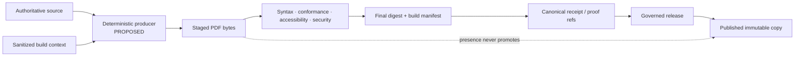

<!-- [KFM_META_BLOCK_V2]
doc_id: kfm://doc/artifacts-build-pdf-readme
title: artifacts/build/pdf/ — PDF Staging, Conformance, Accessibility, and Release-Handoff Boundary
type: readme; directory-readme; pdf-build-staging; reproducibility-contract; accessibility-boundary; compatibility-boundary
version: v0.2
status: draft; repository-grounded; compatibility-root; transitional; tracked-readme-only; generated-pdf-ignore-rule-not-established; producer-not-established; validator-not-established; pdfa-conformance-not-established; linearization-not-established; accessibility-validation-not-established; digest-manifest-not-established; release-binding-unestablished; non-authoritative
owners: OWNER_TBD — Build steward · PDF/document steward · Accessibility steward · Reproducibility steward · Security/privacy steward · Rights/licensing steward · Receipt/proof steward · Release steward · CI steward · Docs steward
created: 2026-06-16
updated: 2026-07-16
supersedes: v0.1 bounded PDF build-output contract
policy_label: public-doc; artifacts; build; pdf; pdf-a; accessibility; reproducibility; metadata-scrubbing; no-trust-authority; no-release-authority; correction-aware; rollback-aware
current_path: artifacts/build/pdf/README.md
truth_posture: CONFIRMED target README and prior blob, Directory Rules classification of artifacts as a transitional compatibility root, parent build and sibling env/dist boundaries, current environment scaffolds, doctrine-artifact preflight expectation for PDF bytes plus digest and tool-version evidence, root Makefile without a PDF target, TODO-only docs-build workflow, root gitignore without a PDF-lane or *.pdf rule, bounded search surfacing no direct producer or consumer, and checked absence of pdf-build-manifest.json, pdf-build-env-ref.json, .gitkeep, scripts/build-pdf.sh, .github/workflows/pdf-build.yml, and schemas/artifacts/pdf-build-manifest.schema.json / PROPOSED deterministic producer, immutable manifest, PDF/A and linearization validation, accessibility review, metadata and attachment scrubbing, font controls, digest sidecars, repeated-build comparison, CI retention, release binding, correction, withdrawal, supersession, and migration or retirement / CONFLICTED tracked staging path versus no generated-PDF ignore rule; deterministic-PDF prose versus no producer; PDF/A/linearization claims versus no validator; local sidecars versus canonical receipts/proofs; source identity versus compiled-byte identity; and visual appearance versus accessibility / UNKNOWN local or CI-only PDFs, external builders, installed tools, actual conformance, reproducibility, accessibility, security, release, deployment, and retention state / NEEDS VERIFICATION owners, CODEOWNERS, generated-PDF commit policy, source-to-PDF registry, build command, toolchain pins, PDF/A profile, accessibility baseline, font and metadata policy, digest format, schema/validator locations, CI ownership, release handoff, correction consumers, and rollback execution
evidence_snapshot:
  repository: bartytime4life/Kansas-Frontier-Matrix
  repository_id: "1059091169"
  visibility: public
  base_ref: main
  base_commit: 52792d12044acd2d1c4aab2c820b8c5a1dea8755
  target_prior_blob: eae2b7dd44d54596bd82c3121ba89a975ca940e5
  direct_lane_files_confirmed:
    - artifacts/build/pdf/README.md
  checked_absent_paths:
    - artifacts/build/pdf/pdf-build-manifest.json
    - artifacts/build/pdf/pdf-build-env-ref.json
    - artifacts/build/pdf/.gitkeep
    - scripts/build-pdf.sh
    - .github/workflows/pdf-build.yml
    - schemas/artifacts/pdf-build-manifest.schema.json
  bounded_inventory_note: tracked repository evidence cannot establish uncommitted local PDFs, CI workspaces, external conversion services, release assets, object stores, historical artifacts, or uninspected subprojects
related:
  - ../README.md
  - ../env/README.md
  - ../dist/README.md
  - ../../README.md
  - ../../../docs/doctrine/directory-rules.md
  - ../../../docs/runbooks/DOCTRINE_ARTIFACT_PREFLIGHT.md
  - ../../../Makefile
  - ../../../.github/workflows/docs-build.yml
  - ../../../.gitignore
  - ../../../data/receipts/README.md
  - ../../../data/proofs/README.md
  - ../../../data/published/README.md
  - ../../../release/README.md
tags: [kfm, artifacts, build, pdf, pdf-a, tagged-pdf, accessibility, linearization, metadata, fonts, digests, reproducibility, security, retention, release-handoff, correction, rollback]
notes:
  - "Only the README is confirmed in the direct lane; local or CI-only PDF files remain UNKNOWN."
  - "No producer, conformance/accessibility validator, digest manifest, workflow, or consumer was established."
  - "The root gitignore does not protect this lane from accidental generated-PDF commits."
  - "A visually correct PDF is not necessarily accessible, conformant, reproducible, evidence-backed, rights-cleared, released, or safe."
  - "This revision changes documentation only."
[/KFM_META_BLOCK_V2] -->

<a id="top"></a>

# `artifacts/build/pdf/` — PDF Staging, Conformance, Accessibility, and Release-Handoff Boundary

> Stage generated PDF bytes only long enough to validate, compare, digest, inspect, and hand them to governed records. A filename, successful export, visual match, PDF/A label, accessibility claim, signature, or digest never becomes source authority, evidence closure, release approval, publication, or production truth.

<p>
  
  
  
  
  
  
</p>

**Quick navigation:** [Status](#status-and-evidence-boundary) · [Authority](#authority-and-repository-fit) · [Inventory](#confirmed-current-inventory) · [Requirements](#pdf-build-and-validation-contract) · [Lifecycle](#trust-release-and-publication-boundary) · [Operations](#producer-ci-retention-and-correction) · [Done](#definition-of-done) · [Open](#open-verification-register) · [Evidence](#evidence-ledger)

---

## Status and evidence boundary

> [!IMPORTANT]
> **Snapshot:** `main@52792d12044acd2d1c4aab2c820b8c5a1dea8755`<br>
> **Prior README blob:** `eae2b7dd44d54596bd82c3121ba89a975ca940e5`<br>
> **Confirmed direct lane:** `artifacts/build/pdf/README.md` only<br>
> **Producer / validator / workflow / consumer:** not established<br>
> **PDF/A, linearization, accessibility, reproducibility, digest, and release binding:** not established<br>
> **Generated-PDF ignore protection:** not established

`artifacts/build/pdf/` is a repository-confirmed compatibility path, not an operational PDF build system.

| Capability | Status | Safe conclusion |
|---|---:|---|
| README | `CONFIRMED` | The human staging boundary exists. |
| Tracked PDF bytes | `NOT SURFACED` | No direct PDF payload was established. |
| Local or CI-only PDFs | `UNKNOWN` | GitHub cannot enumerate uncommitted workspaces. |
| Producer / manifest / digest | `NOT ESTABLISHED` | No accepted writer or output record was verified. |
| Toolchain context | `SCAFFOLD ONLY` | Sibling environment files remain incomplete. |
| PDF/A / linearization | `NOT ESTABLISHED` | No target profile, validator, or report was verified. |
| Accessibility / security | `NOT ESTABLISHED` | No tagged-PDF, metadata, active-content, or manual review report was verified. |
| Release binding | `NOT ESTABLISHED` | No receipt, proof, release, or published-copy reference was linked. |
| Production/public use | `UNKNOWN` | Staging documentation does not prove publication. |

Truth labels: `CONFIRMED`, `PROPOSED`, `CONFLICTED`, `UNKNOWN`, `NEEDS VERIFICATION`, and `DENY`.

[Back to top](#top)

---

## Authority and repository fit

Directory Rules classify `artifacts/` as a **transitional compatibility root** for derived, regenerable, non-authoritative material.

```text
source roots                         authored source and meaning
tools/ pipelines/ packages/          build implementation
artifacts/build/env/                  sanitized build context
artifacts/build/pdf/                  generated PDF staging
artifacts/build/dist/                 non-PDF distribution staging
data/receipts/ and data/proofs/       canonical process memory and support
release/ and data/published/          governed decision and released copy
```

This lane may stage PDF bytes. It must not become a second documentation root, evidence store, receipt store, release directory, signing authority, or public download surface.

| Responsibility | Authority home | Role here |
|---|---|---|
| Source identity/meaning | Owning source root | Reference only. |
| Producer/profile | Implementation/config roots | External and versioned. |
| Build context | `artifacts/build/env/` or canonical receipt | Sanitized reference only. |
| PDF bytes | This lane | Temporary derived staging. |
| Validation | `tools/validators/` or accepted package | External executable. |
| Receipts/proofs | `data/receipts/`, `data/proofs/` | Canonical binding. |
| Release/publication | `release/`, `data/published/` | Governed decision and copy. |
| Keys/secrets | Protected CI or secret manager | Never stored here. |

[Back to top](#top)

---

## Confirmed current inventory

Bounded evidence supports:

```text
artifacts/build/pdf/
└── README.md
```

Checked absent:

```text
artifacts/build/pdf/pdf-build-manifest.json
artifacts/build/pdf/pdf-build-env-ref.json
artifacts/build/pdf/.gitkeep
scripts/build-pdf.sh
.github/workflows/pdf-build.yml
schemas/artifacts/pdf-build-manifest.schema.json
```

Also confirmed:

- the Makefile has no PDF target;
- `docs-build.yml` contains TODO-only steps;
- sibling environment files are incomplete scaffolds;
- `.gitignore` has no `artifacts/build/pdf/` or `*.pdf` rule;
- no direct producer or consumer surfaced in bounded search.

> [!WARNING]
> Generated PDFs here are not protected by an established ignore rule. Committing binary outputs requires an explicit retention and review decision; it must never happen merely because a tool wrote them here.

[Back to top](#top)

---

## PDF build and validation contract

### Governed flow



### Identity

A material build should bind:

- source path, `doc_id`, version, status, exact `git_sha`, clean/dirty state, and dependency digests;
- immutable `build_id`, producer identity/version, profile ID, observed toolchain reference;
- final PDF path or external locator, SHA-256, size, page count, and source-to-byte relationship.

A filename is not identity. A digest identifies bytes but not meaning, rights, validation, or release state.

### Determinism

| Control | Required behavior |
|---|---|
| Time/locale/zone | Pin `SOURCE_DATE_EPOCH`, locale, and timezone. |
| Ordering/paths | Sort inputs and remove user-home, temporary, workspace, and absolute paths. |
| IDs/metadata | Normalize document IDs, dates, producer fields, and nonessential host data. |
| Fonts/templates | Pin exact files/package digests; fail on missing glyphs. |
| Compression/post-processing | Pin tools, versions, and arguments. |
| Randomness/parallelism | Disable, seed, or pin where output order may change. |
| Network | Default deny; remote assets must be vendored or digest-pinned. |

A reproducibility claim needs at least two builds. Outcomes: `BYTE_IDENTICAL`, `SEMANTICALLY_EQUIVALENT`, `DIFFERENT`, `INCONCLUSIVE`, or `ERROR`.

### Syntax, PDF/A, and linearization

Required syntax checks should validate header, objects, cross-references, pages, corruption recovery, and incremental-update state.

A PDF/A claim requires an exact profile, validator/version/ruleset, machine-readable findings, report digest, and explicit exceptions. A filename, XMP field, producer option, or visual inspection is insufficient.

Describe a file as linearized only after final-byte validation. Compute the digest after every byte-changing step, including remediation, linearization, and signing.

### Accessibility

A release candidate should be checked for title, language, tags, reading order, headings, lists, tables, links, image alt text/artifact marking, bookmarks, searchable text, Unicode mapping, form labels, contrast, and non-color cues.

Automated checks are necessary but not sufficient. Reading order, alt text, table semantics, and comprehension may require human review.

### Metadata, active content, and security

Inspect Info/XMP metadata, producer/creator, dates, IDs, paths, embedded files, JavaScript, launch actions, forms, external links, annotations, hidden layers, encryption, signatures, incremental updates, comments, hidden/off-page text, attachments, and recoverable redactions.

Default-deny secrets, private infrastructure, unreviewed attachments, active code, recoverable redactions, protected data, and unlicensed assets.

### Fonts, color, and rights

Record font identity/digest, embedding/subsetting, Unicode mapping, fallback, glyph coverage, and redistribution rights. Where material, record color space, ICC intent, image resolution, transparency, page boxes, and rendering comparison.

A visual match does not prove accessibility, semantic equivalence, rights, or release approval.

### Proposed manifest

A future non-authoritative build manifest should contain:

```json
{
  "schema_version": "PROPOSED",
  "build_id": "immutable-id",
  "source": {"path": "docs/example.md", "git_sha": "sha", "doc_id": "kfm://doc/example"},
  "producer": {"id": "producer-id", "git_sha": "sha", "profile_id": "pdf-profile"},
  "environment_ref": {"path": "artifacts/build/env/build-env.<id>.json", "sha256": "hex"},
  "output": {"path": "artifacts/build/pdf/example.pdf", "sha256": "hex", "size_bytes": 0, "page_count": 0},
  "validation": {"syntax": "PASS", "pdfa": "NOT_ESTABLISHED", "linearization": "NOT_ESTABLISHED", "accessibility": "NOT_ESTABLISHED", "security": "NOT_ESTABLISHED"},
  "canonical_refs": {"receipt_ref": null, "proof_ref": null, "release_ref": null, "published_ref": null}
}
```

The manifest is staging metadata, not a receipt, EvidenceBundle, policy decision, or ReleaseManifest. A signature may prove signer and byte integrity under its certificate policy; it does not prove truth, accessibility, rights, policy approval, or release state.

[Back to top](#top)

---

## Trust, release, and publication boundary

The KFM lifecycle remains:

```text
RAW -> WORK / QUARANTINE -> PROCESSED -> CATALOG / TRIPLET -> PUBLISHED
```

A PDF is a derived representation and cannot skip lifecycle or publication gates.

A release candidate should have, where material:

1. source identity/status and dependency digests;
2. observed build environment and producer/profile identity;
3. final PDF digest;
4. syntax, conformance, accessibility, security, and rights results;
5. canonical receipt and proof references;
6. explicit release decision;
7. immutable published location;
8. correction and rollback target.

A PDF under this path is never public merely because the repository is public. Public links should resolve to an explicitly released copy.

The doctrine-artifact preflight expects built bytes, an artifact digest, and tool-version evidence when a PDF is produced. That expectation is not proof that the preflight ran.

[Back to top](#top)

---

## Producer, CI, retention, and correction

A future producer should deny unidentified/dirty release inputs and live network access, use pinned profiles/tools, capture observed build context without dumping ambient variables, scrub metadata/paths, fail on missing fonts/glyphs, write atomically, validate final bytes, compute final digest, emit staging metadata, and return nonzero on material failure.

Validation outcomes:

| Outcome | Meaning |
|---|---|
| `PASS` | Declared checks passed for the exact bytes/profile. |
| `FAIL` | A required check failed. |
| `ABSTAIN` | Evidence is insufficient for a conformance, accessibility, rights, or release claim. |
| `DENY` | Unsafe content, leakage, rights failure, or governance bypass is present. |
| `ERROR` | Tooling or execution failed. |

Fail or abstain when output is absent/empty, validators did not run, PDF/A lacks a profile/report, accessibility lacks accepted checks, the digest predates a byte change, repeated-build proof ran once, or release names another digest.

No PDF-specific workflow is established. A future workflow should build from a clean checkout, use pinned tools, deny network, emit sanitized context, run material checks, upload short-lived non-sensitive artifacts, and block release on incomplete outcomes.

| Class | Retention posture |
|---|---|
| PR preview | Short-lived CI artifact. |
| Failed sample | Retain only when safe and necessary. |
| Reproducibility pair | Retain for the comparison window. |
| Release candidate | Retain until published copy and rollback target are confirmed. |
| Published bytes | Canonical published home, not this lane. |

For correction: identify old source/PDF digests, fix the owning source or producer, rebuild from a clean pinned environment, rerun checks, issue new digests, update canonical correction records, invalidate old links/caches/indexes, and preserve supersession lineage.

Withdraw for secrets, sensitive data, private paths, unlicensed assets, active content, recoverable redactions, or materially incorrect content. Rollback targets an accepted prior release digest; copying an old file into staging is not rollback.

[Back to top](#top)

---

## Definition of done

- [ ] Owners and CODEOWNERS accepted.
- [ ] Generated-PDF retain/ignore/externalize/retire policy accepted.
- [ ] Source-to-PDF identity contract, producer, and deterministic profile implemented.
- [ ] Observed toolchain capture, manifest schema, and validator implemented.
- [ ] Syntax, corruption, PDF/A, and linearization checks implemented where claimed.
- [ ] Accessibility profile and manual review process implemented.
- [ ] Metadata, active-content, redaction, secret, font, and rights checks implemented.
- [ ] Final digest and repeated-build comparison implemented.
- [ ] CI triggers, artifacts, and retention implemented.
- [ ] Canonical receipt, proof, release, and published-copy handoffs implemented.
- [ ] Correction, withdrawal, supersession, invalidation, and rollback exercised.
- [ ] Passing checks are not described as truth, authority, or publication.

[Back to top](#top)

---

## Open verification register

| ID | Question | Status |
|---|---|---|
| PDF-01 | Should PDFs be ignored, externally stored, selectively tracked, or the lane retired? | `NEEDS VERIFICATION` |
| PDF-02 | Who owns PDF build and accessibility governance? | `NEEDS VERIFICATION` |
| PDF-03 | Is there an uninspected producer or consumer? | `UNKNOWN` |
| PDF-04 | What source-to-PDF registry, producer home, and deterministic profile are accepted? | `PROPOSED` |
| PDF-05 | What toolchain versions/digests, PDF version, and PDF/A profile apply? | `NEEDS VERIFICATION` |
| PDF-06 | Which PDF/A, linearization, accessibility, active-content, and redaction validators are accepted? | `PROPOSED` |
| PDF-07 | What font, color, image, metadata, attachment, form, encryption, and licensing rules apply? | `NEEDS VERIFICATION` |
| PDF-08 | What manifest schema, digest sidecar, signing, and repeated-build rules apply? | `PROPOSED` |
| PDF-09 | Which CI workflow, triggers, retention periods, and release-blocking checks apply? | `PROPOSED` |
| PDF-10 | Where does the immutable published PDF live? | `NEEDS VERIFICATION` |
| PDF-11 | Which consumers invalidate old digests after correction or withdrawal? | `UNKNOWN` |
| PDF-12 | Has PDF rollback been exercised? | `UNKNOWN` |

[Back to top](#top)

---

## Evidence ledger

| Evidence | Supports | Limit |
|---|---|---|
| Prior lane README | Target identity and durable boundary | Documentation only. |
| Directory Rules | Compatibility-root separation | Does not prove producer. |
| Parent build README | Build-output intent | Planning-heavy. |
| Environment lane/files | Scaffold maturity | No executed build. |
| Distribution sibling | Staging/handoff discipline | Different output class. |
| Makefile | No PDF target in current surface | External tooling may exist. |
| `docs-build.yml` | TODO-only docs workflow | Not PDF production. |
| `.gitignore` | No PDF-lane ignore protection | Local excludes may differ. |
| Doctrine preflight runbook | Expected PDF bytes/digest/tool evidence | Not proof that preflight ran. |
| Exact path checks/search | Named candidates and producer not surfaced | Not exhaustive absence. |

### No-loss assessment

v0.1 correctly established that PDF bytes are derived, source documents remain elsewhere, staging does not create evidence or release authority, deterministic context and digests matter, trust records belong in canonical homes, and secrets/private paths are forbidden. v0.2 preserves those rules while grounding inventory and adding accessibility, security, conformance, reproducibility, CI, retention, and governed handoff requirements.

### Documentation correction and rollback

This change is documentation-only. Before merge, restore prior blob if needed:

```text
eae2b7dd44d54596bd82c3121ba89a975ca940e5
```

After merge, revert the documentation commit or publish a corrective evidence-grounded revision. No PDF, build, release, deployment, data, or production rollback is implied.

[Back to top](#top)
