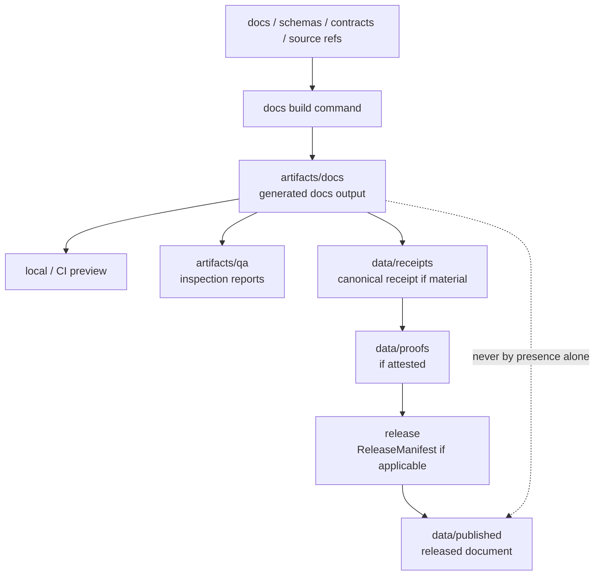

<!-- [KFM_META_BLOCK_V2]
doc_id: kfm://doc/artifacts-docs-readme
title: artifacts/docs/ — Generated Documentation Outputs
type: readme
version: v0.2
status: draft
owners: OWNER_TBD — Docs build steward · Artifacts steward · Release steward · Evidence steward
created: 2026-05-20
updated: 2026-06-16
policy_label: public
related:
  - ../README.md
  - ../../docs/
  - ../../docs/doctrine/directory-rules.md
  - ../../data/receipts/README.md
  - ../../data/proofs/README.md
  - ../../data/published/README.md
  - ../../release/README.md
  - ../../tools/README.md
  - ../../pipelines/README.md
tags: [kfm, artifacts, docs, generated-docs, documentation-build, rendered-site, api-reference, pdf-export, artifact-digest, compatibility-root, transitional, non-authoritative]
notes:
  - "Updates artifacts/docs README from a doctrine-heavy generated-docs contract to a bounded, current-session verified compatibility-root contract."
  - "Authored documentation lives under docs/. Released public-safe documents live under data/published/ and are governed by release records."
  - "This directory is a compatibility/transitional generated-docs output lane, not an authored-docs home, trust surface, release surface, evidence store, receipt store, proof store, catalog, published artifact home, or documentation authority."
  - "Specific docs-build workflows, generator names, output inventories, digest sidecars, retention rules, and CI pass state remain NEEDS VERIFICATION."
[/KFM_META_BLOCK_V2] -->

<a id="top"></a>

<div align="center">

# Generated Documentation Outputs

`artifacts/docs/`

**Compatibility/transitional staging lane for generated documentation outputs: rendered documentation sites, generated API/reference bundles, exported PDF builds, search indexes, static assets, and other reproducible docs-build products. Authored documentation remains in `docs/`; public released documents belong in governed publication homes.**


[Purpose](#1-purpose) · [Repo fit](#2-repo-fit) · [Authority boundary](#3-authority-boundary) · [Allowed contents](#5-allowed-contents) · [Forbidden contents](#6-forbidden-contents) · [Validation](#10-validation-expectations) · [Definition of done](#12-definition-of-done)

</div>

---

> [!IMPORTANT]
> **Status:** draft / `NEEDS VERIFICATION`  
> **Path:** `artifacts/docs/README.md`  
> **Responsibility root:** `artifacts/` — compatibility root, generated documentation output lane  
> **Truth posture:** CONFIRMED README path / CONFIRMED parent `artifacts/` compatibility-root boundary / PROPOSED generated-docs output contract / UNKNOWN actual docs-build files, generator tools, workflow names, digest sidecars, retention policy, publication handoff, and CI pass state

> [!CAUTION]
> `artifacts/docs/` is not canonical documentation, not evidence, not receipt/proof storage, not release authority, and not a public publication home. A generated document staged here becomes trust-bearing only when a canonical receipt, proof, ReleaseManifest, or published artifact record elsewhere cites its digest and passes review.

---

## 1. Purpose

`artifacts/docs/` holds **generated documentation outputs** produced from authoritative sources elsewhere.

Typical accepted material includes:

- rendered static documentation site output;
- generated API/reference documentation derived from schemas, contracts, source code, or OpenAPI-like definitions;
- exported PDF builds of authored documents;
- generated search indexes and documentation asset bundles;
- non-authoritative docs-build manifests and digest sidecars used as local build anchors;
- short-lived docs-build previews before release or publication binding.

This folder exists so documentation build products do not pollute canonical authoring, evidence, release, or publication roots.

This README does not prove any generated site, API reference, PDF export, digest sidecar, docs-build workflow, or publication handoff currently exists.

[Back to top](#top)

---

## 2. Repo fit

| Concern | Owning root | Expected relationship |
|---|---|---|
| Generated documentation outputs | `artifacts/docs/` | Derived, regenerable, non-authoritative docs-build products |
| Compatibility root | `artifacts/` | Transitional compatibility root; trust content forbidden |
| Authored documentation | `docs/` | Canonical authored doctrine, runbooks, ADRs, standards, architecture, domain docs |
| Build environment fingerprints | `artifacts/build/env/` | Non-secret toolchain/environment context where useful |
| PDF build staging | `artifacts/build/pdf/` or `artifacts/docs/pdf/` by convention | Derived PDF outputs before canonical binding |
| QA output staging | `artifacts/qa/` | Link-check, coverage, lint, render-smoke, accessibility reports |
| Receipts | `data/receipts/` | Canonical process-memory and receipt home |
| Proofs / EvidenceBundles | `data/proofs/` | Canonical evidence/proof home |
| Published documents | `data/published/` | Released public-safe reports/stories/docs after governed publication |
| Release records | `release/` | ReleaseManifest, RollbackCard, CorrectionNotice, signatures, release decisions |
| Source code/build logic | `apps/`, `packages/`, `tools/`, `pipelines/` | Inputs and implementation; not stored here |
| Schemas/contracts/policy | `schemas/`, `contracts/`, `policy/` | Authority roots, never staged here |

## 3. Authority boundary

`artifacts/docs/` has **compatibility authority only**. It may hold rendered or generated documentation bytes; it does not establish doctrine, source truth, evidence, validation, policy posture, review state, release state, publication state, catalog state, or source authority.

```text
AUTHORITATIVE INPUTS             GENERATED DOCS STAGING       TRUST / RELEASE HOMES
docs/ schemas/ contracts/  --->  artifacts/docs/        --->  data/receipts/ if material
apps/ packages/ tools/           generated docs only           data/proofs/ if material
pipelines/ policy/               not authoritative             release/ if applicable
                                                              data/published/ when released
```

A generated document here may be useful for preview or inspection. It becomes part of governed KFM trust only when canonical records outside this folder reference it by digest and pass the relevant gates.

## 4. Default posture

Generated docs in this folder should be treated as **preview/build output only**.

A rendered site, API reference, PDF, or other documentation output should not be treated as authoritative, public, citable, or released unless the relevant canonical records exist and pass review:

- authoritative source path and source `git_sha`;
- generator/toolchain versions and build command;
- content digest or artifact manifest;
- validation, link-check, accessibility, or render-smoke outputs where material;
- receipt in `data/receipts/` where material;
- proof/EvidenceBundle or attestation in `data/proofs/` where material;
- release/published linkage where public release is involved;
- correction and rollback path.

## 5. Allowed contents

| Allowed artifact | Examples | Required posture |
|---|---|---|
| Rendered static site | `site/`, `index.html`, search index, assets | Generated and non-authoritative |
| Generated API reference | `api/`, `reference/`, schema-derived pages | Source of truth remains schemas/contracts/code |
| Exported PDF build | `pdf/<doc-id>.pdf`, `<doc-id>.sha256` | Build output only; canonical release elsewhere |
| Generated docs manifest | `docs-build-manifest.json`, `artifact-digest.json` | Non-authoritative build anchor only |
| Docs preview package | `docs-preview.zip`, `docs-preview.tar.gz` | Preview/staging only, not published artifact |
| Temporary docs scratch | `_tmp/`, `preview-<run-id>/` | Prefer `artifacts/temporary/` for broad scratch |

## 6. Forbidden contents

| Forbidden here | Correct home |
|---|---|
| Authored doctrine, ADRs, runbooks, standards, architecture, source dossiers | `docs/` |
| Release/public-safe documents that users cite or download as governed products | `data/published/` after governed release |
| ReleaseManifest, PromotionDecision, RollbackCard, CorrectionNotice, signatures | `release/` |
| RunReceipt, TransformReceipt, ValidationReport, AIReceipt, RedactionReceipt | `data/receipts/` |
| EvidenceBundle, proof bundles, attestations | `data/proofs/` |
| Catalog records, STAC/DCAT/PROV records | `data/catalog/` |
| Source descriptors, rights rows, sensitivity rows, registry records | `data/registry/` or governed registry homes |
| Source code, scripts, packages, build logic | `apps/`, `packages/`, `tools/`, `scripts/`, `pipelines/` |
| Schemas, contracts, policy rules | `schemas/`, `contracts/`, `policy/` |
| Protected personal, ecological, archaeological, infrastructure, private land, or precise location detail | Governed protected data homes with policy/redaction gates |
| Deployment-only values | Deployment secret/config channels, never this directory |
| Long-lived decisions, approvals, or audit records | `release/`, `data/receipts/`, review records, or governed decision homes |

## 7. Directory shape

Current implementation inventory remains `NEEDS VERIFICATION`.

```text
artifacts/docs/
├── README.md
├── site/                            # PROPOSED rendered static docs site
├── api/                             # PROPOSED generated API/reference docs
├── pdf/                             # PROPOSED exported PDF docs builds
├── assets/                          # PROPOSED generated docs assets
├── docs-build-manifest.json         # PROPOSED non-authoritative build manifest
└── _tmp/                            # PROPOSED local-only docs scratch
```

> [!WARNING]
> Do not treat this suggested shape as repo fact. Verify actual files, generator tools, workflows, digest sidecars, and publication handoff before making implementation claims.

## 8. Diagram



## 9. Obligations

| Obligation | Example effect |
|---|---|
| `generated_only` | Files here are generated docs outputs, not authored docs |
| `non_authoritative` | Rendered docs assist preview but do not become doctrine |
| `source_ref_required` | Material outputs should identify source path and `git_sha` |
| `tool_ref_required` | Generator and toolchain versions should be known |
| `digest_required` | Material outputs should be hash-pinned before trust use |
| `receipt_elsewhere` | Trust-bearing receipts go to `data/receipts/`, not here |
| `proof_elsewhere` | Proofs/attestations go to `data/proofs/`, not here |
| `release_elsewhere` | Release decisions and manifests go to `release/`, not here |
| `published_elsewhere` | Public released documents go to `data/published/`, not here |
| `no_parallel_authority` | This folder must not become a second docs, release, evidence, catalog, or proof root |

## 10. Validation expectations

Useful validation for this folder should cover:

- every retained generated docs output maps to a source ref and build command;
- outputs contain no protected detail or deployment-only values;
- generated outputs are not hand-authored doctrine;
- digest sidecars do not replace receipts or release records;
- link-check, accessibility, render-smoke, or PDF validation reports are routed to QA/receipt homes where material;
- no receipts, proofs, release records, catalog records, source descriptors, schemas, contracts, policy rules, source code, authored docs, or published artifacts are stored here;
- outputs are temporary/regenerable or referenced by governed records outside this directory;
- retention/pruning behavior is documented;
- release binding happens through `release/` and `data/published/`, not by treating this folder as public.

## 11. Safe change pattern

For changes under `artifacts/docs/`:

1. Confirm the file is generated documentation output and not authored documentation or trust content.
2. Confirm source refs, build command, generator versions, and digest behavior are known.
3. Scrub protected detail, internal-only paths, and deployment-only values.
4. Keep outputs deterministic and regenerable where practical.
5. Write canonical receipts/proofs/release records/published artifacts to their owning roots, not here.
6. Document generator limitations, excluded pages, build profile, and known limitations where material.
7. Update this README, parent `artifacts/` docs, docs-build tooling docs, receipts/proofs/release docs, and tests when behavior materially changes.

## 12. Definition of done

- [ ] Owners are confirmed and `OWNER_TBD` is replaced.
- [ ] Actual generated-docs inventory is verified.
- [ ] Source refs, build commands, run ids, and generator versions are documented.
- [ ] Digest and publication-handoff conventions are documented.
- [ ] Metadata-scrubbing expectations are documented.
- [ ] Retention and pruning behavior are documented.
- [ ] Canonical receipt/proof/release/published homes are linked where material.
- [ ] No trust-bearing records live here.
- [ ] No authored docs, source code, schemas, contracts, policy rules, protected detail, deployment-only values, or release decisions live here.
- [ ] CI/workflow behavior is verified or marked `NEEDS VERIFICATION`.

## 13. Open verification items

| Item | Why it matters |
|---|---|
| Confirm actual files under `artifacts/docs/` | Prevents overclaiming generated-docs inventory |
| Confirm docs-build jobs that write here | Required before CI/workflow claims |
| Confirm generator tools and versions | Required before reproducibility claims |
| Confirm digest sidecar convention | Required before hash-pinning claims |
| Confirm publication handoff | Required before public/citation claims |
| Confirm metadata scrubbing | Required before safe-publication claims |
| Confirm retention/pruning policy | Required before storage-lifecycle claims |
| Confirm no trust records are stored here | Required before Directory Rules compliance claims |
| Confirm no authored docs are stored here | Required before documentation-authority compliance claims |
| Confirm generated output freshness | Required before relying on any preview/output |

<details>
<summary>Appendix A — no-loss preservation note</summary>

The prior README established that `artifacts/docs/` is for generated documentation outputs only, including rendered documentation sites, generated API references, exported PDF builds, and local digest sidecars; it also established that authored doctrine lives under `docs/`, released public-safe documents belong under `data/published/`, and trust-bearing records belong under `data/` or `release/`. This replacement preserves those constraints and removes stale implementation claims that were marked unverified in the earlier draft.

</details>

## Status summary

`artifacts/docs/` is a transitional compatibility lane for generated documentation outputs. It is useful for previews and build products, but it does not carry trust by itself.

A generated document here becomes relevant to KFM trust only when canonical receipts, proofs, release records, published artifacts, or review decisions elsewhere reference it and pass the appropriate validation, policy, review, publication, correction, and rollback gates.

<p align="right"><a href="#top">Back to top</a></p>
