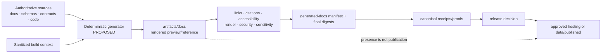

<!-- [KFM_META_BLOCK_V2]
doc_id: kfm://doc/artifacts-docs-readme
title: artifacts/docs/ — Generated Documentation Preview, Validation, and Publication-Handoff Boundary
type: readme; directory-readme; generated-docs-staging; preview-contract; compatibility-boundary; publication-handoff-index
version: v0.3
status: draft; repository-grounded; compatibility-root; transitional; readme-and-gitkeep-tracked; generated-output-not-surfaced; generated-output-ignore-rule-not-established; producer-not-established; manifest-not-established; site-generator-config-not-established; docs-build-workflow-todo-only; link-workflow-todo-only; citation-workflow-todo-only; deployment-not-established; reproducibility-unproven; release-binding-unestablished; non-authoritative
owners: OWNER_TBD — Docs steward · Documentation-build steward · API/reference steward · Accessibility steward · Security/privacy steward · Rights/sensitivity steward · Reproducibility steward · Receipt/proof steward · Release/publication steward · CI/hosting steward
created: 2026-05-20
updated: 2026-07-16
supersedes: v0.2 bounded generated-documentation output contract
policy_label: public-doc; artifacts; generated-docs; preview; static-site; api-reference; accessibility; link-integrity; citation-integrity; no-secrets; no-trust-authority; no-release-authority; correction-aware; rollback-aware
current_path: artifacts/docs/README.md
truth_posture: CONFIRMED target README and prior blob, Directory Rules classification of artifacts as a transitional compatibility root, root artifacts boundary, canonical docs/ responsibility, direct tracked README.md and .gitkeep, current docs/reports and data/published/reports boundaries, TODO-only docs-build/link-check/citation-validation workflows, root package and Makefile lacking an operational documentation-site build command, root gitignore lacking artifacts/docs or generated-site protection, bounded search surfacing no producer or consumer, and checked absence of docs-build-manifest.json, mkdocs.yml, and docusaurus.config.js / PROPOSED deterministic site/reference producer, immutable build manifest, source-to-output registry, stable URL and asset policy, generated-reference contract, no-network build profile, link/citation/accessibility/security validation, preview retention, CI artifact upload, deployment handoff, canonical receipt/proof/release binding, correction, withdrawal, supersession, and migration or retirement / CONFLICTED compatibility preview lane versus canonical generated narratives under docs/reports; generated PDF examples versus dedicated artifacts/build/pdf lane; preview archives versus artifacts/build/dist; tracked staging path versus no generated-output ignore rule; docs-build workflow names versus TODO-only behavior; and generated site convenience versus stale or accidentally authoritative copies / UNKNOWN untracked local outputs, CI-only sites, external documentation services, historical previews, GitHub Pages or other hosting configuration outside inspected files, actual generator versions, link health, citation health, accessibility status, reproducibility rate, secret scan state, active consumers, branch-protection significance, retention, deployment, and production use / NEEDS VERIFICATION accepted owners, CODEOWNERS, retain/migrate/retire decision, complete tracked inventory, generated-output commit policy, producer and consumer contracts, generator configuration, URL strategy, source-to-output mapping, manifest/schema homes, toolchain pins, no-network rules, link and citation policies, accessibility baseline, source-map policy, rights/sensitivity review, CI ownership, hosting target, release handoff, correction consumers, and rollback execution
evidence_snapshot:
  repository: bartytime4life/Kansas-Frontier-Matrix
  repository_id: "1059091169"
  visibility: public
  base_ref: main
  base_commit: 87c90c7034a0d6310a286d7ffd34b5c89cffabec
  target_prior_blob: 97dc5c4923674358ae275ef85e06a64b3cccb6cb
  confirmed_lane_files:
    - artifacts/docs/README.md
    - artifacts/docs/.gitkeep
  checked_absent_paths:
    - artifacts/docs/docs-build-manifest.json
    - mkdocs.yml
    - docusaurus.config.js
  execution_surfaces:
    - package.json
    - Makefile
    - .github/workflows/docs-build.yml
    - .github/workflows/link-check.yml
    - .github/workflows/citation-validation.yml
    - .gitignore
  bounded_inventory_note: tracked repository evidence cannot establish uncommitted generated sites, CI workspaces, external documentation services, historical build artifacts, release assets, object stores, hosting providers, or uninspected subprojects
related:
  - ../README.md
  - ../build/README.md
  - ../build/pdf/README.md
  - ../build/dist/README.md
  - ../qa/README.md
  - ../temporary/README.md
  - ../../docs/README.md
  - ../../docs/reports/README.md
  - ../../docs/doctrine/directory-rules.md
  - ../../data/published/README.md
  - ../../data/published/reports/README.md
  - ../../data/receipts/README.md
  - ../../data/proofs/README.md
  - ../../release/README.md
  - ../../package.json
  - ../../Makefile
  - ../../.github/workflows/docs-build.yml
  - ../../.github/workflows/link-check.yml
  - ../../.github/workflows/citation-validation.yml
  - ../../.gitignore
tags: [kfm, artifacts, docs, generated-docs, preview, static-site, api-reference, search-index, links, citations, accessibility, security, reproducibility, retention, publication-handoff, correction, rollback]
notes:
  - "v0.3 replaces blanket uncertainty and a proposed directory tree with a commit-pinned inventory and workflow maturity matrix."
  - "The direct lane has a tracked README and .gitkeep; no generated site, reference bundle, manifest, digest, producer, consumer, or deployment was established."
  - "The named documentation workflows are executable YAML files but their jobs only echo TODO messages."
  - "Generated PDFs route to artifacts/build/pdf/, preview archives route to artifacts/build/dist/, QA reports route to artifacts/qa/, and released report payloads route to data/published/reports/."
  - "The root .gitignore does not protect artifacts/docs from accidental generated-output commits."
  - "This revision changes documentation only."
[/KFM_META_BLOCK_V2] -->

<a id="top"></a>

# `artifacts/docs/` — Generated Documentation Preview, Validation, and Publication-Handoff Boundary

> **Purpose.** Stage rendered documentation previews and generated reference material without allowing generated HTML, search indexes, asset bundles, exported archives, workflow artifacts, or hosted previews to become authored doctrine, evidence, release approval, publication, or production truth.

<p>
  
  
  
  
  
  
</p>

**Quick navigation:** [Status](#status-and-evidence-boundary) · [Purpose](#purpose-and-audience) · [Authority](#authority-and-directory-rules-basis) · [Inventory](#confirmed-current-inventory) · [Routing](#documentation-lane-routing) · [Build model](#governed-generated-documentation-model) · [Inputs](#input-and-source-contract) · [Outputs](#accepted-output-classes) · [Manifest](#proposed-generated-docs-manifest) · [Determinism](#deterministic-build-contract) · [Links](#link-citation-and-search-integrity) · [Accessibility](#accessibility-render-and-browser-validation) · [Security](#security-privacy-rights-and-sensitivity) · [Lifecycle](#trust-release-and-publication-boundary) · [Operations](#producer-consumer-ci-and-retention-contracts) · [Validation](#validation-and-finite-outcomes) · [Correction](#correction-withdrawal-and-rollback) · [Review](#review-burden-and-change-control) · [Done](#definition-of-done) · [Plan](#smallest-sound-implementation-sequence) · [Open](#open-verification-register) · [Evidence](#evidence-ledger) · [Rollback](#documentation-correction-and-rollback)

---

## Status and evidence boundary

> [!IMPORTANT]
> **Snapshot:** `main@87c90c7034a0d6310a286d7ffd34b5c89cffabec`<br>
> **Prior README blob:** `97dc5c4923674358ae275ef85e06a64b3cccb6cb`<br>
> **Confirmed direct files:** `README.md`, `.gitkeep`<br>
> **Generated site, API reference, manifest, digest, producer, consumer, deployment:** not established<br>
> **`docs-build`, `link-check`, and `citation-validation`:** TODO-only workflow bodies<br>
> **Generated-output ignore protection:** not established

`artifacts/docs/` is a repository-confirmed compatibility path, but it is **not an operational documentation build or hosting system**.

### Safe conclusion

| Capability | Status | Evidence-bounded conclusion |
|---|---:|---|
| Boundary README | `CONFIRMED` | The human staging contract exists. |
| Directory retention marker | `CONFIRMED` | `.gitkeep` keeps the otherwise empty lane present. |
| Generated site or API reference | `NOT SURFACED` | No tracked payload was established. |
| Local or CI-only outputs | `UNKNOWN` | GitHub cannot enumerate uncommitted workspaces. |
| Site generator configuration | `NOT ESTABLISHED` | Checked `mkdocs.yml` and `docusaurus.config.js` are absent. |
| Docs producer | `NOT ESTABLISHED` | No accepted writer or build command surfaced. |
| Build manifest or digest | `NOT ESTABLISHED` | Checked manifest path is absent. |
| Docs build workflow | `TODO-ONLY` | Jobs only echo TODO messages. |
| Link checking | `TODO-ONLY` | Workflow does not execute a link checker. |
| Citation validation | `TODO-ONLY` | Workflow does not validate citations or abstention. |
| Deployment or preview hosting | `NOT ESTABLISHED` | No Pages/deploy action or hosting contract surfaced. |
| Generated-output ignore policy | `NOT ESTABLISHED` | Root ignore rules do not cover this lane. |
| Reproducibility | `UNKNOWN` | No independent rebuild comparison was verified. |
| Receipt/proof/release binding | `NOT ESTABLISHED` | No canonical record was linked to this lane. |
| Public or production use | `UNKNOWN` | A path or workflow name does not prove hosting. |

### Truth labels

| Label | Meaning in this README |
|---|---|
| `CONFIRMED` | Verified from current repository files, exact paths, or bounded search. |
| `PROPOSED` | A recommended contract, tool, format, path, or gate not established as current implementation. |
| `CONFLICTED` | Current files or documentation create incompatible expectations. |
| `UNKNOWN` | Not observable or not established from inspected evidence. |
| `NEEDS VERIFICATION` | Checkable, but not sufficiently proven for reliance, publication, or public claims. |
| `DENY` | A prohibited authority, security, rights, sensitivity, release, or publication interpretation. |

[Back to top](#top)

---

## Purpose and audience

This README governs generated documentation previews and reference outputs produced from authoritative inputs elsewhere.

It is intended for:

- documentation and build stewards;
- API/reference and schema documentation maintainers;
- link, citation, accessibility, browser, and render reviewers;
- CI, artifact-retention, and hosting maintainers;
- security, privacy, rights, and sensitivity reviewers;
- receipt, proof, release, correction, and rollback stewards;
- reviewers deciding whether generated material is safe to retain, preview, host, or publish;
- documentation maintainers correcting path, maturity, and workflow claims.

The durable question is:

> Can KFM render and inspect documentation without allowing a generated copy, search index, preview URL, workflow artifact, or hosted site to become the authority that its source and governed records must remain?

A correct render is always scoped. It may still be stale, incomplete, inaccessible, uncited, rights-restricted, sensitive, insecure, unreproducible, or unreleased.

[Back to top](#top)

---

## Authority and Directory Rules basis

Directory Rules classify `artifacts/` as a **transitional compatibility root** for derived, regenerable, non-authoritative material.

```text
docs/                                  authored human control plane
docs/reports/                          generated steward-facing narratives
schemas/ contracts/ code               generated-reference source authority
artifacts/docs/                        rendered preview and reference staging
artifacts/build/pdf/                   generated PDF byte staging
artifacts/build/dist/                  generated archive/package staging
artifacts/qa/                          validation and inspection reports
data/receipts/ and data/proofs/        canonical process memory and support
release/ and data/published/           governed decision and released payload
```

This lane may hold generated preview bytes. It must not become:

- a second `docs/` authority;
- a generated-report authority that competes with `docs/reports/`;
- a PDF or archive compatibility home that competes with `artifacts/build/`;
- a receipt, proof, release, catalog, registry, schema, contract, or policy home;
- a public download root merely because files can be served;
- a hosting configuration root;
- a place where stale generated copies silently outrank their sources.

### Responsibility map

| Responsibility | Authority home | Role here |
|---|---|---|
| Authored doctrine, ADRs, runbooks, architecture | `docs/` | Read-only source input. |
| Generated steward-facing narrative reports | `docs/reports/` | Canonical docs subtree; not mirrored here. |
| Schema, contract, code, API meaning | `schemas/`, `contracts/`, implementation roots | Source input for generated reference. |
| Rendered HTML/reference bytes | `artifacts/docs/` | Temporary non-authoritative staging. |
| PDF bytes | `artifacts/build/pdf/` | Dedicated PDF staging. |
| Preview archives | `artifacts/build/dist/` | Dedicated archive staging. |
| Link/accessibility/render reports | `artifacts/qa/` or canonical receipts | Inspection output, not staged docs. |
| Public report/document payloads | `data/published/reports/` or accepted published lane | Release-approved downstream carrier. |
| Release decisions | `release/` | Governs publication. |
| Receipts and proofs | `data/receipts/`, `data/proofs/` | Canonical support and process memory. |

[Back to top](#top)

---

## Confirmed current inventory

Bounded tracked evidence supports:

```text
artifacts/docs/
├── README.md
└── .gitkeep
```

Checked or searched but not established:

```text
artifacts/docs/docs-build-manifest.json
artifacts/docs/site/
artifacts/docs/api/
artifacts/docs/reference/
artifacts/docs/search/
artifacts/docs/assets/
mkdocs.yml
docusaurus.config.js
```

Relevant repository surfaces:

| Surface | Current state | Consequence |
|---|---|---|
| `.github/workflows/docs-build.yml` | TODO-only | Does not prove a site build or preview publication. |
| `.github/workflows/link-check.yml` | TODO-only | Does not prove links resolve. |
| `.github/workflows/citation-validation.yml` | TODO-only | Does not prove citations resolve or missing evidence causes abstention. |
| Root `package.json` | No operational docs-site build script established | No root docs producer. |
| Root `Makefile` | No docs-site target established | No repo-native docs command. |
| Root `.gitignore` | No `artifacts/docs/` protection | Generated output could be committed accidentally. |
| `docs/README.md` | Canonical human control plane | Authored docs remain authoritative there. |
| `docs/reports/README.md` | Generated read-only narratives under canonical docs | Report narratives do not route here. |
| `data/published/reports/README.md` | Released report payload lane | Public payloads require release state. |

> [!WARNING]
> The lane is not covered by an established generated-output ignore rule. Do not commit a rendered site, search index, source map, or asset tree merely because a generator wrote it here.

[Back to top](#top)

---

## Documentation lane routing

Use responsibility and lifecycle, not file extension alone.

| Material | Route | Why |
|---|---|---|
| Authored Markdown, ADR, doctrine, runbook, architecture | `docs/` | Human control-plane authority. |
| Generated steward-facing governance narrative | `docs/reports/` | Canonical generated docs subtree with claim anchors. |
| Rendered static site preview | `artifacts/docs/` | Derived preview bytes. |
| Generated API/reference HTML or JSON | `artifacts/docs/` | Derived from canonical contracts/schemas/code. |
| Search index and generated static assets | `artifacts/docs/` | Site-support output only. |
| Generated PDF | `artifacts/build/pdf/` | Dedicated PDF conformance and accessibility lane. |
| Preview ZIP or tarball | `artifacts/build/dist/` | Dedicated archive/distribution lane. |
| Link, accessibility, render, or browser report | `artifacts/qa/` or canonical receipt | Inspection output. |
| Released public report/document payload | `data/published/reports/` or accepted published lane | Governed publication. |
| Build, validation, or publication receipt | `data/receipts/` | Canonical process memory. |
| EvidenceBundle or attestation | `data/proofs/` | Canonical support. |
| ReleaseManifest, CorrectionNotice, RollbackCard | `release/` | Governed decision and reversibility. |

### Denied routing shortcuts

- Do not place generated PDFs under `artifacts/docs/pdf/`; use `artifacts/build/pdf/`.
- Do not place preview archives under `artifacts/docs/`; use `artifacts/build/dist/`.
- Do not move generated governance reports from `docs/reports/` into this compatibility lane.
- Do not publish directly from this path without a governed release handoff.
- Do not copy authored Markdown here to make a preview self-contained when the build can reference source paths.
- Do not treat a deployed preview URL as the canonical documentation URL unless release state explicitly establishes it.

[Back to top](#top)

---

## Governed generated-documentation model



Required separation:

1. **Source identity** — the authoritative paths and source commit.
2. **Generator identity** — implementation, configuration, dependencies, and environment.
3. **Output identity** — exact generated files and final digests.
4. **Validation identity** — link, citation, accessibility, browser, security, and sensitivity results.
5. **Release identity** — approval, destination, public URL, correction path, and rollback target.

None may be inferred from another.

[Back to top](#top)

---

## Input and source contract

A build input set should identify:

- source repository and clean source `git_sha`;
- source paths or declared source set;
- source status and review state;
- generator path and version;
- generator configuration path and digest;
- dependency lockfile or container digest;
- sanitized build-context reference;
- intended base URL, route prefix, locale, and output profile;
- explicit include and exclude rules;
- policy, rights, sensitivity, and redaction inputs where content exposure matters;
- network posture and any approved vendored dependencies.

### Input rules

- Build from reviewed source, not editor buffers or uncommitted files.
- Fail or label the result when the source tree is dirty.
- Do not fetch mutable remote content during a release-significant build.
- Resolve generated API references from versioned schemas, contracts, or source code.
- Preserve source-to-page traceability.
- Exclude quarantined, restricted, internal-only, or unpublished source unless the preview is access-controlled and policy-approved.
- Record every exclusion that materially changes the rendered documentation.
- Do not infer publication readiness from source location alone.

[Back to top](#top)

---

## Accepted output classes

| Output class | Accepted examples | Required posture |
|---|---|---|
| Static site tree | HTML, CSS, client JavaScript, images, fonts | Generated preview only. |
| Generated API/reference pages | HTML/JSON derived from schemas, contracts, OpenAPI, or code | Source authority remains upstream. |
| Search index | Token index, page index, citation index for preview | Versioned with the same build. |
| Generated navigation | Sidebar, sitemap, route map | Derived and source-linked. |
| Static assets | Bundled styles, scripts, icons, images | License, integrity, and sensitivity reviewed. |
| Preview metadata | Build id, source ref, route profile, manifest pointer | Non-authoritative and non-secret. |
| Browser-render snapshots | Visual smoke screenshots when needed | Prefer `artifacts/qa/` for review artifacts. |

### Outputs routed elsewhere

| Output | Correct lane |
|---|---|
| PDF export | `artifacts/build/pdf/` |
| Site archive, ZIP, tarball | `artifacts/build/dist/` |
| Link, citation, accessibility, visual-diff, Lighthouse-like report | `artifacts/qa/` or canonical receipt |
| Public report/document payload | `data/published/reports/` |
| Receipt, proof, release decision, correction, rollback record | Canonical trust/release home |

Every retained output must be explainable as generated, regenerable, source-linked, and non-authoritative.

[Back to top](#top)

---

## Proposed generated-docs manifest

A parent manifest is `PROPOSED`; none is established in the inspected repository.

```json
{
  "schema_version": "PROPOSED",
  "build_id": "immutable-run-id",
  "source": {
    "git_sha": "40-hex",
    "dirty": false,
    "paths": ["docs/", "schemas/", "contracts/"]
  },
  "generator": {
    "name": "PROPOSED",
    "version": "PROPOSED",
    "config_path": "PROPOSED",
    "config_sha256": "64-hex",
    "environment_ref": "artifacts/build/env/<snapshot>.json"
  },
  "profile": {
    "base_url": "/",
    "locale": "C.UTF-8",
    "timezone": "UTC",
    "network": "deny",
    "source_date_epoch": 0
  },
  "outputs": [
    {
      "path": "site/index.html",
      "media_type": "text/html",
      "sha256": "64-hex",
      "bytes": 0
    }
  ],
  "validation_refs": [],
  "receipt_refs": [],
  "release_refs": [],
  "status": "PREVIEW"
}
```

### Manifest requirements

- schema version and immutable build id;
- exact source commit and dirty-tree state;
- nonempty source and output inventories;
- generator implementation, version, configuration, and environment reference;
- deterministic profile and base URL;
- output-relative paths, media types, byte counts, and final digests;
- validation references;
- canonical receipt/proof/release references when they exist;
- finite status;
- no secrets, credentials, private filesystem paths, or deployment tokens.

An empty output list is not a successful build.

[Back to top](#top)

---

## Deterministic build contract

A reproducibility claim requires two independent builds from the same declared inputs.

Normalize or pin:

| Dimension | Required control |
|---|---|
| Source time | Derive from source state; avoid wall-clock output. |
| Locale and timezone | Pin explicitly. |
| File ordering | Stable lexical or declared order. |
| Navigation and route IDs | Deterministic generation. |
| Base URL and path prefix | Explicit build input. |
| Asset filenames | Content-addressed or deterministic. |
| Search index | Stable tokenizer, version, and ordering. |
| Minifier/bundler | Pinned version and deterministic options. |
| Generated metadata | Remove or normalize timestamps, hostnames, user names, and absolute paths. |
| Randomness | Disabled or seeded and recorded. |
| Parallelism | Stable output or controlled. |
| Fonts and icons | Vendored or digest-pinned where allowed. |
| External resources | Vendored or explicitly approved and integrity-pinned. |
| Network | Deny by default for release-significant builds. |

### Rebuild outcomes

| Outcome | Meaning |
|---|---|
| `BYTE_IDENTICAL` | Complete output inventories and every byte digest match. |
| `NORMALIZED_EQUIVALENT` | Declared nondeterminism was normalized and differences are explained. |
| `DIFFERENT` | Reproducibility failed. |
| `INCOMPLETE` | One build lacks expected outputs or validation evidence. |
| `ERROR` | Comparison could not complete. |

A build cannot compare itself with itself and call that reproducibility.

[Back to top](#top)

---

## Link, citation, and search integrity

Workflow names do not prove integrity. The current link and citation workflows only echo TODO messages.

### Link validation should cover

- internal relative links;
- generated route links;
- heading anchors;
- image, stylesheet, script, font, and download references;
- redirects and base-path handling;
- case sensitivity;
- fragment identifiers;
- orphan pages and unreachable routes;
- excluded pages that remain linked;
- external URLs under an explicit network and retry policy.

### Citation validation should cover

- citation identifiers resolve to authoritative records;
- generated pages preserve source citation context;
- missing evidence produces `ABSTAIN`, `HOLD`, or a visible incomplete state;
- citations do not resolve only to another generated summary;
- restricted evidence is not exposed through generated indexes;
- citation indexes are bound to the same source and build identity;
- stale citations are invalidated when sources or release state change.

### Search-index validation should cover

- every indexed page belongs to the current output inventory;
- excluded or restricted pages are absent;
- snippets do not expose protected details;
- routes resolve under the declared base URL;
- tokenizer and language settings are declared;
- stale index entries fail validation;
- index generation is deterministic or differences are explained.

[Back to top](#top)

---

## Accessibility, render, and browser validation

A successful file generation is not a successful documentation experience.

### Minimum automated checks

- valid document language;
- one logical page title;
- ordered heading hierarchy;
- landmarks and navigation labels;
- keyboard-reachable controls;
- visible focus;
- meaningful alternative text;
- form labels where present;
- sufficient contrast;
- responsive layout and reflow;
- no inaccessible generated tables without remediation;
- no autoplay or motion without controls;
- semantic link text;
- accessible error and abstention states.

### Manual review where material

- screen-reader reading order;
- navigation comprehension;
- keyboard-only completion;
- zoom and reflow;
- diagrams, maps, formulas, and code samples;
- generated API-reference usability;
- sensitive-content warnings and access labels;
- mobile and narrow viewport behavior.

### Render and browser checks

- clean build from a fresh workspace;
- supported browser matrix;
- no console errors that affect use;
- no broken assets;
- stable route behavior under the declared base path;
- visual-diff review for consequential layout changes;
- offline or denied-network behavior when promised;
- print behavior only when explicitly supported.

Accessibility reports belong in `artifacts/qa/` or canonical receipt homes, not mixed into the generated site as authority.

[Back to top](#top)

---

## Security, privacy, rights, and sensitivity

Generated documentation can leak more than authored Markdown because builds may include source maps, indexes, caches, absolute paths, environment data, and hidden assets.

### Denied content

- credentials, tokens, cookies, private keys, or session values;
- `.env` contents;
- user-home or runner paths;
- internal hostnames, private endpoints, or unpublished URLs;
- source maps containing protected source;
- unpublished drafts or quarantined pages;
- restricted coordinates or precise sensitive locations;
- living-person or consent-restricted details;
- rights-unclear images, fonts, icons, or code;
- private issue, PR, log, or build metadata;
- deployment credentials or hosting configuration secrets.

### Required controls

- allowlist environment fields; never dump ambient environment;
- scan both names and values for secrets;
- scan generated HTML, JSON, JavaScript, source maps, and indexes;
- strip or normalize absolute paths and host identifiers;
- inventory third-party assets and licenses;
- pin or vendor external assets under an accepted policy;
- check HTML injection, unsafe templating, and unescaped generated content;
- deny active mixed content and unexpected remote script execution;
- verify redaction before indexing;
- apply policy and sensitivity checks before preview sharing or publication;
- record approved exceptions with scope and expiry.

A public repository path does not make generated content public-safe.

[Back to top](#top)

---

## Trust, release, and publication boundary

```text
SOURCE / CONTRACT / SCHEMA / CODE
              |
              v
    GENERATED PREVIEW CANDIDATE
              |
              v
LINK + CITATION + ACCESSIBILITY + SECURITY + RIGHTS CHECKS
              |
              v
 FINAL OUTPUT INVENTORY + DIGESTS
              |
              v
  CANONICAL RECEIPTS / PROOFS / REVIEW
              |
              v
        RELEASE DECISION
              |
              v
 APPROVED HOSTING OR DATA/PUBLISHED
```

### What staging proves

At most, a staging copy may prove that a generator produced bytes at a particular path.

It does not prove:

- source authority;
- citation closure;
- evidence sufficiency;
- accessibility;
- rights clearance;
- policy approval;
- release approval;
- publication;
- hosting correctness;
- production freshness.

### Public handoff requirements

Before a generated site or document is treated as public:

- exact source and output identity;
- final digests;
- complete output inventory;
- link, citation, accessibility, security, rights, and sensitivity results;
- canonical receipt/proof references;
- review state;
- release decision;
- approved hosting destination and immutable release reference;
- correction contact and procedure;
- rollback or withdrawal target;
- supersession policy;
- cache and search-index invalidation plan.

A preview URL must be visibly labeled and access-controlled where needed.

[Back to top](#top)

---

## Producer, consumer, CI, and retention contracts

### Producer contract

A future producer should:

1. validate clean source identity;
2. resolve a closed source set;
3. pin generator, configuration, dependencies, and environment;
4. run under a declared network policy;
5. write only to a run-scoped staging directory;
6. emit a nonempty output inventory;
7. generate final digests after all transformations;
8. run link, citation, accessibility, render, security, rights, and sensitivity checks;
9. emit finite results;
10. create canonical receipts when material;
11. avoid committing generated output unless an explicit retention decision allows it;
12. clean temporary state on failure.

### Consumer contract

A preview, hosting, or release consumer should require:

- accepted producer identity;
- manifest and schema version;
- source and output digests;
- validation outcome;
- policy and review state;
- destination and retention class;
- receipt/proof/release references where required;
- expiry for previews;
- correction, withdrawal, and rollback handling.

Consumers must reject path-only, branch-only, filename-only, or “latest” references without immutable identity.

### Current CI boundary

Current repository evidence establishes only TODO-only workflow bodies for:

- documentation build;
- preview publication;
- link checking;
- citation resolution;
- abstention on missing evidence.

Therefore, no workflow is presently documented here as an enforcement gate for this lane.

### Proposed CI sequence

```text
checkout pinned source
  -> install pinned generator dependencies
  -> deny or constrain network
  -> build into run-scoped output
  -> validate nonempty inventory
  -> scan links and citations
  -> run accessibility and browser checks
  -> scan secrets, paths, rights, and sensitivity
  -> rebuild independently
  -> compare outputs
  -> emit manifest and QA/receipt references
  -> upload expiring CI artifact
  -> release/deploy only through a separate governed job
```

### Retention classes

| Class | Intended use | Posture |
|---|---|---|
| Local scratch | Developer preview | Untracked; delete freely. |
| PR preview | Review convenience | Access-controlled where needed; short expiry. |
| CI evidence attachment | Reproducibility or debugging | Digest-bound; finite retention. |
| Release candidate | Pre-publication review | Immutable, review-bound, not public. |
| Published artifact | Approved public delivery | Lives in accepted hosting or published lane, not here by implication. |

The tracked default should remain README and `.gitkeep` unless an accepted change establishes otherwise.

[Back to top](#top)

---

## Validation and finite outcomes

### Minimum checks

| Check | Required assertion |
|---|---|
| Inventory | Output set is nonempty and matches the manifest. |
| Source mapping | Every page or bundle maps to authoritative input. |
| Generator identity | Implementation, config, dependencies, and environment are pinned. |
| Determinism | Independent builds are compared. |
| Links | Internal, asset, anchor, and route links resolve. |
| Citations | Consequential claims resolve or visibly abstain. |
| Accessibility | Automated checks pass and required manual review is recorded. |
| Browser/render | Declared browser and base-path behavior works. |
| Security | No secrets, unsafe active content, private paths, or unapproved remote dependencies. |
| Rights | Assets and generated excerpts have accepted rights/attribution. |
| Sensitivity | Restricted content is excluded, generalized, or access-controlled. |
| Trust boundary | No receipt, proof, release decision, or authored authority is stored here. |
| Publication | Hosting or published-copy handoff is release-bound. |
| Correction | Invalidation, supersession, and rollback targets are recorded. |

### Finite outcomes

| Outcome | Meaning |
|---|---|
| `PASS_PREVIEW` | Suitable for bounded preview only. |
| `PASS_RELEASE_CANDIDATE` | Validation complete enough for release review; not yet published. |
| `HOLD` | Evidence, accessibility, rights, sensitivity, or review is incomplete. |
| `DENY` | Prohibited content, authority collapse, unsafe exposure, or policy failure. |
| `FAIL_REPRODUCIBILITY` | Independent builds differ without an accepted explanation. |
| `FAIL_LINKS` | Required routes, assets, or anchors do not resolve. |
| `FAIL_CITATIONS` | Consequential citations do not resolve. |
| `FAIL_ACCESSIBILITY` | Required accessibility baseline is not met. |
| `ERROR` | Build or validation could not complete. |

No output, skipped checks, or an empty site is not `PASS`.

[Back to top](#top)

---

## Correction, withdrawal, and rollback

Generated documentation can become stale immediately after source, policy, evidence, or release state changes.

### Correction triggers

- source correction or supersession;
- citation invalidation;
- evidence withdrawal;
- rights or consent change;
- sensitivity reclassification;
- broken or redirected routes;
- accessibility defect;
- security issue;
- generator or dependency compromise;
- incomplete or wrong output inventory;
- stale search index;
- release withdrawal or rollback.

### Required response

1. identify affected source and output digests;
2. stop or restrict preview/public access where risk requires;
3. record the reason and affected scope;
4. invalidate caches, search indexes, and “latest” pointers;
5. rebuild from corrected authoritative inputs;
6. rerun all required validation;
7. issue canonical correction or withdrawal records where material;
8. update the release or hosting reference;
9. preserve supersession lineage;
10. verify rollback or removal completion.

Deleting this staging directory is not a public rollback if copies remain hosted elsewhere.

[Back to top](#top)

---

## Review burden and change control

| Change | Minimum review |
|---|---|
| README clarification | Docs steward. |
| Generator or configuration change | Docs-build owner + affected source owner. |
| Route/base-URL change | Docs-build + hosting/deployment owner. |
| Link/citation policy change | Docs + evidence/provenance reviewer. |
| Accessibility baseline change | Accessibility steward. |
| Security, source-map, or external-asset change | Security/privacy + rights reviewer. |
| Sensitivity or access change | Policy/sensitivity steward. |
| Retention or commit policy change | CI/artifacts + repository steward. |
| Public hosting or release handoff | Release authority + security/rights/accessibility review. |
| Root retention, migration, or retirement | ADR or accepted migration record where required. |

Material behavior changes should update the producer, config, schemas/contracts, validators, tests, workflows, runbooks, and this README in the same change or explain the staged sequence.

[Back to top](#top)

---

## Definition of done

This lane is not operationally complete until all applicable items are satisfied.

- [ ] Owners and CODEOWNERS are accepted.
- [ ] Retain, migrate, externalize, or retire decision is recorded.
- [ ] Generated-output commit and ignore policy is accepted.
- [ ] Producer and configuration are versioned.
- [ ] Manifest meaning and schema are accepted.
- [ ] Source-to-output mapping is complete.
- [ ] Build environment and dependency pins are captured.
- [ ] Base URL, routing, locale, and network policy are explicit.
- [ ] Output inventory is nonempty and digest-bound.
- [ ] Independent rebuild comparison is implemented.
- [ ] Link and anchor validation is executable.
- [ ] Citation resolution and abstention behavior are executable.
- [ ] Search-index validation is executable.
- [ ] Accessibility automation and manual-review criteria are accepted.
- [ ] Browser/render matrix is accepted.
- [ ] Secret, private-path, source-map, active-content, and dependency scanning is executable.
- [ ] Rights, attribution, policy, and sensitivity checks are executable.
- [ ] Preview access and expiry are enforced.
- [ ] QA reports route to their owning lane.
- [ ] Receipts/proofs route to canonical homes.
- [ ] Release/hosting handoff is immutable and review-bound.
- [ ] Correction, cache invalidation, withdrawal, and rollback are tested.
- [ ] Empty, skipped, or stale builds fail closed.
- [ ] Documentation reflects actual behavior.
- [ ] Human review is complete.

[Back to top](#top)

---

## Smallest sound implementation sequence

### Phase 1 — Decide lane posture

- accept owners;
- decide tracked versus ignored generated outputs;
- decide retain, externalize, migrate, or retire;
- define preview access and retention.

### Phase 2 — Define contracts

- define generated-docs manifest meaning;
- add schema and examples in their authority homes;
- define source-to-output and route identity;
- define finite validation outcomes.

### Phase 3 — Implement producer

- add one repo-native docs build command;
- pin generator, config, dependencies, and environment;
- build into a run-scoped directory;
- emit nonempty inventory and final digests.

### Phase 4 — Add validation

- link, anchor, route, and asset checks;
- citation closure and abstention;
- search-index integrity;
- accessibility automation and manual review;
- browser/render smoke;
- secret, path, source-map, rights, and sensitivity checks.

### Phase 5 — Prove reproducibility

- run two isolated builds;
- compare complete inventories and bytes;
- emit structured comparison results;
- fail on unexplained drift.

### Phase 6 — Wire CI and previews

- path-filter relevant changes;
- upload expiring preview artifacts;
- label previews clearly;
- deny public deployment from unreviewed branches;
- record validation and retention metadata.

### Phase 7 — Govern publication and correction

- bind candidate digests to canonical receipts/proofs;
- require release review;
- deploy only to an approved immutable destination;
- test correction, cache invalidation, withdrawal, and rollback;
- update runbooks and maturity labels.

[Back to top](#top)

---

## Open verification register

| ID | Item | Status | Why it matters |
|---|---|---:|---|
| DOCS-01 | Confirm owners and CODEOWNERS | `NEEDS VERIFICATION` | Establishes review authority. |
| DOCS-02 | Decide retain, migrate, externalize, or retire | `OPEN` | Compatibility-root disposition is unresolved. |
| DOCS-03 | Confirm complete tracked inventory | `NEEDS VERIFICATION` | Prevents missing hidden or branch-local files. |
| DOCS-04 | Accept generated-output commit/ignore policy | `OPEN` | Prevents repository bloat and accidental authority. |
| DOCS-05 | Select generator and configuration home | `OPEN` | Required for an executable build. |
| DOCS-06 | Define source set and exclusion rules | `OPEN` | Prevents incomplete or sensitive builds. |
| DOCS-07 | Define route and base-URL identity | `OPEN` | Required for stable links and hosting. |
| DOCS-08 | Define manifest contract and schema home | `OPEN` | Required for machine-verifiable inventory. |
| DOCS-09 | Pin dependencies and environment | `OPEN` | Required for reproducibility. |
| DOCS-10 | Define no-network and external-asset policy | `OPEN` | Reduces mutable and unsafe inputs. |
| DOCS-11 | Implement nonempty-output validation | `OPEN` | Prevents vacuous success. |
| DOCS-12 | Implement link/anchor/route checking | `OPEN` | Required for usable previews. |
| DOCS-13 | Implement citation closure and abstention | `OPEN` | Preserves evidence-first posture. |
| DOCS-14 | Implement search-index integrity checks | `OPEN` | Prevents stale or restricted results. |
| DOCS-15 | Accept accessibility baseline | `OPEN` | Required for equitable access. |
| DOCS-16 | Define browser/render matrix | `OPEN` | Required for reliable presentation. |
| DOCS-17 | Implement secret and private-path scanning | `OPEN` | Prevents repository and preview leakage. |
| DOCS-18 | Define source-map and active-content policy | `OPEN` | Prevents unintended source or script exposure. |
| DOCS-19 | Implement rights and attribution review | `OPEN` | Required for fonts, images, icons, and excerpts. |
| DOCS-20 | Implement sensitivity and redaction checks | `OPEN` | Prevents protected-detail exposure. |
| DOCS-21 | Implement independent rebuild comparison | `OPEN` | Required for reproducibility claims. |
| DOCS-22 | Define preview access and expiry | `OPEN` | Prevents stale semi-public copies. |
| DOCS-23 | Define CI ownership and required-check significance | `UNKNOWN` | Workflow presence is not branch protection. |
| DOCS-24 | Define QA report routing | `OPEN` | Prevents validation output from becoming site authority. |
| DOCS-25 | Define canonical receipt/proof references | `OPEN` | Required for governed support. |
| DOCS-26 | Define hosting or published-copy destination | `OPEN` | Required before publication claims. |
| DOCS-27 | Define immutable release URL strategy | `OPEN` | Avoids mutable “latest” authority. |
| DOCS-28 | Define cache and search-index invalidation | `OPEN` | Required for correction. |
| DOCS-29 | Test withdrawal and rollback | `OPEN` | Required for reversibility. |
| DOCS-30 | Confirm external builders or hosting services | `UNKNOWN` | Repository evidence may be incomplete. |
| DOCS-31 | Confirm current public or production consumers | `UNKNOWN` | Prevents unsupported operational claims. |
| DOCS-32 | Reconcile root artifacts README maturity | `NEEDS VERIFICATION` | Parent documentation remains older. |

[Back to top](#top)

---

## Evidence ledger

| Evidence | Verified observation | Limit |
|---|---|---|
| `artifacts/docs/README.md` | Prior v0.2 boundary exists. | Prior implementation inventory was mostly unknown. |
| `artifacts/docs/.gitkeep` | Empty retention marker exists. | Does not prove generated output. |
| `artifacts/README.md` | `artifacts/docs/` is a transitional generated-output lane. | Parent README is itself partly stale. |
| `docs/README.md` | `docs/` is the canonical human control plane. | Does not enumerate every generated-doc behavior. |
| `docs/reports/README.md` | Generated steward-facing reports belong under canonical `docs/`. | Placement and generator maturity remain mixed. |
| `data/published/README.md` | Published artifacts are release-approved downstream carriers. | Payload presence and release readiness are separate questions. |
| `data/published/reports/README.md` | Released report payloads have a dedicated lane. | Actual payloads and enforcement remain uncertain. |
| `docs-build.yml` | Workflow exists but only echoes TODO. | No site build or deployment evidence. |
| `link-check.yml` | Workflow exists but only echoes TODO. | No link-health evidence. |
| `citation-validation.yml` | Workflow exists but only echoes TODO. | No citation or abstention evidence. |
| `package.json` | No operational root docs build surfaced. | Subprojects or external builders may exist. |
| `Makefile` | No docs-site target surfaced. | External commands remain possible. |
| `.gitignore` | No generated-docs protection for this lane. | Global/user excludes and untracked workspaces are not observable. |
| Candidate exact-path checks | Manifest and common generator configs were absent. | Alternative names may exist. |
| Bounded repository search | No direct producer, consumer, Pages deploy, or generated payload surfaced. | Search is not a complete filesystem listing. |

### No-loss assessment

The prior README correctly established:

- generated documentation only;
- authored documentation remains under `docs/`;
- staging is non-authoritative;
- receipts, proofs, release records, and published artifacts live elsewhere;
- source refs, tool versions, digests, validation, retention, correction, and rollback matter;
- presence in `artifacts/docs/` does not prove publication.

This revision preserves those rules, removes the ambiguous `artifacts/docs/pdf/` routing, verifies the tracked README and `.gitkeep`, records workflow stubs, and adds build, link, citation, accessibility, security, retention, publication, and correction contracts.

[Back to top](#top)

---

## Documentation correction and rollback

This change is documentation-only.

Before merge:

- close the draft pull request; or
- restore prior blob `97dc5c4923674358ae275ef85e06a64b3cccb6cb` in a transparent follow-up commit.

After merge:

- revert the documentation commit; or
- publish a corrective repository-grounded revision with updated evidence.

No generated site, source document, data, receipt, proof, release, hosting, deployment, or production rollback is required for this README-only update.

---

`artifacts/docs/` may stage generated previews. It never becomes documentation authority by rendering, retention, workflow status, URL availability, or file presence alone.

<p align="right"><a href="#top">Back to top</a></p>
