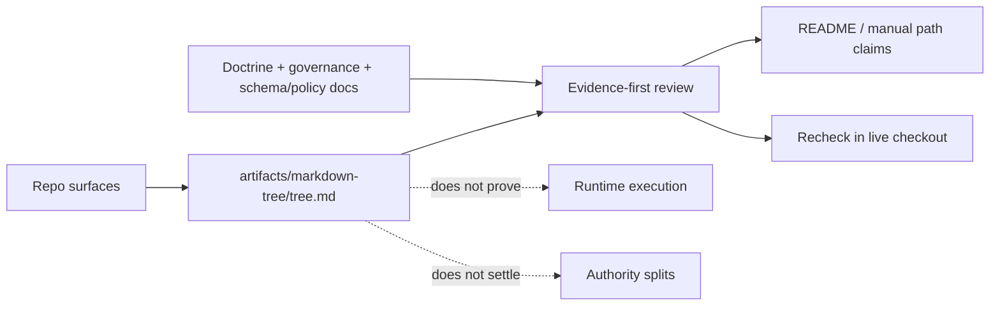

<!-- [KFM_META_BLOCK_V2]
doc_id: kfm://doc/TODO-NEEDS-UUID
title: artifacts/markdown-tree/
type: standard
version: v1
status: draft
owners: TODO-NEEDS-VERIFICATION
created: TODO(verify-created-date)
updated: TODO(verify-updated-date)
policy_label: TODO-NEEDS-VERIFICATION
related: [./tree.md, ../../README.md, ../../docs/architecture/system_overview.md, ../../docs/governance/ROOT_GOVERNANCE.md, ../../schemas/README.md, ../../policy/README.md]
tags: [kfm, artifacts, markdown-tree, evidence, inventory, readme]
notes: [This README treats tree snapshots as bounded repo-surface evidence, not as runtime proof. tree.md is directly evidenced in the attached KFM manuals; broader lane behavior, ownership, and refresh mechanics still need branch verification.]
[/KFM_META_BLOCK_V2] -->

<a id="top"></a>

# artifacts/markdown-tree/

Read-only Markdown tree inventory guidance for the KFM artifact surface that supports “what exists” evidence without pretending to prove what runs.


> [!IMPORTANT]
> **Status:** experimental  
> **Owners:** `TODO-NEEDS-VERIFICATION`  
> **Path:** `artifacts/markdown-tree/README.md`  
> **Repo fit:** artifact-facing child lane under `artifacts/`; supports repo-surface inspection and evidence-first documentation work; doctrinal authority stays upstream in [`../../README.md`](../../README.md), [`../../docs/architecture/system_overview.md`](../../docs/architecture/system_overview.md), [`../../docs/governance/ROOT_GOVERNANCE.md`](../../docs/governance/ROOT_GOVERNANCE.md), [`../../schemas/README.md`](../../schemas/README.md), and [`../../policy/README.md`](../../policy/README.md)  
> **Accepted inputs:** deterministic tree snapshots, inventory notes, bounded comparison artifacts, and review material about path drift or documentation-surface changes  
> **Exclusions:** doctrine, schema-home authority, policy law, runtime proof, release manifests, and local branch-only state presented as public-tree fact  
> **Quick jumps:** [Scope](#scope) · [Repo fit](#repo-fit) · [Accepted inputs](#accepted-inputs) · [Exclusions](#exclusions) · [Directory tree](#directory-tree) · [Quickstart](#quickstart) · [Usage](#usage) · [Diagram](#diagram) · [Reference tables](#reference-tables) · [Task list](#task-list--definition-of-done) · [FAQ](#faq) · [Appendix](#appendix)

> [!TIP]
> The confirmed center of gravity for this lane is [`./tree.md`](./tree.md): in the attached KFM manuals it is used as repo-tree evidence for “what exists,” especially lane and document-surface enumeration.

> [!CAUTION]
> This lane is evidence support, not implementation proof. A path appearing in `tree.md` can support an existence claim, but it does **not** prove runtime behavior, merge-blocking CI, release wiring, or settled authority seams.

---

## Scope

`artifacts/markdown-tree/` is the KFM artifact lane for read-only tree captures that help maintainers answer one narrow but important question:

**What repo surfaces are visibly present right now?**

That makes this lane useful for evidence-first documentation, source-authority mapping, and path-drift review. It should stay narrow on purpose.

### What this README is for

This file helps maintainers do four things quickly:

1. understand what belongs in `artifacts/markdown-tree/`
2. keep **presence evidence** separate from **doctrine**, **policy**, **contracts**, and **runtime proof**
3. use `tree.md` as bounded support for repo-surface claims without upgrading it into implementation mythology
4. extend or refresh the lane without weakening KFM’s truth posture

### Truth labels used here

| Label | Meaning in this file |
| --- | --- |
| **CONFIRMED** | Directly supported by the attached KFM manuals or adjacent repo-native Markdown surfaced in this session |
| **INFERRED** | Conservative completion of this lane’s role that fits the stronger source base but is not directly proven in a mounted checkout |
| **PROPOSED** | Recommended shape or operating rule for this lane |
| **UNKNOWN** | Not verified strongly enough in the current session |
| **NEEDS VERIFICATION** | Explicit recheck item before merge or rollout |

### Current evidence snapshot

| Surface | Status | Why it matters |
| --- | --- | --- |
| [`./tree.md`](./tree.md) | **CONFIRMED** | Attached manuals explicitly treat it as repo-tree evidence for “what exists” |
| `artifacts/markdown-tree/` as an artifact support lane | **INFERRED** | The artifact path is named; the broader lane contract still benefits from an explicit README |
| `README.md` in this directory | **PROPOSED until merged** | Adds a boundary doc so the tree artifact does not silently become doctrine or runtime proof |
| Tree generator, refresh cadence, CI wiring, or auto-build path | **UNKNOWN / NEEDS VERIFICATION** | Not directly surfaced in the current session |
| Deeper child inventory beyond `tree.md` | **UNKNOWN / NEEDS VERIFICATION** | No mounted checkout or line-by-line tree artifact content was directly available here |

[Back to top](#top)

---

## Repo fit

This lane sits downstream of doctrine and upstream of review work.

It is best read as a **supporting evidence surface**: useful because it is limited.

| Direction | Surface | Why it matters |
| --- | --- | --- |
| Upstream identity | [`../../README.md`](../../README.md) | Root project posture defines KFM as map-first, time-aware, evidence-first, and trust-visible |
| Upstream architecture bridge | [`../../docs/architecture/system_overview.md`](../../docs/architecture/system_overview.md) | Path presence must not be misread as proof of already-working runtime surfaces |
| Upstream governance law | [`../../docs/governance/ROOT_GOVERNANCE.md`](../../docs/governance/ROOT_GOVERNANCE.md) | Review triggers, trust-law posture, and fail-closed reading stay upstream of artifact inventory |
| Upstream schema boundary | [`../../schemas/README.md`](../../schemas/README.md) | Tree evidence must not settle schema-home authority by inertia |
| Upstream policy boundary | [`../../policy/README.md`](../../policy/README.md) | Policy remains executable truth for allow/deny/review logic |
| Current artifact center | [`./tree.md`](./tree.md) | The actual inventory artifact this README exists to interpret and bound |
| Typical downstream consumers | repo-facing manuals, boundary READMEs, and review notes | These consumers may cite the tree artifact for “what exists” evidence, but must still label unknowns honestly |

### Boundary rule

Use `artifacts/markdown-tree/` when the main job is to:

- inventory visible repo surfaces
- preserve a reviewable tree snapshot
- support evidence-first README or manual work
- compare one documented tree surface against another
- make path claims inspectable before they become prose

Do **not** use this lane when the main job is to:

- define doctrine or project identity
- settle schema-home or contract-home authority
- store release manifests, proof packs, or signed attestations
- prove runtime routes, CI enforcement, or deployment state
- turn a generated tree into the sovereign truth of the repo

[Back to top](#top)

---

## Accepted inputs

Use this lane for small, reviewable, read-only inventory artifacts.

| Input class | What belongs here | Why |
| --- | --- | --- |
| Tree snapshots | Deterministic path listings such as `tree.md` | Supports “what exists” evidence without inventing runtime meaning |
| Inventory notes | Short capture notes about scope, exclusions, or snapshot semantics | Prevents tree files from becoming context-free blobs |
| Bounded diff artifacts | Small comparisons between two tree snapshots | Helps reviewers see path drift without changing truth authority |
| Review-facing path checks | Notes about mismatches between artifact inventory and README claims | Keeps evidence and prose aligned |
| Public-safe helper outputs | Human-readable summaries of path presence | Useful for documentation review if they remain subordinate to the raw inventory |

### Reading rule for accepted inputs

Accepted inputs should remain:

- deterministic enough to compare
- small enough to review
- scoped enough to avoid pretending they are full runtime evidence
- explicit about what they exclude

[Back to top](#top)

---

## Exclusions

The following do **not** belong here as sovereign truth or as the normal public path:

| Does **not** belong here | Put it here instead | Why |
| --- | --- | --- |
| Project doctrine, truth labels, or public promise language | root and architecture/governance docs | This lane supports evidence; it does not define identity |
| Canonical contracts, schemas, or vocabularies | repo schema / contract authority surfaces | Inventory is not machine-law authority |
| Policy bundles, deny/allow reason registries, or decision logic | policy lane | Presence evidence and decision law must stay separate |
| Emitted runtime receipts, release proof packs, manifests, or attestation bundles | governed data / proof lanes | Tree artifacts are not runtime proof |
| Local-only branch inventory presented as current public truth | branch review notes or explicit comparison artifacts | Prevents accidental overclaiming |
| Dashboard, log, test-run, or deployment screenshots used as if they prove current execution | explicit runtime evidence surfaces | A file listing cannot substitute for execution proof |
| Silent authority settlement by path frequency | review ADR / governance decision | Repetition does not resolve contradictions |

> [!WARNING]
> A useful tree artifact can still mislead if it is used beyond its burden.  
> **Presence is not execution. Enumeration is not authority. Snapshot is not runtime.**

[Back to top](#top)

---

## Directory tree

### Current minimum documented shape

```text
artifacts/
└── markdown-tree/
    ├── README.md   # this file; target boundary doc for the lane
    └── tree.md     # current documented repo-tree evidence artifact
```

### Reading rule for `tree.md`

Treat `tree.md` as:

- a current documented snapshot of visible repo surfaces
- a support artifact for “what exists” claims
- a useful input to README/manual review

Do **not** treat `tree.md` as:

- a guarantee that every listed surface is active
- a substitute for local checkout verification
- a proof of merge-blocking workflow depth
- an excuse to erase unresolved tensions like schema-home, UI-root, or API-root splits

[Back to top](#top)

---

## Quickstart

### Safe inspection pass

Use inspection-first commands before changing path claims.

```bash
# 1) Start at repo root
git rev-parse --show-toplevel 2>/dev/null || pwd

# 2) Read the current tree artifact first
test -f artifacts/markdown-tree/tree.md \
  && sed -n '1,220p' artifacts/markdown-tree/tree.md \
  || echo "artifacts/markdown-tree/tree.md not found"

# 3) Re-read adjacent authority surfaces before editing this README
for f in \
  README.md \
  docs/architecture/system_overview.md \
  docs/governance/ROOT_GOVERNANCE.md \
  schemas/README.md \
  policy/README.md
do
  test -f "$f" && { echo "===== $f"; sed -n '1,220p' "$f"; } || true
done

# 4) Compare current checkout surfaces against the documented tree snapshot
find . -maxdepth 3 \( -type d -o -type f \) | sort | sed -n '1,240p'
```

### First review pass

1. read `tree.md` before writing prose about repo surfaces
2. compare nearby README path claims against the tree artifact
3. keep runtime and workflow claims separately labeled unless directly proven elsewhere
4. call out unresolved splits rather than smoothing them away

[Back to top](#top)

---

## Usage

Use this lane as a bounded evidence helper for documentation and review.

1. **Ground path claims before writing.**  
   If a README or manual says a lane exists, the tree artifact is one acceptable place to start checking.

2. **Support source-authority mapping.**  
   Manuals can cite this lane as repo-surface evidence while still keeping doctrine, policy, contracts, and runtime proof distinct.

3. **Review drift between prose and visible structure.**  
   If a README starts naming helpers, tests, or data zones that the current tree does not show, this lane helps surface the mismatch early.

4. **Preserve overclaim restraint.**  
   The point of this lane is not just enumeration. It is to keep path presence from being over-read as implementation maturity.

### Good uses

- “This path is visibly present in the documented tree.”
- “These lanes were treated as existing-at-least-at-surface-level in the last evidence pass.”
- “This README should be rechecked because its path claims outrun the current snapshot.”

### Bad uses

- “This lane definitely executes in CI.”
- “This path settles the canonical schema home.”
- “This snapshot proves the public app or governed API is live.”
- “This one artifact is enough to skip local checkout review.”

[Back to top](#top)

---

## Diagram



[Back to top](#top)

---

## Reference tables

### What this lane can prove

| Claim class | Can this lane support it? | Notes |
| --- | --- | --- |
| A visible path or lane family was captured in a documented tree artifact | **Yes** | This is the lane’s core job |
| A README should revisit a path claim | **Yes** | Tree-vs-prose drift review is a strong fit |
| The repo has some documented surface structure beyond memory or hearsay | **Yes** | Especially helpful in evidence-first manual work |
| A workflow is merge-blocking | **No** | Requires stronger workflow/platform evidence |
| A service, route, or harness is actively executed | **No** | Needs local/runtime proof |
| Contract or schema-home authority is settled | **No** | Presence does not resolve governance tension |
| A release was promoted or attested | **No** | That burden belongs to receipt/proof surfaces |

### Common reading mistakes to avoid

| Mistake | Safer reading |
| --- | --- |
| “Listed in the tree” = “implemented end to end” | Treat as presence evidence only |
| “Frequently named path” = “authoritative home” | Keep authority decisions explicit |
| “Snapshot exists” = “freshness guaranteed” | Recheck branch, date, and scope |
| “Artifact lane” = “all artifacts belong here” | Keep receipts, proofs, catalogs, and publications in their own lanes |

[Back to top](#top)

---

## Task list / definition of done

A healthy `artifacts/markdown-tree/` lane should satisfy all of the following:

- [x] `tree.md` remains readable as a bounded “what exists” artifact
- [x] this README states clearly that tree evidence is not runtime proof
- [x] accepted inputs and exclusions are explicit
- [x] unresolved authority and workflow questions stay visible
- [ ] refresh mechanics are documented and rechecked in the working branch
- [ ] snapshot scope and any ignore rules are written down if automation is introduced
- [ ] parent `artifacts/` guidance is rechecked if a parent README exists
- [ ] one real review cycle confirms the README links and path assumptions against a live checkout

[Back to top](#top)

---

## FAQ

### Is `tree.md` authoritative?

No. It is a **support artifact** for repo-surface evidence.

It can help prove that a path was captured in a documented tree snapshot. It does **not** outrank doctrine, policy, contracts, schemas, or runtime evidence.

### Does a path appearing in `tree.md` prove that it runs?

No.

Presence can support an existence claim. Execution requires stronger evidence such as checked-in tests, verified workflows, logs, or runtime traces.

### Should this lane store release proofs, attestation bundles, or runtime receipts?

No.

Those belong in the repo’s release-significant proof and receipt surfaces, not in the tree-inventory lane.

### Why keep this under `artifacts/` instead of `docs/`?

Because its main burden is **artifact interpretation**, not doctrine authoring. This README is here to keep a generated/read-only inventory usable without letting it become hidden law.

### Can this lane resolve the repo’s unresolved splits?

No.

It may help *show* that parallel surfaces exist. It should not pretend to *decide* which one is canonical.

[Back to top](#top)

---

## Appendix

<details>
<summary><strong>Illustrative refresh considerations (<code>PROPOSED</code> / <code>NEEDS VERIFICATION</code>)</strong></summary>

If this lane later gains a repeatable refresh path, keep the capture rule explicit and reviewable.

Illustrative example only:

```bash
# ILLUSTRATIVE ONLY — verify before adoption
find . \
  -path './.git' -prune -o \
  -print \
  | sort > artifacts/markdown-tree/tree.md
```

If a command like this is adopted, document at minimum:

- capture root
- excluded paths
- whether files, directories, or both are recorded
- sort / normalization steps
- whether the output is meant for public-tree snapshots, local review, or CI artifacts only

</details>

<details>
<summary><strong>Recheck list before merge</strong></summary>

- verify whether a parent `artifacts/README.md` exists
- verify whether `tree.md` is generated manually, by script, or by CI
- verify link targets against the actual branch being merged
- verify whether this lane is public-main only, local-only, or dual-use
- verify whether the branch already contains deeper artifact files that change the directory tree section

</details>

[Back to top](#top)
