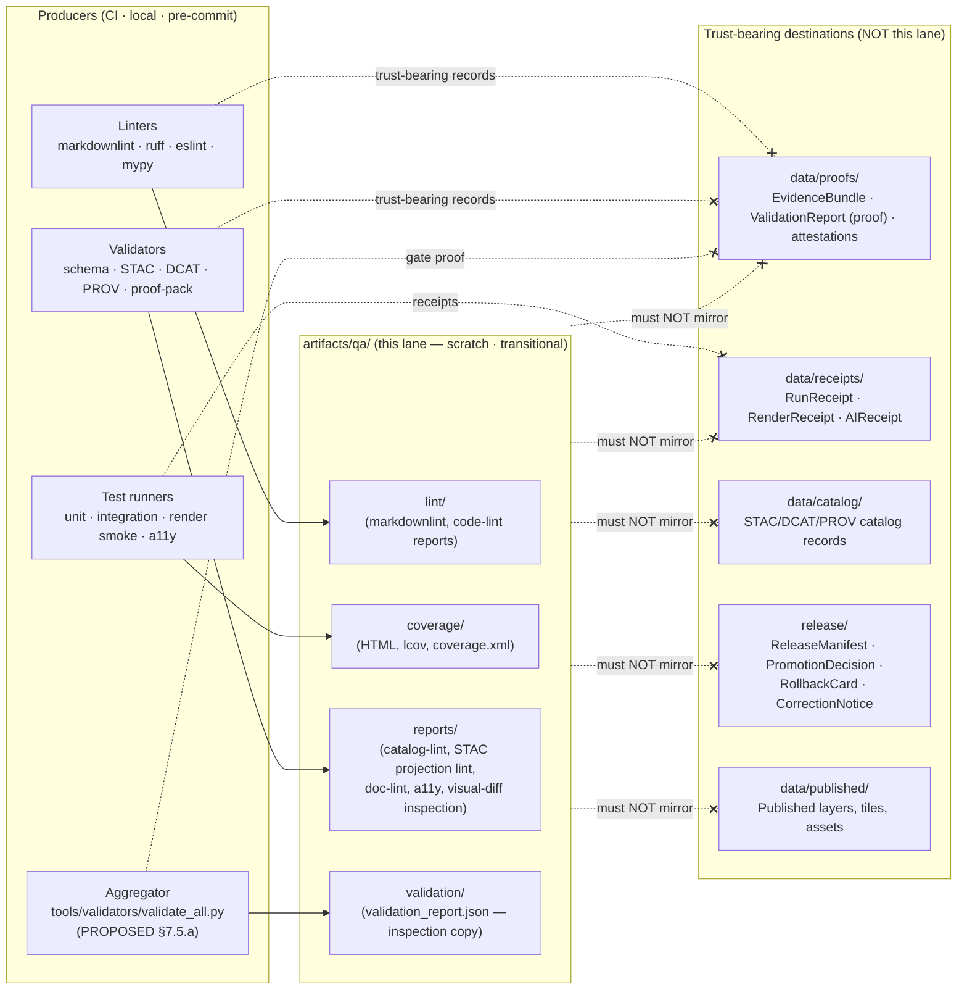

<!-- [KFM_META_BLOCK_V2]
doc_id: kfm://doc/artifacts-qa-readme
title: artifacts/qa/ — QA scratch lane (compatibility sub-lane)
type: readme
version: v1
status: draft
owners: TODO — assign via CODEOWNERS for artifacts/qa/**
created: 2026-05-20
updated: 2026-05-20
policy_label: public
related:
  - kfm://doc/directory-rules
  - artifacts/README.md
  - artifacts/build/README.md
  - artifacts/docs/README.md
  - artifacts/temporary/README.md
  - tools/README.md
  - tools/validators/validate_all.py
  - tests/README.md
  - data/proofs/README.md
  - data/receipts/README.md
  - data/catalog/README.md
  - data/published/README.md
  - release/README.md
  - docs/registers/DRIFT_REGISTER.md
tags: [kfm, artifacts, qa, compatibility-root, transitional, directory-rules, lint, coverage, validation, anti-pattern-register]
notes:
  - Lane class is transitional (inherited from artifacts/ per Directory Rules §8.1).
  - Lane is QA scratch only per Directory Rules §8.2; trust-bearing content (receipts, proofs, manifests, catalog records, published layers) is forbidden.
  - Mounted-repo presence and current contents are NEEDS VERIFICATION in this authoring session.
  - Validator orchestrator path (tools/validators/validate_all.py) and exit-code contract are PROPOSED; ADR-class per Directory Rules §7.5.a (OPEN-DR-03 / ADR-S-07).
  - Sibling-README links, CODEOWNERS coverage, markdownlint config home, gitignore policy, license, owner names, and last-reviewed date are all placeholders pending mounted-repo inspection.
  - Per Directory Rules §15, a lane README older than 6 months is flagged for review.
[/KFM_META_BLOCK_V2] -->

# `artifacts/qa/`

> **QA scratch lane** — non–trust-bearing diagnostic outputs from validators, linters, test runners, and CI: lint reports, coverage, audit output, and human-readable QA surfaces. This lane is a **compatibility sub-lane** of the `artifacts/` root (Directory Rules §8.2) and is **deliberately fenced off** from receipts, proofs, manifests, and any other trust-bearing record.

[](#2-authority-class)
[](#9-what-does-not-belong-here)
[](#9-what-does-not-belong-here)
[](#11-anti-patterns-cross-reference)
[](#1-status--authority)
[](#)
[](#)

> **Status:** PROPOSED — `artifacts/qa/` placement and contents are governed by [Directory Rules §8.2] (CONFIRMED doctrine); the lane's mounted-repo presence and current contents are **NEEDS VERIFICATION** in this docs-only authoring session.
> **Owners:** *TODO — assign via CODEOWNERS for `artifacts/qa/**`.*
> **Last reviewed:** *YYYY-MM-DD — placeholder; populate at first review.*

> [!IMPORTANT]
> **This lane is QA scratch — not authority.** Outputs here support diagnosis, review, and CI surfacing only. They do **not** confer release authority, do **not** serve as `EvidenceBundle`, and do **not** stand in for `RunReceipt`, `RenderReceipt`, `AIReceipt`, `PolicyDecision`, `PromotionDecision`, `ValidationReport` (proof object), `ReleaseManifest`, `CorrectionNotice`, or `RollbackCard`. Trust-bearing records live under `data/receipts/`, `data/proofs/`, `data/catalog/`, `data/published/`, and `release/`. See [§9](#9-what-does-not-belong-here).

---

## Mini-TOC

1. [Status & Authority](#1-status--authority)
2. [Authority class](#2-authority-class)
3. [Purpose (one paragraph)](#3-purpose-one-paragraph)
4. [Repo fit](#4-repo-fit)
5. [Diagram — where QA flows in, what stays out](#5-diagram--where-qa-flows-in-what-stays-out)
6. [Directory tree (PROPOSED)](#6-directory-tree-proposed)
7. [Inputs](#7-inputs)
8. [What belongs here](#8-what-belongs-here)
9. [What does NOT belong here](#9-what-does-not-belong-here)
10. [Outputs (what this lane emits downstream)](#10-outputs-what-this-lane-emits-downstream)
11. [Anti-patterns cross-reference](#11-anti-patterns-cross-reference)
12. [Quickstart](#12-quickstart)
13. [Usage — adding a new QA output type](#13-usage--adding-a-new-qa-output-type)
14. [Validation](#14-validation)
15. [Review burden](#15-review-burden)
16. [Related folders](#16-related-folders)
17. [ADRs](#17-adrs)
18. [FAQ](#18-faq)
19. [Open questions & NEEDS VERIFICATION](#19-open-questions--needs-verification)
20. [Task list](#20-task-list)
21. [Last reviewed](#21-last-reviewed)

---

## 1. Status & Authority

| Field | Value |
|---|---|
| Lane path (PROPOSED) | `artifacts/qa/` |
| Parent root | `artifacts/` (compatibility, class `transitional`) — Directory Rules §8.2 |
| Doctrine status | **CONFIRMED** — Directory Rules §8.2 names `qa/` as one of four permitted `artifacts/` sub-lanes (`build/`, `docs/`, `qa/`, `temporary/`). |
| Implementation status | **PROPOSED / NEEDS VERIFICATION** — repo not mounted in this authoring session; lane presence, contents, ownership, and CI wiring are unverified. |
| Truth class emitted | **Scratch / diagnostic.** Not a receipt, not a proof, not a catalog record, not a publication. |
| Public exposure | **None.** This lane is internal/CI-facing and is **not** a public surface or a governed-API route. |
| Governing ADRs | None lane-specific; governed by Directory Rules §8.2. Cross-references in [§17](#17-adrs). |

> [!NOTE]
> Per Directory Rules §15, **every canonical and compatibility root must carry a README that declares its class and exclusions**. This file performs that role for the `artifacts/qa/` sub-lane; the parent `artifacts/README.md` performs the same role for the root.

[Back to top](#artifactsqa)

---

## 2. Authority class

- **Authority level:** Compatibility (sub-lane of a compatibility root). Not canonical.
- **Compatibility class:** `transitional` — inherited from `artifacts/` per Directory Rules §8.1 (`artifacts/ … class default: transitional`).
- **What that means in practice:**
  - This lane **may** host generated, regenerable, and human-inspectable QA outputs.
  - This lane **may not** be cited as a canonical home for any object the lifecycle invariant (`RAW → WORK/QUARANTINE → PROCESSED → CATALOG/TRIPLET → PUBLISHED`) tracks, or for any object the trust membrane protects.
  - This lane **may not** evolve a parallel authority to `data/proofs/`, `data/receipts/`, `data/catalog/`, or `release/`. Directory Rules §8.3: *“Compatibility roots are not parallel authority.”*
- **Stewardship cadence:** Contents are regeneratable. Aged or stale outputs **should** be pruned; the lane is not an archive.

[Back to top](#artifactsqa)

---

## 3. Purpose (one paragraph)

`artifacts/qa/` holds **non–trust-bearing diagnostic output** produced by repository quality checks: lint reports (Markdown, code, schema, catalog), test-coverage exports, accessibility audits, render smoke summaries, visual-diff inspection bundles, and the human- or CI-surfaceable aggregate report from `tools/validators/validate_all.py` (`validation_report.json`, PROPOSED per Directory Rules §7.5.a). It exists so that reviewers, contributors, and CI annotators can **inspect** the why behind a gate result without confusing the inspection artifact for the gate decision itself. The gate lives in CI exit codes and policy; the proof lives in `data/proofs/`; the receipt lives in `data/receipts/`; the release decision lives in `release/`. This lane is the **scratchpad**, nothing more.

[Back to top](#artifactsqa)

---

## 4. Repo fit

| Direction | Surface | Relationship |
|---|---|---|
| Parent root | [`../README.md`](../README.md) | `artifacts/` class declaration and the broader build / docs / qa / temporary split (Directory Rules §8.2). |
| Sibling sub-lane | [`../build/`](../build/) | Compiled outputs, distributables. Separate scratch sub-lane; not QA. |
| Sibling sub-lane | [`../docs/`](../docs/) | Generated documentation (mkdocs site, API reference). Separate scratch sub-lane; not QA. |
| Sibling sub-lane | [`../temporary/`](../temporary/) | Ephemeral, gitignored or pruned outputs. Use this for genuinely throwaway material; `qa/` is for outputs reviewers may want to keep visible across a PR cycle. |
| Validator entry point | `../../tools/validators/validate_all.py` *(PROPOSED — Directory Rules §7.5.a)* | Aggregator; writes `validation_report.json` whose **inspection copy** may land here. Authority/gate is exit-code-driven, not artifact-driven. |
| Test fixtures and runners | `../../tests/`, `../../fixtures/` | Source of coverage and test-report inputs. |
| Doc lint config | *(NEEDS VERIFICATION — markdownlint config home; see KFM-P8-PROG-0029)* | Source of Markdown-lint output. |
| Trust-bearing destinations | `../../data/proofs/`, `../../data/receipts/`, `../../data/catalog/`, `../../data/published/`, `../../release/` | **Where QA-adjacent but trust-bearing records actually live.** See [§9](#9-what-does-not-belong-here). |

[Back to top](#artifactsqa)

---

## 5. Diagram — where QA flows in, what stays out



> [!NOTE]
> Dashed-X arrows are **DENY edges** — the producer may also emit a trust-bearing version of its output, but that version takes the canonical path on the right, **not** this lane.

[Back to top](#artifactsqa)

---

## 6. Directory tree (PROPOSED)

The exact subfolder layout below is **PROPOSED**; the only doctrinally fixed claim is that `artifacts/qa/` exists as one of four permitted sub-lanes under `artifacts/` (Directory Rules §8.2). Subfolder names are conventional and may be reorganized without ADR as long as the lane's exclusion rules ([§9](#9-what-does-not-belong-here)) hold.

```text
artifacts/qa/
├── README.md                      # this file — class declaration + exclusions
├── lint/                          # PROPOSED — lint output by tool
│   ├── markdownlint.json          # illustrative
│   ├── ruff.json                  # illustrative
│   ├── eslint.json                # illustrative
│   └── mypy.txt                   # illustrative
├── coverage/                      # PROPOSED — test coverage exports
│   ├── html/                      # human-readable coverage browser
│   ├── coverage.xml               # Cobertura-style
│   └── lcov.info                  # illustrative
├── reports/                       # PROPOSED — structured QA surfaces
│   ├── catalog-lint/              # STAC projection lint, DCAT/PROV checks
│   ├── doc-lint/                  # KFM-MDP rule output (KFM-P8-PROG-0029)
│   ├── a11y/                      # axe / pa11y / Playwright a11y audits
│   ├── render-smoke/              # MapLibre/Cesium smoke summaries
│   └── visual-diff/               # inspection diff images (NOT RenderReceipt)
├── validation/                    # PROPOSED — aggregator inspection copy
│   └── validation_report.json     # from tools/validators/validate_all.py
└── .gitignore                     # NEEDS VERIFICATION — many subtrees may be gitignored
```

> [!TIP]
> Many of the subtrees above are good candidates for `.gitignore` so the lane stays light. Anything a reviewer needs to inspect during a PR cycle is fine to commit selectively; long-lived archival belongs nowhere — it gets regenerated.

[Back to top](#artifactsqa)

---

## 7. Inputs

| Producer | Typical output | Notes |
|---|---|---|
| **Markdown lint** (CONFIRMED doctrine, KFM-P8-PROG-0029 — *“markdownlint config and pre-commit + one-job CI”*) | `markdownlint.json` or text report | Same config drives local pre-commit and CI; drift between the two is a fail-closed condition. |
| **Code linters / type checkers** | `ruff.json`, `eslint.json`, `mypy.txt`, etc. | PROPOSED — actual tool list NEEDS VERIFICATION against mounted repo. |
| **Schema validators** | Per-validator JSON | Aggregated by the validator orchestrator below. |
| **Validator orchestrator** — `tools/validators/validate_all.py` *(PROPOSED — Directory Rules §7.5.a; ADR-class per §2.4(5))* | `validation_report.json` with per-validator `{name, status, details, duration_ms}` | Exit-code contract `0 / 1 / 2` lives in `tools/README.md` (PROPOSED); see [§17](#17-adrs). The JSON here is the **inspection copy**, not the gate. |
| **Test runners** (unit · integration · render-smoke · a11y) | Coverage HTML/XML/lcov; pytest/Jest JSON; Playwright reports | The *receipt* of the run (RunReceipt/RenderReceipt) belongs to `data/receipts/`, not here. |
| **Catalog QA** (KFM-P27-FEAT-0003 *STAC Projection lint report*, KFM-P27-FEAT-0004 *Catalog QA CI result surface*) | Lint report enumerating missing `license`, `providers`, `stac_extensions`, broken links, JSON errors | PROPOSED implementation; CONFIRMED doctrine intent. |
| **Doc-lint surface** (ML-064-072 — *“Documentation lint protects Focus Mode source text”*) | Structural and metadata-check output for Markdown consumed by catalogs, graph, and Focus Mode | PROPOSED — Focus-Mode integration boundary remains downstream. |
| **CI workflows** | Surfacing copies of any of the above | CI may also push receipts to `data/receipts/`; that path is governed, not part of this lane. |

> [!NOTE]
> Inputs to `artifacts/qa/` are always **regeneratable** — re-run the producer and the lane re-populates. If a file here cannot be regenerated, it almost certainly does not belong here.

[Back to top](#artifactsqa)

---

## 8. What belongs here

CONFIRMED scope (Directory Rules §8.2): *“QA reports, lint output, test coverage.”* Expanded with doctrine-grounded examples:

| Category | Examples | Truth label |
|---|---|---|
| Lint reports | markdownlint output (KFM-P8-PROG-0029), code-lint output (ruff/eslint/mypy), JSON-schema lint | CONFIRMED scope · PROPOSED file paths |
| Test coverage | HTML coverage browser, `coverage.xml`, `lcov.info` | CONFIRMED scope · PROPOSED file paths |
| Catalog QA surfaces | STAC projection lint (KFM-P27-FEAT-0003), Catalog QA CI result surface (KFM-P27-FEAT-0004) | CONFIRMED scope (catalog QA is a permitted QA artifact) |
| Doc-lint output | KFM-MDP rule enforcement output for Markdown that feeds catalogs and Focus Mode (ML-064-072) | CONFIRMED scope · PROPOSED filenames |
| A11y audits | axe / pa11y / Playwright a11y reports (per ML-057-018 / ML-U-014 line of doctrine) | CONFIRMED scope · PROPOSED filenames |
| Render smoke summaries | Headless MapLibre/Cesium render summaries (the **summary**; the RenderReceipt belongs elsewhere) | CONFIRMED scope distinction |
| Visual-diff inspection | Pixel diff images for human review | CONFIRMED scope; the visual-regression *receipt* still lives in `data/receipts/` |
| Validator aggregator inspection copy | `validation_report.json` from `tools/validators/validate_all.py` | PROPOSED — see [§9](#9-what-does-not-belong-here) for the boundary with the proof object |

[Back to top](#artifactsqa)

---

## 9. What does NOT belong here

> [!WARNING]
> Directory Rules §8.2: `artifacts/` (and therefore this sub-lane) **MUST NOT** be the canonical home for *receipts, proofs, evidence bundles, release manifests, promotion decisions, rollback cards, correction notices, catalog records, published layers*. Per the Master Failure-Mode and Anti-Pattern Register (Atlas v1.0 §24.9.1 — *“Artifacts directory holding receipts”*), placing those records here is a **named anti-pattern**.

Explicit prohibition table — the boundary that defines this lane:

| Prohibited content | Canonical home | Doctrine citation |
|---|---|---|
| `RunReceipt` (signed record of watcher / probe / build / release action) | `data/receipts/` | Master MapLibre Components-Functions-Features §M; Directory Rules §13.2 |
| `RenderReceipt` (headless map render proof; engine, screenshot ref, tile error rate, latency, visual diff result, policy label) | `data/receipts/` | Master MapLibre Components-Functions-Features §M |
| `AIReceipt` (governed-AI answer record; never superseded retroactively) | `data/receipts/` | Atlas §24.7; KFM unified doctrine Part VIII |
| `EvidenceBundle` / `EvidenceRef` | `data/proofs/` | KFM unified doctrine §10; Atlas §24.9.2 |
| `ValidationReport` **proof object** (fail-closed publication-gate output, e.g. alongside `.pmtiles.attest.json`, `.bao`, `.sig`) | `data/proofs/` | ML-066-022, ML-066-025 |
| `PolicyDecision` | `data/receipts/` or `data/proofs/` (per object family contract) | Master MapLibre §U |
| `PromotionDecision` (governed state transition record) | `release/` | KFM unified doctrine; Directory Rules §13.2 |
| `ReleaseManifest` (publication / control artifact) | `release/manifests/` | Directory Rules §13.2 |
| `CorrectionNotice` | `release/correction_notices/` | KFM unified doctrine glossary |
| `RollbackCard` | `release/rollback_cards/` | KFM unified doctrine glossary |
| Catalog records (STAC / DCAT / PROV entries the catalog actually serves) | `data/catalog/` | Directory Rules §13.2 |
| Published layers / tiles / assets | `data/published/` | Directory Rules §13.2 |
| Trust-bearing **signatures, attestations, SBOMs that gate release** | `data/proofs/`, `release/`, or governance starter pack (CODEOWNERS, `tool-versions.yaml`, `policy-bundle.json`, `sbom.yaml`, `run_receipt.schema.json` per C14-01) | Directory Rules; Pass 10 §C14 |
| Secrets, tokens, API keys | **Nowhere in the repo.** | Repo-wide. |
| Raw / unredacted PII, geoprivacy-sensitive geometry, rights-restricted source material | `data/quarantine/`, with policy review | KFM unified doctrine §29.2 |

### 9.1 The `validation_report.json` boundary

> [!IMPORTANT]
> The aggregator output named `validation_report.json` (KFM-P5-PROG-0009 / Directory Rules §7.5.a) is **PROPOSED** as a permitted *inspection copy* in this lane. **The gate evidence is the CI exit code**, not this file. If a `validation_report.json` is referenced by a `ReleaseManifest`, `PromotionDecision`, or `RunReceipt`, the **referenced copy** is a trust-bearing record and lives in `data/proofs/` or `data/receipts/`. Do not let one filename collapse two object classes.

[Back to top](#artifactsqa)

---

## 10. Outputs (what this lane emits downstream)

The lane emits **no governed outputs**. It is read by:

| Downstream consumer | What it reads | Why |
|---|---|---|
| Reviewers (PR) | All subtrees | Inspect why a gate failed or how a metric trended. |
| CI annotators / status checks | Specific JSON / text reports | Render PR comments, badges, summary tabs. **The check status itself is not derived from this lane** — it comes from the producer's exit code. |
| Local contributors | Coverage HTML, lint output | Reproduce CI signal locally; mirrors the “same config local + CI” discipline (KFM-P8-PROG-0029). |
| Drift register / doc-lint scans | Doc-lint reports | Feed into `docs/registers/DRIFT_REGISTER.md` triage (Atlas §24.11.5). |

> [!NOTE]
> Anything downstream that needs a **proof** of a check should not read from this lane — it should read from `data/proofs/` or `data/receipts/`. This lane's contents are explicitly *not* a citation source.

[Back to top](#artifactsqa)

---

## 11. Anti-patterns cross-reference

Recurring anti-patterns the lane must resist (from Directory Rules §13 and Atlas §24.9.1):

| Anti-pattern | What goes wrong | Counter-rule |
|---|---|---|
| **Trust content in `artifacts/`** (Atlas §24.9.1; Directory Rules §13.5) | Release manifests, evidence bundles, signed receipts collapse into build/docs/qa scratch. | Migrate to `data/proofs/`, `data/receipts/`, `release/` per §8.2. |
| **Mixing proof, process memory, build output, and release decisions** (Directory Rules §13.2) | Same directory hosts release manifests, build outputs, and receipts. | Apply the sharp split; this lane is **qa scratch only**. |
| **Compatibility root used as authority** (Directory Rules §8.3) | Files harden into authority inside a compatibility lane. | Per-root README declares class; canonical is elsewhere. |
| **Lane evolves a parallel schema/policy/registry/release home** (Directory Rules §8.3) | Two authorities for the same object family. | New rules land in canonical first; this lane never grows a parallel authority. |
| **Documentation as truth** (Directory Rules §13.5) | A `docs/` page or this README cited as a canonical decision. | Promote to ADR or `control_plane/` register. |

[Back to top](#artifactsqa)

---

## 12. Quickstart

> [!NOTE]
> Commands below are **PROPOSED** — they reflect the validator orchestrator pattern in Directory Rules §7.5.a (PROPOSED) and the markdownlint pattern in KFM-P8-PROG-0029 (CONFIRMED doctrine; mounted-repo wiring NEEDS VERIFICATION). Replace placeholders with the project's verified tool names and paths.

```bash
# Inspect the latest aggregated validator report (PROPOSED)
cat artifacts/qa/validation/validation_report.json | jq '.summary'

# Browse coverage locally (PROPOSED)
open artifacts/qa/coverage/html/index.html

# Re-run doc lint with the same config CI uses (CONFIRMED pattern — KFM-P8-PROG-0029)
# Same config drives pre-commit, local, and CI; drift is a fail-closed condition.
# (Concrete command NEEDS VERIFICATION against mounted repo.)
markdownlint --config .markdownlint.jsonc 'docs/**/*.md' --json > artifacts/qa/lint/markdownlint.json

# Re-run the full validator orchestrator (PROPOSED — Directory Rules §7.5.a)
python tools/validators/validate_all.py \
  --report-out artifacts/qa/validation/validation_report.json
# Exit code contract (PROPOSED, ADR-class — OPEN-DR-03 / ADR-S-07):
#   0 = all validators pass (or warn)
#   1 = any validator fails
#   2 = system error
```

[Back to top](#artifactsqa)

---

## 13. Usage — adding a new QA output type

A short decision checklist when a contributor wants to start producing a new kind of QA file:

1. **Is the output a record someone might cite later as proof?** If yes → it belongs in `data/proofs/` or `data/receipts/`, not here. Stop.
2. **Is the output a release / promotion / rollback / correction decision?** If yes → `release/`, not here. Stop.
3. **Is the output a catalog record (STAC / DCAT / PROV) the catalog actually serves?** If yes → `data/catalog/`, not here. Stop.
4. **Is the output regeneratable from current repo state?** If no → it almost certainly does not belong in this lane; figure out where it actually lives.
5. **Is the output trust-bearing in any other sense (signature, attestation, SBOM-as-gate)?** If yes → `data/proofs/` or governance starter pack (Pass 10 §C14-01), not here.
6. **If all five answers route past the prohibitions** → pick a subfolder (`lint/`, `coverage/`, `reports/<topic>/`, or `validation/`) and produce the file. Consider whether the path should be gitignored.

> [!TIP]
> Add a one-line note in the producer's own README pointing at the QA output location. Don't make reviewers grep to find where a tool drops its report.

[Back to top](#artifactsqa)

---

## 14. Validation

| What is checked | How | Status |
|---|---|---|
| Lane only contains permitted content | Negative-state CI check that scans `artifacts/qa/**` for trust-bearing object families (receipts, proofs, manifests, catalog records) and fails the build if any is detected. | **PROPOSED** — no mounted-repo evidence in this session. |
| Lane is not cited from governed surfaces | Reviewer check + (optional) static scan that no `EvidenceRef`, `RunReceipt`, `ReleaseManifest`, or governed-API route points into `artifacts/qa/`. | **PROPOSED**. |
| Producer paths are documented | Each producer's README points at the QA subtree it writes to (markdownlint, validator orchestrator, etc.). | **PROPOSED** for non-mounted state. |
| Lane README declares class and exclusions | This file (per Directory Rules §15 and §8.2). | **CONFIRMED** for the doctrine, **PROPOSED** for the implementation. |
| Aged outputs are pruned | Cadence policy (TBD) removes regeneratable outputs older than N days. | **NEEDS VERIFICATION** — pruning cadence not yet pinned. |

> [!NOTE]
> Validators in KFM doctrine MUST exercise DENY / ABSTAIN / ERROR paths, not only success paths (Directory Rules §7.5.a, citing `tools/README.md`). A QA-content-policy validator must therefore include negative fixtures that **attempt** to commit trust-bearing content into this lane and **prove** the gate fails closed.

[Back to top](#artifactsqa)

---

## 15. Review burden

- **Day-to-day:** Whoever owns the producer (the tool emitting the QA output) owns the QA subtree it writes to.
- **Lane-level:** The owner of `artifacts/` per CODEOWNERS owns this README and the lane's class declaration. *(Specific owners: **TODO** — assign via root CODEOWNERS.)*
- **Cross-lane drift:** A PR that adds new content under `artifacts/qa/` that **looks** receipt-shaped, proof-shaped, manifest-shaped, or catalog-shaped requires a Directory-Rules-aware reviewer signoff before merge.
- **Sensitive content review:** None expected (this lane is not a public surface), **but** producers must not write redacted-bypassed source material, PII, or sensitive geometry into QA reports. If a lint or test surface would otherwise include such content, the producer must redact or summarize before write. Cross-references: KFM unified doctrine §29.2 (Trust-membrane anti-patterns); Atlas §24.9.2.

[Back to top](#artifactsqa)

---

## 16. Related folders

| Folder | Purpose | README |
|---|---|---|
| `artifacts/` | Parent compatibility root; declares class and forbids trust-bearing content. | [`../README.md`](../README.md) |
| `artifacts/build/` | Compiled outputs, distributables (Directory Rules §8.2). | [`../build/README.md`](../build/README.md) *(NEEDS VERIFICATION)* |
| `artifacts/docs/` | Generated documentation (Directory Rules §8.2). | [`../docs/README.md`](../docs/README.md) *(NEEDS VERIFICATION)* |
| `artifacts/temporary/` | Ephemeral, gitignored or pruned (Directory Rules §8.2). | [`../temporary/README.md`](../temporary/README.md) *(NEEDS VERIFICATION)* |
| `tools/` | Validator orchestrator and producer tooling; exit-code contract lives here. | [`../../tools/README.md`](../../tools/README.md) *(authored prior session, status PROPOSED)* |
| `tests/`, `fixtures/` | Source of coverage and test reports; canonical home for fixture-driven validation. | [`../../tests/README.md`](../../tests/README.md) *(NEEDS VERIFICATION)* |
| `data/proofs/` | Canonical home for `EvidenceBundle`, proof-form `ValidationReport`, attestations. | [`../../data/proofs/README.md`](../../data/proofs/README.md) *(NEEDS VERIFICATION)* |
| `data/receipts/` | Canonical home for `RunReceipt`, `RenderReceipt`, `AIReceipt`. | [`../../data/receipts/README.md`](../../data/receipts/README.md) *(NEEDS VERIFICATION)* |
| `data/catalog/` | STAC/DCAT/PROV catalog records. | [`../../data/catalog/README.md`](../../data/catalog/README.md) *(NEEDS VERIFICATION)* |
| `data/published/` | Released layers, tiles, assets. | [`../../data/published/README.md`](../../data/published/README.md) *(NEEDS VERIFICATION)* |
| `release/` | `ReleaseManifest`, `PromotionDecision`, `RollbackCard`, `CorrectionNotice`. | [`../../release/README.md`](../../release/README.md) *(NEEDS VERIFICATION)* |
| `docs/registers/` | Drift register and similar governance ledgers. | [`../../docs/registers/DRIFT_REGISTER.md`](../../docs/registers/DRIFT_REGISTER.md) *(NEEDS VERIFICATION)* |

[Back to top](#artifactsqa)

---

## 17. ADRs

No ADR is **specific** to `artifacts/qa/`. The lane is governed by the standing rule in Directory Rules §8.2.

ADRs and ADR-class open questions that **touch** this lane's edges:

| ID | Topic | Connection to this lane |
|---|---|---|
| `ADR-0001` *(referenced; status NEEDS VERIFICATION in this session)* | Canonical schema home (`schemas/contracts/v1/...`). | Establishes that **proof-form** `ValidationReport` schemas live under `schemas/`, not in `artifacts/qa/`. |
| `OPEN-DR-03` / `ADR-S-07` | Validator exit-code contract (`tools/validators/validate_all.py`, exit codes `0/1/2`). | Pins what counts as a **gate** versus what counts as an **inspection artifact**. CI workflows MUST call `validate_all.py`, not orchestrate validators individually. |
| Atlas `ADR-S-03` | Receipt class home (`schemas/contracts/v1/receipts/` vs. `<domain>/receipts/`). | Determines where receipts referencing QA inspection files are validated — not in `artifacts/qa/`. |
| Atlas `ADR-S-11` | Story / export receipt policy. | Determines where story / export receipts live; not here. |
| Atlas `ADR-S-13` | Drift register triage. | Determines how a `artifacts/qa/`-related anti-pattern (trust content found here) reaches the drift register. |

[Back to top](#artifactsqa)

---

## 18. FAQ

<details>
<summary><strong>Q: I have a <code>validation_report.json</code>. Does it go here or under <code>data/proofs/</code>?</strong></summary>

**A:** Both copies can exist for two different purposes:

- The **inspection copy** under `artifacts/qa/validation/validation_report.json` is fine — it's regeneratable scratch that humans and CI annotators read.
- A **trust-bearing copy** referenced by a `ReleaseManifest`, `PromotionDecision`, or `RunReceipt` must live under `data/proofs/` (or be embedded in / referenced from a receipt under `data/receipts/`). That copy carries the audit weight; the QA copy does not.

The gate is the CI exit code, not the file (§9.1).
</details>

<details>
<summary><strong>Q: Can I commit my HTML coverage report here?</strong></summary>

**A:** Yes for review purposes; usually no for long-lived storage. HTML coverage is regeneratable and bulky. Most projects gitignore the `coverage/html/` subtree and upload it as a CI artifact instead. If your reviewers genuinely need the HTML committed for a specific PR, do so deliberately and prune later.
</details>

<details>
<summary><strong>Q: Can a downstream tool cite a file in <code>artifacts/qa/</code> as evidence?</strong></summary>

**A:** **No.** Per Directory Rules §8.2 and the “Artifacts directory holding receipts” anti-pattern (Atlas §24.9.1), this lane is not an evidence surface. An `EvidenceRef` that resolves into `artifacts/qa/` is a doctrine violation. Evidence lives in `data/proofs/`; receipts live in `data/receipts/`.
</details>

<details>
<summary><strong>Q: What about visual-regression diff PNGs? Those feel like proof.</strong></summary>

**A:** The diff image is **inspection scratch**. The `RenderReceipt` that records *“headless map render: engine, screenshot ref, tile_error_rate, latency, visual diff outcome, policy label”* is the proof object, and it lives in `data/receipts/`. The two can co-exist: the receipt references the diff image's content hash; the human-viewable PNG sits here so reviewers can eyeball it.
</details>

<details>
<summary><strong>Q: Where does an a11y audit (axe / pa11y / Playwright) report go?</strong></summary>

**A:** Audit text/HTML — here, under `artifacts/qa/reports/a11y/`. The receipt of an a11y test run (with run inputs, tool versions, outcome) — `data/receipts/`. If a11y enforcement is a release gate, the gate decision is a `PolicyDecision` / `PromotionDecision`, which lives in `release/`, not here.
</details>

<details>
<summary><strong>Q: Should this lane be gitignored entirely?</strong></summary>

**A:** Partially is fine; entirely is not. The **`README.md`** must always be tracked so the class declaration is in version control. Subfolders may be gitignored individually depending on whether reviewers benefit from PR-time inspection.
</details>

<details>
<summary><strong>Q: How is this lane different from <code>artifacts/temporary/</code>?</strong></summary>

**A:** `temporary/` is for genuinely throwaway / per-run scratch and is expected to be gitignored or pruned routinely. `qa/` is for outputs reviewers may want visible across a PR cycle (lint output, coverage, audit reports). Both are inside the same compatibility root with the same exclusions.
</details>

[Back to top](#artifactsqa)

---

## 19. Open questions & NEEDS VERIFICATION

- [ ] **OPEN-QA-01** — Mounted-repo presence of `artifacts/qa/` and current subtree layout. **NEEDS VERIFICATION** before this README's PROPOSED tree (§6) is treated as descriptive.
- [ ] **OPEN-QA-02** — CODEOWNERS coverage for `artifacts/qa/**`. **NEEDS VERIFICATION.**
- [ ] **OPEN-QA-03** — Pruning cadence and gitignore pattern. **NEEDS VERIFICATION** — should aged QA outputs be deleted on schedule, on next CI run, or on contributor demand?
- [ ] **OPEN-QA-04** — Negative-state CI check that the lane never contains trust-bearing object families. **PROPOSED**; would close one named anti-pattern.
- [ ] **OPEN-QA-05** — Whether `validation_report.json` from the validator orchestrator should be **mirrored** here automatically (current PROPOSED behavior) or only on opt-in. Linked to OPEN-DR-03 / ADR-S-07 (validator exit-code contract).
- [ ] **OPEN-QA-06** — Markdownlint config home. KFM-P8-PROG-0029 confirms the pattern (shared config across pre-commit and CI); the **file path** of that config is **NEEDS VERIFICATION** against the mounted repo.
- [ ] **OPEN-QA-07** — Whether catalog QA reports (KFM-P27-FEAT-0003, KFM-P27-FEAT-0004) live under `artifacts/qa/reports/catalog-lint/` (this README's PROPOSED home) or under a `data/catalog/qa/` lane. Lane-vs-lane question, not ADR-class.
- [ ] **OPEN-QA-08** — Last-reviewed date population for this README (per §15 contract).

[Back to top](#artifactsqa)

---

## 20. Task list

- [ ] Confirm `artifacts/qa/` and its sub-lanes exist (or are intentionally absent) against mounted repo.
- [ ] Assign CODEOWNERS for `artifacts/qa/**`.
- [ ] Replace owner / last-reviewed / license placeholders with verified values.
- [ ] Wire negative-state CI check per OPEN-QA-04.
- [ ] Decide pruning cadence per OPEN-QA-03 and update §14.
- [ ] Cross-link from each producer's README (markdownlint, validator orchestrator, test runners, catalog QA) to its `artifacts/qa/` subtree.
- [ ] Coordinate with the open ADR for validator exit-code contract (OPEN-DR-03 / ADR-S-07) so this lane's `validation/` boundary is settled.
- [ ] Resolve OPEN-QA-07 (catalog-lint home).

[Back to top](#artifactsqa)

---

## 21. Last reviewed

**YYYY-MM-DD** *(placeholder — populate at first formal review; Directory Rules §15 flags READMEs older than 6 months for review).*

---

### Related docs

- [`../README.md`](../README.md) — `artifacts/` root class declaration
- [`../../tools/README.md`](../../tools/README.md) — validator orchestrator and exit-code contract *(prior-session authoring; PROPOSED)*
- [Directory Rules §8 — Compatibility Roots](../../directory-rules.md#8-compatibility-roots) *(link path NEEDS VERIFICATION; repo home of `directory-rules.md` not confirmed in this session)*
- [Directory Rules §13 — Anti-pattern register](../../directory-rules.md#13-anti-patterns)
- [Directory Rules §15 — Required README Contract](../../directory-rules.md#15-required-readme-contract)
- [`docs/registers/DRIFT_REGISTER.md`](../../docs/registers/DRIFT_REGISTER.md) *(NEEDS VERIFICATION)*

**Last updated:** YYYY-MM-DD · **Maintainer:** *TODO via CODEOWNERS* · [Back to top ↥](#artifactsqa)
