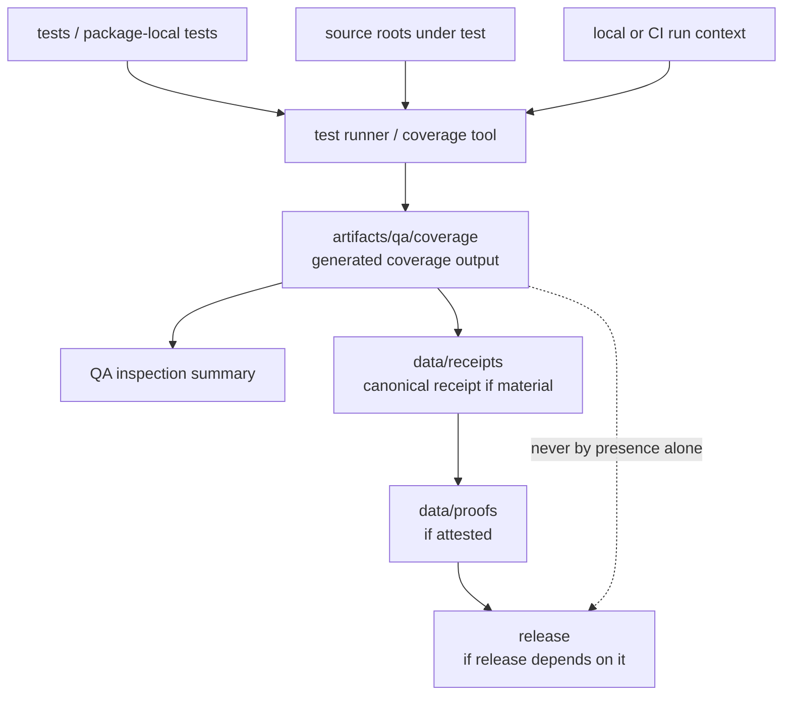

<!-- [KFM_META_BLOCK_V2]
doc_id: kfm://doc/artifacts-qa-coverage-readme
title: artifacts/qa/coverage/ — Coverage QA Outputs
type: readme
version: v0.1
status: draft
owners: OWNER_TBD — QA steward · Test steward · Build steward · Docs steward
created: 2026-06-16
updated: 2026-06-16
policy_label: public
related:
  - ../README.md
  - ../../README.md
  - ../../../docs/doctrine/directory-rules.md
  - ../../../tests/
  - ../../../tools/
  - ../../../data/receipts/README.md
  - ../../../data/proofs/README.md
  - ../../../release/README.md
tags: [kfm, artifacts, qa, coverage, test-coverage, htmlcov, reports, compatibility-root, transitional, non-authoritative]
notes:
  - "Replaces an empty artifacts/qa/coverage README with a bounded coverage-output contract."
  - "This directory is a compatibility/transitional QA-output lane for generated coverage exports and local HTML browser output; it is not a canonical test authority, CI authority, receipt store, proof store, release record, source-code home, or policy gate."
  - "Specific coverage files, workflow names, thresholds, CI pass state, source mapping, retention rules, and report freshness remain NEEDS VERIFICATION."
[/KFM_META_BLOCK_V2] -->

<a id="top"></a>

<div align="center">

# Coverage QA Outputs

`artifacts/qa/coverage/`

**Compatibility/transitional QA-output lane for generated test coverage exports, coverage summaries, and local HTML coverage browser output. Coverage files here may help inspect a run, but they are not canonical test truth, release proof, source authority, or publication evidence.**


[Purpose](#1-purpose) · [Repo fit](#2-repo-fit) · [Authority boundary](#3-authority-boundary) · [Allowed contents](#5-allowed-contents) · [Forbidden contents](#6-forbidden-contents) · [Validation](#10-validation-expectations) · [Definition of done](#12-definition-of-done)

</div>

---

> [!IMPORTANT]
> **Status:** draft / `NEEDS VERIFICATION`  
> **Path:** `artifacts/qa/coverage/README.md`  
> **Responsibility root:** `artifacts/` — compatibility root, QA output scaffold  
> **Truth posture:** CONFIRMED README path / CONFIRMED parent `artifacts/qa/` QA-output boundary / CONFIRMED parent `artifacts/` compatibility-root boundary / PROPOSED coverage-output contract / UNKNOWN actual coverage files, workflows, thresholds, CI runs, source mapping, retention policy, and report freshness

> [!CAUTION]
> `artifacts/qa/coverage/` is not a canonical testing authority. A coverage report staged here does not prove correctness, release readiness, policy compliance, EvidenceBundle support, or publication state.

---

## 1. Purpose

`artifacts/qa/coverage/` holds generated coverage outputs from local or CI test runs.

Typical accepted material includes:

- HTML coverage browser output such as `htmlcov/`;
- machine-readable coverage exports such as `coverage.xml`, `coverage.json`, or `lcov.info`;
- static coverage summaries generated from test tools;
- non-authoritative per-run coverage metadata;
- temporary coverage artifacts used for reviewer inspection.

Files here may help a reviewer understand a run, but they are not receipts, proofs, release records, source code, policy decisions, or canonical evidence.

This README does not prove any coverage report currently exists, any test job writes here, any threshold was met, or any CI run passed.

[Back to top](#top)

---

## 2. Repo fit

| Concern | Owning root | Expected relationship |
|---|---|---|
| Coverage QA output | `artifacts/qa/coverage/` | Generated, non-authoritative coverage reports |
| QA output parent | `artifacts/qa/` | Lint, coverage, reports, and validator inspection copies |
| Compatibility root | `artifacts/` | Transitional compatibility root; trust content forbidden |
| Tests and fixtures | `tests/`, package-local tests | Source test definitions and fixtures; not stored here |
| Test tools | `tools/`, package config | Test runners and coverage generators |
| CI workflows | `.github/` | Workflow definitions and CI enforcement |
| Receipts | `data/receipts/` | Canonical process-memory and receipt home, if material |
| Proofs / EvidenceBundles | `data/proofs/` | Canonical evidence/proof home |
| Release records | `release/` | ReleaseManifest, RollbackCard, CorrectionNotice, release decisions |
| Source code | `apps/`, `packages/`, `connectors/`, `pipelines/`, `runtime/`, `tools/` | Code under test; not copied here |
| Schemas/contracts/policy | `schemas/`, `contracts/`, `policy/` | Authority roots, never staged here |

## 3. Authority boundary

`artifacts/qa/coverage/` has **compatibility authority only**. It may hold generated coverage reports; it does not establish code correctness, implementation maturity, policy compliance, evidence support, test authority, CI authority, release readiness, or publication state.

```text
TEST INPUTS / CODE            QA OUTPUT STAGING             TRUST / DECISION HOMES
tests/ apps/ packages/  --->  artifacts/qa/coverage/  --->  data/receipts/ if material
tools/ pipelines/            generated coverage only        data/proofs/ if material
.github/                      not authoritative             release/ if applicable
```

A coverage file in this folder may be cited by a QA summary or receipt, but the canonical trust-bearing object must live elsewhere.

## 4. Default posture

Coverage output in this folder should be treated as **inspection support only**.

Coverage should not be treated as proof of correctness, safety, evidence support, policy compliance, or release readiness unless the relevant canonical records and checks exist:

- source `git_sha` and test target refs;
- test runner and coverage tool versions;
- CI workflow/run id or local run context;
- threshold configuration and pass/fail result;
- coverage output digest where material;
- validation/test receipt in `data/receipts/` where material;
- proof or attestation in `data/proofs/` where material;
- release manifest linkage where release depends on the result;
- known limitations and excluded paths.

## 5. Allowed contents

| Allowed artifact | Examples | Required posture |
|---|---|---|
| HTML coverage output | `htmlcov/`, `index.html`, static coverage assets | Generated and non-authoritative |
| XML coverage export | `coverage.xml` | Machine output only; source tests live elsewhere |
| JSON coverage export | `coverage.json` | Machine output only; no deployment-only values |
| LCOV coverage export | `lcov.info` | Machine output only; reviewable and scrubbed |
| Coverage summary | `summary.txt`, `coverage-summary.json` | Non-authoritative inspection aid |
| Run metadata | `coverage-run.json` | Non-sensitive source refs, tool versions, run id |

## 6. Forbidden contents

| Forbidden here | Correct home |
|---|---|
| Source tests or fixtures | `tests/`, package-local test roots, or fixture roots |
| Source code under test | `apps/`, `packages/`, `connectors/`, `pipelines/`, `runtime/`, `tools/` |
| CI workflow definitions | `.github/` |
| RunReceipt, TransformReceipt, ValidationReport, AIReceipt, RedactionReceipt | `data/receipts/` |
| EvidenceBundle, proof bundles, attestations | `data/proofs/` |
| ReleaseManifest, RollbackCard, CorrectionNotice | `release/` |
| Published artifacts or released reports | `data/published/` after governed release |
| Catalog records, source descriptors, registry records | `data/catalog/`, `data/registry/`, or governed registry homes |
| Schemas, contracts, policy rules | `schemas/`, `contracts/`, `policy/` |
| Deployment-only values | Deployment secret/config channels, never this directory |
| Long-lived QA decisions or release gates | `release/`, `data/receipts/`, or governed decision homes |

## 7. Directory shape

Current implementation inventory remains `NEEDS VERIFICATION`.

```text
artifacts/qa/coverage/
├── README.md
├── htmlcov/                         # PROPOSED generated HTML coverage browser output
├── coverage.xml                     # PROPOSED XML coverage export
├── coverage.json                    # PROPOSED JSON coverage export
├── lcov.info                        # PROPOSED LCOV export
├── coverage-summary.json            # PROPOSED non-authoritative summary
└── coverage-run.json                # PROPOSED non-sensitive run metadata
```

> [!WARNING]
> Do not treat this suggested shape as repo fact. Verify actual coverage files, workflows, test targets, thresholds, and run ids before making implementation claims.

## 8. Diagram



## 9. Obligations

| Obligation | Example effect |
|---|---|
| `generated_only` | Coverage files are generated outputs, not source tests |
| `non_authoritative` | Coverage reports assist inspection but do not prove correctness |
| `source_ref_required` | Material reports should identify source `git_sha` and test target |
| `tool_ref_required` | Tool versions and threshold configuration should be known |
| `receipt_elsewhere` | Trust-bearing run/test receipts go to `data/receipts/`, not here |
| `proof_elsewhere` | Proofs/attestations go to `data/proofs/`, not here |
| `release_elsewhere` | Release decisions and manifests go to `release/`, not here |
| `no_sensitive_metadata` | Coverage output must not expose protected paths or deployment-only values |
| `safe_to_delete_if_regenerable` | Contents should be rebuildable or documented as exceptions |
| `no_parallel_authority` | This folder must not become a second CI, test, release, or proof root |

## 10. Validation expectations

Useful validation for this folder should cover:

- every retained report maps to a source ref and test target;
- coverage outputs contain no deployment-only values or protected path detail;
- coverage output is generated, not hand-authored;
- coverage thresholds and excluded paths are documented where material;
- no receipts, proofs, release records, catalog records, source descriptors, schemas, contracts, policy rules, source tests, or source code are stored here;
- outputs are temporary/regenerable or referenced by governed records outside this directory;
- retention/pruning behavior is documented;
- release binding, if any, happens through `release/` and canonical receipts/proofs, not by treating this folder as public.

## 11. Safe change pattern

For changes under `artifacts/qa/coverage/`:

1. Confirm the file is a generated coverage output and not source or trust content.
2. Confirm source refs, test targets, tool versions, and thresholds are known.
3. Scrub protected path detail and deployment-only values.
4. Keep reports deterministic and regenerable where practical.
5. Write canonical receipts/proofs/release records to their owning roots, not here.
6. Document excluded paths and known limitations where material.
7. Update this README, parent `artifacts/qa/` docs, test tooling docs, receipts/proofs/release docs, and tests when behavior materially changes.

## 12. Definition of done

- [ ] Owners are confirmed and `OWNER_TBD` is replaced.
- [ ] Actual coverage-output inventory is verified.
- [ ] Test targets and source refs are documented.
- [ ] Coverage tool versions and threshold configuration are documented.
- [ ] Metadata-scrubbing expectations are documented.
- [ ] Retention and pruning behavior are documented.
- [ ] Canonical receipt/proof/release homes are linked where material.
- [ ] No trust-bearing records live here.
- [ ] No source tests, source code, schemas, contracts, policy rules, deployment-only values, or release decisions live here.
- [ ] CI/workflow behavior is verified or marked `NEEDS VERIFICATION`.

## 13. Open verification items

| Item | Why it matters |
|---|---|
| Confirm actual files under `artifacts/qa/coverage/` | Prevents overclaiming coverage inventory |
| Confirm test jobs that write here | Required before CI/workflow claims |
| Confirm coverage formats and tool versions | Required before shape claims |
| Confirm threshold configuration | Required before pass/fail claims |
| Confirm source refs and test targets | Required before coverage interpretation |
| Confirm metadata scrubbing | Required before safe-publication claims |
| Confirm retention/pruning policy | Required before storage-lifecycle claims |
| Confirm no trust records are stored here | Required before Directory Rules compliance claims |
| Confirm release handoff, if any | Required before release-readiness claims |
| Confirm generated output freshness | Required before relying on any report |

<details>
<summary>Appendix A — no-loss preservation note</summary>

The previous README was empty. This replacement adds a bounded coverage-output contract without claiming coverage files, thresholds, test targets, workflow names, CI pass state, retention behavior, release linkage, or generated report freshness are implemented.

</details>

## Status summary

`artifacts/qa/coverage/` is a transitional compatibility lane for generated coverage QA outputs. It is useful for inspection, but it does not carry trust by itself.

A coverage report here becomes relevant to KFM trust only when canonical receipts, proofs, release records, or review decisions elsewhere reference it and pass the appropriate validation, policy, review, publication, correction, and rollback gates.

<p align="right"><a href="#top">Back to top</a></p>
