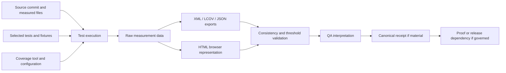

<!-- [KFM_META_BLOCK_V2]
doc_id: kfm://doc/artifacts-qa-coverage-readme
title: artifacts/qa/coverage/ — Coverage Measurement, Export, Inspection, and Non-Authority Boundary
type: readme; directory-readme; qa-output-parent; coverage-measurement-index; compatibility-boundary; inspection-and-ci-artifact-contract
version: v0.2
status: draft; repository-grounded; compatibility-root; transitional; mixed-scaffold; parent-readme-tracked; xml-scaffold-tracked; lcov-scaffold-tracked; html-child-readme-and-gitkeep-tracked; no-substantive-coverage-payload; coverage-producer-not-established; pytest-cov-not-declared; coverage-config-not-established; threshold-not-established; workflow-not-established; retention-not-established; reproducibility-unproven; release-binding-unestablished; non-authoritative
owners: OWNER_TBD — QA steward · Test architecture steward · Coverage steward · Package/application stewards · Security/privacy steward · CI and artifact-retention steward · Receipt/proof steward · Release steward · Docs steward
created: 2026-06-16
updated: 2026-07-16
supersedes: v0.1 bounded coverage-output contract
policy_label: public-doc; artifacts; qa; coverage; generated-output; line-coverage; branch-coverage; html; xml; lcov; inspection-only; no-secrets; no-trust-authority; no-release-authority; correction-aware; rollback-aware
current_path: artifacts/qa/coverage/README.md
truth_posture: CONFIRMED target README and prior blob, Directory Rules classification of artifacts as a transitional compatibility root, artifacts/qa QA-output boundary, canonical tests/ responsibility, direct tracked README.md plus scaffold coverage.xml plus scaffold lcov.info plus html/README.md plus html/.gitkeep, coverage.xml carrying scaffold identity with zero valid lines and no sources or packages, lcov.info carrying only a scaffold test name and end_of_record with no source or line records, grounded html child stating no payload or producer, root pyproject test extra declaring pytest but not pytest-cov, Makefile test and boundary targets running pytest without coverage options, contracts-validate workflow invoking make test, policy-boundary-guards workflow uploading JUnit XML rather than coverage output, root gitignore covering direct artifacts/qa/*.xml only and not this nested lane, bounded search surfacing no pytest-cov or cov-report configuration, and checked absence of coverage.json, coverage-summary.json, coverage-run.json, root .coveragerc, .github/workflows/coverage.yml, and .github/workflows/coverage-html.yml / PROPOSED canonical measurement profile, explicit source and test scope, line and branch policy, subprocess and concurrency handling, stable include and omit rules, immutable run manifest, generated-format consistency checks, non-vacuity guards, threshold ownership, comparable trend records, path normalization, source-excerpt redaction, CI artifact upload, access and expiry controls, canonical receipt linkage, correction, invalidation, supersession, and retirement procedure / CONFLICTED tracked zero-shaped XML and LCOV scaffolds versus no producer; v0.1 proposed inventory versus actual tracked scaffolds; parent acceptance of HTML output versus grounded child proving no generator; direct tracked generated-output paths versus no ignore or retention rule; Makefile help describing full test suite while make test is narrow; coverage percentage convenience versus correctness and release significance; and local QA output versus canonical run memory / UNKNOWN uncommitted local coverage files, package-local ignored outputs, CI-only reports, external coverage services, exhaustive package-local dependencies, actual measured modules, current line or branch coverage, active consumers, branch-protection significance, report freshness, retention, hosting, deployment, and production use / NEEDS VERIFICATION accepted owners, CODEOWNERS, complete recursive inventory, generated-output commit policy, coverage tool and version, canonical source scope, test selection, branch coverage, subprocess and concurrency behavior, include and omit patterns, threshold ownership, path normalization, generated-code policy, source-code rendering policy, secret and private-path scanning, workflow ownership, artifact retention, receipt/proof linkage, release significance, and rollback execution
evidence_snapshot:
  repository: bartytime4life/Kansas-Frontier-Matrix
  repository_id: "1059091169"
  visibility: public
  base_ref: main
  base_commit: abaa7d70ed73b90121d8359e4b6aae374b486db2
  target_prior_blob: a754e9eb5944f78f6c53e07f70c24e2c54c52559
  confirmed_lane_files:
    - artifacts/qa/coverage/README.md
    - artifacts/qa/coverage/coverage.xml
    - artifacts/qa/coverage/lcov.info
    - artifacts/qa/coverage/html/README.md
    - artifacts/qa/coverage/html/.gitkeep
  confirmed_lane_blobs:
    README.md: a754e9eb5944f78f6c53e07f70c24e2c54c52559
    coverage.xml: 03fb98310d6b849afc25ae3c4f144fbc3c4304c7
    lcov.info: 20c774579ad4357aa3f7d17cb560d73bb46e6256
    html/README.md: 4e713feeba93741969a034ab50a726f6f34dfa1f
    html/.gitkeep: fcb62937c89996c82854181cc1e61742b3e7a049
  checked_absent_paths:
    - artifacts/qa/coverage/coverage.json
    - artifacts/qa/coverage/coverage-summary.json
    - artifacts/qa/coverage/coverage-run.json
    - .coveragerc
    - .github/workflows/coverage.yml
    - .github/workflows/coverage-html.yml
  execution_surfaces:
    - pyproject.toml
    - Makefile
    - tests/README.md
    - .github/workflows/contracts-validate.yml
    - .github/workflows/policy-boundary-guards.yml
    - .gitignore
  bounded_inventory_note: tracked repository evidence cannot establish uncommitted local reports, CI workspaces, package-local ignored outputs, external coverage services, historical artifacts, dynamically generated configuration, branch-protection settings, or uninspected subprojects
related:
  - ../README.md
  - ../../README.md
  - ./html/README.md
  - ../../../docs/doctrine/directory-rules.md
  - ../../../tests/README.md
  - ../../../pyproject.toml
  - ../../../Makefile
  - ../../../.github/workflows/contracts-validate.yml
  - ../../../.github/workflows/policy-boundary-guards.yml
  - ../../../.gitignore
  - ../../../data/receipts/README.md
  - ../../../data/proofs/README.md
  - ../../../release/README.md
tags: [kfm, artifacts, qa, coverage, pytest, pytest-cov, coverage-py, xml, lcov, htmlcov, line-coverage, branch-coverage, non-vacuity, source-mapping, thresholds, trends, security, privacy, retention, ci-artifact, correction, rollback]
notes:
  - "v0.2 replaces blanket uncertainty and a proposed tree with a commit-pinned mixed-scaffold inventory."
  - "The tracked coverage.xml and lcov.info files are empty scaffolds, not evidence of zero-percent measured coverage."
  - "The HTML child contains a grounded contract and .gitkeep, but no generated HTML payload."
  - "No root coverage dependency, configuration, producer, threshold, workflow, consumer, or canonical binding was established."
  - "The root ignore rules do not protect this nested lane from accidental generated-report commits."
  - "Coverage measures observed execution within a declared scope; it does not prove correctness, policy compliance, evidence support, or release readiness."
  - "This revision changes documentation only."
[/KFM_META_BLOCK_V2] -->

<a id="top"></a>

# `artifacts/qa/coverage/` — Coverage Measurement, Export, Inspection, and Non-Authority Boundary

> **Purpose.** Define the parent staging boundary for generated coverage measurements and representations without allowing a percentage, empty scaffold, XML file, LCOV record, HTML page, badge, workflow result, or trend chart to become test authority, proof of correctness, policy compliance, evidence closure, release approval, publication, or production truth.

<p>
  
  
  
  
  
  
</p>

**Quick navigation:** [Status](#status-and-evidence-boundary) · [Purpose](#purpose-and-audience) · [Authority](#authority-and-directory-rules-basis) · [Inventory](#confirmed-current-inventory) · [Scaffolds](#current-scaffold-semantics) · [Model](#governed-coverage-model) · [Scope](#measurement-scope-contract) · [Execution](#test-execution-and-collection-contract) · [Formats](#output-format-and-routing-contract) · [Manifest](#proposed-coverage-run-manifest) · [Consistency](#cross-format-consistency-and-reproducibility) · [Thresholds](#thresholds-trends-and-comparability) · [Security](#security-privacy-and-source-exposure) · [Producer](#producer-contract) · [CI](#ci-artifact-access-and-retention) · [Validation](#validation-non-vacuity-and-finite-outcomes) · [Trust](#receipt-proof-release-and-publication-boundary) · [Correction](#correction-invalidation-and-rollback) · [Review](#review-burden-and-change-control) · [Done](#definition-of-done) · [Plan](#smallest-sound-implementation-sequence) · [Open](#open-verification-register) · [Evidence](#evidence-ledger) · [Rollback](#documentation-correction-and-rollback)

---

## Status and evidence boundary

> [!IMPORTANT]
> **Snapshot:** `main@abaa7d70ed73b90121d8359e4b6aae374b486db2`<br>
> **Prior README blob:** `a754e9eb5944f78f6c53e07f70c24e2c54c52559`<br>
> **Confirmed tracked files:** parent README, scaffold `coverage.xml`, scaffold `lcov.info`, grounded `html/README.md`, and `html/.gitkeep`<br>
> **Substantive measured coverage:** not established<br>
> **Coverage tool, configuration, threshold, producer, workflow, and consumer:** not established<br>
> **Generated-output ignore protection:** not established

`artifacts/qa/coverage/` is a repository-confirmed compatibility lane with **mixed scaffolding**, not an operational coverage system.

### Safe conclusion

| Capability | Status | Evidence-bounded conclusion |
|---|---:|---|
| Parent boundary README | `CONFIRMED` | A human coverage-output contract exists. |
| XML export | `SCAFFOLD ONLY` | `coverage.xml` has scaffold identity, zero valid lines, empty sources, and empty packages. |
| LCOV export | `SCAFFOLD ONLY` | `lcov.info` contains a scaffold test name and no source or line records. |
| HTML child | `CONTRACT + GITKEEP` | The child is retained, but no `index.html` or generated tree is established. |
| JSON export | `NOT ESTABLISHED` | Checked `coverage.json` is absent. |
| Run summary | `NOT ESTABLISHED` | Checked summary and run-manifest paths are absent. |
| Coverage dependency | `NOT ESTABLISHED` | Root test extras declare `pytest`, not `pytest-cov`. |
| Root test command | `NO COVERAGE` | `make test` runs a narrow suite without coverage options. |
| Contract workflow | `NO COVERAGE` | It installs root test extras and invokes `make test`. |
| Boundary workflow | `JUNIT ONLY` | It uploads JUnit XML, not coverage exports. |
| Coverage configuration | `NOT ESTABLISHED` | Root `.coveragerc` is absent; no `[tool.coverage.*]` block surfaced. |
| Source and test scope | `NOT ESTABLISHED` | No canonical measured package set or test tier is verified. |
| Line threshold | `NOT ESTABLISHED` | No accepted floor or owner is verified. |
| Branch threshold | `NOT ESTABLISHED` | No branch-measurement or floor policy is verified. |
| CI artifact retention | `NOT ESTABLISHED` | No coverage-specific upload, access, or expiry policy surfaced. |
| Report freshness | `UNKNOWN` | The tracked files are scaffolds, not run-bound output. |
| Canonical run binding | `NOT ESTABLISHED` | No receipt, proof, or release record is linked. |
| Repository-wide coverage | `UNKNOWN` | No full-suite command or measurement was established. |
| Correctness or release proof | `DENY` | Coverage cannot establish semantic correctness or releasability. |

### Truth labels

| Label | Meaning in this README |
|---|---|
| `CONFIRMED` | Verified from current repository files, exact paths, or bounded search. |
| `PROPOSED` | A recommended command, object, policy, threshold, or workflow not established as current implementation. |
| `CONFLICTED` | Current files or documentation create incompatible expectations. |
| `UNKNOWN` | Not observable or not established from inspected evidence. |
| `NEEDS VERIFICATION` | Checkable, but not sufficiently proven for operational reliance. |
| `DENY` | A prohibited trust, correctness, security, release, or publication interpretation. |

[Back to top](#top)

---

## Purpose and audience

This README is the parent operating contract for maintainers who measure, export, inspect, upload, compare, retain, or cite test coverage.

It is intended for:

- test architecture, QA, and coverage stewards;
- application, package, connector, pipeline, runtime, and tooling maintainers;
- CI and artifact-retention maintainers;
- reviewers evaluating missing test execution;
- security and privacy reviewers inspecting source excerpts and paths;
- receipt, proof, release, correction, and rollback stewards;
- documentation maintainers correcting stale coverage claims.

The durable question is:

> Can KFM describe exactly what a coverage run observed, preserve useful inspection outputs, and compare like with like without treating execution percentage as correctness, policy enforcement, evidence support, or release authority?

A valid coverage result is always scoped. Even 100% reported line and branch coverage can coexist with:

- incorrect assertions;
- missing negative tests;
- tautological fixtures;
- incorrect requirements;
- untested interactions or data combinations;
- race conditions and timing defects;
- external-system behavior not exercised;
- sensitive-lane denial failures;
- policy-engine gaps;
- source-role or evidence-resolution defects;
- accessibility, security, rights, or data-quality failures;
- deployment-specific behavior;
- excluded, generated, or dynamically loaded code.

### What this parent governs

This parent governs:

1. measurement identity and scope;
2. machine-readable coverage exports;
3. the human-browser child representation;
4. cross-format consistency;
5. non-vacuity and threshold interpretation;
6. generated-output security and privacy;
7. CI artifact, access, and retention behavior;
8. canonical receipt and release boundaries;
9. correction and invalidation.

It does not define source tests, source code, CI policy, release decisions, or proof objects.

[Back to top](#top)

---

## Authority and Directory Rules basis

`artifacts/` is a transitional compatibility root for derived, regenerable, non-authoritative material. `artifacts/qa/coverage/` inherits that classification through `artifacts/qa/`.

```text
tests/ and package-local tests             authored test authority
source roots                               code under measurement
pyproject / package configs                executable tool and scope configuration
.github/ and Makefile                      orchestration and CI behavior
artifacts/qa/coverage/                     generated measurement representations
artifacts/qa/coverage/html/                generated browser representation
data/receipts/ and data/proofs/            canonical run memory and evidence support
release/                                   governed release decisions
```

This parent may hold generated coverage representations. It must not become:

- a second test root;
- a source-code mirror;
- a package or tool configuration authority;
- a CI workflow home;
- a threshold-policy authority by filename alone;
- a canonical run receipt;
- an EvidenceBundle or proof home;
- a release gate or promotion record;
- a public documentation or hosting surface;
- a permanent archive of source excerpts;
- a shortcut around human review.

### Responsibility matrix

| Responsibility | Authority home | Role here |
|---|---|---|
| Test definitions | `tests/` and package-local test roots | Referenced by run identity only. |
| Code under measurement | application/package/connector/pipeline/runtime/tool roots | Referenced by source scope only. |
| Coverage dependency and configuration | root or package-owned build/test configuration | External executable authority. |
| CI orchestration | `.github/workflows/`, Make targets, package scripts | External producer authority. |
| Machine coverage exports | this parent | Generated inspection representation only. |
| Human HTML representation | `html/` child | Generated browser output only. |
| QA conclusions | review summaries or canonical receipts where material | Not inferred from a raw percentage. |
| Receipts and proofs | `data/receipts/`, `data/proofs/` | Canonical run memory and support. |
| Release decision | `release/` | Never established here. |
| Secrets and protected configuration | protected CI or secret manager | Never serialized here. |

### Public-surface rule

Normal UI surfaces and governed APIs must not read coverage output as operational truth. Coverage may inform maintainers, but public clients consume governed interfaces and released artifacts—not QA scratch.

[Back to top](#top)

---

## Confirmed current inventory

Bounded tracked evidence supports this direct and child inventory:

```text
artifacts/qa/coverage/
├── README.md
├── coverage.xml
├── lcov.info
└── html/
    ├── README.md
    └── .gitkeep
```

### Checked absent candidates

```text
artifacts/qa/coverage/coverage.json
artifacts/qa/coverage/coverage-summary.json
artifacts/qa/coverage/coverage-run.json
.coveragerc
.github/workflows/coverage.yml
.github/workflows/coverage-html.yml
```

### Inventory interpretation

| File | Current role | What it does not prove |
|---|---|---|
| `README.md` | Human parent contract | Operational producer, threshold, or CI enforcement |
| `coverage.xml` | Tracked XML scaffold | A test ran, a source was measured, or coverage is 0% |
| `lcov.info` | Tracked LCOV scaffold | A source file or line record exists |
| `html/README.md` | Grounded child contract | A browser report was generated |
| `html/.gitkeep` | Directory retention marker | A payload, producer, or retention policy exists |

Tracked repository evidence does not expose:

- uncommitted local reports;
- ignored package-local coverage files;
- CI runner workspaces;
- external coverage services;
- historical artifacts;
- dynamically generated configuration;
- branch-protection settings;
- package-local tools not surfaced by bounded search;
- production or deployment behavior.

[Back to top](#top)

---

## Current scaffold semantics

### `coverage.xml`

The tracked XML is:

- labeled `version="scaffold"`;
- assigned `timestamp="0"`;
- assigned line and branch rates of `0`;
- assigned zero covered and valid line/branch counts;
- empty under `<sources />`;
- empty under `<packages />`.

This is an **empty structural placeholder**.

> [!CAUTION]
> A rate of `0` with a denominator of zero is not evidence that measured source has 0% coverage. It means no substantive measured source or line inventory is present in the scaffold.

The file does not establish:

- a coverage tool or version;
- a source commit;
- a test command;
- a collected or executed test count;
- a measured package;
- executable lines;
- branch measurement;
- exclusions;
- threshold evaluation;
- report freshness;
- a CI run;
- a pass or failure.

### `lcov.info`

The tracked LCOV file contains only:

```text
TN:KFM scaffold
end_of_record
```

It does not contain substantive LCOV records such as:

- `SF:` source-file paths;
- `DA:` line data;
- `BRDA:` branch data;
- `LF:` lines found;
- `LH:` lines hit;
- `BRF:` branches found;
- `BRH:` branches hit.

It is therefore a placeholder—not measured 0% coverage.

### Scaffold handling rule

Until a generated-output policy is accepted:

1. do not overwrite tracked scaffolds silently;
2. do not treat a scaffold digest as a coverage-run digest;
3. do not publish a scaffold as a CI artifact named like a real report;
4. do not compare real output to the scaffold as a trend baseline;
5. do not infer failure or success from scaffold zeros;
6. replace, migrate, or retire scaffolds only with a documented change and rollback path.

### Generated-output commit conflict

The root ignore rules do not ignore this nested lane. A local producer could therefore modify tracked scaffolds or create large untracked output trees visible to Git.

That is a governance decision point, not an implementation detail. The repository must choose and document one of these postures:

| Posture | Description | Minimum control |
|---|---|---|
| CI-artifact only | Generate reports in CI/local workspace; do not commit payloads | Ignore rules, upload action, retention, manifest |
| Curated tracked baseline | Commit selected run-bound exports intentionally | Explicit owner, source commit, digest, update policy |
| External coverage service | Upload measurements to a governed service | Access, retention, privacy, commit binding |
| Retire compatibility lane | Remove tracked output placeholders | ADR or migration note if root compatibility changes |

Current accepted posture is `UNKNOWN`.

[Back to top](#top)

---

## Governed coverage model

Coverage has several distinct layers that must not collapse:



### Identity layers

| Identity | Required meaning |
|---|---|
| Source identity | Exact commit, dirty-tree state, and measured paths |
| Test identity | Exact test selection, collection count, execution outcome, and fixture profile |
| Tool identity | Coverage engine, adapter/plugin, Python/runtime, and configuration digest |
| Measurement identity | Raw measurement run and combine behavior |
| Representation identity | XML, LCOV, JSON, summary, and HTML outputs derived from that measurement |
| Threshold identity | Accepted policy version and evaluated metrics |
| CI identity | Workflow, run, job, attempt, matrix, and artifact identifiers |
| Canonical identity | Receipt/proof/release references, if significance requires them |

A file named `coverage.xml` or `lcov.info` does not supply these identities by itself.

### Source of truth order

For a coverage claim, prefer:

1. accepted measurement configuration;
2. run-bound source/test/tool identity;
3. raw measurement or a verified export;
4. cross-format consistency checks;
5. threshold evaluation;
6. canonical receipt or review record, if material;
7. human summary.

A badge or README statement is never first-order evidence.

[Back to top](#top)

---

## Measurement scope contract

Coverage is interpretable only when the measured universe is explicit.

### Required source-scope fields

A governed measurement profile should declare:

- included source roots;
- omitted source roots;
- package/module selection;
- generated-code handling;
- migrations and vendored-code handling;
- test-code inclusion or exclusion;
- namespace-package handling;
- dynamic import behavior;
- plugin-loaded modules;
- file-extension policy;
- line and branch measurement mode;
- platform-specific modules;
- unsupported or intentionally unmeasured components.

### Required test-scope fields

The run must declare:

- exact pytest selectors or other runner selectors;
- test tiers included;
- package-local suites included;
- integration and E2E inclusion;
- policy/deny-path inclusion;
- browser/runtime inclusion;
- live-network tests included or denied;
- skipped, xfailed, deselected, failed, and errored counts;
- shard/matrix identity;
- retry behavior;
- test collection digest where practical.

### Repository-specific scope warning

Current repository evidence establishes that `make test` runs only:

```text
tests/schemas
tests/contracts
```

It does not establish repository-wide test collection. A coverage report produced from `make test` must not be labeled:

- full repository coverage;
- all-test coverage;
- application coverage;
- connector coverage;
- pipeline coverage;
- runtime coverage;
- policy coverage;
- release coverage.

Its label must name the actual selected scope.

### Dirty-tree rule

A run must record whether source or tests differed from the referenced commit.

Allowed states:

| State | Interpretation |
|---|---|
| `clean` | Source and tests match the referenced commit. |
| `dirty-recorded` | Differences are captured and the run is local/non-release. |
| `dirty-unknown` | `HOLD` or `ABSTAIN`; result is not comparable. |
| `unavailable` | `ABSTAIN` unless an accepted immutable source identity exists elsewhere. |

### Include and omit discipline

Omissions must be:

- explicit;
- version controlled;
- justified;
- reviewable;
- consistent across formats;
- included in trend comparability checks;
- unable to expand silently.

A threshold can be satisfied dishonestly by narrowing scope. Scope changes therefore require review separate from percentage changes.

[Back to top](#top)

---

## Test execution and collection contract

Coverage is downstream of test execution.

### Minimum execution evidence

A meaningful run should record:

- tests collected;
- tests executed;
- tests passed;
- tests failed;
- tests errored;
- tests skipped;
- tests xfailed/xpassed;
- tests deselected;
- execution duration;
- runner exit code;
- timeout or cancellation state;
- retry count;
- shard or matrix completion.

### Failure interpretation

Coverage output may be produced after test failures for debugging. That is allowed, but the outcome must remain distinct:

| Test state | Coverage representation | Coverage-gate interpretation |
|---|---|---|
| All required tests pass | May be evaluated | Continue to non-vacuity and thresholds |
| Required test fails | May be retained for inspection | `FAIL`; do not call coverage gate passed |
| Test process errors | Partial output possible | `ERROR` or `HOLD` |
| Job cancelled | Partial output possible | `ABSTAIN` or `ERROR` |
| No tests collected | Output invalid for a passing claim | `ABSTAIN` or `FAIL` |
| All tests deselected | Output invalid for a passing claim | `ABSTAIN` |
| Only trivial smoke test runs | Scope-limited result | Must be labeled narrowly |

### Subprocess and concurrency

The measurement profile must state whether it captures:

- subprocesses;
- multiprocessing;
- threads;
- async tasks;
- xdist workers;
- parallel CI shards;
- browser-side JavaScript;
- spawned CLIs;
- child interpreters;
- coverage data combination.

A single-process report must not silently claim multi-process completeness.

### Contexts

When supported and useful, measurement contexts may distinguish:

- test function;
- test tier;
- package;
- workflow job;
- matrix shard;
- domain;
- policy/negative-path class.

Contexts are diagnostic metadata, not proof.

### Nonempty denominator

At least one substantive source file and one executable line must be measured before a line percentage is meaningful. At least one branch opportunity must exist before a branch percentage is meaningful.

Zero denominators must be represented as `not_applicable` or `not_measured`, not as a passing 100% or failing 0%.

[Back to top](#top)

---

## Output format and routing contract

### Current and proposed representations

| Representation | Current status | Intended role |
|---|---:|---|
| `coverage.xml` | Tracked scaffold | Machine exchange, commonly Cobertura-like |
| `lcov.info` | Tracked scaffold | Machine exchange for LCOV consumers |
| `coverage.json` | Absent / `PROPOSED` | Detailed machine-readable measurement |
| `coverage-summary.json` | Absent / `PROPOSED` | Compact metric summary |
| `coverage-run.json` | Absent / `PROPOSED` | Run identity and governance context |
| `html/` | Contract + `.gitkeep`; no payload | Human source/line inspection |
| Raw `.coverage*` files | Not established | Local combine input; generally ephemeral |
| Badge payload | Not established | Derived display only; never authoritative |

### Parent versus child routing

Use this parent for:

- machine-readable exports;
- compact summaries;
- run metadata;
- cross-format inventory;
- human navigation to child representations.

Use `html/` for:

- generated HTML pages;
- CSS, JS, fonts, and static report assets;
- per-source browser views;
- a generated report entry page.

Do not place:

- JUnit XML here merely because it is XML;
- test logs here merely because they accompany coverage;
- source tests or source code here;
- receipts or proofs here;
- release decisions here;
- public documentation here.

JUnit and other non-coverage QA outputs belong under the appropriate QA lane or CI artifact name.

### File naming

If one rolling workspace is used, conventional names may be accepted only when the run manifest identifies the source.

If multiple retained runs are allowed, prefer run-scoped paths:

```text
artifacts/qa/coverage/
└── <run_id>/
    ├── coverage-run.json
    ├── coverage.xml
    ├── coverage.json
    ├── lcov.info
    ├── coverage-summary.json
    └── html/
        └── index.html
```

That shape is `PROPOSED`, not current repo fact.

### Atomic publication inside the lane

A producer should:

1. generate into a temporary run directory;
2. validate files and manifest;
3. scan for unsafe content;
4. compare cross-format metrics;
5. atomically expose the completed run directory or CI artifact;
6. remove incomplete output on failure.

A partially written `index.html` or XML file must not be presented as a complete report.

[Back to top](#top)

---

## Proposed coverage-run manifest

A non-authoritative `coverage-run.json` may bind representations to one measurement.

```json
{
  "schema_version": "PROPOSED",
  "run_id": "coverage-<immutable-id>",
  "status": "PROPOSED",
  "source": {
    "repository": "bartytime4life/Kansas-Frontier-Matrix",
    "git_sha": "<40-hex>",
    "dirty_tree": false
  },
  "execution": {
    "runner": "pytest",
    "runner_version": "<version>",
    "command_id": "<accepted-command-id>",
    "tests_collected": 0,
    "tests_executed": 0,
    "tests_failed": 0,
    "tests_skipped": 0,
    "exit_code": 0
  },
  "measurement": {
    "tool": "<coverage-tool>",
    "tool_version": "<version>",
    "configuration_sha256": "<sha256>",
    "line_enabled": true,
    "branch_enabled": true,
    "parallel_mode": false,
    "combined_data_files": 0
  },
  "scope": {
    "include": [],
    "omit": [],
    "test_selectors": [],
    "generated_code_policy": "<policy-id>"
  },
  "metrics": {
    "files_measured": 0,
    "lines_valid": 0,
    "lines_covered": 0,
    "line_rate": null,
    "branches_valid": 0,
    "branches_covered": 0,
    "branch_rate": null
  },
  "outputs": [
    {
      "path": "coverage.xml",
      "media_type": "application/xml",
      "sha256": "<sha256>"
    }
  ],
  "threshold": {
    "policy_ref": null,
    "outcome": "NOT_EVALUATED"
  },
  "ci": {
    "workflow": null,
    "run_id": null,
    "job_id": null,
    "attempt": null
  },
  "canonical_refs": {
    "receipt_ref": null,
    "proof_ref": null,
    "release_ref": null
  }
}
```

### Manifest requirements

A future accepted manifest must define:

- closed or extensible schema behavior;
- required fields;
- null semantics;
- stable identifier format;
- canonical serialization;
- digest algorithm;
- path normalization;
- metric precision and rounding;
- zero-denominator handling;
- representation inventory;
- correction and supersession linkage;
- sensitivity classification;
- retention class.

### Manifest non-authority

The local manifest is an index of generated QA representations. It is not:

- a test receipt;
- a ValidationReport;
- an EvidenceBundle;
- a release manifest;
- a branch-protection rule;
- a policy decision.

If a coverage result matters to a governed decision, a canonical object elsewhere must cite the run or output digest.

[Back to top](#top)

---

## Cross-format consistency and reproducibility

### One measurement, multiple representations

XML, LCOV, JSON, summary, and HTML should derive from the same underlying measurement data.

Required consistency checks should compare:

- source commit;
- measured file set;
- line totals;
- covered-line totals;
- branch totals;
- covered-branch totals;
- include/omit configuration;
- generation timestamp or run identity;
- tool version;
- report status.

### Precision and rounding

Formats may represent rates differently. An accepted comparison profile must define:

- integer counts as primary;
- decimal precision;
- rounding mode;
- percentage display precision;
- tolerance for derived rates;
- `null`/not-applicable handling.

Do not compare rounded badge text when integer counts are available.

### Reproducibility classes

Coverage is often environment-sensitive. Distinguish:

| Class | Meaning |
|---|---|
| `measurement-identical` | Same source/test/tool/config produces identical raw counts and file set |
| `semantically-equivalent` | Counts and scope match; generated bytes differ for acceptable metadata reasons |
| `representation-identical` | A specific export is byte-identical |
| `non-comparable` | Source, tests, tool, config, platform, or scope differ materially |
| `unknown` | Required comparison identity is missing |

Byte identity of HTML is not required to establish equal measurement, but unexplained changes must not be ignored.

### Independent rerun

Before claiming reproducibility:

1. start from the same clean source commit;
2. use the same accepted dependency/tool lock;
3. use the same test and source scope;
4. run independently;
5. compare raw counts and file inventory;
6. compare normalized representations;
7. record acceptable differences;
8. emit a bounded outcome.

A copied report is not an independent rerun.

### Stale-output detection

A validator should reject or hold a report when:

- source commit does not match;
- dirty-tree state is missing;
- report predates changed source/tests;
- output digest does not match the manifest;
- HTML and machine formats disagree;
- tool/config identity is missing;
- the report is a known scaffold;
- the run was cancelled or incomplete.

[Back to top](#top)

---

## Thresholds, trends, and comparability

### Threshold authority

A threshold must be defined in an accepted configuration or governed CI policy—not inferred from:

- a README example;
- a badge;
- yesterday's percentage;
- a scaffold;
- an external service default;
- a reviewer preference stated only in comments.

### Threshold dimensions

Possible dimensions include:

- overall line rate;
- overall branch rate;
- changed-line rate;
- changed-branch rate;
- package-specific floors;
- critical-lane floors;
- untested-file count;
- regression tolerance;
- required negative-path coverage;
- required policy-denial coverage.

Each dimension requires an owner and rationale.

### Changed-line coverage

Changed-line metrics can be useful but must identify:

- comparison base;
- merge-base algorithm;
- rename handling;
- generated files;
- deleted lines;
- unmeasurable lines;
- shallow checkout behavior;
- fork/PR permissions;
- rounding and minimum denominator.

Changed-line coverage does not replace overall coverage or targeted tests.

### Trend comparability key

Two runs are comparable only when material identity matches, including:

```text
source-scope profile
test-selection profile
coverage tool and version
branch mode
include/omit configuration
generated-code policy
subprocess/concurrency mode
platform/runtime class
```

If any key changes, the trend must be segmented or labeled non-comparable.

### Regression interpretation

A percentage decrease can result from:

- additional measured code;
- removed exclusions;
- branch measurement enabled;
- expanded test scope;
- bug fixes in instrumentation;
- actual lost test execution.

A percentage increase can result from:

- reduced measured scope;
- new exclusions;
- missing subprocess data;
- deleted low-covered code;
- actual added tests.

Review counts and scope before judging the percentage.

### Threshold outcomes

| Condition | Outcome |
|---|---|
| Valid substantive run meets accepted threshold | `PASS` |
| Valid substantive run misses threshold | `FAIL` |
| Threshold absent | `NOT_EVALUATED` or `HOLD`, never implied pass |
| Zero denominator | `ABSTAIN` / `NOT_APPLICABLE` |
| Scope mismatch | `HOLD` or `NON_COMPARABLE` |
| Tool/config identity missing | `HOLD` |
| Unsafe report content | `DENY` |
| Measurement process error | `ERROR` |

[Back to top](#top)

---

## Security, privacy, and source exposure

Coverage exports can disclose more than percentages.

### Potential exposure

Reports may include:

- absolute workspace paths;
- usernames and home directories;
- repository layout;
- package and module names;
- source excerpts;
- comments and strings from source code;
- internal endpoints;
- fixture values;
- generated file paths;
- test names;
- environment labels;
- branch names;
- CI metadata;
- query parameters;
- secrets accidentally embedded in source or generated files.

### Minimum controls

Before retaining or uploading a report:

- normalize or relativize paths;
- deny credentials, tokens, keys, and secret-like values;
- deny private endpoints and deployment-only identifiers;
- review source excerpt policy;
- exclude protected fixtures and generated sensitive outputs;
- deny external scripts, stylesheets, fonts, analytics, or remote images by default;
- disable active content not required by the report;
- inspect HTML for unexpected links and source maps;
- apply least-privilege artifact access;
- use short retention for unreviewed source-rendering output.

### Source excerpt policy

The parent must not assume HTML source rendering is always safe.

Acceptable profiles may include:

| Profile | Behavior |
|---|---|
| `internal-source-render` | Full excerpts, restricted artifact access, short retention |
| `path-only` | File paths and metrics without source lines |
| `redacted-source-render` | Approved redaction transform before output |
| `no-html` | Machine exports only |
| `public-safe-summary` | Aggregate metrics only; no source/path detail |

No public-safe profile is established in current evidence.

### Sensitive domains and fixtures

Coverage for sensitive lanes may expose:

- names or identifiers in fixtures;
- precise ecological or archaeological locations;
- private land or infrastructure data;
- consent, DNA, or living-person data;
- internal policy reason codes;
- restricted source metadata.

Where exposure is uncertain, prefer:

- restricted CI artifacts;
- redacted or synthetic fixtures;
- path-only reports;
- no HTML retention;
- denial of upload;
- quarantine and review.

### External services

Uploading to an external coverage service requires verification of:

- repository visibility;
- data processor terms;
- source upload behavior;
- token permissions;
- fork-PR behavior;
- retention and deletion;
- region and sovereignty constraints;
- secret handling;
- private path and source disclosure;
- correction and withdrawal capability.

No external service is established here.

[Back to top](#top)

---

## Producer contract

No coverage producer is established by current repository evidence.

A future producer should accept explicit inputs:

```text
source git SHA
dirty-tree state
test selectors
source include/omit profile
coverage configuration
tool and runtime versions
branch/subprocess/concurrency mode
output directory
threshold policy reference
retention class
```

It should emit:

```text
raw measurement or combine result
coverage-run.json
coverage.xml
coverage.json when accepted
lcov.info when accepted
coverage-summary.json
html/ when allowed
validation outcome
artifact inventory and digests
```

### Proposed Python producer flow

The following is illustrative only:

```bash
# PROPOSED — not a current repository command
python -m coverage erase
python -m coverage run --branch -m pytest <accepted-test-selection>
python -m coverage combine
python -m coverage xml -o artifacts/qa/coverage/coverage.xml
python -m coverage json -o artifacts/qa/coverage/coverage.json
python -m coverage lcov -o artifacts/qa/coverage/lcov.info
python -m coverage html -d artifacts/qa/coverage/html
```

This example is not executable evidence because:

- the root does not declare the coverage tool;
- no configuration is accepted;
- no source/test scope is accepted;
- no branch or parallel policy is accepted;
- no workflow invokes it;
- no output retention posture is accepted.

An accepted implementation may instead use `pytest-cov`, a JavaScript coverage tool, or package-specific producers. The repository must document how heterogeneous measurements are separated and aggregated.

### Producer preconditions

Before writing:

- source identity must resolve;
- test and source scope must be nonempty;
- output directory must be safe to replace;
- tracked scaffold behavior must be explicit;
- stale output must be removed;
- tool/config identity must be available;
- network behavior must match policy;
- secrets must not be copied from ambient environment.

### Producer failure cleanup

On failure:

- mark or remove incomplete output;
- do not leave stale prior output looking current;
- preserve logs in the appropriate QA/CI lane;
- retain raw data only when needed for diagnosis;
- record the failure outcome;
- do not update a `latest` pointer;
- do not emit a passing badge;
- do not bind the run to release state.

[Back to top](#top)

---

## CI artifact access and retention

### Current CI evidence

Current inspected workflows show:

- `contracts-validate` installs root test extras and runs `make test`;
- `make test` does not request coverage;
- `policy-boundary-guards` installs pytest and runs a boundary target;
- the boundary target emits JUnit XML directly under `artifacts/qa/`;
- the workflow uploads that JUnit XML;
- no coverage-specific workflow or upload path was established.

A green workflow elsewhere does not establish coverage generation.

### Separation of checks

Recommended CI separation:

| Check | Purpose |
|---|---|
| Test execution | Did required tests pass? |
| Coverage measurement | Was a substantive measurement produced? |
| Report validation | Are formats consistent, complete, and safe? |
| Threshold evaluation | Did accepted floors pass? |
| Artifact upload | Can reviewers inspect the bounded output? |
| Release dependency | Does a governed release require this result? |

These may run in one workflow, but their outcomes must remain distinct.

### Access classes

| Class | Intended access |
|---|---|
| `aggregate-public-safe` | Approved aggregate metrics without source/path detail |
| `reviewer` | Repository reviewers and maintainers |
| `restricted-source` | Least-privilege access when source or sensitive fixture detail is rendered |
| `local-only` | No upload |
| `denied` | Unsafe output must not be retained |

### Proposed retention classes

| Class | Example | Proposed posture |
|---|---|---|
| PR diagnostic | Failed/partial report for review | Short expiry |
| Accepted PR report | Full run for a reviewed change | Bounded expiry |
| Main trend input | Normalized summary and manifest | Longer governed retention |
| Release-significant record | Digest-linked canonical receipt | Canonical home elsewhere |
| Unsafe report | Secret/protected detail detected | Delete or quarantine immediately |
| Scaffold | Structural placeholder | Retain only until migration decision |

Exact durations remain `NEEDS VERIFICATION`.

### CI artifact naming

Artifact names should include enough identity to avoid collision:

```text
coverage-<scope-id>-<git-sha-short>-<run-attempt>
```

Do not use only `coverage` when multiple scopes or matrix jobs exist.

### Fork and untrusted PRs

For untrusted contributions:

- do not expose write tokens;
- do not upload to privileged external services;
- do not render secrets from protected configuration;
- restrict source-containing artifacts;
- separate pull-request and trusted post-merge workflows;
- ensure report generation cannot execute unreviewed post-processing with secrets.

[Back to top](#top)

---

## Validation, non-vacuity, and finite outcomes

### Validation layers

A useful validator should distinguish:

1. **Inventory validation** — expected files and manifest exist.
2. **Syntax validation** — XML, JSON, LCOV, and HTML parse.
3. **Identity validation** — source/test/tool/config/run fields resolve.
4. **Non-vacuity validation** — substantive tests and executable source were measured.
5. **Cross-format validation** — counts and file sets agree.
6. **Scope validation** — include/omit and test selectors match accepted profiles.
7. **Security validation** — no prohibited paths, secrets, endpoints, or active content.
8. **Freshness validation** — output matches current run identity.
9. **Threshold validation** — accepted floors evaluated.
10. **Canonical-binding validation** — receipt/proof/release references resolve when required.

A syntax-valid scaffold can still fail identity and non-vacuity.

### Non-vacuity requirements

A passing substantive measurement should require:

- test collection greater than zero;
- required tests actually executed;
- no fatal test-process error;
- measured file count greater than zero;
- valid executable line count greater than zero;
- branch denominator greater than zero when branch threshold applies;
- at least one output representation with a matching digest;
- no known scaffold marker;
- source and test scope resolved;
- no silent all-file omission;
- no stale prior report substitution;
- no empty shard accepted as the aggregate;
- all required shards combined or explicitly excluded.

### Anti-tautology checks

Reviewers should reject or hold results where:

- the test only asserts that the report file exists;
- the validator validates output it generated from its own expected constants;
- the threshold is derived from the measured result;
- exclusions are expanded until the threshold passes;
- an empty XML document is treated as 0% or 100% coverage;
- an LCOV file with no `SF` records is treated as measured;
- an HTML index links only to itself;
- a copied previous report is relabeled with a new run id;
- all failing tests are omitted from the coverage command;
- skipped tests are presented as covered behavior;
- only generated code is measured;
- percentage text is parsed instead of canonical integer counts.

### Finite outcomes

| Outcome | Meaning |
|---|---|
| `PASS` | Substantive run is valid, safe, scope-correct, consistent, and meets accepted thresholds |
| `FAIL` | Substantive run is valid but tests or thresholds fail |
| `HOLD` | Checkable identity, policy, ownership, scope, or review requirement is unresolved |
| `ABSTAIN` | Measurement is absent, vacuous, stale, cancelled, zero-denominator, or not comparable |
| `DENY` | Output exposes prohibited information or is being used to bypass authority/release boundaries |
| `ERROR` | Producer, parser, combine step, validator, or storage operation failed |
| `NOT_EVALUATED` | A metric exists but no accepted threshold applies |

Do not collapse `ABSTAIN`, `HOLD`, or `NOT_EVALUATED` into `PASS`.

### Minimum validation report fields

A structured validation result should include:

- run id;
- source commit;
- measurement scope id;
- test profile id;
- tool/config digest;
- outcome;
- reason codes;
- test and source non-vacuity counts;
- format consistency summary;
- threshold policy and result;
- security-scan result;
- output digests;
- reviewer or canonical references where required.

The canonical object family and schema home remain `PROPOSED`.

[Back to top](#top)

---

## Receipt, proof, release, and publication boundary

Coverage output is derived QA material.

```text
coverage exports
    ↓ inspected and validated
QA interpretation
    ↓ if governance-significant
canonical receipt / review record
    ↓ if independently supported
proof or attestation
    ↓ if a release gate requires it
ReleaseManifest decision
```

### What coverage may support

Coverage may support a bounded claim such as:

> For source commit X, test profile Y, measurement profile Z, and tool/config digest D, the listed executable lines and branches were observed during the recorded run, and the accepted threshold policy returned outcome O.

Coverage cannot support by itself:

- the code is correct;
- every requirement is tested;
- policy is enforced;
- evidence resolves;
- data is valid;
- sensitive behavior is safe;
- the build is reproducible;
- the release is approved;
- publication is authorized;
- production matches the test environment.

### Receipt boundary

If material, a canonical receipt should reference:

- run identity;
- source/test/tool/config identity;
- measurement profile;
- output digest(s);
- validation outcome;
- threshold outcome;
- known limitations;
- correction/supersession state.

Do not store the receipt in this lane.

### Proof boundary

A proof or attestation may establish integrity or process facts. It still does not transform coverage into semantic proof.

### Release boundary

If a release policy requires coverage:

- the requirement must be explicit;
- the accepted scope and threshold must be versioned;
- the ReleaseManifest must reference the canonical decision evidence;
- missing or invalid coverage must produce a finite fail-safe outcome;
- this directory's mere contents cannot satisfy the gate.

### Publication boundary

Coverage reports are not normal public products. Publishing source-rendering reports requires separate rights, privacy, security, and release review.

[Back to top](#top)

---

## Correction, invalidation, and rollback

### Invalidation triggers

Invalidate or supersede a report when:

- source commit identity is wrong;
- tests or scope were mislabeled;
- tool/config identity is wrong;
- data combination omitted workers or shards;
- report files disagree;
- a scaffold was mistaken for a real run;
- stale output was uploaded;
- paths or source excerpts expose protected information;
- a threshold was misapplied;
- an exclusion was unauthorized;
- a digest is wrong;
- a canonical record references the wrong output.

### Correction flow

1. prevent further reliance or access;
2. identify affected runs, artifacts, comments, badges, and canonical references;
3. record the defect and reason;
4. remove or restrict unsafe output;
5. regenerate from accepted inputs where possible;
6. validate independently;
7. supersede rather than silently overwrite retained evidence;
8. update canonical receipts or correction records where material;
9. invalidate caches and external service state;
10. preserve a transparent rollback target.

### Stale report handling

A stale report must be labeled or removed. It must not remain at a stable URL without visible source/run identity.

### Rollback targets

Potential rollback targets include:

- prior README blob;
- prior accepted measurement profile;
- prior CI workflow revision;
- prior threshold policy;
- prior run artifact;
- prior canonical receipt reference.

Rolling back a report does not roll back source code. Rolling back source code does not automatically validate or restore a report.

### Withdrawal

Withdraw output when it cannot be corrected safely, especially after:

- secret exposure;
- protected source/fixture exposure;
- unauthorized external upload;
- rights or sovereignty conflict;
- irrecoverable identity ambiguity.

[Back to top](#top)

---

## Review burden and change control

### Review matrix

| Change | Minimum review |
|---|---|
| README clarification only | Docs + QA/test steward |
| Tool or plugin introduction | Test architecture + dependency/security review |
| Source/include/omit change | Coverage owner + affected code owners |
| Test-profile change | Test owner + affected subsystem owners |
| Threshold change | QA/test architecture + affected stewards |
| Branch/subprocess/concurrency change | Coverage/tooling + CI review |
| HTML source-rendering policy | Security/privacy + affected code owners |
| External service integration | Security, privacy, infra, legal/rights as applicable |
| Retention/access change | CI/artifact + security/privacy |
| Release-gate dependency | Release steward + policy/QA owners |
| Root compatibility migration | Directory Rules/ADR review |

### Review questions

Reviewers should ask:

- What exactly is measured?
- Which tests actually executed?
- Are all required shards and subprocesses included?
- Is the denominator nonzero?
- Are exclusions justified?
- Did the source/test/tool/config identity change?
- Do XML, LCOV, JSON, summary, and HTML agree?
- Does the output expose source or private paths?
- Is the threshold accepted and versioned?
- Is the trend comparison valid?
- Is the result being asked to prove more than coverage can prove?
- Is the correct canonical object referenced?
- Can the output be corrected, withdrawn, and expired?

### Smallest reversible change

Prefer:

- adding run identity before adding a badge;
- validating current scaffolds before generating payloads;
- one explicit source/test profile before a repository-wide aggregate;
- CI artifacts before committing large output trees;
- an allowlist before broad source rendering;
- a threshold with reason codes before promotion gating;
- correction support before long retention.

[Back to top](#top)

---

## Definition of done

This coverage parent is operationally complete only when:

- [ ] owners and CODEOWNERS are accepted;
- [ ] retain/migrate/retire posture is accepted;
- [ ] tracked scaffold disposition is documented;
- [ ] coverage tool and version are declared;
- [ ] tool dependency is reproducibly installed;
- [ ] source scope is explicit and nonempty;
- [ ] test profile is explicit and nonempty;
- [ ] include and omit rules are versioned;
- [ ] generated-code policy is explicit;
- [ ] line and branch modes are explicit;
- [ ] subprocess/concurrency behavior is explicit;
- [ ] dirty-tree behavior is explicit;
- [ ] run-manifest shape is accepted;
- [ ] XML/LCOV/JSON/summary/HTML routing is accepted;
- [ ] cross-format validation exists;
- [ ] scaffold detection exists;
- [ ] zero-denominator handling exists;
- [ ] non-vacuity checks exist;
- [ ] threshold ownership and policy are accepted;
- [ ] trend comparability rules exist;
- [ ] path normalization exists;
- [ ] source-excerpt policy is accepted;
- [ ] secret and protected-detail scanning exists;
- [ ] CI workflow and artifact upload exist;
- [ ] access and retention classes are enforced;
- [ ] failure cleanup prevents stale output;
- [ ] correction and supersession work;
- [ ] canonical receipt linkage exists where required;
- [ ] release dependency is explicit where applicable;
- [ ] documentation and tests match behavior;
- [ ] independent rerun evidence exists before reproducibility claims;
- [ ] no public client treats coverage output as truth.

A percentage alone satisfies none of these completion criteria.

[Back to top](#top)

---

## Smallest sound implementation sequence

### Phase 1 — Decide output lifecycle

- choose CI-artifact, curated tracked, external-service, or retirement posture;
- document tracked scaffold handling;
- add explicit ignore/retention rules as appropriate;
- assign owners.

**Rollback:** restore documentation and scaffold state; no runtime effect.

### Phase 2 — Establish one measurement profile

- select one bounded source scope;
- select one substantive test profile;
- add an accepted coverage dependency and configuration;
- define line/branch/subprocess behavior;
- define include/omit and generated-code policy.

**Validation:** nonempty test collection and measured source.

### Phase 3 — Emit run identity and machine formats

- generate run manifest;
- emit XML and one detailed machine format;
- retain LCOV only if a consumer exists;
- detect and reject scaffolds;
- compute digests.

**Validation:** syntax, identity, non-vacuity, and cross-format counts.

### Phase 4 — Add HTML safely

- generate the HTML child from the same measurement;
- normalize paths;
- select source-excerpt profile;
- scan secrets and protected details;
- validate links/assets.

**Validation:** child manifest/output identity matches parent.

### Phase 5 — Wire CI and retention

- create a coverage-specific job;
- separate test, measurement, validation, threshold, and upload outcomes;
- apply least-privilege access and expiry;
- handle forks safely;
- remove incomplete output.

**Validation:** artifact download reproduces manifest digests.

### Phase 6 — Add threshold and trends

- accept threshold ownership and reason codes;
- add comparability key;
- distinguish full, package, changed-line, and critical-lane metrics;
- record non-comparable changes.

**Validation:** negative fixtures exercise threshold, scope drift, zero denominators, and stale output.

### Phase 7 — Bind governance where justified

- emit canonical receipt references for governance-significant runs;
- make release dependency explicit rather than implied;
- add correction, supersession, and withdrawal consumers;
- decide long-term compatibility-lane disposition.

**Validation:** end-to-end correction and rollback drill.

[Back to top](#top)

---

## Open verification register

| ID | Verification item | Current status | Why it matters |
|---|---|---:|---|
| COV-01 | Confirm accepted owners and CODEOWNERS | `NEEDS VERIFICATION` | Establishes review authority |
| COV-02 | Confirm complete recursive tracked inventory | `NEEDS VERIFICATION` | Prevents hidden parallel output homes |
| COV-03 | Decide retain, migrate, externalize, or retire | `NEEDS VERIFICATION` | Resolves compatibility posture |
| COV-04 | Decide generated-output commit policy | `NEEDS VERIFICATION` | Controls repository growth and stale output |
| COV-05 | Decide tracked XML/LCOV scaffold disposition | `NEEDS VERIFICATION` | Prevents scaffold confusion |
| COV-06 | Confirm canonical coverage tool | `NEEDS VERIFICATION` | Required for executable claims |
| COV-07 | Confirm tool and plugin versions | `NEEDS VERIFICATION` | Required for comparability |
| COV-08 | Confirm dependency lock and install path | `NEEDS VERIFICATION` | Required for reproducibility |
| COV-09 | Confirm root versus package-local coverage ownership | `NEEDS VERIFICATION` | Avoids misleading aggregation |
| COV-10 | Confirm canonical source scope | `NEEDS VERIFICATION` | Defines denominator |
| COV-11 | Confirm canonical test profile | `NEEDS VERIFICATION` | Defines observed execution |
| COV-12 | Confirm line-coverage mode | `NEEDS VERIFICATION` | Defines metric |
| COV-13 | Confirm branch-coverage mode | `NEEDS VERIFICATION` | Defines metric |
| COV-14 | Confirm subprocess and multiprocessing handling | `NEEDS VERIFICATION` | Prevents missing execution |
| COV-15 | Confirm parallel/shard combine behavior | `NEEDS VERIFICATION` | Prevents partial aggregate |
| COV-16 | Confirm include patterns | `NEEDS VERIFICATION` | Defines measured source |
| COV-17 | Confirm omit patterns and justification | `NEEDS VERIFICATION` | Prevents threshold gaming |
| COV-18 | Confirm generated-code policy | `NEEDS VERIFICATION` | Defines comparability |
| COV-19 | Confirm test-code measurement policy | `NEEDS VERIFICATION` | Defines scope |
| COV-20 | Confirm dirty-tree policy | `NEEDS VERIFICATION` | Protects source identity |
| COV-21 | Confirm zero-denominator semantics | `NEEDS VERIFICATION` | Prevents false percentages |
| COV-22 | Confirm run-manifest schema home | `NEEDS VERIFICATION` | Defines machine shape |
| COV-23 | Confirm stable run-id convention | `NEEDS VERIFICATION` | Prevents collisions |
| COV-24 | Confirm XML profile and consumers | `NEEDS VERIFICATION` | Avoids unused exports |
| COV-25 | Confirm LCOV profile and consumers | `NEEDS VERIFICATION` | Avoids unused exports |
| COV-26 | Confirm JSON and summary formats | `NEEDS VERIFICATION` | Supports precise validation |
| COV-27 | Confirm HTML source-rendering profile | `NEEDS VERIFICATION` | Controls exposure |
| COV-28 | Confirm path normalization | `NEEDS VERIFICATION` | Protects privacy/comparability |
| COV-29 | Confirm secret and private-endpoint scanning | `NEEDS VERIFICATION` | Protects sensitive data |
| COV-30 | Confirm external-asset and active-content policy | `NEEDS VERIFICATION` | Protects offline/security posture |
| COV-31 | Confirm cross-format validator | `NEEDS VERIFICATION` | Prevents inconsistent representations |
| COV-32 | Confirm non-vacuity validator | `NEEDS VERIFICATION` | Prevents empty passing runs |
| COV-33 | Confirm scaffold detector | `NEEDS VERIFICATION` | Prevents placeholders becoming evidence |
| COV-34 | Confirm threshold owner and policy | `NEEDS VERIFICATION` | Required for pass/fail meaning |
| COV-35 | Confirm changed-line coverage policy | `NEEDS VERIFICATION` | Prevents ambiguous PR gates |
| COV-36 | Confirm trend comparability key | `NEEDS VERIFICATION` | Prevents misleading regressions |
| COV-37 | Confirm CI workflow ownership | `NEEDS VERIFICATION` | Establishes operations |
| COV-38 | Confirm artifact access and retention | `NEEDS VERIFICATION` | Controls source exposure |
| COV-39 | Confirm fork/untrusted-PR behavior | `NEEDS VERIFICATION` | Protects credentials and uploads |
| COV-40 | Confirm canonical receipt linkage | `NEEDS VERIFICATION` | Binds material run memory |
| COV-41 | Confirm release-gate significance | `NEEDS VERIFICATION` | Prevents implied release authority |
| COV-42 | Confirm correction and supersession consumers | `NEEDS VERIFICATION` | Supports repair |
| COV-43 | Confirm rollback execution | `NEEDS VERIFICATION` | Preserves reversibility |
| COV-44 | Confirm no public/runtime consumer | `NEEDS VERIFICATION` | Preserves trust membrane |

[Back to top](#top)

---

## Evidence ledger

| Evidence | Status | Supported conclusion |
|---|---:|---|
| `artifacts/qa/coverage/README.md` | `CONFIRMED` | Existing v0.1 parent contract and prior blob |
| `artifacts/qa/coverage/coverage.xml` | `CONFIRMED` | Empty XML scaffold; no substantive measured lines or packages |
| `artifacts/qa/coverage/lcov.info` | `CONFIRMED` | Empty LCOV scaffold; no source or line records |
| `artifacts/qa/coverage/html/README.md` | `CONFIRMED` | Grounded child contract; no producer/payload established |
| `artifacts/qa/coverage/html/.gitkeep` | `CONFIRMED` | Child directory retention marker |
| `artifacts/qa/README.md` | `CONFIRMED` | Coverage is a QA-output child lane |
| `artifacts/README.md` | `CONFIRMED` | `artifacts/` is compatibility/transitional and non-authoritative |
| `tests/README.md` | `CONFIRMED` | Canonical enforceability root is mixed; full-suite and coverage are unknown |
| `pyproject.toml` | `CONFIRMED` | Root test extra declares pytest only |
| `Makefile` | `CONFIRMED` | Narrow test command; no coverage target |
| `contracts-validate.yml` | `CONFIRMED` | Runs root test command without coverage |
| `policy-boundary-guards.yml` | `CONFIRMED` | Emits and uploads JUnit XML, not coverage |
| `.gitignore` | `CONFIRMED` | Nested coverage outputs are not covered by direct QA XML rule |
| `coverage.json` | `CHECKED ABSENT` | Detailed JSON export not established |
| `coverage-summary.json` | `CHECKED ABSENT` | Summary export not established |
| `coverage-run.json` | `CHECKED ABSENT` | Run identity manifest not established |
| `.coveragerc` | `CHECKED ABSENT` | Root coverage configuration not established |
| `coverage.yml` | `CHECKED ABSENT` | Generic coverage workflow not established |
| `coverage-html.yml` | `CHECKED ABSENT` | HTML coverage workflow not established |
| Repository search for `pytest-cov` / `cov-report` | `NO DIRECT RESULT` | Bounded search did not establish a root coverage producer |

### Evidence limitations

This ledger does not establish:

- all package-local dependencies;
- all ignored or generated files;
- CI runner contents;
- external service configuration;
- historical branch artifacts;
- current branch protection;
- actual coverage percentages;
- actual test collection;
- production parity.

Claims remain bounded accordingly.

[Back to top](#top)

---

## No-loss assessment

The v0.1 README established these durable rules:

- coverage output is generated QA material;
- HTML, XML, JSON, LCOV, summaries, and run metadata may be useful representations;
- source tests and source code remain elsewhere;
- coverage does not prove correctness or release readiness;
- receipts, proofs, and release decisions belong in canonical homes;
- source refs, tool versions, thresholds, exclusions, and retention matter;
- generated output should be regenerable and non-authoritative.

This revision preserves those rules and adds current evidence:

- the parent contains tracked XML and LCOV scaffolds;
- the HTML child is grounded but payload-empty;
- root coverage tooling and thresholds are not established;
- current test commands do not generate coverage;
- current relevant workflow upload is JUnit-only;
- nested coverage output is not protected by the existing ignore rule;
- zero-shaped scaffolds must not be interpreted as measured 0%.

No source test, coverage producer, configuration, workflow, report payload, receipt, proof, release record, or public artifact is changed by this documentation revision.

[Back to top](#top)

---

## Documentation correction and rollback

### Before merge

- close the draft pull request; or
- restore prior blob `a754e9eb5944f78f6c53e07f70c24e2c54c52559` in a transparent follow-up commit.

### After merge

- revert the documentation commit; or
- publish a corrective evidence-grounded revision with a new evidence snapshot.

### Runtime impact

This README update has no runtime, test-execution, CI, coverage, release, deployment, data, or production effect.

### When implementation changes

Update this README when any of the following changes materially:

- tracked scaffold disposition;
- coverage dependency or tool;
- measurement configuration;
- test or source scope;
- branch/subprocess/concurrency behavior;
- output formats;
- threshold policy;
- CI workflow;
- artifact access or retention;
- external service;
- canonical receipt linkage;
- release dependency;
- correction or rollback procedure;
- compatibility-lane disposition.

---

## Status summary

`artifacts/qa/coverage/` is a transitional compatibility lane containing two machine-readable scaffolds and an empty HTML-output child contract. It is not an operational coverage system, and current measured coverage is `UNKNOWN`.

A coverage result becomes meaningful only when source, tests, tool, configuration, scope, non-vacuity, formats, security, threshold, and run identity are explicit. It becomes governance-significant only through canonical review or receipt paths outside this lane.

<p align="right"><a href="#top">Back to top</a></p>
