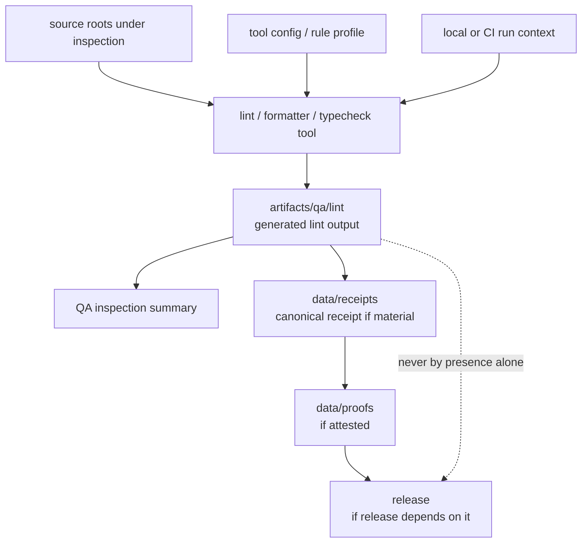

<!-- [KFM_META_BLOCK_V2]
doc_id: kfm://doc/artifacts-qa-lint-readme
title: artifacts/qa/lint/ — Lint QA Outputs
type: readme
version: v0.1
status: draft
owners: OWNER_TBD — QA steward · Lint steward · Build steward · Docs steward
created: 2026-06-16
updated: 2026-06-16
policy_label: public
related:
  - ../README.md
  - ../../README.md
  - ../../../docs/doctrine/directory-rules.md
  - ../../../tools/
  - ../../../tests/
  - ../../../.github/
  - ../../../data/receipts/README.md
  - ../../../data/proofs/README.md
  - ../../../release/README.md
tags: [kfm, artifacts, qa, lint, static-analysis, formatting, typecheck, reports, compatibility-root, transitional, non-authoritative]
notes:
  - "Replaces an empty artifacts/qa/lint README with a bounded lint-output contract."
  - "This directory is a compatibility/transitional QA-output lane for generated lint, format, typecheck, and static-inspection exports; it is not a canonical test authority, CI authority, receipt store, proof store, release record, source-code home, or policy gate."
  - "Specific lint files, workflow names, tool versions, thresholds, CI pass state, source mapping, retention rules, and report freshness remain NEEDS VERIFICATION."
[/KFM_META_BLOCK_V2] -->

<a id="top"></a>

<div align="center">

# Lint QA Outputs

`artifacts/qa/lint/`

**Compatibility/transitional QA-output lane for generated lint, formatting, typecheck, and static-inspection exports. Files here may help inspect a run, but they are not canonical code truth, release proof, source authority, or publication evidence.**


[Purpose](#1-purpose) · [Repo fit](#2-repo-fit) · [Authority boundary](#3-authority-boundary) · [Allowed contents](#5-allowed-contents) · [Forbidden contents](#6-forbidden-contents) · [Validation](#10-validation-expectations) · [Definition of done](#12-definition-of-done)

</div>

---

> [!IMPORTANT]
> **Status:** draft / `NEEDS VERIFICATION`  
> **Path:** `artifacts/qa/lint/README.md`  
> **Responsibility root:** `artifacts/` — compatibility root, QA output scaffold  
> **Truth posture:** CONFIRMED README path / CONFIRMED parent `artifacts/qa/` QA-output boundary / CONFIRMED parent `artifacts/` compatibility-root boundary / PROPOSED lint-output contract / UNKNOWN actual lint files, workflows, tool versions, thresholds, CI runs, source mapping, retention policy, and report freshness

> [!CAUTION]
> `artifacts/qa/lint/` is not a canonical testing or code-quality authority. A lint report staged here does not prove correctness, security, release readiness, policy compliance, EvidenceBundle support, or publication state.

---

## 1. Purpose

`artifacts/qa/lint/` holds generated lint and static-inspection outputs from local or CI runs.

Typical accepted material includes:

- lint reports from code, documentation, schema, style, and formatting tools;
- formatter check output and formatting summaries;
- typecheck or static-analysis report exports;
- machine-readable lint outputs such as JSON, SARIF, XML, or text summaries;
- non-authoritative per-run lint metadata;
- temporary lint artifacts used for reviewer inspection.

Files here may help a reviewer understand a run, but they are not receipts, proofs, release records, source code, policy decisions, or canonical evidence.

This README does not prove any lint report currently exists, any QA job writes here, any threshold was met, or any CI run passed.

[Back to top](#top)

---

## 2. Repo fit

| Concern | Owning root | Expected relationship |
|---|---|---|
| Lint QA output | `artifacts/qa/lint/` | Generated, non-authoritative lint/static-inspection reports |
| QA output parent | `artifacts/qa/` | Lint, coverage, reports, and validator inspection copies |
| Compatibility root | `artifacts/` | Transitional compatibility root; trust content forbidden |
| Lint tools/config | `tools/`, package config, root config files | Source configuration and runners; not output here |
| Tests and fixtures | `tests/`, package-local tests | Test definitions and fixtures; not stored here |
| CI workflows | `.github/` | Workflow definitions and CI enforcement |
| Receipts | `data/receipts/` | Canonical process-memory and receipt home, if material |
| Proofs / EvidenceBundles | `data/proofs/` | Canonical evidence/proof home |
| Release records | `release/` | ReleaseManifest, RollbackCard, CorrectionNotice, release decisions |
| Source code/docs/schemas | `apps/`, `packages/`, `connectors/`, `pipelines/`, `runtime/`, `tools/`, `docs/`, `schemas/` | Source under inspection; not copied here |
| Contracts/policy | `contracts/`, `policy/` | Authority roots, never staged here |

## 3. Authority boundary

`artifacts/qa/lint/` has **compatibility authority only**. It may hold generated lint reports; it does not establish code correctness, implementation maturity, policy compliance, evidence support, test authority, CI authority, release readiness, or publication state.

```text
INSPECTION INPUTS              QA OUTPUT STAGING          TRUST / DECISION HOMES
apps/ packages/ docs/   --->   artifacts/qa/lint/   ---> data/receipts/ if material
schemas/ contracts/ policy/    generated lint only       data/proofs/ if material
tools/ .github/                not authoritative         release/ if applicable
```

A lint file in this folder may be cited by a QA summary or receipt, but the canonical trust-bearing object must live elsewhere.

## 4. Default posture

Lint output in this folder should be treated as **inspection support only**.

Lint should not be treated as proof of correctness, safety, evidence support, policy compliance, or release readiness unless the relevant canonical records and checks exist:

- source `git_sha` and inspected target refs;
- lint/static-analysis tool versions;
- CI workflow/run id or local run context;
- rule configuration and pass/fail result;
- lint output digest where material;
- QA/test receipt in `data/receipts/` where material;
- proof or attestation in `data/proofs/` where material;
- release manifest linkage where release depends on the result;
- known limitations, suppressions, and excluded paths.

## 5. Allowed contents

| Allowed artifact | Examples | Required posture |
|---|---|---|
| Lint report | `ruff.json`, `eslint.json`, `markdownlint.txt` | Generated and non-authoritative |
| Formatter check output | `format-check.txt`, `prettier.json` | Machine output only; source files live elsewhere |
| Typecheck report | `mypy.txt`, `tsc.txt`, `pyright.json` | Generated output only |
| Static-analysis output | `static-analysis.sarif`, `bandit.json` | Generated report only; not proof by itself |
| Lint summary | `lint-summary.json`, `summary.txt` | Non-authoritative inspection aid |
| Run metadata | `lint-run.json` | Non-sensitive source refs, tool versions, run id |

## 6. Forbidden contents

| Forbidden here | Correct home |
|---|---|
| Source code or docs under inspection | `apps/`, `packages/`, `connectors/`, `pipelines/`, `runtime/`, `tools/`, `docs/` |
| Lint tool source, formatter config, or generator source | `tools/`, package config, or repo-root config locations |
| CI workflow definitions | `.github/` |
| RunReceipt, TransformReceipt, ValidationReport, AIReceipt, RedactionReceipt | `data/receipts/` |
| EvidenceBundle, proof bundles, attestations | `data/proofs/` |
| ReleaseManifest, RollbackCard, CorrectionNotice | `release/` |
| Published artifacts or released reports | `data/published/` after governed release |
| Catalog records, source descriptors, registry records | `data/catalog/`, `data/registry/`, or governed registry homes |
| Schemas, contracts, policy rules | `schemas/`, `contracts/`, `policy/` |
| Deployment-only values | Deployment secret/config channels, never this directory |
| Long-lived QA decisions or release gates | `release/`, `data/receipts/`, or governed decision homes |

## 7. Directory shape

Current implementation inventory remains `NEEDS VERIFICATION`.

```text
artifacts/qa/lint/
├── README.md
├── lint-summary.json                # PROPOSED non-authoritative summary
├── lint-run.json                    # PROPOSED non-sensitive run metadata
├── ruff.json                        # PROPOSED Python lint export
├── eslint.json                      # PROPOSED JS/TS lint export
├── markdownlint.txt                 # PROPOSED Markdown lint output
├── static-analysis.sarif            # PROPOSED static-analysis export
└── typecheck.txt                    # PROPOSED typecheck output
```

> [!WARNING]
> Do not treat this suggested shape as repo fact. Verify actual lint files, workflows, inspected targets, rule configs, tool versions, and run ids before making implementation claims.

## 8. Diagram



## 9. Obligations

| Obligation | Example effect |
|---|---|
| `generated_only` | Lint files are generated outputs, not source code or configuration |
| `non_authoritative` | Lint reports assist inspection but do not prove correctness |
| `source_ref_required` | Material reports should identify source `git_sha` and inspected targets |
| `tool_ref_required` | Tool versions and rule configuration should be known |
| `receipt_elsewhere` | Trust-bearing run/QA receipts go to `data/receipts/`, not here |
| `proof_elsewhere` | Proofs/attestations go to `data/proofs/`, not here |
| `release_elsewhere` | Release decisions and manifests go to `release/`, not here |
| `no_sensitive_metadata` | Lint output must not expose protected paths or deployment-only values |
| `safe_to_delete_if_regenerable` | Contents should be rebuildable or documented as exceptions |
| `no_parallel_authority` | This folder must not become a second CI, lint, release, or proof root |

## 10. Validation expectations

Useful validation for this folder should cover:

- every retained report maps to a source ref and inspected target;
- lint outputs contain no deployment-only values or protected path detail;
- lint output is generated, not hand-authored;
- lint rule configuration, suppressions, and excluded paths are documented where material;
- no receipts, proofs, release records, catalog records, source descriptors, schemas, contracts, policy rules, source code, source docs, or tool configs are stored here;
- outputs are temporary/regenerable or referenced by governed records outside this directory;
- retention/pruning behavior is documented;
- release binding, if any, happens through `release/` and canonical receipts/proofs, not by treating this folder as public.

## 11. Safe change pattern

For changes under `artifacts/qa/lint/`:

1. Confirm the file is a generated lint/static-inspection output and not source or trust content.
2. Confirm source refs, inspected targets, tool versions, and rule configs are known.
3. Scrub protected path detail and deployment-only values.
4. Keep reports deterministic and regenerable where practical.
5. Write canonical receipts/proofs/release records to their owning roots, not here.
6. Document excluded paths, suppressions, rule profile, and known limitations where material.
7. Update this README, parent `artifacts/qa/` docs, lint tooling docs, receipts/proofs/release docs, and tests when behavior materially changes.

## 12. Definition of done

- [ ] Owners are confirmed and `OWNER_TBD` is replaced.
- [ ] Actual lint-output inventory is verified.
- [ ] Inspected targets and source refs are documented.
- [ ] Lint/typecheck/static-analysis tool versions and rule configuration are documented.
- [ ] Metadata-scrubbing expectations are documented.
- [ ] Retention and pruning behavior are documented.
- [ ] Canonical receipt/proof/release homes are linked where material.
- [ ] No trust-bearing records live here.
- [ ] No source code, source docs, schemas, contracts, policy rules, deployment-only values, or release decisions live here.
- [ ] CI/workflow behavior is verified or marked `NEEDS VERIFICATION`.

## 13. Open verification items

| Item | Why it matters |
|---|---|
| Confirm actual files under `artifacts/qa/lint/` | Prevents overclaiming lint inventory |
| Confirm lint jobs that write here | Required before CI/workflow claims |
| Confirm lint formats and tool versions | Required before shape claims |
| Confirm rule configuration and suppressions | Required before pass/fail interpretation |
| Confirm source refs and inspected targets | Required before lint interpretation |
| Confirm metadata scrubbing | Required before safe-publication claims |
| Confirm retention/pruning policy | Required before storage-lifecycle claims |
| Confirm no trust records are stored here | Required before Directory Rules compliance claims |
| Confirm release handoff, if any | Required before release-readiness claims |
| Confirm generated output freshness | Required before relying on any report |

<details>
<summary>Appendix A — no-loss preservation note</summary>

The previous README was empty. This replacement adds a bounded lint-output contract without claiming lint files, tool versions, rule profiles, thresholds, inspected targets, workflow names, CI pass state, retention behavior, release linkage, or generated report freshness are implemented.

</details>

## Status summary

`artifacts/qa/lint/` is a transitional compatibility lane for generated lint, formatter, typecheck, and static-inspection QA outputs. It is useful for inspection, but it does not carry trust by itself.

A lint report here becomes relevant to KFM trust only when canonical receipts, proofs, release records, or review decisions elsewhere reference it and pass the appropriate validation, policy, review, publication, correction, and rollback gates.

<p align="right"><a href="#top">Back to top</a></p>
