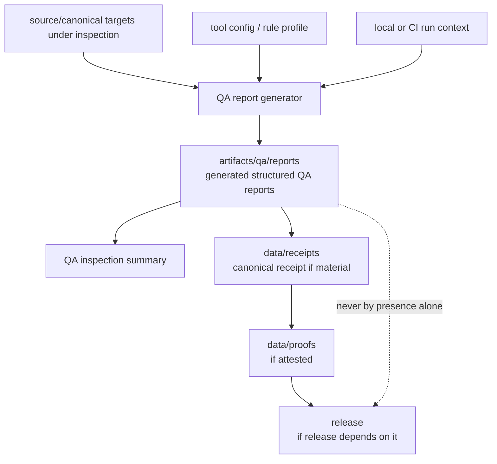

<!-- [KFM_META_BLOCK_V2]
doc_id: kfm://doc/artifacts-qa-reports-readme
title: artifacts/qa/reports/ — Structured QA Reports
type: readme
version: v0.1
status: draft
owners: OWNER_TBD — QA steward · Report steward · Build steward · Docs steward
created: 2026-06-16
updated: 2026-06-16
policy_label: public
related:
  - ../README.md
  - ../../README.md
  - ../../../docs/doctrine/directory-rules.md
  - ../../../tools/
  - ../../../tests/
  - ../../../.github/
  - ../../../data/receipts/README.md
  - ../../../data/proofs/README.md
  - ../../../release/README.md
tags: [kfm, artifacts, qa, reports, structured-reports, accessibility, render-smoke, visual-diff, catalog-qa, docs-qa, compatibility-root, transitional, non-authoritative]
notes:
  - "Replaces an empty artifacts/qa/reports README with a bounded structured-QA-report contract."
  - "This directory is a compatibility/transitional QA-output lane for generated structured reports, not a canonical decision home, receipt store, proof store, release record, source-code home, catalog authority, or policy gate."
  - "Specific report files, workflow names, tool versions, thresholds, CI pass state, source mapping, retention rules, and report freshness remain NEEDS VERIFICATION."
[/KFM_META_BLOCK_V2] -->

<a id="top"></a>

<div align="center">

# Structured QA Reports

`artifacts/qa/reports/`

**Compatibility/transitional QA-output lane for generated structured QA surfaces: catalog checks, docs checks, accessibility reports, render-smoke summaries, visual-diff reports, bundle/asset summaries, and other reviewer-inspection outputs. Reports here may help inspect a run, but they are not canonical evidence, release decisions, or published artifacts.**


[Purpose](#1-purpose) · [Repo fit](#2-repo-fit) · [Authority boundary](#3-authority-boundary) · [Allowed contents](#5-allowed-contents) · [Forbidden contents](#6-forbidden-contents) · [Validation](#10-validation-expectations) · [Definition of done](#12-definition-of-done)

</div>

---

> [!IMPORTANT]
> **Status:** draft / `NEEDS VERIFICATION`  
> **Path:** `artifacts/qa/reports/README.md`  
> **Responsibility root:** `artifacts/` — compatibility root, QA output scaffold  
> **Truth posture:** CONFIRMED README path / CONFIRMED parent `artifacts/qa/` QA-output boundary / CONFIRMED parent `artifacts/` compatibility-root boundary / PROPOSED structured-report contract / UNKNOWN actual report files, workflows, tool versions, thresholds, CI runs, source mapping, retention policy, and report freshness

> [!CAUTION]
> `artifacts/qa/reports/` is not a canonical decision surface. A report staged here does not prove correctness, policy compliance, evidence support, review approval, release readiness, or publication state.

---

## 1. Purpose

`artifacts/qa/reports/` holds generated structured QA reports from local or CI inspection runs.

Typical accepted material includes:

- catalog QA summaries and catalog-shape inspection copies;
- documentation QA summaries such as link checks, heading checks, or rendered-docs checks;
- accessibility reports for UI or generated documentation surfaces;
- render-smoke summaries for maps, pages, docs, or preview artifacts;
- visual-diff reports and image comparison summaries;
- bundle-size, asset, dependency, or generated-reference inspection summaries;
- non-authoritative per-run report metadata.

Files here may help a reviewer understand a run, but they are not receipts, proofs, release records, catalog records, source code, policy decisions, or canonical evidence.

This README does not prove any structured QA report currently exists, any QA job writes here, any threshold was met, or any CI run passed.

[Back to top](#top)

---

## 2. Repo fit

| Concern | Owning root | Expected relationship |
|---|---|---|
| Structured QA reports | `artifacts/qa/reports/` | Generated, non-authoritative QA inspection surfaces |
| QA output parent | `artifacts/qa/` | Lint, coverage, reports, and validator inspection copies |
| Compatibility root | `artifacts/` | Transitional compatibility root; trust content forbidden |
| Report generators | `tools/`, `pipelines/`, package-local tooling | Source tools and generators; not output here |
| Tests and fixtures | `tests/`, package-local tests | Source test definitions and fixtures; not stored here |
| CI workflows | `.github/` | Workflow definitions and CI enforcement |
| Receipts | `data/receipts/` | Canonical process-memory and receipt home, if material |
| Proofs / EvidenceBundles | `data/proofs/` | Canonical evidence/proof home |
| Catalog/published data | `data/catalog/`, `data/published/` | Canonical catalog and release product homes |
| Release records | `release/` | ReleaseManifest, RollbackCard, CorrectionNotice, release decisions |
| Source code/docs/schemas | `apps/`, `packages/`, `connectors/`, `pipelines/`, `runtime/`, `tools/`, `docs/`, `schemas/` | Sources under inspection; not copied here |
| Contracts/policy | `contracts/`, `policy/` | Authority roots, never staged here |

## 3. Authority boundary

`artifacts/qa/reports/` has **compatibility authority only**. It may hold generated QA reports; it does not establish code correctness, catalog truth, documentation truth, implementation maturity, policy compliance, evidence support, CI authority, review approval, release readiness, or publication state.

```text
INSPECTION INPUTS              QA OUTPUT STAGING            TRUST / DECISION HOMES
apps/ docs/ packages/   --->   artifacts/qa/reports/  --->  data/receipts/ if material
schemas/ data/catalog/         generated reports only       data/proofs/ if material
tools/ .github/                not authoritative           release/ if applicable
```

A structured report in this folder may be cited by a QA summary or receipt, but the canonical trust-bearing object must live elsewhere.

## 4. Default posture

Structured reports in this folder should be treated as **inspection support only**.

A report should not be treated as proof of correctness, safety, evidence support, policy compliance, review approval, release readiness, or publication state unless the relevant canonical records and checks exist:

- source `git_sha` and inspected target refs;
- report generator/tool versions;
- CI workflow/run id or local run context;
- rule profile, threshold configuration, and pass/fail result;
- report output digest where material;
- QA/test receipt in `data/receipts/` where material;
- proof or attestation in `data/proofs/` where material;
- release manifest linkage where release depends on the result;
- known limitations, ignored items, and excluded paths.

## 5. Allowed contents

| Allowed artifact | Examples | Required posture |
|---|---|---|
| Catalog QA report | `catalog-report.json`, `catalog-summary.md` | Generated and non-authoritative |
| Docs QA report | `docs-links.json`, `docs-render-smoke.md` | Generated output only; source docs live elsewhere |
| Accessibility report | `accessibility.json`, `a11y-summary.html` | Generated inspection output |
| Render-smoke report | `render-smoke.json`, `map-render-summary.md` | Non-authoritative inspection aid |
| Visual-diff report | `visual-diff.json`, `visual-diff-summary.html` | Generated comparison output |
| Bundle/asset report | `bundle-size.json`, `asset-report.json` | Generated output only |
| Run metadata | `report-run.json` | Non-sensitive source refs, tool versions, run id |

## 6. Forbidden contents

| Forbidden here | Correct home |
|---|---|
| Source code, docs, schemas, or catalog records under inspection | Their canonical source roots: `apps/`, `packages/`, `docs/`, `schemas/`, `data/catalog/` |
| Report generator source or tool configuration | `tools/`, `pipelines/`, package config, or repo-root config locations |
| CI workflow definitions | `.github/` |
| RunReceipt, TransformReceipt, ValidationReport, AIReceipt, RedactionReceipt | `data/receipts/` |
| EvidenceBundle, proof bundles, attestations | `data/proofs/` |
| ReleaseManifest, RollbackCard, CorrectionNotice | `release/` |
| Published artifacts or released reports | `data/published/` after governed release |
| Source descriptors and registry records | `data/registry/` or governed registry homes |
| Schemas, contracts, policy rules | `schemas/`, `contracts/`, `policy/` |
| Deployment-only values | Deployment secret/config channels, never this directory |
| Long-lived QA decisions or release gates | `release/`, `data/receipts/`, or governed decision homes |

## 7. Directory shape

Current implementation inventory remains `NEEDS VERIFICATION`.

```text
artifacts/qa/reports/
├── README.md
├── report-summary.json              # PROPOSED non-authoritative summary
├── report-run.json                  # PROPOSED non-sensitive run metadata
├── catalog-report.json              # PROPOSED catalog QA output
├── docs-report.json                 # PROPOSED docs QA output
├── accessibility-report.json        # PROPOSED accessibility output
├── render-smoke.json                # PROPOSED render-smoke output
├── visual-diff-report.json          # PROPOSED visual-diff output
└── bundle-size.json                 # PROPOSED bundle/asset output
```

> [!WARNING]
> Do not treat this suggested shape as repo fact. Verify actual report files, workflows, inspected targets, rule configs, tool versions, and run ids before making implementation claims.

## 8. Diagram



## 9. Obligations

| Obligation | Example effect |
|---|---|
| `generated_only` | Reports are generated outputs, not source documents or decisions |
| `non_authoritative` | Reports assist inspection but do not prove correctness |
| `source_ref_required` | Material reports should identify source `git_sha` and inspected targets |
| `tool_ref_required` | Tool versions and rule configuration should be known |
| `receipt_elsewhere` | Trust-bearing QA receipts go to `data/receipts/`, not here |
| `proof_elsewhere` | Proofs/attestations go to `data/proofs/`, not here |
| `release_elsewhere` | Release decisions and manifests go to `release/`, not here |
| `no_sensitive_metadata` | Reports must not expose protected paths or deployment-only values |
| `safe_to_delete_if_regenerable` | Contents should be rebuildable or documented as exceptions |
| `no_parallel_authority` | This folder must not become a second QA, catalog, release, or proof root |

## 10. Validation expectations

Useful validation for this folder should cover:

- every retained report maps to a source ref and inspected target;
- reports contain no deployment-only values or protected path detail;
- reports are generated, not hand-authored decisions;
- report rule configuration, thresholds, ignored items, and excluded paths are documented where material;
- no receipts, proofs, release records, source descriptors, schemas, contracts, policy rules, source code, source docs, or tool configs are stored here;
- outputs are temporary/regenerable or referenced by governed records outside this directory;
- retention/pruning behavior is documented;
- release binding, if any, happens through `release/` and canonical receipts/proofs, not by treating this folder as public.

## 11. Safe change pattern

For changes under `artifacts/qa/reports/`:

1. Confirm the file is a generated QA report and not source or trust content.
2. Confirm source refs, inspected targets, tool versions, and rule configs are known.
3. Scrub protected path detail and deployment-only values.
4. Keep reports deterministic and regenerable where practical.
5. Write canonical receipts/proofs/release records to their owning roots, not here.
6. Document ignored items, thresholds, rule profiles, and known limitations where material.
7. Update this README, parent `artifacts/qa/` docs, QA tooling docs, receipts/proofs/release docs, and tests when behavior materially changes.

## 12. Definition of done

- [ ] Owners are confirmed and `OWNER_TBD` is replaced.
- [ ] Actual structured-report inventory is verified.
- [ ] Inspected targets and source refs are documented.
- [ ] Report generator tool versions and rule configuration are documented.
- [ ] Metadata-scrubbing expectations are documented.
- [ ] Retention and pruning behavior are documented.
- [ ] Canonical receipt/proof/release homes are linked where material.
- [ ] No trust-bearing records live here.
- [ ] No source code, source docs, schemas, contracts, policy rules, deployment-only values, or release decisions live here.
- [ ] CI/workflow behavior is verified or marked `NEEDS VERIFICATION`.

## 13. Open verification items

| Item | Why it matters |
|---|---|
| Confirm actual files under `artifacts/qa/reports/` | Prevents overclaiming report inventory |
| Confirm QA jobs that write here | Required before CI/workflow claims |
| Confirm report formats and tool versions | Required before shape claims |
| Confirm rule configuration and thresholds | Required before pass/fail interpretation |
| Confirm source refs and inspected targets | Required before report interpretation |
| Confirm metadata scrubbing | Required before safe-publication claims |
| Confirm retention/pruning policy | Required before storage-lifecycle claims |
| Confirm no trust records are stored here | Required before Directory Rules compliance claims |
| Confirm release handoff, if any | Required before release-readiness claims |
| Confirm generated output freshness | Required before relying on any report |

<details>
<summary>Appendix A — no-loss preservation note</summary>

The previous README was empty. This replacement adds a bounded structured-QA-report contract without claiming report files, tool versions, rule profiles, thresholds, inspected targets, workflow names, CI pass state, retention behavior, release linkage, or generated report freshness are implemented.

</details>

## Status summary

`artifacts/qa/reports/` is a transitional compatibility lane for generated structured QA outputs. It is useful for inspection, but it does not carry trust by itself.

A report here becomes relevant to KFM trust only when canonical receipts, proofs, release records, or review decisions elsewhere reference it and pass the appropriate validation, policy, review, publication, correction, and rollback gates.

<p align="right"><a href="#top">Back to top</a></p>
