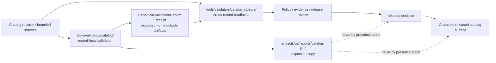

<!-- [KFM_META_BLOCK_V2]
doc_id: kfm://doc/artifacts-qa-reports-catalog-lint-readme
title: artifacts/qa/reports/catalog-lint/ — Catalog Record QA Report, Inspection, and Non-Authority Boundary
type: readme; directory-readme; qa-report-output; catalog-record-lint-report; compatibility-boundary; inspection-contract
version: v0.1
status: draft; repository-grounded; compatibility-root; transitional; readme-empty-before-revision; gitkeep-tracked; report-payload-not-present; catalog-validator-readme-only; catalog-matrix-validator-stub; shared-aggregate-excludes-catalog; dedicated-tests-not-established; dedicated-workflow-not-established; report-schema-not-established; retention-not-established; release-binding-unestablished; non-authoritative
owners: OWNER_TBD — Catalog steward · QA/report steward · Catalog-validator steward · STAC steward · DCAT steward · PROV/PAV steward · Domain-catalog stewards · Evidence/proof steward · Rights/sensitivity reviewer · Policy steward · Release steward · Security/privacy steward · CI/artifact-retention steward · Docs steward
created: 2026-07-16
updated: 2026-07-16
policy_label: public-doc; artifacts; qa; catalog; lint; validation-report; generated-output; inspection-only; no-secrets; no-truth-authority; no-catalog-authority; no-policy-authority; no-release-authority; correction-aware; rollback-aware
current_path: artifacts/qa/reports/catalog-lint/README.md
truth_posture: CONFIRMED target README existed as an empty tracked file, sibling .gitkeep retains a proposed catalog-lint report directory, parent artifacts/qa/reports and artifacts/qa boundaries, Directory Rules classification of artifacts as a transitional compatibility root, data/catalog as the canonical CATALOG-stage data lane with release-gated exposure, tools/validators/catalog as README-only, tools/validators/catalog_closure as README-only, top-level validate_catalog_matrix.py raising NotImplementedError, shared validator aggregate excluding placeholder catalog validators, validator-suite invoking the aggregate through make schemas without catalog coverage, Makefile catalog target remaining TODO-only and describing construction rather than validation, ValidationReport semantic contract remaining draft with placeholder schema and missing declared validator, root gitignore covering direct artifacts/qa/*.xml only and not this nested report lane, bounded search surfacing no catalog-lint producer or payload, and checked absence of catalog-lint-report.json, catalog-lint-run.json, catalog-lint-summary.md, .github/workflows/catalog-lint.yml, and schemas/artifacts/catalog-lint-report.schema.json / PROPOSED immutable report identity, explicit record/profile/input scope, safe normalized findings, record-family routing, source/evidence/rights/sensitivity/lifecycle checks, finite outcomes, no-network/resource budgets, deterministic ordering, cross-report consistency, machine-readable run manifest, CI artifact upload, access and expiry controls, canonical ValidationReport/receipt linkage, correction, invalidation, supersession, withdrawal, rollback, and lane retirement / CONFLICTED catalog-lint naming versus no executable named catalog-lint; record-local validation versus catalog-closure readiness; artifact inspection report versus canonical ValidationReport and process receipt; empty README plus .gitkeep versus no ignore/retention rule; CatalogMatrix validator path and ADR placement drift; Makefile catalog construction target versus validation reporting; and QA convenience versus catalog truth, evidence closure, policy permission, release approval, or publication / UNKNOWN uncommitted local reports, CI-only artifacts, external catalog services, historical runs, dynamically loaded validators, package-local implementations, actual inspected records, current findings, active consumers, branch-protection significance, report freshness, retention, hosting, deployment, and production use / NEEDS VERIFICATION accepted owners, CODEOWNERS, complete recursive inventory, generated-output commit policy, canonical report and receipt homes, accepted record profiles and namespaces, canonical validator entry, source and dependency resolution, severity mapping, suppression policy, sensitive-metadata redaction, workflow ownership, artifact retention, release significance, correction consumers, and rollback execution
evidence_snapshot:
  repository: bartytime4life/Kansas-Frontier-Matrix
  repository_id: "1059091169"
  visibility: public
  base_ref: main
  base_commit: a64a0452e2004eb6cfd565aa0a5df2a9f27e793c
  target_prior_blob: 8b137891791fe96927ad78e64b0aad7bded08bdc
  confirmed_lane_files:
    - artifacts/qa/reports/catalog-lint/README.md
    - artifacts/qa/reports/catalog-lint/.gitkeep
  confirmed_lane_blobs:
    README.md: 8b137891791fe96927ad78e64b0aad7bded08bdc
    .gitkeep: 6d39b4a90ddcad7ab78e90091a0d79796945b654
  checked_absent_paths:
    - artifacts/qa/reports/catalog-lint/catalog-lint-report.json
    - artifacts/qa/reports/catalog-lint/catalog-lint-run.json
    - artifacts/qa/reports/catalog-lint/catalog-lint-summary.md
    - .github/workflows/catalog-lint.yml
    - schemas/artifacts/catalog-lint-report.schema.json
  execution_and_authority_surfaces:
    - artifacts/qa/reports/README.md
    - artifacts/qa/README.md
    - tools/validators/catalog/README.md
    - tools/validators/catalog_closure/README.md
    - tools/validators/validate_catalog_matrix.py
    - tools/validators/_common/run_all.py
    - .github/workflows/validator-suite.yml
    - data/catalog/README.md
    - contracts/data/validation_report.md
    - Makefile
    - .gitignore
    - docs/doctrine/directory-rules.md
  bounded_inventory_note: tracked repository evidence cannot establish uncommitted local reports, CI workspaces, external validators or catalog services, historical artifacts, dynamically loaded implementations, branch-local outputs, object stores, hosting systems, branch-protection settings, or uninspected subprojects
related:
  - ../README.md
  - ../../README.md
  - ../../../README.md
  - ../../../../docs/doctrine/directory-rules.md
  - ../../../../tools/validators/catalog/README.md
  - ../../../../tools/validators/catalog_closure/README.md
  - ../../../../tools/validators/validate_catalog_matrix.py
  - ../../../../tools/validators/_common/run_all.py
  - ../../../../.github/workflows/validator-suite.yml
  - ../../../../data/catalog/README.md
  - ../../../../contracts/data/catalog_matrix.md
  - ../../../../contracts/data/validation_report.md
  - ../../../../data/receipts/README.md
  - ../../../../data/proofs/README.md
  - ../../../../release/README.md
  - ../../../../Makefile
  - ../../../../.gitignore
tags: [kfm, artifacts, qa, reports, catalog-lint, catalog-validation, stac, dcat, prov, catalog-matrix, validation-report, findings, no-network, sensitivity, retention, correction, rollback]
notes:
  - "This is the first substantive contract for an otherwise empty README."
  - "The direct lane contains only README.md and .gitkeep in bounded tracked evidence."
  - "No catalog-lint report, producer, schema, dedicated test suite, workflow, retained run manifest, consumer, or release binding was established."
  - "The catalog-record and catalog-closure validator lanes are README-only; the observed CatalogMatrix executable is a NotImplementedError stub."
  - "A report in this lane is an inspection copy, not a catalog record, canonical ValidationReport, receipt, proof, PolicyDecision, ReleaseManifest, publication approval, or public artifact."
  - "This revision changes documentation only."
[/KFM_META_BLOCK_V2] -->

<a id="top"></a>

# `artifacts/qa/reports/catalog-lint/` — Catalog Record QA Report, Inspection, and Non-Authority Boundary

> **Purpose.** Define the staging boundary for generated catalog-record QA reports without allowing a JSON file, empty finding list, green check, schema-valid record, STAC/DCAT/PROV agreement claim, catalog matrix, workflow artifact, or reviewer summary to become catalog truth, evidence closure, policy permission, release approval, publication, or production truth.

<p>
  
  
  
  
  
  
</p>

**Quick navigation:** [Status](#status-and-evidence-boundary) · [Purpose](#purpose-and-audience) · [Authority](#authority-and-directory-rules-basis) · [Inventory](#confirmed-current-inventory) · [Meaning](#what-catalog-lint-can-and-cannot-mean) · [Topology](#validator-and-report-topology) · [Scope](#inspection-scope-contract) · [Families](#catalog-record-family-contracts) · [Findings](#finding-and-severity-contract) · [Formats](#output-format-and-routing-contract) · [Manifest](#proposed-catalog-lint-run-manifest) · [ValidationReport](#artifact-report-versus-canonical-validationreport) · [Security](#security-rights-sensitivity-and-metadata-exposure) · [Determinism](#determinism-consistency-and-reproducibility) · [Suppressions](#suppressions-exceptions-and-review) · [CI](#producer-ci-artifact-and-retention-contract) · [Outcomes](#validation-non-vacuity-and-finite-outcomes) · [Lifecycle](#catalog-lifecycle-release-and-public-boundary) · [Correction](#correction-invalidation-and-rollback) · [Review](#review-burden-and-change-control) · [Done](#definition-of-done) · [Plan](#smallest-sound-implementation-sequence) · [Open](#open-verification-register) · [Evidence](#evidence-ledger) · [Rollback](#documentation-correction-and-rollback)

---

## Status and evidence boundary

> [!IMPORTANT]
> **Snapshot:** `main@a64a0452e2004eb6cfd565aa0a5df2a9f27e793c`<br>
> **Prior README blob:** `8b137891791fe96927ad78e64b0aad7bded08bdc` — empty file<br>
> **Confirmed direct files:** `README.md`, `.gitkeep`<br>
> **Catalog-lint report payload:** not established<br>
> **Record-local catalog validator:** README-only<br>
> **Catalog-closure validator:** README-only<br>
> **Observed CatalogMatrix validator:** `NotImplementedError` scaffold<br>
> **Dedicated workflow, report schema, retention, and consumer:** not established

`artifacts/qa/reports/catalog-lint/` is a repository-confirmed compatibility placeholder. It is **not an operational catalog-validation reporting system**.

### Safe conclusion

| Capability | Status | Evidence-bounded conclusion |
|---|---:|---|
| Boundary README | `CONFIRMED` | The path existed, but the README was empty before this revision. |
| Directory retention marker | `CONFIRMED` | `.gitkeep` identifies the lane as a proposed catalog-lint report directory. |
| Report payload | `NOT ESTABLISHED` | No checked JSON or Markdown catalog-lint report exists. |
| Run manifest | `NOT ESTABLISHED` | No checked run metadata file exists. |
| Catalog-record validator | `README ONLY` | The implementation lane documents intended behavior but contains no established executable. |
| Catalog-closure validator | `README ONLY` | Closure intent exists; no established executable was verified. |
| CatalogMatrix executable | `STUB` | The observed script raises `NotImplementedError`. |
| Shared validator aggregate | `NO CATALOG COVERAGE` | The five registered validators exclude catalog and placeholder stubs. |
| Validator workflow | `NO CATALOG COVERAGE` | It invokes `make schemas`, which uses the shared five-entry aggregate. |
| Make catalog target | `TODO-ONLY` | It describes future catalog construction, not validation-report generation. |
| Catalog data authority | `CONFIRMED DRAFT BOUNDARY` | `data/catalog/` is the CATALOG-stage data lane; this report path is not. |
| ValidationReport contract | `DRAFT / PLACEHOLDER-PAIRED` | Meaning is documented; schema and declared validator maturity are incomplete. |
| Dedicated catalog-lint tests | `NOT ESTABLISHED` | No dedicated suite or nonempty fixture family surfaced. |
| Dedicated catalog-lint workflow | `NOT ESTABLISHED` | Checked workflow path is absent. |
| Generated-output ignore protection | `NOT ESTABLISHED` | Root ignore rules do not cover this nested report lane. |
| Retention and access policy | `NOT ESTABLISHED` | No artifact expiry or reviewer-access contract surfaced. |
| Receipt/proof/release binding | `NOT ESTABLISHED` | No canonical record is linked to this lane. |
| Production or public use | `UNKNOWN` | A directory or report name cannot prove operational adoption. |
| Catalog truth or release proof | `DENY` | A lint report cannot establish truth, policy permission, or release approval. |

### Truth labels

| Label | Meaning in this README |
|---|---|
| `CONFIRMED` | Verified from current repository files, exact paths, executable code, or bounded search. |
| `PROPOSED` | A recommended object, command, profile, path, or gate not established as current implementation. |
| `CONFLICTED` | Current files, ADRs, paths, or responsibilities create incompatible expectations. |
| `UNKNOWN` | Not observable or not established from inspected evidence. |
| `NEEDS VERIFICATION` | Checkable, but not sufficiently proven for operational reliance or release significance. |
| `DENY` | A prohibited authority, security, lifecycle, policy, release, or publication interpretation. |

[Back to top](#top)

---

## Purpose and audience

This README governs a future family of generated reports that summarize bounded catalog-record validation activity.

It is intended for:

- catalog, STAC, DCAT, PROV/PAV, and domain-catalog stewards;
- validator, schema, contract, and catalog-build maintainers;
- QA and structured-report stewards;
- evidence, rights, sensitivity, policy, and release reviewers;
- CI and artifact-retention maintainers;
- reviewers deciding whether a report is current, scoped, safe, and actionable;
- correction, supersession, withdrawal, and rollback stewards;
- documentation maintainers correcting maturity or authority claims.

The durable question is:

> Can KFM show exactly what catalog metadata was inspected, under which profile and constraints, with which safe findings, without allowing the report to replace the catalog record, source support, EvidenceBundle, policy decision, release decision, or canonical validation memory?

A correct report is always bounded. It may still be:

- based on incomplete or placeholder schemas;
- produced by an unaccepted validator profile;
- missing source or evidence dependencies;
- stale relative to the catalog record;
- unsafe because metadata exposes sensitive locations or private endpoints;
- incomplete because closure checks were not run;
- noncomparable to an earlier run;
- valid in shape but wrong in meaning;
- unreleased, withdrawn, corrected, or superseded;
- unsuitable for public display.

[Back to top](#top)

---

## Authority and Directory Rules basis

Directory Rules classify `artifacts/` as a transitional compatibility root for derived, regenerable, non-authoritative material.

```text
tools/validators/catalog/                  record-local validator responsibility
tools/validators/catalog_closure/          cross-record closure responsibility
schemas/ and contracts/                    shape and meaning authority
data/catalog/                              CATALOG-stage records and indexes
data/receipts/ and data/proofs/            canonical process memory and support
release/                                   release, correction, withdrawal, rollback decisions
artifacts/qa/reports/catalog-lint/          generated inspection copies only
```

This lane may hold a generated report copy. It must not become:

- a catalog record or index home;
- a catalog-building pipeline;
- a validator implementation home;
- a schema, contract, profile, namespace, or reason-code authority;
- a CatalogMatrix or catalog-closure authority;
- a source registry or EvidenceBundle home;
- a ValidationReport authority merely because a JSON file resembles one;
- a process receipt, proof, PolicyDecision, ReviewRecord, or ReleaseManifest home;
- a public catalog endpoint;
- a shortcut around release or policy review.

### Directory Rules basis

| Question | Answer |
|---|---|
| Owning root | `artifacts/` compatibility root |
| Responsibility | Generated QA report staging |
| Canonical catalog home | `data/catalog/` |
| Record validator home | `tools/validators/catalog/` |
| Closure validator home | `tools/validators/catalog_closure/` |
| Contract/schema authority | `contracts/`, `schemas/` |
| Policy authority | `policy/` |
| Release authority | `release/` |
| Public access | Governed released interfaces only |
| Long-term disposition | Retain, externalize, migrate, or retire remains `NEEDS VERIFICATION` |

[Back to top](#top)

---

## Confirmed current inventory

### Direct lane

```text
artifacts/qa/reports/catalog-lint/
├── README.md        # empty before this revision
└── .gitkeep         # retains the proposed report lane
```

### Confirmed related surfaces

| Surface | Current evidence |
|---|---|
| Parent reports lane | Generic structured-QA output contract |
| QA parent | Non-authoritative lint, coverage, reports, and validation output scaffold |
| Catalog-record validator lane | README-only; no working executable established |
| Catalog-closure validator lane | README-only; no working executable established |
| CatalogMatrix validator | Top-level scaffold raises `NotImplementedError` |
| Shared validator aggregate | Five non-placeholder validators; catalog absent |
| Validator workflow | Runs `make schemas`; no catalog report upload |
| Make catalog | TODO-only catalog construction placeholder |
| Data catalog | Canonical CATALOG-stage lane with release-gated exposure |
| ValidationReport | Draft semantic contract paired to a permissive placeholder schema |
| Root ignore policy | Only direct `artifacts/qa/*.xml` outputs are ignored |

### Checked absent paths

The following exact paths were checked and not found at the snapshot:

```text
artifacts/qa/reports/catalog-lint/catalog-lint-report.json
artifacts/qa/reports/catalog-lint/catalog-lint-run.json
artifacts/qa/reports/catalog-lint/catalog-lint-summary.md
.github/workflows/catalog-lint.yml
schemas/artifacts/catalog-lint-report.schema.json
```

> [!NOTE]
> Absence is path-scoped and commit-scoped. It does not prove that historical, ignored, generated, branch-local, external, dynamically loaded, package-local, or uninspected report implementations never existed.

[Back to top](#top)

---

## What catalog lint can and cannot mean

### Meaning of “catalog lint”

In this lane, **catalog lint** means a generated inspection result for one or more declared catalog records or bounded indexes under an explicit validation profile.

It may summarize checks such as:

- parse and serialization success;
- profile and version declaration;
- required field presence;
- identity and namespace consistency;
- link shape and reference family;
- digest and media-type declarations;
- temporal and spatial field consistency;
- STAC, DCAT, PROV/PAV, or domain-profile rules;
- source, evidence, rights, sensitivity, lifecycle, release, and correction reference posture;
- safe metadata-exposure checks;
- deterministic ordering and report completeness.

### What a report may support

A report may support:

- reviewer inspection;
- defect triage;
- catalog-build debugging;
- catalog-record correction planning;
- a canonical ValidationReport or receipt generated elsewhere;
- a later catalog-closure operation;
- a release review that cites the canonical governed result;
- regression comparison when scope and profiles are equivalent.

### What a report does not prove

A report does **not** prove:

- that the underlying data or claim is true;
- that an asset exists, is current, or is accessible;
- that a source is authoritative or admissible;
- that evidence is sufficient;
- that rights or sensitivity obligations are satisfied;
- that a catalog record belongs in an approved release;
- that STAC, DCAT, and PROV projections agree across the complete package;
- that a CatalogMatrix is complete;
- that public serving is permitted;
- that a policy decision was made;
- that release approval exists;
- that rollback is operational;
- that a green result is current or non-vacuous.

> [!WARNING]
> An empty finding list is not a clean run unless the report proves that a real validator executed over a nonempty, declared target set with an accepted profile and complete result parsing.

[Back to top](#top)

---

## Validator and report topology



### Record-local versus closure checks

| Concern | Record-local catalog validation | Catalog closure |
|---|---:|---:|
| One record’s shape and profile | Yes | May consume result |
| One record’s identity/digest/time | Yes | May compare across records |
| STAC/DCAT/PROV field semantics | Yes | Agreement across projections |
| CatalogMatrix completeness | No | Yes |
| Source/evidence dependency closure | Reference-level checks | Package-level closure |
| Policy/review/release readiness | Local reference posture | Package-level readiness |
| Public exposure decision | No | No — release authority decides |
| Report staging in this lane | Possible inspection copy | Separate report family or explicit subtype required |

Do not silently combine record-local and closure results into one undifferentiated “catalog pass.”

[Back to top](#top)

---

## Inspection scope contract

Every substantive report must bind to an explicit immutable scope.

### Required scope dimensions

| Dimension | Requirement |
|---|---|
| Operation | Record-local validation, bounded index validation, or explicitly named report subtype |
| Target refs | Exact catalog record or index identifiers |
| Target digests | Digest of every inspected input where practical |
| Record family | STAC, DCAT, PROV/PAV, domain catalog, bounded index, or accepted extension |
| Profile | Accepted profile/version/namespace reference and digest |
| Source revision | Repository commit or immutable source snapshot |
| Lifecycle state | Expected state such as CATALOG candidate, released subset, corrected, or withdrawn |
| Audience | Steward-only, CI review, release review, or another explicit class |
| Network posture | Default deny unless an accepted profile explicitly allows bounded resolution |
| Resource limits | Byte, nesting, record-count, reference-depth, and diagnostic limits |
| Dependency policy | Which source, evidence, policy, release, and correction refs are resolved |
| Time basis | Validation time plus record/source/valid/release/correction times when relevant |

### Scope must not be inferred from directory location

A report must not infer that:

- every file under `data/catalog/` is released;
- every record in a directory belongs to the same profile;
- every referenced asset may be fetched;
- every missing dependency is optional;
- every public-looking URL is safe to expose;
- every child domain uses the same sensitivity posture;
- every catalog record may be generalized in the same way.

### Proposed immutable packet

```yaml
packet_version: kfm.catalog.lint-packet.v1
operation: validate_catalog_records
run_id: <stable-run-id>
source_revision: <git-sha-or-immutable-snapshot>
targets:
  - record_ref: <stable-ref>
    record_family: STAC_ITEM
    candidate_digest: sha256:<digest>
profile:
  profile_ref: <accepted-profile-ref>
  profile_digest: sha256:<digest>
context:
  expected_lifecycle_state: CATALOG
  source_descriptor_refs: []
  evidence_refs: []
  policy_decision_refs: []
  release_ref: null
  correction_refs: []
limits:
  network: deny
  max_records: <configured>
  max_bytes: <configured>
  max_reference_depth: <configured>
```

This packet is `PROPOSED`; no accepted packet schema or producer is established.

[Back to top](#top)

---

## Catalog record family contracts

### STAC

A future STAC lint report may inspect:

- Catalog, Collection, Item, Asset, and Link types;
- accepted STAC core and extension versions;
- object identity and collection linkage;
- geometry, bbox, datetime, interval, and temporal consistency;
- asset href, media type, roles, checksums, and title/description posture;
- extension declarations and profile compatibility;
- source, evidence, rights, sensitivity, release, and correction references;
- safe public metadata exposure.

It must not claim:

- asset availability from URL shape alone;
- rights from a license string alone;
- location safety from style or zoom alone;
- evidence closure from an `evidence_ref` string alone;
- release from presence under a catalog path.

### DCAT

A future DCAT lint report may inspect:

- Catalog, Dataset, Distribution, and DataService classes;
- identifiers, publisher, themes, keywords, and contact posture;
- spatial and temporal coverage;
- access/download/service URLs;
- media type, format, checksum, byte-size, and license fields;
- provenance, version, rights, sensitivity, release, and correction references.

It must keep metadata quality separate from availability, admissibility, truth, and publication.

### PROV/PAV

A future PROV/PAV lint report may inspect:

- Entity, Activity, Agent, Plan, generation, usage, derivation, and association;
- stable identities and URI normalization;
- generated/used/invalidated times;
- versioning, authored/curated/created/imported fields;
- source, receipt, proof, release, and correction reference families.

It must preserve:

```text
semantic provenance ≠ process receipt ≠ evidence proof ≠ software attestation ≠ release decision
```

### Domain catalog and bounded indexes

A future domain/index report may inspect:

- owning domain and object family;
- stable object and artifact versions;
- spatial and temporal scope;
- source and evidence references;
- rights and sensitivity posture;
- lifecycle, release, correction, withdrawal, and supersession state;
- index membership and target digests.

Index membership is not completeness, truth, or release approval.

### Unknown or unsupported families

Unknown families must return a finite result such as:

- `ABSTAIN`;
- `UNSUPPORTED_PROFILE`;
- `PROFILE_NOT_ESTABLISHED`;
- `REVIEW_REQUIRED`;
- `ERROR`.

They must not be silently treated as valid generic JSON.

[Back to top](#top)

---

## Finding and severity contract

### Proposed finding shape

```yaml
finding_id: <stable-within-run-id>
code: CAT_LINK_UNRESOLVED
severity: blocking
record_ref: <target-ref>
record_family: STAC_ITEM
profile_ref: <profile-ref>
location:
  json_pointer: /links/2/href
rule_ref: <stable-rule-ref>
safe_message: Referenced catalog target could not be resolved under the configured no-network policy.
dependency_refs: []
evidence_refs: []
suggested_action: Provide an accepted local resolver target or hold the record.
```

### Minimum fields

A finding should include:

- stable run-local identity;
- stable reason code;
- severity;
- target reference and family;
- profile/rule identity;
- safe location pointer;
- safe human-readable message;
- whether the issue blocks, warns, abstains, or requires review;
- relevant dependency references;
- suggested next action;
- correction or suppression reference when applicable.

### Proposed severity classes

| Severity | Meaning | Default posture |
|---|---|---|
| `blocking` | Catalog record cannot safely proceed under the declared operation. | `FAIL`, `DENY`, `HOLD`, or `REVIEW_REQUIRED` |
| `error` | Validator or parser could not complete. | `ERROR`; never infer validity |
| `high` | Serious identity, evidence, rights, sensitivity, lifecycle, or public-exposure defect. | Block unless accepted policy says otherwise |
| `medium` | Material quality or interoperability defect. | Warn or block per profile |
| `low` | Non-blocking quality issue. | Warn |
| `info` | Informational observation. | No gate effect by itself |

Severity normalization is `PROPOSED`. Native tool severity must be preserved alongside any normalized value.

### Reason-code families

Proposed stable families:

```text
CAT_PROFILE_*
CAT_SHAPE_*
CAT_IDENTITY_*
CAT_NAMESPACE_*
CAT_DIGEST_*
CAT_TIME_*
CAT_SPATIAL_*
CAT_LINK_*
CAT_ASSET_*
CAT_MEDIA_*
CAT_SOURCE_*
CAT_EVIDENCE_*
CAT_RIGHTS_*
CAT_SENSITIVITY_*
CAT_LIFECYCLE_*
CAT_RELEASE_*
CAT_CORRECTION_*
CAT_PUBLIC_*
CAT_RESOURCE_*
CAT_INTERNAL_*
CAT_PLACEHOLDER_*
CAT_SCOPE_*
```

This README does not establish the canonical registry for these codes.

[Back to top](#top)

---

## Output format and routing contract

### Allowed report outputs

| Output | Role | Authority |
|---|---|---|
| Machine JSON report | Structured inspection result | Non-authoritative artifact copy |
| Markdown summary | Reviewer-readable summary | Non-authoritative |
| HTML summary | Optional local/CI rendering | Non-authoritative; no public hosting by default |
| Safe text log | Bounded diagnostics | Non-authoritative |
| Run manifest | Identity and scope metadata | Non-authoritative |
| Digest sidecar | Byte identity | Does not establish truth or approval |

### Proposed lane shape

```text
artifacts/qa/reports/catalog-lint/
├── README.md
├── .gitkeep
├── catalog-lint-report.json       # PROPOSED generated result
├── catalog-lint-run.json          # PROPOSED run identity and scope
├── catalog-lint-summary.md        # PROPOSED reviewer summary
└── catalog-lint-report.sha256     # PROPOSED final-byte digest
```

> [!WARNING]
> This is a proposed shape, not current inventory. No producer, schema, workflow, or generated payload is established.

### Routing exclusions

Do not store here:

| Item | Correct owner |
|---|---|
| Catalog records or indexes | `data/catalog/` |
| Catalog builder code | `pipelines/catalog/`, packages, or accepted implementation roots |
| Record validator source | `tools/validators/catalog/` |
| Closure validator source | `tools/validators/catalog_closure/` |
| CatalogMatrix authority | Accepted contract/data/proof/release home after conflict resolution |
| Canonical ValidationReport | Accepted governed report home outside `artifacts/` |
| Validation/run receipt | `data/receipts/` |
| EvidenceBundle/proof | `data/proofs/` |
| PolicyDecision | `policy/` and accepted policy-record home |
| ReleaseManifest/PromotionDecision | `release/` |
| Published catalog payload | Governed released catalog/publication lane |
| Schemas/contracts/profiles | `schemas/`, `contracts/`, accepted config/registry roots |
| Full sensitive catalog payloads | Protected governed lanes, not QA artifacts |

[Back to top](#top)

---

## Proposed catalog-lint run manifest

A retained report requires an immutable manifest or equivalent metadata.

```json
{
  "manifest_version": "kfm.catalog-lint-run.v1",
  "run_id": "catalog-lint:<stable-id>",
  "source_revision": "a64a0452e2004eb6cfd565aa0a5df2a9f27e793c",
  "validator": {
    "validator_ref": "PROPOSED",
    "validator_version": "PROPOSED",
    "validator_digest": "sha256:PROPOSED"
  },
  "profile": {
    "profile_ref": "PROPOSED",
    "profile_version": "PROPOSED",
    "profile_digest": "sha256:PROPOSED"
  },
  "scope": {
    "operation": "validate_catalog_records",
    "record_families": [],
    "target_refs": [],
    "target_digests": [],
    "network_posture": "deny"
  },
  "execution": {
    "started_at": "PROPOSED",
    "completed_at": "PROPOSED",
    "environment_ref": "PROPOSED",
    "exit_code": null
  },
  "results": {
    "overall_outcome": "NOT_EVALUATED",
    "records_selected": 0,
    "records_parsed": 0,
    "records_validated": 0,
    "findings_total": 0,
    "blocking_findings": 0
  },
  "outputs": {
    "report_ref": "PROPOSED",
    "report_digest": "sha256:PROPOSED",
    "summary_ref": "PROPOSED"
  },
  "canonical_refs": {
    "validation_report_ref": null,
    "run_receipt_ref": null,
    "proof_refs": [],
    "policy_decision_refs": [],
    "release_ref": null
  },
  "status": "PROPOSED"
}
```

### Manifest requirements

The manifest must not:

- claim `PASS` when zero records were selected;
- infer a profile from the first record;
- omit parser or resolver failures;
- use the artifact path as canonical identity;
- embed secrets, credentials, private endpoints, or sensitive payloads;
- claim a canonical ValidationReport or receipt that does not resolve;
- claim release significance without an explicit governed reference.

[Back to top](#top)

---

## Artifact report versus canonical ValidationReport

The artifact report and the semantic `ValidationReport` contract must not collapse.

| Concern | Catalog-lint artifact report | Canonical `ValidationReport` |
|---|---|---|
| Primary purpose | Local/CI reviewer inspection | Governed validation-result object |
| Root | `artifacts/` compatibility | Accepted canonical home outside this lane |
| Mutability | Regenerable and disposable | Governed, identity-bound, correction-aware |
| Required authority | None | Contract/schema/review authority |
| Release significance | None by itself | May support a release gate, never decide release |
| Process memory | No | Links to a receipt; does not replace it |
| Evidence support | References only | May carry governed evidence refs |
| Public use | Denied by default | Only through governed release and presentation |
| Correction | Regenerate or remove | Governed correction/supersession linkage |
| Rollback | Delete/regenerate artifact | Governed rollback/correction process |

### Safe handoff

A safe handoff may look like:

```text
catalog candidate
  -> record-local validator execution
  -> artifact QA report for review
  -> canonical ValidationReport and/or validation receipt
  -> catalog-closure check
  -> policy/review gate
  -> release decision
  -> governed public catalog surface
```

The exact canonical `ValidationReport` storage home remains `NEEDS VERIFICATION`; this README does not decide it.

[Back to top](#top)

---

## Security, rights, sensitivity, and metadata exposure

Catalog metadata can reveal protected information even when payload data is withheld.

### Default-deny material

Do not include in reports:

- credentials, tokens, cookies, authorization headers, or signed URLs;
- private hostnames, internal IP addresses, home directories, runner workspace paths, or secret mount names;
- full query strings containing access tokens or identifiers;
- raw evidence payloads;
- unredacted private-person, DNA, land-title, well, or contact details;
- precise rare-species, archaeology, cultural-site, or sensitive-infrastructure coordinates;
- unreleased asset URLs;
- source-registry credentials;
- hidden policy inputs;
- confidential review comments;
- full restricted catalog records merely to provide context.

### Safe diagnostics

Prefer:

- stable record references;
- digests;
- safe JSON pointers;
- reason codes;
- generalized spatial scope;
- host classification rather than full private URL;
- counts rather than embedded payloads;
- redacted or allowlisted field excerpts;
- bounded messages with no stack trace unless access is restricted.

### Metadata leakage checks

A substantive catalog-lint run should detect or route checks for:

- precise geometry in public-intended records;
- restricted endpoint disclosure;
- cadence or timestamp detail that enables reconstruction;
- sensitive cross-link graphs;
- hidden query parameters;
- unreviewed contact data;
- rights-unclear license text;
- evidence references that expose protected stores;
- public links to unreleased artifacts;
- correction or withdrawal state omitted from indexes.

### External resolution

Default posture is **no network**.

Any network-enabled mode requires:

- explicit accepted profile;
- allowlisted schemes and hosts;
- request and byte limits;
- redirect limits;
- timeout;
- credential isolation;
- response-content limits;
- cache and reproducibility policy;
- SSRF and local-network denial;
- recorded remote dependency identity;
- safe failure behavior.

[Back to top](#top)

---

## Determinism, consistency, and reproducibility

### Deterministic expectations

A report producer should control:

- record ordering;
- finding ordering;
- path normalization;
- JSON serialization;
- timestamps and generated identifiers;
- locale and timezone;
- profile resolution;
- namespace normalization;
- URI normalization;
- floating-point and coordinate formatting;
- concurrency and shard merge order;
- external dependency behavior;
- diagnostic truncation;
- redaction.

### Repeat-run outcomes

| Outcome | Meaning |
|---|---|
| `BYTE_IDENTICAL` | Final report bytes match. |
| `SEMANTICALLY_EQUIVALENT` | Normalized findings and outcomes match; nonsemantic bytes differ. |
| `MEASUREMENT_DIFFERENT` | Findings, counts, outcomes, scope, or dependencies differ. |
| `INCOMPARABLE` | Profile, targets, validator, policy, or dependency posture differs. |
| `INCONCLUSIVE` | Required identities or digests are missing. |
| `ERROR` | Comparison could not safely complete. |

### Cross-output consistency

When JSON, Markdown, HTML, and canonical governed records derive from one run:

- overall outcome must agree;
- target and profile identity must agree;
- finding counts must agree;
- blocking finding identities must agree;
- redaction must not change the meaning of visible findings;
- summary must not omit blocking findings;
- canonical references must resolve to the same run;
- artifact regeneration must not overwrite unrelated run history.

[Back to top](#top)

---

## Suppressions, exceptions, and review

### No hidden local ignores

A report artifact must not silently hide findings through:

- undocumented ignore files;
- regex filtering after validation;
- severity downgrades;
- path exclusions inferred from file names;
- “known issues” arrays with no owner;
- removal of duplicate findings when duplicates represent different records;
- conversion of parser errors into warnings;
- treating unsupported profiles as pass.

### Proposed suppression contract

Every accepted suppression should identify:

```yaml
suppression_id: <stable-id>
finding_code: <code-or-bounded-pattern>
scope: <record/profile/path>
reason: <reviewable-reason>
owner: <accepted-owner>
created_at: <time>
expires_at: <time-or-review-condition>
review_ref: <governed-review-ref>
replacement_plan: <optional>
```

Suppressions belong in an accepted governance/configuration home, not solely in this report lane.

### Review-required cases

Route to human review when:

- a profile conflict exists;
- an ADR placement conflict affects interpretation;
- rights or sensitivity cannot be decided deterministically;
- metadata generalization may alter discovery meaning;
- source/evidence references are ambiguous;
- correction or supersession lineage conflicts;
- a public URL may be operationally required but unsafe to test;
- the record family is unsupported;
- validator output and canonical record state disagree;
- the report requires an exception to fail-closed defaults.

[Back to top](#top)

---

## Producer, CI artifact, and retention contract

### Producer contract

A future producer must:

1. live in an accepted implementation root;
2. identify one executable or registry entry;
3. reject placeholder execution;
4. load an explicit profile;
5. select a nonempty target set;
6. bind exact target digests;
7. enforce no-network and resource limits by default;
8. emit stable finite outcomes and reason codes;
9. preserve native parser/validator errors;
10. redact sensitive metadata;
11. write outputs atomically;
12. compute digests after final-byte generation;
13. distinguish artifact copies from canonical records;
14. return a nonzero exit code for configured blocking outcomes;
15. preserve correction and invalidation references.

### Current CI boundary

Current evidence establishes:

- `validator-suite` runs the shared validator aggregate through `make schemas`;
- the aggregate contains five non-placeholder validators;
- catalog and CatalogMatrix placeholders are excluded;
- no catalog-lint report is uploaded;
- no dedicated catalog-lint workflow exists at the checked path;
- no branch-protection or promotion significance is established.

### Proposed CI stages

```text
checkout
  -> install pinned dependencies
  -> resolve accepted local profiles
  -> select nonempty catalog targets
  -> execute record-local validator
  -> validate report shape and non-vacuity
  -> scan report for secrets/private paths/sensitive metadata
  -> upload bounded QA artifact
  -> emit canonical receipt/report when governed
  -> route blocking outcome to review or hold
```

### Artifact access and retention classes

| Class | Intended use | Default posture |
|---|---|---|
| `EPHEMERAL_LOCAL` | Developer inspection | Delete after use |
| `PR_REVIEW` | Pull-request triage | Restrict to reviewers; expire after review window |
| `CI_FAILURE` | Debug failed checks | Retain long enough for correction; restrict sensitive details |
| `RELEASE_SUPPORT` | Supports a governed release review | Canonical records must exist elsewhere; artifact remains secondary |
| `SECURITY_HOLD` | Contains potentially sensitive diagnostics | Restricted access; no ordinary artifact publication |
| `HISTORICAL_COMPARISON` | Approved trend analysis | Requires scope/profile comparability and retention owner |

Exact durations remain `NEEDS VERIFICATION`.

### Commit policy

Generated report payloads should not be committed by default unless:

- a steward-approved fixture or deterministic golden artifact requires it;
- the purpose, owner, update command, retention, and rollback are documented;
- sensitive data is excluded;
- repository growth is bounded;
- the artifact is not mistaken for current operational output.

[Back to top](#top)

---

## Validation, non-vacuity, and finite outcomes

### Non-vacuity checks

Before accepting a report:

- at least one target was selected;
- each target resolved to an input;
- target digests were computed;
- a real validator executed;
- the validator did not raise `NotImplementedError`;
- an accepted profile was loaded;
- the profile contained at least one active rule;
- parser and resolver errors were preserved;
- findings were parsed without truncating blocking results;
- output files correspond to the current run;
- the report is not an untouched scaffold;
- the source revision and target digests match the intended inputs;
- report and summary counts agree;
- exit status agrees with overall outcome;
- no blocking finding was silently suppressed;
- security and sensitive-metadata scans completed.

### Finite report outcomes

| Outcome | Meaning | Required next action |
|---|---|---|
| `PASS` | Configured checks passed over a nonempty declared scope. | Continue to the next gate; no release implied. |
| `WARN` | Non-blocking findings exist. | Review caveats and profile policy. |
| `FAIL` | One or more blocking catalog defects exist. | Hold and correct. |
| `ABSTAIN` | Required evidence, profile, dependency, or authority is insufficient. | Resolve gap or keep held. |
| `DENY` | Unsafe public exposure or policy-significant defect was detected. | Do not expose under current posture. |
| `ERROR` | Tool, parser, resolver, resource, or process failure. | Repair and rerun; do not infer validity. |
| `REVIEW_REQUIRED` | Human/steward decision is necessary. | Route to accepted review queue. |
| `NOT_EVALUATED` | Report exists but no valid evaluation occurred. | Never treat as pass. |
| `EMPTY_SCOPE` | No catalog target was selected. | Fail non-vacuity. |
| `PROFILE_NOT_ESTABLISHED` | No accepted validation profile was available. | Abstain or hold. |
| `PLACEHOLDER_ONLY` | Inputs, validator, or report are scaffolds. | Do not use operationally. |
| `STALE` | Report no longer matches target/profile/source state. | Invalidate and rerun. |
| `INCOMPARABLE` | Comparison inputs differ materially. | Do not compute a trend claim. |

### Anti-tautology checks

A report must fail or abstain when:

- it validates its own output as the only target;
- it declares success because the output file was created;
- it treats JSON parsing as catalog validity;
- it treats schema validity as semantic correctness;
- it treats zero findings in a placeholder file as pass;
- it treats directory presence as release state;
- it uses the same unchecked value as both expected and actual;
- it treats unresolved references as optional without profile support;
- it treats public-looking URLs as proof of availability;
- it treats a catalog path as publication authority.

[Back to top](#top)

---

## Catalog lifecycle, release, and public boundary

The lifecycle invariant remains:

```text
RAW -> WORK / QUARANTINE -> PROCESSED -> CATALOG / TRIPLET -> PUBLISHED
```

### Safe interpretation

- Catalog lint may inspect catalog-stage candidates or released catalog records.
- It does not perform promotion.
- It does not create a CatalogBuildReceipt.
- It does not create proof closure.
- It does not grant policy permission.
- It does not approve a release.
- It does not publish a record.
- It does not authorize public access.
- It does not remove quarantine or hold state.
- It does not replace correction or rollback records.

### Public-bound report checks

For a catalog record intended for public use, a lint profile may check that:

- release reference is present and resolves;
- public URLs point only to approved surfaces;
- restricted/internal fields are absent;
- sensitive spatial/temporal detail is generalized or denied;
- rights and license fields are present and compatible;
- correction, withdrawal, and supersession state is visible;
- evidence references are safe and resolvable through governed interfaces;
- internal lifecycle paths are not exposed;
- no compatibility artifact path is used as a public endpoint.

Passing these checks is not the public release decision.

[Back to top](#top)

---

## Correction, invalidation, and rollback

### Invalidation triggers

Invalidate a report when any of the following changes:

- target bytes or digest;
- source revision;
- catalog profile, schema, or namespace;
- validator code, dependencies, or rule set;
- source descriptor or source-role posture;
- EvidenceBundle/proof support;
- rights, license, sensitivity, or sovereignty posture;
- policy decision;
- lifecycle or release state;
- correction, withdrawal, or supersession status;
- external dependency used by the run;
- redaction or generalization policy;
- report parser or severity mapping.

### Correction sequence

1. Mark the artifact report stale or invalid.
2. Prevent stale summaries from appearing current.
3. Locate any canonical ValidationReport, receipt, proof, review, or release record that cited the run.
4. Issue or link governed correction/supersession/withdrawal records where material.
5. Correct or quarantine affected catalog records.
6. Rerun under the corrected immutable scope.
7. Compare old and new findings.
8. Update release/public indexes only through governed release procedures.
9. Preserve lineage and rollback targets.
10. Remove or expire unsafe artifact copies.

### Rollback targets

Rollback may mean:

- delete a local artifact;
- expire a CI artifact;
- restore a prior report generator/profile version;
- revert a documentation change;
- restore a prior released catalog subset through release authority;
- withdraw a record or index;
- invalidate caches and public pointers;
- restore a prior governed correction-safe state.

This report lane cannot execute release rollback by itself.

[Back to top](#top)

---

## Review burden and change control

### Routine documentation review

Required for:

- wording corrections;
- clearer truth labels;
- link repairs;
- evidence-ledger updates;
- non-substantive examples.

### Catalog and QA steward review

Required for:

- report fields;
- reason-code families;
- record-family routing;
- finding severity;
- profile identity;
- report/ValidationReport mapping;
- producer or consumer claims;
- retention classes.

### Security, rights, and sensitivity review

Required for:

- source excerpts;
- URL/path diagnostics;
- precise geometry;
- rare species or archaeology metadata;
- living-person/DNA/land/private-well detail;
- infrastructure locations;
- external-service uploads;
- report sharing beyond ordinary maintainers.

### ADR or governing decision

Required when changing:

- responsibility roots;
- CatalogMatrix authority or placement;
- canonical ValidationReport home;
- record-local versus closure ownership;
- compatibility-root retention/retirement;
- public report exposure;
- schema/profile authority;
- trust-bearing status of this lane.

### No silent broadening

Adding “just one more field” can change:

- disclosure risk;
- catalog semantics;
- profile compatibility;
- evidence posture;
- release significance;
- report authority;
- retention obligations.

Review field additions by responsibility, not convenience.

[Back to top](#top)

---

## Definition of done

This lane is not operationally complete until all applicable items are satisfied.

### Ownership and placement

- [ ] Owners are accepted.
- [ ] CODEOWNERS is confirmed.
- [ ] Compatibility-lane retain/externalize/migrate/retire decision is recorded.
- [ ] Record-local versus closure-report routing is accepted.
- [ ] Canonical ValidationReport and receipt homes are resolved.
- [ ] CatalogMatrix path/authority conflicts are resolved.

### Producer and profiles

- [ ] One real catalog-record validator executable or registry entry exists.
- [ ] Placeholder `NotImplementedError` behavior is retired or isolated.
- [ ] Accepted STAC, DCAT, PROV/PAV, domain, and index profiles exist.
- [ ] Profile identities and digests are stable.
- [ ] Source/test target selection is nonempty and explicit.
- [ ] No-network and resource limits are enforced.
- [ ] Rule and reason-code registries are accepted.
- [ ] Native and normalized severity semantics are documented.

### Report outputs

- [ ] Machine report shape is accepted.
- [ ] Run manifest shape is accepted.
- [ ] Report schema lives under the accepted schema responsibility root.
- [ ] Report and summary cross-consistency is validated.
- [ ] Target and profile digests are recorded.
- [ ] Placeholder and stale-output detection are enforced.
- [ ] Final output digests are computed after all byte changes.
- [ ] Artifact and canonical record identities remain separate.

### Security and sensitivity

- [ ] Secret scanning runs over reports.
- [ ] Private-path and endpoint redaction is enforced.
- [ ] Sensitive metadata policy is enforced.
- [ ] Precise protected geometry is denied or generalized.
- [ ] External resolution is allowlisted and bounded when enabled.
- [ ] Report access matches sensitivity.
- [ ] Unsafe artifacts are withdrawable.

### Tests and CI

- [ ] Positive and negative fixtures are nonempty.
- [ ] Unknown profiles fail or abstain safely.
- [ ] Network-denial and resource-limit canaries exist.
- [ ] Deterministic rerun tests exist.
- [ ] Record versus closure separation is tested.
- [ ] CI produces a bounded report artifact.
- [ ] CI verifies report shape, non-vacuity, redaction, and digest.
- [ ] Required-check and promotion significance are explicitly decided.
- [ ] Retention and expiry are configured.

### Governance and lifecycle

- [ ] Canonical ValidationReport/receipt linkage is tested.
- [ ] Evidence, policy, review, and release responsibilities remain separate.
- [ ] Public catalog records require governed release state.
- [ ] Correction and supersession invalidate stale reports.
- [ ] Withdrawal and rollback propagation are tested.
- [ ] Public clients never consume this artifact path directly.

[Back to top](#top)

---

## Smallest sound implementation sequence

### Phase 1 — resolve authority and names

- Accept owners and CODEOWNERS.
- Decide whether “catalog-lint” remains the report-family name.
- Resolve CatalogMatrix and ValidationReport placement conflicts.
- Confirm record-local versus closure report routing.
- Confirm compatibility-lane disposition.

### Phase 2 — accept profiles and report contract

- Accept STAC/DCAT/PROV/domain profile identities.
- Define immutable input packet.
- Define report and manifest shape.
- Define finite outcomes and reason codes.
- Define severity and suppression semantics.
- Place schemas under the accepted schema root.

### Phase 3 — implement record-local validation

- Replace or isolate the stub.
- Implement pure, deterministic record-local checks.
- Enforce no-network defaults and resource limits.
- Add safe local reference resolution.
- Add sensitive-metadata inspection.

### Phase 4 — prove non-vacuity and safety

- Add positive and negative fixtures.
- Add empty-scope, placeholder, stale-output, hostile URI, oversized-input, and parser-error tests.
- Add path, secret, and sensitive-metadata canaries.
- Add deterministic rerun and cross-output consistency tests.

### Phase 5 — emit governed outputs

- Generate bounded artifact reports.
- Generate or link canonical ValidationReport and receipt records in accepted homes.
- Compute final digests.
- Preserve record-local versus closure separation.
- Add correction and invalidation references.

### Phase 6 — wire CI and retention

- Add a dedicated workflow or explicit shared registration.
- Upload bounded artifacts.
- Configure access and expiry.
- Decide required-check and promotion significance.
- Document failure triage.

### Phase 7 — release and rollback proof

- Test release-gated public catalog resolution.
- Test correction, withdrawal, supersession, and rollback propagation.
- Verify public clients never read this compatibility lane.
- Retire duplicate paths and obsolete scaffolds through documented migration.

Every phase should be independently reviewable and reversible.

[Back to top](#top)

---

## Open verification register

| ID | Verification item | Why it matters |
|---|---|---|
| `CL-001` | Accepted owners and CODEOWNERS | Establishes review responsibility. |
| `CL-002` | Retain, externalize, migrate, or retire lane | Prevents indefinite compatibility drift. |
| `CL-003` | Canonical catalog-record validator entry | Required before run claims. |
| `CL-004` | CatalogMatrix validator disposition | Current observed executable is a stub. |
| `CL-005` | CatalogMatrix contract/schema/home conflict | Prevents parallel authority. |
| `CL-006` | Canonical ValidationReport home | Required before governed linkage. |
| `CL-007` | Validation receipt family and home | Separates process memory from findings. |
| `CL-008` | STAC core and extension profiles | Required for deterministic validation. |
| `CL-009` | DCAT profile and serialization | Required for semantic interpretation. |
| `CL-010` | PROV/PAV profile | Required for provenance interpretation. |
| `CL-011` | Domain catalog profiles | Prevents generic JSON pass-through. |
| `CL-012` | KFM namespace/version registry | Prevents identity drift. |
| `CL-013` | URI and media-type registries | Prevents inconsistent links/assets. |
| `CL-014` | Source and evidence reference adapters | Required for safe dependency checks. |
| `CL-015` | Rights and license checks | Required before public use. |
| `CL-016` | Sensitivity and sovereignty checks | Required for protected domains. |
| `CL-017` | Lifecycle and release fields | Required for released-only exposure. |
| `CL-018` | Correction/withdrawal/supersession fields | Required for stale-record handling. |
| `CL-019` | Record-local versus closure boundary | Prevents duplicate closure engines. |
| `CL-020` | Immutable packet shape | Required for reproducibility. |
| `CL-021` | Report schema and format | Required for machine consumers. |
| `CL-022` | Run manifest shape | Required for identity and scope. |
| `CL-023` | Reason-code registry | Required for stable downstream handling. |
| `CL-024` | Severity normalization | Required for cross-profile comparison. |
| `CL-025` | Suppression/exception governance | Prevents hidden findings. |
| `CL-026` | Network posture | Required for security and reproducibility. |
| `CL-027` | Resource budgets | Prevents denial-of-service and runaway diagnostics. |
| `CL-028` | Path and URL redaction | Prevents internal leakage. |
| `CL-029` | Sensitive metadata redaction | Prevents public reconstruction risk. |
| `CL-030` | Positive fixture families | Prevents placeholder-only validation. |
| `CL-031` | Negative fixture families | Proves fail-closed behavior. |
| `CL-032` | Empty-scope and non-vacuity tests | Prevents false green reports. |
| `CL-033` | Deterministic rerun tests | Supports comparability. |
| `CL-034` | Cross-output consistency tests | Prevents summary/report disagreement. |
| `CL-035` | Dedicated workflow or aggregate registration | Required for CI claims. |
| `CL-036` | Required-check significance | Prevents workflow-name overclaiming. |
| `CL-037` | Artifact access and retention | Required for privacy and operations. |
| `CL-038` | Canonical receipt/report binding | Required for auditability. |
| `CL-039` | Release-gate adoption | Required before release significance. |
| `CL-040` | Public catalog consumer paths | Prevents artifact-path serving. |
| `CL-041` | External catalog services | Required if reports leave repository-controlled systems. |
| `CL-042` | Branch protection | Determines operational gate significance. |
| `CL-043` | Current report freshness | Prevents stale inspection claims. |
| `CL-044` | Current pass/fail metrics | Unknown without substantive runs. |
| `CL-045` | Correction consumers | Required to invalidate downstream state. |
| `CL-046` | Rollback execution | Required before operational rollback claims. |
| `CL-047` | Generated-output commit policy | Prevents repository growth and stale artifacts. |
| `CL-048` | Report digest policy | Required for exact artifact identity. |
| `CL-049` | Separation of duties | Needed if validation affects release. |
| `CL-050` | Compatibility scaffold retirement | Removes misleading empty/stub surfaces. |

[Back to top](#top)

---

## Evidence ledger

| Evidence | Blob / snapshot | Status | Supports |
|---|---|---:|---|
| Target README | `8b137891791fe96927ad78e64b0aad7bded08bdc` | `CONFIRMED empty` | First substantive contract |
| Lane `.gitkeep` | `6d39b4a90ddcad7ab78e90091a0d79796945b654` | `CONFIRMED` | Proposed report-lane retention |
| Parent reports README | `0f07a8ea112f67f0b93eaa364cd23860789803ee` | `CONFIRMED draft` | Structured QA output boundary |
| QA parent README | `a70d643db4b68bae0f3a3af180cd454283183b8f` | `CONFIRMED scaffold` | Compatibility QA root |
| Directory Rules | `2affb080e6f0043867c64c7f06c1ca52030fbd55` | `CONFIRMED doctrine` | Responsibility-root placement |
| Catalog-record validator README | `2b05c5e0054862d2990e59adfead83f14f409d5f` | `CONFIRMED draft / README-only` | Record-local topology and maturity |
| Catalog-closure README | `a6001d58d20c4f1c078281661f6cba17a488f293` | `CONFIRMED draft / README-only` | Closure separation and maturity |
| CatalogMatrix validator | `91ecf78675cf19672a0e94a3899df3074c36ddc4` | `CONFIRMED stub` | No operational validator |
| Shared validator aggregate | `3375cce172631dc3675cf2e46bb7788d273ff425` | `CONFIRMED executable` | Five entries; catalog excluded |
| Validator workflow | `7651f0571ba8f879819b197155d160c08f9fe7ac` | `CONFIRMED executable workflow` | Invokes aggregate; no catalog report |
| Data catalog README | `9cf67c4ce5308b9088466b023a244107e3863a48` | `CONFIRMED draft boundary` | Canonical CATALOG-stage home |
| ValidationReport contract | `1ee7872dc4144c159816fabdc2433548e5f47a78` | `CONFIRMED draft contract` | Canonical-result separation |
| Makefile | `4dc8cf633581893d83fba53219c6ea847992e6be` | `CONFIRMED` | Catalog target is TODO-only |
| Root `.gitignore` | `50e0e0e2485e6dbd6b7e1c2767350b459335b22b` | `CONFIRMED` | Nested report lane is not protected |
| Candidate report/workflow/schema paths | `404 at snapshot` | `CONFIRMED path-scoped absence` | No established payload or workflow |

### Evidence limitations

This evidence does not establish:

- exhaustive recursive repository inventory;
- ignored or uncommitted files;
- CI artifacts outside tracked source;
- external services;
- historical implementations;
- dynamic plugin registration;
- production deployment;
- current pass rates;
- branch-protection requirements;
- operational release adoption.

[Back to top](#top)

---

## No-loss preservation note

The prior target was empty. This revision adds a bounded operating contract without changing:

- catalog data;
- schemas or contracts;
- validator behavior;
- catalog-building pipelines;
- fixtures or tests;
- workflows;
- receipts or proofs;
- policy decisions;
- release records;
- public routes;
- generated report payloads.

The parent report and QA boundaries remain intact. The new text narrows authority rather than broadening it.

[Back to top](#top)

---

## Documentation correction and rollback

### Before merge

- Close the draft pull request; or
- restore the prior empty blob `8b137891791fe96927ad78e64b0aad7bded08bdc` in a transparent follow-up commit.

### After merge

- Revert the documentation commit; or
- publish a corrective repository-grounded revision with updated evidence.

### When implementation lands

Update this README in the same change window when any of the following becomes real:

- catalog validator executable;
- accepted profile registry;
- report or manifest schema;
- dedicated workflow;
- generated report payload;
- canonical ValidationReport or receipt link;
- required release gate;
- retention policy;
- public consumer;
- correction or rollback automation.

Do not rewrite history to hide earlier uncertainty. Preserve the prior evidence snapshot and explain the maturity transition.

[Back to top](#top)

---

**Current conclusion:** `artifacts/qa/reports/catalog-lint/` is a tracked compatibility placeholder for future generated catalog-record QA reports. No substantive report, producer, schema, dedicated test suite, workflow, consumer, or release binding is established. Any future output here must remain an inspection copy and must never substitute for catalog records, canonical validation memory, evidence, policy, release decisions, or governed public catalog access.
