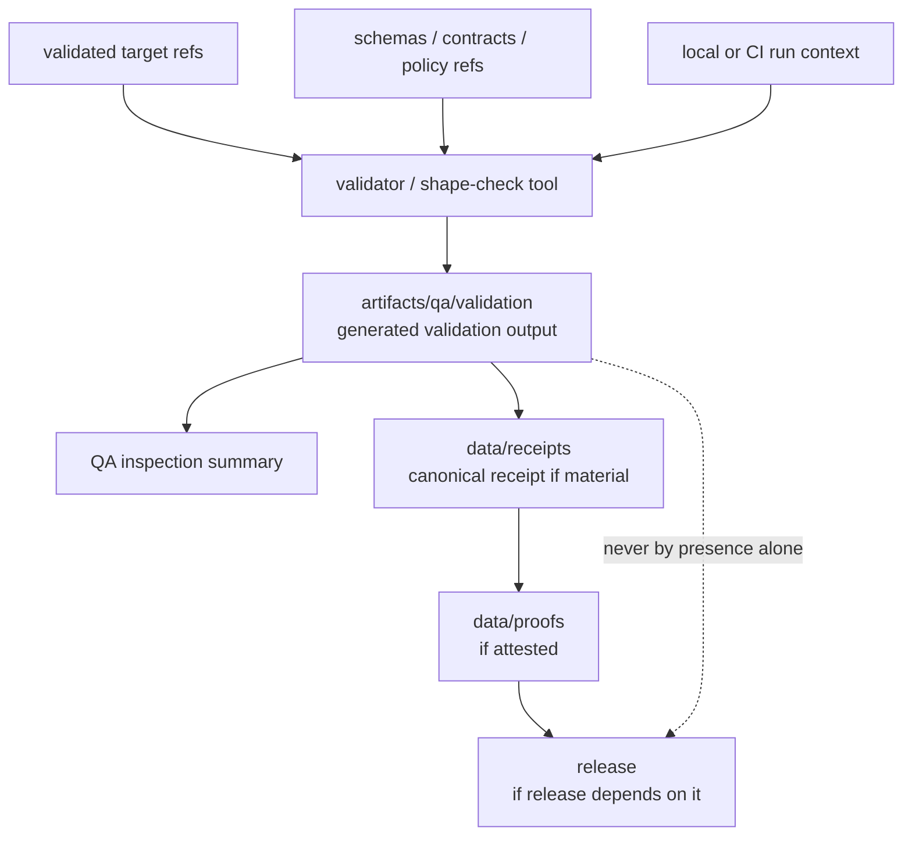

<!-- [KFM_META_BLOCK_V2]
doc_id: kfm://doc/artifacts-qa-validation-readme
title: artifacts/qa/validation/ — Validation QA Outputs
type: readme
version: v0.1
status: draft
owners: OWNER_TBD — QA steward · Validation steward · Schema steward · Contract steward · Docs steward
created: 2026-06-16
updated: 2026-06-16
policy_label: public
related:
  - ../README.md
  - ../../README.md
  - ../../../docs/doctrine/directory-rules.md
  - ../../../schemas/contracts/v1/
  - ../../../contracts/
  - ../../../policy/
  - ../../../tools/
  - ../../../tests/
  - ../../../data/receipts/README.md
  - ../../../data/proofs/README.md
  - ../../../release/README.md
tags: [kfm, artifacts, qa, validation, validator-output, validationreport, schemas, contracts, compatibility-root, transitional, non-authoritative]
notes:
  - "Replaces an empty artifacts/qa/validation README with a bounded validation-QA-output contract."
  - "This directory is a compatibility/transitional QA-output lane for generated validator inspection copies and aggregate validation summaries; it is not a schema authority, contract authority, receipt store, proof store, release record, lifecycle store, or policy gate."
  - "Specific validation files, validator versions, workflow names, thresholds, CI pass state, source mapping, retention rules, and report freshness remain NEEDS VERIFICATION."
[/KFM_META_BLOCK_V2] -->

<a id="top"></a>

<div align="center">

# Validation QA Outputs

`artifacts/qa/validation/`

**Compatibility/transitional QA-output lane for generated validator inspection copies, aggregate validation summaries, schema/contract check exports, and other validation-view artifacts. Files here may help inspect a run, but they are not canonical schemas, contracts, receipts, proofs, release decisions, or lifecycle state.**


[Purpose](#1-purpose) · [Repo fit](#2-repo-fit) · [Authority boundary](#3-authority-boundary) · [Allowed contents](#5-allowed-contents) · [Forbidden contents](#6-forbidden-contents) · [Validation](#10-validation-expectations) · [Definition of done](#12-definition-of-done)

</div>

---

> [!IMPORTANT]
> **Status:** draft / `NEEDS VERIFICATION`  
> **Path:** `artifacts/qa/validation/README.md`  
> **Responsibility root:** `artifacts/` — compatibility root, QA output scaffold  
> **Truth posture:** CONFIRMED README path / CONFIRMED parent `artifacts/qa/` QA-output boundary / CONFIRMED parent `artifacts/` compatibility-root boundary / PROPOSED validation-output contract / UNKNOWN actual validation files, validators, workflow names, thresholds, CI runs, source mapping, retention policy, and report freshness

> [!CAUTION]
> `artifacts/qa/validation/` is not schema authority, contract authority, policy authority, lifecycle authority, or release authority. A generated validation output staged here does not approve data, publish artifacts, or replace canonical ValidationReports, receipts, proofs, or review decisions.

---

## 1. Purpose

`artifacts/qa/validation/` holds generated validation inspection outputs from local or CI runs.

Typical accepted material includes:

- aggregate validator inspection copies;
- schema validation summaries;
- contract validation summaries;
- policy/preflight validation summaries when generated as QA output;
- shape-check exports for catalog, source, release, receipt, or proof DTOs;
- non-authoritative per-run validation metadata;
- temporary validation artifacts used for reviewer inspection.

Files here may help a reviewer understand a run, but they are not canonical ValidationReports, receipts, proofs, release records, schemas, contracts, policy decisions, or canonical evidence.

This README does not prove any validation report currently exists, any validator job writes here, any threshold was met, or any CI run passed.

[Back to top](#top)

---

## 2. Repo fit

| Concern | Owning root | Expected relationship |
|---|---|---|
| Validation QA output | `artifacts/qa/validation/` | Generated, non-authoritative validator inspection copies |
| QA output parent | `artifacts/qa/` | Lint, coverage, reports, and validator inspection copies |
| Compatibility root | `artifacts/` | Transitional compatibility root; trust content forbidden |
| Schemas | `schemas/contracts/v1/` | Machine shape authority; not copied here as authority |
| Contracts | `contracts/` | Object meaning authority; not copied here as authority |
| Policy | `policy/` | Policy rules and decisions; not stored here |
| Validators/tools | `tools/`, package-local tooling | Source tools and generators; not output here |
| Tests and fixtures | `tests/`, package-local tests | Source test definitions and fixtures; not stored here |
| CI workflows | `.github/` | Workflow definitions and CI enforcement |
| Receipts | `data/receipts/` | Canonical process-memory and receipt home, if material |
| Proofs / EvidenceBundles | `data/proofs/` | Canonical evidence/proof home |
| Release records | `release/` | ReleaseManifest, RollbackCard, CorrectionNotice, release decisions |

## 3. Authority boundary

`artifacts/qa/validation/` has **compatibility authority only**. It may hold generated validation inspection copies; it does not establish schema authority, contract authority, data validity, policy compliance, evidence support, test authority, CI authority, release readiness, or publication state.

```text
VALIDATION INPUTS              QA OUTPUT STAGING              TRUST / DECISION HOMES
schemas/ contracts/     --->   artifacts/qa/validation/  ---> data/receipts/ if material
policy/ data candidates        generated inspection only      data/proofs/ if material
tools/ tests/ .github/         not authoritative              release/ if applicable
```

A validation file in this folder may be cited by a QA summary or receipt, but the canonical trust-bearing object must live elsewhere.

## 4. Default posture

Validation output in this folder should be treated as **inspection support only**.

A validation output should not be treated as proof of correctness, safety, evidence support, policy compliance, review approval, release readiness, or publication state unless the relevant canonical records and checks exist:

- source `git_sha` and validated target refs;
- schema, contract, policy, validator, and fixture versions;
- CI workflow/run id or local run context;
- validation rule profile and pass/fail result;
- validation output digest where material;
- canonical ValidationReport or QA receipt in `data/receipts/` where material;
- proof or attestation in `data/proofs/` where material;
- release manifest linkage where release depends on the result;
- known limitations, ignored items, and excluded paths.

## 5. Allowed contents

| Allowed artifact | Examples | Required posture |
|---|---|---|
| Aggregate validation summary | `validation-summary.json`, `summary.md` | Generated and non-authoritative |
| Schema validation export | `schema-validation.json`, `schema-validation.txt` | Machine output only; schemas live elsewhere |
| Contract validation export | `contract-validation.json`, `contract-validation.txt` | Machine output only; contracts live elsewhere |
| Policy/preflight validation export | `policy-preflight.json` | QA output only, not PolicyDecision authority |
| DTO shape-check export | `source-descriptor-check.json`, `receipt-check.json` | Non-authoritative inspection aid |
| Run metadata | `validation-run.json` | Non-sensitive source refs, tool versions, run id |

## 6. Forbidden contents

| Forbidden here | Correct home |
|---|---|
| Canonical schemas | `schemas/contracts/v1/` |
| Canonical contracts | `contracts/` |
| Policy rules or PolicyDecision authority | `policy/` and governed policy-decision homes |
| Validator source or generator code | `tools/`, `pipelines/`, package config, or repo-root config locations |
| Source tests or fixtures | `tests/`, package-local test roots, or fixture roots |
| CI workflow definitions | `.github/` |
| RunReceipt, TransformReceipt, ValidationReport, AIReceipt, RedactionReceipt | `data/receipts/` |
| EvidenceBundle, proof bundles, attestations | `data/proofs/` |
| ReleaseManifest, RollbackCard, CorrectionNotice | `release/` |
| Published artifacts or released reports | `data/published/` after governed release |
| Catalog records, source descriptors, registry records | `data/catalog/`, `data/registry/`, or governed registry homes |
| Deployment-only values | Deployment secret/config channels, never this directory |
| Long-lived QA decisions or release gates | `release/`, `data/receipts/`, or governed decision homes |

## 7. Directory shape

Current implementation inventory remains `NEEDS VERIFICATION`.

```text
artifacts/qa/validation/
├── README.md
├── validation-summary.json          # PROPOSED non-authoritative summary
├── validation-run.json              # PROPOSED non-sensitive run metadata
├── schema-validation.json           # PROPOSED schema validation export
├── contract-validation.json         # PROPOSED contract validation export
├── policy-preflight.json            # PROPOSED policy/preflight QA export
├── receipt-check.json               # PROPOSED receipt shape-check output
└── source-descriptor-check.json     # PROPOSED source descriptor shape-check output
```

> [!WARNING]
> Do not treat this suggested shape as repo fact. Verify actual validation files, workflows, validated targets, validator versions, rule configs, and run ids before making implementation claims.

## 8. Diagram



## 9. Obligations

| Obligation | Example effect |
|---|---|
| `generated_only` | Validation files are generated outputs, not schemas/contracts/policy |
| `non_authoritative` | Validation copies assist inspection but do not prove correctness |
| `target_ref_required` | Material outputs should identify source `git_sha` and validated targets |
| `tool_ref_required` | Validator versions and rule configuration should be known |
| `receipt_elsewhere` | Trust-bearing validation receipts and ValidationReports go to `data/receipts/`, not here |
| `proof_elsewhere` | Proofs/attestations go to `data/proofs/`, not here |
| `release_elsewhere` | Release decisions and manifests go to `release/`, not here |
| `no_sensitive_metadata` | Reports must not expose protected paths or deployment-only values |
| `safe_to_delete_if_regenerable` | Contents should be rebuildable or documented as exceptions |
| `no_parallel_authority` | This folder must not become a second schema, contract, policy, release, or proof root |

## 10. Validation expectations

Useful validation for this folder should cover:

- every retained validation output maps to a source ref and validated target;
- validation outputs contain no deployment-only values or protected path detail;
- validation output is generated, not hand-authored decisions;
- validator versions, schema refs, contract refs, policy refs, and excluded paths are documented where material;
- no receipts, proofs, release records, catalog records, source descriptors, schemas, contracts, policy rules, source tests, or source code are stored here;
- outputs are temporary/regenerable or referenced by governed records outside this directory;
- retention/pruning behavior is documented;
- release binding, if any, happens through `release/` and canonical receipts/proofs, not by treating this folder as public.

## 11. Safe change pattern

For changes under `artifacts/qa/validation/`:

1. Confirm the file is a generated validation inspection output and not source or trust content.
2. Confirm source refs, validated targets, schema refs, contract refs, tool versions, and rule configs are known.
3. Scrub protected path detail and deployment-only values.
4. Keep outputs deterministic and regenerable where practical.
5. Write canonical receipts/proofs/release records to their owning roots, not here.
6. Document ignored items, rule profiles, validator versions, and known limitations where material.
7. Update this README, parent `artifacts/qa/` docs, validation tooling docs, schemas/contracts/policy docs, receipts/proofs/release docs, and tests when behavior materially changes.

## 12. Definition of done

- [ ] Owners are confirmed and `OWNER_TBD` is replaced.
- [ ] Actual validation-output inventory is verified.
- [ ] Validated targets and source refs are documented.
- [ ] Validator versions, schema refs, contract refs, and rule configuration are documented.
- [ ] Metadata-scrubbing expectations are documented.
- [ ] Retention and pruning behavior are documented.
- [ ] Canonical receipt/proof/release homes are linked where material.
- [ ] No trust-bearing records live here.
- [ ] No schemas, contracts, policy rules, source tests, source code, deployment-only values, or release decisions live here.
- [ ] CI/workflow behavior is verified or marked `NEEDS VERIFICATION`.

## 13. Open verification items

| Item | Why it matters |
|---|---|
| Confirm actual files under `artifacts/qa/validation/` | Prevents overclaiming validation inventory |
| Confirm validation jobs that write here | Required before CI/workflow claims |
| Confirm validation formats and validator versions | Required before shape claims |
| Confirm schema/contract/policy refs | Required before validation interpretation |
| Confirm source refs and validated targets | Required before validation interpretation |
| Confirm metadata scrubbing | Required before safe-publication claims |
| Confirm retention/pruning policy | Required before storage-lifecycle claims |
| Confirm no trust records are stored here | Required before Directory Rules compliance claims |
| Confirm release handoff, if any | Required before release-readiness claims |
| Confirm generated output freshness | Required before relying on any report |

<details>
<summary>Appendix A — no-loss preservation note</summary>

The previous README was empty. This replacement adds a bounded validation-QA-output contract without claiming validation files, validator versions, schema refs, contract refs, policy refs, validated targets, workflow names, CI pass state, retention behavior, release linkage, or generated report freshness are implemented.

</details>

## Status summary

`artifacts/qa/validation/` is a transitional compatibility lane for generated validation QA outputs. It is useful for inspection, but it does not carry trust by itself.

A validation output here becomes relevant to KFM trust only when canonical receipts, proofs, release records, or review decisions elsewhere reference it and pass the appropriate validation, policy, review, publication, correction, and rollback gates.

<p align="right"><a href="#top">Back to top</a></p>
