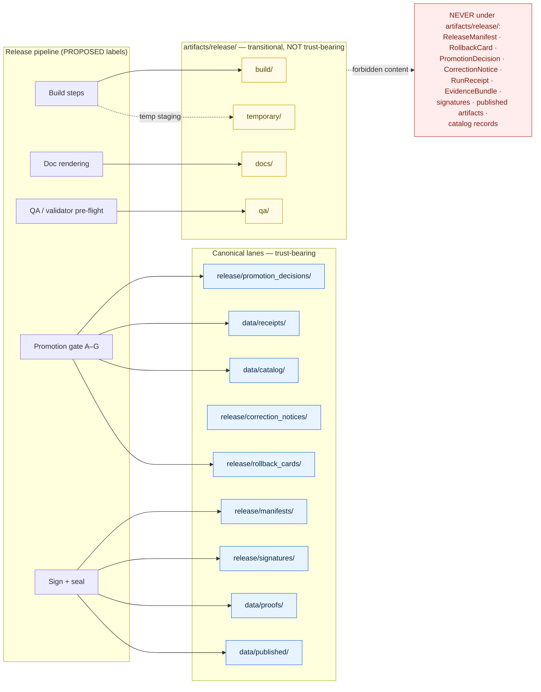

<!-- [KFM_META_BLOCK_V2]
doc_id: kfm://doc/<assign-on-merge>
title: artifacts/release/ — Release-pipeline build scratch (compatibility · transitional)
type: readme
version: v1.0.0
status: draft
owners:
  - team: release-engineering           # PLACEHOLDER — NEEDS VERIFICATION (no CODEOWNERS inspected)
  - team: directory-rules-steward       # PLACEHOLDER — NEEDS VERIFICATION
  - reviewer: <release-authority>       # PLACEHOLDER — assign per Directory Rules §17
created: 2026-05-20
updated: 2026-05-20
policy_label: public
related:
  # Parent compatibility root
  - ../README.md                                  # artifacts/ compatibility-root README (§8.2) — NEEDS VERIFICATION
  # Canonical release plane (Directory Rules §9.2)
  - ../../release/README.md
  - ../../release/manifests/README.md             # ReleaseManifest home
  - ../../release/promotion_decisions/README.md   # PromotionDecision home
  - ../../release/rollback_cards/README.md        # RollbackCard home
  - ../../release/correction_notices/README.md    # CorrectionNotice home
  - ../../release/withdrawal_notices/README.md    # Withdrawal notice home
  - ../../release/signatures/README.md            # DSSE / Sigstore / cosign home
  - ../../release/changelog/README.md             # Authoritative changelog home
  - ../../release/candidates/README.md            # Release-candidate dossiers
  # Canonical data plane (Directory Rules §9.1)
  - ../../data/receipts/README.md                 # RunReceipt / PromotionReceipt / AIReceipt / VerifyReceipt
  - ../../data/proofs/README.md                   # EvidenceBundle / ProofPack / integrity bundles
  - ../../data/published/README.md                # Sealed PMTiles / GeoJSON / COG / GeoParquet / style bundles
  - ../../data/catalog/README.md                  # STAC / DCAT / PROV records
  - ../../data/rollback/README.md                 # Alias-revert receipts (data plane)
  - ../../data/registry/README.md                 # SourceDescriptor / rights / sensitivity rows
  # Doctrine and tooling
  - ../../docs/doctrine/directory-rules.md                 # Authoritative placement source — NEEDS VERIFICATION (mounted path)
  - ../../tools/validators/README.md              # Validator orchestrator (Directory Rules §7.5.a)
  # Doctrinal references (logical IDs, not file paths)
  - kfm://doctrine/directory-rules
  - kfm://doctrine/unified-synthesis
  - kfm://doctrine/atlas-v1.1
tags:
  - kfm
  - artifacts
  - release
  - compatibility-root
  - transitional
  - build-scratch
  - non-trust-bearing
  - readme
  - directory-rules
  - anti-pattern-fence
  - section-15-contract
notes:
  - "PROPOSED path: artifacts/release/ not verified against a mounted repo this session (no mount available)."
  - "Authority class is COMPATIBILITY · TRANSITIONAL, inherited from parent artifacts/ per Directory Rules §8.1 (CONFIRMED doctrine)."
  - "TRUST-BEARING CONTENT IS FORBIDDEN HERE. See the 14-row redirect table under 'What does NOT belong here'."
  - "Dual purpose: (1) declare scope per §15 README contract; (2) function as the anti-pattern fence per §13.5 fix directive ('add artifacts/ README forbidding it')."
  - "Open ADR — Treatment of artifacts/ (Directory Rules §18 OPEN). This sub-folder's long-term existence depends on that decision."
  - "Open ADR — CI anti-pattern guard for trust content under artifacts/ (the enforcement half of §13.5)."
  - "Open ADR — Retention policy for artifacts/release/temporary/."
  - "doc_id assigned at merge time; spec_hash computed at merge via JCS (RFC 8785) + SHA-256 per Unified Doctrine §13 (CONFIRMED)."
  - "Owners are PLACEHOLDERS — replace with actual CODEOWNERS entries after repo inspection."
  - "Next review trigger: (a) artifacts/ treatment ADR ratified; OR (b) first CI write to this path with producers confirmed against workflow files; OR (c) 2026-11-20 per Directory Rules §15 six-month review cadence."
  - "Grounded citations: Directory Rules §§8.1, 8.2, 9.1, 9.2, 13.2, 13.5, 15, 18 OPEN; Atlas §24.9.1; Unified Doctrine Synthesis §§12, 13, 29.1; Pass-10 §§C1-01, C1-02."
  - "On mounted-repo inspection: verify every related-link, the proposed substructure tree (build/ · docs/ · qa/ · temporary/), and the validator-orchestrator exit-code contract (§7.5.a, OPEN-DR-03)."
[/KFM_META_BLOCK_V2] -->

# `artifacts/release/`

> **Release-pipeline build scratch.** Non-trust-bearing build, docs, and QA outputs from the release pipeline. Trust-bearing release state lives in [`release/`](../../release/) — not here.

<!-- [KFM_META_BLOCK_V2]
doc_id: kfm://doc/artifacts-release-readme
title: artifacts/release/ — release pipeline build scratch
type: readme
version: v1
status: draft
owners: <release-engineering> <TBD>
created: 2026-05-20
updated: 2026-05-20
policy_label: public
related: [
  ../README.md,
  ../../release/README.md,
  ../../docs/doctrine/directory-rules.md,
  ../../data/receipts/README.md,
  ../../data/proofs/README.md,
  ../../data/published/README.md
]
tags: [kfm, artifacts, release, compatibility, transitional, build-scratch]
notes: [
  "PROPOSED path: not verified in mounted repo (no mount this session).",
  "Sub-folder of compatibility root artifacts/ per Directory Rules §8.1.",
  "Inherits transitional class from parent; trust content is forbidden.",
  "Open ADR: treatment of artifacts/ — Directory Rules §18 OPEN."
]
[/KFM_META_BLOCK_V2] -->


<!-- TODO: replace badge targets with real CI / coverage / version / signed-build endpoints once available. -->

| Status | Authority class | Owners | Last updated |
|---|---|---|---|
| `PROPOSED` (path) | `transitional` (compatibility) | `<release-engineering>` *(placeholder, NEEDS VERIFICATION)* | 2026-05-20 |

---

## Quick jump

- [Purpose](#purpose)
- [Authority level](#authority-level)
- [Status](#status)
- [What belongs here](#what-belongs-here)
- [What does NOT belong here](#what-does-not-belong-here)
- [Inputs](#inputs)
- [Outputs](#outputs)
- [Validation](#validation)
- [Review burden](#review-burden)
- [Directory tree (PROPOSED)](#directory-tree-proposed)
- [Trust membrane diagram](#trust-membrane-diagram)
- [Related folders](#related-folders)
- [ADRs](#adrs)
- [FAQ](#faq)
- [Last reviewed](#last-reviewed)

---

## Purpose

`artifacts/release/` holds **build-class outputs produced by the release pipeline** — rendered release-notes pages, changelog renders, release-CI QA reports, link-check outputs, schema dry-run reports, and similar transient material that supports the release process but **is not itself trust-bearing**.

Material here is reproducible by re-running the pipeline from pinned inputs, safe to delete once superseded, and excluded from the trust membrane. The folder exists for the same reason the rest of `artifacts/` exists: to keep build/docs/QA scratch out of the canonical lanes that carry release decisions, receipts, evidence, and published data.

> [!IMPORTANT]
> The **release decision** — the `ReleaseManifest`, `PromotionDecision`, `RollbackCard`, `CorrectionNotice`, DSSE/Sigstore signatures — never lives here. It lives under [`release/`](../../release/). See [What does NOT belong here](#what-does-not-belong-here) for the full redirect table.

---

## Authority level

**Compatibility — `transitional`.**

Per Directory Rules §8.1 (CONFIRMED doctrine), `artifacts/` is a compatibility root with default class `transitional`; canonical homes for the categories `artifacts/` historically absorbed are `data/receipts/`, `data/proofs/`, `release/`, and `data/published/`. `artifacts/release/` inherits its parent's class.

This folder is **not** a canonical home for any release-plane object. It is, at most, a build/docs/QA scratch sub-folder scoped to the release pipeline.

> [!NOTE]
> Whether `artifacts/` survives as a long-term compatibility root or is fully retired in favor of `data/receipts/`, `data/proofs/`, `release/`, and `data/published/` is an **open ADR question** (Directory Rules §18 OPEN — CONFIRMED open item). Until resolution, this folder MUST be scoped narrowly per §8.2 and MUST NOT accrete trust content.

---

## Status

| Field | Value | Basis |
|---|---|---|
| Path presence | `PROPOSED` | No mounted repo inspected this session. |
| Authority class | `transitional` (compatibility) | Directory Rules §8.1 — CONFIRMED doctrine. |
| Trust-bearing | **No** | Directory Rules §8.2, §13.5 — CONFIRMED. |
| Canonical sibling for decisions | [`release/`](../../release/) | Directory Rules §9.2 — CONFIRMED. |
| Open ADR | Treatment of `artifacts/` | Directory Rules §18 OPEN — CONFIRMED open item. |
| README contract | §15 required | Directory Rules §15 — CONFIRMED requirement. |
| Mounted-repo verification | Not done | No mount available this session. |

---

## What belongs here

The following are **PROPOSED** categories of material consistent with the `artifacts/` rule (Directory Rules §8.2 — CONFIRMED doctrine) when associated with a release pipeline run:

| Allowed (PROPOSED) | Why it fits the `artifacts/` rule |
|---|---|
| Rendered release-notes pages (HTML, PDF) | Generated documentation — `docs/`-class per §8.2. |
| Rendered changelog (HTML, PDF) | Generated documentation — `docs/`-class. |
| Release-CI lint / link-check / spell-check reports | QA scratch — `qa/`-class. |
| Schema dry-run, validator pre-flight reports | QA scratch — `qa/`-class. |
| Release-candidate distributable builds (tarballs, zips) **prior to** sealing | Build outputs — `build/`-class. The **sealed** artifact (with `spec_hash`, signature, manifest reference) is `data/published/`-class once promoted. |
| Ephemeral release-staging files | `temporary/`-class; gitignored or pruned regularly. |

Material here MUST be reproducible by re-running the pipeline from pinned inputs. Loss of this folder must not break a release; only `release/` and `data/` carry irrecoverable state.

---

## What does NOT belong here

This is the most important section of this README. The following objects are **trust-bearing** under KFM doctrine and MUST live in their canonical homes, **not here**. (CONFIRMED doctrine: Directory Rules §8.2, §9.1, §9.2, §13.5.)

| If you have… | It does **not** live here. It lives in… | Source |
|---|---|---|
| `ReleaseManifest` / `MapReleaseManifest` | [`release/manifests/`](../../release/manifests/) | Directory Rules §9.2 |
| `PromotionDecision` / `PromotionReceipt` (release-side decision) | [`release/promotion_decisions/`](../../release/promotion_decisions/) | Directory Rules §9.2 |
| `RollbackCard` | [`release/rollback_cards/`](../../release/rollback_cards/) | Directory Rules §9.2 |
| `CorrectionNotice` | [`release/correction_notices/`](../../release/correction_notices/) | Directory Rules §9.2 |
| Withdrawal notice | [`release/withdrawal_notices/`](../../release/withdrawal_notices/) | Directory Rules §9.2 |
| DSSE / Sigstore / cosign signatures, Rekor entries | [`release/signatures/`](../../release/signatures/) | Directory Rules §9.2 |
| Release-level **authoritative** changelog | [`release/changelog/`](../../release/changelog/) | Directory Rules §9.2 |
| Release-candidate dossier | [`release/candidates/`](../../release/candidates/) | Directory Rules §9.2 |
| `RunReceipt`, `PromotionReceipt`, `AIReceipt`, `RedactionReceipt`, `AggregationReceipt`, `VerifyReceipt`, `CitationValidationReport` | [`data/receipts/`](../../data/receipts/) | Directory Rules §9.1 |
| `EvidenceBundle`, `ProofPack`, integrity bundles | [`data/proofs/`](../../data/proofs/) | Directory Rules §9.1 |
| Sealed/published PMTiles, GeoJSON, COG, GeoParquet, style bundles | [`data/published/`](../../data/published/) | Directory Rules §9.1 |
| STAC / DCAT / PROV catalog records | [`data/catalog/`](../../data/catalog/) | Directory Rules §9.1 |
| Alias-revert receipts (data plane) | [`data/rollback/`](../../data/rollback/) | Directory Rules §9.1 |
| `SourceDescriptor`, source / layer / dataset / rights / sensitivity registry rows | [`data/registry/`](../../data/registry/) | Directory Rules §9.1 |

> [!WARNING]
> **Trust content in `artifacts/` is the named anti-pattern** in Directory Rules §13.5 and atlas §24.9.1 (CONFIRMED doctrine). Putting any of the rows above under `artifacts/release/` collapses build output, process memory, and trust-bearing records into a single un-governed directory and bypasses the trust membrane. PRs that do this should fail review.

### Trust-bearing test

If any of these is true, the file is **trust-bearing** and does not belong here:

- It carries a `spec_hash` that consumers verify (JCS canonicalization + SHA-256, recorded as `jcs:sha256:<hex>` — CONFIRMED, KFM Components Pass 10 §C1-02).
- It records a governed state transition (RAW → WORK/QUARANTINE → PROCESSED → CATALOG/TRIPLET → PUBLISHED — CONFIRMED core invariant).
- It is referenced by a `ReleaseManifest`, an `EvidenceRef`, an `EvidenceBundle`, or a `RollbackCard`.
- It is signed (DSSE, cosign, Rekor) as part of the release attestation chain.
- Removing it would break replay verification or rollback (CONFIRMED replay discipline — KFM-P5-PROG-0010).

When in doubt: **do not put it here.** Open an issue or ADR.

[Back to top](#artifactsrelease)

---

## Inputs

PROPOSED — no mounted-repo inspection in this session. Likely producers:

- Release-CI workflows (e.g., GitHub Actions release pipeline jobs).
- Documentation build steps rendering release-notes and changelog from sources under [`release/changelog/`](../../release/changelog/) and [`docs/`](../../docs/).
- The validator orchestrator (`tools/validators/validate_all.py` — PROPOSED, Directory Rules §7.5.a) when run in `--fast` mode for pre-release CI gates. The orchestrator's exit-code contract is **ADR-class** per §2.4(5); see Directory Rules §18 OPEN-DR-03.
- Ad-hoc release-cut scripts under `scripts/one_off/` (a holding pen, not a permanent home — Directory Rules §7).

All inputs MUST be pinned and reproducible. Anything not reproducible is a build-system bug.

---

## Outputs

PROPOSED: this folder emits **downstream-readable** material only — never authoritative state.

- Rendered release-notes pages for the documentation site.
- Rendered changelog for the documentation site.
- QA reports surfaced in PR check-runs and CI summaries.
- Distributable archives staged for upload, **before** they are sealed, hashed, signed, and recorded under `release/manifests/` + `release/signatures/` + `data/published/`.

Once a build output becomes trust-bearing — a `spec_hash` is computed and pinned, a signature is attached, a `ReleaseManifest` references it — it MUST migrate to its canonical home (Directory Rules §9.1, §9.2 — CONFIRMED).

---

## Validation

This folder is **excluded** from trust-bearing validators (schema-against-receipt, attestation-presence, replay-hash, evidence-bundle integrity). PROPOSED: the validator orchestrator (Directory Rules §7.5.a) skips this path or reports `skip` on its registry entries.

It **is** checked by:

- Build-output integrity (file exists, non-empty, expected content type).
- Markdown / HTML lint, link-check, accessibility checks (for rendered docs under `docs/`).
- QA-report schema validation when a report itself has a stable schema.
- An **anti-pattern guard**: a CI rule that fails the build if any file matching `*ReleaseManifest*.json`, `*RollbackCard*.json`, `*PromotionDecision*.json`, `*CorrectionNotice*.json`, `*receipt*.json`, `*evidence*bundle*.json`, `*.sig`, `*.dsse`, or `*.intoto.jsonl` appears anywhere under `artifacts/release/`. (PROPOSED — corresponds to the §13.5 anti-pattern fix: *"add `artifacts/` README forbidding it."*)

> [!CAUTION]
> A passing build under `artifacts/release/` is **not** proof of release. Release proof lives in `release/` (decisions) + `data/proofs/` (evidence) + `data/receipts/` (process memory). Treating an `artifacts/release/` output as authoritative is the anti-pattern Directory Rules §13.2 names: *"`artifacts/`, `data/proofs/`, `data/receipts/`, and `release/` mixing proof, process memory, build output, and release decisions."* (CONFIRMED.)

---

## Review burden

PROPOSED — NEEDS VERIFICATION against a `CODEOWNERS` file (not inspected this session):

- **Release engineering / build owners** — changes to layout, retention, or CI integration.
- **Documentation owners** — release-notes and changelog rendering.
- **Directory Rules steward** — any change to scope, class, or substructure (per §17 decision matrix).
- **ADR-class change** — required if scope expands or any trust-bearing category is admitted (per Directory Rules §2.4).

[Back to top](#artifactsrelease)

---

## Directory tree (PROPOSED)

The substructure below mirrors the parent `artifacts/` substructure from Directory Rules §8.2 (CONFIRMED), scoped to the release pipeline.

```text
artifacts/release/
├── README.md          # this file
├── build/             # release-pipeline build outputs (archives, dist files) — pre-seal only
├── docs/              # rendered release notes, changelog renders, distribution documentation
├── qa/                # release-CI lint, link-check, accessibility, schema dry-run reports
└── temporary/         # ephemeral; gitignored or pruned regularly
```

> [!NOTE]
> This tree is **PROPOSED**. No mounted-repo inspection in this session verifies its presence, its naming, or which producers write into which sub-folder. Treat any sub-folder above as a placement target awaiting verification.

---

## Trust membrane diagram

The diagram below shows the membrane between `artifacts/release/` (build scratch, non-trust) and the canonical release/data lanes (trust-bearing). Solid arrows indicate allowed flows; the red node lists categories that MUST NOT land here.



> [!NOTE]
> Diagram structure is doctrinally grounded (Directory Rules §§8.2, 9.1, 9.2, 13.5 — CONFIRMED), but **producer node labels are illustrative**. Actual release-pipeline job names, workflow files, and gate identifiers are **NEEDS VERIFICATION** against mounted CI workflows.

[Back to top](#artifactsrelease)

---

## Related folders

| Folder | Relationship |
|---|---|
| [`../README.md`](../README.md) | Parent compatibility-root README; declares `artifacts/` class and forbids trust content (Directory Rules §8.2). *(NEEDS VERIFICATION — confirm presence and §15 contract conformance.)* |
| [`../../release/`](../../release/) | **Canonical** home for release decisions: manifests, promotion decisions, rollback cards, correction notices, withdrawals, signatures, changelog, candidates. |
| [`../../data/receipts/`](../../data/receipts/) | Canonical home for process-memory receipts (run, validation, AI, ingest, release-side promotion receipts). |
| [`../../data/proofs/`](../../data/proofs/) | Canonical home for `EvidenceBundle`, `ProofPack`, integrity bundles. |
| [`../../data/published/`](../../data/published/) | Canonical home for released public-safe artifacts (PMTiles, GeoJSON, COG, GeoParquet, style bundles). |
| [`../../data/rollback/`](../../data/rollback/) | Canonical home for alias-revert receipts (data plane). |
| [`../../data/catalog/`](../../data/catalog/) | Canonical home for STAC / DCAT / PROV catalog records. |
| [`../../docs/doctrine/directory-rules.md`](../../docs/doctrine/directory-rules.md) | Authoritative placement source; especially §§8.1–8.2, §9.1–9.2, §13.5, §15, §18. *(Path NEEDS VERIFICATION — repo not mounted.)* |
| [`../../tools/validators/`](../../tools/validators/) | Validator orchestrator (`validate_all.py`); release CI may invoke a `--fast` subset whose QA reports land in `qa/`. |

<!-- TODO: verify every relative link above against mounted-repo evidence; any link returning 404 in the rendered README is a drift candidate. -->

---

## ADRs

PROPOSED ADRs (none yet ratified — NEEDS VERIFICATION against an inspected `docs/adr/` folder):

- **ADR-S-?? — Treatment of `artifacts/`.** Resolve whether `artifacts/` survives as a long-term compatibility root or is fully retired in favor of `data/receipts/`, `data/proofs/`, `release/`, and `data/published/`. Directory Rules §18 OPEN. **This sub-folder's existence depends on that decision.**
- **ADR-S-?? — Anti-pattern guard for `artifacts/`.** Standardize the CI rule that fails the build when trust-bearing object families appear under `artifacts/`. Per Directory Rules §13.5 fix: *"add `artifacts/` README forbidding it."* This README is the documentation half; the CI rule is the enforcement half.
- **ADR-S-?? — Retention policy for `artifacts/release/temporary/`.** Define a deterministic pruning rule (age, size, or per-release scope).

---

## FAQ

<details>
<summary><strong>Why does this folder exist at all if everything important goes elsewhere?</strong></summary>

Release pipelines produce two distinct kinds of output: **build scratch** (rendered docs, QA reports, transient distributables) and **trust-bearing state** (manifests, receipts, evidence, signatures). Mixing them in one directory is the named anti-pattern in Directory Rules §13.2 (CONFIRMED). `artifacts/release/` exists to hold the first kind, leaving `release/` and `data/` to hold the second. (PROPOSED implementation — folder not verified in mounted repo.)
</details>

<details>
<summary><strong>What about my release-notes draft — does it go here?</strong></summary>

The **rendered** release notes (HTML/PDF output of a build step) can live here under `docs/`. The **source** for release notes — the markdown, the changelog entries, the authoritative version line — belongs under [`release/changelog/`](../../release/changelog/) per Directory Rules §9.2 (CONFIRMED). Treat this folder as the rendering destination, not the authoring home.
</details>

<details>
<summary><strong>What if my object has a <code>spec_hash</code> but isn't signed yet?</strong></summary>

A `spec_hash` (JCS canonicalization + SHA-256, recorded as `jcs:sha256:<hex>` — CONFIRMED) is itself a sign that the object is becoming trust-bearing. Even unsigned, it likely belongs in `data/receipts/`, `data/proofs/`, or `release/` rather than here. If you genuinely need a holding area before promotion, use [`data/work/`](../../data/work/) or [`data/quarantine/`](../../data/quarantine/) (Directory Rules §9.1, CONFIRMED), not `artifacts/release/`.
</details>

<details>
<summary><strong>Can I cache pipeline intermediates here to speed up CI?</strong></summary>

Yes, under `temporary/`, with a documented pruning rule. Caches that survive across releases without an explicit retention policy tend to drift into accidental trust-bearing status; the `temporary/` convention is a deliberate guard against that.
</details>

<details>
<summary><strong>Where do DSSE / cosign / Rekor signatures go?</strong></summary>

[`release/signatures/`](../../release/signatures/) — never here. Directory Rules §9.2 (CONFIRMED). Signed artifacts are the explicit anti-pattern row in §13.5: *"Release manifests, evidence bundles, signed receipts in `artifacts/`."*
</details>

<details>
<summary><strong>If I delete this folder, will a release break?</strong></summary>

No. By design, every output under `artifacts/release/` is reproducible from pinned pipeline inputs. If deletion would break a release, the content was trust-bearing and belonged in `release/` or `data/` from the start — fix the placement, don't restore the file.
</details>

---

## Last reviewed

**2026-05-20** — initial authoring. PROPOSED path; no mounted-repo inspection.

Next review trigger: whichever comes first —

1. The `artifacts/` treatment ADR (Directory Rules §18 OPEN) is ratified, **or**
2. The release pipeline writes its first output to this path and producers can be confirmed against actual CI workflow files, **or**
3. Six months from this date (per the Directory Rules §15 "older than 6 months → flag for review" convention).

---

### Related docs

- [Directory Rules — root authority for placement](../../docs/doctrine/directory-rules.md) — especially §§8.1–8.2, §9.1–9.2, §13.5, §15, §18. *(Path NEEDS VERIFICATION.)*
- [`artifacts/README.md`](../README.md) — parent compatibility-root README. *(NEEDS VERIFICATION — confirm presence and §15 contract conformance.)*
- [`release/README.md`](../../release/README.md) — canonical release-plane README. *(TODO — verify presence.)*
- [`data/receipts/README.md`](../../data/receipts/README.md) — canonical receipts home. *(TODO — verify presence.)*
- [`data/proofs/README.md`](../../data/proofs/README.md) — canonical evidence/proof-pack home. *(TODO — verify presence.)*
- [`data/published/README.md`](../../data/published/README.md) — canonical published-artifact home. *(TODO — verify presence.)*

*Last updated: 2026-05-20 · [Back to top](#artifactsrelease)*
