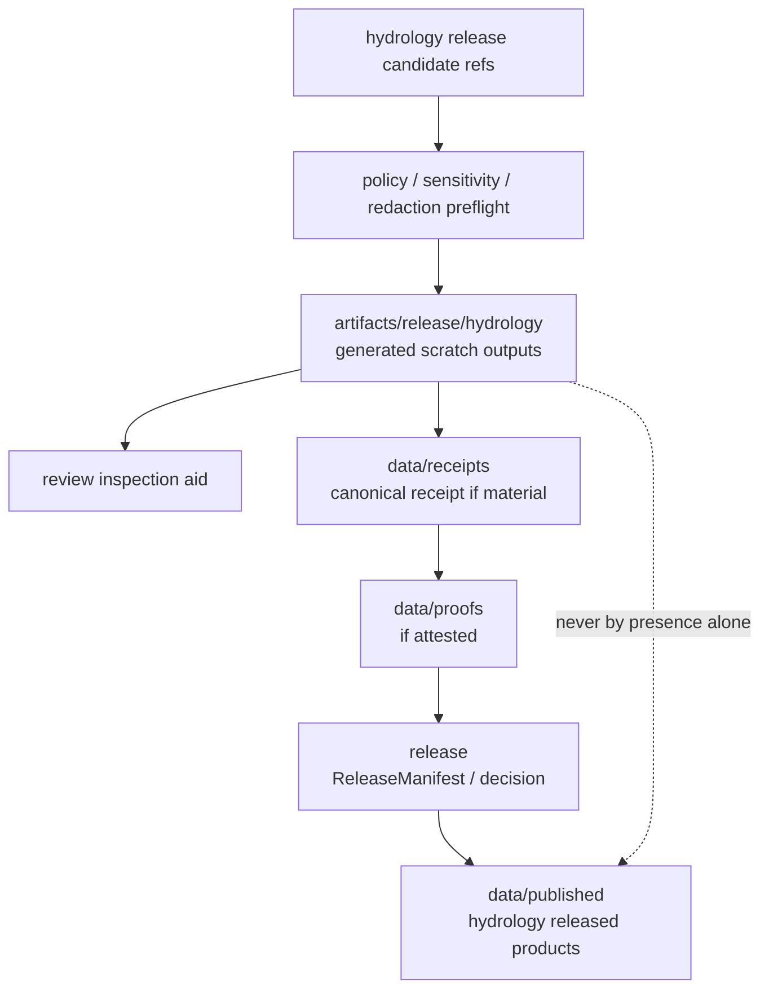

<!-- [KFM_META_BLOCK_V2]
doc_id: kfm://doc/artifacts-release-hydrology-readme
title: artifacts/release/hydrology/ — Hydrology Release-Pipeline Scratch Outputs
type: readme
version: v0.1
status: draft
owners: OWNER_TBD — Release steward · Hydrology steward · Infrastructure sensitivity steward · QA steward · Docs steward
created: 2026-06-16
updated: 2026-06-16
policy_label: public
related:
  - ../README.md
  - ../../README.md
  - ../../../release/README.md
  - ../../../data/receipts/README.md
  - ../../../data/proofs/README.md
  - ../../../data/published/README.md
  - ../../../data/catalog/README.md
  - ../../../policy/README.md
  - ../../../docs/doctrine/directory-rules.md
tags: [kfm, artifacts, release, hydrology, water, flood, infrastructure, sensitivity, qa, build-scratch, compatibility-root, transitional, non-trust-bearing]
notes:
  - "Replaces an empty artifacts/release/hydrology README with a bounded hydrology release-pipeline scratch contract."
  - "This directory is a compatibility/transitional release-pipeline scratch lane for generated hydrology release support outputs, not a release decision home, evidence store, receipt store, proof store, catalog, published hydrology layer home, source registry, infrastructure authority, or sensitivity authority."
  - "Specific hydrology release artifacts, workflow names, infrastructure/sensitivity decisions, redaction/generalization outputs, validation reports, retention rules, and release binding remain NEEDS VERIFICATION."
[/KFM_META_BLOCK_V2] -->

<a id="top"></a>

<div align="center">

# Hydrology Release-Pipeline Scratch Outputs

`artifacts/release/hydrology/`

**Compatibility/transitional scratch lane for generated hydrology release-pipeline support outputs: release-CI previews, rendered release notes, QA summaries, preflight validation copies, candidate package staging summaries, redaction/generalization inspection copies, and other non-trust-bearing review aids.**


[Purpose](#1-purpose) · [Repo fit](#2-repo-fit) · [Authority boundary](#3-authority-boundary) · [Sensitivity posture](#4-sensitivity-posture) · [Allowed contents](#5-allowed-contents) · [Forbidden contents](#6-forbidden-contents) · [Definition of done](#12-definition-of-done)

</div>

---

> [!IMPORTANT]
> **Status:** draft / `NEEDS VERIFICATION`  
> **Path:** `artifacts/release/hydrology/README.md`  
> **Responsibility root:** `artifacts/` — compatibility root, release-pipeline scratch lane  
> **Truth posture:** CONFIRMED README path / CONFIRMED parent `artifacts/release/` scratch boundary / CONFIRMED parent `artifacts/` compatibility-root boundary / PROPOSED hydrology release-scratch contract / UNKNOWN actual hydrology release files, workflows, sensitivity decisions, redaction outputs, validation reports, release binding, and retention policy

> [!CAUTION]
> `artifacts/release/hydrology/` is not a publication or release authority. It must not contain protected infrastructure detail, sensitive water-system detail, receipts, proofs, EvidenceBundles, ReleaseManifests, RollbackCards, CorrectionNotices, catalog records, source registry records, or published hydrology layers.

---

## 1. Purpose

`artifacts/release/hydrology/` holds **generated, non-authoritative release-pipeline support outputs** for hydrology-domain release work.

It may hold temporary or reproducible artifacts such as:

- generated hydrology release-preview pages;
- rendered release notes or changelog previews;
- hydrology release-CI QA summaries;
- preflight schema/contract/policy validation copies;
- redaction/generalization inspection copies;
- candidate package staging summaries before sealing;
- link-check, render-smoke, bundle, or visual-diff outputs for release review;
- non-sensitive run metadata used for review convenience.

Files here may help reviewers inspect a release-pipeline run, but they are not release decisions, proof of evidence, publication records, catalog records, source authority, or public hydrology products.

This README does not prove any hydrology release scratch output currently exists, any workflow writes here, any sensitivity gate passed, any validation succeeded, or any release consumes this directory.

[Back to top](#top)

---

## 2. Repo fit

| Concern | Owning root | Expected relationship |
|---|---|---|
| Hydrology release scratch | `artifacts/release/hydrology/` | Generated, non-authoritative release-pipeline support outputs |
| Release scratch parent | `artifacts/release/` | Release-pipeline build/docs/QA scratch, not trust state |
| Compatibility root | `artifacts/` | Transitional compatibility root; trust content forbidden |
| Release authority | `release/` | ReleaseManifest, PromotionDecision, RollbackCard, CorrectionNotice, signatures, changelog |
| Receipts | `data/receipts/` | Canonical process-memory and receipt home |
| Proofs / EvidenceBundles | `data/proofs/` | Canonical evidence/proof home |
| Published hydrology products | `data/published/` | Released product home after governed publication |
| Catalog records | `data/catalog/` | STAC/DCAT/PROV/catalog records |
| Source registry | `data/registry/` or governed registry home | Source descriptors, rights, sensitivity rows |
| Policy and sensitivity | `policy/` | Admissibility, sensitivity, redaction, rights, and release policies |
| Source code/build logic | `apps/`, `packages/`, `tools/`, `pipelines/` | Inputs and release/build implementation; not stored here |

## 3. Authority boundary

`artifacts/release/hydrology/` has **compatibility authority only**. It may hold generated support bytes or summaries; it does not establish hydrology truth, evidence support, source authority, infrastructure sensitivity approval, review approval, release state, publication state, catalog state, rollback readiness, or correction state.

```text
HYDROLOGY SOURCE / BUILD INPUTS       RELEASE SCRATCH STAGING              TRUST / RELEASE HOMES
pipelines tools docs data refs  --->  artifacts/release/hydrology/  --->   release/
policy refs review refs               generated support only               data/receipts/
redaction/generalization refs          not authoritative                    data/proofs/
                                                                            data/catalog/
                                                                            data/published/
```

A file here may be cited by a release QA summary or receipt, but the canonical trust-bearing object must live elsewhere.

## 4. Sensitivity posture

Hydrology release work is policy-sensitive where exact infrastructure, water-supply, flood-control, private-well, contamination, emergency-response, levee, dam, utility, facility, or private-land details could create exposure risk.

This folder must only hold **policy-safe inspection aids**. When sensitivity, rights, infrastructure exposure, or redaction/generalization posture is unresolved, the safe outcome is to withhold, redact, generalize, quarantine, deny publication, or route to review — not to place precise release previews here.

## 5. Allowed contents

| Allowed artifact | Examples | Required posture |
|---|---|---|
| Rendered release preview | `hydrology-release-preview.html`, `release-notes-preview.md` | Generated and non-authoritative |
| QA report copy | `hydrology-release-qa.json`, `link-check.txt`, `render-smoke.json` | Inspection aid only |
| Validation preflight copy | `schema-preflight.json`, `policy-preflight.json` | Copy only; canonical reports/receipts elsewhere |
| Redaction/generalization inspection summary | `redaction-summary.json`, `generalization-review.md` | Must avoid protected detail exposure |
| Candidate package staging summary | `candidate-package-summary.json` | Not sealed, not published, not release authority |
| Run metadata | `hydrology-release-run.json` | Non-sensitive refs, tool versions, run id |

## 6. Forbidden contents

| Forbidden here | Correct home |
|---|---|
| Protected infrastructure detail, water-system detail, or sensitive exact site details | Governed protected data homes with policy/redaction gates |
| ReleaseManifest, PromotionDecision, RollbackCard, CorrectionNotice, signatures | `release/` |
| RunReceipt, TransformReceipt, ValidationReport, AIReceipt, RedactionReceipt | `data/receipts/` |
| EvidenceBundle, proof bundles, attestations | `data/proofs/` |
| Published hydrology layers, tiles, files, packages, or public release bundles | `data/published/` after governed release |
| STAC/DCAT/PROV/catalog records | `data/catalog/` |
| Source descriptors, rights rows, sensitivity rows, registry records | `data/registry/` or governed registry homes |
| Schemas, contracts, policy rules | `schemas/`, `contracts/`, `policy/` |
| Source code, scripts, packages, build logic | `apps/`, `packages/`, `tools/`, `scripts/`, `pipelines/` |
| Deployment-only values | Deployment secret/config channels, never this directory |
| Long-lived release decisions or review decisions | `release/`, `data/receipts/`, review records, or governed decision homes |

## 7. Directory shape

Current implementation inventory remains `NEEDS VERIFICATION`.

```text
artifacts/release/hydrology/
├── README.md
├── release-preview.html             # PROPOSED generated release preview
├── release-notes-preview.md         # PROPOSED generated notes preview
├── hydrology-release-qa.json        # PROPOSED release QA inspection copy
├── schema-preflight.json            # PROPOSED validation preflight copy
├── policy-preflight.json            # PROPOSED policy preflight copy
├── redaction-summary.json           # PROPOSED non-sensitive redaction summary
└── hydrology-release-run.json       # PROPOSED non-sensitive run metadata
```

> [!WARNING]
> Do not treat this suggested shape as repo fact. Verify actual files, workflows, sensitivity gates, validated targets, release refs, and run ids before making implementation claims.

## 8. Diagram



## 9. Obligations

| Obligation | Example effect |
|---|---|
| `scratch_only` | Files here are generated support outputs, not release decisions |
| `sensitivity_first` | No protected hydrology or infrastructure detail unless policy-safe and reviewed |
| `redaction_required` | Sensitive location/attribute exposure must be redacted or generalized before preview |
| `receipt_elsewhere` | Trust-bearing process records go to `data/receipts/`, not here |
| `proof_elsewhere` | Evidence/proof support goes to `data/proofs/`, not here |
| `release_elsewhere` | Release decisions and manifests go to `release/`, not here |
| `published_elsewhere` | Public hydrology products go to `data/published/`, not here |
| `catalog_elsewhere` | Catalog records go to `data/catalog/`, not here |
| `safe_to_delete_if_regenerable` | Contents should be rebuildable or documented as exceptions |
| `no_parallel_authority` | This folder must not become a second hydrology release, evidence, catalog, or proof root |

## 10. Validation expectations

Useful validation for this folder should cover:

- every retained output maps to a source ref, release-candidate ref, and run id;
- outputs contain no protected hydrology/infrastructure detail, private protected context, deployment-only values, or internal-only paths;
- redaction/generalization summaries avoid exposing the sensitive details they summarize;
- outputs are generated inspection aids, not hand-authored release decisions;
- no receipts, proofs, release records, catalog records, source descriptors, schemas, contracts, policy rules, source code, or published artifacts are stored here;
- outputs are temporary/regenerable or referenced by governed records outside this directory;
- retention/pruning behavior is documented;
- release binding happens through `release/` and `data/published/`, not by treating this folder as public.

## 11. Safe change pattern

For changes under `artifacts/release/hydrology/`:

1. Confirm the file is generated hydrology release-pipeline scratch and not source or trust content.
2. Confirm source refs, release-candidate refs, sensitivity posture, redaction/generalization posture, tool versions, and rule configs are known.
3. Scrub protected hydrology detail, infrastructure exposure detail, protected path detail, and deployment-only values.
4. Keep outputs deterministic and regenerable where practical.
5. Write canonical receipts/proofs/release records/catalog records/published artifacts to their owning roots, not here.
6. Document ignored items, redaction/generalization limits, rule profiles, and known limitations where material.
7. Update this README, parent `artifacts/release/` docs, hydrology release docs, policy docs, receipts/proofs/release docs, and tests when behavior materially changes.

## 12. Definition of done

- [ ] Owners are confirmed and `OWNER_TBD` is replaced.
- [ ] Actual hydrology release scratch inventory is verified.
- [ ] Release-candidate refs, source refs, run ids, and tool versions are documented.
- [ ] Sensitivity, rights, redaction, and generalization posture are documented where material.
- [ ] Metadata-scrubbing expectations are documented.
- [ ] Retention and pruning behavior are documented.
- [ ] Canonical receipt/proof/release/catalog/published homes are linked where material.
- [ ] No trust-bearing records live here.
- [ ] No protected hydrology/infrastructure detail, source code, source registry records, schemas, contracts, policy rules, deployment-only values, or release decisions live here.
- [ ] CI/workflow behavior is verified or marked `NEEDS VERIFICATION`.

## 13. Open verification items

| Item | Why it matters |
|---|---|
| Confirm actual files under `artifacts/release/hydrology/` | Prevents overclaiming release scratch inventory |
| Confirm hydrology release jobs that write here | Required before CI/workflow claims |
| Confirm sensitivity/redaction/generalization checks | Required before safe-preview claims |
| Confirm release-candidate and source refs | Required before release-pipeline interpretation |
| Confirm report formats and tool versions | Required before shape claims |
| Confirm metadata scrubbing | Required before safe-publication claims |
| Confirm retention/pruning policy | Required before storage-lifecycle claims |
| Confirm no trust records are stored here | Required before Directory Rules compliance claims |
| Confirm release handoff | Required before release-readiness claims |
| Confirm generated output freshness | Required before relying on any preview/report |

<details>
<summary>Appendix A — no-loss preservation note</summary>

The previous README was empty. This replacement adds a bounded hydrology release-pipeline scratch contract without claiming release previews, QA reports, policy preflights, redaction summaries, workflow names, CI pass state, sensitivity decisions, retention behavior, release linkage, or generated output freshness are implemented.

</details>

## Status summary

`artifacts/release/hydrology/` is a transitional compatibility lane for generated hydrology release-pipeline scratch outputs. It is useful for inspection, but it does not carry trust by itself.

A file here becomes relevant to KFM trust only when canonical receipts, proofs, release records, catalog records, published artifacts, or review decisions elsewhere reference it and pass the appropriate evidence, validation, sensitivity, policy, review, publication, correction, and rollback gates.

<p align="right"><a href="#top">Back to top</a></p>
