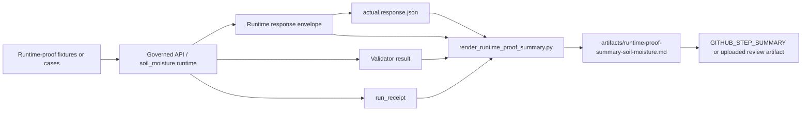

<!-- [KFM_META_BLOCK_V2]
doc_id: kfm://doc/NEEDS_VERIFICATION__runtime_proof_summary_soil_moisture
title: Runtime Proof Summary — Soil Moisture
type: standard
version: v1
status: draft
owners: NEEDS_VERIFICATION__artifacts_owner
created: NEEDS_VERIFICATION__YYYY-MM-DD
updated: 2026-04-15
policy_label: NEEDS_VERIFICATION__public_or_internal
related: [
  ../tests/e2e/runtime_proof/soil_moisture/README.md,
  ../contracts/source/kansas_mesonet_source_descriptor.md,
  ../schemas/contracts/v1/runtime/README.md,
  ../schemas/contracts/v1/runtime/runtime_response_envelope.schema.json,
  ../tools/ci/render_runtime_proof_summary.py,
  ../tests/ci/test_render_runtime_proof_summary.py,
  ../apps/governed_api/routes/soil_moisture.py,
  ../apps/governed_api/runtime/soil_moisture_runtime.py,
  ../tests/e2e/runtime_proof/soil_moisture/test_runtime_emit_actual_responses.py,
  ../scripts/verify_runtime_proof_soil_moisture.sh,
  ../.github/workflows/README.md
]
tags: [kfm, runtime-proof, soil-moisture, hydrology, mesonet, artifact-summary, reviewer-facing]
notes: [
  Reviewer-facing derived artifact for the hydrology-first soil-moisture thin slice.
  This revision preserves the stronger old summary README while aligning it to the current thin-slice renderer, contract tests, emitted actual.response.json artifacts, local lane runner, and workflow publication path.
  Owner, created date, policy label, exact renderer inputs, artifact retention policy, and exact active-branch workflow wiring remain NEEDS VERIFICATION.
]
[/KFM_META_BLOCK_V2] -->

<a id="top"></a>

# Runtime Proof Summary — Soil Moisture

Compact reviewer-facing summary for soil-moisture runtime-proof cases in the hydrology-first KFM slice.

> [!NOTE]
> **Status:** `experimental`  
> **Surface:** reviewer-facing derived artifact  
> **Path:** `artifacts/runtime-proof-summary-soil-moisture.md`  
> **Owner:** `NEEDS VERIFICATION` *(no direct `artifacts/` ownership surface was mounted in this session)*  
> **Canonical posture:** compact, deterministic, and generated from runtime-proof case results plus declared case metadata  
>        
> **Quick jump:** [Purpose](#purpose) · [Current evidence posture](#current-evidence-posture) · [Repo fit](#repo-fit) · [Accepted inputs](#accepted-inputs) · [Exclusions](#exclusions) · [What this summary must show](#what-this-summary-must-show) · [Outcome vocabulary by surface class](#outcome-vocabulary-by-surface-class) · [Outcome matrix](#outcome-matrix) · [Expected case set](#expected-case-set) · [Preferred render path](#preferred-render-path) · [Diagram](#diagram) · [Reviewer checklist](#reviewer-checklist) · [Illustrative summary shape](#illustrative-summary-shape) · [Non-goals](#non-goals) · [Open verification items](#open-verification-items)

> [!IMPORTANT]
> This file is a **reviewer convenience artifact**. It should render already-produced runtime evidence. It must not become the hidden home of source-admission law, policy authority, signing truth, release proof, or catalog closure.

> [!CAUTION]
> **Kansas Mesonet is a valuable public connector, not a free-for-all ingestion surface.**  
> Keep source role, citation posture, automation limits, preliminary-data semantics, and soil-moisture quantity semantics visible instead of flattening them behind a generic “sensor data” story.

---

## Purpose

This summary exists to make one narrow question easy to review in GitHub review surfaces, including workflow artifacts and `GITHUB_STEP_SUMMARY` when mounted:

> Did the soil-moisture runtime behave correctly, visibly, and fail-closed for the bounded hydrology-first cases under test?

It is a **derived artifact**, not a primary trust object. Its job is to make already-produced runtime evidence easier to inspect without claiming that the Markdown itself is authoritative.

That means the summary should stay small enough to compare cases quickly, yet explicit enough that a reviewer can still see the trust seams that matter:

- request-time runtime outcome behavior
- source-role visibility for **Kansas Mesonet**
- observed-window, interval, quantity-kind, depth, and unit semantics
- freshness handling when recency is burden-bearing
- deterministic identity cues such as `spec_hash` when surfaced
- emitted `actual.response.json` comparison artifacts when present
- separation of **runtime response ≠ receipt ≠ proof ≠ catalog**

---

## Current evidence posture

| Surface or claim | Status | Why it matters here |
|---|---|---|
| Hydrology remains the strongest first proof lane | **CONFIRMED** | Soil-moisture runtime proof should stay subordinate to hydrology-first sequencing |
| **Kansas Mesonet** is a `direct observation / measurement` source with explicit usage and automation constraints | **CONFIRMED** | The summary must preserve source-role and automation-limit consequences instead of flattening Mesonet into generic hydrology truth |
| `tests/e2e/runtime_proof/soil_moisture/README.md` is the whole-path runtime-proof burden for this slice | **CONFIRMED in adjacent repo-facing docs** | This artifact should read like a reviewer summary for that leaf, not like a generic note |
| `SourceDescriptor`, `spec_hash`, validator result, and `run_receipt` are central proof-object vocabulary | **CONFIRMED doctrine / INFERRED local pressure** | The summary should point at these seams when outward trust depends on them |
| `tools/ci/render_runtime_proof_summary.py` now exists as the thin-slice renderer | **CONFIRMED in-session thin slice** | This file is no longer only an aspirational summary surface |
| `tests/ci/test_render_runtime_proof_summary.py` now exists as the renderer proof seam | **CONFIRMED in-session thin slice** | The summary shape is no longer only descriptive prose |
| `actual.response.json` emission now exists as a runtime-proof artifact path | **CONFIRMED in-session thin slice** | Expected-vs-actual reviewer comparison is now a real artifact posture |
| A local lane runner exists at `scripts/verify_runtime_proof_soil_moisture.sh` | **CONFIRMED in-session thin slice** | Summary generation now has a concrete local review path |
| Exact mounted fixture inventory, CLI arguments, and renderer implementation depth on the active branch | **NEEDS VERIFICATION** | Do not imply exact counts, fixtures, or flags that the current session did not directly surface |
| Exact `artifacts/` ownership, policy label, required checks, and artifact retention policy | **NEEDS VERIFICATION** | Keep placeholders explicit instead of borrowing ownership or enforcement from neighboring paths |

> [!NOTE]
> In KFM, a good summary can clarify burden and placement. It does **not** by itself prove workflow enforcement, signatures, merge gates, or mounted runtime depth.

---

## Repo fit

**Path:** `artifacts/runtime-proof-summary-soil-moisture.md`  
**Role:** reviewer-facing summary artifact for the soil-moisture runtime-proof lane.

| Direction | Surface | Why it matters |
|---|---|---|
| Upstream burden | [`tests/e2e/runtime_proof/soil_moisture/README.md`](../tests/e2e/runtime_proof/soil_moisture/README.md) | Defines the request-time proof burden and case-shape expectations |
| Upstream source-admission surface | [`contracts/source/kansas_mesonet_source_descriptor.md`](../contracts/source/kansas_mesonet_source_descriptor.md) | Keeps source role, cadence, rights, and automation posture explicit |
| Upstream runtime contract lane | [`schemas/contracts/v1/runtime/README.md`](../schemas/contracts/v1/runtime/README.md) | Keeps runtime envelope contract meaning visible |
| Upstream machine schema | [`schemas/contracts/v1/runtime/runtime_response_envelope.schema.json`](../schemas/contracts/v1/runtime/runtime_response_envelope.schema.json) | Summary output should reflect the actual runtime envelope family |
| Upstream renderer/helper | [`tools/ci/render_runtime_proof_summary.py`](../tools/ci/render_runtime_proof_summary.py) | Intended generator of this reviewer-facing artifact |
| Upstream helper proof | [`tests/ci/test_render_runtime_proof_summary.py`](../tests/ci/test_render_runtime_proof_summary.py) | Proves the renderer contract once mounted |
| Upstream route surface | [`apps/governed_api/routes/soil_moisture.py`](../apps/governed_api/routes/soil_moisture.py) | Route-facing behavior should remain distinguishable from summary rendering |
| Upstream runtime surface | [`apps/governed_api/runtime/soil_moisture_runtime.py`](../apps/governed_api/runtime/soil_moisture_runtime.py) | Runtime logic owns runtime behavior; the summary only reports it |
| Upstream actual-response emitter | [`tests/e2e/runtime_proof/soil_moisture/test_runtime_emit_actual_responses.py`](../tests/e2e/runtime_proof/soil_moisture/test_runtime_emit_actual_responses.py) | Emitted actuals now shape expected-vs-actual review |
| Upstream local runner | [`scripts/verify_runtime_proof_soil_moisture.sh`](../scripts/verify_runtime_proof_soil_moisture.sh) | Local review path should stay aligned with the artifact story |
| Adjacent publication surface | [`.github/workflows/README.md`](../.github/workflows/README.md) | Describes the thin-slice workflow lane that may publish this artifact to `GITHUB_STEP_SUMMARY` |
| Downstream compact process memory | `../data/receipts/` | `run_receipt` objects belong there, not here |
| Downstream release-grade proof | `../data/proofs/` | Attestations, proof packs, and release bundles belong there, not here |
| Downstream discoverability | release / catalog lanes | STAC/DCAT/PROV closure remains downstream of runtime-proof review |

> [!TIP]
> Keep the split visible: **runtime summary here, runtime or validator objects upstream, receipts and proofs downstream, catalogs later**.

---

## Accepted inputs

The safest current shape is a **small, explicit renderer contract**.

| Input | Required | Why it belongs here |
|---|---:|---|
| `case_id` or stable case title | yes | Lets reviewers compare cases without opening raw fixtures |
| Expected runtime `outcome` | yes | This artifact summarizes request-time behavior, so outcome is the first column |
| Actual runtime `outcome` | preferred when emitted | Enables expected-vs-actual review rather than expectation-only summaries |
| Reason code or reviewer-readable reason | yes | Makes fail-closed behavior inspectable rather than mysterious |
| Source identity and `source_role` | yes for source-bearing cases | Keeps **Kansas Mesonet** visible as a source role rather than a hidden implementation detail |
| `observed_window` and `interval` | yes when time semantics matter | Prevents fetch time or render time from being mistaken for observation time |
| `quantity_kind`, `depth_cm`, and `unit` | yes when quantity semantics matter | Keeps `VWC` distinct from percent saturation and keeps depth basis explicit |
| `freshness` status | yes when recency matters | Makes stale-support abstentions reviewable instead of implicit |
| `audit_ref` | yes | Gives every outward case a traceable review/audit handle |
| `spec_hash` | conditional | Surface it when deterministic identity materially affects trust or replay |
| `validator_result_ref` | conditional | Show it when the summary depends on an explicit validator decision |
| `run_receipt_ref` | conditional | Keep it visible when process-memory lineage matters, but distinct from the outward answer |

---

## Exclusions

| Does **not** belong here | Put it here instead | Why |
|---|---|---|
| Raw **Kansas Mesonet** payload caches or large provider pulls | governed data zones or ignored local paths | This summary should not become a provider mirror |
| Canonical source-admission law | source descriptor / contract surfaces | Admission law belongs with the source contract, not the rendered summary |
| Policy bundles or reviewer-role registries | policy surfaces | Policy authority stays outside the artifact |
| Signed proof packs, attestation bundles, or release manifests | proof / release lanes | Runtime summary is not release proof |
| Live watcher code, scheduler wiring, or signing logic | pipeline / workflow / tool lanes | Reviewer Markdown is not implementation proof |
| Claims about merge blocking, workflow maturity, or protected-branch enforcement not directly surfaced | verification backlog or notes | Avoid workflow mythology |
| Contract-vs-schema authority settlement by prose alone | repo-wide contracts / schemas | This summary should reflect trust seams, not redefine them |
| Treating emitted actuals as automatically canonical golden truth | fixture governance or artifact policy decision | Emitted actuals are review artifacts unless explicitly promoted |

> [!WARNING]
> Do not use this file to smuggle policy decisions or release claims into a “friendly summary” surface.  
> In KFM, convenience output is still bounded by the trust membrane.

---

## What this summary must show

A trustworthy runtime-proof summary should surface, at minimum:

- the runtime outcome for each exercised case: `ANSWER`, `ABSTAIN`, `DENY`, or `ERROR`
- the reason code or reason text that made the outcome reviewable
- the source role for the supporting or failing path, especially **Kansas Mesonet** when materially involved
- the observed window and interval when the case depends on time semantics
- the quantity kind and depth basis when the case depends on soil-moisture meaning
- the unit when the case is human-reviewed outward support
- freshness posture when the case depends on recency
- an `audit_ref` for every outward-facing case row
- `spec_hash`, validator-result visibility, and `run_receipt_ref` whenever the trust story depends on them
- an explicit note that a correct `ABSTAIN` or `DENY` can be a **passing proof case**
- whether the row is expectation-only or expected-vs-actual

When present, keep these distinctions legible:

| Thing | Keep visible as | Do **not** collapse into |
|---|---|---|
| Runtime response | outward request-time behavior | `run_receipt` |
| Validator result | machine check over support quality | proof bundle |
| `run_receipt` | compact process memory | catalog object |
| Proof / attestation bundle | release-grade trust object | runtime summary |
| Catalog object | discoverability and linkage | validation or runtime state |

If counts are shown, keep the counting basis explicit. A reviewer should be able to tell whether a number refers to **cases rendered**, **tests executed**, **actuals emitted**, or some other count class.

---

## Outcome vocabulary by surface class

KFM now carries multiple outcome grammars. This artifact should stay disciplined about **which one belongs here**.

| Surface class | Vocabulary to use | Vocabulary to keep elsewhere | Why |
|---|---|---|---|
| Runtime-proof summary | `ANSWER` / `ABSTAIN` / `DENY` / `ERROR` | `PASS` / `HOLD` / `DENY` / `ERROR`; `allow` / `deny` / `quarantine` | This file summarizes request-time runtime behavior |
| Watcher / intake lane | `allow` / `deny` / `quarantine` or equivalent lane terms | Runtime answer labels | Intake and batch gating answer a different question |
| Promotion / release gate | `PASS` / `HOLD` / `DENY` / `ERROR` or gate-specific terms | Runtime answer labels | Release readiness is not the same as outward runtime support |

> [!NOTE]
> The runtime summary should stay on the **runtime** side of the collision. Do not silently import release-gate vocabulary just because the same case family later participates in publication.

---

## Outcome matrix

| Outcome | Meaning in this summary | Reviewer reading rule |
|---|---|---|
| `ANSWER` | Enough qualified support exists to show a bounded soil-moisture result | Check source role, observed window, interval, quantity kind, depth, unit, freshness, and `audit_ref` |
| `ABSTAIN` | Support exists but is too weak, stale, incomplete, or semantically underqualified for a trustworthy outward answer | Treat this as a **successful fail-closed proof** when the abstention is explicit and well-reasoned |
| `DENY` | A disallowed or trust-breaking condition was detected on a required path | Treat this as a **successful fail-closed proof** when the denial category is clear and does not leak what it should not |
| `ERROR` | Malformed request, malformed fixture, contract break, or non-policy runtime fault | Treat this as proof of error handling only when the category is explicit and the shell/runtime state remains intelligible |

---

## Expected case set

The safest current minimum is still **one case per runtime outcome**. The stronger growth shape adds an explicit stale-support abstention once the active branch proves it is mounted.

| Case shape | Expected outcome | Slice tier | What must stay visible |
|---|---|---|---|
| `answer_mesonet_hourly_public_safe` | `ANSWER` | minimum | `source_role`, `station_id`, observed window, `interval`, `quantity_kind`, `depth_cm`, `unit`, freshness, `audit_ref` |
| `abstain_missing_depth_basis` | `ABSTAIN` | minimum | explicit abstention reason, `quantity_kind`, source role, `audit_ref` |
| `deny_quantity_mix_or_invalid_value` | `DENY` | minimum | explicit distinction between `VWC` and percent saturation, denial reason, `audit_ref` |
| `error_malformed_request` | `ERROR` | minimum | explicit error category, preserved runtime context, `audit_ref` where applicable |
| `abstain_stale_required_freshness` | `ABSTAIN` | preferred growth shape (`PROPOSED` / `NEEDS VERIFICATION`) | freshness status, last-good or observed window cues if surfaced, explicit abstention reason, `audit_ref` |

> [!WARNING]
> The case names above are **thin-slice shapes**, not a claim that the active branch already mounts these exact fixtures or directories.

---

## Preferred render path

The strongest current thin-slice path now reads:

1. run contract, validator, and e2e runtime-proof tests
2. emit `actual.response.json`
3. render this summary with `tools/ci/render_runtime_proof_summary.py`
4. upload the summary as an artifact
5. optionally publish it to `GITHUB_STEP_SUMMARY`

Illustrative workflow excerpt:

```yaml
- name: Run contract, validator, and runtime-proof tests
  run: |
    pytest -q \
      tests/contracts/test_source_descriptor_schema.py \
      tests/contracts/test_runtime_response_schema.py \
      tests/validators/test_soil_moisture_rules.py \
      tests/validators/test_soil_moisture_validator.py \
      tests/e2e/runtime_proof/soil_moisture/test_runtime_soil_moisture_proof.py \
      tests/e2e/runtime_proof/soil_moisture/test_runtime_route_soil_moisture.py \
      tests/e2e/runtime_proof/test_governed_api_app.py \
      tests/ci/test_render_runtime_proof_summary.py

- name: Emit actual runtime responses
  run: |
    pytest -q tests/e2e/runtime_proof/soil_moisture/test_runtime_emit_actual_responses.py

- name: Render runtime proof summary
  run: |
    python tools/ci/render_runtime_proof_summary.py \
      --fixtures tests/e2e/runtime_proof/soil_moisture/fixtures \
      --output artifacts/runtime-proof-summary-soil-moisture.md \
      --title "Runtime Proof Summary — Soil Moisture"

- name: Upload runtime proof summary
  uses: actions/upload-artifact@v4
  with:
    name: runtime-proof-summary-soil-moisture
    path: artifacts/runtime-proof-summary-soil-moisture.md
    if-no-files-found: error
```

A corresponding local review path now also exists:

```bash
bash scripts/verify_runtime_proof_soil_moisture.sh
```

> [!NOTE]
> Use this as **ordering guidance**, not as proof that the current branch already contains that exact YAML, fixture tree, or helper behavior.

---

## Diagram



Reading rule: the rendered Markdown should make review easier **without pretending to be the source of truth**.

---

## Reviewer checklist

Use this list when reading or reviewing a generated summary.

- [ ] Source identity is explicit.
- [ ] **Kansas Mesonet** is named when materially involved.
- [ ] Time windows are explicit where the case depends on them.
- [ ] Depth basis is explicit where the case depends on it.
- [ ] Quantity kind is explicit: `VWC` stays distinct from percent saturation.
- [ ] Units stay visible and stable.
- [ ] Freshness posture is visible where the response depends on freshness.
- [ ] `ABSTAIN` and `DENY` cases are read as successful fail-closed proof when correctly triggered.
- [ ] `audit_ref` is visible for outward cases.
- [ ] `spec_hash`, validator-result visibility, and `run_receipt_ref` are shown when the trust story depends on them.
- [ ] Case counts are defined clearly if shown.
- [ ] The summary states whether actual runtime responses were emitted and compared.
- [ ] The summary does not imply release proof, signing success, or branch-protected automation that the branch does not directly prove.

---

## Illustrative summary shape

<details>
<summary><strong>Illustrative reviewer-facing summary skeleton</strong> (<strong>illustrative only</strong>)</summary>

```md
## Totals

- Cases: 5
- Matched expected outcome: 5
- Mismatched expected outcome: 0
- No actual runtime result file: 0

## Expected outcomes

- ANSWER: 1
- ABSTAIN: 2
- DENY: 1
- ERROR: 1

## Actual outcomes

- ANSWER: 1
- ABSTAIN: 2
- DENY: 1
- ERROR: 1

## Case table

| Case | Expected | Actual | Match | Reason code | Source role | spec_hash | audit_ref |
| --- | --- | --- | --- | --- | --- | --- | --- |
| answer_mesonet_hourly_public_safe | ANSWER | ANSWER | ✅ | supported | direct_observation_measurement | sha256:... | kfm://receipt/... |
| abstain_missing_depth_basis | ABSTAIN | ABSTAIN | ✅ | missing_depth_basis | direct_observation_measurement | sha256:... | kfm://receipt/... |
| deny_quantity_mix_or_invalid_value | DENY | DENY | ✅ | invalid_value | direct_observation_measurement | sha256:... | kfm://receipt/... |
| error_malformed_request | ERROR | ERROR | ✅ | runtime_error | — | — | — |

## Notes

- This artifact is reviewer-facing convenience output.
- Runtime response ≠ receipt ≠ proof ≠ catalog.
- Machine-authoritative state remains in runtime, validator, receipt, and proof surfaces.
```

</details>

---

## Non-goals

This summary should **not**:

- become the canonical source-admission contract
- become the policy engine
- claim final schema authority
- claim signed publication success
- imply a mounted scheduler or live workflow if that was not directly verified
- store large raw provider pulls
- replace release-assembly, promotion, correction, or proof-pack surfaces
- decide whether a runtime case is publishable downstream
- settle by itself whether emitted actuals are CI-only, checked-in, or hybrid artifact policy

---

## Open verification items

The following remain explicitly review-bound:

1. exact mounted fixture inventory under the soil-moisture runtime-proof leaf
2. exact mounted implementation and CLI contract for `tools/ci/render_runtime_proof_summary.py`
3. whether the renderer consumes fixture files only, emitted test outputs, or both
4. whether runtime envelopes already expose `spec_hash`, validator-result references, and `run_receipt_ref`
5. whether `runtime-proof-soil-moisture.yml` is checked in or remains a documented thin-slice workflow candidate
6. owner assignment and policy label for the `artifacts/` path
7. whether summary output should report case counts, renderer counts, test counts, actual-emission counts, or multiple count classes
8. whether the summary is also published as an uploaded artifact, sticky PR comment, or other reviewer surface beyond `GITHUB_STEP_SUMMARY`
9. whether `actual.response.json` artifact policy is CI-only, checked-in, or hybrid

Until those items are verified, keep this artifact conservative: summarize only what the mounted runtime-proof cases, renderer inputs, and adjacent repo-facing documentation can actually prove.

[Back to top](#top)
