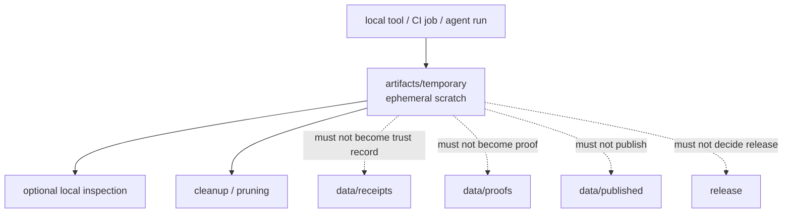

<!-- [KFM_META_BLOCK_V2]
doc_id: kfm://doc/artifacts-temporary-readme
title: artifacts/temporary/ — Ephemeral Working Files
type: readme
version: v0.1
status: draft
owners: OWNER_TBD — Artifacts steward · Build steward · QA steward · Docs steward
created: 2026-06-16
updated: 2026-06-16
policy_label: public
related:
  - ../README.md
  - ../../docs/doctrine/directory-rules.md
  - ../../data/receipts/README.md
  - ../../data/proofs/README.md
  - ../../data/published/README.md
  - ../../release/README.md
  - ../../tools/README.md
  - ../../pipelines/README.md
tags: [kfm, artifacts, temporary, scratch, ephemeral, working-files, compatibility-root, transitional, non-authoritative]
notes:
  - "Replaces the greenfield artifacts/temporary README with a bounded temporary-working-file contract."
  - "This directory is a compatibility/transitional scratch lane for ephemeral, regenerable, non-authoritative working files only."
  - "Specific producers, retention rules, ignore rules, cleanup workflows, and observed contents remain NEEDS VERIFICATION."
[/KFM_META_BLOCK_V2] -->

<a id="top"></a>

<div align="center">

# Ephemeral Working Files

`artifacts/temporary/`

**Compatibility/transitional scratch lane for ephemeral working files created during local runs, CI runs, document generation, media conversion, QA inspection, packaging, or agent/tool experimentation. Contents here must be disposable, regenerable, non-authoritative, and excluded from the KFM trust path.**


[Purpose](#1-purpose) · [Repo fit](#2-repo-fit) · [Authority boundary](#3-authority-boundary) · [Allowed contents](#5-allowed-contents) · [Forbidden contents](#6-forbidden-contents) · [Cleanup](#9-cleanup-and-retention) · [Definition of done](#12-definition-of-done)

</div>

---

> [!IMPORTANT]
> **Status:** draft / `NEEDS VERIFICATION`  
> **Path:** `artifacts/temporary/README.md`  
> **Responsibility root:** `artifacts/` — compatibility root, temporary working-file lane  
> **Truth posture:** CONFIRMED README path / CONFIRMED parent `artifacts/` compatibility-root boundary / PROPOSED temporary-lane contract / UNKNOWN actual contents, producers, cleanup jobs, retention rules, ignore rules, and CI behavior

> [!CAUTION]
> `artifacts/temporary/` is not a source, evidence, receipt, proof, release, catalog, published, registry, schema, contract, policy, or deployment authority. Anything placed here must be safe to delete or regenerate and must not be required for KFM truth, governance, release, rollback, or correction.

---

## 1. Purpose

`artifacts/temporary/` holds **ephemeral, non-authoritative working files** created while tools are doing work.

Typical accepted material includes:

- short-lived intermediate files from local or CI runs;
- scratch outputs from document, map, tile, package, or report generation;
- intermediate transcoded media or rendered previews;
- local reviewer convenience copies that are not trust-bearing;
- temporary tool or agent scratchpads when no better scoped local scratch path exists;
- run-local staging material that is expected to be pruned.

This folder exists to prevent temporary working files from polluting canonical roots.

This README does not prove any temporary files currently exist, any workflow writes here, any cleanup job is configured, or any ignore/pruning rule is active.

[Back to top](#top)

---

## 2. Repo fit

| Concern | Owning root | Expected relationship |
|---|---|---|
| Temporary working files | `artifacts/temporary/` | Ephemeral, regenerable, non-authoritative scratch only |
| Compatibility root | `artifacts/` | Transitional compatibility root; trust content forbidden |
| Build output staging | `artifacts/build/` | Compiled outputs and distributables before canonical binding |
| Generated docs output | `artifacts/docs/` | Generated documentation outputs |
| QA output staging | `artifacts/qa/` | QA reports and inspection copies |
| Release scratch | `artifacts/release/` | Release-pipeline scratch only, not release authority |
| Source code/build logic | `apps/`, `packages/`, `tools/`, `pipelines/` | Inputs and implementation; not stored here |
| Receipts | `data/receipts/` | Canonical process-memory and receipt home |
| Proofs / EvidenceBundles | `data/proofs/` | Canonical evidence/proof home |
| Published artifacts | `data/published/` | Released product home after governed publication |
| Release records | `release/` | ReleaseManifest, RollbackCard, CorrectionNotice, release decisions |
| Schemas/contracts/policy | `schemas/`, `contracts/`, `policy/` | Authority roots, never staged here |

## 3. Authority boundary

`artifacts/temporary/` has **compatibility authority only**. It may hold disposable working files; it does not establish provenance, evidence, validation, policy posture, review state, release state, publication state, lifecycle state, or source authority.

```text
TOOLS / JOBS / LOCAL RUNS        TEMPORARY SCRATCH              TRUST / CANONICAL HOMES
apps packages tools docs  --->   artifacts/temporary/    -/->   data/receipts/
pipelines qa build jobs          disposable only                data/proofs/
                                 not authoritative              release/
                                                                 data/published/
```

Files here should not be referenced as canonical dependencies. When a temporary output becomes materially useful, move or regenerate it through the correct governed flow into the correct owning root.

## 4. Default posture

Temporary files should be treated as **unsafe to trust and safe to delete** unless a governed record elsewhere says otherwise.

A file in this directory should not be used for release, citation, publication, review approval, evidence support, rollback, correction, source authority, or public delivery unless it has been regenerated or promoted through a governed flow into the appropriate canonical home.

## 5. Allowed contents

| Allowed artifact | Examples | Required posture |
|---|---|---|
| Run-local scratch | `run-<id>/`, `tmp-<id>/` | Disposable and scoped to one run |
| Intermediate build material | unpacked bundle fragments, temp render outputs | Regenerable from source and toolchain |
| Intermediate document/media output | pre-rendered HTML, image conversion scratch, staging previews | Non-authoritative and pruned |
| Temporary QA copies | scratch screenshots, diff intermediates, pre-summary fragments | Inspection aid only |
| Agent/tool scratchpad | temporary extraction/output fragments | No trust content, no protected detail exposure |
| Cleanup marker | `.gitkeep`, `.keep`, pruning notes | Does not preserve content as canonical |

## 6. Forbidden contents

| Forbidden here | Correct home |
|---|---|
| Receipts, process memory, validation reports, redaction receipts | `data/receipts/` |
| EvidenceBundles, proof bundles, attestations | `data/proofs/` |
| ReleaseManifest, PromotionDecision, RollbackCard, CorrectionNotice, signatures | `release/` |
| Published layers, tiles, files, packages, or public release bundles | `data/published/` after governed release |
| Catalog records, STAC/DCAT/PROV records | `data/catalog/` |
| Source descriptors, rights rows, sensitivity rows, registry records | `data/registry/` or governed registry homes |
| Source code, scripts, packages, build logic | `apps/`, `packages/`, `tools/`, `scripts/`, `pipelines/` |
| Schemas, contracts, policy rules | `schemas/`, `contracts/`, `policy/` |
| Protected personal, ecological, archaeological, infrastructure, private land, or precise location detail | Governed protected data homes with policy/redaction gates |
| Deployment-only values | Deployment secret/config channels, never this directory |
| Long-lived decisions, approvals, or audit records | `release/`, `data/receipts/`, review records, or governed decision homes |

## 7. Directory shape

Current implementation inventory remains `NEEDS VERIFICATION`.

```text
artifacts/temporary/
├── README.md
├── .gitkeep                         # PROPOSED marker only
├── run-<id>/                        # PROPOSED run-scoped scratch
├── docs-render-<id>/                # PROPOSED generated-doc scratch
├── build-<id>/                      # PROPOSED build scratch
├── qa-<id>/                         # PROPOSED QA scratch
└── agent-<id>/                      # PROPOSED tool/agent scratch
```

> [!WARNING]
> Do not treat this suggested shape as repo fact. Verify actual files, producers, cleanup behavior, ignore rules, and retention state before making implementation claims.

## 8. Diagram



## 9. Cleanup and retention

Temporary material should be pruned regularly. Retention should be short and justified by active debugging, active review, or reproducibility troubleshooting.

Recommended posture:

- prefer run-scoped subdirectories;
- include run ids and source refs in local metadata when useful;
- do not keep temporary outputs as a substitute for receipts or proofs;
- do not rely on this directory for rollback or correction;
- prefer `.gitignore` or automated cleanup for large or volatile scratch outputs;
- keep only README/marker files when no active scratch is needed.

## 10. Validation expectations

Useful validation for this folder should cover:

- no trust-bearing records are stored here;
- no protected detail or deployment-only values are stored here;
- temporary files are generated, disposable, and scoped;
- cleanup/retention expectations are documented;
- large outputs are ignored or pruned unless explicitly justified;
- no source code, schemas, contracts, policy rules, release decisions, catalog records, source registry records, receipts, proofs, or published artifacts are present.

## 11. Safe change pattern

For changes under `artifacts/temporary/`:

1. Confirm the file is temporary scratch and not source or trust content.
2. Confirm the producer and run context are known.
3. Scrub protected detail and deployment-only values.
4. Keep outputs regenerable and scoped to a run where practical.
5. Move durable outputs to the correct owning root through a governed flow.
6. Prune scratch when no longer needed.
7. Update this README, parent `artifacts/` docs, cleanup tooling docs, and tests when behavior materially changes.

## 12. Definition of done

- [ ] Owners are confirmed and `OWNER_TBD` is replaced.
- [ ] Actual temporary-file inventory is verified.
- [ ] Producers and allowed run-scoped shapes are documented.
- [ ] Cleanup/retention rules are documented.
- [ ] Ignore/pruning behavior is verified or marked `NEEDS VERIFICATION`.
- [ ] No trust-bearing records live here.
- [ ] No source code, schemas, contracts, policy rules, protected detail, deployment-only values, or release decisions live here.
- [ ] Canonical homes are linked for any durable outputs.

## 13. Open verification items

| Item | Why it matters |
|---|---|
| Confirm actual files under `artifacts/temporary/` | Prevents overclaiming scratch inventory |
| Confirm producers that write here | Required before workflow/tool claims |
| Confirm cleanup/pruning behavior | Required before retention claims |
| Confirm ignore rules for volatile scratch | Required before repo-hygiene claims |
| Confirm no trust records are stored here | Required before Directory Rules compliance claims |
| Confirm no protected detail or deployment-only values | Required before safe-publication claims |
| Confirm durable-output handoff rules | Required before using scratch outputs elsewhere |

<details>
<summary>Appendix A — no-loss preservation note</summary>

The previous README was a greenfield stub. This replacement adds a bounded temporary-working-file contract without claiming scratch files, producers, ignore rules, cleanup jobs, retention behavior, or workflow behavior are implemented.

</details>

## Status summary

`artifacts/temporary/` is a transitional compatibility lane for ephemeral working files. It is useful for scratch work, but it does not carry trust by itself.

A temporary file here must either remain disposable or be regenerated/moved through a governed flow into the correct canonical home. It must never become a shortcut around evidence, receipts, proofs, release decisions, publication, correction, rollback, policy, or source authority.

<p align="right"><a href="#top">Back to top</a></p>
