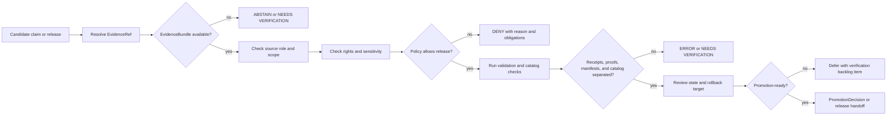

<!-- [KFM_META_BLOCK_V2]
doc_id: kfm://doc/NEEDS_VERIFICATION__assurance_readme
title: Assurance
type: standard
version: v1
status: draft
owners: OWNER_TBD_AFTER_REPO_INSPECTION
created: 2026-05-02
updated: 2026-05-02
policy_label: NEEDS_VERIFICATION__public_or_internal
related: [NEEDS_VERIFICATION__../README.md, NEEDS_VERIFICATION__../docs/README.md, NEEDS_VERIFICATION__../contracts/README.md, NEEDS_VERIFICATION__../schemas/README.md, NEEDS_VERIFICATION__../policy/README.md, NEEDS_VERIFICATION__../data/README.md, NEEDS_VERIFICATION__../tests/README.md, NEEDS_VERIFICATION__../.github/README.md]
tags: [kfm, assurance, verification, governance, evidence, promotion, rollback]
notes: [Target path and owner need mounted-repo verification; created and updated dates reflect this draft generation date, not a committed repository file timestamp; related links are proposed until checked from assurance/README.md.]
[/KFM_META_BLOCK_V2] -->

# Assurance

Assurance is the KFM control surface for proving that evidence, policy, review, release, correction, and rollback conditions are visible before a claim or artifact becomes outward-facing.

> [!IMPORTANT]
> **Status:** `experimental`  
> **Owners:** `OWNER_TBD_AFTER_REPO_INSPECTION`  
> **Path:** `assurance/README.md` — **PROPOSED** until the repository tree is mounted and inspected  
> **Truth posture:** CONFIRMED doctrine / PROPOSED directory role / UNKNOWN implementation depth  
> **Badges:**  
> 
> 
> 
> 
> 
>   
> **Quick jumps:** [Scope](#scope) · [Repo fit](#repo-fit) · [Accepted inputs](#accepted-inputs) · [Exclusions](#exclusions) · [Directory tree](#directory-tree) · [Quickstart](#quickstart) · [Usage](#usage) · [Diagram](#diagram) · [Operating tables](#operating-tables) · [Task list](#task-list--definition-of-done) · [FAQ](#faq) · [Appendix](#appendix)

> [!NOTE]
> This README states KFM doctrine where the attached project corpus supports it. Current repository behavior, file existence, workflow enforcement, emitted proof inventory, route names, dashboards, logs, and branch protections remain **UNKNOWN** until verified in a mounted checkout.

---

## Scope

`assurance/` is the proposed home for assurance-facing documentation: the reviewable checks that help maintainers decide whether a KFM output is supported enough to move forward.

In KFM, the public unit of value is the **inspectable claim**. Assurance asks whether that claim, artifact, release, map layer, runtime answer, story node, or exported packet can show enough of its supporting chain:

```text
RAW -> WORK / QUARANTINE -> PROCESSED -> CATALOG / TRIPLET -> PUBLISHED
```

Assurance does **not** make something true. It checks whether KFM has enough visible support to answer, publish, promote, deny, abstain, correct, or roll back without pretending.

### What this directory should govern

- Evidence closure before consequential claims are rendered as authoritative.
- Source-role, rights, sensitivity, freshness, and review checks before release.
- Separation between receipts, proofs, catalogs, manifests, schemas, policies, runtime envelopes, and publication decisions.
- Assurance checklists for promotion, correction, withdrawal, and rollback.
- Verification backlogs for claims that still need direct repository, CI, runtime, dashboard, or emitted-artifact proof.
- Human-readable assurance standards that point to executable homes without becoming those homes.

### What this directory should not become

`assurance/` should not become a parallel authority for schemas, policies, source registries, emitted proof packs, raw data, runtime logs, or generated model answers.

> [!WARNING]
> Assurance is a gate and review surface. It must not bypass the KFM trust membrane or become a shortcut around governed APIs, EvidenceBundle resolution, policy decisions, release manifests, proof packs, or steward review.

[Back to top](#assurance)

---

## Repo fit

**Path:** `assurance/README.md`  
**Role:** proposed top-level landing page for KFM assurance doctrine, checklists, and verification routing.  
**Current path status:** `PROPOSED` / `NEEDS VERIFICATION`.

### Upstream and adjacent anchors

| Direction | Surface | Relationship | Verification status |
| --- | --- | --- | --- |
| Root orientation | [`../README.md`](../README.md) | Project posture, trust membrane, repo-wide navigation. | NEEDS VERIFICATION from this path |
| Documentation canon | [`../docs/README.md`](../docs/README.md) | Doctrine, architecture, runbooks, ADRs, canon, lineage, and verification backlog. | NEEDS VERIFICATION |
| Semantic contracts | [`../contracts/README.md`](../contracts/README.md) | Human contract definitions for object families such as EvidenceBundle, ReleaseManifest, and DecisionEnvelope. | NEEDS VERIFICATION |
| Executable schemas | [`../schemas/README.md`](../schemas/README.md) | Machine-checkable schema boundary when repo convention confirms it. | NEEDS VERIFICATION |
| Policy | [`../policy/README.md`](../policy/README.md) | Allow, deny, abstain, redaction, sensitivity, and release policy. | NEEDS VERIFICATION |
| Data lifecycle | [`../data/README.md`](../data/README.md) | Registry, receipts, proofs, catalog, manifests, processed outputs, and published artifacts. | NEEDS VERIFICATION |
| Verification | [`../tests/README.md`](../tests/README.md) | Fixtures, runtime proof, validator tests, and non-regression evidence. | NEEDS VERIFICATION |
| Gatehouse | [`../.github/README.md`](../.github/README.md) | PR templates, CODEOWNERS, workflow documentation, and repository governance. | NEEDS VERIFICATION |

### Downstream assurance surfaces

These files are **PROPOSED** until repo conventions are inspected:

| Proposed child | Purpose | Do not use for |
| --- | --- | --- |
| `RELEASE_ASSURANCE.md` | Release readiness checklist and promotion evidence expectations. | Storing release manifests or proof packs. |
| `RUNTIME_ASSURANCE.md` | Runtime response assurance for `ANSWER`, `ABSTAIN`, `DENY`, and `ERROR` behavior. | Defining API route handlers. |
| `SOURCE_ASSURANCE.md` | Source admission, source-role, rights, cadence, and sensitivity assurance. | Hosting source descriptors. |
| `SENSITIVITY_ASSURANCE.md` | Redaction, generalization, staged access, and fail-closed review prompts. | Publishing sensitive coordinates or restricted details. |
| `OBJECT_FAMILY_MATRIX.md` | Crosswalk of assurance-relevant object families and their homes. | Creating parallel schema authority. |
| `VERIFICATION_BACKLOG.md` | Maintained list of direct checks required before stronger claims. | Burying unresolved risks. |
| `runbooks/` | Assurance procedures for review, rollback, correction, and incident response. | Replacing repo-native operational runbooks if they already exist elsewhere. |

[Back to top](#assurance)

---

## Accepted inputs

Use `assurance/` for reviewable, human-readable assurance material such as:

- Assurance checklists for publication, promotion, correction, rollback, withdrawal, and public release.
- Evidence closure templates showing what must be resolved before a claim can be trusted.
- Object-family crosswalks that point to the correct homes for contracts, schemas, fixtures, receipts, proofs, manifests, catalogs, and policy.
- Verification matrices for repository, CI, workflow, emitted artifact, runtime, dashboard, branch protection, or source-rights checks.
- Redacted review summaries that preserve auditability without exposing sensitive details.
- Assurance runbooks that explain how to inspect support, detect missing proof, and fail closed.
- `NEEDS VERIFICATION` registers for unknown implementation or policy claims.

Use the narrowest truth label available:

| Label | Use here |
| --- | --- |
| `CONFIRMED` | Verified from current repo evidence, emitted artifacts, tests, logs, workflows, source content, or attached doctrine. |
| `PROPOSED` | Recommended assurance wording, checklist, path, process, or control not yet verified as implemented. |
| `UNKNOWN` | Implementation, ownership, runtime, workflow, or proof state not visible in current evidence. |
| `NEEDS VERIFICATION` | Concrete check is required before treating a claim as current, enforced, safe, or publishable. |
| `DENY` | Release or access should not proceed under current evidence or policy conditions. |
| `ABSTAIN` | KFM cannot support the claim strongly enough to answer or publish. |
| `ERROR` | A tool, schema, validator, resolver, or runtime process failed and should not be hidden as a policy decision. |

[Back to top](#assurance)

---

## Exclusions

Do **not** place these in `assurance/`:

| Excluded material | Belongs instead | Reason |
| --- | --- | --- |
| RAW, WORK, QUARANTINE, or unpublished source data | `../data/` lifecycle homes, after repo verification | Assurance reviews data; it does not host source custody. |
| Source descriptors and source registry entries | `../data/registry/` or repo-confirmed source registry home | Source admission needs one canonical registry path. |
| Executable schemas | `../schemas/` or repo-confirmed schema home | Avoid parallel schema authority. |
| Human semantic object contracts | `../contracts/` or repo-confirmed contract home | Assurance points to contracts; it does not redefine them. |
| Policy bundles or policy-as-code | `../policy/` | Assurance checks policy posture; policy owns policy. |
| Test fixtures and proof cases | `../tests/` | Assurance may reference fixtures, but tests belong in the verification lane. |
| Run receipts, ingest receipts, AI receipts | `../data/receipts/` or repo-confirmed receipt home | Receipts are process memory, not assurance prose. |
| Proof packs, signed attestations, release proof bundles | `../data/proofs/` or repo-confirmed proof home | Proofs are release-significant support objects. |
| Catalog triplets, STAC/DCAT/PROV records | `../data/catalog/` or repo-confirmed catalog home | Catalog closure should stay queryable and release-bound. |
| Runtime logs, dashboards, traces, secrets, tokens | Repo-confirmed observability/security homes | Avoid leaking operational or sensitive material. |
| Unreviewed model output or private chain-of-thought | Nowhere as truth material | AI is interpretive and evidence-subordinate. |

[Back to top](#assurance)

---

## Directory tree

> [!CAUTION]
> This tree is **PROPOSED**. Do not treat it as current repository inventory until `assurance/` is inspected in the mounted checkout.

```text
assurance/
├── README.md
├── OBJECT_FAMILY_MATRIX.md              # PROPOSED: assurance object crosswalk
├── RELEASE_ASSURANCE.md                 # PROPOSED: promotion and publication readiness checks
├── RUNTIME_ASSURANCE.md                 # PROPOSED: outward response and finite outcome checks
├── SENSITIVITY_ASSURANCE.md             # PROPOSED: rights, sovereignty, cultural, ecological, archaeological, DNA, living-person, and location-risk checks
├── SOURCE_ASSURANCE.md                  # PROPOSED: source role, cadence, terms, and admission checks
├── VERIFICATION_BACKLOG.md              # PROPOSED: unresolved implementation and enforcement checks
└── runbooks/
    ├── correction-assurance.md          # PROPOSED: correction and notice assurance
    ├── promotion-assurance.md           # PROPOSED: release gate review
    ├── rollback-assurance.md            # PROPOSED: rollback readiness and rollback receipt checks
    └── sensitive-release-assurance.md   # PROPOSED: fail-closed sensitive release review
```

Recommended first commit for this directory: only this `README.md` plus a small `VERIFICATION_BACKLOG.md` if the mounted repo has no existing equivalent. Add child files only when owners and adjacent homes are verified.

[Back to top](#assurance)

---

## Quickstart

Use this sequence when reviewing whether a KFM output is assurance-ready.

1. **Name the surface.**  
   Is this a claim, map layer, API response, story node, AI answer, dataset release, catalog record, proof pack, or correction?

2. **Find the evidence path.**  
   Confirm that every consequential claim can resolve from `EvidenceRef` to `EvidenceBundle` or an equivalent governed support package.

3. **Check source role and scope.**  
   Verify source authority, spatial scope, temporal scope, source cadence, freshness, and uncertainty.

4. **Check rights and sensitivity.**  
   Unknown rights, sensitive locations, living-person data, DNA, cultural/sovereignty concerns, archaeological sites, ecological risk, or security-sensitive details fail closed until reviewed.

5. **Check object separation.**  
   Make sure receipts, proofs, catalogs, manifests, schemas, policies, tests, and runtime envelopes remain separate object families.

6. **Check release state.**  
   Confirm the candidate is released or ready for governed promotion. Do not publish from RAW, WORK, QUARANTINE, or unreviewed candidate material.

7. **Record the disposition.**  
   Use `NEEDS VERIFICATION`, `ABSTAIN`, `DENY`, `ERROR`, or a review-ready handoff instead of confident prose when support is incomplete.

8. **Confirm rollback.**  
   Every promotion-significant action needs a rollback target, correction path, or withdrawal path appropriate to its risk.

### Illustrative assurance packet

This example is illustrative only. It is not a schema and does not create contract authority.

```yaml
surface: map_layer_release
surface_id: SOURCE_ID_TBD
assurance_status: NEEDS_VERIFICATION
truth_posture:
  doctrine: CONFIRMED
  implementation: UNKNOWN
evidence:
  evidence_refs_resolved: false
  evidence_bundle_refs: []
policy:
  rights_review: NEEDS_VERIFICATION
  sensitivity_review: NEEDS_VERIFICATION
  public_release_allowed: false
release:
  release_manifest: SOURCE_ID_TBD
  proof_pack: SOURCE_ID_TBD
  rollback_target: ROLLBACK_TARGET_TBD
decision:
  outcome: ABSTAIN
  reason: EvidenceBundle and release proof are not yet resolved.
```

[Back to top](#assurance)

---

## Usage

### For documentation authors

Before writing a claim as authoritative, ask:

- Is the source role explicit?
- Is the spatial and temporal scope explicit?
- Is the review state visible?
- Is the release state visible?
- Is correction lineage visible or intentionally absent?
- Would a maintainer know where to verify the claim?

When the answer is not clear, use `NEEDS VERIFICATION`, `UNKNOWN`, or `PROPOSED`.

### For PR reviewers

Use assurance review when a PR affects:

- publication gates;
- source admission;
- sensitivity handling;
- policy outcomes;
- EvidenceBundle or EvidenceRef behavior;
- runtime response envelopes;
- proof packs, receipts, release manifests, or catalog closure;
- AI-generated summaries or Focus Mode behavior;
- correction, rollback, or withdrawal behavior;
- public or semi-public access paths.

### For release stewards

A release is not assurance-ready until the release candidate can show:

- source admission support;
- rights and sensitivity review;
- validation reports;
- catalog closure;
- release manifest;
- proof pack or equivalent release support;
- policy decision;
- review record;
- rollback target;
- correction path;
- public-safe citations or support references.

[Back to top](#assurance)

---

## Diagram



[Back to top](#assurance)

---

## Operating tables

### Assurance object-family map

| Object family | Assurance question | Correct home | Status in this README |
| --- | --- | --- | --- |
| `SourceDescriptor` | Is the source admitted with role, rights, cadence, and authority limits? | `data/registry/`, `contracts/`, `schemas/` after repo convention verification | CONFIRMED concept / PROPOSED exact routing |
| `EvidenceRef` | Is the claim linked to stable support? | Contract/runtime evidence surfaces | CONFIRMED doctrine / NEEDS VERIFICATION exact implementation |
| `EvidenceBundle` | Can the support package be inspected before answer or release? | Contract/runtime evidence surfaces and emitted evidence/proof homes | CONFIRMED doctrine / PROPOSED exact routing |
| `ValidationReport` | Did QA, schema, fixture, and domain checks run and record results? | `data/receipts/`, `data/proofs/`, or test artifacts depending significance | PROPOSED split / NEEDS VERIFICATION |
| `DecisionEnvelope` | Did policy or runtime return a finite, reviewable outcome? | `contracts/`, `schemas/`, `policy/`, runtime docs | CONFIRMED doctrine / NEEDS VERIFICATION schema body |
| `RunReceipt` / `IngestReceipt` / `AIReceipt` | What process ran, with what inputs, versions, outputs, and limits? | `data/receipts/` or repo-confirmed receipt home | CONFIRMED concept / NEEDS VERIFICATION emitted examples |
| `ReleaseManifest` | What exactly is in the release candidate? | `data/proofs/`, manifests, contracts/schemas after verification | PROPOSED starter wave |
| `ProofPack` | What higher-order support proves release readiness? | `data/proofs/` and related contracts/runbooks | PROPOSED / NEEDS VERIFICATION |
| `CatalogMatrix` / catalog triplet | Are catalog records complete and linked? | `data/catalog/` | CONFIRMED doctrine / NEEDS VERIFICATION implementation |
| `ReviewRecord` | Who reviewed what, under which burden tier? | Review or receipt/proof home after repo verification | PROPOSED |
| `PromotionDecision` | Was promotion a governed transition rather than a file move? | Promotion gate object home after repo verification | PROPOSED |
| `CorrectionNotice` | Can users inspect correction or withdrawal lineage? | Correction/release docs and proof homes after verification | CONFIRMED doctrine / PROPOSED exact routing |
| `RollbackReference` | Can the system return to a prior safe state? | Release/proof/receipt/runbook homes after verification | CONFIRMED doctrine / PROPOSED exact routing |

### Assurance dispositions

| Disposition | Meaning | Use when |
| --- | --- | --- |
| `READY_FOR_REVIEW` | The packet is coherent enough for steward or policy review. | Evidence, policy, and rollback are present but human approval remains pending. |
| `NEEDS VERIFICATION` | A concrete evidence check is missing. | Repo files, workflows, emitted artifacts, owners, rights, source terms, or runtime behavior are not proven. |
| `ABSTAIN` | KFM should not answer or publish the claim as supported. | Evidence is unresolved, weak, stale, ambiguous, or out of scope. |
| `DENY` | Policy blocks release or access. | Rights, sensitivity, sovereignty, cultural, ecological, archaeological, DNA, living-person, security, or release-state controls fail closed. |
| `ERROR` | The process failed. | Resolver, validator, schema, fixture, runtime, catalog, or proof assembly failed. |

### Assurance boundary checks

| Check | Pass condition | Failure mode |
| --- | --- | --- |
| Evidence closure | EvidenceRef resolves to an inspectable support package. | `ABSTAIN` or `NEEDS VERIFICATION`. |
| Source-role clarity | Source is not used beyond its authority. | `ABSTAIN` or correction request. |
| Rights posture | Rights and terms support the requested release. | `DENY` or quarantine. |
| Sensitivity posture | Public detail is allowed or safely generalized/redacted. | `DENY`, staged access, redaction, or generalization. |
| Catalog closure | Release has catalog support appropriate to significance. | Defer promotion. |
| Proof separation | Proofs, receipts, manifests, catalogs, schemas, and policies stay distinct. | `ERROR` or architecture correction. |
| Runtime visibility | Public response exposes finite outcome and support path. | Block release or runtime binding. |
| Rollback readiness | A rollback target or correction path exists. | Defer promotion. |

[Back to top](#assurance)

---

## Task list / definition of done

### First PR for this directory

- [ ] Confirm whether `assurance/` already exists in the mounted repository.
- [ ] Confirm owner or CODEOWNERS coverage for `assurance/`.
- [ ] Confirm whether assurance content belongs at root, under `docs/`, or under another governance home.
- [ ] Confirm adjacent README paths from `assurance/README.md`.
- [ ] Add or update this README without claiming workflow/runtime maturity.
- [ ] Create `assurance/VERIFICATION_BACKLOG.md` only if no repo-native equivalent already exists.
- [ ] Add a link from the appropriate parent index after repo convention verification.
- [ ] Preserve this draft as lineage if the repo proves another assurance structure is already authoritative.

### Release assurance minimums

- [ ] Source descriptors are approved or marked blocked.
- [ ] EvidenceRefs resolve to EvidenceBundles or equivalent support packages.
- [ ] Rights and sensitivity checks are recorded.
- [ ] Validation reports are present and scoped.
- [ ] Catalog closure is complete or explicitly deferred with reason.
- [ ] Receipts and proofs are not collapsed.
- [ ] Release manifest or release scope is inspectable.
- [ ] Policy outcome is visible.
- [ ] Review state is visible.
- [ ] Rollback target is documented.
- [ ] Correction or withdrawal path exists.
- [ ] Public-facing text cites, abstains, denies, or errors instead of overclaiming.

### Markdown QA

- [ ] Exactly one H1.
- [ ] KFM Meta Block v2 is present.
- [ ] README impact block is present.
- [ ] Badges are non-deceptive and placeholdered where needed.
- [ ] Path, owners, related links, and status are reviewable.
- [ ] Accepted inputs and exclusions are explicit.
- [ ] Mermaid diagram is meaningful and not decorative.
- [ ] No implementation claim outruns visible evidence.
- [ ] Placeholders are searchable and tied to a reason.

[Back to top](#assurance)

---

## FAQ

### Is `assurance/` the same as `data/proofs/`?

No. `data/proofs/` should hold release-significant proof objects or proof indexes after the repo confirms that home. `assurance/` should explain how maintainers inspect and reason about proof readiness.

### Is `assurance/` the same as `tests/`?

No. `tests/` should hold executable fixtures, validators, and runtime proof cases. `assurance/` should describe the assurance burden and point reviewers to the correct test or proof evidence.

### Can assurance approve a public release by itself?

No. Assurance can make readiness visible, but publication remains a governed state transition that must pass policy, evidence, validation, review, catalog, proof, and rollback gates appropriate to significance.

### What happens when evidence is incomplete?

Use `ABSTAIN`, `DENY`, `ERROR`, `UNKNOWN`, or `NEEDS VERIFICATION`. Do not smooth uncertainty into confident release language.

### Can AI produce assurance decisions?

No. AI may help summarize or draft checklists, but it is not the root truth source, policy authority, release authority, or reviewer of record.

[Back to top](#assurance)

---

## Appendix

### Evidence boundary for this draft

| Evidence area | Current status | Consequence |
| --- | --- | --- |
| Attached KFM doctrine corpus | CONFIRMED available | Strong enough to draft assurance doctrine and object-family boundaries. |
| Mounted KFM repository | UNKNOWN / not verified in this draft context | Do not claim `assurance/` exists or that adjacent links are valid. |
| Workflow YAML and CI enforcement | UNKNOWN | Do not claim merge-blocking assurance checks. |
| Emitted receipts, manifests, proof packs, catalogs | UNKNOWN | Keep object families as doctrine/proposed unless repo evidence confirms examples. |
| Runtime logs, dashboards, traces | UNKNOWN | Do not claim operational assurance maturity. |
| Owners and CODEOWNERS for this path | NEEDS VERIFICATION | Use owner placeholder until checked. |
| Policy label for this README | NEEDS VERIFICATION | Use reviewable placeholder. |

### Reviewable placeholders left intentionally

| Placeholder | Why it remains |
| --- | --- |
| `kfm://doc/NEEDS_VERIFICATION__assurance_readme` | No confirmed doc UUID was available. |
| `OWNER_TBD_AFTER_REPO_INSPECTION` | Owner for `assurance/` was not verified. |
| `NEEDS_VERIFICATION__public_or_internal` | Policy label depends on repo governance and publication posture. |
| `NEEDS_VERIFICATION__../...` related links | Relative paths must be checked from `assurance/README.md`. |
| `SOURCE_ID_TBD` | Example packet is illustrative only. |
| `ROLLBACK_TARGET_TBD` | Rollback target depends on the specific release or PR. |

### Rollback

Rollback is required if this README:

- creates a parallel source of authority for schemas, contracts, policy, proof packs, receipts, or catalogs;
- weakens the trust membrane;
- implies a workflow, test, proof object, owner, or runtime behavior that is not verified;
- publishes sensitive or rights-uncertain material;
- breaks established repo navigation without replacement links.

Rollback target: `ROLLBACK_TARGET_TBD_AFTER_REPO_INSPECTION`.

Recommended rollback action: revert the PR that introduces `assurance/README.md`, preserve the draft as lineage if useful, and update the verification backlog with the reason.

[Back to top](#assurance)
