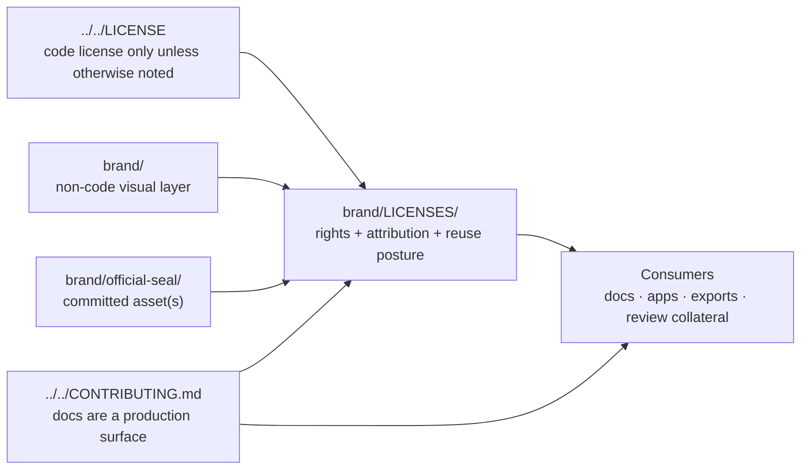

<!-- [KFM_META_BLOCK_V2]
doc_id: kfm://doc/NEEDS-VERIFICATION-UUID
title: LICENSES
type: standard
version: v1
status: draft
owners: @bartytime4life
created: YYYY-MM-DD
updated: 2026-03-26
policy_label: public
related: [../README.md, ../../README.md, ../../LICENSE, ../../CONTRIBUTING.md, ../../.github/README.md, ../../.github/CODEOWNERS, ../official-seal/]
tags: [kfm, brand, licenses, rights, reuse]
notes: [Original creation date for this file was not verified from repo history, owner reflects CODEOWNERS global fallback rather than a directory-specific assignment, asset-level rights posture for current brand artifacts still needs explicit completion]
[/KFM_META_BLOCK_V2] -->

# LICENSES

Rights, reuse, attribution, and non-code license register for assets under `brand/`.

> Status: `experimental`  
> Owners: `@bartytime4life` *(CODEOWNERS global fallback; directory-specific owner not separately declared)*  
> [](../README.md)
> [](./README.md)
> [](../../LICENSE)
> [](../../CONTRIBUTING.md)
> [](../../.github/CODEOWNERS)  
> Quick jumps: [Scope](#scope) · [Repo fit](#repo-fit) · [Accepted inputs](#accepted-inputs) · [Exclusions](#exclusions) · [Directory tree](#directory-tree) · [Quickstart](#quickstart) · [Usage](#usage) · [Diagram](#diagram) · [Tables](#tables) · [Task list](#task-list--definition-of-done) · [FAQ](#faq) · [Appendix](#appendix)

> [!IMPORTANT]
> `../../LICENSE` is the repo’s **code** license surface. It explicitly says documentation, datasets, catalogs, and other non-code artifacts may carry different terms. This directory exists so brand assets do **not** quietly inherit code-license assumptions.

> [!CAUTION]
> This directory records repo-local rights posture and reuse guidance. It is not a substitute for verifying source provenance, approval scope, attribution requirements, or restricted-mark handling before release.

## Scope

`brand/LICENSES/` is the rights-and-reuse control surface for KFM’s non-code brand layer.

Use it to keep reusable brand artifacts inspectable: what they are, where they live, who can reuse them, whether attribution is required, whether derivatives are allowed, and whether a public repo copy is actually appropriate. In KFM terms, this directory helps keep visual identity from drifting outside the same trust discipline expected of contracts, policy, docs, and release-bearing assets.

This directory matters because KFM’s repo license is intentionally scoped to source code. Brand assets are different: emblems, seals, logos, templates, exported PNG/SVG collateral, and third-party visual material can have narrower rights, extra attribution duties, or reuse limits that should be visible before someone copies them into docs, apps, exports, or review collateral.

[Back to top](#licenses)

## Repo fit

| Item | Value |
|---|---|
| Path | `brand/LICENSES/README.md` |
| Directory role | Brand-rights registry and usage guardrail for non-code assets under `brand/` |
| Upstream references | [`../README.md`](../README.md) · [`../../README.md`](../../README.md) · [`../../LICENSE`](../../LICENSE) · [`../../CONTRIBUTING.md`](../../CONTRIBUTING.md) · [`../../.github/README.md`](../../.github/README.md) · [`../../.github/CODEOWNERS`](../../.github/CODEOWNERS) |
| Downstream consumers | [`../official-seal/`](../official-seal/) · [`../logos/`](../logos/) · [`../icons/`](../icons/) · [`../assets/`](../assets/) · [`../templates/`](../templates/) · [`../usage/`](../usage/) |
| Current observed role | Replaces a placeholder README in a currently sparse but real `brand/` subtree |
| Local rule | A brand asset is not “ready because it looks finished.” It is ready when reuse posture, attribution, and review state are explicit enough to survive copy/paste into other repo surfaces |

### Working interpretation rule

Use these labels in this README when precision matters:

- **CONFIRMED** — directly visible in the current public repo snapshot or explicitly stated in adjacent repo docs
- **INFERRED** — strongly suggested by repo structure or doctrine, but not rechecked deeply enough to claim as settled
- **PROPOSED** — recommended structure or workflow added here to make the lane operational
- **NEEDS VERIFICATION** — a concrete rights fact, approval scope, or ownership detail still needs checking before merge or reuse

## Accepted inputs

Place only rights-bearing or reuse-bearing material here.

- asset-level license notices for committed brand files
- attribution strings and required credit text
- source provenance notes for icons, seals, logos, templates, and export variants
- third-party notice text that must travel with redistributed assets
- approved reuse restrictions or handling notes for sensitive marks
- asset-to-directory mapping for current `brand/` contents
- review-safe summaries of permission scope, expiration, or allowed channels
- derivative/export notes when PNG, SVG, PDF, light/dark, or size variants inherit or change obligations

## Exclusions

Do **not** turn `brand/LICENSES/` into a catch-all legal or asset bucket.

- **Do not store the primary artwork here.** Assets belong in sibling brand directories such as [`../official-seal/`](../official-seal/), [`../logos/`](../logos/), or [`../icons/`](../icons/).
- **Do not duplicate the repo-wide code license here** unless a third-party redistribution requirement explicitly needs a local copy.
- **Do not define policy semantics here.** This directory records rights and reuse posture; it does not define runtime trust states, publication classes, or correction logic.
- **Do not commit private legal correspondence or sensitive approval documents** if a short public-safe summary and a steward-held reference will do.
- **Do not guess.** If source, owner, derivative rights, or attribution terms are unclear, keep the asset blocked, restricted, or explicitly marked `NEEDS VERIFICATION`.
- **Do not assume “public repo” means “public reuse.”** Public visibility and reuse permission are different questions.

## Directory tree

Current public-snapshot-oriented working tree:

```text
brand/
├── README.md
├── LICENSES/
│   └── README.md
├── assets/
│   └── README.md
├── icons/
│   └── README.md
├── logos/
│   └── README.md
├── official-seal/
│   ├── README.md
│   └── kfm-official-seal-transparent.png
├── source/
│   └── README.md
├── templates/
│   └── README.md
├── tokens/
│   └── README.md
└── usage/
    └── README.md
```

PROPOSED additions for this directory once asset rights become active:

```text
brand/LICENSES/
├── README.md                  # this file
├── asset-rights-register.md   # PROPOSED per-asset registry
├── third-party-notices.md     # PROPOSED bundled notice text
├── attributions.md            # PROPOSED copy/paste attribution strings
└── review-log.md              # PROPOSED approval / restriction changelog
```

## Quickstart

Start by comparing the current brand subtree to the rights notes recorded here.

```bash
# Inspect the current brand subtree
find brand -maxdepth 2 -type f | sort
```

```bash
# Surface all current rights/reuse mentions under brand
grep -RInE 'license|rights|reuse|attribution|permission|source' brand 2>/dev/null || true
```

```bash
# Find brand assets that may need an entry in this directory
find brand \( -name '*.svg' -o -name '*.png' -o -name '*.jpg' -o -name '*.pdf' \) | sort
```

```bash
# Find docs or app surfaces that may consume brand material
git grep -nE 'official-seal|logo|icon|brand/|kfm-official-seal' -- .
```

```bash
# Surface placeholders before merge
grep -RIn 'NEEDS VERIFICATION\|YYYY-MM-DD\|NEEDS-VERIFICATION-UUID' brand ../../README.md ../../CONTRIBUTING.md ../../.github 2>/dev/null || true
```

## Usage

This directory should answer one practical question quickly:

**“Can I reuse this brand asset, and under what conditions?”**

If that answer is not obvious, this lane is incomplete.

### What belongs in each record

Every reusable asset should resolve to one concise, reviewable entry containing:

| Field | Why it matters |
|---|---|
| Asset path | Prevents vague discussion and stale references |
| Asset name / ID | Makes approvals and downstream references stable |
| Asset type | Distinguishes logo, seal, icon, template, export, or source artwork |
| Source / provenance | Records where the asset came from |
| Rights holder | Makes ownership visible |
| License / permission posture | Prevents silent inheritance from the code license |
| Attribution requirement | Supports docs, exports, and redistributed collateral |
| Derivative/modification posture | Clarifies whether edits, recolors, crops, or lockups are allowed |
| Public-repo suitability | Distinguishes “safe to store publicly” from “safe to reuse anywhere” |
| Notes / restrictions | Captures edge cases such as restricted marks or review-only use |
| Review date / reviewer | Keeps the entry auditable |

### When to update this directory

Update `brand/LICENSES/` whenever any of the following happens:

1. a new brand asset is committed
2. an existing asset is renamed, moved, or removed
3. an export variant is generated from a source file
4. attribution text changes
5. reuse scope changes
6. a third-party asset is introduced or retired
7. a restricted mark becomes public-safe, or the reverse
8. a consuming surface starts using an asset that was previously dormant

### Working rules

1. **No silent inheritance.** Non-code brand assets do not automatically inherit the repo’s MIT code license.
2. **No orphan assets.** If a reusable asset exists in `brand/`, its rights posture should be discoverable from this directory or an explicitly linked sibling notice.
3. **No ambiguous marks.** Seals, official-looking insignia, and third-party marks stay blocked or restricted until their reuse terms are explicit.
4. **No repo-polish shortcut.** Attractive exports do not outrank provenance, review state, or reuse conditions.
5. **No one-off drift.** If an asset is truly one-off, move it to a context-heavy doc lane instead of pretending it is reusable brand material.

## Diagram



## Tables

### Current observed public snapshot

| Path | Current observed state | What this README should do with it |
|---|---|---|
| `../../LICENSE` | Repo-wide code license exists | Treat as upstream constraint, not as default asset permission |
| `../README.md` | Brand directory contract already exists | Keep this directory aligned with brand-wide accepted inputs and exclusions |
| `./README.md` | This directory currently needs real content | Make rights posture explicit instead of placeholder-only |
| `../official-seal/` | Contains a README and `kfm-official-seal-transparent.png` | First concrete asset lane that should receive an explicit entry here |
| `../assets/`, `../icons/`, `../logos/`, `../source/`, `../templates/`, `../tokens/`, `../usage/` | Immediate public snapshot shows README placeholders only | Leave room for future entries, but do not invent current files or rights claims |

### Minimum per-asset status vocabulary

| Status | Use it when | Merge expectation |
|---|---|---|
| `CONFIRMED` | Rights holder and reuse posture are explicitly documented | Safe for the documented scope |
| `RESTRICTED` | Asset may remain in repo but reuse is limited | Downstream use must respect the recorded boundary |
| `INTERNAL_REVIEW_ONLY` | Asset is not yet cleared for public-facing outputs | Do not use in shipped docs, apps, or exports |
| `NEEDS VERIFICATION` | Source, ownership, attribution, or derivative rights are unresolved | Do not reuse until resolved |
| `REMOVED / SUPERSEDED` | Asset should no longer be used | Point consumers to the replacement path or removal note |

## Task list / definition of done

### Task list

- [ ] Replace all placeholder metadata values that can be verified from the active branch.
- [ ] Add a first real entry for `../official-seal/kfm-official-seal-transparent.png`.
- [ ] Confirm whether any additional committed brand assets exist beyond the immediate public snapshot reviewed here.
- [ ] Add reciprocal links from `../README.md` if this directory becomes the canonical rights lane for brand assets.
- [ ] Decide whether third-party notice text belongs inline here or in sibling files under `brand/LICENSES/`.
- [ ] Verify whether any fonts, external logos, or imported artwork are already present elsewhere in `brand/`.
- [ ] Remove any statement that implies broader reuse rights than the asset owner actually granted.
- [ ] Keep this README updated in the same PR as any brand-asset change that affects reuse posture.

### Definition of done

This README is ready to merge when:

1. it replaces the placeholder file with a real directory contract
2. the path and upstream/downstream links all resolve
3. owner and date placeholders are resolved as far as current evidence allows
4. at least one current asset lane is explicitly documented
5. the repo code license is linked but not misapplied to non-code assets
6. no committed brand asset appears to lack a discoverable rights posture
7. unresolved items remain visible as `NEEDS VERIFICATION` instead of being flattened into certainty

## FAQ

### Why does `brand/LICENSES/` exist when the repo already has `LICENSE`?

Because the root `LICENSE` is explicitly scoped to source code unless otherwise noted. Brand assets are non-code artifacts and may need different terms, narrower permissions, or extra attribution.

### Does every image need its own file in this directory?

Not necessarily. Small lanes can use one shared register as long as each asset path is clearly listed and the reuse posture is unambiguous.

### What should happen for official seals or other sensitive marks?

Do not assume they are freely reusable. Record their posture explicitly and keep them blocked or restricted until the repo can state the scope confidently.

### Can third-party license text live here?

Yes, when redistribution terms require it. Otherwise, a short note plus a pointer to the source of truth may be enough.

### Should generated PNG exports inherit the same rights as their SVG source?

Only if that is actually true. Record the relationship. A derivative export is still an artifact with a reuse story that should be inspectable.

### Is this directory for legal advice?

No. It is for repo-local rights visibility, reuse discipline, and contributor safety.

[Back to top](#licenses)

## Appendix

<details>
<summary>Illustrative per-asset register entry</summary>

Use this as a starter pattern, not as a claim that the file already exists in the repo.

```yaml
asset_id: kfm-official-seal-transparent
path: ../official-seal/kfm-official-seal-transparent.png
asset_type: official-seal
source: NEEDS VERIFICATION
rights_holder: NEEDS VERIFICATION
license_or_permission: NEEDS VERIFICATION
attribution_required: NEEDS VERIFICATION
modification_allowed: NEEDS VERIFICATION
public_repo_ok: CONFIRMED
public_reuse_ok: NEEDS VERIFICATION
downstream_use:
  docs: NEEDS VERIFICATION
  apps: NEEDS VERIFICATION
  exports: NEEDS VERIFICATION
notes:
  - Current public snapshot confirms the file exists.
  - Reuse posture should not be inferred from the repo’s MIT code license.
review:
  reviewed_on: YYYY-MM-DD
  reviewed_by: NEEDS VERIFICATION
```

</details>

<details>
<summary>Suggested starter headings for future companion files</summary>

- `asset-rights-register.md` — concise path-by-path registry
- `third-party-notices.md` — required bundled notices
- `attributions.md` — copy/paste credit text for docs and exports
- `review-log.md` — changes to reuse posture over time

</details>
