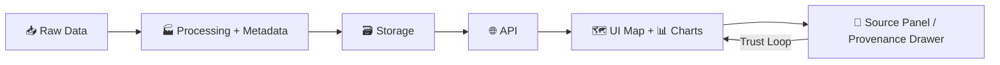

# 🎨 Kansas Frontier Matrix — Brand System (KFM)

> **Single source of truth** for the Kansas Frontier Matrix identity: visuals 🖼️ + voice 🗣️ + maps 🗺️ + UI tokens 🧩.  
> If it’s “how KFM should look or sound,” it belongs here.

---

## ✅ Quick Rules (Read This First)

### 🧭 Brand Non‑Negotiables
- **Evidence-first**: every claim should be traceable (the “map behind the map” principle).
- **Clarity > cleverness**: design for comprehension and trust.
- **Kansas-first**: prairie + history + science + stewardship, without clichés.
- **Accessible by default**: contrast, keyboard support, readable type, and map legibility.

### 🚦Do / Don’t
**Do ✅**
- Use **design tokens** for colors/spacing/type.
- Provide **sources + provenance** in UI patterns (layer source chips, citations drawer).
- Prefer **SVG** for marks/logos; **PNG** only for raster needs.

**Don’t ❌**
- Introduce “one-off” colors in CSS.
- Place text directly over complex imagery without a scrim/overlay.
- Use map palettes that break colorblind accessibility or confuse meaning.

---

## 📌 Contents
- [✨ Brand Story](#-brand-story)
- [🧱 Brand Pillars](#-brand-pillars)
- [🗣️ Voice & Tone](#️-voice--tone)
- [🧩 Visual Language](#-visual-language)
- [🅰️ Typography](#️-typography)
- [🎨 Color System](#-color-system)
- [🧱 Layout & Spacing](#-layout--spacing)
- [🗺️ Map Styling Guidelines](#️-map-styling-guidelines)
- [📊 Data Visualization](#-data-visualization)
- [🖼️ Logos & Marks](#️-logos--marks)
- [📁 Folder Structure](#-folder-structure)
- [🔧 Export & File Standards](#-export--file-standards)
- [🛡️ Accessibility Checklist](#️-accessibility-checklist)
- [🔁 Contribution Workflow](#-contribution-workflow)

---

## ✨ Brand Story

**Kansas Frontier Matrix (KFM)** is a geospatial knowledge platform built to unify Kansas environmental data, historical records, and AI-driven analysis into a **trustworthy, explorable** system.

KFM’s brand should feel like:
- **A research librarian 📚 + GIS analyst 🧭**
- **Transparent 🤝, not black-box**
- **Grounded in place 🏞️, time ⏳, and source provenance 🔎**

---

## 🧱 Brand Pillars

1. **Traceable Truth** 🔎  
   Everything should point back to data sources, methods, and context.
2. **Spatial + Temporal Thinking** 🗺️⏳  
   Maps and timelines are primary interfaces—design supports exploration over time.
3. **Human-Readable Science** 🧪🙂  
   Expert-grade rigor, explained with plain language and careful visuals.
4. **Respect for Communities** 🤝  
   Especially in sensitive historical/Indigenous contexts: careful framing, citation, and governance.
5. **Built to Scale** 🧱  
   Tokens, patterns, and components should survive new datasets, new layers, and new audiences.

---

## 🗣️ Voice & Tone

### Tone Targets 🎯
- **Calm** (never sensational)
- **Precise** (avoid “always/never”)
- **Helpful** (actionable next steps)
- **Transparent** (what we know vs. infer)

### Writing Guidelines ✍️
- Prefer **plain language**, short sentences, and explicit units/dates.
- Avoid speculation: if uncertain, say **what’s missing** and **how to verify**.
- Use **Kansas-aware** wording (regional context, county references, historic era clarity).

### Microcopy Patterns 🧩
- **Source chips**: `Source • Dataset Name • Year`  
- **Confidence labels** (optional): `High / Medium / Low` + a reason
- **Data caveats**: “Coverage: Western Kansas counties only (1900–1925).”

---

## 🧩 Visual Language

### Look & Feel
- **Clean, structured, grid-aware** 🧱
- **Whitespace-friendly** 🌬️
- **Quiet confidence** (no neon palettes, no over-decoration)

### UI Motifs
- “Library” cues: **cards, citations, footnotes, indices**
- “GIS” cues: **layers, legends, scale, coordinate/context affordances**
- “Evidence” cues: **provenance drawer, dataset metadata panels**

---

## 🅰️ Typography

> Goal: **readable + scholarly**, but still modern.

### Recommended Font Stack (Safe Defaults)
Use system fonts unless a project-wide font is added.

```css
:root{
  --kfm-font-sans: ui-sans-serif, system-ui, -apple-system, "Segoe UI", Roboto, Arial, "Noto Sans", "Liberation Sans", sans-serif;
  --kfm-font-mono: ui-monospace, SFMono-Regular, Menlo, Monaco, Consolas, "Liberation Mono", "Courier New", monospace;
}
```

### Type Scale (UI)
- **H1 / Page Title**: 28–36px (tight, confident)
- **H2 / Section Title**: 20–24px
- **Body**: 15–17px
- **Caption/Meta**: 12–13px
- **Line height**: 1.45–1.65 for paragraphs

### Map Labels 🗺️
- Prioritize **legibility at zoom**.
- Keep label hierarchy simple: **Place > Feature > Annotation**.
- Avoid ultra-thin weights.

---

## 🎨 Color System

> Palette is designed to evoke **prairie, sky, soil, and ink**—with strong neutrals for data-heavy UI.

### Core Palette (Provisional) 🌾
```txt
Ink (primary text):        #111827
Ink-muted (secondary):     #374151
Paper (background):        #F9FAFB
Paper-2 (surface):         #FFFFFF
Border (hairline):         #E5E7EB

Prairie Gold (accent):     #F2C14E
Sky Blue (info):           #2D9CDB
Leaf Green (success):      #27AE60
Clay Brown (earth):        #6D4C41
Alert Red (warning):       #D14343
```

### Token Format (CSS Variables)
```css
:root{
  --kfm-ink-900:#111827;
  --kfm-ink-700:#374151;

  --kfm-paper-50:#F9FAFB;
  --kfm-paper-0:#FFFFFF;
  --kfm-border-200:#E5E7EB;

  --kfm-accent-gold:#F2C14E;
  --kfm-info-blue:#2D9CDB;
  --kfm-ok-green:#27AE60;
  --kfm-earth-brown:#6D4C41;
  --kfm-warn-red:#D14343;

  /* Spacing baseline */
  --kfm-space-1:4px;
  --kfm-space-2:8px;
  --kfm-space-3:12px;
  --kfm-space-4:16px;
  --kfm-space-6:24px;
  --kfm-space-8:32px;

  /* Radius */
  --kfm-radius-1:6px;
  --kfm-radius-2:10px;
}
```

### Semantic Usage (Rules)
- **Text**: Ink 900 / Ink 700 (avoid pure black unless needed)
- **Surfaces**: Paper 50 + Paper 0 (keep maps on clean surfaces)
- **Borders**: subtle hairlines only (don’t box everything)
- **Accents**: Prairie Gold is *for emphasis*, not decoration

---

## 🧱 Layout & Spacing

### Grid & Rhythm 📐
- Use an **8px spacing system** (with 4px half-steps).
- Favor **consistent vertical rhythm**: headings → meta → content → actions.
- Cards and panels should “snap” to consistent padding (16/24px).

### Common Layout Patterns
- **Left: Layers / Search / Filters**  
- **Center: Map**  
- **Right: Context / Focus Mode / Citations**

---

## 🗺️ Map Styling Guidelines

### Map Brand Promise 🧠
A KFM map should always answer:
1) **What am I seeing?** (legend + units)  
2) **Where/when is this true?** (coverage + date)  
3) **Why should I trust it?** (source + processing notes)

### Basemap Strategy 🧭
- Keep basemaps **quiet** (low saturation) to foreground data layers.
- Avoid competing labels; prioritize KFM overlays.

### Data Layers (Recommended Defaults)
- **Boundaries**: thin, neutral strokes (don’t dominate)
- **Selections**: thicker stroke + subtle glow (no neon)
- **Hover**: lightweight highlight, never reflow labels

### Choropleths 🎛️
- Prefer **sequential** palettes for magnitude.
- Use **diverging** only for meaningful midpoint (e.g., change since baseline).
- Always show: **classification method** + **breakpoints** + **units**.

### Legends 🧾
- Legends are part of the product, not an afterthought:
  - Title
  - Units
  - Breakpoints (if binned)
  - Source chip(s)

### Provenance UI (“Map Behind the Map”) 🔎
Minimum standard:
- Every visible layer has a **Source** entry.
- Clicking Source opens:
  - Dataset name
  - Publisher/owner
  - Date/coverage
  - Processing summary
  - License/usage notes

<details>
<summary><strong>✅ Map QA Checklist (expand)</strong></summary>

- [ ] Legend present and readable
- [ ] Units and timeframe visible
- [ ] Source panel accessible from the layer
- [ ] Contrast works in dark/light basemap contexts
- [ ] Labels not obscured at typical zoom
- [ ] Colorblind check passed (or pattern fallback provided)

</details>

---

## 📊 Data Visualization

### Chart Defaults
- Use **labels + units** directly on/near charts whenever possible.
- Prefer **horizontal bar charts** for long Kansas county/place names.
- Avoid clutter: gridlines subtle, ticks minimal.

### Storytelling with Data 📚
- Use “small multiples” for time slices (Dust Bowl years, census intervals).
- Pair visuals with **short interpretations** + **source note**.

---

## 🖼️ Logos & Marks

> Logos live in [`brand/logos/`](#-folder-structure). Use **SVG** as the source of truth.

### Logo Set (Expected)
- Primary lockup (horizontal)
- Stacked lockup
- Icon / mark (for favicons + app icons)
- Monochrome versions (dark/light)

### Clear Space & Minimum Size
- Maintain clear space equal to **the height of the “K”** in KFM wordmark (or equivalent unit).
- Minimum digital sizes:
  - Wordmark: **120px wide**
  - Mark: **24px** (avoid below this)

### Misuse ❌
- Don’t stretch or skew.
- Don’t add shadows/glows.
- Don’t recolor outside approved palette.

---

## 📁 Folder Structure

```txt
brand/
├─ 🖼️ logos/
│  ├─ kfm-logo-primary.svg
│  ├─ kfm-logo-mono-dark.svg
│  ├─ kfm-logo-mono-light.svg
│  └─ kfm-mark.svg
├─ 🎨 palette/
│  ├─ tokens.css
│  ├─ tokens.json
│  └─ tokens.tailwind.js
├─ 🅰️ typography/
│  ├─ font-stack.md
│  └─ type-scale.md
├─ 🗺️ maps/
│  ├─ map-style-guidelines.md
│  ├─ legend-patterns.md
│  └─ palette-map.json
├─ 🧩 ui/
│  ├─ components.md
│  ├─ spacing-and-grid.md
│  └─ patterns-provenance.md
└─ ✅ QA/
   ├─ accessibility-checklist.md
   └─ release-checklist.md
```

> **Tip:** Treat `/brand` like a product: version it, review it, and keep it consistent across the stack.

---

## 🔧 Export & File Standards

### Logo Exports
- **SVG**: primary source (optimized, viewBox set)
- **PNG**: provide @1x / @2x / @3x when needed
- **No JPG** for logos (compression artifacts)

### Images & Illustrations
- Prefer **SVG** for diagrams/icons.
- Use **PNG** for UI screenshots.
- Use **WebP** only when the pipeline supports it reliably.

### Naming Conventions 🏷️
- lowercase, dash-separated  
- include purpose + variant  
Examples:
- `kfm-logo-primary.svg`
- `kfm-mark-mono-light.svg`
- `kfm-map-legend-choropleth.png`

---

## 🛡️ Accessibility Checklist

Minimum requirements ✅
- [ ] Text contrast meets accessibility targets (test both map + UI)
- [ ] Keyboard focus visible (never remove outlines without replacement)
- [ ] Map has non-color cues when color encodes meaning (patterns, labels, tooltips)
- [ ] Legends readable on small screens
- [ ] Interactive targets ≥ 44px (mobile/touch)
- [ ] Motion has a reduced-motion mode (timeline/map animations)

---

## 🔁 Contribution Workflow

### When Changing Brand Assets
1. Add/replace assets in the correct folder.
2. Update tokens if needed (don’t “hotfix” colors in CSS).
3. Add screenshots to a PR description (before/after).
4. Run the QA checklist.

### PR Checklist ✅
- [ ] Tokens updated (if visual change)
- [ ] No new arbitrary hex colors introduced
- [ ] Logo SVGs optimized
- [ ] Map/legend examples still legible
- [ ] Accessibility checklist reviewed

---

## 🧠 Reference Diagram



---

## 🧾 Versioning

- Treat tokens and logos as **versioned assets**.
- Use a simple scheme in commit messages:
  - `brand: palette tweak`
  - `brand: update logo lockup`
  - `brand: improve map legend pattern`

---

## 🙌 Thanks

KFM is built to earn trust. The brand system exists to **protect that trust**—in every label, color choice, and map layer.
