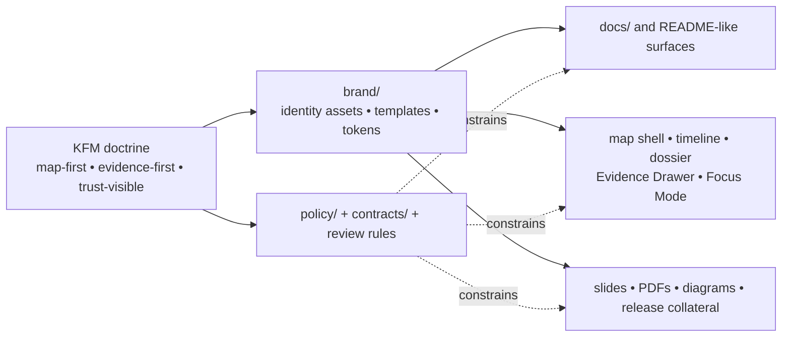

<!-- [KFM_META_BLOCK_V2]
doc_id: kfm://doc/NEEDS-VERIFICATION
title: brand
type: standard
version: v1
status: draft
owners: NEEDS VERIFICATION
created: YYYY-MM-DD
updated: YYYY-MM-DD
policy_label: NEEDS VERIFICATION
related: [../README.md, ../CONTRIBUTING.md, ../.github/README.md, ../docs/, ../apps/]
tags: [kfm, brand, docs]
notes: [Evidence-bounded draft for brand/README.md; replace placeholders and target-oriented tree with live checkout data before merge.]
[/KFM_META_BLOCK_V2] -->

# brand

Reusable brand assets and visual-identity guidance for KFM’s governed, map-first product surfaces.

[](../README.md)
[](./README.md)
[](../CONTRIBUTING.md)
[](#appendix--verification-backlog)

| Field | Value |
|---|---|
| Status | experimental |
| Owners | NEEDS VERIFICATION |
| Path | `brand/README.md` |
| Repo fit | Directory contract for reusable KFM identity assets, visual primitives, and presentation templates |
| Quick jumps | [Scope](#scope) · [Repo fit](#repo-fit) · [Inputs](#inputs) · [Exclusions](#exclusions) · [Tree](#directory-tree) · [Quickstart](#quickstart) · [Usage](#usage) · [Diagram](#diagram) · [Definition of done](#task-list--definition-of-done) · [FAQ](#faq) |

> [!IMPORTANT]
> This README is intentionally evidence-bounded. It is written to be safe under a docs-first review pass where the doctrinal corpus is strong, but the live `brand/` subtree, owners, and exact asset inventory still need direct checkout verification before merge.

## Scope

Use `brand/` for reusable KFM identity material that helps documentation, product surfaces, and exports stay visually consistent **without** becoming a side door around evidence, policy, or review state.

This directory is for identity and presentation primitives, not for redefining KFM truth. Brand should reinforce trust-visible behavior, not replace it.

[Back to top](#brand)

## Repo fit

**Path:** `brand/`

**Upstream references:** [`../README.md`](../README.md), [`../CONTRIBUTING.md`](../CONTRIBUTING.md), [`../.github/README.md`](../.github/README.md)

**Downstream consumers:** expected to include adjacent documentation and surface layers such as [`../docs/`](../docs/), [`../apps/`](../apps/), [`../examples/`](../examples/), and exported artifacts generated from governed documentation or product-surface work. Exact consuming paths are **NEEDS VERIFICATION**.

**Local rule:** if a file in `brand/` changes how KFM presents trust, status, evidence, rights, or review cues, update the adjacent docs in the same change set.

## Inputs

Accepted inputs for `brand/` should be limited to reusable, reviewable assets such as:

- approved wordmarks, logos, icons, lockups, and badges
- palette references, type guidance, and brand-scoped visual tokens
- export-ready templates for docs, diagrams, decks, reports, and sanctioned presentation surfaces
- editable source files for reusable assets, with exported derivatives kept in sync
- usage notes, attribution notes, and rights/reuse guidance for included assets
- doctrine-aligned illustrations that explain KFM concepts such as the truth path, trust membrane, Evidence Drawer, or Focus Mode

## Exclusions

Do **not** place the following here:

- one-off exploratory graphics or draft screenshots that belong in `../docs/` or `../examples/`
- raw datasets, source media, or evidence artifacts that belong in `../data/`
- policy files, contracts, schemas, or decision registries that belong in `../policy/`, `../contracts/`, or `../schemas/`
- UI screenshots or illustrations that imply live implementation status unless they are clearly versioned, evidence-safe, and review-ready
- licensed fonts, vendor assets, or third-party brand material whose reuse status is not explicitly verified
- spectacle-first hero imagery that obscures KFM’s map-first, evidence-first, time-explicit posture

> [!CAUTION]
> `brand/` must not become a place where persuasive visuals outrun repo truth. Decorative polish cannot stand in for provenance, review state, rights posture, freshness, or policy-visible denials.

## Directory tree

Target-oriented tree only. Replace with the live subtree before merge.

```text
brand/
├── README.md
├── assets/                 # PROPOSED: exported logos, icons, lockups, templates
│   ├── logos/
│   ├── icons/
│   └── templates/
├── source/                 # PROPOSED: editable originals
├── tokens/                 # PROPOSED: palette / type / spacing references
├── usage/                  # PROPOSED: do / don't examples and guidance
└── LICENSES/               # PROPOSED: attribution, reuse, and rights notes
```

## Quickstart

Inspect first. Normalize later.

```bash
# Inspect the live subtree before editing this README further
find brand -maxdepth 3 -type f | sort
```

```bash
# Find repo references to brand assets and consumers
git grep -nE 'brand/|logo|wordmark|icon|badge|Evidence Drawer|Focus Mode|Map Explorer' -- . ':!node_modules'
```

```bash
# Surface placeholders that still need replacement before merge
grep -RIn 'NEEDS VERIFICATION\|YYYY-MM-DD\|kfm://doc/NEEDS-VERIFICATION' brand .github docs 2>/dev/null || true
```

```bash
# Optional: generate a checksum list for asset review
find brand -type f -print0 | xargs -0 shasum -a 256
```

## Usage

Treat `brand/` as the reusable visual layer that supports KFM’s governed surfaces.

| Asset class | Use it for | Must carry | Must not imply |
|---|---|---|---|
| Identity assets | repo docs, sanctioned exports, presentation covers, stable UI chrome | approved naming, rights clarity, consistent export quality | live implementation depth, release state, or policy status not actually verified |
| Trust-visible diagrams | truth path, trust membrane, Evidence Drawer, Focus flow, release doctrine | doctrine-aligned labels, reviewable source files, update path alongside docs | substitute truth path for decorative “system overview” art |
| Surface collateral | shell mockups, dossier examples, map/timeline layouts, review-state callouts | explicit `CONFIRMED` / `PROPOSED` / `UNKNOWN` labeling where needed | that a proposed shell or state model is already shipped |
| Templates | PDFs, slides, reports, architecture notes | export consistency, accessible defaults, repo-relative guidance | unrestricted reuse of third-party licensed assets |
| Badges / marks | repo docs and light-touch identity cues | compact, readable, doctrine-safe use | trust created by chrome alone |

### Practical guardrails

1. Keep geography, time, evidence, and trust context legible.
2. Prefer reusable primitives over one-off polished composites.
3. Label conceptual or proposed UI imagery so it cannot be mistaken for shipped behavior.
4. Keep 3D collateral clearly conditional and contextual; 2D remains the default authoritative shell.
5. Keep rights and attribution visible enough that reuse is reviewable.

## Diagram


```mermaid
flowchart LR
    D["KFM doctrine<br/>map-first • evidence-first • trust-visible"]
    B["brand/<br/>identity assets • templates • tokens"]
    Docs["docs/ and README-like surfaces"]
    UI["map shell • timeline • dossier<br/>Evidence Drawer • Focus Mode"]
    Exports["slides • PDFs • diagrams • release collateral"]
    Policy["policy/ + contracts/ + review rules"]

    D --> B
    D --> Policy
    B --> Docs
    B --> UI
    B --> Exports
    Policy -. constrains .-> Docs
    Policy -. constrains .-> UI
    Policy -. constrains .-> Exports
```

## Tables

### Operating relationship matrix

| Relationship | Why it matters | Action |
|---|---|---|
| `brand/` → `docs/` | docs are a production surface | keep diagrams, covers, and exported visuals aligned with behavior-significant documentation |
| `brand/` → `apps/` | product surfaces should stay trust-visible | verify whether runtime tokens belong in app code, `brand/`, or both |
| `brand/` → `examples/` | examples can safely hold exploratory collateral | keep non-canonical or draft visuals out of reusable brand primitives |
| `brand/` → `policy/` | visual assets can imply permissions or trust states | never imply public-safe status, rights, or review completion unless those states are real |
| `brand/` → reviewers | identity and trust cues affect user interpretation | include asset rights, provenance, and intended use in review packets when material |

### Suggested naming discipline

| Pattern | Example | Notes |
|---|---|---|
| lowercase-kebab-case exports | `kfm-wordmark-horizontal.svg` | stable, repo-friendly |
| source/original distinction | `source/kfm-wordmark-horizontal.ai` | editable originals separate from exports |
| context suffixes | `kfm-badge-docs.svg` | prefer explicit use over ambiguous duplicates |
| version only when needed | `kfm-slide-cover-v2.svg` | version when visual meaning changes materially |

## Task list / definition of done

### Task list

- [ ] Replace all placeholders in the KFM meta block.
- [ ] Confirm the real `brand/` subtree from a live checkout.
- [ ] Verify owners against `CODEOWNERS` or the repo’s owner-of-record mechanism.
- [ ] Verify rights and attribution for every included asset.
- [ ] Map each reusable asset to at least one real consuming surface or document.
- [ ] Confirm whether design tokens belong here, in app packages, or in both.
- [ ] Remove or relocate any one-off exploratory collateral.
- [ ] Ensure any UI illustration that shows trust, evidence, or review cues is labeled accurately.

### Definition of done

This README is ready to merge when:

1. the live directory tree replaces the target-oriented placeholder tree
2. owners, dates, policy label, and related links are verified
3. accepted inputs and exclusions match real repo usage
4. brand assets do not imply unverified runtime, policy, or release states
5. links resolve relative to the repo root
6. any behavior-significant visual guidance is reconciled with adjacent docs

## FAQ

### Why keep `brand/` separate from `docs/`?

Because reusable visual primitives and one-off documentation artifacts are not the same thing. `brand/` should stay small, stable, and reusable; `docs/` can hold context-heavy explanation and draft collateral.

### Can `brand/` include screenshots of the product?

Only when they are deliberate, versioned, and clearly safe to interpret. Draft screenshots, exploratory mockups, or implementation-specific captures usually belong in `docs/` or `examples/`, not in the reusable brand layer.

### Can 3D hero art live here?

Only as a clearly contextual extension. KFM doctrine keeps 2D as the default authoritative shell and treats 3D as conditional, burden-bearing context rather than the default public truth surface.

### Do design tokens belong here?

Maybe. If the token is purely brand-scoped, `brand/` is a reasonable home. If it directly drives runtime behavior in shipped UI, verify whether the source of truth belongs in an app/package-level system instead.

### What should happen when a logo or template changes?

Update this README, update adjacent docs that consume the asset, and note any behavior-significant implications in the same change stream.

[Back to top](#brand)

<details>
<summary>Appendix — verification backlog</summary>

### Open unknowns

- Whether `brand/README.md` already exists in the live checkout
- Exact internal inventory of `brand/`
- Owners and review path
- Whether fonts or third-party assets require restricted handling
- Whether brand-scoped tokens already exist elsewhere in the repo
- Which docs, apps, or exports currently consume `brand/` assets

### Recommended follow-up checks

1. Capture the live `brand/` tree and replace the placeholder inventory.
2. Search for all current consumers of `brand/` assets.
3. Confirm whether any asset implies release, policy, or review states that must be synchronized with governed docs.
4. Record rights/reuse terms for every third-party inclusion.
5. Add or link a small set of sanctioned examples once the live tree is verified.

### Adjacent docs likely to need reciprocal links

- `../README.md`
- `../CONTRIBUTING.md`
- `../.github/README.md`
- any UI or design-system docs under `../docs/`
- any app-facing surface docs that consume shared visual primitives

</details>
