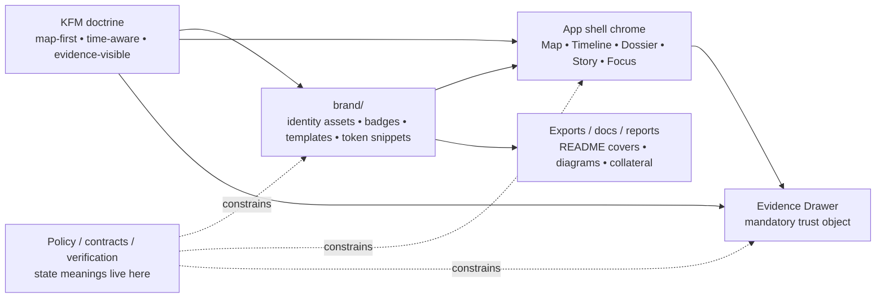

<!-- [KFM_META_BLOCK_V2]
doc_id: kfm://doc/NEEDS-VERIFICATION
title: brand
type: standard
version: v1
status: draft
owners: NEEDS VERIFICATION
created: YYYY-MM-DD
updated: YYYY-MM-DD
policy_label: NEEDS VERIFICATION
related: [NEEDS VERIFICATION: candidate adjacencies include ../README.md, ../CONTRIBUTING.md, ../.github/README.md, ../docs/, ../apps/]
tags: [kfm, brand, docs]
notes: [Evidence-bounded draft for brand/README.md; live subtree, owners, dates, and policy label remain unverified; strongest explicit asset cue in the attached corpus is assets/brand/.]
[/KFM_META_BLOCK_V2] -->

# brand

Reusable brand assets and visual-identity guidance for KFM’s governed, map-first product surfaces.

[](./README.md)
[](./README.md)
[](./README.md)
[](#appendix--verification-backlog)

| Field | Value |
|---|---|
| Status | experimental |
| Owners | NEEDS VERIFICATION |
| Path | `brand/README.md` *(target path for this task)* |
| Strongest explicit corpus cue | `assets/brand/` |
| Repo fit | Reusable KFM identity assets, trust-visible chrome primitives, and presentation templates |
| Quick jumps | [Scope](#scope) · [Repo fit](#repo-fit) · [Accepted inputs](#accepted-inputs) · [Exclusions](#exclusions) · [Corpus-named asset cues](#corpus-named-asset-cues) · [Directory tree](#directory-tree) · [Quickstart](#quickstart) · [Usage](#usage) · [Diagram](#diagram) · [Task list](#task-list--definition-of-done) · [FAQ](#faq) |

> [!IMPORTANT]
> This README is intentionally evidence-bounded. Current-session workspace evidence for this task exposed PDFs only, so the live `brand/` subtree, owners, dates, policy label, and exact asset inventory remain **UNKNOWN**. The strongest explicit brand-specific path named in the attached corpus is `assets/brand/`, not yet-confirmed `brand/`.

## Scope

Use `brand/` for reusable KFM identity material that helps docs, app chrome, exports, and presentation surfaces stay visually consistent **without** creating a side door around evidence, policy, review, or release state.

KFM doctrine treats interaction surfaces as part of the evidence chain, not decorative wrapping. Brand should therefore reinforce trust-visible behavior, not redefine it.

[Back to top](#brand)

## Repo fit

**Path:** `brand/`  
**Path status:** **PROPOSED target path** for this task; the strongest explicit corpus-named asset location is `assets/brand/`, and the live checkout still needs verification.

**Candidate upstream adjacencies to verify in the live checkout:** [../README.md](../README.md), [../CONTRIBUTING.md](../CONTRIBUTING.md), [../.github/README.md](../.github/README.md)

**Candidate downstream consumers to verify in the live checkout:** [../docs/](../docs/), [../apps/](../apps/)

**Local rule:** if a brand change affects how KFM renders freshness, sensitivity, review, correction, evidence access, or other trust-visible cues, update adjacent guidance in the same change stream.

## Accepted inputs

Place only reusable, reviewable identity material here.

- approved emblems, wordmarks, icons, lockups, badges, and shell-safe visual primitives
- light/dark exports and size variants intended for repeated use across docs and product surfaces
- contrast matrices, badge tables, and compact token snippets that help surfaces stay consistent
- reusable templates for README-like docs, diagrams, slide/report covers, and sanctioned export surfaces
- rights, attribution, and reuse notes for committed assets
- doctrine-aligned illustrations that explain stable KFM concepts such as the map-first shell, Evidence Drawer, or governed Focus flow

## Exclusions

Do **not** treat `brand/` as a generic image bucket.

- **Canonical data, evidence, and source artifacts** do not belong here. Keep them in KFM’s governed truth path and related catalog or release surfaces instead.
- **Policy semantics, schema meaning, route contracts, and trust-state definitions** do not belong here. Those belong in governed app, contract, policy, and verification materials.
- **One-off mockups, research comps, and exploratory screenshots** do not belong here. Place them in context-heavy documentation or evaluation-asset areas once the live repo structure is verified.
- **Unverified third-party fonts, vendor marks, or rights-unclear assets** do not belong here. Keep them out of version control until reuse status is confirmed.
- **3D-first hero imagery as default product identity** does not belong here. KFM keeps 2D as the default reasoning surface; 3D remains conditional, contextual, and burden-bearing.

> [!CAUTION]
> Brand must not become a place where persuasive visuals outrun repo truth. Polished chrome cannot stand in for provenance, review state, rights posture, release scope, or citation-bearing evidence.

## Corpus-named asset cues

These are the strongest brand-specific packaging cues visible in the attached corpus. They are useful starting points, but they are **not** confirmed as live repo files in the current session.

| Corpus-named item | Status | Working note |
|---|---|---|
| `assets/brand/kfm-emblem.svg` | PROPOSED | dark-mode emblem export |
| `assets/brand/kfm-emblem.light.svg` | PROPOSED | light-mode emblem export |
| 24 / 32 / 48 / 64 px PNG exports | PROPOSED | quick UI-testing pack |
| A/B contrast matrix | PROPOSED | pass/fail review artifact |
| README badge table | PROPOSED | modes, sizes, WCAG scores |
| Design token snippet | PROPOSED | colors, stroke minima, grid |
| Wordmark typography workflow | PROPOSED | live Merriweather / Libre Baskerville during design, then outlined for final export |

### Path reconciliation note

The requested target file is `brand/README.md`, but the strongest explicit asset path named in the attached corpus is `assets/brand/...`. Do **not** silently assume both exist. Verify the live repo layout first, then either:

1. keep `brand/` as the directory contract and document where exports actually live, or
2. move this README beside the real asset subtree.

## Directory tree

Evidence-bounded working tree only. Replace it with the live checkout before merge.

```text
brand/                                  # target path requested for this task
└── README.md                           # this file

assets/brand/                           # strongest explicit corpus-named asset location
├── kfm-emblem.svg                      # PROPOSED dark export
├── kfm-emblem.light.svg                # PROPOSED light export
├── png/                                # PROPOSED quick-test exports (24/32/48/64)
├── contrast/                           # PROPOSED A/B contrast matrix
└── tokens/                             # PROPOSED color / stroke / grid snippet
```

## Quickstart

Inspect first. Normalize later.

```bash
# Inspect both the requested and corpus-named locations
find brand assets/brand -maxdepth 3 -type f 2>/dev/null | sort
```

```bash
# Find likely consumers of shared brand or trust-visible UI assets
git grep -nE 'kfm-emblem|Evidence Drawer|Focus Mode|freshness|sensitivity|review|correction' -- . 2>/dev/null || true
```

```bash
# Surface placeholders before merge
grep -RIn 'NEEDS VERIFICATION\|YYYY-MM-DD\|kfm://doc/NEEDS-VERIFICATION' brand assets/brand docs apps .github 2>/dev/null || true
```

```bash
# Optional: generate digests for asset review once the subtree exists
find brand assets/brand -type f -print0 2>/dev/null | xargs -0 shasum -a 256
```

## Usage

Treat `brand/` as KFM’s reusable visual support layer, not as the source of truth for trust semantics.

### Governing rules brand should follow

1. Keep place, time, evidence, freshness, review state, sensitivity, and correction context legible.
2. Let brand style trust-visible cues, but do **not** redefine what those cues mean.
3. Keep public, review, and steward surfaces visually related enough that users can recognize one governed shell family.
4. Preserve the 2D-first default. Any 3D collateral must remain clearly conditional and story-mode-like.
5. Keep rights, attribution, contrast, and reuse review visible enough to audit.

### Brand-owned vs doctrine-owned

| Concern | Brand may define | Brand must not silently redefine |
|---|---|---|
| Wordmarks, emblems, palette, spacing | visual form, export quality, lockups, size guidance | release authority, policy classes, review semantics |
| Freshness / sensitivity / review cues | icon treatment, contrast, spacing, badge shape | meaning of freshness, sensitivity, review, denial, or correction state |
| Evidence Drawer chrome | visual rhythm, headings, iconography, spacing | required fields, evidence linkage, resolver behavior, rights logic |
| Story / Focus collateral | cover treatments, illustration language, badge placement | citation rules, abstain / deny logic, runtime answer validity |
| 3D collateral | optional contextual story-mode art | KFM’s default operating surface or truth model |

### Asset packaging and review matrix

| Asset family | Why it belongs here | Minimum companion material before merge |
|---|---|---|
| Emblem / wordmark exports | repeated use across shell chrome, docs, and exports | light/dark variants, rights note, contrast check |
| Badge / cue primitives | repeated trust-visible rendering support | accessibility review, semantic handoff note, size guidance |
| Templates | repeated use in README-like docs and report covers | marked reuse scope, non-authoritative usage note |
| Token snippets | handoff support for UI implementation | source-of-truth note, duplicate-avoidance note, review path |

### Practical review checks

| Review question | Why it matters | Expected answer before merge |
|---|---|---|
| Does this asset clarify or obscure trust state? | KFM surfaces must stay trust-visible | Clarifies, or it does not ship |
| Does this asset imply shipped behavior that is only proposed? | Brand must not outrun repo truth | No, or it is explicitly labeled concept/proposal |
| Does this asset carry verified rights and reuse posture? | Rights are first-class in KFM | Yes, with notes or provenance |
| Can this asset survive light/dark use and contrast checks? | Accessibility is part of the product contract | Yes, with a recorded check |
| Is this asset reusable across docs, shell chrome, or exports? | `brand/` should stay small and durable | Yes, or it belongs elsewhere |

## Diagram


```mermaid
flowchart LR
    D["KFM doctrine<br/>map-first • time-aware • evidence-visible"]
    P["Policy / contracts / verification<br/>state meanings live here"]
    B["brand/<br/>identity assets • badges • templates • token snippets"]
    S["App shell chrome<br/>Map • Timeline • Dossier • Story • Focus"]
    E["Evidence Drawer<br/>mandatory trust object"]
    X["Exports / docs / reports<br/>README covers • diagrams • collateral"]

    D --> B
    D --> S
    D --> E
    P -. constrains .-> B
    P -. constrains .-> S
    P -. constrains .-> E
    B --> S
    B --> X
    S --> E
```

## Task list / definition of done

### Task list

- [ ] Reconcile the requested `brand/` path with the corpus-named `assets/brand/` path.
- [ ] Replace all placeholders in the KFM meta block.
- [ ] Verify owners against `CODEOWNERS` or the repo’s owner-of-record mechanism.
- [ ] Confirm the real asset inventory from a live checkout.
- [ ] Verify rights, attribution, and reuse terms for every committed asset.
- [ ] Confirm whether token source-of-truth belongs here, in app packages, or in both.
- [ ] Add or link the badge table, contrast matrix, and token snippet if they already exist.
- [ ] Map each reusable asset to at least one real consuming surface or document.
- [ ] Remove or relocate one-off exploratory collateral.
- [ ] Ensure any asset that affects trust-visible UI cues stays aligned with app, policy, and verification docs.

### Definition of done

This README is ready to merge when:

1. the live tree replaces the evidence-bounded placeholder tree
2. `brand/` versus `assets/brand/` pathing is reconciled
3. owners, dates, policy label, and adjacent links are verified
4. accepted inputs and exclusions match actual repo usage
5. rights and accessibility checks are visible for committed assets
6. brand assets do not imply unverified runtime, policy, or release state
7. reciprocal links exist from adjacent docs or app-surface references where appropriate

## FAQ

### Why does this README mention both `brand/` and `assets/brand/`?

Because the requested target file is `brand/README.md`, while the strongest explicit asset path named in the attached corpus is `assets/brand/...`. That mismatch is real and should be resolved against the live checkout instead of being silently flattened.

### Does `brand/` own Evidence Drawer semantics, Focus outcomes, or trust-state meaning?

No. Brand can shape how those cues look, but the semantics live in governed app, contract, policy, and verification materials. Visual polish must remain subordinate to KFM truth and runtime behavior.

### Can screenshots, mockups, or concept art live here?

Only if they are reusable, review-safe, rights-cleared, and unlikely to be mistaken for live implementation. One-off exploratory material belongs in context-heavy docs or evaluation areas instead.

### Can 3D hero art live here?

Only as a clearly conditional extension. KFM keeps 2D as the default reasoning surface and treats 3D as burden-bearing, contextual, and never sovereign.

### Do design tokens belong here?

Sometimes. Brand-scoped tokens are a good fit here. Runtime-critical UI tokens may belong in app packages or a shared surface system instead. Verify the real source-of-truth location before duplicating anything.

[Back to top](#brand)

<details>
<summary>Appendix — verification backlog</summary>

### Open unknowns

- Whether `brand/README.md` already exists in the live checkout
- Whether the real asset subtree is `brand/`, `assets/brand/`, or both
- Owners and review path
- Exact emblem / wordmark / badge inventory
- Whether fonts or third-party assets require restricted handling
- Whether token snippets already exist elsewhere in the repo
- Which docs, apps, or exports currently consume shared brand assets

### Recommended follow-up checks

1. Inspect the live repo tree and replace the placeholder structure.
2. Open the nearest root and contributor docs plus `CODEOWNERS` in the live checkout.
3. Search for all consumers of emblem, badge, and trust-visible UI assets.
4. Verify dark/light exports, PNG pack, contrast matrix, and token snippet presence.
5. Add reciprocal links from adjacent docs once the real paths are confirmed.

### Candidate adjacent docs likely to need reciprocal links

- `../README.md`
- `../CONTRIBUTING.md`
- `../.github/README.md`
- app-surface and UI doctrine docs under `../docs/`
- app-facing surface docs under `../apps/`

</details>
