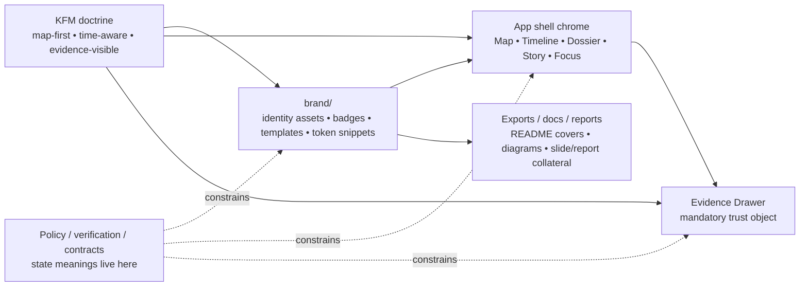

<!-- [KFM_META_BLOCK_V2]
doc_id: kfm://doc/NEEDS-VERIFICATION
title: brand
type: standard
version: v1
status: draft
owners: NEEDS VERIFICATION
created: YYYY-MM-DD
updated: YYYY-MM-DD
policy_label: NEEDS VERIFICATION
related: [../README.md, ../CONTRIBUTING.md, ../.github/README.md, ../docs/, ../apps/]
tags: [kfm, brand, docs]
notes: [Evidence-bounded draft for brand/README.md; live subtree, owners, and policy label remain unverified; mounted corpus names proposed brand assets under assets/brand/, which should be reconciled with this target path before merge.]
[/KFM_META_BLOCK_V2] -->

# brand

Reusable brand assets and visual-identity guidance for KFM’s governed, map-first product surfaces.

[](../README.md)
[](./README.md)
[](../CONTRIBUTING.md)
[](#appendix--verification-backlog)

| Field | Value |
|---|---|
| Status | experimental |
| Owners | NEEDS VERIFICATION |
| Path | `brand/README.md` |
| Repo fit | Directory contract for reusable KFM identity assets, badge/chrome primitives, and presentation templates |
| Quick jumps | [Scope](#scope) · [Repo fit](#repo-fit) · [Accepted inputs](#accepted-inputs) · [Exclusions](#exclusions) · [Corpus-named deliverables](#corpus-named-deliverables) · [Tree](#directory-tree) · [Quickstart](#quickstart) · [Usage](#usage) · [Diagram](#diagram) · [Definition of done](#task-list--definition-of-done) · [FAQ](#faq) |

> [!IMPORTANT]
> This README is intentionally evidence-bounded. Current-session workspace evidence for this task exposed PDFs only, so the live `brand/` subtree, owners, exact asset inventory, and policy label remain **UNKNOWN**. The strongest brand-specific packaging cue in the mounted corpus points to `assets/brand/`, not yet-confirmed `brand/`, so reconcile pathing before merge.

## Scope

Use `brand/` for reusable KFM identity material that helps docs, app chrome, exports, and presentation surfaces stay visually consistent **without** creating a side door around evidence, policy, review, or release state.

KFM doctrine treats interface as part of the evidence chain, not decorative chrome. Brand should therefore reinforce trust-visible behavior, not redefine it.

[Back to top](#brand)

## Repo fit

**Path:** `brand/`  
**Path status:** **PROPOSED target path** for this task; live checkout still needs verification.

**Upstream references:** [`../README.md`](../README.md), [`../CONTRIBUTING.md`](../CONTRIBUTING.md), [`../.github/README.md`](../.github/README.md)

**Downstream consumers:** expected to include shared docs under [`../docs/`](../docs/), app-facing surfaces under [`../apps/`](../apps/), and exported collateral built from governed releases or review-safe presentation flows. Exact consuming paths remain **NEEDS VERIFICATION**.

**Local rule:** if a brand change alters how KFM presents freshness, generalization, review state, evidence access, or other trust-visible cues, update adjacent docs or surface guidance in the same change stream.

## Accepted inputs

Place only reusable, reviewable identity material here:

- approved wordmarks, emblems, icons, lockups, and badge assets
- light/dark exports and other mode-specific variants intended for repeated use
- contrast matrices, badge tables, and compact token snippets that help surfaces stay consistent
- reusable templates for README-like docs, diagrams, slide/report covers, and sanctioned export surfaces
- usage guidance, attribution notes, and rights/reuse documentation for included assets
- doctrine-aligned illustrations that explain stable KFM concepts such as the map-first shell, Evidence Drawer, or governed Focus flow

## Exclusions

Do **not** treat `brand/` as a catch-all image bucket.

- **Canonical data, evidence, and source artifacts** do not belong here. They belong in the governed KFM truth path and its catalog/release surfaces instead.
- **Route DTOs, policy states, schema semantics, and trust-state meanings** do not belong here. They belong in governed app, contract, policy, and verification materials under adjacent system docs, not in the brand layer.
- **One-off mockups, research comps, or exploratory screenshots** do not belong here. Put them in the repo’s context-heavy documentation or evaluation-asset areas instead, once the live structure is verified.
- **Unverified third-party fonts, vendor marks, or rights-unclear assets** do not belong here. Keep them out of version control until reuse status is confirmed.
- **Spectacle-first 3D hero imagery** does not belong here as default product identity. If 3D collateral exists, it must remain clearly contextual and subordinate to KFM’s 2D-first public reasoning model.

> [!CAUTION]
> Brand must not become a place where persuasive visuals outrun repo truth. Polished chrome cannot stand in for provenance, review state, release scope, rights posture, or citation-bearing evidence.

## Corpus-named deliverables

These are the strongest brand-specific packaging cues visible in the mounted corpus. They are useful starting points, but they are **not** confirmed as live repo files in the current session.

| Corpus-named item | Status | Working note |
|---|---|---|
| `assets/brand/kfm-emblem.svg` | PROPOSED | dark-mode emblem export |
| `assets/brand/kfm-emblem.light.svg` | PROPOSED | light-mode emblem export |
| 24 / 32 / 48 / 64 px PNG exports | PROPOSED | quick UI testing pack |
| A/B contrast matrix | PROPOSED | pass/fail review artifact |
| README badge table | PROPOSED | modes, sizes, WCAG scores |
| Design token snippet | PROPOSED | colors, stroke minima, grid |
| Wordmark typography workflow | PROPOSED | live Merriweather / Libre Baskerville during design, then outline for final export |

### Path reconciliation note

The task target is `brand/README.md`, but the only explicit asset path named in the mounted corpus is `assets/brand/...`. Do **not** silently assume both exist. Resolve the live repo layout first, then either:

1. keep `brand/` as the directory contract and document where exports actually live, or
2. move this README so it sits next to the real asset subtree.

## Directory tree

Evidence-bounded working tree only. Replace with the live checkout before merge.

```text
brand/                                  # target path requested for this task
└── README.md                           # this file

assets/brand/                           # corpus-named asset location; verify against live checkout
├── kfm-emblem.svg                      # PROPOSED dark export
├── kfm-emblem.light.svg                # PROPOSED light export
├── png/                                # PROPOSED quick-test exports (24/32/48/64)
├── contrast/                           # PROPOSED A/B contrast matrix
└── tokens/                             # PROPOSED color / stroke / grid snippet
```

## Quickstart

Inspect first. Normalize later.

```bash
# Inspect both the requested and corpus-named locations
find brand assets/brand -maxdepth 3 -type f 2>/dev/null | sort
```

```bash
# Find likely consumers of shared brand or trust-visible UI assets
git grep -nE 'kfm-emblem|Evidence Drawer|Focus Mode|stale-visible|generalized|policy chip|review chip' -- .
```

```bash
# Surface placeholders before merge
grep -RIn 'NEEDS VERIFICATION\|YYYY-MM-DD\|kfm://doc/NEEDS-VERIFICATION' brand .github docs apps 2>/dev/null || true
```

```bash
# Optional: generate digests for asset review once the subtree exists
find brand assets/brand -type f -print0 2>/dev/null | xargs -0 shasum -a 256
```

## Usage

Treat `brand/` as KFM’s reusable visual support layer, not as the source of truth for trust semantics.

### Brand rules that follow from doctrine

1. Keep geography, time, evidence, and trust context legible.
2. Let brand style trust-visible chips and drawer chrome, but do **not** redefine what those states mean.
3. Keep review and stewardship visually attached to the same shell family as public surfaces.
4. Preserve the 2D-first default. Any 3D collateral must remain clearly conditional and story-mode-like.
5. Keep rights, attribution, contrast, and reuse review visible enough to audit.

### Brand-owned vs. contract-owned

| Concern | Brand may define | Brand must not silently redefine |
|---|---|---|
| Wordmarks, icons, palette, spacing | visual form, export quality, lockups, size guidance | release authority, policy classes, review semantics |
| Trust chips and badges | shape, iconography, contrast, spacing | meanings of `stale-visible`, `generalized`, `restricted`, `withdrawn`, or `superseded` |
| Evidence Drawer chrome | visual rhythm, headings, icon treatment, spacing | required fields, evidence linkage, resolver behavior, rights logic |
| Story / Focus collateral | cover treatments, illustration language, badge placement | citation rules, abstain / deny logic, runtime answer validity |
| 3D collateral | optional contextual story-mode art | KFM’s default operating surface or truth model |

### Practical review checks

| Review question | Why it matters | Expected answer before merge |
|---|---|---|
| Does this asset clarify or obscure trust state? | KFM surfaces must stay trust-visible | Clarifies, or it does not ship |
| Does this asset imply shipped behavior that is only proposed? | Brand must not outrun repo truth | No, or it is explicitly labeled concept/proposal |
| Does this asset carry verified rights and reuse posture? | Rights are first-class in KFM | Yes, with notes or provenance |
| Can this asset survive light/dark use and contrast checks? | Accessibility is part of the product contract | Yes, with a recorded check |
| Is this asset reusable across docs, shell chrome, or exports? | `brand/` should stay small and durable | Yes, or it belongs elsewhere |

## Diagram


```mermaid
flowchart LR
    D["KFM doctrine<br/>map-first • time-aware • evidence-visible"]
    P["Policy / verification / contracts<br/>state meanings live here"]
    B["brand/<br/>identity assets • badges • templates • token snippets"]
    S["App shell chrome<br/>Map • Timeline • Dossier • Story • Focus"]
    E["Evidence Drawer<br/>mandatory trust object"]
    X["Exports / docs / reports<br/>README covers • diagrams • slide/report collateral"]

    D --> B
    D --> S
    D --> E
    P -. constrains .-> B
    P -. constrains .-> S
    P -. constrains .-> E
    B --> S
    B --> X
    S --> E
```

## Task list / definition of done

### Task list

- [ ] Reconcile the requested `brand/` path with the corpus-named `assets/brand/` path.
- [ ] Replace all placeholders in the KFM meta block.
- [ ] Verify owners against `CODEOWNERS` or the repo’s owner-of-record mechanism.
- [ ] Confirm the real asset inventory from a live checkout.
- [ ] Verify rights, attribution, and reuse terms for every committed asset.
- [ ] Confirm whether design-token source of truth belongs here, in app packages, or in both.
- [ ] Add or link the badge table, contrast matrix, and token snippet if they already exist.
- [ ] Map each reusable asset to at least one real consuming surface or document.
- [ ] Remove or relocate one-off exploratory collateral.
- [ ] Ensure any asset that touches trust-visible UI cues stays aligned with app, policy, and verification docs.

### Definition of done

This README is ready to merge when:

1. the live tree replaces the evidence-bounded placeholder tree
2. `brand/` versus `assets/brand/` pathing is reconciled
3. owners, dates, policy label, and related links are verified
4. accepted inputs and exclusions match actual repo usage
5. rights and accessibility checks are visible for committed assets
6. brand assets do not imply unverified runtime, policy, or release state
7. reciprocal links exist from adjacent docs or app-surface references where appropriate

## FAQ

### Why does this README mention both `brand/` and `assets/brand/`?

Because the requested target file is `brand/README.md`, while the strongest explicit asset path named in the mounted corpus is `assets/brand/...`. That mismatch is real and should be resolved against the live checkout instead of being silently flattened.

### Does `brand/` own trust chips, Evidence Drawer semantics, or negative-state meanings?

No. Brand can shape how those cues look, but the semantics live in governed app, contract, policy, and verification materials. Visual polish must stay subordinate to KFM truth and runtime behavior.

### Can screenshots, mockups, or story-node concept art live here?

Only if they are reusable, review-safe, rights-cleared, and unlikely to be mistaken for live implementation. One-off exploratory material belongs in context-heavy docs or evaluation asset areas instead.

### Can 3D hero art live here?

Only as a clearly conditional extension. KFM keeps 2D as the default reasoning surface and treats 3D as burden-bearing, contextual, and never sovereign.

### Do design tokens belong here?

Sometimes. Brand-scoped tokens are a good fit here. Runtime-critical UI tokens may belong in app packages or a shared surface system instead. Verify the real source-of-truth location before duplicating anything.

[Back to top](#brand)

<details>
<summary>Appendix — verification backlog</summary>

### Open unknowns

- Whether `brand/README.md` already exists in the live checkout
- Whether the real asset subtree is `brand/`, `assets/brand/`, or both
- Owners and review path
- Exact emblem / wordmark / badge inventory
- Whether fonts or third-party assets require restricted handling
- Whether design-token snippets already exist elsewhere in the repo
- Which docs, apps, or exports currently consume shared brand assets

### Recommended follow-up checks

1. Inspect the live repo tree and replace the placeholder structure.
2. Open `README.md`, `.github/README.md`, `CONTRIBUTING.md`, and `CODEOWNERS` in the live checkout.
3. Search for all consumers of emblem, badge, and trust-visible UI assets.
4. Verify dark/light exports, PNG pack, contrast matrix, and token snippet presence.
5. Add reciprocal links from adjacent docs once the real paths are confirmed.

### Adjacent docs likely to need reciprocal links

- `../README.md`
- `../CONTRIBUTING.md`
- `../.github/README.md`
- app-surface and UI doctrine docs under `../docs/`
- app-facing surface docs under `../apps/`

</details>
