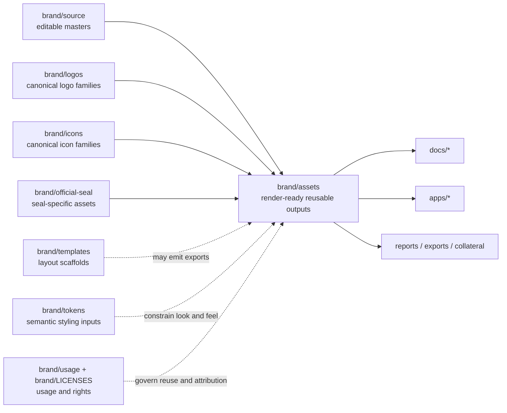

<!-- [KFM_META_BLOCK_V2]
doc_id: kfm://doc/NEEDS-VERIFICATION
title: assets
type: standard
version: v1
status: draft
owners: @bartytime4life
created: YYYY-MM-DD
updated: YYYY-MM-DD
policy_label: NEEDS VERIFICATION
related: [../README.md, ../../README.md, ../source/README.md, ../logos/README.md, ../icons/README.md, ../official-seal/README.md, ../templates/README.md, ../tokens/README.md, ../usage/README.md, ../LICENSES/README.md]
tags: [kfm, brand, assets]
notes: [global CODEOWNERS fallback confirmed, path-specific ownership is not explicitly defined, created/updated/policy_label need verification]
[/KFM_META_BLOCK_V2] -->

# assets

Render-ready, reusable brand outputs for KFM docs, UI chrome, and governed publication surfaces.

> [!IMPORTANT]
> **Status:** experimental  
> **Owners:** `@bartytime4life` *(global CODEOWNERS fallback; path-specific ownership still needs verification)*  
> **Path:** `brand/assets/README.md`  
> **Badges:**  
> 
> 
> 
> 
>   
> **Quick jumps:** [Scope](#scope) · [Repo fit](#repo-fit) · [Inputs](#inputs) · [Exclusions](#exclusions) · [Directory tree](#directory-tree) · [Quickstart](#quickstart) · [Usage](#usage) · [Diagram](#diagram) · [Placement matrix](#placement-matrix) · [Definition of done](#definition-of-done) · [FAQ](#faq)

## Scope

**CONFIRMED:** `brand/assets/` exists as its own lane under `brand/`.  
**CONFIRMED:** the currently visible live contents are minimal.  
**PROPOSED working rule:** treat `brand/assets/` as the place for reusable, consumer-ready brand exports that are ready to drop into other repo surfaces.

This is the **export side** of the brand system, not the master-design side. Files here should already be simplified enough to use in Markdown, UI chrome, release collateral, or other downstream contexts without dragging raw source baggage, tool-specific metadata, or unresolved rights questions behind them.

> [!WARNING]
> Brand assets may reinforce trust-visible behavior, but they must not invent it. Release state, evidence state, policy state, review state, and correction state belong to governed product surfaces and contracts, not to decorative files.

## Repo fit

| Aspect | Value |
|---|---|
| Path | `brand/assets/` |
| Directory role | Reusable, render-ready brand deliverables for downstream consumption |
| Upstream context | [`../README.md`](../README.md), [`../../README.md`](../../README.md), [`../source/README.md`](../source/README.md), [`../logos/README.md`](../logos/README.md), [`../icons/README.md`](../icons/README.md), [`../official-seal/README.md`](../official-seal/README.md), [`../templates/README.md`](../templates/README.md), [`../tokens/README.md`](../tokens/README.md), [`../usage/README.md`](../usage/README.md), [`../LICENSES/README.md`](../LICENSES/README.md) |
| Expected downstream consumers | [`../../docs/`](../../docs/), [`../../apps/`](../../apps/), and any governed export/report surface that needs a reusable brand asset |
| Current live state | `README.md` only |

A good rule of thumb: if a file is **brand-owned and reusable**, it may belong here. If it is **source-owned, rule-owned, or one-off**, it probably belongs somewhere else.

## Inputs

Accepted inputs for this directory include:

- exported SVG, PNG, WebP, or PDF files that are ready to be consumed by docs, apps, or packaged outputs
- reusable light/dark or contrast-safe variants of approved brand material
- downstream-ready derivatives of approved logo, icon, seal, or illustration systems
- static brand illustrations or supporting diagrams that reinforce KFM identity without redefining product truth semantics
- small sidecar notes when an asset family needs handling guidance that is too narrow for `../usage/`
- rights-cleared third-party material only when the governing permission trail is documented in `../LICENSES/`

## Exclusions

This directory is **not** the place for:

- editable masters, working files, or tool-native design sources → [`../source/`](../source/)
- canonical logo-family stewardship → [`../logos/`](../logos/)
- canonical icon-system stewardship → [`../icons/`](../icons/)
- official seal source-of-truth assets → [`../official-seal/`](../official-seal/)
- reusable templates, layout skeletons, or collateral scaffolds → [`../templates/`](../templates/)
- design-token definitions or semantic styling primitives → [`../tokens/`](../tokens/)
- brand policy, usage guidance, approvals, or licensing records → [`../usage/`](../usage/) and [`../LICENSES/`](../LICENSES/)
- screenshots, one-off mockups, or deck-local exports that are not meant to become shared brand artifacts
- files that imply release approval, evidence strength, freshness, or policy clearance
- spectacle-first 3D hero art that overstates product maturity or authority

## Directory tree

### Brand subtree context

```text
brand/
├── README.md
├── LICENSES/
├── assets/
│   └── README.md
├── icons/
├── logos/
├── official-seal/
│   ├── README.md
│   └── kfm-official-seal-transparent.png
├── source/
├── templates/
├── tokens/
└── usage/
```

### Current contents of this lane

```text
brand/assets/
└── README.md
```

That small current footprint is fine. A narrowly-scoped empty lane is healthier than a miscellaneous asset dump.

## Quickstart

1. Confirm the file is **reusable** and **render-ready**.
2. Confirm it is **brand-owned** rather than source-owned or doc-local.
3. Place the export under `brand/assets/`.
4. Add or update any supporting rights/usage notes when the asset cannot safely speak for itself.
5. Update downstream references with repo-relative paths.

Illustrative example:

```bash
# example only — use a purpose-specific filename and subfolder if the family grows
mkdir -p brand/assets/docs
cp <local-export>.svg brand/assets/docs/kfm-map-shell-badge.svg

# optional but useful for release and review notes
shasum -a 256 brand/assets/docs/kfm-map-shell-badge.svg
git add brand/assets/docs/kfm-map-shell-badge.svg brand/assets/README.md
```

## Usage

### Working rules

1. **Consumer-ready only.**  
   Assets here should already be suitable for downstream use.

2. **Reusable beats incidental.**  
   If a file is only for one document, one ticket, or one slide, keep it with that consumer unless it is clearly becoming a shared brand artifact.

3. **Trust-visible, not truth-defining.**  
   A static asset can support KFM’s tone and shell clarity, but it must not become the place where meaning about evidence, freshness, review, or correction is silently encoded.

4. **2D-first by default.**  
   Favor disciplined 2D outputs unless a stronger burden of justification exists elsewhere in the repo’s governing documentation.

5. **Rights travel with the asset.**  
   If reuse constraints, attribution, or vendor limitations matter, make them discoverable through neighboring brand docs rather than relying on memory.

### Starter naming convention

The repo does **not** currently prove a finalized naming convention for this lane. Until a stricter rule is documented, use this conservative starter pattern:

- lowercase
- kebab-case
- purpose before variant
- variant suffixes only when they are real and stable

Examples:

```text
kfm-map-shell-badge.svg
kfm-wordmark-dark.png
kfm-civic-handout-header.pdf
```

Avoid filenames that only make sense inside one temporary workflow, such as:

```text
final-final-v4.png
new-header-use-this-one.svg
slide-export-2.webp
```

## Diagram



## Placement matrix

| If the file is... | Put it here | Why |
|---|---|---|
| a reusable exported brand asset ready for consumption | `brand/assets/` | this lane is for render-ready downstream files |
| a master design source or editable working file | `brand/source/` | source stewardship should stay separate from exports |
| a canonical logo family file | `brand/logos/` | logo governance belongs in its own lane |
| a canonical icon family file | `brand/icons/` | icon governance belongs in its own lane |
| an official seal asset or its canonical derivative | `brand/official-seal/` | seal handling is specialized enough to keep distinct |
| a template or reusable collateral scaffold | `brand/templates/` | templates are structure, not just assets |
| a token, semantic style value, or system design primitive | `brand/tokens/` | tokens drive styling logic and should stay machine-usable |
| a rights, attribution, or usage note | `brand/usage/` or `brand/LICENSES/` | policy and rights should stay discoverable and explicit |
| a one-off screenshot, mockup, or evidence illustration tied to a single doc/test/report | with the consuming artifact | local ownership is cleaner than polluting the shared brand lane |

## Definition of done

An asset added here is ready when:

- [ ] it is clearly reusable or clearly the canonical exported form of a reusable brand element
- [ ] the filename is stable, descriptive, and free of workflow debris
- [ ] light/dark or contrast-safe variants exist when the consumer actually needs them
- [ ] rights, attribution, and reuse posture are documented or linked
- [ ] no visual treatment implies unverified freshness, release approval, policy clearance, or evidentiary authority
- [ ] downstream references render correctly from repo-relative paths
- [ ] the asset does not duplicate a sibling lane without a clear reason
- [ ] maintainers can tell, within one hop, whether the file is safe to reuse

## FAQ

### Why does `assets/` exist if `logos/`, `icons/`, `source/`, and `official-seal/` already exist?

Because those lanes describe **ownership by family or authoring stage**. `assets/` is the lane for files that are already exported and ready to be **consumed** elsewhere.

### Can raw Figma, Illustrator, PSD, or work-in-progress SVG files live here?

No. Keep editable or tool-native files in [`../source/`](../source/).

### Should the official seal be copied here too?

Normally no. Keep canonical seal handling in [`../official-seal/`](../official-seal/). Only place a derivative here if it is intentionally packaged as a reusable downstream export and the duplication is explained.

### Can trust-state chips, Evidence Drawer semantics, or Focus result states live here?

Static visuals may illustrate them, but semantic ownership does **not** live here. Those meanings belong to governed product surfaces and their contracts.

### Can this directory stay nearly empty?

Yes. That is better than turning it into a generic image bucket.

[Back to top](#assets)

## Appendix

<details>
<summary>Verification backlog and maintenance notes</summary>

### Remaining unknowns

- exact downstream consumers currently importing from `brand/assets/`
- whether path-specific ownership should be added beyond the global CODEOWNERS fallback
- whether a stricter asset filename spec already exists outside the currently inspected surfaces
- whether future reusable asset families should get dedicated subfolders immediately or only once the second related file lands
- the final `doc_id`, `created`, `updated`, and `policy_label` values for the KFM meta block

### Follow-up checks worth doing

- reconcile any stale parent-brand path examples so `brand/README.md` matches the live subtree
- confirm whether first real assets should land directly in `brand/assets/` or in purpose subfolders such as `docs/`, `ui/`, or `exports/`
- add explicit links from consumer docs/apps once the first reusable asset ships
- add asset-family checksums or release references when this lane begins feeding published outputs

</details>
