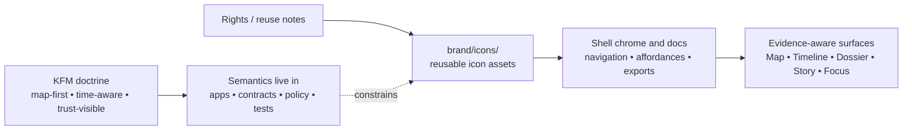

<!-- [KFM_META_BLOCK_V2]
doc_id: kfm://doc/NEEDS-VERIFICATION
title: icons
type: standard
version: v1
status: review
owners: @bartytime4life
created: YYYY-MM-DD
updated: YYYY-MM-DD
policy_label: NEEDS_VERIFICATION
related: [../../README.md, ../README.md, ../../.github/README.md]
tags: [kfm]
notes: [owner derived from global CODEOWNERS fallback; dates/doc_id/policy_label need repo verification]
[/KFM_META_BLOCK_V2] -->

# icons

Reusable KFM icon assets and icon-usage guidance for trust-visible, map-first product surfaces.

[](../README.md)
[](./README.md)
[](#tables)
[](../../.github/CODEOWNERS)

| Field | Value |
|---|---|
| Status | experimental |
| Owners | `@bartytime4life` *(global fallback from `../../.github/CODEOWNERS`; no `brand/`-specific rule confirmed)* |
| Path | `brand/icons/README.md` |
| Repo fit | Directory contract for reusable iconography, size/export guidance, and icon-boundary rules inside `brand/` |
| Current inventory | scaffold-only (`README.md` only) |
| Quick jumps | [Scope](#scope) · [Repo fit](#repo-fit) · [Accepted inputs](#accepted-inputs) · [Exclusions](#exclusions) · [Directory tree](#directory-tree) · [Quickstart](#quickstart) · [Usage](#usage) · [Diagram](#diagram) · [Tables](#tables) · [Task list](#task-list--definition-of-done) · [FAQ](#faq) · [Appendix](#appendix) |

> [!IMPORTANT]
> Current confirmed inventory is scaffold-only: `brand/icons/` presently contains only this README. Treat this file as the directory contract for future icon additions, not as evidence that a committed icon pack already exists.

## Scope

`brand/icons/` is where reusable KFM iconography should live once it is real, reviewable, rights-cleared, and tied to actual consuming surfaces.

Use it to hold icons that support:

- shell navigation and repeated UI affordances
- evidence access, compare, export, search, and other repeated product actions
- trust-visible chrome that needs a reusable icon form without relocating policy or contract meaning into the brand layer

Do not use it to invent semantics. In KFM, icons can help users find evidence, review state, or chronology, but the meaning of those states still lives in governed app, contract, policy, and verification surfaces.

[Back to top](#icons)

## Repo fit

**Path:** `brand/icons/README.md`

**Upstream links:** [`../README.md`](../README.md), [`../../README.md`](../../README.md), [`../../.github/README.md`](../../.github/README.md)

**Sibling surfaces:** [`../logos/`](../logos/), [`../official-seal/`](../official-seal/), [`../source/`](../source/), [`../tokens/`](../tokens/), [`../usage/`](../usage/), [`../LICENSES/`](../LICENSES/), [`../templates/`](../templates/), [`../assets/`](../assets/)

**Downstream links:** [`../../docs/`](../../docs/), [`../../apps/`](../../apps/) *(likely consumers once real icon packs exist; current consumer set is still NEEDS VERIFICATION)*

**Local rule:** if an icon changes how KFM visually signals evidence access, review/correction state, freshness, generalization, or scope, update the adjacent usage or surface docs in the same change stream.

## Accepted inputs

Keep this directory small and reusable.

- canonical icon exports intended for repeated use across docs, app chrome, or governed exports
- size guidance, stroke minima, alignment notes, and optical-balance rules for committed icon sets
- light/dark or filled/outline variants when those variants are part of the approved reusable pack
- icon-specific attribution or reuse notes when the asset itself needs them
- small preview sheets or reference tables that help maintainers choose the right icon without guessing

## Exclusions

Keep neighboring concerns in their own lanes.

- **Logos, wordmarks, and lockups** do not belong here; put them in [`../logos/`](../logos/)
- **Official seals, badges with legal or symbolic standing, or authority marks** do not belong here; put them in [`../official-seal/`](../official-seal/)
- **Editable masters or editor-native working files** do not belong here by default; keep them in [`../source/`](../source/) unless the repo later defines a different split
- **Brand tokens, palette definitions, and shared measurement primitives** do not belong here as source of truth; keep them in [`../tokens/`](../tokens/)
- **Rights and license packets** do not belong here as the primary home; keep them in [`../LICENSES/`](../LICENSES/) and link back
- **One-off screenshots, mockups, pitch art, or exploratory comps** do not belong here; move them to context-heavy docs or evaluation assets
- **Policy meanings, DTOs, evidence semantics, or runtime state definitions** do not belong here; icons may style them, but may never redefine them

> [!CAUTION]
> A polished icon set is not a trust object. It must never outrun provenance, review state, release scope, correction linkage, or citation-bearing evidence.

## Directory tree

### Current confirmed tree

```text
brand/
├── README.md
├── LICENSES/
├── assets/
├── icons/
│   └── README.md
├── logos/
├── official-seal/
├── source/
├── templates/
├── tokens/
└── usage/
```

### Current confirmed state inside `brand/icons/`

```text
brand/icons/
└── README.md
```

<details>
<summary>Illustrative future layout (PROPOSED, not current repo fact)</summary>

```text
brand/icons/
├── README.md
├── system/
│   ├── evidence.svg
│   ├── timeline.svg
│   ├── compare.svg
│   └── export.svg
├── states/
│   ├── stale-visible.svg
│   ├── generalized.svg
│   └── review.svg
└── previews/
    └── README-icon-sheet.svg
```

Use a future subtree like this only after real assets, consumers, rights notes, and review checks exist.
</details>

[Back to top](#icons)

## Quickstart

Inspect first. Add later.

```bash
# Confirm the current icon directory contents
find brand/icons -maxdepth 2 -type f 2>/dev/null | sort

# Inspect sibling brand surfaces before adding or moving assets
find brand -maxdepth 2 -mindepth 1 -type d 2>/dev/null | sort

# Search for current or likely consumers of shared iconography
git grep -nE 'brand/icons|icons/|Evidence Drawer|Focus Mode|compare|timeline|export' -- apps docs packages 2>/dev/null || true

# Surface unresolved placeholders before merge
grep -RIn 'NEEDS VERIFICATION\|YYYY-MM-DD\|kfm://doc/NEEDS-VERIFICATION' brand .github docs apps 2>/dev/null || true
```

```bash
# Optional: once real icon files exist, record digests for review
find brand/icons -type f ! -name README.md -print0 2>/dev/null | xargs -0 shasum -a 256
```

## Usage

Treat `brand/icons/` as a reusable delivery surface, not as the place where trust semantics are authored.

1. Add icons here only when they will be reused by more than one surface or document.
2. Prefer canonical vector sources plus derived exports, rather than multiple unrelated icon copies.
3. Keep icons visually consistent with the rest of `brand/`, but keep their meanings anchored to app, policy, contract, and verification docs.
4. When an icon could be confused with a logo, seal, or legal mark, route it to the correct sibling directory instead of forcing the ambiguity here.
5. Keep small-size legibility visible. KFM surfaces rely on quick recognition under dense UI conditions.

> [!NOTE]
> Good KFM icons should help users find the map, timeline, dossier, story, evidence, compare, review, and export surfaces faster. They should not imply that an answer is reviewed, current, cited, or publishable when the governed system has not established that status.

## Diagram



## Tables

### Current status matrix

| Item | Status | Notes |
|---|---|---|
| `brand/icons/README.md` | **CONFIRMED** | This is the only file currently visible in `brand/icons/` |
| Reusable icon assets under `brand/icons/` | **CONFIRMED: none yet** | Add only when real assets are committed |
| Parent `brand/` scaffold | **CONFIRMED** | Sibling directories exist for logos, seals, source files, tokens, usage, assets, templates, and licenses |
| Brand-specific ownership rule for `brand/icons/` | **UNKNOWN** | No `brand/`-specific rule was confirmed |
| Current fallback owner | **CONFIRMED** | Global `CODEOWNERS` fallback points to `@bartytime4life` |

### Boundary matrix

| Concern | `brand/icons/` may own | Where the source of truth belongs |
|---|---|---|
| Reusable icon exports | yes | `brand/icons/` |
| Icon size sheets and optical-alignment notes | yes | `brand/icons/` |
| Examples of where icons are used | summary here | deeper examples in [`../usage/`](../usage/) |
| Editable source masters | no by default | [`../source/`](../source/) |
| Logos and wordmarks | no | [`../logos/`](../logos/) |
| Official seals / authority marks | no | [`../official-seal/`](../official-seal/) |
| Brand tokens and palette definitions | references only | [`../tokens/`](../tokens/) |
| Licenses and rights packets | references only | [`../LICENSES/`](../LICENSES/) |
| Trust-state meanings (`stale-visible`, `generalized`, `withdrawn`, etc.) | visual treatment only | governed app / contract / policy / test docs |

[Back to top](#icons)

## Task list / definition of done

### Task list

- [ ] Replace KFM meta block placeholders for `doc_id`, `created`, `updated`, and `policy_label`
- [ ] Decide whether `brand/icons/` will hold only shipped exports or both exports and canonical vectors
- [ ] Add the first real icon set only with a confirmed consumer and rights/reuse note
- [ ] Confirm whether any icon-specific usage guide belongs in [`../usage/`](../usage/) or directly in this directory
- [ ] Record size and contrast checks for any icon that appears in dense UI chrome or trust-visible chips
- [ ] Verify that no icon duplicates a logo, seal, or legal mark already owned by a sibling directory
- [ ] Add reciprocal links from consuming docs or app surfaces once real icons are committed

### Definition of done

This README is ready to merge when:

1. the meta block is fully populated with verified repo values
2. the owners line reflects either the current global fallback or a narrower confirmed path owner
3. the tree matches the live branch
4. any committed icon asset has a clear home, reuse note, and at least one real consumer
5. icon guidance does not claim or redefine policy, evidence, or runtime semantics
6. sibling-directory boundaries are clear enough to prevent logos, seals, tokens, and source masters from drifting into `brand/icons/`

## FAQ

### Why does `brand/icons/` need its own README if the directory is empty?

Because the directory already exists and is currently scaffold-only. A directory contract is more useful than a placeholder once real assets begin to land.

### Why separate icons from logos and official seals?

Because KFM already distinguishes reusable brand surfaces from more authority-bearing visual material. Icons are functional affordances; logos and official seals carry different identity and rights burdens.

### Can icons represent trust-visible states?

They can support them visually, but they do not define them. Meanings such as review, generalization, freshness, or correction still live in governed app, contract, policy, and verification materials.

### Where should editable icon masters go?

Default to [`../source/`](../source/) unless the repo later documents a different source/export split.

### Can one-off app-specific icons live here?

Only if they are likely to become reusable across multiple surfaces. If they are single-feature or experimental, keep them with the consuming surface until they prove reusable.

[Back to top](#icons)

## Appendix

<details>
<summary>Verified current repo signals used for this README</summary>

| Signal | What it supports |
|---|---|
| `brand/` exists as a top-level repo directory | This README belongs in a live brand subtree, not a hypothetical one |
| `brand/` currently includes `LICENSES/`, `assets/`, `icons/`, `logos/`, `official-seal/`, `source/`, `templates/`, `tokens/`, `usage/`, and `brand/README.md` | Sibling routing in this README is grounded in the current repo tree |
| `brand/icons/` currently contains only `README.md` | Current inventory is scaffold-only |
| `brand/README.md` already defines `brand/` as the reusable identity layer for governed, map-first surfaces | This README inherits local terminology and boundary rules from the existing parent doc |
| `.github/CODEOWNERS` currently uses `* @bartytime4life` as the global fallback owner | The owners field in this README is grounded, but only at fallback scope |

</details>

<details>
<summary>Open verification items that still need repo-local confirmation</summary>

- whether `brand/icons/` should store only shipped exports or also canonical vector sources
- whether any consuming docs or app surfaces already expect a specific icon naming scheme
- whether future icon packs need separate restricted-handling rules under `brand/LICENSES/`
- whether `brand/usage/` or `brand/tokens/` already contains icon-adjacent material that should be cross-linked here

</details>
